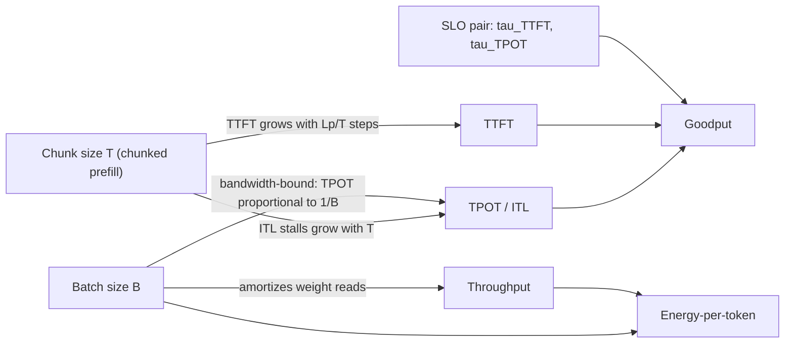
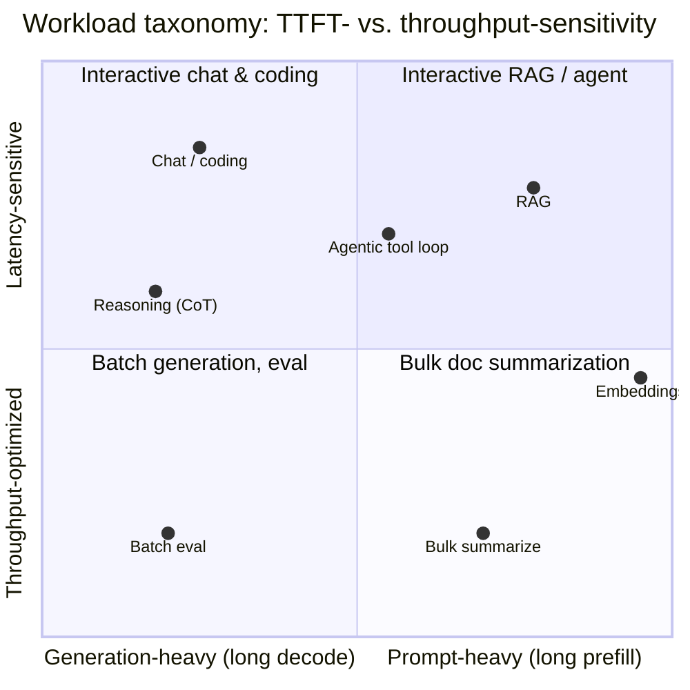
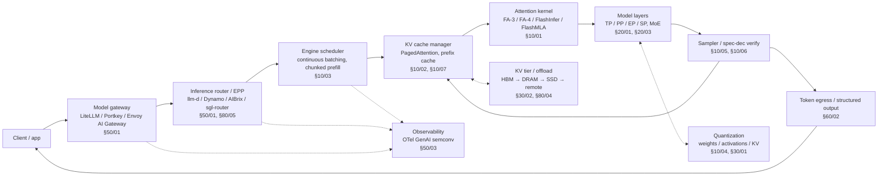

# The Inference Landscape

**After reading this chapter, the reader will be able to:**

- Define the metrics that govern an LLM serving system — TTFT, ITL/TPOT, throughput, goodput, energy-per-token — and reason about how they trade against one another under continuous batching.
- Classify an LLM workload along the axes that drive engine and hardware choice: prompt-heavy vs. generation-heavy, latency- vs. throughput-optimized, single- vs. multi-tenant, dense vs. MoE, and the new long-decode reasoning regime.
- Place any contemporary serving deployment on a map of (a) installed-base hardware, (b) production engine, and (c) industry-standard benchmarks, with enough vocabulary to read the rest of this book.

This chapter is not a tutorial on transformers, attention, or GPUs. The reader is assumed to know what a `Q · Kᵀ` looks like and why `nvidia-smi` exists. The job here is to set up the *language* that the rest of the book speaks: the metrics it uses, the workloads it serves, the hardware those workloads actually land on in 2026, the engines that mediate the two, and the benchmark culture that the field uses to argue with itself.

## 1. Why inference is hard

Training and inference look superficially symmetric — the same parameters, the same kernels, the same hardware — but the engineering problems diverge sharply. Training is a *throughput* problem with a soft latency floor: an iteration that takes 200 ms instead of 180 ms wastes money but does not fail anyone. Inference is a *latency-SLO* problem under throughput pressure with bounded memory.

Three structural facts make inference hard:

1. **Autoregressive decoding is a sequential dependency chain.** Each output token depends on every prior one through the KV cache. Decode therefore reads the entire model's weights from HBM once per token to produce a single output, so per-request decode is bounded by HBM bandwidth, not FLOPs. The classic mitigation — increase batch size — fights against per-request latency SLOs.

2. **Prompt and generation lengths are unbounded and unbalanced.** Prefill cost scales with prompt length $L_P$ and is compute-bound; decode cost scales with generation length $L_G$ and is bandwidth-bound. A single request can put hundreds of thousands of compute-bound prefill tokens in front of a stream of bandwidth-bound decode tokens. The scheduler has to mix these without one phase starving the other.

3. **State is per-request and large.** The KV cache for one long-context request can dwarf the model weights themselves. Memory accounting is not optional bookkeeping — it is the dominant capacity constraint at long context, and the reason PagedAttention and its descendants exist [see §10/02-paged-kv-memory](../10-engine-core/02-paged-kv-memory.md).

The body of techniques covered in this book — chunked prefill, continuous batching, paged KV, prefix caching, speculative decoding, prefill-decode disaggregation, expert parallelism, KV offload — is in the end a long list of answers to a single question: how does one serve heterogeneous request mixes against tight TTFT and per-token latency targets while keeping accelerators near saturation?

## 2. Core metrics

Every serving system reports the same handful of metrics. Their definitions sound mechanical but each one is loaded with assumptions about *where* the measurement is taken, *which percentile* is reported, and *which SLO* the operator cares about. The notation below follows the conventions used by [DistServe](papers.md#distserve), [Sarathi-Serve](papers.md#sarathi-serve), and the de-facto Prometheus metric set exposed by vLLM v1.

### 2.1 Time-to-first-token (TTFT)

TTFT is the latency from request enqueue to the moment the first output token is visible to the client:

$$\text{TTFT} = T_{\text{queue}} + T_{\text{prefill}} + T_{\text{network}}$$

The dominant term is usually $T_{\text{prefill}}$, which scales near-linearly with prompt length $L_P$ and quadratically (in the dense-attention regime) with $L_P$ for the attention sub-layer. TTFT is the SLO that interactive chat, code completion, and tool-augmented agents care about most. A user "feels" the response start when TTFT clears — anything beyond ~1 s for short prompts reads as sluggish.

TTFT is reported as p50, p95, and p99. The percentile choice is not cosmetic: head-of-line blocking, queueing, and KV-memory pressure all show up disproportionately in the tail. Most operators contract on p95 or p99.

### 2.2 Inter-token latency (ITL) and time-per-output-token (TPOT)

ITL is the gap between successive output tokens *during decode* for a single request:

$$\text{ITL}_i = T_{\text{out}}^{(i+1)} - T_{\text{out}}^{(i)}$$

TPOT is conventionally the engine-side average decode latency per output token over the full request. The two are used interchangeably in much of the LLM-serving literature, but two distinctions matter for an engine implementer:

- **TPOT vs. ITL.** TPOT is the engine's intrinsic per-output-token latency averaged over the decode phase; it is computable from total decode time and generated token count. ITL is the per-step gap, reportable as a distribution. When the engine schedules decodes in lockstep iterations of fixed compute cost, ITL is approximately constant and equals TPOT. When the scheduler interleaves chunked prefill with ongoing decodes, ITL spikes during the prefill iterations even though TPOT averages out — this is the stall behavior that Sarathi-Serve was built to eliminate.

- **ITL vs. TBT (time-between-tokens).** TBT is a streaming-UX variant that measures the gap between *visible* tokens reaching the client, including tokenizer coalescence and buffering. [Andes](papers.md#andes) is the canonical reference for QoE-aware scheduling under this notion. TBT is what a user perceives; ITL is what the engine produces.

The human-perceptible-smoothness floor is roughly ITL < 30 ms (≈ 33 tok/s sustained), which matches typical reading speeds. Frontier engines on Blackwell run dense 70B-class models at single-request decode latencies well under 10 ms; reasoning models with extended chain-of-thought (CoT) need ITL kept low because the visible reasoning trace can be tens of thousands of tokens long [see §60/01-test-time-compute](../60-adjacent-workloads/01-test-time-compute.md).

### 2.3 Throughput

Throughput is the aggregate output-token rate across all concurrent requests:

$$\text{Throughput} = \frac{\sum_r L_G^{(r)}}{T_{\text{wall}}}$$

It is a batch-level metric, not a per-request metric. Reporting throughput without specifying batch size, sequence length distribution, model, hardware, and quantization is meaningless — and yet most marketing numbers do exactly that. The standard production caveat is that throughput is usually optimized at a batch size that sacrifices p99 ITL: the two metrics are in tension, and the operator's job is to pick a batch size on the Pareto frontier.

### 2.4 Goodput

Goodput is throughput restricted to requests that meet their SLOs. It was elevated to a first-class objective for LLM serving by [DistServe](papers.md#distserve) (OSDI'24) and refined by [Sarathi-Serve](papers.md#sarathi-serve) (OSDI'24), [SmartSpec / TurboSpec](papers.md#smartspec) for spec-dec-aware accounting, and [JITServe](papers.md#jitserve) for SLO-aware scheduling under imprecise length information.

For an SLO pair $(\tau_{\text{TTFT}}, \tau_{\text{TPOT}})$:

$$\text{Goodput}(\tau_{\text{TTFT}}, \tau_{\text{TPOT}}) = \frac{1}{T_{\text{wall}}}\sum_{r} L_G^{(r)} \cdot \mathbb{1}\!\left[\text{TTFT}^{(r)} \le \tau_{\text{TTFT}} \;\wedge\; \text{p95}(\text{ITL}^{(r)}) \le \tau_{\text{TPOT}}\right]$$

The asymmetry is what makes goodput operationally useful: requests that miss SLO contribute zero to goodput but still consume compute, KV memory, and queue slots. A scheduler that maximizes raw throughput by admitting requests it cannot serve in time produces *negative* marginal goodput. Modern SLO-aware schedulers — SOLA (MLSys'25), [SLOs-Serve](papers.md#slos-serve), JITServe, the Dynamo Planner — optimize a goodput-shaped objective rather than queue length [see §40/03-fairness-slo-routing](../40-multi-tenant/03-fairness-slo-routing.md).

### 2.5 Energy-per-token

At single-rack scale, energy is a cost line. At gigawatt-cluster scale, it is the binding constraint. xAI's Colossus 2 (Memphis) is a 2 GW single-site facility; OpenAI's Stargate is on track for >7 GW across eight US sites; Meta's Hyperion is planned for 5 GW. The capex line is roughly $29B per GW of facility power. At those scales, *joules per output token* is what bounds annual revenue per accelerator.

The metric is straightforward:

$$\text{E}_{\text{tok}} = \frac{P_{\text{accel}}}{\dot{N}_{\text{tok}}} \quad [\text{J/token}]$$

where $P_{\text{accel}}$ is sustained accelerator power in watts and $\dot{N}_{\text{tok}}$ is sustained output-token throughput in tokens/second. A GB200 NVL72 rack delivers ≈ 1.4 EFLOPS FP4 at ≈ 120 kW, giving roughly 12 GFLOPS/W on the marketing line; what matters in production is the model-and-workload-specific tok/J once decode bandwidth, batching efficiency, and KV pressure are factored in. [GreenLLM](papers.md#greenllm) formalized carbon-aware disaggregated serving on heterogeneous GPUs; the broader literature on energy-aware LLM serving is consolidating around the term *energy-per-token* as the shared metric, including 2025 work from EuroMLSys advocating for it as a first-class operational reporting line (arXiv:2506.05811).

### 2.6 The decode roofline and why batch size matters

The single most important relationship in LLM serving is the decode roofline. For a model with $P$ parameters in FP16 (2 bytes/param), serving on an accelerator with HBM bandwidth $W$ GB/s, the per-token decode latency at batch size $B$ is approximately

$$\text{TPOT}(B) \approx \frac{2P}{W \cdot B} \quad \text{(bandwidth-bound regime)}$$

since each forward pass reads the entire weight tensor once but produces one new token per request in the batch. Doubling $B$ halves TPOT — until $B$ reaches the saturation batch $B^*$ where decode becomes compute-bound and the formula crosses into the compute-bound branch of the roofline:

$$B^* \approx \frac{F_{\text{peak}} \cdot 2P / W}{2P} = \frac{F_{\text{peak}}}{W}$$

For an H100 SXM5 (FP16 $F_{\text{peak}} \approx 989$ TFLOPS, $W \approx 3.35$ TB/s), $B^* \approx 295$. In practice $B^*$ is also gated by KV memory, so real workloads sit well below it and stay bandwidth-bound. This is the structural argument for continuous batching, paged KV memory, and the entire family of techniques that try to push effective batch size up without violating SLOs [see §10/03-batching-scheduling](../10-engine-core/03-batching-scheduling.md). The same arithmetic shows why HBM bandwidth gains (H100→H200 is +43%) translate near-linearly into decode throughput at fixed batch size, while raw FP4/FP8 FLOPs gains do not until batch size also grows. The full derivation lives in [§00/02-transformer-arithmetic-roofline](02-transformer-arithmetic-roofline.md).

### 2.7 Metric interactions

The metrics are not independent. Three trade-offs recur throughout the book:

- **TTFT vs. ITL** is mediated by the chunked-prefill token budget $T$. With prompt length $L_P$ and per-iteration cost $\ell(T)$, $\text{TTFT} \approx \lceil L_P/T \rceil \cdot \ell(T)$ while ITL during prefill is bounded by $\ell(T)$. Choosing $T$ small lowers ITL stalls but multiplies TTFT; choosing $T = L_P$ recovers naive prefill (best TTFT, worst stall). Sarathi-Serve fixes $T$ at the knee of $\ell(T)$.

- **Throughput vs. TPOT** is mediated by batch size, as derived above. Engines like [POD-Attention](papers.md#pod-attn) (ASPLOS'25) attack this trade by overlapping prefill and decode at the kernel level, lifting the throughput-vs-TPOT Pareto frontier.

- **Goodput as a composite** absorbs both. It is the only metric whose value cannot be improved by trading SLO violations for headline throughput.

## 3. Workload taxonomy

LLM inference workloads vary along several largely orthogonal axes. The right engine, hardware, and parallelism strategy depend on which combination of axes a deployment falls under.

The axes worth naming:

**Prompt-heavy vs. generation-heavy.** RAG pipelines [see §60/04-rag-infrastructure](../60-adjacent-workloads/04-rag-infrastructure.md) push thousands of tokens of retrieved context through prefill and produce a few hundred tokens of answer; their cost is dominated by TTFT. Code completion is the inverse extreme — short prompt, short generation, but extreme TTFT sensitivity. Bulk summarization is prompt-heavy and *not* TTFT-sensitive (a batch job). The shape of the (prompt, generation) joint distribution determines whether prefill-decode disaggregation [see §20/02-prefill-decode-disagg](../20-distributed-inference/02-prefill-decode-disagg.md) pays off.

**Latency-sensitive vs. throughput-optimized.** Interactive serving (chat, copilots, agentic tool loops) is bound by p95/p99 TTFT and ITL. Batch-style workloads (embeddings refresh, eval suites, synthetic-data generation, RL rollout) tolerate latency for throughput. Engines optimize for one of these by default and reach the other through deployment configuration.

**Single-tenant vs. multi-tenant.** A single-tenant deployment can over-provision KV memory and aggressively warm prefix caches for a known traffic shape. A multi-tenant deployment must enforce fairness (Virtual Token Counter and successors), schedule LoRA adapters [see §40/01-lora-serving](../40-multi-tenant/01-lora-serving.md), partition KV cache across tenants, and isolate prefix-cache hits to prevent cross-tenant cache abuse.

**Memory-bound vs. compute-bound (per phase).** Decode at small batch is bandwidth-bound; prefill at typical $L_P$ is compute-bound. The roofline analysis is per-phase, and the prefill/decode mix determines which side of the roofline a given iteration sits on. Hybrid kernels like POD-Attention let both phases co-resident on the same SM with split resources.

**Dense vs. MoE.** Dense models like Llama-3 series and Qwen2.5-72B serve over the parallelism strategies in [§20/01-parallelism-strategies](../20-distributed-inference/01-parallelism-strategies.md). MoE models like [DeepSeek-V3](papers.md#deepseek-v3-fp8), [Mixtral](papers.md#mixtral-8x7b), [Kimi-K2](papers.md#kimi-k2), Qwen3-Next, and GPT-OSS shift the dominant communication cost from tensor-parallel all-reduce to expert-parallel all-to-all, motivating an entirely separate set of techniques (DeepEP, EPLB, DualPipe, attention-FFN disaggregation) [see §20/03-moe-inference](../20-distributed-inference/03-moe-inference.md). Most production traffic in 2026 is *still dense* by token volume; MoE is the priority lens for those serving frontier-class models.

**Reasoning workloads.** The 2025–2026 generation of reasoning models — DeepSeek-R1, OpenAI o-series, Anthropic extended-thinking modes, Llama-4 with reasoning — qualitatively change the workload. Decode lengths grow from hundreds to tens of thousands of tokens per request as the model emits a chain-of-thought trace before its final answer. This breaks two assumptions baked into the previous generation of serving stacks: (a) that a request's KV cache is bounded in expectation, and (b) that decode time per request is bounded by user attention span. Reasoning workloads also branch — best-of-N, tree-of-thought, graph-of-thought — which makes prefix-cache reuse across siblings a first-class scheduling concern. Engines respond with longer-decode-aware scheduling, sibling-prefix sharing, and branching-aware speculative decoding [see §60/01-test-time-compute](../60-adjacent-workloads/01-test-time-compute.md).

A deployment is rarely a single point in this space. A frontier LLM API simultaneously serves chat, RAG, agentic tool-calling, structured output, and reasoning; the scheduler treats each request as a trajectory in (prompt-len, generation-len, SLO-pair, tenant, adapter) space and routes accordingly.

## 4. What runs on what hardware today

A persistent reader-trap is to read the latest hardware paper and assume the median production token flows over that hardware. It does not. As of mid-2026, the production token mix is dominated by Hopper, with Blackwell ramping and a long tail of older silicon still in service.

**Installed base.** Most production tokens in 2026 still flow over **NVIDIA H100 / H200**. A non-trivial fraction flows over **A100, L40S, and A10G** in cost-optimized or older deployments — A100 80GB is still the workhorse for many enterprise inference clusters, and L40S/A10G remain common for embeddings, rerankers, and small-model serving. **Blackwell (B100 / B200, GB200 / GB300 NVL72)** is in active ramp across every major hyperscaler but has not displaced Hopper as the median accelerator. Only frontier-lab and largest hyperscaler deployments — OpenAI Stargate, xAI Colossus, the GB200/GB300 racks at CoreWeave / Azure / OCI / GCP — can reasonably be called Blackwell-default. Hardware chapters in this book do *not* assume B200 as the median accelerator.

**Memory bandwidth, the metric that matters most for decode**:

| Accelerator | HBM | Bandwidth | FP16 dense | Notes |
|---|---|---|---|---|
| A100 80GB SXM4 | 80 GB HBM2e | 2.04 TB/s | 312 TFLOPS | HBM2e; widely deployed |
| H100 SXM5 | 80 GB HBM3 | 3.35 TB/s | 989 TFLOPS | TMA, WGMMA, FP8 (TE v1) |
| H200 SXM5 | 141 GB HBM3e | 4.8 TB/s | 989 TFLOPS | +43% BW vs H100 at same FLOPs |
| B200 SXM | 192 GB HBM3e | ≈ 8 TB/s | ≈ 2.25 PFLOPS | NVFP4, TE v2, NVLink 5 |
| GB300 (B200 Ultra) | 288 GB HBM3e | 8 TB/s | — | 1.5× FP4 dense vs B200 |
| MI300X | 192 GB HBM3 | 5.3 TB/s | 1.3 PFLOPS | AMD CDNA 3 |
| MI355X (CDNA 4) | 288 GB HBM3e | 8 TB/s | — | Native FP4/FP6 |

The +43% bandwidth from H100 to H200 translates into roughly +43% decode TPS at fixed batch size on bandwidth-bound workloads — the most important practical reason H200 displaced H100 for new decode-heavy clusters in 2024–2025. The ≈2.4× bandwidth jump from H100 to B200 is what underwrites Blackwell's decode-throughput claims, separate from the FP4 marketing line. [See §70/01-nvidia-roadmap](../70-hardware/01-nvidia-roadmap.md) for the full hardware deep-dive, including NVL72 architecture, NVLink generations, the Rubin / Rubin CPX / NVL576 roadmap, and the gigawatt-cluster economics.

The non-NVIDIA picture, briefly: **Google TPU v7 "Ironwood"** (192 GB HBM3e, FP8/INT8, 9216-chip pods over optical-circuit-switched torus) is the first TPU explicitly aimed at inference and serves Gemini and Anthropic's Claude at scale. **AWS Trainium2** is in GA with UltraServer (64 chips); Anthropic is the anchor customer. **AMD MI300X / MI325X / MI355X** is hardware-competitive with Hopper / Blackwell on paper, but the ROCm + vLLM software stack is "production-viable for a known workload, not a drop-in replacement" — meaning enterprises with the engineering capacity to tune AITER kernels and ROCm-Triton can extract the bandwidth, while drop-in OSS workloads can lag. **Cerebras CS-3, SambaNova SN40L, Groq LPU, Microsoft Maia 200, Meta MTIA 300/400, Furiosa RNGD** all serve real production traffic in narrower contexts; covered in [§70/03-asics-hyperscaler](../70-hardware/03-asics-hyperscaler.md) and [§70/04-asics-startup](../70-hardware/04-asics-startup.md). Chapters that depend on hardware specifics (kernel chapter, parallelism chapter) cite both Hopper and Blackwell figures and flag where AMD/TPU/ASIC paths diverge.

## 5. Engine production share

Three open-source serving engines dominate the conversation in 2026. None is a global default. The choice depends on workload, hardware, and deployment context.

**TRT-LLM** (NVIDIA) has the **largest enterprise / NVIDIA-customer footprint of any LLM inference engine.** It is the preferred path for NVIDIA-ecosystem enterprises with NIM, Dynamo, or Triton Server in their stack. TRT-LLM ships dual frontends (the legacy TensorRT plan-based path and a newer PyTorch `_torch` path), a shared C++ batch manager, in-flight batching with chunked context, an attention-plugin family covering FMHA / MMHA-XQA / MLA / FlashMLA / sparse, a `ConfigurableMoE` matrix (Backend × Communication × EPLB) with DeepEP and NVSHMEM bundled, and the broadest production speculative-decoding roster — MTP, EAGLE-3 dynamic tree, Medusa, ReDrafter, lookahead, PARD, DFlash, suffix automaton. TRT-LLM is the engine to pick when the workload is on NVIDIA silicon and the operator wants vendor-tested kernels for every architecture variant they will see [see §80/03-tensorrt-llm](../80-oss-deep-dives/03-tensorrt-llm.md).

**vLLM** (Berkeley → community) **dominates OSS community adoption.** It is the reference implementation for PagedAttention and the broadest engine across non-NVIDIA hardware. The V1 architecture (EngineCore / Scheduler / KVCacheManager / Worker / ModelRunner / Executor) is the most-cloned design in the field; most third-party integrations (LMCache, llm-d, AIBrix, NeMo-RL rollouts, Ray Serve LLM, BentoML, KServe) target vLLM first. vLLM is the engine to pick when the workload is heterogeneous (mixed hardware, varied models, frequent weight rotation), when integration breadth matters more than peak NVIDIA performance, or when the operator wants the largest community surface for kernel and feature flow [see §80/01-vllm](../80-oss-deep-dives/01-vllm.md).

**SGLang** (LMSYS / community) **leads the highest-throughput-at-scale leaderboards as of 2026, notably for [DeepSeek-V3](papers.md#deepseek-v3-fp8) serving** at large EP. SGLang's RadixAttention class hierarchy (RadixCache, HiRadixCache, SWA / Mamba / UnifiedRadixCache, C++ radix tree) is the canonical prefix-cache implementation; the DeepEP-based large-EP path (DeepEPDispatcher, EPLBManager, ElasticEP) is the production-grade open implementation of DeepSeek's serving stack; the Rust `sgl-router` with approximate-radix-tree cache-aware routing is widely cited as the performance reference at scale. SGLang is the engine to pick for frontier-MoE deployments and for workloads where the absolute top of the throughput-at-scale leaderboard matters [see §80/02-sglang](../80-oss-deep-dives/02-sglang.md).

A fourth name worth mentioning: **TGI (Text Generation Inference)** from Hugging Face is no longer accepting major upstream features as of March 2026; HF officially recommends vLLM/SGLang for net-new deployments. Existing TGI deployments remain a non-trivial enterprise installed base, and for those operators the engine is supported, just frozen in feature scope.

The full feature matrix across engines and orchestrators — vLLM, SGLang, TRT-LLM, llama.cpp, MLX, mistral.rs, lmdeploy, MAX, DeepSpeed-MII, TGI — is in [§80/00-overview-comparison](../80-oss-deep-dives/00-overview-comparison.md), with an engine-selection guide. Cluster orchestrators sit one layer above: NVIDIA Dynamo, llm-d, AIBrix, Ray Serve LLM, BentoCloud — covered in [§80/05-nvidia-dynamo](../80-oss-deep-dives/05-nvidia-dynamo.md).

## 6. How the field measures itself

Five families of benchmarks set the public conversation. Each measures something different, and each invites different interpretation pathologies. A staff-level operator should know what each tells you and what each does *not*.

**MLPerf Inference v5.0 / v5.1.** Run by MLCommons; the closest the industry has to apples-to-apples accelerator benchmarks. MLPerf defines four scenarios; for LLMs the two that matter are:

- **Offline** — maximum throughput under a fixed quality target. Measures sustained tokens/s with no latency constraint. Submissions are aggressive on batch size and quantization; numbers represent a *ceiling*, not typical production.
- **Server** — Poisson arrival under a per-query latency constraint, typically TTFT and TPOT. Closer to interactive serving but still uses MLPerf's reference dataset and quality bar.

The active benchmarks in v5.0/v5.1 cover Llama 2 70B, Llama 3.1 405B, Mixtral 8x7B, and Whisper [MLPerf-Whisper-2025]. Submitters optimize heavily for the benchmark — vendor blogs about [MLPerf 5.0](papers.md#nv-mlperf5-0) and [MLPerf 5.1](papers.md#nv-mlperf5-1) (NVIDIA) and [MLPerf 6.0](papers.md#amd-mlperf6) (AMD) all stress this. The numbers are useful for cross-vendor relative comparisons under fixed model and quality, not for predicting production tok/s on a different model or workload.

**HELM** (Holistic Evaluation of Language Models, Stanford CRFM, <https://crfm.stanford.edu/helm/>). HELM evaluates model *quality* across many tasks and reports efficiency as a secondary axis. It is the canonical academic benchmark for "is this model good at things"; for "is this model fast" it is supplementary. HELM is the right citation when an operator is comparing model variants, not engines or hardware.

**OpenLLM Performance Leaderboard** (Hugging Face, <https://huggingface.co/spaces/optimum/llm-perf-leaderboard>). Community-maintained throughput / TTFT / TPOT leaderboard across engines (vLLM, TGI, llama.cpp, etc.) for common open models on common GPUs. The closest the OSS community has to a continuously-updated apples-to-apples engine comparison. Useful for ballparking engine-vs-engine on a known model and hardware; like all leaderboards, not a substitute for benchmarking on the operator's actual workload.

**SpecBench / [SPEED-Bench](papers.md#speed-bench).** Speculative-decoding-specific benchmarks for acceptance rate and end-to-end speedup across task types. SpecBench was the first community benchmark to break out spec-dec performance by task domain (chat, code, summarization, translation); SPEED-Bench (NVIDIA, 2026-02) is a more recent unified benchmark that reports acceptance rate $\alpha$ as workload-conditional and varying 10–25 percentage points across tasks. Cited heavily in the spec-dec and MTP chapters [see §10/05-speculative-decoding](../10-engine-core/05-speculative-decoding.md), [see §10/06-multi-token-prediction](../10-engine-core/06-multi-token-prediction.md).

**Vendor and lab benchmarks.** Artificial Analysis, NVIDIA developer-blog charts, the SGLang and vLLM benchmark suites, the [SGLang K2 large-EP report](papers.md#sglang-k2-128), the [DeepSeek-V3/R1 inference overview](papers.md#ds-inference-overview). These are useful primary sources, but most are vendor-supplied and *should be hedged accordingly* in any textbook or RFP context.

A health-warning that applies to all of these: benchmark numbers depend on hardware generation, batch size, quantization scheme, prompt-length distribution, and software version. A "30% throughput improvement" that holds on Llama-3-8B at FP16 batch 1 on H100 may evaporate on Llama-3-70B FP8 batch 64 on H200, and reverse on B200 with NVFP4. The book's convention is to report numbers with their source workload context; readers should do the same.

## 7. The inference stack: the rest of this book in one diagram

The full path of a request through a production inference stack threads through almost every chapter of this book. The figure below names the layers and points to the chapters that develop each.

A request arrives at a model gateway, which authenticates it, attaches tenant/cost metadata, and forwards to an inference router. The router scores backend engines on prefix-cache affinity, KV utilization, queue depth, and LoRA-adapter affinity, then forwards to a chosen engine. The engine's scheduler selects this request for the next iteration's token budget; the KV cache manager allocates blocks (or finds an existing prefix); the attention kernel runs against those blocks; the rest of the model's layers run under the current parallelism strategy; the sampler emits the next token (possibly verifying multiple speculative tokens); the token streams back through the same path. Observability spans every layer.

The book's chapter ordering follows this flow roughly inside-out: foundations (§00) → engine internals (§10) → KV cache (§30) → distributed (§20) → multi-tenant (§40) → cluster / hardware (§50, §70) → adjacent workloads (§60) → OSS deep-dives (§80) → synthesis (§90).

## Current production state

As of May 2026, production LLM inference stacks at major engines and frontier-lab deployments share a recognizable shape but diverge in the details. The token volume mix is **Hopper-dominant**: most production tokens flow over H100 SXM5 (80 GB HBM3) and H200 SXM5 (141 GB HBM3e), with A100 80GB still serving a non-trivial fraction of cost-optimized and older inference clusters, and L40S / A10G common for embeddings, small-model serving, and inference-tier RAG components. Blackwell — B200 SXM and the GB200 / GB300 NVL72 racks — is in active ramp at every major hyperscaler (CoreWeave, Azure, OCI, GCP) and is the default at frontier-lab production (the OpenAI Stargate buildout, xAI's Colossus 2, Meta's Hyperion). It is *not* the default at the median enterprise. Non-NVIDIA inference is led by Google TPU v7 Ironwood (Anthropic and Gemini at scale), AWS Trainium2 (Anthropic-anchored), and AMD MI300X/MI325X/MI355X (Microsoft, Meta, OCI, with closing software gap on ROCm + vLLM).

The engine layer is **tri-polar**. TRT-LLM owns the largest enterprise / NVIDIA-customer footprint, especially in NIM-fronted deployments and GB200 NVL72 references. vLLM dominates OSS community adoption and is the default integration target for LMCache, llm-d, AIBrix, NeMo-RL, KServe, and Ray Serve LLM; the V1 architecture is the most-cloned design in the field. SGLang owns the highest-throughput-at-scale leaderboards — notably for DeepSeek-V3-class MoE serving on GB200/GB300 racks — through its DeepEP-based large-EP path, RadixAttention prefix cache, and Rust `sgl-router` with approximate-radix-tree cache-aware routing. None of the three is a global default; the choice is workload- and deployment-context-dependent. TGI's effective freeze in March 2026 has consolidated the OSS picture around the vLLM/SGLang pair, with TRT-LLM as the NVIDIA-default. At the cluster layer, NVIDIA Dynamo, llm-d, and AIBrix are the three production-class control planes, all converging on the Kubernetes Inference Gateway API (GIE) substrate with `InferencePool` v1, the Endpoint Picker Protocol, and Envoy `ext-proc` as the conformance contract.

Goodput — not raw throughput — is the metric that frontier-scale deployments contract on. SLO-aware schedulers (SOLA, [SLOs-Serve](papers.md#slos-serve), JITServe), KV-aware routers, and energy-per-token reporting are now standard. The 2024-era mental model of "the engine is the system" has been replaced by "the cluster — gateway, router, EPP, KV-fabric, autoscaler — is the system, and the engine is interchangeable behind a stable connector interface." The rest of this book is the inside view of every layer in that stack.
