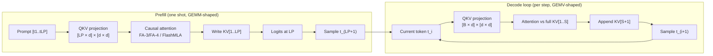

# Transformer Arithmetic and the Roofline Model

**After reading this chapter, the reader will be able to:**

- Count the parameters, FLOPs, and KV-cache bytes of a decoder-only transformer from first principles, and apply the count to specific production models (Llama-3.1-8B/70B, Mistral 7B, DeepSeek-V3 with MLA).
- Compute arithmetic intensity for prefill and for decode, and use the roofline model to predict whether a given (model, batch, context, accelerator) operating point is compute-bound or bandwidth-bound on H100 and B200.
- Read every later chapter of this book through the lens of "where on the roofline does this technique move the operating point" — the question that quietly motivates continuous batching, prefill-decode disaggregation, KV quantization, MQA/GQA/MLA, speculative decoding, and chunked prefill alike.

The previous chapter named the metrics. This one derives the arithmetic that connects those metrics to hardware. The body of techniques cataloged later in the book is, in a strong sense, *the same equation rearranged* — different ways of moving the operating point of a request along a roofline whose axes are FLOPs and HBM bytes. A staff-level engineer has to be able to do this arithmetic on the back of an envelope to size capacity, debug a regression, or evaluate a new technique's claimed speedup.

The notation is fixed for the rest of the book. A decoder-only transformer has $L$ layers, hidden dimension $d$, FFN intermediate dimension $d_{\text{ff}}$, $H$ query heads of head-dimension $d_h = d/H$, $H_{\text{kv}}$ key/value heads (with $H_{\text{kv}} \le H$ in GQA, $H_{\text{kv}}=1$ in MQA), and vocabulary size $V$. Per-token model parameter count is $N$. Batch size is $B$, prompt length is $L_P$, generation length is $L_G$, and the running KV-cache length on a request is $S$. Numerical precision is parameterized by $b$ bytes per element (so FP16/BF16 is $b{=}2$, FP8 is $b{=}1$, NVFP4 is $b{=}0.5$).

## 1. Parameter and FLOP counting from first principles

### 1.1 Parameter count

Most of the parameter count of a modern transformer is in two places: the four projections of self-attention (Q, K, V, output) and the three matmuls of the FFN. Embeddings and norms and biases are vanishing in the limit of large $L$ and $d$.

For one decoder layer in the dense-attention case ($H_{\text{kv}}=H$), the four projection matrices each have shape $[d \times d]$:

$$N_{\text{attn}} = 4 d^{2}.$$

For a SwiGLU FFN (the production-default activation, used by Llama, Mistral, Qwen, DeepSeek), there are three weight matrices: a gate $W_g \in \mathbb{R}^{d \times d_{\text{ff}}}$, an up $W_u \in \mathbb{R}^{d \times d_{\text{ff}}}$, and a down $W_d \in \mathbb{R}^{d_{\text{ff}} \times d}$:

$$N_{\text{ffn}} = 3 \, d \, d_{\text{ff}}.$$

The classic GeLU/ReLU FFN had only two matrices ($d \cdot d_{\text{ff}} + d_{\text{ff}} \cdot d = 2 d d_{\text{ff}}$); SwiGLU adds a third for the gate, so the canonical "$8 d^2$" rule of thumb (assuming $d_{\text{ff}}=4d$, two matmuls) understates SwiGLU FFN size by 50%. For Llama-style models with $d_{\text{ff}} \approx \tfrac{8}{3} d$ (chosen so SwiGLU's three matmuls roughly match the parameter count of a $4d$ vanilla FFN), $N_{\text{ffn}} \approx 8 d^{2}$ and $N_{\text{layer}} \approx 12 d^{2}$. The "$12 L d^2$" rule is therefore a good first-order estimate for production decoder-only models and is the formula most readers will have seen.

The embedding contributes $V \cdot d$ (and another $V \cdot d$ if the unembedding is untied, as in Llama-3 and most modern open models). Norms contribute $O(Ld)$. The total parameter count is

$$N \;=\; L\,(4 d^{2} + 3\,d\,d_{\text{ff}}) \;+\; V \cdot d \;+\; O(Ld) \;\approx\; 12\,L\,d^{2} \quad (d_{\text{ff}} \approx \tfrac{8}{3}d).$$

Worked examples on three reference dense models:

| Model | $L$ | $d$ | $d_{\text{ff}}$ | $H/H_{\text{kv}}$ | $V$ | Layer params | Attn share | FFN share | Embed | Total (counted) |
|---|---|---|---|---|---|---|---|---|---|---|
| Llama-3.1-8B | 32 | 4096 | 14336 | 32/8 | 128256 | 218.1 M | 41.9 M (19%) | 176.2 M (81%) | 525.3 M | ≈ 8.0 B |
| Llama-3.1-70B | 80 | 8192 | 28672 | 64/8 | 128256 | 855.5 M | 150.9 M (18%) | 704.6 M (82%) | 1.05 B | ≈ 69.5 B |
| Mistral 7B v0.3 | 32 | 4096 | 14336 | 32/8 | 32768 | 218.1 M | 41.9 M | 176.2 M | 134.2 M | ≈ 7.2 B |

Two observations land. First, for production dense models the FFN is roughly 80–85% of per-layer parameters; the attention block is the minority by parameter mass even though it is the dominant *kernel-engineering* concern. Second, the embedding tax becomes negligible for 70B+ models but is non-trivial for 7–8B-class models — Llama-3.1-8B's untied 128 K-vocab embedding is 6.6% of the total.

For MoE models the active-vs-total distinction matters and the formula above is misleading if applied to total parameters. DeepSeek-V3 ([DeepSeek-V3-FP8](../papers.md#deepseek-v3-fp8)) has 671 B total parameters but only ~37 B active per forward pass: each token routes through a shared expert plus 8 of 256 routed experts, so the per-token FFN compute is set by the active count. Throughout this chapter the relevant $N$ for FLOP and bandwidth counting is *active parameters per token*, not total parameters; total parameters set the memory budget that the parallelism strategy must accommodate but do not directly enter the per-token roofline. The MoE-specific consequences are developed in [§20/03-moe-inference](../20-distributed-inference/03-moe-inference.md).

### 1.2 FLOP counting

A matmul of shape $[M \times K] \times [K \times N]$ requires $2 M N K$ FLOPs (one multiply and one add per output element, summed over $K$). Every weight-matmul in the transformer follows this rule; element-wise ops (norms, activations, residuals, RoPE, softmax) are $O(\text{tokens} \cdot d)$ and contribute negligibly to FLOPs in the limit of large $d$.

Per layer, per forward pass, on a batch of $B$ requests at sequence position $t$ with KV cache length $S$:

- **Q projection**: $[B \times d] \times [d \times d] \to 2 B d^{2}$ FLOPs.
- **K, V projections** (GQA, $H_{\text{kv}}$ heads): $2 \cdot 2 B d \cdot (H_{\text{kv}} d_h) = 4 B d \cdot (H_{\text{kv}} d_h)$ FLOPs. For dense MHA, $H_{\text{kv}}=H$ and this collapses to $4 B d^2$.
- **Output projection**: $2 B d^{2}$ FLOPs.
- **Attention scores** $QK^{\top}$: per query head, $[B \times d_h] \times [d_h \times S] \to 2 B S d_h$ FLOPs; summed over $H$ heads gives $2 B S H d_h = 2 B S d$.
- **Attention apply** (softmax(QKᵀ) · V): another $2 B S d$ FLOPs.
- **FFN (SwiGLU)**: gate + up + down, $3 \cdot 2 B d \, d_{\text{ff}} = 6 B d \, d_{\text{ff}}$ FLOPs.

Summing,

$$F_{\text{layer}}(B, S) \;\approx\; \underbrace{(4 B d^{2} + 2 B d^{2})}_{\text{Q,K,V,O proj, GQA-collapsed}} \;+\; \underbrace{4 B S d}_{\text{attention}} \;+\; \underbrace{6 B d\,d_{\text{ff}}}_{\text{FFN}}$$

$$\;=\; 2 B \big(3 d^{2} + 3 d\, d_{\text{ff}}\big) \;+\; 4 B S d.$$

The first bracket is *weight-bound* (FLOPs scale as $d^2$, bandwidth scales as the same $d^2$ of weights loaded). The $4 B S d$ term is *KV-bound* (the $K$ and $V$ for all $S$ prior positions must be touched). At small $S$ the weight term dominates; at large $S$ — long context — the attention term dominates. The crossover is at

$$S^{\star} \;\approx\; \frac{3 d + 3 d_{\text{ff}}}{2} \;\approx\; \frac{3(d + d_{\text{ff}})}{2}.$$

For Llama-3.1-8B ($d=4096$, $d_{\text{ff}}=14336$), $S^{\star} \approx 27{,}600$ tokens. For Llama-3.1-70B ($d=8192$, $d_{\text{ff}}=28672$), $S^{\star} \approx 55{,}300$ tokens. Below these context lengths, attention is a minority of decode FLOPs; above them, attention dominates. This is the structural reason long-context inference is its own subfield [see §20/04-long-context-inference](../20-distributed-inference/04-long-context-inference.md).

#### 1.2.1 The 2N rule for decode

For an autoregressive decode step, $B$ tokens (one per request) are processed and the running KV cache provides the history. Multiply through and sum across $L$ layers, ignoring the attention quadratic for now:

$$F_{\text{decode}}(B) \;\approx\; L \cdot 2 B (3 d^{2} + 3 d \, d_{\text{ff}}) \;=\; 2 B \cdot \underbrace{L(3 d^{2} + 3 d\, d_{\text{ff}})}_{\approx\,N_{\text{non-embed}}}.$$

The bracket equals the non-embedding parameter count of the model (since each parameter is a single scalar multiplied by a single vector element and summed). The clean form is

$$\boxed{\;F_{\text{decode}} \;\approx\; 2\,N \cdot B \;\;[\text{FLOPs per decode step}]\;}$$

— "two FLOPs per parameter per token in the batch." This is the famous "$2N$ FLOPs/token" rule. It holds as long as $S \ll S^{\star}$. Above $S^{\star}$ the attention term must be added back.

For prefill, every token in the prompt processes the full attention against all earlier prompt positions:

$$F_{\text{prefill}}(B, L_P) \;\approx\; 2 N B L_P \;+\; 2 L B H d_h L_P^2 \;=\; 2 N B L_P \;+\; 2 L B d L_P^2.$$

The first term — $2 N$ FLOPs per token — is the same weight-bound work as decode, summed over $L_P$ tokens. The second term is the attention quadratic, $O(L_P^2)$ per layer, summed over $L$ layers. For short prompts the linear term dominates; for long prompts the quadratic dominates and explains why prefill TTFT for long-context requests grows superlinearly — the practical headline of every long-context inference paper.

### 1.3 Worked FLOP numbers

For Llama-3.1-70B ($N \approx 70$ B, $d=8192$, $L=80$):

- Decode: $2 \cdot 70 \times 10^9 = 1.4 \times 10^{11}$ FLOPs/token at small $S$. At $B=32$, $4.5 \times 10^{12}$ FLOPs/iter.
- Prefill, $L_P=4096$: $2 \cdot 70 \times 10^9 \cdot 4096 \approx 5.7 \times 10^{14}$ FLOPs (linear term) plus $2 \cdot 80 \cdot 8192 \cdot 4096^2 \approx 2.2 \times 10^{13}$ FLOPs (quadratic). The quadratic is ~4% of the linear term — short-prompt prefill is firmly linear-dominated.
- Prefill, $L_P=128000$: linear term $\approx 1.8 \times 10^{16}$; quadratic $\approx 2.1 \times 10^{16}$. The quadratic now exceeds the linear term: a 128k-context prefill spends more compute on attention than on weight matmuls.

These two regimes — linear-dominated short prefill, quadratic-dominated long prefill — are why MQA/GQA/MLA matter, why sliding-window attention exists, why native sparse attention (NSA, DSA) is being trained into frontier models, and why "long context" deserves its own chapter.

## 2. KV cache memory math

The KV cache is the per-request state that makes autoregressive decoding cheap: each generated token $t_i$ requires the keys and values for *every* prior position to compute attention, but those K and V tensors are computed once at position $i$ and never recomputed. At long context, the KV cache is the dominant memory consumer — often dwarfing the model weights themselves. The arithmetic of KV cache size therefore directly determines the maximum batch size, the maximum context length, and the feasibility of long-context regimes [see §10/02-paged-kv-memory](../10-engine-core/02-paged-kv-memory.md).

### 2.1 Bytes per token derivation

For one token, one layer, dense MHA, with K and V each stored at $b$ bytes per element (FP16 $\to b{=}2$, FP8 $\to b{=}1$):

$$\text{bytes}_{\text{MHA}} \;=\; 2 \cdot b \cdot d \;=\; 2 b H d_h \quad\text{(K and V, full $d$ each)}.$$

Per request, a context of $S$ tokens at $L$ layers therefore needs $2 b L d \cdot S$ bytes. At FP16 ($b{=}2$) the per-layer-per-token figure is $4d$ bytes — every doubling of $d$ doubles cache footprint at fixed precision and head topology.

For GQA with $H_{\text{kv}}$ KV heads (a single K and V shared across $H/H_{\text{kv}}$ query heads):

$$\text{bytes}_{\text{GQA}} \;=\; 2 \cdot b \cdot H_{\text{kv}} d_h.$$

The reduction factor versus full MHA is exactly $H_{\text{kv}}/H$. Llama-3.1 uses $H_{\text{kv}}=8$ across all sizes, so an 8B-class model with $H=32$ has $\tfrac{1}{4}$× the cache of dense MHA, while a 70B-class model with $H=64$ has $\tfrac{1}{8}$×. This is the reason GQA is the production-default for new models in 2024–2026 [see §30/03-attention-variants](../30-kv-cache/03-attention-variants.md).

For MLA (multi-head latent attention, the DeepSeek-V2/V3 design [MLA-V2](../papers.md#mla-v2), [DeepSeek-V3-FP8](../papers.md#deepseek-v3-fp8)), the per-token KV state collapses to a small latent vector $c_{\text{KV}} \in \mathbb{R}^{d_c}$ with $d_c \ll d$, plus a small RoPE-decoupled key component of dimension $d_h^{R}$:

$$\text{bytes}_{\text{MLA}} \;=\; b \cdot (d_c + d_h^{R}).$$

DeepSeek-V3 uses $d_c=512$, $d_h^{R}=64$, giving $1152$ bytes/token/layer at FP16. For comparison, a same-$d$ GQA model with $H_{\text{kv}}=8$, $d_h=128$ would have $4 \cdot 8 \cdot 128 = 4096$ bytes/token/layer. MLA's per-token KV footprint is roughly 28% of an equivalent GQA model and a small fraction of a dense MHA model; this compression is the architectural reason DeepSeek-V3 can serve 64k–128k context with serving-cost competitive with much smaller dense models. The full derivation of the MLA absorption math, where the up-projection is fused into the Q matrices to avoid materializing the full K and V, is in [§30/03-attention-variants](../30-kv-cache/03-attention-variants.md).

A note on sliding-window attention. Mistral 7B v0.1/v0.2 used a 4096-token sliding window: only the last $W = 4096$ K and V entries needed to be retained. KV memory is then bounded by $\min(S, W)$ rather than growing with $S$. Mistral 7B v0.3 dropped the sliding window in favor of full-context GQA, reflecting a community shift toward true long-context support; sliding windows resurfaced in Gemma 3, GPT-OSS, and Qwen3-Next as a *layer-interleaved* design (some layers global, others windowed) rather than as a global cap [see §20/04-long-context-inference](../20-distributed-inference/04-long-context-inference.md).

### 2.2 Worked KV-cache table

Bytes per token (FP16) and total KV-cache footprint at $S = 32{,}768$ and $S = 131{,}072$ tokens, single request:

| Model | $L$ | KV layout | bytes/token/layer | bytes/token | KV at $S{=}32$k | KV at $S{=}128$k |
|---|---|---|---|---|---|---|
| Llama-3.1-8B | 32 | GQA, $H_{\text{kv}}{=}8$, $d_h{=}128$ | 4 096 | 131 072 | 4.3 GB | 17.2 GB |
| Llama-3.1-70B | 80 | GQA, $H_{\text{kv}}{=}8$, $d_h{=}128$ | 4 096 | 327 680 | 10.7 GB | 43.0 GB |
| Llama-3.1-405B | 126 | GQA, $H_{\text{kv}}{=}8$, $d_h{=}128$ | 4 096 | 516 096 | 15.8 GB | 63.0 GB |
| Mistral 7B v0.3 | 32 | GQA, $H_{\text{kv}}{=}8$, $d_h{=}128$ | 4 096 | 131 072 | 4.0 GB | 16.0 GB |
| DeepSeek-V3 (MLA) | 61 | $d_c{=}512$, $d_h^{R}{=}64$ | 1 152 | 70 272 | 2.30 GB | 9.21 GB |

The dense-vs-MLA gap is large at 128k context: a single Llama-3.1-70B request at 128k consumes 43 GB of KV cache, just over half an H100's HBM. A single DeepSeek-V3 request at the same context fits in under 10 GB. This ratio determines how many concurrent long-context requests an engine can hold in memory, and therefore the practical batch size at which decode operates [see §10/02-paged-kv-memory](../10-engine-core/02-paged-kv-memory.md), [see §30/01-kv-compression](../30-kv-cache/01-kv-compression.md).

These numbers are at FP16. KV quantization to FP8, INT8, or INT4 [see §10/04-quantization](../10-engine-core/04-quantization.md) compresses the cache by the bit-ratio; FP8 KV halves the table above, and 4-bit KV (KIVI, KVQuant, TurboQuant) quarters it. The information-theoretic floor is approached by TurboQuant ([2504.19874](https://arxiv.org/abs/2504.19874), Google, ICLR 2026) at ~3.5 bits/channel for parity quality.

## 3. Arithmetic intensity and the compute/bandwidth tradeoff

Arithmetic intensity $I$ is the ratio of FLOPs to bytes of memory traffic for a given operation:

$$I \;=\; \frac{\text{FLOPs}}{\text{bytes moved through DRAM}} \quad [\text{FLOP/byte}].$$

Every operation in an LLM forward pass has its own $I$. The accelerator can execute at most $\min(I \cdot W, F_{\text{peak}})$ FLOPs per second, where $W$ is HBM bandwidth and $F_{\text{peak}}$ is peak compute. The crossover happens at the *ridge point*

$$I_{\text{ridge}} \;=\; \frac{F_{\text{peak}}}{W} \quad [\text{FLOP/byte}].$$

For an H100 SXM5 at FP16 — $F_{\text{peak}} \approx 989$ TFLOP/s, $W \approx 3.35$ TB/s — the ridge is $I_{\text{ridge}}^{\text{H100, FP16}} \approx 295$ FLOP/byte. For a B200 SXM at BF16/FP16 — $F_{\text{peak}} \approx 2.25$ PFLOP/s dense, $W \approx 8.0$ TB/s — the ridge is $I_{\text{ridge}}^{\text{B200, BF16}} \approx 281$ FLOP/byte. At lower precisions the ridge moves: FP8 doubles peak FLOPs at fixed $W$, so FP8 ridge is $\approx 590$ FLOP/byte on H100 and $\approx 562$ FLOP/byte on B200; NVFP4 on B200 doubles it again, to $\approx 1125$ FLOP/byte. Vendor-published peak FLOPs are dense, no-sparsity, no-MUFU-bottleneck; expect 60–80% of these in production at large.

### 3.1 Decode at batch 1: the bandwidth wall

A single-token decode step at $B=1$ executes $\approx 2N$ FLOPs (Section 1.2.1) and reads $\approx N \cdot b$ bytes of weights from HBM (each parameter is fetched once per forward pass; element-wise ops add negligible traffic; KV reads are negligible at small $S$). Therefore

$$I_{\text{decode}}(B{=}1) \;=\; \frac{2N}{N b} \;=\; \frac{2}{b}.$$

At FP16 ($b{=}2$): $I = 1$ FLOP/byte. At FP8 ($b{=}1$): $I = 2$ FLOP/byte. At NVFP4 ($b{=}0.5$): $I = 4$ FLOP/byte. In every case, decode at batch 1 sits 70–600× below the ridge of any contemporary accelerator. **Decode at batch 1 is firmly bandwidth-bound, regardless of accelerator.** It cannot be made compute-bound by buying a faster GPU; it can only be made faster by moving more bandwidth, by batching, or by reducing $N b$ via quantization.

### 3.2 Decode at batch B: weights are shared

Increasing batch size from 1 to $B$ multiplies the FLOP count by $B$ but does not change the bytes moved — the same weight matrices are read once and applied to $B$ different activations. So

$$I_{\text{decode}}(B) \;=\; \frac{2 N B}{N b} \;=\; \frac{2 B}{b}.$$

Arithmetic intensity scales linearly with batch size. The saturation batch size $B^{\star}$ — where decode becomes compute-bound — satisfies $I_{\text{decode}}(B^{\star}) = I_{\text{ridge}}$:

$$B^{\star} \;=\; \frac{b}{2} \cdot I_{\text{ridge}} \;=\; \frac{b \cdot F_{\text{peak}}}{2 W}.$$

At FP16 on H100, $B^{\star}_{\text{H100, FP16}} = (2 \cdot 989)/(2 \cdot 3.35) \approx 295$. At BF16 on B200, $B^{\star}_{\text{B200, BF16}} \approx 281$. These are remarkably similar numbers — the ridge has not moved much between Hopper and Blackwell at the same precision, because vendor scaling preserved roughly the same FLOP/byte ratio. A subtle but important point: $B^{\star}$ is approximately *invariant under precision changes that scale weights and compute together*, because halving $b$ (FP16 → FP8) doubles $F_{\text{peak}}$ at fixed $W$, leaving $B^{\star} = b F_{\text{peak}}/(2W)$ unchanged. NVFP4 weights with NVFP4 compute on B200 still produces $B^{\star} \approx 280$. What lower precision *does* buy is half the bandwidth-bound TPOT at the same $B$ (via the smaller $Nb$ in the latency formula below) and double or quadruple the KV-memory-supported batch — both of which raise the effective operating point on the roofline even though the ridge itself does not move.

This relationship is the structural argument for continuous batching, paged KV memory, and every other technique whose first-order effect is "increase effective $B$." Below $B^{\star}$, decode throughput scales linearly with batch size at fixed bandwidth — doubling $B$ doubles tokens/s. Above $B^{\star}$, throughput is flat in batch and scales with FLOPs. Real production decode runs at $B = 16$–$128$, well below $B^{\star}$, because KV memory is the binding constraint long before compute is. The per-token decode latency formula is therefore

$$\text{TPOT}(B) \;\approx\; \frac{N b}{W \cdot B} \quad (\text{below } B^{\star}).$$

### 3.3 Prefill: arithmetic intensity is the prompt length

For prefill of a prompt of length $L_P$, the compute is $\approx 2 N B L_P$ FLOPs (Section 1.2) and the weight bytes are $\approx N b$ (loaded once, shared across all $L_P$ positions). Therefore

$$I_{\text{prefill}}(B, L_P) \;=\; \frac{2 N B L_P}{N b} \;=\; \frac{2 B L_P}{b}.$$

Even at $B=1$, a 1024-token prompt has $I_{\text{prefill}} \approx 1024$ — well above the ridge on any current GPU at FP16. Prefill is compute-bound. The implication: prefill *wants* GEMM kernels with high tensor-core utilization, not high HBM bandwidth. This is the single asymmetry that motivates prefill-decode disaggregation [see §20/02-prefill-decode-disagg](../20-distributed-inference/02-prefill-decode-disagg.md): a system that mixes prefill and decode is averaging two operating points that prefer different hardware.

Two refinements. First, the prefill arithmetic intensity above ignores the attention quadratic. At very long prompts, attention contributes $4 L B d L_P^2$ FLOPs against $\approx 2 b L H_{\text{kv}} d_h L_P$ KV bytes (each K and V is written once during prefill), so attention prefill at long context has its own — much higher — arithmetic intensity. The dominant question shifts to whether attention kernels can sustain that intensity at long $L_P$, which is the FlashAttention story [see §10/01-attention-kernels](../10-engine-core/01-attention-kernels.md). Second, real prefill kernels do touch KV cache for the new positions being written, so the bytes side of the ratio is higher than the rough approximation; the operating point is still firmly compute-bound, but the constant matters when comparing kernels.

### 3.4 The summary picture

| Phase | $B$ | Approx. arithmetic intensity (FP16) | Operating regime |
|---|---|---|---|
| Decode | 1 | $1$ | strongly bandwidth-bound |
| Decode | 32 | $32$ | bandwidth-bound |
| Decode | 256 | $256$ | approaching ridge on H100 and B200 at BF16 |
| Decode | 1024 | $1024$ | compute-bound on most accelerators |
| Prefill | 1, $L_P{=}256$ | $256$ | near the ridge |
| Prefill | 1, $L_P{=}4096$ | $4096$ | strongly compute-bound |
| Prefill | 32, $L_P{=}4096$ | $131072$ | far above ridge; dominated by attention quadratic at long $L_P$ |

Prefill ≈ GEMM (compute-bound, wants matmul throughput). Decode ≈ GEMV (bandwidth-bound, wants HBM throughput). The rest of this book is largely a catalog of techniques for reshaping these two phases so that production hardware sits closer to its ridge.

## 4. The roofline model

The roofline model ([Williams et al. 2009](https://dl.acm.org/doi/10.1145/1498765.1498785)) plots achievable throughput as a function of arithmetic intensity. On a log-log axis, the achievable curve is

$$\text{Achievable}(I) \;=\; \min\!\big(I \cdot W,\; F_{\text{peak}}\big),$$

a line of slope 1 (in log-log) up to $I_{\text{ridge}} = F_{\text{peak}}/W$, flat thereafter. Any kernel with arithmetic intensity $I$ executes at most at the height of this curve. The roofline model is *an upper bound, not a prediction*; real kernels also lose throughput to instruction issue, register pressure, special-function units (the MUFU bottleneck on Blackwell), and host overhead — but the bound is sharp enough to be useful as a sizing tool and a sanity check on claimed speedups.

For LLM inference, the relevant roofline plots two ceilings (H100 and B200) and three operating points (decode at $B$, prefill at $L_P$). The figure below uses BF16/FP16 numbers; the picture shifts up and right at FP8 and NVFP4.

```
                                     log(achievable FLOP/s)
                            B200 ridge ┌────────────────────────────────  2250 TF/s   (B200 BF16 peak)
                                       │
                            H100 ridge │·····────────────────────────────  989  TF/s   (H100 FP16 peak)
                                       │·    .
                                       │·   .
                                       │·  .             .  PREFILL (L_P = 4096)
                                       │· .            .                  ← I ≈ 4096, far above both ridges
                                       │·.           .                       (compute-bound on either GPU)
                                       │.          .
                                       │         .                        .  DECODE B=256  (I ≈ 256)
                                       │        .                       .   ← near both ridges at BF16; well below at FP8/FP4
                                       │       .                      .
                                       │      .                     .
                                       │     .   slope = 8 TB/s  .       .  DECODE B=32  (I ≈ 32)
                                       │    .                  .       .
                                       │   .                 .       .    .  DECODE B=1   (I ≈ 1)
                                       │  .   slope=3.35 TB/s        .   ← deeply BW-bound on every GPU
                                       │ .
                                       │.
                                       └─────┬──────┬──────┬──────┬────  log(I, FLOP/byte)
                                             1      32     256   ridge
```

The slopes encode bandwidth: H100 at 3.35 TB/s gives $\approx 3.35$ TFLOP/s per FLOP/byte of intensity; B200 at 8.0 TB/s gives $\approx 8.0$ TFLOP/s per FLOP/byte. The ridge points fall at $I \approx 295$ (H100 FP16) and $I \approx 281$ (B200 BF16). Decode at $B{=}1$ achieves only $\approx 3.35$ TFLOP/s on an H100 — a fraction of a percent of peak. Decode at $B{=}256$ approaches both ridges at BF16, but if precision drops to FP8 or NVFP4 the ridges climb and the same $B{=}256$ operating point sits well inside the bandwidth-bound region again. Prefill at $L_P{=}4096$ sits well above either ridge regardless of precision and is bottlenecked by tensor-core throughput.

The roofline is the lens through which the rest of the book reads. Every technique in the chapters that follow either (a) raises the operating-point intensity (continuous batching, prefix caching, speculative decoding), (b) raises the ceiling at fixed precision (FA-3/FA-4 attention kernels, fused norms), (c) lowers $b$ (FP8/NVFP4 quantization), or (d) decouples the two phases onto hardware sized for each (prefill-decode disaggregation, Rubin CPX prefill GPUs, Groq LPX decode chips [see §70/01-nvidia-roadmap](../70-hardware/01-nvidia-roadmap.md)).

## 5. Prefill vs. decode anatomy

The two phases of an autoregressive generation differ at every level — input shape, kernel shape, memory access pattern, scheduling unit. A scheduler that does not understand the difference cannot meet TTFT and ITL simultaneously [see §10/03-batching-scheduling](../10-engine-core/03-batching-scheduling.md). The arithmetic above explains why; the anatomy below grounds it in the kernel calls an engine actually issues.

### 5.1 Prefill phase

A prompt $[t_1, \ldots, t_{L_P}]$ enters the engine as a single forward pass that processes all $L_P$ positions in parallel. The Q, K, V projections are GEMMs of shape $[L_P \times d] \times [d \times d]$. The attention is a single large $[L_P \times d_h] \times [d_h \times L_P]$ matmul per head, masked to causal — flash-attention's natural shape. The KV pairs for all $L_P$ positions are computed and written into the cache. The output is the logit distribution at position $L_P$, from which the first generated token $t_{L_P+1}$ is sampled.

Compute character: GEMM-dominated, compute-bound, attention quadratic at long context. Arithmetic intensity is on the order of $L_P$ (Section 3.3). A single H100 at 989 TFLOP/s FP16 fully utilized would take $\approx 0.58$ ms to prefill 1024 tokens of a 70B model ($2 \cdot 70 \times 10^9 \cdot 1024 / 989 \times 10^{12}$); in practice prefill achieves 60–75% of peak depending on kernel and prompt distribution.

Memory requirement: the entire prompt's KV cache must be allocated before decode can begin. For a 128k-context Llama-3.1-70B request, that is 43 GB of cache reserved in HBM by the time the first token is emitted — just over half of an H100's 80 GB. This is the operational reason engines limit max-context per request and why long-context regimes need techniques like chunked prefill, KV offload, or sparse attention to remain feasible.

### 5.2 Decode phase

Decode runs as an autoregressive loop. Each iteration processes one new token per active request (so a batch of $B$ requests issues $B$ tokens per step). The Q projection is a small GEMM of shape $[B \times d] \times [d \times d]$ — at $B=1$, this is a GEMV. The attention reads the entire KV cache up to the current position $S_i$ (per request), computing $QK^{\top}$ as $[B \times d_h] \times [d_h \times S]$ and apply as $[B \times S] \times [S \times d_h]$. After projection and FFN, one token is emitted per request and the KV cache is extended by one position.

Compute character: GEMV at small $B$, GEMM at larger $B$ but with one of the inner dimensions equal to 1 in the position axis. Bandwidth-bound until $B$ approaches $B^{\star}$. Arithmetic intensity scales as $B$ for the weight-matmul part and is held down by the KV-read part as $S$ grows.

Memory requirement: each step touches the entire KV cache *every layer*. At $S = 32{,}768$ tokens on Llama-3.1-70B, that is 10 GB read per step, or $\approx 3$ ms on H100 just for KV traffic at 3.35 TB/s — potentially exceeding the weight-load time and dominating the per-step latency. This is why long-context decode is a different regime from short-context decode: above $S^{\star}$ (Section 1.2), the attention term overtakes the weight term and the per-step bandwidth cost is no longer constant in $S$. KV compression and KV-aware kernels [see §30/01-kv-compression](../30-kv-cache/01-kv-compression.md), [see §10/01-attention-kernels](../10-engine-core/01-attention-kernels.md) attack exactly this.



The key invariant the diagram captures: decode reads the entire KV cache every step. A 128k-context Llama-3.1-70B request reads 43 GB per decode step — irrespective of how fast the weights load — which sets a hard floor on per-step latency at long context. KV compression, sparse attention (NSA/DSA), and tiered offload all exist to break this scaling.

## 6. Worked numbers for major models

The arithmetic above turns into concrete numbers when applied to specific (model, hardware, batch, context) tuples. The worked examples here are back-of-envelope estimates using only the model size, HBM bandwidth, peak FLOPs, and the formulas already derived. Production engines reach 60–85% of these figures depending on kernel maturity and the long tail of overheads not modeled. Vendor-supplied peak-FLOP numbers should be hedged accordingly throughout.

### 6.1 Llama-3.1-8B on a single H100 SXM5

Model: $N \approx 8.0$ B, FP16, 16 GB weights. Fits with room for ~64 GB of KV cache.

- **Decode at $B{=}1$, $S \ll S^{\star}$:** $I \approx 1$ FLOP/byte; per-token latency $\approx N b / W = 16 \times 10^9 / 3.35 \times 10^{12} \approx 4.8$ ms.
- **Decode at $B{=}256$, $S{=}4096$:** $I \approx 256$, just below H100 FP16 ridge (295). Per-token latency still dominated by bandwidth: same ≈4.8 ms per step, divided across 256 requests $\Rightarrow$ aggregate $\approx 53{,}000$ tok/s in the limit.
- **Saturation batch $B^{\star} \approx 295$.** KV at $S{=}4096$ uses $4096 \cdot 131{,}072 \approx 0.54$ GB/request, so 64 GB of cache supports $\sim 120$ concurrent 4k-context requests — KV is the binding limit at this context, not compute.
- **Prefill at $L_P{=}1024$:** compute-bound; $2 N L_P = 1.6 \times 10^{13}$ FLOPs $\to 16$ ms at peak, ≈ 22 ms in practice.

### 6.2 Llama-3.1-70B on H100 (TP=2)

Model: $N \approx 70$ B, FP16, 140 GB. Does not fit in one 80 GB H100 — minimum deployment is two GPUs (TP=2 leaves ~10 GB/GPU for KV) or H200 single-GPU (141 GB) or quantized to FP8 (70 GB).

- **Decode at $B{=}1$, $S \ll S^{\star}$, TP=2:** weights are sharded across 2 GPUs at 3.35 TB/s each; effective bandwidth for weight-reads is $2 W = 6.7$ TB/s (each GPU reads its half-shard concurrently). Per-token latency $\approx N b / (2 W) = 140 \times 10^9 / 6.7 \times 10^{12} \approx 21$ ms. In practice, all-reduce after the FFN and attention adds ~3–5 ms per layer-step on NVLink-4 at 900 GB/s, raising single-token latency to ~30–40 ms — the rough empirical figure for batch-1 decode of a 70B FP16 model on an H100 pair.
- **Decode at $B{=}32$, TP=2:** $I \approx 32$, still bandwidth-bound. Per-step time roughly the same as $B{=}1$, aggregate $\approx 800$ tok/s. KV at $S{=}4096$ uses 1.3 GB/request, feasible up to ~12 concurrent requests at 16 GB free per GPU.
- **Decode on H200 SXM5 single-GPU:** 141 GB HBM3e at 4.8 TB/s; weights fit at FP16. $\text{TPOT}(B{=}1) \approx 140 \times 10^9 / 4.8 \times 10^{12} \approx 29$ ms — slightly worse than TP=2 H100 because there is no second GPU's bandwidth to amortize across, but with no all-reduce overhead. The +43% bandwidth from H100 to H200 buys decode TPS proportionally on bandwidth-bound workloads, which is the practical reason H200 displaced H100 for new decode-heavy inference clusters in 2024–2025.

### 6.3 Llama-3.1-70B on a B200

B200: 192 GB HBM3e, 8 TB/s, ~2.25 PFLOP/s BF16, ~4.5 PFLOP/s FP8 dense. Weights at FP16 fit comfortably; FP8 weights (70 GB) leave 122 GB for KV cache.

- **Decode at $B{=}1$, FP16:** $\text{TPOT} \approx 140 \times 10^9 / 8.0 \times 10^{12} \approx 17.5$ ms. About 1.7× faster than H200 single-GPU on the same workload, matching the bandwidth ratio.
- **Saturation batch $B^{\star}_{\text{B200}} \approx 281$** (across BF16, FP8, NVFP4 — see Section 3.2 invariance).
- **Decode at $B{=}256$, FP8, $S{=}8192$:** $I \approx 512$ FLOP/byte, near the FP8 ridge of $\approx 562$ FLOP/byte. Per-token latency ≈ $70 \times 10^9 \cdot 1 / (8.0 \times 10^{12}) \approx 8.75$ ms; aggregate $\approx 29{,}000$ tok/s achievable in principle. KV at $S{=}8192$ uses $8192 \cdot 327{,}680 \approx 2.7$ GB/request, so 122 GB supports $\sim 45$ concurrent requests — KV-limited well before compute.

### 6.4 DeepSeek-V3 on 8× H100 with EP

DeepSeek-V3: 671 B total parameters, 37 B active per token, MoE with 256 routed experts (top-8) plus 1 shared expert, 61 layers, MLA. The standard production deployment is 8× H100 with expert-parallel sharding [see §20/03-moe-inference](../20-distributed-inference/03-moe-inference.md).

- **Active parameter FLOP count:** decode ≈ $2 \cdot 37 \times 10^9 = 7.4 \times 10^{10}$ FLOPs/token — roughly 70B-class compute per token, despite the much larger total parameter count.
- **Memory bandwidth:** at FP8, the active weights are $\approx 37$ GB; in EP=8, each GPU loads only its sharded experts plus the shared experts and attention/embedding (~5–8 GB/GPU). The bandwidth side of the roofline is set by the slowest of (a) per-GPU weight loads, (b) MLA cache reads, (c) all-to-all expert dispatch over NVLink.
- **MLA KV cache:** 70 KB/token at FP16; at $S{=}32$k that is 2.30 GB/request — half of GQA-equivalent. This is what makes the production batch sizes that DeepSeek's serving stack sustains feasible on commodity 8× H100 nodes; DeepSeek's own [inference-system overview](https://github.com/deepseek-ai/open-infra-index/blob/main/202502OpenSourceWeek/day_6_one_more_thing_deepseekV3R1_inference_system_overview.md) reports their daily-traffic numbers at scale.
- **Expert routing overhead:** all-to-all dispatch and combine for 8-of-256 routing adds 5–15% of decode time depending on imbalance and DeepEP kernel choice, which is a separate roofline regime that lives in the MoE chapter.

The full hardware spec table — Hopper, Blackwell, Rubin, Rubin CPX, Groq LPX, MI300X/MI355X, TPU v7 Ironwood, Trainium2/3 — is in [§70/01-nvidia-roadmap](../70-hardware/01-nvidia-roadmap.md). The numbers above use H100 SXM5 and B200 SXM as reference points; the same arithmetic applied to other accelerators gives an immediate first-order capacity estimate.

## 7. Implications for engine design

The arithmetic in this chapter is the first-order explanation for almost every design decision in the rest of the book. Each major technique is, viewed through the roofline, a way of moving operating points.

- **Continuous batching** raises $B$ without violating per-request SLOs by mixing requests at different token positions in the same iteration. First-order effect: arithmetic intensity rises linearly with $B$, decode operating point climbs the bandwidth slope toward the ridge. Required for any serious production throughput [see §10/03-batching-scheduling](../10-engine-core/03-batching-scheduling.md).

- **Prefill-decode disaggregation** physically separates the compute-bound prefill operating point from the bandwidth-bound decode operating point onto resources sized for each. Splitwise → DistServe → TetriInfer → Mooncake → Dynamo lineage. Hardware embodiment in 2025–2026: NVIDIA's Rubin CPX prefill GPU (GDDR7-backed, compute-tilted) and the Vera-Rubin NVL144 CPX rack [see §20/02-prefill-decode-disagg](../20-distributed-inference/02-prefill-decode-disagg.md), [see §70/01-nvidia-roadmap](../70-hardware/01-nvidia-roadmap.md).

- **Chunked prefill** (Sarathi → Sarathi-Serve [Sarathi-Serve](../papers.md#sarathi-serve), DeepSpeed-FastGen Dynamic SplitFuse [DS-FastGen](../papers.md#ds-fastgen)) bounds the per-iteration token budget so a long prefill is split across many iterations, with decodes piggybacking in the unused token budget. First-order effect: the prefill operating point is held near a chosen intensity that approximates the ridge — neither far above (wasting compute) nor below (wasting bandwidth). Smooths TTFT spikes [see §10/03-batching-scheduling](../10-engine-core/03-batching-scheduling.md).

- **KV quantization** (FP8, INT8, INT4 KV cache; KIVI, KVQuant, TurboQuant) reduces the bytes-moved term in the attention phase, raising arithmetic intensity for long-context decode. First-order effect: at $S \gg S^{\star}$, the per-step KV-read bandwidth is the bottleneck, and halving $b$ for KV halves that bandwidth cost [see §10/04-quantization](../10-engine-core/04-quantization.md), [see §30/01-kv-compression](../30-kv-cache/01-kv-compression.md).

- **Speculative decoding** generates multiple draft tokens per verification step and amortizes the $N \cdot b$ weight-load cost over the accepted tokens. First-order effect: for accepted-token rate $\alpha$ and proposed length $k$, the effective batch grows by a factor of $(1-\alpha^{k+1})/(1-\alpha)$ — equivalent to an effective $B$ multiplier without scheduling additional concurrent requests. The acceptance accounting and verify-step cost are derived in detail in [§10/05-speculative-decoding](../10-engine-core/05-speculative-decoding.md).

- **MQA / GQA / MLA** reduce the per-step KV-read bandwidth in attention by a factor of $H/H_{\text{kv}}$ (for GQA) or by collapsing K and V into a small latent (MLA). First-order effect: the long-context decode regime — where attention dominates per-step bytes — gets pushed out by the same factor in $S$. MLA's $\sim 32\times$ KV compression versus dense MHA is what makes 64k-context DeepSeek-V3 serving practical [see §30/03-attention-variants](../30-kv-cache/03-attention-variants.md).

- **Prefix caching** (RadixAttention, LMCache, Mooncake KV store) avoids re-computing the prefill of shared prefixes — system prompts, RAG-retrieved context, multi-turn chat history. First-order effect: the prefill operating point's compute cost is replaced by a KV-load cost from a tiered cache, which can be read at HBM, DRAM, NVMe, or remote bandwidth depending on hit tier. For chat workloads this is the single largest win in production cost-per-token [see §10/07-prompt-prefix-caching](../10-engine-core/07-prompt-prefix-caching.md), [see §30/02-kv-tiered-offload](../30-kv-cache/02-kv-tiered-offload.md).

These are not separate techniques to choose between. A modern production engine layers all of them — paged KV memory underneath continuous batching with chunked prefill, FP8 weights and FP8 KV, prefix caching across the cluster, GQA or MLA architecturally, speculative decoding via MTP or EAGLE-3 drafters. The compounding is what makes 2026-era serving stacks 10–50× more throughput-efficient per accelerator-hour than 2022-era stacks at comparable model quality. The roofline arithmetic predicts none of these multipliers individually with high precision; what it does is make clear *why each one helps and where it stops helping*, which is what an engineer needs to evaluate the next technique that comes along.

## Current production state

As of May 2026, every production LLM serving stack is built around the arithmetic in this chapter, whether or not the documentation makes it explicit. vLLM V1, SGLang, and TRT-LLM all default to continuous batching with chunked prefill on; all three use paged KV memory; all three support FP8 (and increasingly NVFP4 on Blackwell) weights and FP8 KV; all three integrate or ship a speculative-decoding family. The "2N FLOPs per token" rule is the back-of-envelope tool every capacity planner uses, and the saturation batch $B^{\star} \approx F_{\text{peak}}/W$ relationship is the structural argument behind the standard practice of sizing decode replicas at $B = 32$–128 (well below $B^{\star}$ but at the practical limit set by KV memory and SLO).

The ridge points have not moved much in absolute FLOP/byte from Hopper to Blackwell at the same precision — both H100 and B200 sit near $I_{\text{ridge}} \approx 280$–295 FLOP/byte at FP16/BF16. What has shifted is the scale at lower precisions: NVFP4 on Blackwell pushes the ridge to $\approx 1125$ FLOP/byte, far beyond any practical batch size, which is why production deployments on B200 and GB200/GB300 NVL72 use NVFP4 weights and FP8 KV with batch sizes much closer to the KV-memory ceiling than to the compute ceiling. Decode on those clusters remains bandwidth-bound at typical operating batches; prefill remains compute-bound and benefits more from the FP4 ceiling lift than decode does. The hardware industry's response to this asymmetry — Rubin CPX as a GDDR7-backed prefill-tilted accelerator, Groq LPX as an SRAM-only decode-tilted accelerator — is the literal physical embodiment of the prefill/decode operating-point split derived above.

The equation at the heart of this chapter — TPOT $\approx N b / (W B)$ in the bandwidth-bound regime — also explains why frontier labs increasingly contract on bandwidth, not FLOPs, when sizing inference clusters. HBM4 supply allocation is now reportedly the binding constraint on 2026 H2 capacity buildouts at every major hyperscaler (per multiple secondary sources, not yet confirmed by primary memory-vendor disclosures). The roofline arithmetic that opens this book is, in 2026, the arithmetic the cluster economists do too.
