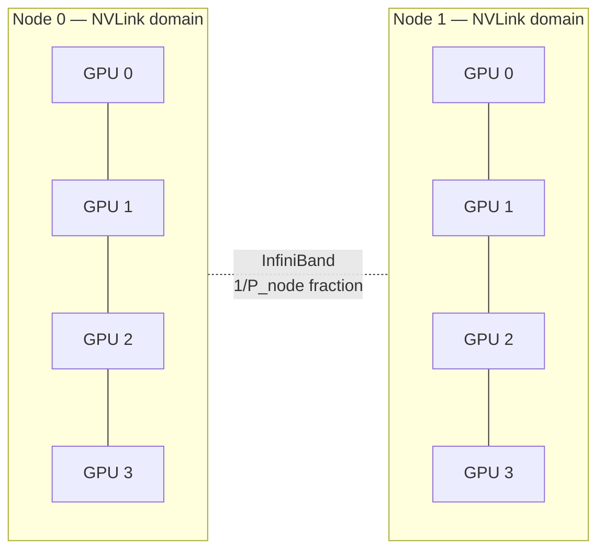

# Collectives and Communication Primer

**After reading this chapter, the reader will be able to:**

- Define the four collective operations that dominate LLM inference traffic — all-reduce, all-gather, reduce-scatter, all-to-all — name the data-flow shape of each, and quote the per-GPU byte volume each moves as a function of process count $P$ and message size $N$.
- Apply the latency–bandwidth model $T_{\text{comm}}(m) = \alpha + m/\beta$ to predict whether a given collective is bandwidth- or latency-bound on a given fabric, and decide between ring and tree algorithms accordingly.
- Read the rest of the book through the NVLink-domain-versus-InfiniBand split: which parallelism strategies fit inside one NVLink domain, why expert parallelism's all-to-all is the most punishing collective in production LLM serving, and why prefill–decode disaggregation introduces a new point-to-point primitive (KV transfer) that is *not* a collective.

The previous three foundation chapters introduced metrics ([§00/01-inference-landscape](01-inference-landscape.md)), the arithmetic that maps requests to bytes and FLOPs ([§00/02-transformer-arithmetic-roofline](02-transformer-arithmetic-roofline.md)), and the GPU itself ([§00/03-gpu-hardware-primer](03-gpu-hardware-primer.md)). This chapter closes the foundation block with the missing axis: the *fabric*. Once a model exceeds the HBM of one accelerator — Llama-3.1-70B at FP16 needs 140 GB; DeepSeek-V3 at FP8 needs ~336 GB — every iteration's compute is interleaved with cross-GPU traffic. Hardware numbers reused below (NVLink and InfiniBand bandwidths, HGX H100 and NVL72 topologies, NVSwitch) come from [§00/03-gpu-hardware-primer](03-gpu-hardware-primer.md) and are not reproduced.

## 1. Why distributed communication matters for LLM inference

LLM inference at scale is *distributed* inference. Single-GPU inference is a niche case in 2026 — small open-weight models, embeddings, edge. Every dense 70B-class model in interactive serving, every frontier MoE (DeepSeek-V3, Kimi-K2, Llama-4 Maverick, GPT-OSS, Qwen3-235B), every long-context reasoning workload is multi-GPU, and the *shape* of inter-GPU traffic is dictated by the parallelism strategy that splits the model.

Each parallelism strategy maps onto a specific collective:

- **Tensor parallelism (TP)** shards a row- or column-parallel matmul across $T$ GPUs and combines partial results with an **all-reduce** at the layer boundary. Activation tensors are small (kilobytes to a few megabytes), but TP sits on the critical path of every layer.
- **Pipeline parallelism (PP)** assigns layer ranges to different GPUs and **point-to-point** sends the activation tensor at each stage boundary — one tensor per micro-batch, amenable to inter-node InfiniBand.
- **Sequence parallelism (SP)** further shards the sequence dimension under TP, adding **all-gather** + **reduce-scatter** pairs around layer-norm and dropout regions.
- **Expert parallelism (EP)** scatters tokens to expert-holding GPUs with an **all-to-all** dispatch, runs experts locally, and combines the outputs back with a second **all-to-all**.
- **Data parallelism (DP)** in inference is mostly trivial — independent replicas — but composes with the others in hybrid layouts.

Time-per-iteration in a distributed engine is therefore not "kernel time" but "kernel time plus communication time, minus whatever overlap the schedule achieves." Four downstream facts recur throughout the rest of the book:

1. **TP prefers an NVLink domain.** TP all-reduces are synchronous and on the critical path; pushing TP across InfiniBand (IB) typically multiplies per-layer time by 5–10×.
2. **PP can tolerate IB.** PP's point-to-point send is one tensor per micro-batch; IB latency in the 5–10 μs range is hidden by the next stage's compute under pipelining.
3. **MoE EP is the hardest collective.** All-to-all moves $N$ bytes per GPU regardless of $P$ and gets no bandwidth-amortizing identity. Production MoE engines (DeepSeek's [DeepEP](../papers.md#deepep), SGLang large-EP, vLLM Wide-EP, TRT-LLM Wide-EP) are essentially custom all-to-all libraries.
4. **Prefill–decode disaggregation introduces a new primitive.** The KV cache produced on a prefill GPU has to reach a decode GPU — point-to-point, request-keyed, one-shot per request. [NIXL](../papers.md#nixl), [Mooncake](../papers.md#mooncake-store) Transfer Engine, [Perplexity TransferEngine](../papers.md#perplexity-te), and UCCL fill this slot.

This chapter is a *primer*. The full parallelism story is in [§20/01-parallelism-strategies](../20-distributed-inference/01-parallelism-strategies.md); the full MoE-EP story (DeepEP, EPLB, DualPipe, AFD, two-batch overlap) is in [§20/03-moe-inference](../20-distributed-inference/03-moe-inference.md); the full PD-disagg story is in [§20/02-prefill-decode-disagg](../20-distributed-inference/02-prefill-decode-disagg.md); the networking-fabric chapter (IB NDR/XDR, Ultra Ethernet, UALink, NVLink Fusion, GPUDirect, CPO photonics) is [§70/05-networking-fabric](../70-hardware/05-networking-fabric.md).

## 2. The four key collectives

Notation. There are $P$ processes (GPUs) indexed $i \in \{1, \dots, P\}$. Each GPU's tensor has size $N$ bytes where the unit makes sense — for all-gather, $N/P$ bytes per GPU input; for reduce-scatter, $N$ bytes per GPU input. The reduction operator $\bigoplus$ is almost always elementwise addition.

### 2.1 All-reduce

GPU $i$ starts with $x_i$. After all-reduce, every GPU holds the same reduced tensor:

$$y \;=\; \bigoplus_{i=1}^{P} x_i, \qquad \text{GPU } i \text{ ends with } y \text{ for all } i.$$

The canonical inference use case is **TP**: a row-parallel matmul produces partial results $x_i$ on each GPU, and an all-reduce sums them into the layer's output activation. The all-reduce sits on the critical path of every layer; its latency is part of every decode token's TPOT.

The bandwidth-optimal implementation (ring all-reduce, derived in §3) sends and receives $2(P-1)/P \cdot N$ bytes per GPU, asymptoting to $\approx 2N$ — *independent of $P$*. This independence is why all-reduce scales gracefully.

### 2.2 All-gather

GPU $i$ starts with a shard $x_i$ of size $N/P$ bytes; after all-gather, every GPU holds the concatenation $[x_1, \dots, x_P]$ of size $N$. Inference use cases: gathering KV shards in MQA/GQA when KV is sharded over heads ([§30/03-attention-variants](../30-kv-cache/03-attention-variants.md)), the second half of a ring all-reduce, and SP all-gather entering a layer-norm region. Per-GPU received: $(P-1)/P \cdot N \approx N$.

### 2.3 Reduce-scatter

GPU $i$ starts with $x_i$ of size $N$; after reduce-scatter, GPU $i$ holds *only its shard* of the reduced result. Use cases: the first half of a ring all-reduce, and SP exit from regions where partial sums need to be re-sharded along the sequence axis. Per-GPU sent: $(P-1)/P \cdot N$.

The algebraic identity makes reduce-scatter load-bearing:

$$\textbf{All-reduce} \;=\; \textbf{Reduce-scatter} \;\circ\; \textbf{All-gather}.$$

Each GPU first reduces and keeps its own shard, then exchanges shards so every GPU has the full result. This decomposition is exact and is NCCL's standard implementation for large messages; it is why both halves cost $(P-1)/P \cdot N$ and the sum is $\approx 2N$.

### 2.4 All-to-all

All-to-all (also called *total exchange*) is structurally different. GPU $i$ starts with $P$ chunks $\{x_{i \to 1}, \dots, x_{i \to P}\}$ of size $N/P$ each — chunk $j$ destined for GPU $j$. After all-to-all, GPU $j$ holds $\{x_{1 \to j}, \dots, x_{P \to j}\}$. The operation is a full transpose of the $P \times P$ chunk matrix.

The use case in inference is **expert parallelism** in MoE. Each token chooses $K$ experts; experts are distributed across GPUs; dispatch all-to-all sends each token's hidden state to whichever GPUs hold its chosen experts; combine all-to-all returns the expert outputs to the token's home GPU. This is the most bandwidth-intensive collective in the LLM stack [see §20/03-moe-inference](../20-distributed-inference/03-moe-inference.md).

Per-GPU optimal volume: $N$ bytes sent **and** $N$ bytes received. *No factor of $(P-1)/P$.* All-to-all does not reduce; it permutes, and there is no bandwidth-amortizing identity to invoke. The cost grows linearly with the data volume the application produces, which itself grows with batch size. This is the structural reason large-EP serving (EP=64, EP=128, EP=320) is hard, and why DeepEP, NCCL-EP, FlashDMoE, MegaScale-Infer's M2N library, and Perplexity's TransferEngine MoE path all exist.

### 2.5 Visual diagram of the four collectives at $P=4$

The following ASCII layout shows the input and output of each collective for four GPUs, where each GPU's slot is labeled with what it holds. The all-reduce reduces $a, b, c, d$ to $a{+}b{+}c{+}d$ on every rank; all-gather concatenates the four shards everywhere; reduce-scatter reduces and shards; all-to-all transposes the per-chunk matrix.

```
              GPU0       GPU1       GPU2       GPU3

ALL-REDUCE
  before:    [a]        [b]        [c]        [d]
  after:     [a+b+c+d]  [a+b+c+d]  [a+b+c+d]  [a+b+c+d]

ALL-GATHER
  before:    [a]        [b]        [c]        [d]
  after:     [a b c d]  [a b c d]  [a b c d]  [a b c d]

REDUCE-SCATTER
  before:    [a0 a1 a2 a3]  [b0 b1 b2 b3]  [c0 c1 c2 c3]  [d0 d1 d2 d3]
  after:     [a0+b0+c0+d0]  [a1+b1+c1+d1]  [a2+b2+c2+d2]  [a3+b3+c3+d3]

ALL-TO-ALL
  before:    [x00 x01 x02 x03]  [x10 x11 x12 x13]  [x20 x21 x22 x23]  [x30 x31 x32 x33]
                  (chunk j on rank i destined for rank j)
  after:     [x00 x10 x20 x30]  [x01 x11 x21 x31]  [x02 x12 x22 x32]  [x03 x13 x23 x33]
                  (rank j gathers column j of the chunk matrix)
```

Per-GPU bandwidth volumes summarized:

| Collective | Per-GPU bytes sent + received | Asymptote at large $P$ |
|---|---|---|
| All-reduce (ring) | $\frac{2(P-1)}{P} N$ | $\approx 2N$ |
| All-gather | $\frac{P-1}{P} N$ received | $\approx N$ |
| Reduce-scatter | $\frac{P-1}{P} N$ sent | $\approx N$ |
| All-to-all | $N$ sent **and** $N$ received | $2N$, independent of $P$ but volume grows with tokens |

The two columns to internalize: all-reduce's volume is *independent* of $P$ (the ring's saving grace), and all-to-all's volume has *no* saving grace — it transposes data and pays for it.

## 3. Ring vs. tree algorithms

A collective's *volume* (§2) bounds how much data must move; the *algorithm* determines how many sends-and-waits the schedule decomposes that volume into. The two canonical families are **ring** and **tree**.

**Ring all-reduce.** Organize $P$ GPUs as a logical ring; treat each input as $P$ chunks of size $N/P$. The reduce-scatter phase has $P-1$ steps: at step $k$, GPU $i$ sends one chunk to its right neighbor and accumulates the chunk it receives from its left neighbor. After $P-1$ steps, each GPU holds the fully-reduced chunk at one position. The all-gather phase has another $P-1$ steps, propagating the reduced chunks around the ring. Each step moves $N/P$ bytes per GPU per direction; the full $2(P-1)$-step schedule transfers $2(P-1)/P \cdot N \approx 2N$ bytes per GPU — independent of $P$. This is the bandwidth-optimal volume; any all-reduce must move at least $\approx 2N$ bytes per GPU asymptotically. The classical analysis is in [Patarasuk and Yuan, JPDC 2009] (arXiv:0901.4344); the deep-learning community usually traces the practical decomposition to Baidu's 2017 *baidu-allreduce* and Horovod, though the algorithmic structure predates both. Ring's *latency* cost is $O(P)$ messages on the critical path — the dominant term for small messages.

**Tree (recursive halving/doubling) all-reduce.** Recursive halving for reduce-scatter — at step $k$, GPU $i$ exchanges with GPU $i \oplus 2^k$ — and recursive doubling for all-gather complete in $2 \lceil \log_2 P \rceil$ steps total. Per-GPU volume is the same $\approx 2N$ lower bound, but the latency term drops from $O(P)$ to $O(\log P)$. The trade-offs: simplest form requires power-of-two $P$, and tree schedules are more sensitive to topology asymmetry — a ring naturally maps onto an NVSwitch fabric while a binary tree may produce hot links.

**NCCL's adaptive choice.** NCCL benchmarks both algorithms at startup, computes the crossover message size $N^*$ (§5), and switches dynamically: tree for small messages (latency-bound), ring for large messages (bandwidth-bound). NCCL also implements **double binary tree** for inter-node IB all-reduce (keeping both directions busy without doubling message count) and **NVLS** (NVLink SHARP, NCCL ≥ 2.19) to use NVSwitch's in-fabric reduction on Hopper and Blackwell.

**Implication for LLM inference.** Two regimes recur:

- **TP all-reduce of hidden states (small messages, low $P$).** A typical TP all-reduce sends $B \cdot d \cdot b$ bytes — at $B = 32$, $d = 8192$, BF16, that is 524 KB ≈ 0.5 MB. At $P = 8$ on NVLink 4 ($\alpha \approx 1\,\mu s$) this is firmly latency-sensitive; ring-vs-tree both fit in microseconds.
- **EP all-to-all of tokens (medium messages, high $P$).** Each rank emits $L \cdot K \cdot d \cdot b$ bytes of dispatch and the same in combine. At the DeepSeek-V3 EP320 decode profile (per-rank batch ≈ 128, $d = 7168$, FP8, $K = 8$), one MoE layer dispatches ≈ 7 MB per rank, every layer, every step. NCCL's generic all-to-all scales poorly here — every rank fires $P-1$ messages — which is why DeepEP, NCCL-EP, and FlashDMoE replace it with kernel paths tuned for the LLM EP shape (small per-expert messages, sparse activation, NVLink + RDMA hierarchy).

The kernel-level analysis for EP belongs in [§20/03-moe-inference](../20-distributed-inference/03-moe-inference.md). The takeaway: ring vs. tree matters most for small messages on long rings; all-to-all design matters most when EP fans out across many ranks.

## 4. Hierarchical collectives — the NVLink + InfiniBand split

Production GPU clusters have two tiers of interconnect ([§00/03-gpu-hardware-primer](03-gpu-hardware-primer.md)): **intra-node** NVLink + NVSwitch (900 GB/s per Hopper GPU, 1.8 TB/s per Blackwell GPU; full all-to-all within 8 GPUs in an HGX baseboard or 72 in an NVL72 rack; ~1 μs per hop) and **inter-node** InfiniBand or Ultra Ethernet (400–800 Gb/s per link, ~50–100 GB/s per port; fat-tree or rail-optimized; ~5–15 μs end-to-end RDMA latency). The intra-node fabric is roughly an order of magnitude faster *and* an order of magnitude lower latency than the inter-node fabric — the asymmetry that determines what fits inside one node and what must cross the boundary.

**Hierarchical all-reduce.** NCCL implements all-reduce in three phases when the topology is two-level: intra-node reduce-scatter over NVLink (each GPU ends with $1/P_{\text{node}}$ of the reduced result), inter-node all-reduce over IB on those shards, then intra-node all-gather over NVLink. Only $1/P_{\text{node}}$ of the data crosses IB — typically a factor-of-8 reduction on HGX H100 / H200, 72 on NVL72. This is what makes "TP within a node, DP across nodes" workable.



**The TP-within-node rule.** TP all-reduce is *synchronous* — every layer's output blocks on it. If TP crosses IB, per-layer overhead inflates by 5–10× relative to NVLink. Production-default TP placements:

- On an HGX H100 / H200 baseboard (8 GPUs with NVSwitch), TP $\le 8$. For 70B-class dense models at FP8, TP=8 fits in one HGX with KV headroom; larger or longer-context workloads add DP across nodes rather than expanding TP.
- On a GB200 NVL72 rack (72 GPUs in one NVLink-5 fabric), TP $\le 72$ is mechanically possible, but frontier-MoE deployments prefer TP $\le 16$ with the rest of the rank budget spent on EP or DP — TP volume saturates at $2N$ regardless of $P$, but the *latency* term grows with $P$ and per-GPU GEMM saturation kicks in early.

NVLink Fusion (announced GTC 2025, no shipped partner silicon as of May 2026) extends NVLink IP to non-NVIDIA accelerators; the rule generalizes to "TP within a scale-up domain," but production reality through May 2026 is NVLink-bounded TP.

**The PP-across-node rule.** PP communication is one tensor per micro-batch per stage boundary, $B \cdot S \cdot d \cdot b$ bytes. At IB NDR ~50 GB/s, sending a 32-batch decode activation at $d = 8192$ BF16 (524 KB) takes ~10 μs including per-message latency — easily hidden behind the next stage's compute under pipelining. PP is therefore the parallelism axis that scales gracefully across nodes; DeepSeek-V3's production prefill places PP across nodes and EP within them.

**EP all-to-all across nodes.** With one HGX node, EP $\le 8$ keeps the all-to-all on NVLink. With NVL72, EP $\le 72$ stays in one rack-scale NVLink domain. Frontier-MoE deployments run EP=32, EP=64, EP=128, or higher (DeepSeek's reference decode profile is EP=320 across 40 nodes) — well past what fits in one node. The hybrid NVLink-plus-IB schedule is what custom EP libraries (DeepEP, Janus's adaptive two-phase comm, MegaScale-Infer's M2N) optimize. DeepEP ([DeepEP](../papers.md#deepep), DeepSeek, Feb 2025) is canonical: it bypasses NCCL for EP dispatch/combine and exposes two modes, a high-throughput (HT) path for prefill and training with FP8 dispatch on NVLink + RDMA, and a low-latency (LL) path for decode prioritizing per-token latency over peak bandwidth. NCCL's response, NCCL-EP (arXiv:2603.13606, March 2026), proposes `ncclEpDispatch` / `ncclEpCombine` in the standard library; production adoption is early.

The full networking-fabric story — IB NDR/XDR, Quantum-X800, ConnectX-8, Ultra Ethernet 1.0, UALink 1.0, GPUDirect RDMA/Storage, NVSHMEM, CPO photonics — is in [§70/05-networking-fabric](../70-hardware/05-networking-fabric.md).

## 5. Bandwidth-vs-latency analysis

The standard single-link communication cost model:

$$T_{\text{comm}}(m) \;=\; \alpha \;+\; \frac{m}{\beta},$$

with $\alpha$ per-hop latency (1–2 μs intra-node NVLink, 5–15 μs end-to-end IB including RDMA software path), $m$ message size, $\beta$ link bandwidth. The model ignores per-byte overhead, NIC injection limits, and contention, but is accurate enough to tell whether a collective sits in the latency or bandwidth regime.

For ring all-reduce, $2(P-1)$ steps each move $N/P$ bytes per GPU:

$$T_{\text{ring}}(N, P) \;\approx\; 2(P-1)\,\alpha \;+\; \frac{2(P-1)}{P} \cdot \frac{N}{\beta}.$$

The first term is latency-bound (grows with $P$); the second is bandwidth-bound (asymptotes to $2N/\beta$). They cross at

$$N^{*} \;\approx\; P \cdot \alpha \cdot \beta.$$

Below $N^*$, tree (with $O(\log P)$ steps) wins; above $N^*$, the ring's bandwidth-optimal volume wins. NCCL computes $N^*$ at startup and switches accordingly.

**Worked example — TP all-reduce on HGX H100.** TP=8, NVLink 4 unidirectional $\beta = 450$ GB/s per GPU (= 900 GB/s bidirectional / 2), $\alpha \approx 1\,\mu s$. Row-parallel matmul output $[B, d]$ at BF16 with $B = 32$, $d = 8192$:

$$N \;=\; B \cdot d \cdot b \;=\; 32 \cdot 8192 \cdot 2 \;=\; 524{,}288 \text{ bytes} \;\approx\; 0.5\text{ MB}.$$

Latency term: $2 \cdot 7 \cdot 1\,\mu s = 14\,\mu s$. Bandwidth term: $\tfrac{14}{8} \cdot \tfrac{524{,}288}{450 \times 10^9} \approx 1.0\,\mu s$. Total $T_{\text{ring}} \approx 15\,\mu s$ — firmly latency-dominated, which is why NCCL would prefer tree or NVLS at this size; measured TP=8 all-reduce of half-megabyte tensors on production HGX H100 is reported in the 8–15 μs range, consistent with the model. A TP=8 row-parallel matmul on a 70B-class layer at BF16 takes hundreds of microseconds (HBM-bound weight reads, FFN GEMMs), so the all-reduce is a small fraction of per-layer time. As batch or sequence parallelism grows, the bandwidth term scales linearly while compute scales sub-linearly, eventually flipping the balance — making the choice of TP degree workload-dependent. Detailed analysis is in [§20/01-parallelism-strategies](../20-distributed-inference/01-parallelism-strategies.md).

**Worked example — EP all-to-all across two nodes.** EP=16 over two HGX H100 nodes on IB NDR ($\beta \approx 50$ GB/s unidirectional). One MoE layer, per-rank batch $B = 256$, $d = 7168$, FP8, top-$K = 8$:

$$N_{\text{dispatch}} \;=\; B \cdot K \cdot d \cdot b \;=\; 256 \cdot 8 \cdot 7168 \;=\; 14.7\text{ MB per rank}.$$

Under uniform routing, half crosses IB: 7.34 MB. Bandwidth term: $7.34 \times 10^6 / (50 \times 10^9) \approx 147\,\mu s$. Latency term ($\alpha = 10\,\mu s$, 8 remote ranks): ≈ 80 μs. Combine doubles this. Total per MoE layer is over 200 μs; a 50–60 layer MoE puts the per-iteration all-to-all squarely above the schedule's compute slack. Without overlap (DualPipe, two-batch overlap, single-batch overlap, DeepEP's HT/LL kernel split), EP=16 across nodes is communication-bound. The bandwidth term, not the latency term, dominates for any non-trivial MoE batch.

**The engineer's question** boils down to two checks before adding parallelism:

1. **Does $N$ exceed $P \alpha \beta$?** If yes, the collective is bandwidth-bound and a wider ring still costs $\approx 2N/\beta$. If no, the collective is latency-bound and $P$ multiplies the cost.
2. **Does the collective decompose hierarchically?** Inside one NVLink domain it pays NVLink's $\alpha$; across IB it pays IB's $\alpha$ on a $1/P_{\text{node}}$ fraction of the data. Topology and collective design have to agree — that mismatch is why "TP across IB" is a footgun and "PP across IB" is a non-issue.

These checks recover the production-default 2026 MoE layout: TP ≤ 16 inside an NVLink domain, EP across the rest of the rack-scale NVLink fabric where available, PP and DP across nodes over IB.

## 6. NCCL and alternatives

The collectives above are abstract operations; the implementation is a software-stack choice. Five names recur in production engines.

**NCCL** (NVIDIA Collective Communication Library) is the de-facto standard for distributed GPU communication on NVIDIA hardware. It provides all-reduce, all-gather, reduce-scatter, all-to-all, broadcast, reduce, and send/recv; auto-detects intra-node topology (NVLink, NVSwitch, PCIe) and inter-node fabric (IB, RoCE, TCP); and benchmarks candidate algorithms to switch between ring, tree, and NVLS adaptively per call. NCCL is the default backend in PyTorch distributed, vLLM, SGLang, TRT-LLM, and every rollout engine in the RL post-training stack.

**RCCL** is AMD's NCCL-compatible library for MI-series GPUs (MI300X, MI325X, MI355X). Performance has closed substantially against NCCL on Hopper through 2025–2026 but remains workload-dependent; details are in [§70/02-amd-and-non-nvidia-gpu](../70-hardware/02-amd-and-non-nvidia-gpu.md).

**NVSHMEM** exposes the OpenSHMEM model on GPUs — kernel threads issue one-sided `put` / `get` / atomic operations against remote GPU memory without CPU involvement and without an explicit collective barrier. The strength is fine-grained one-sided communication: a kernel can issue a remote put inside its inner loop. Some MoE dispatch kernels use NVSHMEM for point-to-point token movement when latency dominates; TRT-LLM's `ConfigurableMoE` ships an NVSHMEM backend alongside DeepEP.

**UCX** (Unified Communication X) is the transport library underneath NCCL (in some configurations) and the KV-transfer libraries of §7. It provides abstract RDMA primitives over IB Verbs, RoCE, TCP, shared-memory, CMA, NVMe-oF, and CXL. Mooncake TransferEngine and Perplexity TransferEngine build on UCX-equivalent layers; NIXL composes UCX as one backend among several.

**DeepEP** ([DeepEP](../papers.md#deepep), DeepSeek, Feb 2025) is the canonical custom EP all-to-all. It bypasses NCCL for MoE dispatch/combine and exposes two kernel families: **HT** (high-throughput) for prefill and training with NVLink + RDMA hybrid kernels and FP8 dispatch, and **LL** (low-latency) for decode, prioritizing per-token latency over peak bandwidth. DeepEP is JIT-compiled, SM-light, purpose-built for DeepSeek-V3's *group-limited routing* (a token's top-$K$ experts span at most $M$ groups, mapped to nodes). It is integrated into SGLang's large-EP path and increasingly into vLLM Wide-EP and TRT-LLM. Its reason for existing is that the LLM EP shape — sparse per-expert activation, small per-expert messages, kernel-level overlap with compute — does not match what NCCL's all-to-all was designed for. NCCL-EP (arXiv:2603.13606, March 2026) proposes folding `ncclEpDispatch` / `ncclEpCombine` into the standard library; production adoption is early.

Per-engine integration details — which engines use which library, compatibility, performance trade-offs — are in [§80/02-sglang](../80-oss-deep-dives/02-sglang.md), [§80/03-tensorrt-llm](../80-oss-deep-dives/03-tensorrt-llm.md), and [§20/03-moe-inference](../20-distributed-inference/03-moe-inference.md).

## 7. KV transfer — the non-collective primitive

Prefill–decode disaggregation [see §20/02-prefill-decode-disagg](../20-distributed-inference/02-prefill-decode-disagg.md) introduces a primitive that does not fit the four-collective taxonomy. When prefill runs on one GPU pool and decode on another, the KV cache produced by prefill must be transferred — once, point-to-point, request-keyed — to the decode worker before decode can begin. This is not a collective: one source rank, one destination rank, a defined byte payload. It is closer to a remote-memory copy than an all-reduce. But it is now a first-class part of the inference fabric, with KV-transfer libraries on equal footing with NCCL.

**KV transfer size.** Using the notation of [§00/02-transformer-arithmetic-roofline](02-transformer-arithmetic-roofline.md):

$$S_{\text{KV}} \;=\; 2 \cdot L \cdot H_{\text{kv}} \cdot d_h \cdot L_P \cdot b \;\;[\text{bytes}].$$

For a 70B-class model with $L = 80$, $H_{\text{kv}} = 8$, $d_h = 128$, BF16: per-token KV is ≈ 320 KB. A 128-token KV is ≈ 41 MB; 8K context ≈ 2.6 GB; 128K context ≈ 42 GB. MLA models (DeepSeek-V3, V3.2) shrink this ~30× via latent-rank substitution — see [§30/03-attention-variants](../30-kv-cache/03-attention-variants.md).

**Timeline and transports.** The transfer is on the critical path for TTFT. Two implementation patterns dominate: layer-wise overlapped streaming ([Splitwise](../papers.md#splitwise)) — start streaming K and V for layer $l$ as soon as prefill produces them, hiding the transfer behind subsequent prefill compute — and pull-on-demand ([DistServe](../papers.md#distserve)), where the decode worker requests the KV when it is ready. Transports vary by topology: NVLink intra-NVL-domain, RDMA over IB or RoCE cross-rack, NVMe-oF or GPUDirect Storage for cross-tier offload to DRAM / SSD / remote storage. [§30/02-kv-tiered-offload](../30-kv-cache/02-kv-tiered-offload.md) develops the tiered story.

**The KV-transfer libraries.** Three names recur:

- **NIXL** (NVIDIA Inference Xfer Library; vendor convention is all caps). Open-sourced at GTC 2025 alongside Dynamo. Vendor-agnostic point-to-point API with pluggable backends — UCX, GPUDirect Storage, S3, NCCL — over NVLink, IB, RoCE, Ethernet. Default KV transport in Dynamo and increasingly in vLLM (`NixlConnector`), SGLang, and TRT-LLM.
- **Mooncake TransferEngine** ([Mooncake-Store](../papers.md#mooncake-store)). Moonshot AI's library, open-sourced Nov 2024. Supports TCP / RDMA / CXL / NVMe-oF / NVLink / Ascend transports; *Mooncake Store* is the distributed KV-cache pool built on top, productionized for Kimi at thousand-node scale. Integrated as a connector in vLLM, SGLang, LMDeploy, TRT-LLM. Architecture in [§80/04-lmcache-mooncake](../80-oss-deep-dives/04-lmcache-mooncake.md).
- **Perplexity TransferEngine + pplx-garden** ([Perplexity-TE](../papers.md#perplexity-te)). MIT-licensed, Nov 2025. Abstracts NIC differences (ConnectX-7, AWS EFA) for RDMA point-to-point. Used at Perplexity for PD KV transfer, RL weight transfer (trillion-parameter sync in ~1.3 s), and MoE dispatch/combine — the same library used for §6 and §7, since at the transport layer both primitives reduce to "schedule RDMA writes between GPU memories with low overhead."

UCCL ([UCCL-llm-d](../papers.md#uccl-llm-d)) surfaces in llm-d 0.5 as a host-resident transport with congestion-resilient semantics. Bandwidth and latency numbers from any of these libraries are typically vendor-supplied; independent benchmarks are still accumulating in 2026.

The deeper point is that as PD disaggregation becomes the production default at frontier scale, KV transfer matters to the fabric as much as all-reduce does. The four collectives describe how parallelism within an iteration moves bytes; KV transfer describes how requests move bytes between phases. Both are first-class.

## Current production state

As of May 2026, NCCL remains the default collective library for every NVIDIA-host inference engine in production (vLLM, SGLang, TRT-LLM), with hierarchical all-reduce over NVSwitch + IB the workhorse for tensor-parallel synchronization. Algorithm selection is automatic — tree for small messages, ring (often augmented with NVLink SHARP / NVLS on Hopper and Blackwell) for large messages, crossover computed from microbenchmarks at startup. The production layout at major frontier deployments — DeepSeek-V3-class on H800 / H100 / GB200, Kimi-K2 on H200, GPT-OSS and Qwen3 on Hopper / Blackwell — places TP within an NVLink domain (HGX-8 or NVL72) and EP across the rest of the available NVLink fabric, with PP and DP across InfiniBand (NDR for the dominant H100/H200 fleet, XDR ramping on Blackwell). NCCL 2.27 added NVL-SHARP-aware reductions and IB SHARP support; AMD's RCCL on MI300X / MI355X is API-compatible and approaching parity for dense workloads, but MoE EP all-to-all on ROCm is where the gap to Hopper + DeepEP is most visible.

For MoE expert parallelism, DeepEP (DeepSeek, February 2025) is the de-facto reference and is integrated into SGLang's large-EP path, vLLM Wide-EP, and TRT-LLM's `ConfigurableMoE` matrix alongside an NVSHMEM backend. The two-mode HT/LL kernel design, FP8-native dispatch, and SM-light kernel structure are the design vocabulary; the canonical large-EP serving deployments — SGLang on 96×H100 reproducing DeepSeek-V3 (May 2025), SGLang on 128×H200 for Kimi-K2 (July 2025), SGLang and vLLM on GB200 NVL72 through 2025–2026, vLLM's Dec 2025 Wide-EP report at 2.2k tok/s/H200 — all run on DeepEP. NCCL-EP (arXiv:2603.13606, March 2026) proposes folding EP collectives back into the standard library via `ncclEpDispatch` / `ncclEpCombine`; production adoption is early. EP all-to-all is being absorbed from a custom kernel path toward the standard collective library, but NCCL mainline as of May 2026 is not yet the default for production EP serving at frontier scale.

KV transfer is converging on three libraries: NIXL (NVIDIA, default in Dynamo and increasingly in vLLM and SGLang via `NixlConnector`), Mooncake TransferEngine (Moonshot AI, in production at Kimi and a connector in vLLM, SGLang, TRT-LLM, LMDeploy), and Perplexity TransferEngine (MIT-licensed, Nov 2025). All three abstract the underlying transport (NVLink intra-node, RDMA over IB or RoCE inter-node, NVMe-oF or GPUDirect Storage cross-tier) behind a transfer-engine API; UCCL is emerging in llm-d 0.5 as a host-resident alternative. The frontier-lab frontier-MoE production stacks at DeepSeek, Moonshot, and ByteDance all run PD disaggregation at scale, and the KV-transfer library is now an architectural component on equal footing with the collective library — the structural shift this primer's vocabulary is designed to make legible.
