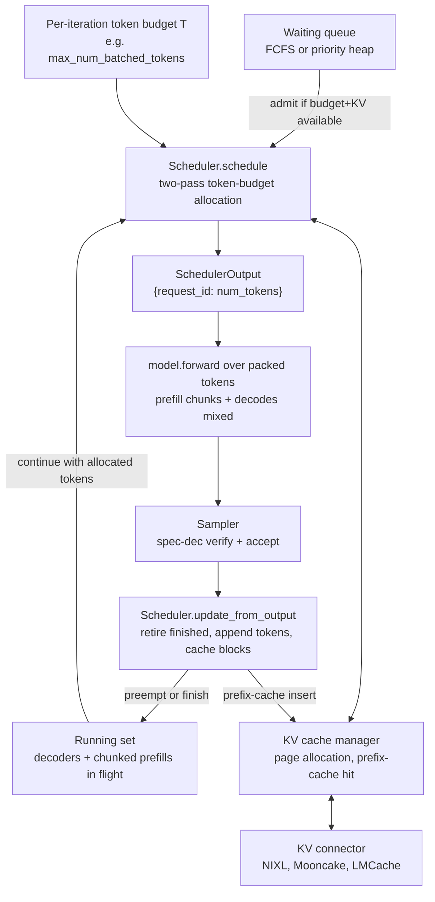

# Batching and Scheduling

**After reading this chapter, the reader will be able to:**

- Explain the lineage from request-level batching through ORCA's iteration-level scheduling to the modern token-budget model used by vLLM V1, SGLang, and TensorRT-LLM, and articulate why static batching is extinct in serious deployments.
- Distinguish chunked prefill (Sarathi, 2023) from stall-free scheduling and the formal token-budget model (Sarathi-Serve, OSDI'24), derive how chunk size $T$ trades TTFT against ITL stalls, and reason about where the optimum sits.
- Reason about scheduling beyond throughput: head-of-line blocking, priority and fairness (FastServe, VTC), preemption (swap and recompute), KV memory as a hard constraint, prefix-cache locality, and how speculative decoding distorts the per-iteration token accounting.

Continuous batching is the technique that turned LLM serving from a curiosity into an industry. Every modern engine inherits it; everything else here is how that idea matured under mixed prefill+decode workloads, latency SLOs, fairness, and prefix-cache locality. The unifying frame for the modern scheduler is a per-iteration *token budget* allocated under multi-dimensional constraints: KV memory, compute roofline position, per-request SLO, prefix-cache hit. The sections below trace how the field arrived at that frame, the math, and how it is implemented in the engines that serve frontier-scale traffic in 2026.

## 1. Why batching is hard for autoregressive decoding

Batching a feed-forward model is mechanical: pad, concatenate, run one matmul instead of $B$. Batching an autoregressive transformer is not, because the per-request state is large, the per-request length is unbounded, and the per-request *phase* is not the same.

Three structural facts make scheduling non-trivial:

1. **Prefill is compute-bound; decode is bandwidth-bound.** A transformer layer of model dimension $d$ at sequence length $s$ and batch $B$ has compute $\propto B s d^2$ and weight bytes $\propto d^2$, giving arithmetic intensity $\propto B s$. Prefill (large $s$) sits well above the roofline knee. Decode ($s = 1$ per request) has intensity $\propto B$, so per-token decode latency at batch $B$ is approximately $\text{TPOT}(B) \approx 2P / (W \cdot B)$ until the batch crosses the saturation point $B^* \approx F_{\text{peak}} / W$ — well above what KV memory typically permits in practice. The full derivation is in [§00/02-transformer-arithmetic-roofline](../00-foundations/02-transformer-arithmetic-roofline.md).

2. **State is per-request and persists across iterations.** Each request owns a KV cache that grows with generated length. A request can leave the batch only when it terminates or is preempted, so a batch composed at iteration $t$ has committed KV memory for many iterations into the future. KV memory — not compute — is the scheduler's binding capacity constraint at long context: with $K$ blocks of $b$ tokens each and mean live length $\bar L$, sustainable concurrent decoders are approximately $\lfloor K b / \bar L \rfloor$, co-managed with the page allocator [see §10/02-paged-kv-memory](02-paged-kv-memory.md).

3. **Phases run on different rooflines in the same forward pass.** A long prompt arrives and wants compute-bound prefill; a hundred ongoing decoders want bandwidth-bound decode. Run them sequentially and decoders stall; run them on dedicated replicas and prefill compute slack is wasted. The interesting design choices live between these two extremes.

The first generation of LLM servers answered these the simplest possible way: batch requests at admission, pad to the longest sequence, run forward passes until every request emitted EOS, then admit the next batch. This *static* (request-level) batching wastes compute on padding (decode time scales with the max length, not the mean) and serializes long requests behind short ones because no new request can join an in-flight batch. Reported GPU utilization in this regime is 30–40% on common chat workloads. The fix is iteration-level scheduling.

## 2. Iteration-level scheduling: ORCA and the continuous-batching foundation

ORCA (OSDI'22) is the canonical origin of iteration-level scheduling for LLM serving. The contribution is small to state and large in consequence: instead of batching at the *request* boundary, the scheduler operates at the *Transformer iteration* boundary. After every forward pass, the scheduler is free to retire finished requests, admit new requests, and recompose the batch.

The iteration loop in pseudocode:

```pseudocode
while requests_pending or running:
    batch     = scheduler.select_batch()        # mix of prefill and decode
    outputs   = model.forward(batch)            # one Transformer pass
    new_tokens = sampler(outputs)               # one (or k, with spec-dec) per request
    scheduler.update(batch, new_tokens)         # retire finished, admit waiting
```

Two consequences follow. First, head-of-line blocking inside a batch disappears: a long-running request no longer blocks short requests admitted after it. Second, GPU utilization rises into the 70–90% range on chat workloads because there are always enough live requests to fill the per-step batch.

ORCA also introduced *selective batching*, motivated by the shape mismatch between attention (per-request KV-length) and the rest of the layer (shape-invariant). ORCA batches the shape-invariant ops (FFN, projections) on the concatenated batch and runs attention per-request. Selective batching has since been superseded — paged attention kernels (PagedAttention, FlashInfer's batched ragged-prefill, FlashMLA) batch attention over per-request page tables directly — but the principle of separating shape-variant from shape-invariant ops still drives kernel dispatch [see §10/01-attention-kernels](01-attention-kernels.md).

ORCA's iteration-level scheduling was productionized on top of paged KV memory by vLLM (SOSP'23), entered NVIDIA TRT-LLM under the name *in-flight batching*, and TGI's iteration-level loop in mid-2023. By 2024 this was the universal default. The terms *continuous batching*, *in-flight batching*, and *iteration-level scheduling* are interchangeable in the literature. *Dynamic batching* survives only in the narrower Triton-server sense of admission-time request grouping.

## 3. The chunked-prefill family: Sarathi, Sarathi-Serve, and Dynamic SplitFuse

Iteration-level scheduling solves the *batch-recomposition* problem; it does not solve the *phase-mismatch* problem. A single 4096-token prompt arriving in a batch of 32 decoders blocks all of them for the duration of one prefill iteration, a "prefill stall" measured in hundreds of milliseconds on H100. The decoders' visible inter-token latency (ITL) jumps; the streaming UX breaks; goodput drops. Two distinct contributions, often conflated in informal references, fix this.

### 3.1 Sarathi (2023): chunked prefill

Sarathi (Agrawal et al., MSR India / Georgia Tech, August 2023, arXiv:2308.16369) introduced the *chunked prefill* primitive. The observation: a long prefill is a single forward pass only by convention — the prefill's $L_P$ tokens can be split into $T$-token chunks processed across $\lceil L_P / T \rceil$ separate iterations, with the per-token KV cache laid down progressively. From the model's point of view, processing a $T$-token chunk is a forward pass over $T$ tokens with attention over accumulated KV, indistinguishable in shape from a $T$-token decode iteration.

Once prefill becomes chunkable, two things follow:

1. **Decodes piggyback on the same iteration as a prefill chunk.** A chunk of $T$ tokens leaves $B - T$ slots in the per-iteration budget for single-token decodes from in-flight requests. The decoders pay the chunk's iteration latency but are no longer fully starved.

2. **The prefill stall shrinks from $t_{\text{prefill}}(L_P)$ to $t_{\text{iter}}(T)$.**

Sarathi reported a 2× decode-throughput improvement over naive iteration-level scheduling on long-prompt workloads. Concurrently and independently, DeepSpeed-FastGen (Microsoft, January 2024, arXiv:2401.08671) framed the same idea as *Dynamic SplitFuse* — constant-forward-size composition with prefill chunks and decodes mixed to fill the budget. The two papers landed within months of each other with essentially the same idea under different framings.

### 3.2 Sarathi-Serve (OSDI'24): stall-free scheduling and the token budget

Sarathi-Serve (Agrawal et al., MSR / Georgia Tech, OSDI'24, arXiv:2403.02310) is the *production-ready* successor and a distinct contribution, adding three pieces on top of chunked prefill:

- **A formal token-budget model.** Each iteration is bounded by a budget $T$. Prefill chunks consume budget by token count; decodes consume one unit (or $k+1$ under spec-dec; see §6). Scheduling becomes a packing problem.

- **A stall-free scheduling guarantee.** The scheduler always admits ongoing decodes *first* and only spends remaining budget on prefill chunks. Decode throughput is therefore never fully preempted — the worst-case decode stall is exactly $t_{\text{iter}}(T)$, regardless of in-flight prompt length.

- **An empirical analysis of goodput under mixed load.** A sweep of $T$, prompt-length distribution, and SLO targets shows that a fixed $T$ at the knee of $t_{\text{iter}}(T)$ — where the iteration becomes compute-bound — delivers near-optimal goodput across realistic mixes.

The two-paper distinction matters because the *primitive* (chunked prefill) and the *policy* (stall-free schedule + token budget) are independently citable; modern engines implement both, but the lineage is two papers.

### 3.3 Math: TTFT vs ITL under chunked prefill

The trade-off curve chunked prefill exposes is the central knob of every modern scheduler. With prompt length $L_P$, chunk size $T$, and per-iteration latency $t_{\text{iter}}(T)$:

$$\text{TTFT} \approx \left\lceil \frac{L_P}{T} \right\rceil \cdot t_{\text{iter}}(T), \qquad \text{ITL stall during a prefill chunk} \le t_{\text{iter}}(T)$$

The two extremes: $T = L_P$ (no chunking) gives optimal TTFT but stalls in-flight decodes for $t_{\text{iter}}(L_P)$, catastrophic on long prompts. $T = 1$ minimizes ITL stalls but makes each iteration a near-pure decode whose cost is dominated by HBM weight reads — nearly $10\times$ the per-token cost of a compute-bound prefill iteration — exploding TTFT.

The interesting region is intermediate. $t_{\text{iter}}(T)$ is sublinear in $T$ over the range where the iteration transitions from bandwidth-bound to compute-bound: a single iteration moves a near-fixed amount of weight bytes regardless of $T$ and adds compute work the GPU absorbs until the FMA pipeline saturates. Approximating $t_{\text{iter}}(T) \approx t_{\text{decode-only}} + c \cdot T$ over this range gives

$$\text{TTFT}(T) \approx \frac{L_P \cdot t_{\text{decode-only}}}{T} + c \cdot L_P$$

The first term shrinks with $T$; the second is constant. The minimum of the full trade-off — TTFT plus a penalty $\lambda \cdot t_{\text{iter}}(T)$ for the worst ITL stall — has a knee near

$$T^* \approx \sqrt{L_P \cdot t_{\text{decode-only}} / (\lambda \cdot c)}$$

In practice, $T^*$ is close to the *saturation token count* of the GPU on the model — the smallest chunk size at which the iteration is compute-bound. Sarathi-Serve fixes $T$ at this knee. Production engines expose $T$ as `max_num_batched_tokens` (vLLM), `chunked_prefill_size` (SGLang), or `max_num_tokens` (TRT-LLM), with defaults in the 2048–8192 range (lower for H100, higher for B200/B300).

Chunked prefill also turns long-context serving from a binary admission decision into a streaming workflow: a million-token prompt is admitted immediately, charged $T$ tokens per iteration, and woven into ongoing decodes for $\lceil 10^6 / T \rceil$ iterations. Mnemosyne (Microsoft, 2024-09) varies $T$ per request and per phase to hit TBT deadlines at multi-million-token contexts, since at very long contexts the attention sub-layer's quadratic cost forces a smaller $T$.

## 4. The vLLM V1 token-budget scheduler

vLLM V1 (released January 2025) is the most-cloned reference for the token-budget model. The scheduler is in `vllm/v1/core/sched/scheduler.py`; the design philosophy is stated in a comment at the top of `Scheduler.schedule`:

> "There's no 'decoding phase' nor 'prefill phase' in the scheduler. Each request just has `num_computed_tokens` and `num_tokens_with_spec`. At each step, the scheduler tries to assign tokens so that each request's `num_computed_tokens` can catch up its `num_tokens_with_spec`."

A scheduling step produces a `{request_id: num_tokens}` dictionary packed into `SchedulerOutput` (`vllm/v1/core/sched/output.py`). The model runner sees no phase distinction — only a list of requests, each with a token count — and runs one forward pass over the concatenated tokens. This is the literal embodiment of the token-budget model.

### 4.1 The two-pass schedule

A single call to `Scheduler.schedule` runs two passes over the budget:

**Pass 1: running requests.** For each request in `self.running`, the scheduler computes the tokens still needed (`num_tokens_with_spec − num_computed_tokens`), caps it by `long_prefill_token_threshold` (the chunk size), the remaining `max_num_scheduled_tokens` budget, `max_model_len − 1`, and any architectural constraint (Mamba block alignment, encoder cache budget for multimodal). It asks `KVCacheManager` to allocate page slots; if allocation fails, the scheduler **preempts** another running request.

**Pass 2: waiting requests.** The scheduler walks `self.waiting` (plus a deferred `skipped_waiting` queue used by remote-KV connectors). For each waiting request it asks the cache manager for the longest local prefix-cache hit via `get_computed_blocks(request)`; if a `KVConnector` is attached (NIXL, Mooncake, LMCache, p2p NCCL, MoriIO), it may also account for externally cached tokens and shelve the request as `WAITING_FOR_REMOTE_KVS` until the remote load completes [see §30/02-kv-tiered-offload](../30-kv-cache/02-kv-tiered-offload.md). It allocates new blocks (including lookahead slots for EAGLE / MTP drafts) and admits.

### 4.2 Preemption: swap and recompute

When KV memory fills, vLLM has supported two preemption modes — *swap* (move KV blocks to CPU memory) and *recompute* (drop the KV cache and re-prefill on resume). V0 supported both; V1 defaults to recompute because re-prefill is fast at chunked-prefill granularity and the prefix-cache hit at recompute time often makes it cheaper than the swap-in. The preemption pick is the *last-added* running request under FCFS or the *lowest-priority* running request under PRIORITY; vLLM exposes only these two policies in `SchedulingPolicy` and has no native deadline-aware mode.

The three-state queue model — *running*, *waiting*, *swapped* — survives conceptually, but the *swapped* queue is largely vestigial in V1: a preempted request returns to `waiting` and is re-admitted with prefix-cache hit on the resident prefix. Long-context paths (Mnemosyne, TRT-LLM, SGLang) retain an explicit swap path for cases where re-prefill dominates.

### 4.3 Async scheduling

*Async scheduling* decouples the scheduler's CPU work from the model's GPU work: with `async_scheduling=True` instantiating `AsyncScheduler` (`vllm/v1/core/sched/async_scheduler.py`), the scheduler prepares iteration $N+1$ while the model runs iteration $N$. SGLang's *zero-overhead overlap scheduler* (`event_loop_overlap`, default since v0.4 in December 2024) is the same idea, maintaining a deque of pending `(ScheduleBatch, BatchResult)` pairs and deferring `process_batch_result` for batch $N$ until batch $N+1$ is queued on the schedule stream. Both engines report ~10–25% throughput gains at high QPS on workloads where Python-side overhead becomes visible.

### 4.4 Continuous batching, in one diagram



The shape of the diagram applies equally to vLLM V1, SGLang, and the in-flight batching path of TRT-LLM. The differences are in the queue ordering policies, the cache structure (hash-chained block table vs radix tree), and how the budget is allocated across pre-empted vs newly admitted requests, not in the structural loop.

## 5. Beyond FCFS: priority, fairness, predictive, cache-aware

Continuous batching solved throughput. Once throughput was no longer the bottleneck, attention turned to the policies above the iteration loop: which requests get admitted in which order, how SLOs are honored, how fairness is maintained across tenants, and how prefix-cache locality is exploited.

### 5.1 Head-of-line blocking, priority, and fairness

FCFS suffers from head-of-line blocking: a long-running request blocks short requests behind it. The earliest serious attack on this was **FastServe** (Wu et al., PKU, May 2023, arXiv:2305.05920), which used a *skip-join multi-level feedback queue*: requests are demoted between priority levels based on accumulated service time, and high-level (small-service) requests preempt large-service requests at the token granularity. FastServe is the conceptual ancestor of every later priority-and-preemption story.

Modern engines expose lightweight versions. vLLM V1's `SchedulingPolicy.PRIORITY` orders the waiting queue as a heap on `(priority, arrival_time)` and picks preemption victims by lowest priority. SGLang's `enable_priority_scheduling` plus `PrefillAdder.preempt_to_schedule` does the same on prefill admission with a `priority_scheduling_preemption_threshold` to prevent thrashing. Neither is deadline-aware.

Across tenants, FCFS is unfair. **VTC** (Virtual Token Counter, Sheng et al., OSDI'24, arXiv:2401.00588) was the first formally fair LLM scheduler: each tenant carries a counter incremented by tokens of service; the scheduler picks the tenant with the smallest counter, work-conservingly, with a proved 2× service-difference bound. **DLPM** (Cao et al., 2025-01, arXiv:2501.14312) extends VTC to trade fairness against prefix-cache locality, reporting up to 2.87× throughput within a controlled fairness deficit. Multi-tenant fairness is the topic of [§40/03-fairness-slo-routing](../40-multi-tenant/03-fairness-slo-routing.md); the engine-level scheduler exposes the primitives those higher-layer policies build on.

### 5.2 Predictive and cache-aware scheduling

A scheduler that knew each request's remaining service time could implement Shortest-Job-First (SJF), provably optimal for mean response time. It does not. **Learning to Rank** (LTR, Fu et al., NeurIPS'24, arXiv:2408.15792) sidesteps the prediction-noise problem by predicting *pairwise ranks* of remaining length rather than absolute values, and reports a 2.8× chatbot latency reduction and 6.5× synthetic-data-generation throughput. Theoretical results (arXiv:2508.01002, arXiv:2504.07347) prove throughput-optimality for SJF/SRPT variants in formal queueing models of an LLM engine. Predictive scheduling has not yet entered any major engine as a default; it remains a research and orchestration-layer concern.

The token-budget model assumes each request's token cost equals new tokens to compute. Prefix caching breaks this — a fully hit prompt costs zero compute. SGLang's `PrefillAdder` (`srt/managers/schedule_policy.py`) sorts the waiting queue by a `CacheAwarePolicy`: `LPM` (longest prefix match against the radix tree) or `DFS_WEIGHT` (radix subtree DFS weighted by waiting requests). LPM is degraded to FCFS when the queue exceeds 128 to bound sort cost. *In-batch prefix caching* exploits overlap between requests admitted into the same iteration. vLLM V1's prefix cache is hash-chained at the block-table level (see `docs/source/design/v1/prefix_caching.md`) rather than a radix tree; the scheduler sees cache hits via `get_computed_blocks(request)` but does not reorder the queue by hit length. Both designs admit cache-hot requests early through different mechanisms. The cluster-level analogue — KV-aware routing in llm-d, Dynamo, and AIBrix — is in [§50/01-router-gateway](../50-cluster-systems/01-router-gateway.md).

### 5.3 Migration and SLO-aware schedulers

**Llumnix** (Sun et al., Alibaba, OSDI'24, arXiv:2406.03243) is the canonical reference for live KV-cache migration across replicas, pipelined with decode compute, with a unified policy for load balancing, defragmentation, priority isolation, and autoscaling drain — framed as the LLM-serving analogue of OS-style context switching. Llumnix is open-source and tracks active vLLM versions.

A family of recent schedulers — **SOLA** (MLSys'25, state-aware TTFT/TPOT rebalancing, 45.5% → 99.4% SLO attainment), **SLOs-Serve** (MLSys'25, arXiv:2504.08784, multi-stage application-level SLOs for agentic chains, 2.2× per-GPU capacity), **JITServe** (NSDI'26, arXiv:2504.20068, scheduling under imprecise length information with grouped-margin goodput, 1.4–6.3× goodput), and **Andes** (arXiv:2404.16283, QoE-aware token-level preemption) — drives the token budget from a goodput or SLO-attainment objective rather than queue length. The reported gains are individual paper claims against narrow baselines and have not yet converged into a single open-source scheduler; the deeper coverage is in [§40/03-fairness-slo-routing](../40-multi-tenant/03-fairness-slo-routing.md).

## 6. Aggregation vs disaggregation, and kernel-level overlap

Chunked prefill aggregates prefill and decode in the same engine and same forward pass. The alternative — *disaggregation* — places them on separate replicas and transfers KV between them (Splitwise, DistServe, TetriInfer, Mooncake, Dynamo); the dedicated chapter is [§20/02-prefill-decode-disagg](../20-distributed-inference/02-prefill-decode-disagg.md). The two paths are converging.

**POD-Attention** (Kamath et al., ASPLOS'25, arXiv:2410.18038) runs the prefill-attention and decode-attention of a hybrid batch on the same SM with split resources, reporting up to 59% faster attention than sequential execution. The scheduler-level consequence is that the chunk-iteration cost $t_{\text{iter}}(T)$ drops on hybrid batches, improving TTFT and the ITL-stall bound simultaneously and making aggregated chunked-prefill scheduling competitive with disaggregation across more of the regime space than was previously thought. POD-Attention's kernel coverage belongs to the attention-kernels chapter.

**TaiChi** (arXiv:2508.01989) and **Nexus** (arXiv:2507.06608) parameterize a slider between the two regimes. TaiChi unifies both under one scheduler, tuning a per-instance token budget to the SLO. Nexus does *intra-GPU* disaggregation by scheduling prefill and decode on separate SM groups within one engine. SGLang exposes both modes: PD-multiplexing (`enable_pdmux`, `SchedulerMultiplexMixin`) runs prefill and decode on disjoint SM groups via `sm_group_num`, and full disaggregation is supported via NIXL, Mooncake, or Mori transports.

The current production picture, hedged: at small-to-medium scale, aggregated chunked prefill (vLLM V1, SGLang, TRT-LLM in-flight batching) is competitive with or better than DistServe-style disaggregation for the typical chat workload. At frontier scale (DeepSeek, Moonshot/Kimi, Meta production traffic), the dominant deployments disaggregate — suggesting the regime where disaggregation dominates is the regime those companies serve. TaiChi-style sliders are the likely landing point for the next generation of schedulers but are not yet a default in any major engine.

## 7. Speculative-decoding-aware scheduling

Speculative decoding (covered in depth in [§10/05-speculative-decoding](05-speculative-decoding.md)) breaks one of the token-budget model's tidy assumptions: a decode iteration produces *exactly one* accepted token per request. Under spec-dec with proposal length $k$ and per-token acceptance rate $\alpha$, the verify step admits between 0 and $k+1$ tokens (the "+1" is the bonus token, sampled from the corrected distribution at the rejection point). The expected number of accepted tokens per verify step is

$$\mathbb{E}[\text{accepted}] \approx \frac{1 - \alpha^{k+1}}{1 - \alpha}$$

This number is workload-conditional and varies from ~1.5 on hard distributions to >5 on easy ones. The verify-step compute scales like a prefill of $k+1$ tokens — substantially more than a plain decode iteration.

Three implications for the scheduler:

1. **Per-request budget consumption changes.** A spec-dec request consumes $k+1$ budget tokens per iteration but produces $\mathbb{E}[\text{accepted}]$ output tokens. The marginal-token-cost / marginal-accepted-token ratio determines whether spec-dec is profitable in a given batch state.

2. **Variable-length iterations break tight CUDA-graph assumptions.** Engines using piecewise CUDA graph capture across draft/verify (vLLM V1, SGLang) capture a graph per supported $k+1$ length up to a fixed maximum (typically 8) and dispatch by runtime $k$.

3. **Closed-loop spec-length control.** **TurboSpec** / **SmartSpec** (Liu et al., UC Berkeley / UCSD / Anyscale, June 2024, arXiv:2406.14066) profiles per-request acceptance, batch state, and verify cost, then dynamically adjusts $k$ to maximize goodput. At low batch occupancy (verify cost is hidden by bandwidth-bound decode), large $k$ pays off; at high batch occupancy (verify is compute-bound), small or zero $k$ is right. **BatchSpec** (Zhang, Dey et al., 2025-10, arXiv:2510.22876) addresses the *ragged-acceptance bug* in naive batched spec-dec via same-length-group cross-batch scheduling.

The vLLM V1 scheduler folds spec-dec into the per-iteration budget directly: `request.spec_token_ids` is added to `num_tokens_with_spec`, and `update_from_output` reconciles accepted vs rejected tokens via the rejection-sampler results. SGLang implements draft / verify as separate worker calls (`EagleVerifyInput`) with the radix cache cooperating via the `is_bigram` view for EAGLE-style bigram keys. **Semi-Clairvoyant Scheduling** (IJCAI'25) extends the closed-loop idea with partial knowledge of acceptance rates.

## Current production state

As of May 2026, every production-class LLM engine implements continuous batching with chunked prefill on by default and exposes the token budget as a configuration knob. vLLM V1 (`vllm/v1/core/sched/scheduler.py`) is the most-cloned reference: a scheduling step produces a `{request_id: num_tokens}` dictionary, the model runner sees no phase distinction, prefix caching is on by default with reported overhead under 1% at 0% hit rate, and the policy is FCFS or PRIORITY with recompute as the preemption mode. Reported throughput over V0 at equal latency is up to 1.7×, attributed to the unified scheduler, EngineCore process separation, and async scheduling. SGLang's scheduler (`srt/managers/scheduler.py`) adds the *zero-overhead overlap scheduler* (default since v0.4) and *cache-aware scheduling* via `PrefillAdder` with LPM / DFS-weight policies. TRT-LLM's in-flight batching, implemented by `BatchManager` with `executor::SchedulerPolicy` (`MAX_UTILIZATION` or `GUARANTEED_NO_EVICT`), supports chunked context and is the default in the Triton TRT-LLM backend.

At the cluster layer, **NVIDIA Dynamo** (0.4 in 2025) closes the loop on chunked-prefill scheduling at the multi-engine scope: SLA-based Planner with time-series-forecast-driven prefill/decode worker scaling, KV-aware Router for prefix-cache hit, NIXL for KV transport (4× over prior versions on reasoning workloads — vendor number, hedge accordingly). **Mooncake** (Moonshot AI / Kimi, FAST'25) runs across thousands of nodes, ~100 B+ tokens/day, with reservation-based admission control independent at prefill and decode pools. **llm-d** (Red Hat / IBM / Google, CNCF Sandbox) implements *precise* prefix-cache-aware routing — block-exact rather than approximate, distinguishing it from SGLang's `sgl-router`. **AIBrix** layers a goodput-aware autoscaler (APA) and VTC fairness. All three converge on the Kubernetes Inference Gateway API (GIE) substrate.

The 2024-era assumption that "the engine is the system" no longer holds: the scheduler is one layer in a stack that includes the gateway router, the EPP, the engine-local scheduler, the KV connector, and a goodput-driven autoscaler. The body of work surveyed here — ORCA's iteration-level scheduling, Sarathi's chunked prefill, Sarathi-Serve's stall-free token budget, vLLM V1's `{request_id: num_tokens}`, FastServe's preemption, VTC's fairness, DLPM's locality-fairness Pareto, Llumnix's migration, the SOLA / SLOs-Serve / JITServe SLO-aware family, POD-Attention's kernel overlap, TurboSpec's closed-loop spec-dec — has converged into a recognizable production substrate. The frontier sits above the iteration loop (predictive, multi-tenant, application-aware policies) and below it (kernel-level enablers like POD-Attention and Nexus); the iteration loop itself is settled.
