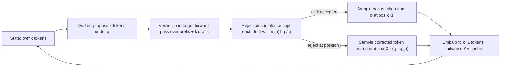

# Speculative Decoding

**After reading this chapter, the reader will be able to:**

- Derive the modified-rejection-sampling algorithm that anchors every speculative-decoding (SD) variant in production, and read off the expected-tokens-per-step and wall-clock-speedup formulae that determine whether an SD configuration is worth running at all.
- Place the SD design space — external drafters, tree verification, self-spec heads (Medusa, EAGLE 1/2/3), recurrent drafters (ReDrafter), and training-free families (PLD, REST, Lookahead, SuffixDecoding) — onto a single lineage and reason about which variant fits which workload, batch regime, and engine.
- Diagnose why per-domain acceptance, continuous-batching heterogeneity, and the relationship to multi-token prediction (MTP) determine whether a deployment sees the marketing speedup or a fraction of it.

Decode is bandwidth-bound. A dense 70B model on an H100 reads ~140 GB of weights from HBM to produce one token at batch size 1; the FP16 ALUs are idle for the wall-clock window of that read. That idle compute is the resource speculative decoding monetizes. If a cheap drafter can guess the next $\gamma$ tokens, the target model can verify all of them in a single forward pass — the *same* forward pass that would otherwise have produced one token — by spending its idle ALUs on the additional $\gamma$ token positions. As long as the verification step still fits within the original HBM-read window and the verifier accepts a non-trivial fraction of the drafts, throughput rises linearly in the number of accepted tokens.

The trick has to be *lossless*: production deployments cannot ship a lower-quality model in exchange for speed. The clever piece, derived independently in late 2022 and early 2023, is a rejection-sampling rule that lets the verifier take the drafter's tokens whenever they are good enough, sample from a corrected distribution when they are not, and emit a sequence whose marginal distribution is *exactly* the target's. The rest of this chapter unpacks that rule, the families of drafters built around it, and the production pathologies — heterogeneous batches, reasoning workloads, MoE — that complicate the simple story. [See §00/02-transformer-arithmetic-roofline](../00-foundations/02-transformer-arithmetic-roofline.md) for the bandwidth-bound roofline and [§10/03-batching-scheduling](03-batching-scheduling.md) for SD's composition with continuous batching.

## 1. The core algorithm: modified rejection sampling

The algorithm is described twice in the canonical literature, by independent groups, within three months of each other: [SpecDec-Leviathan] (Google Brain, November 2022) and [SpecSamp-Chen] (Google DeepMind, February 2023). Both derive the same modified-rejection-sampling rule and the same expected-acceptance bound. The two papers should be cited as a contemporaneous pair, not as a serial lineage; the algorithm has no single "first" form.

### 1.1 Setup

Fix a target distribution $p(\cdot \mid x_{<t})$ produced by the large model and a drafter distribution $q(\cdot \mid x_{<t})$ produced by some cheaper proposal mechanism. The drafter generates $\gamma$ candidate tokens autoregressively under $q$:

$$\tilde{x}_1 \sim q(\cdot \mid x_{<t}), \quad \tilde{x}_2 \sim q(\cdot \mid x_{<t}, \tilde{x}_1), \quad \dots, \quad \tilde{x}_\gamma \sim q(\cdot \mid x_{<t}, \tilde{x}_{<\gamma}).$$

The verifier then runs the target model *once* on the extended sequence $x_{<t}, \tilde{x}_1, \dots, \tilde{x}_\gamma$, producing target distributions $p_1, p_2, \dots, p_{\gamma+1}$ at every position simultaneously — the $i$-th distribution is the target's prediction conditioned on the prefix and the first $i-1$ drafts. Critically, this is one forward pass with sequence length $L_{\text{prefix}} + \gamma$, which on bandwidth-bound decode hardware costs essentially the same as the standard length-$L_{\text{prefix}}$ decode step.

### 1.2 Acceptance rule

For each draft position $i = 1, \dots, \gamma$, sample a uniform $u \sim U(0, 1)$ and accept the draft if

$$u \le \min\!\left(1, \; \frac{p_i(\tilde{x}_i)}{q_i(\tilde{x}_i)}\right).$$

Stop on the first rejection. Suppose acceptance halts after $L \le \gamma$ accepted draft tokens (so $\tilde{x}_{L+1}$ was rejected, or $L = \gamma$ and all drafts were accepted).

If a rejection occurred at position $L+1$, sample one **bonus token** from the corrected residual distribution

$$p'_{L+1}(x) \propto \max\!\bigl(0, \; p_{L+1}(x) - q_{L+1}(x)\bigr).$$

If all $\gamma$ drafts were accepted, sample the bonus token from $p_{\gamma+1}$ directly. Either way, the step emits $L+1$ new tokens and the next step resumes from the new tail.

### 1.3 Why it preserves the target distribution

Position by position, the marginal distribution of the emitted token is

$$\Pr(x_i = z) = \underbrace{q_i(z) \cdot \min\!\left(1, \tfrac{p_i(z)}{q_i(z)}\right)}_{\text{accepted}} + \underbrace{(1 - \alpha_i) \cdot \frac{\max(0, p_i(z) - q_i(z))}{Z_i}}_{\text{rejected, resample}},$$

where $\alpha_i = \mathbb{E}_{x \sim q_i}[\min(1, p_i(x)/q_i(x))]$ and $Z_i$ normalizes the residual. The first term equals $\min(p_i(z), q_i(z))$ since $q \cdot \min(1, p/q) = \min(p, q)$. For the second, observe that $1 - \alpha_i = 1 - \sum_z \min(p_i, q_i) = \sum_z (p_i - q_i)_+ = Z_i$, so the term simplifies to $(p_i(z) - q_i(z))_+$. Adding:

$$\Pr(x_i = z) = \min(p_i(z), q_i(z)) + (p_i(z) - q_i(z))_+ = p_i(z).$$

The emitted token is distributed exactly as $p_i$, regardless of $q_i$. The drafter only determines *how often* the verifier accepts; it cannot bias the output. This is why SD is *lossless*: under exact arithmetic the output distribution is identical to autoregressive sampling from the target. (Real engines run the verifier in BF16 or FP8; the equality holds up to the verifier's numerical precision, and the same caveat applies to non-speculative decode of the same model.)

### 1.4 Expected accepted tokens per step

Assume per-token acceptance is i.i.d. with probability $\alpha$ — the standard Leviathan–Chen "geometric" assumption. Acceptances form a truncated geometric chain; each draft is accepted with probability $\alpha$ until a rejection or until all $\gamma$ drafts are consumed, then a bonus token is always emitted. Let $L \in \{0, 1, \dots, \gamma\}$ be the number of accepted drafts. Total emitted tokens $N = L + 1$ has expectation

$$E[N] \;=\; 1 + \sum_{k=1}^{\gamma} \Pr(L \ge k) \;=\; 1 + \sum_{k=1}^{\gamma} \alpha^{k} \;=\; \frac{1 - \alpha^{\gamma+1}}{1 - \alpha}.$$

This is the central formula of speculative decoding. Two limits:

- **Perfect drafter ($\alpha = 1$):** $E[N] = \gamma + 1$. Every draft accepted plus the bonus; the verifier emits $\gamma+1$ tokens per forward pass.
- **Useless drafter ($\alpha = 0$):** $E[N] = 1$. No drafts accepted; the bonus is the only emission, recovering autoregressive decode.

Between those endpoints $E[N]$ grows monotonically in both $\alpha$ and $\gamma$ but with diminishing returns in $\gamma$ (because $\alpha^{\gamma+1}$ shrinks fast). At $\alpha = 0.7$, $E[N]$ rises from 1 ($\gamma=0$) to 1.7 ($\gamma=1$) to 2.19 ($\gamma=2$) to 2.53 ($\gamma=3$) and asymptotes near $1/(1-\alpha) \approx 3.33$. Pushing $\gamma$ past the regime where $\alpha^\gamma$ matters wastes verifier compute on drafts that will almost certainly be rejected.

### 1.5 Wall-clock speedup

Tokens per step is not what the operator cares about; tokens per second is. Let $T_{\text{target}}$ be the cost of one verifier forward pass and $T_{\text{draft}}$ the cost of one drafter token; define the cost ratio $c = T_{\text{draft}} / T_{\text{target}}$. Each step pays $T_{\text{target}}(1 + c\gamma)$ — one verifier call plus $\gamma$ drafter calls — and emits $E[N]$ tokens. Speedup over autoregressive decode is

$$\boxed{\text{Speedup}(\alpha, \gamma, c) = \frac{E[N]}{1 + c\gamma} = \frac{1 - \alpha^{\gamma+1}}{(1 - \alpha)(1 + c\gamma)}.}$$

Two structural observations follow. First, **upper bound**: as $c \to 0$ and $\gamma \to \infty$, $\text{Speedup} \le 1/(1-\alpha)$. At $\alpha = 0.7$ no SD configuration can exceed $3.33\times$; at $\alpha = 0.9$ the ceiling is $10\times$. Acceptance rate is the binding constraint; $\gamma$ and $c$ only affect how close one gets. Second, **optimal $\gamma$ depends on $c$**: the optimum $\gamma^*$ is roughly where $\alpha^{\gamma+1} \log(1/\alpha) = c(1-\alpha)$. For typical EAGLE-3 numbers ($\alpha \approx 0.8$, $c \approx 0.05$), $\gamma^* \in [4, 8]$; for training-free drafters with much higher $c$, $\gamma^*$ collapses towards 2–3. The engineering effort of the past two years has poured into raising $\alpha$ rather than pushing $\gamma$, because the curves diverge sharply with $\alpha$ and only weakly with $\gamma$.

### 1.6 The SD loop

The full step is one round-trip through the proposer, the verifier, and the rejection sampler.

Every production engine implements exactly this loop; what differs is the proposer's identity and the verifier's mask shape. vLLM exposes it as `RejectionSampler.sample` (`vllm/v1/sample/rejection_sampler.py`); TRT-LLM splits it across `MTPSampler`, EAGLE samplers, and `dynamicDecodeLayer`; SGLang routes it through its v1/v2 spec workers. Cross-engine convergence on the algorithm is total. Variance in production results comes from the drafter, the tree shape, and the scheduler.

## 2. Tree verification: SpecInfer and Sequoia

The basic algorithm assumes a *linear* draft sequence: $\gamma$ tokens, one branch. But the verifier's forward pass cost is essentially set by the number of *positions* it attends over, and a single position can carry several candidate tokens in parallel. **[SpecInfer]** (CMU/FlexFlow, ASPLOS'24) made the architectural leap: instead of a sequence of $\gamma$ drafts, generate a *tree* of candidates and verify the whole tree in one forward pass with a tree-causal attention mask. At each internal node the drafter proposes top-$k$ continuations; the verifier runs once over all $|\mathcal{T}|$ positions; the rejection sampler walks the tree from the root, descending the longest accepted path. The mask ensures each candidate attends only to its ancestors.

The economics: $|\mathcal{T}|$ candidates verified at the cost of one forward pass with sequence length $|\mathcal{T}|$. Compared to a linear draft of length $\gamma = |\mathcal{T}|$, expected accepted-path length grows because the tree explores multiple hypotheses. The catch is that verifier cost grows superlinearly in $|\mathcal{T}|$ once the kernel falls off the bandwidth-bound regime — too-large trees push the verifier into the compute-bound branch of the roofline and the speedup curve inverts.

**[Sequoia]** (CMU/Together, 2024) makes the trade-off explicit. Given a hardware-specific verify-cost curve $\tau(|\mathcal{T}|)$ and a per-position acceptance model, Sequoia picks the tree shape that maximizes $E[L_\mathcal{T}] / \tau(|\mathcal{T}|)$ via dynamic programming over tree depth, branching factor, and per-level top-$k$. The DP cost is paid once at deployment; serving uses the resulting fixed shape. Sequoia hits 4× on Llama-2-7B/A100 and is the canonical building block for offload regimes (Llama-2-70B at ~0.56 s/token on a single L40 by combining tree verification with weight offload).

**[EAGLE-2]** (2024) extended this with *dynamic* tree expansion: the tree shape is computed per-step from the drafter's per-position confidence, growing wider where the drafter is uncertain. EAGLE-3's dynamic tree (TRT-LLM's `eagle3_dynamic_tree.py`, SGLang's `--speculative-algorithm EAGLE3`) is the production realization. Tree verification is now a baseline assumption in every modern self-spec pipeline; engines expose tree masks through dedicated kernel paths (vLLM's `TREE_ATTN` backend, TRT-LLM's `spec_decoding_packed_mask` input to `gptAttentionPlugin`, SGLang's tree-attention path).

## 3. The drafter zoo

The verifier is invariant; the drafter is where the engineering happens. Three families coexist in production, and a fourth (training-free) sits as a fallback.

### 3.1 External / two-model drafters

The Leviathan–Chen original framing: a small LLM of the same family (say, Llama-3.2-1B) drafts for a large one (Llama-3.3-70B). Same tokenizer, aligned distributions, same hardware footprint. External drafters have largely been displaced for in-family draft generation by self-spec techniques but survive in three regimes: when no smaller same-family model exists, in long-context KV-bound regimes where [MagicDec] shows that even *large* drafters can speed up because KV bandwidth dominates compute, and as a debugging fallback. Engines still ship the path: vLLM's `draft_model` proposer, SGLang's `STANDALONE`, TRT-LLM's `Draft-Target-Model`.

### 3.2 Self-speculative drafters: from Medusa to EAGLE-3

The dominant family in 2025–2026. The drafter is parameter-tied to the target — auxiliary heads on the target's body, or a small head over its hidden states.

**[Medusa]** (Cai et al., Princeton/Together/UIUC, ICML 2024) bolts $K$ parallel "Medusa heads" onto the target, each predicting a token at offset $+1, \dots, +K$. Heads run alongside the verifier; tree verification combines top-$k$ candidates per head into a tree. Medusa-1 frozen-backbone reports 2.2×, Medusa-2 joint fine-tune 2.3–3.6×. **[Hydra]** (MIT, COLM 2024) makes the heads sequentially dependent rather than independent, gaining 1.31× over Medusa.

**[EAGLE-1]** (Li et al., ICML 2024) is the architectural reframe that defines the 2024–2026 lineage. Instead of predicting tokens directly, the EAGLE drafter is a small autoregressive transformer that operates on the target's *penultimate-layer features* — the activation tensor before the LM head. Because feature space is denser than token space and the LM head is shared, the drafter only has to learn a feature-level autoregression. EAGLE handles the "feature uncertainty" that arises because the drafter conditions on its own predicted features rather than the target's true features by a one-token shift in training. Speedups reach 2.7–3.5× on Llama-2-Chat-70B. **[EAGLE-2]** (2024) adds confidence-based dynamic tree expansion: the drafter's softmax entropy controls how wide and deep the verification tree grows.

**[EAGLE-3]** (Li et al., NeurIPS 2025) makes two changes. First, drop the feature-prediction objective: the drafter is trained to predict tokens directly. Second, fuse early/middle/late layer features into the drafter's input — a "training-time test" that exposes the drafter to a richer view of the target's internal state during training. The result is a discovered scaling law: drafter quality grows roughly log-linearly in training-data volume where EAGLE-1/2 had saturated. Reported numbers reach 6.5× at batch-1; in SGLang at batch-64, EAGLE-3 delivers 1.38× throughput over the no-spec baseline. As with all SD speedup numbers, those depend heavily on $\alpha$, the verifier's hardware, and the workload; the high end of the range is for code generation on H100 with a well-trained drafter, and vendor-supplied numbers should be read in context.

EAGLE-3 with the [SpecForge] training framework (LMSYS, July 2025) and the [Speculators] HF format (Red Hat / vLLM, November 2025) constitutes the **most actively standardized OSS spec-dec training/serving path** as of mid-2026. SpecForge handles the data pipeline and distillation; Speculators standardizes the on-disk format so a drafter trained anywhere can be loaded by vLLM, SGLang, or TRT-LLM with a single configuration field. Most net-new deployments for in-house Llama-class models or third-party models without native MTP heads pick this path.

It is *not* the only production path. Several alternatives ship:

- **[ReDrafter]** (Apple, 2024). RNN drafter over hidden states plus dynamic tree attention plus KD from the target. 2.8× on H100, 2.3× on Apple Silicon. Apple ships this on-device; TRT-LLM ships it as a default for several supported models (`tensorrt_llm/models/redrafter/`). ReDrafter outperforms EAGLE-3 at *higher batch sizes* on some workloads because the RNN has lower per-step overhead than EAGLE's feature transformer.
- **Medusa-2.** In production at Together AI and Cohere on dense models; competitive at batch-64+ where EAGLE-3's drafter latency starts to bite.
- **Turbo-LoRA-style drafter LoRAs.** LoRA adapter trained as a drafter on top of the target itself; minimal extra parameters, no second checkpoint to manage.
- **[Kangaroo]** (Huawei, NeurIPS 2024). Drafter is a shallow sub-network of the target with an early-exit signal. 2.04× walltime, 88.7% fewer extra parameters than Medusa-1.
- **[GliDe-CaPE]** (2024) reuses the target's KV cache for the drafter; **[SpecStream-Apple]** turns the target into both drafter and verifier via multi-stream attention with ~10000× fewer extra parameters than Medusa.

There is no single "EAGLE-3 won" story. EAGLE-3 leads at batch-1 and is the most widely standardized; ReDrafter is the choice in Apple's and several TRT-LLM deployments; Medusa-2 holds its own at high batch; Turbo-LoRA fits where drafter-checkpoint management is the binding constraint.

### 3.3 Multi-Token Prediction (MTP) as drafter source

MTP is a *training-time recipe* for producing the drafter. [Better-Faster-MTP] (Gloeckle et al., Meta FAIR, ICML 2024) showed that adding a multi-token-prediction auxiliary loss to pre-training improves base-model quality (especially on code) and yields parallel heads that double as a self-spec drafter at inference time. DeepSeek-V3 (December 2024) was the first widely deployed model to *ship* MTP modules natively — a single sequential MTP head used at serve time as the drafter for a standard SD verification loop. Qwen3-Next-80B-A3B and Qwen3.6-27B do the same; Gemma 4 added MTP drafters per Google's announcement.

From the verifier's point of view MTP is identical to EAGLE-3: propose, verify, accept-reject. What differs is provenance — the drafter was trained end-to-end with the target, not bolted on afterward — which tends to improve $\alpha$ but makes drafter management a base-model concern rather than an inference-engine concern. DeepSeek-V3 reports MTP1 acceptance >80% on internal evaluation and ~1.8× generation TPS when the MTP head is repurposed for SD; α is workload-conditional and varies 10–25 points across SpecBench / SPEED-Bench tasks, so the >80% number should be read as a high-water mark, not a universal expectation. For models without native MTP — Llama 3 / 4, Mistral, Kimi K2.5, GPT-OSS, most third-party models — EAGLE-3 + Speculators is the dominant post-hoc path; Baseten serves Kimi K2.5 with a custom-trained 1B-parameter EAGLE-3 speculator at 340+ tok/s.

[See §10/06-multi-token-prediction](06-multi-token-prediction.md) for the MTP loss formulation, the DeepSeek-V3 sequential causal-chain variant, and the per-model survey. The two chapters together: SD is the verification framework, MTP is one of several mechanisms for producing the drafter that plugs into it.

### 3.4 Training-free drafters

When no drafter checkpoint is available, training-free SD remains useful because the verifier path is identical and the drafter cost is near zero.

- **[PLD]** (Prompt Lookup Decoding, Saxena, 2023). Match $n$-grams against the request's prompt. For RAG, summarization, code-edit — outputs grounded in input — $\alpha$ is high enough for ~2.4× with no drafter at all.
- **[REST]** (NAACL 2024). Retrieve drafts from an external datastore; 1.62–2.36×.
- **[Lookahead-Decoding]** (Hao AI Lab, ICML 2024). Jacobi iteration over $n$-grams: parallel-iterate on candidate continuations until convergence, extracting accepted $n$-grams as drafts. 1.8× MT-Bench, 4× code with multi-GPU strong scaling.
- **[Token-Recycling]** (2024). Top-$k$ candidates from previous decoding steps stored in an adjacency matrix; BFS to assemble a draft tree. ~2× training-free, <2 MB extra memory.
- **[Suffix-Decoding]** (Snowflake/CMU, NeurIPS 2025 Spotlight). Suffix tree over generated history within and across requests. Up to 5.3× on agentic workloads (SWE-bench, AgenticSQL, multi-agent loops) where outputs are highly repetitive. Production: vLLM via Arctic Inference.

The unifying property: high $\alpha$ when the output is *predictable from prior text*. Code completion, agentic loops with repetitive tool calls, and grounded summarization all hit this regime. For open-ended chat, training-free methods underperform trained drafters because $\alpha$ collapses.

## 4. Per-domain regimes

The single most important practical fact about SD: **$\alpha$ varies by 10–25 percentage points across tasks**, and a deployment's actual speedup follows $\alpha$ directly per the wall-clock formula. This is well documented in [Spec-Bench] (ACL Findings 2024) and the more recent [SPEED-Bench] (NVIDIA, February 2026), and is the central conclusion of the per-domain acceptance-dynamics literature ([Theory-AcceptDyn], 2026).

A rough taxonomy:

- **Code completion.** Highest $\alpha$. Token sequences are predictable (boilerplate, repeated API calls, syntactic patterns), and drafters trained on the same code distribution as the target see acceptance rates well above the open-ended-chat baseline. Reported speedups in the 3–6× range are common.
- **Grounded summarization, RAG, code edit.** High $\alpha$: outputs are anchored to the input. Training-free methods (PLD, SuffixDecoding) shine here because the prompt itself supplies candidate $n$-grams.
- **Open-ended chat.** Medium $\alpha$, 1.5–2.5× range; most published EAGLE-3 batch-64 numbers fall here.
- **Translation.** Lower $\alpha$: target vocabulary is diverse, drafter-target alignment is weaker, the target distribution is genuinely uncertain at every position. Speedups are real but modest.
- **Long-chain-of-thought reasoning.** Mixed. Inside a coherent reasoning step $\alpha$ is high; at branch points it collapses, and token-level SD payoff is bounded because $\alpha^\gamma$ collapses every time the path diverges. [Lookahead-Reasoning] (NeurIPS 2025) responds with *step-level* speculation — the drafter proposes future reasoning steps, the verifier checks semantic correctness — pushing SD speedup from 1.4× to 2.1× on GSM8K/AIME-class workloads with R1-style models. Step acceptance rates land at 50–63%. [See §60/01-test-time-compute](../60-adjacent-workloads/01-test-time-compute.md).

Practical implication: do not commit to an SD configuration based on a single benchmark. SpecBench's six tasks are a starting point; SPEED-Bench unifies domain coverage with serving-regime diversity and is the better current reference. Per-tenant or per-route drafter selection and adaptive-$\gamma$ scheduling (next section) are how this variance is absorbed in production.

## 5. Continuous batching and the heterogeneous-batch problem

The acceptance-rate analysis so far assumes a single request. At batch size $B > 1$ — always, in production — heterogeneity bites. The drafter generates draft tokens *per request*; the verifier runs one forward pass over the whole batch with sequence length $\sum_b (1 + \gamma_b)$. The rejection sampler operates per request, so request $b$ contributes a truncated-geometric tail. Expected accepted tokens for the heterogeneous batch:

$$E\!\left[\sum_b L_b + B\right] = \sum_b \frac{1 - \alpha_b^{\gamma_b + 1}}{1 - \alpha_b}.$$

Two pathologies follow.

**Load imbalance.** A batch containing a code-completion request ($\alpha = 0.85$) and a translation request ($\alpha = 0.45$) sizes the verifier forward pass for both. A uniform $\gamma$ wastes verifier compute on the translation request whose drafts will mostly be rejected; per-request $\gamma_b$ complicates kernel scheduling and tree-attention masks. Most engines compromise: vLLM and SGLang allow per-request $\gamma$ via `SamplingParams`; TRT-LLM gates speculation per request via `auto_heuristic.py` and `speculation_gate.py`.

**Goodput, not throughput.** The right operational metric is *accepted tokens per wall-clock second*. [SmartSpec] (UC Berkeley/UCSD/Anyscale, 2024 — renamed TurboSpec in v2) formalized this as **goodput** for SD,

$$\text{Goodput}_{\text{SD}} = \frac{\sum_{r \in \text{batch}} \text{accepted\_tokens}(r)}{T_{\text{wall}}},$$

with $\gamma_r$ chosen per request to maximize expected goodput given current batch state. SmartSpec tightens $\gamma$ when the batch is large (verifier approaching compute-bound) and loosens when small; up to 3.2× over non-spec baselines on realistic mixes.

Several papers attack the high-batch regime directly. **[BASS]** (AWS, ACL Findings 2024) is the first systematic batched-SD analysis: 2.15× at batch 8 on A100, with the observation that tree-attention tensors are tiny relative to the verifier's main MLP, so the marginal cost of adding $\gamma$ tokens per request stays favourable up to surprisingly large batches. **[MagicDec]** (CMU/Princeton, ICLR 2025) shows that at long context the verifier becomes KV-bound rather than weight-bound, and SD payoff *grows* with batch size in this regime because adding draft tokens does not increase the KV read cost: 2.51× on Llama-3.1-8B at batch 32–256. **[BatchSpec-Right]** (2025) re-examines correctness pitfalls of naive batched SD under continuous batching — subtle issues with bonus-token accounting, partial-acceptance reconciliation, and stop-string detection when async scheduling is enabled. **MoE-aware SD** ([MoE-Cascade], [SpecMoEOff], [Jakiro]) addresses the case where draft tokens activate non-overlapping experts, raising verifier cost in ways not captured by the dense-model analysis; Cohere's argument ([MoE-Spec-Cohere]) that sparsity *helps* SD because per-token weight-load is small competes with empirics showing the answer is workload-dependent.

The high-batch regime is also where EAGLE-3's batch-1 supremacy fades. EAGLE-3 trades drafter latency for drafter quality; at batch-64+ on a dense model the verifier's MLP cost dominates and Medusa-2's lighter heads or ReDrafter's recurrent path can match or exceed EAGLE-3 on accepted-tokens-per-second. Vendor-supplied numbers should be read with the batch size, model class, and quantization context attached.

## 6. Engine integration

Every modern engine treats SD as just another set of "lookahead tokens" reserved by the scheduler, plus a proposer plugin. The scheduler does not know whether the proposer is EAGLE, MTP, ngram, or suffix; it allocates `num_lookahead_tokens` slots in the KV cache, the verifier runs over the extended sequence, and the rejection sampler reconciles. This unification is the key engineering insight of the V1-era engines.

**vLLM.** Spec-dec proposers live in `vllm/v1/spec_decode/`: `eagle.EagleProposer` (EAGLE-1/2/3), `medusa.MedusaProposer`, `ngram_proposer`, `suffix_decoding.SuffixDecodingProposer` (via Arctic Inference), `mtp`, `draft_model.DraftModelProposer`, `dflash.DFlashProposer`, `mlp_speculator`, `pard`. Tree masks go through `vllm/v1/attention/backends/tree_attn.py`; rejection sampling lives in `vllm/v1/sample/rejection_sampler.py`. The V1 scheduler treats spec-dec budget as part of the same token-budget calculation as chunked prefill. Composes with chunked prefill, prefix caching, async scheduling, CUDA graphs, FP8 / FP4. [P-EAGLE] (AWS, 2025–2026) pipelines drafter and verifier forward passes for an additional 1.69× on B200; available in vLLM ≥0.16.

**SGLang.** EAGLE-2 and EAGLE-3 are the default recommendations (`--speculative-algorithm EAGLE3`); MTP for DeepSeek-V3 family and Qwen3-Next; DFLASH for diffusion-style block verification; STANDALONE for small-LLM drafter. SpecForge is the canonical training framework. Reported numbers: Llama-3.1-8B on a single H100 goes from 158 tok/s baseline to 244 tok/s with EAGLE-2 to 373 tok/s with EAGLE-3; DeepSeek-V3 with MTP delivers 1.4× throughput in SGLang.

**TensorRT-LLM.** The broadest production roster: MTP (vanilla and Eagle modes, with DeepSeek's "Relaxed Acceptance" — accept if the draft is in the target's top-N rather than exact match), EAGLE-1/2 in the C++ engine, EAGLE-3 with dynamic tree in the PyTorch backend (`tensorrt_llm/_torch/speculative/eagle3.py`, `eagle3_dynamic_tree.py`), Medusa, ReDrafter, Lookahead, Draft-Target-Model, NGram, PARD, DFlash, suffix-automaton enhancer. Two paths: **two-engine** (target and draft as separate engines) and **one-engine** (drafter baked in via `modeling_speculative.py`); one-engine optionally uses a separate draft KV cache to avoid polluting the target's prefix cache with rejected draft trees. EAGLE-3 with disaggregated prefill/decode is supported in the PyTorch backend.

The cross-engine reality: every algorithm in the lineage is implemented somewhere, but the choice of *default* drafter depends on the engine, model, and deployment. As of mid-2026: EAGLE-3 + SpecForge / Speculators for Llama and other non-MTP models in vLLM and SGLang; ReDrafter or EAGLE-3 in TRT-LLM; the native MTP path for DeepSeek-V3 / V3.1 / V3.2 and Qwen3-Next-80B-A3B / Qwen3.6-27B everywhere; SuffixDecoding for agentic and repetitive workloads, often layered alongside a trained drafter.

## 7. Frontier work (May 2025 – May 2026)

Three clusters of activity in the past 12 months are worth flagging.

**Cross-device and pipelined SD.** [Mirror-SD] (Apple, 2025-10 / 2026-01) introduces bidirectional drafter↔target speculation with cross-device (GPU+NPU) pipelining; 2.8–5.8× on SpecBench, +30% over EAGLE-3. Not yet in mainline OSS engines. [P-EAGLE] (AWS, 2025–2026) takes a simpler approach — pipeline drafter and verifier forward passes — and delivers 1.69× over EAGLE-3 on B200; in vLLM ≥0.16.

**Drafter training and adaptation.** [PARD] (AMD, 2025-04) adapts a parallel drafter without target-model retraining; 3.67× on Llama-3.1-8B, 1.15× over EAGLE-3. [DVI] (2025-10) updates a drafter LoRA online from accept/reject feedback. [SpecVerify] (2025-09) reschedules verification by information gain. [SpecKD] (ICLR 2025) is distillation tailored for the SD setting. [Theory-Scaling] (2025-05) reports log-linear acceptance scaling with drafter capacity, pretraining tokens, and batch size — the empirical underpinning of EAGLE-3's scaling-law claim.

**Standardization and benchmarking.** [Speculators] (Red Hat / vLLM, late 2025) standardizes the on-disk format for spec-dec drafters across engines. [SPEED-Bench] (NVIDIA, 2026-02) is the new reference benchmark unifying domain and serving-regime coverage. Both are infrastructure rather than algorithm; both lower the cost of deploying SD for a new model.

Older lines still active: MoE-aware SD ([MoE-Cascade], [Jakiro], [SpecMoEOff], MoE-SpeQ) for sparse-expert routing; Speculative Diffusion Decoding (NAACL 2025) for diffusion-style LMs; [SpecExtend] for long-sequence drop-in enhancement. None has displaced EAGLE-3 + Speculators as the production default; all are worth tracking.

## Current production state

As of mid-2026, every major OSS engine ships speculative decoding as a first-class feature. The verification framework — modified rejection sampling, optionally with tree masks — is identical across engines and identical to the original Leviathan–Chen formulation. What varies is the drafter family and the surrounding tooling.

For **DeepSeek-V3 / V3.1 / V3.2** and **Qwen3-Next-80B-A3B** / **Qwen3.6-27B**, the native MTP head is the preferred drafter, used by DeepSeek's own stack, the SGLang-based serving at Together / Fireworks / Baseten / Perplexity, and TRT-LLM's PyTorch backend. DeepSeek's internal-eval acceptance numbers (>80% on MTP1, ~1.8× generation TPS) should be read as a single-model, single-evaluator data point; α varies 10–25 percentage points across SpecBench / SPEED-Bench tasks, and vendor-supplied speedup numbers should be read in context. NVIDIA's MTP "Relaxed Acceptance" extension (top-N match instead of exact match) trades a small accuracy delta for a higher acceptance rate on reasoning workloads.

For **Llama 3 / 4**, **Mistral**, **GPT-OSS**, **Kimi K2.5**, and most third-party models without native MTP, the dominant production path is **EAGLE-3 + SpecForge / Speculators**, the most actively standardized OSS spec-dec training/serving path. Meta's August 2025 paper ([Llama-Spec-Meta]) reports 4 ms/token batch-1 on Llama-4 Maverick on 8×H100 with production EAGLE deployment; Baseten serves Kimi K2.5 with a custom-trained 1B EAGLE-3 speculator at 340+ tok/s. Alternatives matter: **ReDrafter** is the default for several TRT-LLM models and ships in Apple's on-device stack; **Medusa-2** is in production at Together AI and Cohere and remains competitive at batch-64+ on dense models; **Turbo-LoRA**-style drafters fit deployments where drafter-checkpoint management is the binding constraint. EAGLE-3 leads at batch-1 latency; the high-batch regime is contested.

For **agentic, RAG, and repetitive workloads**, **SuffixDecoding** (via Arctic Inference in vLLM and the suffix-automaton enhancer in TRT-LLM) is layered alongside trained drafters and delivers 5×+ on workloads where outputs are highly grounded in prior text. For **long-context** decode, MagicDec-style large-drafter SD is occasionally relevant. For **reasoning models** with extended chain-of-thought, token-level SD payoff is bounded by branching, and step-level Lookahead Reasoning is the open research direction. The verification algorithm — modified rejection sampling, derived independently by Leviathan and Chen in late 2022 / early 2023 — has not changed and shows no signs of changing. What evolves is *how the drafter is built*. MTP and EAGLE-3 are the two production sources of drafters in 2026; the same SD verifier sits underneath both.
