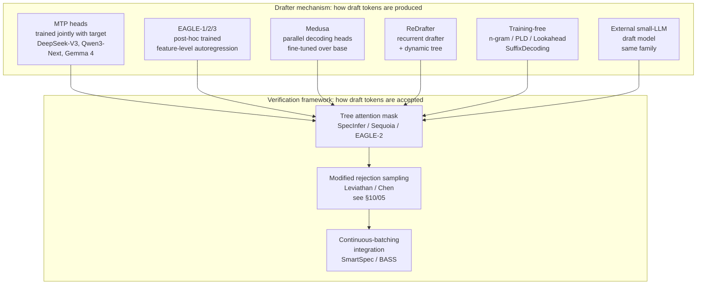

# Multi-Token Prediction

**After reading this chapter, the reader will be able to:**

- Distinguish multi-token prediction (MTP) as a *training-time auxiliary loss* from MTP as an *inference-time drafter source*, and explain how the parallel-heads form (Gloeckle et al., 2024) differs architecturally from the sequential causal-chain form shipped in DeepSeek-V3.
- Place MTP correctly inside the speculative-decoding stack: as one of several mechanisms for *producing* a drafter that plugs into the modified-rejection-sampling verification framework derived in [§10/05-speculative-decoding](05-speculative-decoding.md), alongside EAGLE-3, Medusa, ReDrafter, and training-free drafters.
- Reason about MTP serving costs and constraints — the extra parameters, the disaggregated-decode placement, the per-engine support matrix in vLLM / SGLang / TRT-LLM — and identify which 2025–2026 frontier models ship MTP heads versus which rely on external drafters.

The previous chapter built the verification framework: given a draft of $\gamma$ tokens with per-token acceptance $\alpha$, modified rejection sampling preserves the target distribution exactly while delivering an expected $(1-\alpha^{\gamma+1})/(1-\alpha)$ accepted tokens per target call. That chapter is silent on *where the drafter comes from*. This chapter answers one half of that question: MTP is a training-time recipe that produces a drafter as a side effect of pre-training the main model. The other half — post-hoc drafters such as EAGLE-3, Medusa, and ReDrafter, plus training-free n-gram and suffix methods — is covered in the spec-dec chapter; the goal here is to make clear that all of them feed the same verifier.

## 1. The training-time idea: predicting more than the next token

Standard autoregressive language modelling trains $P(t_{i+1} \mid t_{\le i})$. The transformer trunk produces a hidden state $h_i$ at every position; a single linear "LM head" projects $h_i$ to vocabulary logits, and cross-entropy against the next token $t_{i+1}$ is the loss. Each position contributes one supervised prediction.

Multi-token prediction extends this: at every position $i$, the model is asked to predict not only $t_{i+1}$ but $t_{i+2}, t_{i+3}, \dots, t_{i+k}$ as well. The motivation is twofold. First, pre-training quality: forcing the trunk to encode information about further-future tokens improves data efficiency, gives a stronger gradient signal at large scale, and helps tasks with long-range structure (most prominently code). Second, inference: if those future-token predictions are accurate enough to use as drafts, the auxiliary heads become a built-in drafter for speculative decoding without any post-hoc training step.

Two architectures share the MTP name but differ in how the future-token heads are wired.

### 1.1 Parallel-heads MTP (Gloeckle et al., 2024)

The original "Better & Faster Large Language Models via Multi-token Prediction" paper [[Better-Faster-MTP](../papers.md#better-faster-mtp)] proposes $k$ independent prediction heads sitting atop a shared trunk. Each head $H_i$ for $i \in \{1, \dots, k\}$ is its own output projection (in the simplest form, a single linear layer; in the paper's full form, a single transformer block plus an output projection) and predicts the token $i$ steps ahead. The training loss is a weighted sum of cross-entropies:

$$\mathcal{L}_{\text{MTP}} = \mathcal{L}_{\text{AR}} + \lambda \sum_{i=2}^{k} \mathcal{L}_{\text{head}_i},$$

where $\mathcal{L}_{\text{AR}}$ is the ordinary next-token loss and $\mathcal{L}_{\text{head}_i}$ is cross-entropy for the $i$-th future token. The heads are *parallel*: each head reads from the same trunk hidden state at position $j$ and produces its prediction independently. Head $i$ does not consume the output of head $i-1$; the only shared computation is the trunk.

The key empirical finding in Gloeckle et al. is that this auxiliary objective improves the *base model's* quality at scale, particularly on coding benchmarks (HumanEval, MBPP). The drafter use-case is presented as a downside-free byproduct: the same heads that improved training can be repurposed at inference to draft $k-1$ future tokens in parallel, feeding a standard speculative-decoding verifier.

### 1.2 Sequential causal-chain MTP (DeepSeek-V3)

DeepSeek-V3's technical report [[DeepSeek-V3](../papers.md#deepseek-v3-fp8)] uses a different formulation. Instead of $k$ parallel heads reading from the trunk in lockstep, the MTP modules are arranged as a *sequential causal chain*: head $i$ conditions on the output of head $i-1$, not on the trunk directly. Each MTP module is a full transformer block — its own embedding, its own self-attention and FFN layers, its own output projection — sharing only the embedding table and final linear LM head with the main model.

For prediction depth $k \in \{1, \dots, D\}$, the loss decomposes per depth:

$$\mathcal{L}_k = -\frac{1}{T-k}\sum_{i=1}^{T-k} \log P_k\!\left(t_{i+k} \mid t_{\le i}\right),$$

and the total loss combines the main next-token loss with a depth-averaged auxiliary term:

$$\mathcal{L} = \mathcal{L}_{\text{main}} + \frac{\lambda}{D}\sum_{k=1}^{D}\mathcal{L}_k.$$

DeepSeek-V3 and its successors V3.1 and V3.2 ship $D=1$ at inference (a single MTP module beyond the main LM head, sometimes called "NextN" in engine code) but the architecture admits more. The crucial difference from Gloeckle et al. is the *causal chain*: the depth-2 module reads from the depth-1 module's hidden state, the depth-3 module from depth-2's, and so on. This is more expensive — each additional depth is a full transformer block rather than a single output head — but the chain preserves the autoregressive dependency structure, so each draft token is conditioned on a representation that has already "thought about" the preceding draft.

A reference labelled "MTP" without further qualification is ambiguous: in 2024 it usually meant the Gloeckle et al. parallel-heads form; from 2025 onward, in production engines, it almost always means the DeepSeek sequential-causal-chain form, because that is what shipped at frontier scale. Both are valid auxiliary-loss designs and both produce a built-in drafter, but their parameter count, latency profile, and acceptance-rate behaviour are distinct.

```
                 Parallel-heads MTP                    Sequential causal-chain MTP
                 (Gloeckle et al., 2024)                (DeepSeek-V3)

                       trunk h_i                                trunk h_i
                       /  |  \                                      |
                      /   |   \                                  Module 1
                     v    v    v                              (block + LM head)
                  Head1 Head2 Head3                                  |
                    |    |    |                                      v
                    v    v    v                                  draft t_{i+1}
                draft  draft  draft                                  |
               t_{i+1} t_{i+2} t_{i+3}                            Module 2
                                                              (block + LM head)
                                                                     |
                                                                     v
                                                                draft t_{i+2}
                                                                     |
                                                                  Module 3 ...

                  Heads independent;                       Each module is a full
                  one trunk hidden state                   transformer block; depth-i
                  fans out to all heads.                   reads depth-(i-1) state.
```

Figure 1: Parallel-heads MTP versus sequential causal-chain MTP. The Gloeckle et al. form keeps cost modest (extra heads are output projections and at most one transformer block per head) but draft tokens at depth $i$ do not see the draft at depth $i-1$. The DeepSeek-V3 form is more parameter-intensive (each depth is a full transformer module) but preserves the autoregressive chain across draft positions, which is reported to lift acceptance.

## 2. From MTP heads to a drafter

Once an MTP-trained model lands on the inference engine, repurposing the auxiliary heads as a speculative-decoding drafter is mechanical. The drafter contract is the one defined in the previous chapter: at each verification step, propose $\gamma$ tokens, attach the necessary KV slots and lookahead room, and let the verifier run the target's forward pass on the proposed sequence. Drafts are accepted prefix-wise via modified rejection sampling [see §10/05-speculative-decoding](05-speculative-decoding.md). Nothing about the verification math changes when MTP heads supply the draft tokens.

What does change is the per-token acceptance rate $\alpha$. Two structural reasons make MTP-derived drafters tend to align well with the target's distribution:

1. **Shared trunk and embedding.** The MTP modules share the trunk, the embedding table, and (for the head-only form) the LM head with the main model. The drafter's predictions are computed from the same intermediate representations the main model produces, so $\|p_{\text{draft}} - p_{\text{main}}\|_1$ is small by construction.
2. **Joint training.** Because the auxiliary heads are trained simultaneously with the main next-token objective on the same corpus, their distributions never drift relative to the main model. This sidesteps the "train/serve mismatch" failure mode that post-hoc drafters such as EAGLE have to address with techniques like HASS-style harmonization or DVI-style online retraining.

DeepSeek-V3's technical report cites MTP1 acceptance >80% on its internal evaluation. This number is widely repeated and deserves three layers of hedging when cited in a textbook. First, the >80% figure is from DeepSeek's own evaluation, on workloads they choose; independent confirmation at the acceptance-rate level (not at the end-to-end speedup level) is sparse. Second, $\alpha$ is workload-conditional. SpecBench [[Spec-Bench](../papers.md#spec-bench)] and SPEED-Bench [[SPEED-Bench](../papers.md#speed-bench)] both report acceptance rates varying by 10–25 percentage points across task domains for the same drafter — code and grounded summarization at the top of the range, open-ended chat in the middle, long reasoning chains at the bottom. A single headline number for "MTP acceptance" elides this variance. Third, end-to-end wall-clock speedup depends on $\alpha$, on $\gamma$ (draft length), on the cost ratio $c = T_{\text{draft}}/T_{\text{target}}$ between draft and verify, on batch size, and on the verifier's tree-attention shape. Speedup numbers attached to MTP in vendor blogs are properties of a particular workload, batch size, and serving configuration, not of MTP itself.

The takeaway is structural rather than numerical: MTP-trained heads are a particularly good *source* of draft tokens because they are jointly trained with the target, but the *value* of any given drafter still has to be measured on the actual workload at the actual batch size with the actual hardware.

## 3. Where MTP fits in the spec-dec stack

The single most important framing in this chapter is that MTP and speculative decoding are not alternatives. They sit at different layers of the same stack. Drafting is a *mechanism*; verification is a *framework*. MTP is one drafter mechanism among several; modified rejection sampling is the verification framework that all of them feed into.



Figure 2: MTP as one drafter mechanism among several. The verifier is identical regardless of how the draft tokens are produced; what differs across mechanisms is how the drafter is built and how its distribution aligns with the target. The verification math (modified rejection sampling, tree attention, expected accepted tokens per step) lives in [§10/05-speculative-decoding](05-speculative-decoding.md) and is unchanged here.

This framing has practical consequences. The engine code paths in vLLM, SGLang, and TRT-LLM all treat MTP as a special-case proposer plugged into the same speculative-decoding pipeline that handles EAGLE, Medusa, and n-gram drafters. The scheduler reserves "lookahead tokens" the same way; the rejection sampler accepts a prefix the same way; the tree-attention kernel is the same kernel. Only the drafter's forward pass differs. MTP support in the major engines was added as one row in a `method` enum rather than as a parallel pipeline because the verification layer is invariant.

## 4. Per-model adoption survey

As of mid-2026, frontier models split cleanly into "ships MTP heads" and "uses external drafters." The split is not a quality judgment; it reflects the training-time decision the model team made, and once that decision is locked in, the inference-time drafter follows.

**Models with native MTP heads.** **DeepSeek-V3 / V3.1 / V3.2** are the canonical examples: sequential causal-chain MTP with $D=1$ at inference (one MTP module beyond the main LM head; the engines refer to this as "NextN"), approximately 14B additional parameters on top of the 671B-parameter / 37B-active base [[DeepSeek-V3](../papers.md#deepseek-v3-fp8)]. The MTP module shares embedding and final linear projection with the main model but adds its own attention block and FFN. NVIDIA's TRT-LLM blog on DeepSeek-R1 documents an extension called "Relaxed Acceptance," which accepts a draft token if the target's output falls within a top-N candidate set rather than requiring exact match — a small accuracy concession traded for higher acceptance, especially useful on reasoning workloads where strict-match acceptance collapses with long CoT. **Qwen3-Next-80B-A3B and Qwen3.6-27B** ship native MTP heads on both the hybrid Gated DeltaNet + sparse-MoE Qwen3-Next [[Qwen3-Next](../papers.md#qwen3-next)] and the dense Qwen3.6 [[Qwen3.6-MTP](../papers.md#qwen3-6-mtp)]; specific acceptance rates beyond vendor blogs are limited. **Gemma 4** reports MTP drafters [[Gemma4-MTP](../papers.md#gemma4-mtp)] without fully documenting whether the architecture is parallel-heads or sequential.

**Models without native MTP heads (using external drafters).** **Llama 3.x and Llama 4** ship no MTP heads; production deployment uses EAGLE-style drafters, with Meta's own production paper documenting Llama-3.3-70B and Llama-4 Maverick served with EAGLE drafters at 4 ms/token batch-1 on 8×H100 [[Llama-Spec-Meta](../papers.md#llama-spec-meta)]. **Mistral** has no MTP; EAGLE-3 drafters are available via SpecForge and Speculators. **Kimi K2.5**, despite being frontier-scale and MoE, does not ship MTP heads — the Baseten engineering writeup describes serving K2.5 with a custom-trained ~1B-parameter EAGLE-3 speculator combined with INT4→NVFP4 quantization, reaching 340+ tok/s [[Kimi-K2.5-EAGLE](../papers.md#kimi-k2-5-eagle)] — a useful counter-example showing that ownership of the base-model checkpoint is a prerequisite for shipping MTP heads, and not every frontier-lab team makes the same training-time decision. **GPT-OSS** and the broader set of open-weight models without explicit MTP support rely on EAGLE-3 + SpecForge / Speculators as the most actively standardized OSS path, with ReDrafter (TRT-LLM, originally Apple) and Medusa (Together, Cohere) filling alternative production paths.

The cut between the two columns is tracked closely in [§10/05-speculative-decoding](05-speculative-decoding.md): for models that ship MTP, the engines prefer the native MTP path because the drafter alignment is by construction; for models that do not, EAGLE-3 (with SpecForge or Speculators as the training framework) is the dominant production drafter, with Medusa-2 still competitive at batch-64+ on dense models and ReDrafter / Turbo-LoRA filling specific niches.

## 5. The alternative view: will MTP obviate external drafters?

Some training-time co-design researchers argue that any frontier model trained from scratch in 2026 onward should ship MTP heads, on the reasoning that joint training is strictly better than post-hoc drafter distillation: the heads are optimally adapted to the target's representations, the train/serve mismatch is eliminated, and the operational cost of managing a second checkpoint disappears. Under this view, EAGLE-style post-hoc drafters become a fallback for legacy models or for third-party serving where the MTP path was not part of the original training run.

This is a defensible position with current evidence pointing in its direction — DeepSeek, Qwen, and Gemma have all moved that way. But it is not asserted here as the predicted future. Two qualifications matter. First, the post-hoc drafter ecosystem continues to evolve faster than training cycles. EAGLE-3's training-time test, Mirror-SD's bidirectional speculation, P-EAGLE's parallel drafter+verifier passes, and PARD's target-independent adaptation all landed in 2025–2026, after MTP had become a known training-time recipe; each adds a feature that an MTP-trained model would have to be re-pretrained to incorporate. The training-cost asymmetry — months of pre-training versus weeks of drafter distillation — gives post-hoc drafters a structural advantage in feature velocity. Second, even among models that *do* ship MTP heads, careful acceptance-rate tuning and verification-implementation work remain the differentiator at production scale: the DeepSeek-V3 path benefits from TRT-LLM's "Relaxed Acceptance" tunables, and Qwen3-Next's MTP head still composes with EAGLE-style alternatives in some serving stacks. MTP heads are a strong drafter; they are not a one-line replacement for the entire spec-dec engineering surface.

As of mid-2026, MTP and post-hoc drafters coexist as alternative drafter sources — both feeding the same verifier — and the open question of whether MTP will become as universal as RoPE is genuinely open.

## 6. Serving-side considerations

At inference, MTP heads add memory, compute, and a small number of placement constraints. Each is worth surveying.

**Parameter footprint.** For a sequential-causal-chain MTP with $D$ extra modules, each module is a full transformer block plus an output projection, sharing only the embedding and final LM-head linear with the main model. For DeepSeek-V3 with $D=1$ on top of 671B parameters / 37B active, the extra cost is approximately 14B parameters, with the active fraction at decode time being roughly the equivalent active sliver of one transformer block. This is non-trivial: for a 670B-parameter model, ~2% additional parameters is well below the noise floor; for a 70B-parameter model with three sequential MTP modules, the extra cost would be closer to 5–10% and starts to affect KV memory headroom. The Gloeckle et al. parallel-heads form is cheaper because each "head" is at most one transformer block and the heads are truly independent; in the head-only-projection variant it is essentially free relative to the base model.

**Decode-only placement.** MTP heads run only when the model is *generating*, never during prefill. For prefill-decode disaggregated deployments [see §20/02-prefill-decode-disagg](../20-distributed-inference/02-prefill-decode-disagg.md), this means MTP modules need only be loaded on decode workers; prefill workers can omit them entirely. This yields a small but real memory saving on the prefill side and is a routine optimization in disaggregated stacks.

**KV-cache slots for draft tokens.** The scheduler must reserve "lookahead" KV slots for draft tokens before the verifier runs, since draft tokens occupy KV positions that the verifier's attention will write to. This is the same accounting that EAGLE and Medusa already require — the engine treats all drafter mechanisms identically at the scheduler level — so MTP integration does not introduce a new memory-management primitive. It does, however, mean that any chunked-prefill or paged-KV pressure analysis [see §10/02-paged-kv-memory](../10-engine-core/02-paged-kv-memory.md) should account for the lookahead slots as part of the per-request budget.

**Tree verification.** Some engines run MTP through a tree-style verifier (multiple candidate continuations per step, verified with a tree-causal attention mask) and some through a flat chain. The choice does not change the modified-rejection-sampling math but does change the per-step compute cost (linear in the tree size, sub-linear in the longest path). Sequential-causal-chain MTP with $D=1$ produces a single chain by default; tree verification matters more for parallel-heads MTP and for EAGLE-2-style dynamic trees.

**Per-engine support.** **vLLM**'s V1 architecture exposes MTP as one method (`mtp`, plus a `longcat_flash_mtp` variant for the LongCat lineage) in `vllm/v1/spec_decode/`. The proposer runs on the worker sharing the model's KV cache via `pass_hidden_states_to_model=True`. MTP is supported for the DeepSeek-V3 lineage and for Qwen3-Next / Qwen3.5 / Qwen3.6, and composes with chunked prefill, prefix caching, async scheduling, CUDA graphs, FP8, and FP4 quantization — exactly the same composition contract as EAGLE-3. **SGLang** supports MTP via the spec-dec v1 / v2 worker interface (`--speculative-algorithm` selects among `EAGLE`, `EAGLE3`, `MTP`, `DFLASH`, `STANDALONE`, `NGRAM`, with `SpecV2` as the experimental overlap scheduler); the DeepSeek-V3 family and Qwen3-Next use the MTP path natively, and SGLang reports DeepSeek-V3 + MTP at ~1.4× throughput on its own benchmarks (workload-conditional, not directly comparable across engines without matched configurations). **TensorRT-LLM**'s PyTorch backend implements MTP "Vanilla" and "Eagle" modes in `tensorrt_llm/_torch/speculative/mtp.py`; the `MTPHiddenStatesManager` reserves per-request hidden-state slots and the `MTPSampler` does verification plus draft generation. NVIDIA's "Relaxed Acceptance" extension lifts acceptance for reasoning workloads. MTP sits alongside EAGLE-3 dynamic-tree, Medusa, ReDrafter, lookahead, PARD, DFlash, and the suffix-automaton enhancer in TRT-LLM's roster — the broadest of any production engine — and TRT-LLM supports MTP under disaggregated prefill/decode with the decode-side worker holding the MTP modules.

By mid-2026, all three major NVIDIA-side engines treat MTP as a first-class drafter method composing with paged KV, chunked prefill, async scheduling, CUDA graphs, FP8/NVFP4 quantization, and disaggregated serving on the same terms as EAGLE-3. The integration cost was bounded precisely because the verification layer is shared.

## Current production state

As of May 2026, production MTP serves a specific role: it is the preferred drafter source for the model families that ship MTP heads, and the lever an inference team can pull without negotiating a second-checkpoint training pipeline. The DeepSeek-V3 lineage (V3, V3.1, V3.2) is the canonical frontier example; Qwen3-Next and Qwen3.6 extend the pattern to a different model family; Gemma 4 brings the recipe to Google's open weights. The major engines — vLLM, SGLang, TRT-LLM — all expose MTP as a first-class method behind the speculative-decoding interface, with the DeepSeek-V3 path enjoying the deepest tuning surface (notably TRT-LLM's "Relaxed Acceptance" tunables for reasoning workloads).

For the rest of the production model zoo — Llama 3.x, Llama 4, Mistral, Kimi K2.5, GPT-OSS — MTP heads are absent and the drafter is built post-hoc. EAGLE-3 with SpecForge or Speculators is the dominant standardized OSS path; ReDrafter and Medusa serve specific niches; PARD's target-independent variant offers a low-cost adaptation for new targets. "MTP versus EAGLE-3" is not a horse race — they are alternative drafter sources for the same verifier, with the mechanism that fits the model's pedigree winning by default.

The verification framework is the invariant. Modified rejection sampling, tree attention, expected accepted tokens per step, the goodput-shaped batched serving objective — none of these change when MTP heads supply the draft tokens. The contract between drafter and verifier was fixed by Leviathan and Chen in 2022–2023; what 2024–2026 added is a richer ecosystem of drafter mechanisms that satisfy that contract. MTP is one of them, distinguished by its training-time origin, its acceptance-rate alignment with the target by construction, and the cleanliness of having no second checkpoint to manage. Whether MTP heads become as standard as RoPE, or remain one option among several, will be settled by the next two years of frontier-model pre-training decisions, not by the inference engineering work that consumes them.
