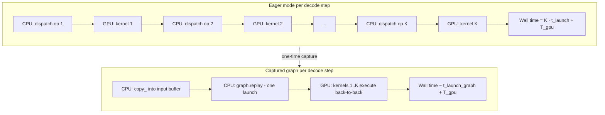
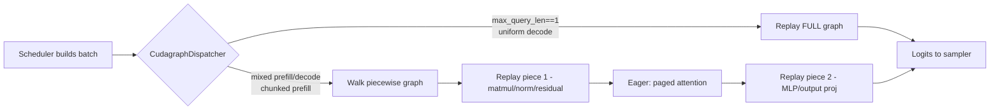
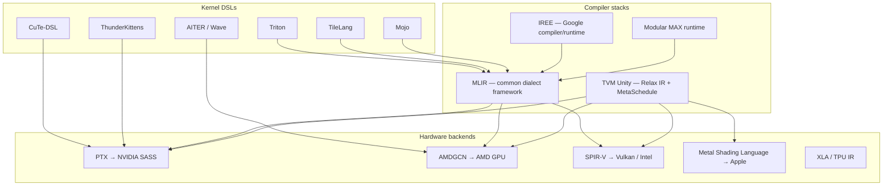

# CUDA Graphs and the Compiler Stack

**After reading this chapter, the reader will be able to:**

- Explain why CPU-side kernel launch overhead becomes a first-order cost in the decode-bound regime, derive the latency model for CUDA graph capture and replay, and reason about when full, piecewise, and decode-only graph modes are the right capture strategy.
- Describe how `torch.compile` and TorchInductor interact with CUDA graphs in a serving engine, what shape-dynamism does to the cache, and how vLLM's `FULL_AND_PIECEWISE` design works around the dynamic-shape problem.
- Place the cross-vendor compiler stack — MLIR, Triton-on-MLIR, IREE, TVM Unity, Modular Mojo / MAX — relative to the kernel DSLs developed in [§10/01-attention-kernels](01-attention-kernels.md) and identify which compiler underwrites portability for which non-NVIDIA backend.

The previous chapters have treated the kernel as the unit of work. From the GPU's perspective each kernel is cheap; from the CPU's perspective it is *expensive to launch* — every kernel issue traverses the CUDA runtime and writes a launch packet across PCIe. At small batch that overhead becomes the bottleneck. This chapter covers the mechanisms that drive it toward zero: graph capture, ahead-of-time compilation, and the cross-vendor compiler stacks that underwrite them, ending with the megakernel direction that aims to remove the kernel boundary entirely.

## 1. The kernel-launch tax in the decode regime

The decode roofline derived in [§00/01-inference-landscape](../00-foundations/01-inference-landscape.md) and [§00/02-transformer-arithmetic-roofline](../00-foundations/02-transformer-arithmetic-roofline.md) assumes the GPU is the binding resource. At small batch — single-request decode on a frontier-class model — the GPU is fast enough that the *CPU* becomes the bottleneck.

A Transformer forward pass launches a long kernel chain: per layer, an RMSNorm, a fused QKV matmul, an attention kernel, an output projection, two MLP matmuls and an activation, plus residuals and small elementwise ops. With KV management and sampling the per-iteration kernel count for a 70B-class dense model lands in the high hundreds; for an MoE model with dispatch/combine and per-expert matmuls it lands in the low thousands.

Each launch costs on the order of $5$–$20\,\mu s$ depending on stream contention, the runtime version, and whether it goes through the PyTorch dispatcher or directly through the CUDA driver API. Call this $t_{\text{launch}}$. For a forward pass with $K$ kernels, the CPU-only contribution to per-iteration latency is

$$
T_{\text{cpu}} = K \cdot t_{\text{launch}}.
$$

The GPU contribution at batch $B = 1$ on a memory-bound dense model is

$$
T_{\text{gpu}} \approx \frac{2P}{W} = \text{TPOT}(1)
$$

with $P$ the parameter count in FP16 and $W$ HBM bandwidth. In practice the CPU overhead is mostly *serialized* with kernel issue, so the costs add and achieved decode latency is closer to $T_{\text{cpu}} + T_{\text{gpu}}$.

A worked instance: at $K = 600$ and $t_{\text{launch}} = 8\,\mu s$, the CPU floor is $4.8\,\text{ms}$. A 70B FP8 model on H200 ($W \sim 4.8\,\text{TB/s}$, $\sim 70\,\text{GB}$ of weights) has a roofline-bound $T_{\text{gpu}}$ around $15\,\text{ms}$ at batch 1; the CPU tax is roughly a quarter of wall time. On an MoE model with smaller per-iteration HBM read and a higher kernel count, the CPU tax can dominate. The ratio $T_{\text{cpu}} / (T_{\text{cpu}} + T_{\text{gpu}})$ is the structural reason CUDA graphs exist.

Two things make the tax worse on modern hardware. Kernels get faster generation over generation while the kernel-launch path on the host does not. And single-kernel attention (FlashMLA, FlashInfer's BSR kernels, FA-3/4) has collapsed multi-kernel attention into one kernel on the GPU side, raising the *fraction* of remaining wall time that is CPU-bound.

## 2. CUDA graph mechanics: capture and replay

A CUDA graph is a DAG of CUDA operations — kernel launches, memory copies, event records, stream synchronizations — built once and replayed many times. The graph is constructed either programmatically via `cudaGraphCreate` and friends or, far more commonly in PyTorch engines, by *stream capture*: a CUDA stream is put into capture mode, the model is run through it once with shape-correct dummy inputs, and the runtime records every operation issued on the stream into a graph object. A subsequent `cudaGraphLaunch` issues the entire recorded operation sequence with a single host-side API call.

The mechanics, in PyTorch:

```python
# Capture phase — done once at engine warmup.
input_buffer  = torch.empty((B, S), device='cuda')   # persistent input buffer
output_buffer = torch.empty((B, V), device='cuda')   # persistent output buffer

g = torch.cuda.CUDAGraph()
with torch.cuda.graph(g):
    output_buffer.copy_(model.forward(input_buffer))  # recorded, not executed

# Replay phase — every decode step.
input_buffer.copy_(actual_input_tokens)               # write into the captured buffer
g.replay()                                            # executes all recorded kernels
result = output_buffer                                # read from the captured buffer
```

The contract is exact: the kernels enqueued during capture execute *on the same memory addresses* during replay. New tensors are not allowed; Python-side conditional control flow is collapsed into whichever branch ran during capture. Inputs and outputs reach the graph through *persistent buffers* whose addresses are baked in.

The latency model on replay is roughly

$$
T_{\text{replay}} \approx t_{\text{launch,graph}} + T_{\text{gpu}}, \quad t_{\text{launch,graph}} \approx 2\text{–}3\,\mu s,
$$

independent of the number of kernels in the graph. The same 70B-class decode that paid $4.8\,\text{ms}$ of CPU overhead in eager mode pays roughly $3\,\mu s$ under a captured graph.



Three constraints structure how engines use graphs in practice.

**Fixed shapes.** The graph encodes tensor metadata at capture time. Replaying with a different shape silently produces wrong results — the kernels run with the captured launch parameters, ignoring whatever the new tensor headers say. Engines therefore *bucket* by shape at warmup and capture one graph per bucket.

**Fixed addresses.** The graph encodes pointer values at capture time. Allocations inside the captured region are baked in; replays re-use the same memory. PyTorch supports this through a private memory pool tied to the graph, plus `make_graphed_callables` for whole-module capture. Engines pin the relevant tensors as persistent buffers and never reallocate them.

**No CPU-side branching.** Anything that needed a CPU decision during the captured window — sampler choice, KV block-table indirection that depends on a host tensor, Python-side loops — must be hoisted out, replaced with GPU-resident control (mask tensors, pre-computed block-table pointers), or excluded from the graph. This is the constraint that motivates *piecewise* capture in §4.

## 3. Bucketing and the padding cost

Because shapes are fixed, capturing a graph for every reachable batch-size × sequence-length combination is a combinatorial explosion. Production engines instead capture graphs at a small *list* of canonical bucket sizes and pad actual workloads up to the next bucket.

vLLM, SGLang, and TRT-LLM all bucket along similar axes: decode batch size (typical lists are powers of two with intermediate sizes — denser at small sizes where launch overhead dominates, sparser at large sizes where bandwidth amortizes padding); chunked-prefill token budget at the scheduler's granularity ([see §10/03-batching-scheduling](03-batching-scheduling.md)); occasionally sequence length, though paged-attention kernels with block tables typically absorb sequence-length variation below the graph level.

The cost of bucketing is wasted compute proportional to the rounding gap: a batch of 9 padded to bucket 16 wastes $7/16$ of the iteration's MLP and attention compute. The cost is bounded by the bucket spacing and traded against warmup time and graph-memory consumption (each captured graph holds metadata and pool memory).

The opposite trade-off surfaces in the `enforce_eager` flag, which disables CUDA graphs entirely. It is appropriate for debugging, very large prompt-bucket spaces where capture memory is prohibitive, and development workflows that change the model graph between iterations. In production it is always disabled; the launch tax is too large to leave on the table.

## 4. Dynamic shapes, `torch.compile`, and piecewise CUDA graphs

A continuous-batching engine produces a continuously-changing sequence of workloads: the batch composition shifts every iteration as requests join, finish, or transition between prefill and decode. The CUDA-graph shape constraint is therefore in direct conflict with the engine's shape-dynamism. Two compiler-side technologies absorb the conflict.

**`torch.compile` and TorchInductor.** PyTorch 2.x's compiler stack — TorchDynamo for graph capture, TorchInductor as the default backend — traces a Python module into an FX graph and lowers it to a fused executable. Inductor generates Triton kernels for elementwise / pointwise / reduction work and dispatches matmuls to cuBLAS or cuDNN. The wins are kernel fusion (RMSNorm + residual + activation into a single Triton kernel), reduced HBM traffic, and AOT specialization to the live model.

For LLM inference the limitations are immediate. Recompilation triggers on any traced-shape change, and a serving engine's shapes change every iteration. Compile times for large models run into the minutes; an engine that recompiled per-iteration would never serve a request. PyTorch's `torch.compile(dynamic=True)` uses *symbolic shapes* to address part of this — shapes become symbolic integers in the FX graph — but symbolic-shape support is incomplete for some kernel paths and resulting graphs are sometimes slower than statically-specialized ones.

The standard production answer is to compile *once* at engine startup with shapes specialized to the bucket list, cache the compiled artifacts on disk, and reload them at every subsequent process start. vLLM's `vllm/compilation/backends.py::VllmBackend` is the Inductor adapter; the cache lives at `~/.cache/vllm/torch_compile_cache/` keyed by a hash over model config, parallel config, dtypes, and PyTorch state. All compilation completes before the engine accepts the first request, so per-request latency is bubble-free.

**Piecewise compilation and piecewise CUDA graphs.** The deeper issue is that some operations resist both compilation *and* graph capture. Attention against a paged KV cache is the canonical example: the kernel reads a per-iteration block table whose contents change with the request mix, and the block-table pointer arithmetic uses host-resident metadata that cannot be safely baked into a graph. The same problem affects MoE dispatch, KV allocation, and rejection-sampling decisions for spec-dec.

vLLM V1's solution is *piecewise* compilation paired with *piecewise* CUDA graphs. The FX graph is partitioned at the boundaries of non-graphable ops, defined in `vllm/compilation/partition_rules.py`. Non-graphable ops (attention, custom collectives) execute eager; the surrounding sub-graphs are each Inductor-compiled and each captured as their own CUDA graph. At runtime the scheduler walks the partitioned graph: for each piece, replay or eager launch as appropriate. The dispatcher is `vllm/v1/cudagraph_dispatcher.py::CudagraphDispatcher`, the wrapper is `vllm/compilation/cuda_graph.py::CUDAGraphWrapper`.

The capture modes in V1, as named in the codebase:

| Mode | Behavior |
|---|---|
| `NONE` | Eager. Used for debugging and for `enforce_eager` deployments. |
| `PIECEWISE` | Per-subgraph CUDA graphs around fusable regions; attention stays eager. The historic default. |
| `FULL` | One CUDA graph for the whole forward pass; works only when batches are uniform and all ops are graphable. |
| `FULL_DECODE_ONLY` | Full graph for uniform-decode batches only; used on decode-only replicas in P/D-disaggregated deployments [see §20/02-prefill-decode-disagg](../20-distributed-inference/02-prefill-decode-disagg.md). |
| `FULL_AND_PIECEWISE` | The current default. Captures both: uses the full graph for uniform-decode iterations and falls back to piecewise for mixed prefill / chunked-prefill iterations. |

The dispatcher decides per iteration by inspecting `max_query_len`: a value of $1$ (or $1 + \text{num\_spec\_tokens}$ under speculative decoding) marks a uniform-decode iteration the full graph can serve. Mixed batches — prefill-only, prefill-plus-decode, chunked-prefill — go through the piecewise path. The combination wins because uniform decode is the *hot* iteration shape in steady state, has the lowest per-iteration GPU cost, and therefore has the highest CPU-overhead fraction. Capturing a full graph for that one shape pays back faster than any other capture in the engine.

The encoder side has its own capture path (`v1/worker/encoder_cudagraph.py`) for ViT-style image encoders in multimodal models — uniform per image, and benefits from full capture for the same reason.



TensorRT-LLM follows a related design via its `trtllm-gen` flow: pre-compiled per-architecture FMHA cubins for attention, surrounding kernels under TensorRT's engine builder, CUDA graph capture at the executor level. SGLang exposes the same set of capture modes through its `cuda_graph_max_bs` family of flags. The 2026 convergence point: *piecewise capture is the default; full capture is opt-in for the uniform-decode hot path*.

## 5. The megakernel direction

CUDA graphs eliminate CPU-side launch overhead but do not eliminate the *kernel boundary* itself. Between two recorded kernels the GPU still synchronizes on stream order, drains pipelines, and re-establishes register and shared-memory state. For a long forward pass with many small kernels the cumulative kernel-boundary overhead is non-trivial.

The frontier direction, advocated most strongly by Hazy Research's [ThunderKittens](https://hazyresearch.stanford.edu/blog/2024-05-12-quick-tk) line of work, is to compile the entire Transformer layer — or even the whole forward pass — into a single *megakernel* that runs persistently on the GPU, using on-device control flow rather than CPU orchestration. The kernel takes the form of a long-lived persistent grid that loops over layers internally, dispatches sub-tasks (attention tile, matmul tile, norm) to specialized warpgroups, and uses on-device queues or atomics to coordinate.

The lineage relevant to this chapter:

- **ThunderKittens (TK)** [TK]. A tile-based DSL embedded in C++ (and, in TK-2.0, Python) for writing attention and MLP kernels as compositions of warpgroup-level primitives over named tile shapes. TK was originally targeted at single-kernel attention; the *megakernel* extension uses TK's persistent-grid scheduler to keep a whole Transformer layer resident.
- **TK-Blackwell** [TK-Blackwell] and **TK-2.0** [TK-2.0]. Successive ports onto Blackwell's tcgen05 / TMEM machinery and a reorganization toward Python ergonomics. TK-2.0 (Hazy Research, 2026-02) is the version on which the megakernel direction is being prototyped.
- **Megakernels for inference** [Megakernels]. The "Loads and Loads of Fluffy Kittens" blog (Hazy Research, 2025-11) lays out the argument: at small-batch long-context decode, CPU plus kernel-boundary overhead is comparable to compute, and a single persistent kernel can absorb both.
- **Liger Kernel** [Liger]. A Triton-based fused-kernel library (RMSNorm, RoPE, fused linear-cross-entropy) that took the multi-kernel-fusion direction in the training-time ecosystem. Not a megakernel in the persistent-grid sense, but the production-deployed instance of the same fusion-into-fewer-launches pressure on the training side; ships in HF / TRL / Axolotl pipelines.

As of mid-2026 the megakernel approach is not the production default in any major serving engine. vLLM V1, SGLang, and TRT-LLM all rely on the piecewise graph + captured-decode design of §4. The megakernel direction is best understood as the *next* step on the same trajectory: each step extends the unit of work that runs without CPU intervention. Graphs took the unit from "one kernel" to "one forward pass"; megakernels propose taking it to "many forward passes within a single resident kernel," collapsing the kernel-boundary overhead graphs still pay.

Constraints on adoption are mostly engineering rather than fundamental: persistent kernels are harder to debug, dynamic shapes still need runtime dispatch *inside* the kernel, and the abstraction does not yet compose cleanly with the heterogeneous attention / MoE / quantization paths production engines need.

## 6. The cross-vendor compiler stack

Everything to this point is portable in principle and overwhelmingly NVIDIA-specific in practice. CUDA graphs are CUDA. `torch.compile` ships with CUDA and ROCm backends but the ROCm path lags. Triton has had a multi-vendor backend story for years, but production deployments at scale run its NVIDIA path. The compiler is the layer at which non-NVIDIA hardware portability is *actually* delivered.

Almost every modern ML compiler targets [MLIR](https://mlir.llvm.org/) at some level. MLIR — Multi-Level Intermediate Representation — is the LLVM-project framework for defining *dialects*: domain-specific IRs that share infrastructure (passes, types, traversal, printing) but represent program semantics at different levels of abstraction. A compilation flow lowers progressively from a high-level dialect (tensor / linalg / tile) to a hardware-specific dialect (NVVM / ROCDL / SPIR-V) and then to a backend assembler (PTX / AMDGCN / SPIR-V binary). The "multi-level" in MLIR refers to that lowering ladder.



The diagram folds together two distinct populations that are easy to confuse. *Kernel DSLs* (Triton, CuTe-DSL, ThunderKittens, TileLang, AITER/Wave, Mojo at one of its abstraction levels) are the languages a kernel author writes in. *Compiler stacks* (MLIR, IREE, TVM, MAX) are the infrastructure those DSLs target on the way to a backend. The DSL landscape was developed in [§10/01-attention-kernels](01-attention-kernels.md, Part 4); the compiler-stack layer is what follows.

### 6.1 Triton on MLIR

Triton — the dominant open-source kernel DSL after CUTLASS — moved its compiler infrastructure to MLIR with the Triton 2.x rewrite. The Triton frontend produces a `triton` dialect, lowered through standard MLIR passes (canonicalization, layout selection, vectorization, pipelining) into either NVIDIA's NVVM dialect (then PTX) or AMD's ROCDL dialect (then AMDGCN). The cross-vendor story is real: the same Triton source compiles on H100 and MI300X. In practice the NVIDIA path is more mature; the AMD path closes the gap with each ROCm release but lags on layout selection for the latest tensor-core variants.

The vLLM Triton attention backend [Triton-Anatomy] reaches $\sim 100\%$ of FA-3 on H100 and is the default attention path on AMD; it is also the portable fallback when FA-3 / FA-4 are unavailable. This is the most visible evidence that Triton-on-MLIR is a viable cross-vendor production path *for the kernels that fit Triton's programming model*.

### 6.2 IREE — Google's compiler-and-runtime

IREE (Intermediate Representation Execution Environment) is Google's open-source compiler and runtime, designed from the start around MLIR. Its compilation flow lowers from MHLO / Linalg through IREE's own dialects (`flow`, `stream`, `hal`) to SPIR-V (Vulkan), CUDA, ROCm, Metal, and CPU LLVM. The runtime handles command-buffer construction, asynchronous dispatch, and resource management.

For ML serving the most-cited IREE deployment is AMD's MLPerf Inference SDXL submission, which used IREE to generate diffusion-model code on MI300X — an existence proof of competitive code generation against MI300X tensor cores at MLPerf-grade workloads. IREE is also used in some ROCm production deployments for image and audio models. Its visibility on the LLM serving side specifically is lower than on the diffusion side; vendor production-status claims should be hedged.

### 6.3 TVM Unity — Apache TVM, modernized

TVM has the longest history of any open-source ML compiler. *TVM Unity* is its modern incarnation, organized around the **Relax** IR (first-class dynamic-shape support, tighter MLIR integration) and the **MetaSchedule** auto-tuning framework (a more uniform search over schedule programs than the older AutoTVM / Ansor loops).

TVM targets are broad: CUDA, ROCm, Metal, Vulkan, OpenCL, plus embedded and ASIC backends through community plug-ins. In production the most visible TVM deployments are *edge* — MLC LLM (TVM-based) ships LLM serving on Apple Silicon, mobile, and WebGPU. On the server side TVM is less common; vLLM, SGLang, and TRT-LLM do not use it in their main paths. TVM Unity is the most mature among the cross-vendor compiler stacks for *device diversity* and the least mature for server-side LLM production.

### 6.4 Modular Mojo and MAX

Mojo, from Modular, is a Python-superset language that compiles to MLIR for high-performance ML kernel authoring — the intent is Python ergonomics with hand-written-MLIR performance. **MAX** (Modular Accelerated Execution) is Modular's runtime; together they form a vertically-integrated stack aimed at NVIDIA, AMD, and (per Modular's roadmap) custom accelerators.

Modular has reported early production deployments and competitive benchmarks on H100 and MI300X, but as of mid-2026 vendor-neutral confirmation at the scale of vLLM / SGLang / TRT-LLM is limited. The fairest characterization is that Mojo and MAX are an actively-developed *competitor in the cross-vendor kernel-authoring and runtime space*; production-status claims at frontier-lab scale should be treated as vendor-supplied rather than independently confirmed.

### 6.5 Connection back to the DSL landscape

The relationships between the kernel DSLs of [§10/01-attention-kernels](01-attention-kernels.md) (Part 4) and the compiler stacks above:

- **Triton** is the DSL whose compiler is MLIR-based. Path: Triton → `triton` dialect → MLIR → PTX / AMDGCN.
- **CuTe-DSL** is NVIDIA-only. It targets PTX directly through a CUTLASS-style template-and-tile composition; FA-4 is its highest-profile artifact.
- **ThunderKittens** is C++/Python and likewise targets NVIDIA directly; the TK-2.0 line is on the same NVIDIA-specialized track as CuTe-DSL.
- **TileLang** — a tile-IR DSL from the Microsoft / academic side — also targets MLIR.
- **AITER / Wave** is the AMD-side parallel lineage, targeting AMDGCN through ROCm's compiler. The AMD trajectory is developed in [§70/02-amd-and-non-nvidia-gpu](../70-hardware/02-amd-and-non-nvidia-gpu.md).
- **Mojo** sits at the same DSL level as Triton but ships its own end-to-end compiler / runtime (MAX) rather than feeding into a third-party stack.

*The compiler is the engine for hardware portability*. As long as a hardware vendor supplies a competent MLIR backend for its tensor cores plus a competent runtime for its command-buffer model, MLIR-routed DSLs travel. The vendor-by-vendor practical maturity of those backends is uneven; an engineer evaluating a non-NVIDIA platform should ask not "does it run PyTorch" but "what is the compiler path from the chosen kernel DSL to this hardware, and what is its production-grade test history."

## Current production state

As of May 2026 the production CUDA-graph and compilation story has converged across the major engines. vLLM V1 ships `FULL_AND_PIECEWISE` as the default `CUDAGraphMode`, dispatched at iteration time by `CudagraphDispatcher`: full capture for uniform-decode batches (and decode-only replicas in P/D-disaggregated deployments), piecewise capture for mixed batches, eager fallback for ops marked non-graphable in `partition_rules.py`. `torch.compile` is on by default; compilation cache lives at `~/.cache/vllm/torch_compile_cache/` keyed by a config hash, and the engine blocks on `compile_or_warm_up_model` so per-request latency is bubble-free. SGLang exposes the same tier of capture modes through its `cuda_graph_*` flags. TRT-LLM relies on its `trtllm-gen` precompiled FMHA cubins per architecture, builds surrounding kernels through TensorRT's engine builder, captures CUDA graphs at the executor level, and integrates `torch.compile` for its `_torch` flow. The `enforce_eager` and equivalent flags exist mainly for debugging; they are uniformly disabled in production.

The compiler-stack picture is more uneven. On NVIDIA, MLIR matters mostly through Triton — vLLM's pure-Triton attention backend is the cross-architecture fallback and the production default on AMD; the high-end attention paths (FA-3 on Hopper, FA-4 on Blackwell) bypass MLIR through CuTe-DSL or hand-written CUDA. On AMD, ROCm's compiler stack carries the production load directly; IREE has demonstrated MLPerf-grade SDXL code generation on MI300X and is used in some ROCm deployments, but the LLM serving path on AMD currently runs through vLLM's Triton backend, AITER, and ROCm's own compiler rather than IREE end-to-end. TVM Unity dominates *edge* deployments — MLC LLM ships LLM serving on Apple Silicon, mobile, and WebGPU through TVM — and is rare in server-side production. Modular Mojo and MAX have reported early production deployments and competitive benchmarks; vendor-neutral confirmation at the scale of the established server-side engines is limited and production-status claims from this corner of the stack should be hedged. Looking forward, the megakernel direction (TK-2.0 and Hazy Research's persistent-kernel work) is the most credible candidate to replace `FULL_AND_PIECEWISE` as the dominant pattern, but no production engine has switched and the question of whether the abstraction can absorb the heterogeneous attention / MoE / quantization paths an engine actually needs is unresolved. The right characterization for now: piecewise CUDA graphs on top of `torch.compile`-cached forward passes are the production default; the megakernel future is plausible but not yet here.
