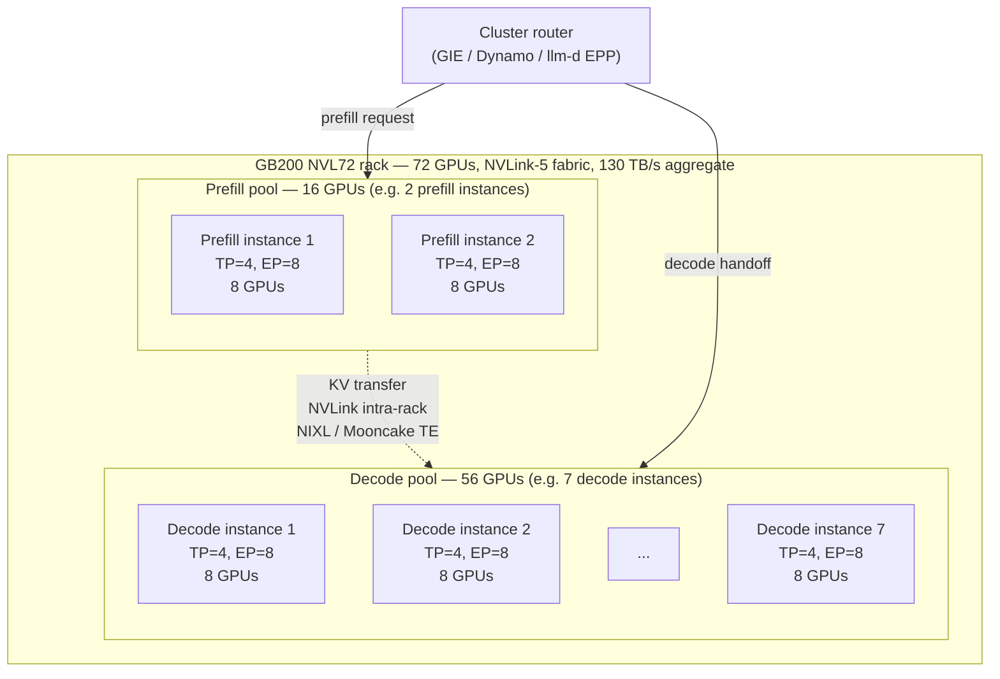

# Parallelism Strategies for LLM Inference

**After reading this chapter, the reader will be able to:**

- Map the five canonical parallelism axes of distributed LLM inference — tensor (TP), pipeline (PP), sequence (SP), expert (EP), data (DP) — onto the collective each axis induces, and quote the per-layer or per-iteration communication volume each axis pays as a function of process count, model dimension, and batch.
- Read a frontier deployment's parallelism stack — DeepSeek-V3 on EP320 decode, Kimi-K2 on 128×H200, Llama-class on TP=8 / DP=N — and explain why each axis lives where it lives, which interconnect tier carries it, and what the bubble or imbalance budget is.
- Apply a decision framework that, given a model size, a target SLO, and a hardware envelope, prescribes a parallelism layout and identifies the binding bottleneck (NVLink-domain size, IB bandwidth, all-to-all volume, pipeline bubble, or KV memory).

The collectives primer ([§00/04-collectives-and-comm-primer](../00-foundations/04-collectives-and-comm-primer.md)) gave the communication vocabulary — the four collectives, the latency–bandwidth model $T = \alpha + m/\beta$, the NVLink-versus-InfiniBand asymmetry, and the KV-transfer point-to-point primitive. This chapter applies that vocabulary to the strategies that carve a model across GPUs in production. The MoE-specific deep dive (DeepEP, EPLB, AFD, Wide-EP) is in [§20/03-moe-inference](03-moe-inference.md); the long-context sequence-parallel deep dive is in [§20/04-long-context-inference](04-long-context-inference.md); prefill–decode disaggregation is in [§20/02-prefill-decode-disagg](02-prefill-decode-disagg.md). The job here is the taxonomy: when each axis helps, what it costs, how the axes compose.

A frontier MoE deployment in 2026 typically uses four of the five axes simultaneously — TP within a node, EP across the rest of the NVLink fabric, PP across nodes, DP across replicas — and a long-context dense workload adds the fifth (SP). None of the choices is independent: TP degree limits per-GPU GEMM saturation; PP degree controls bubble fraction; EP degree controls all-to-all volume. The binding constraint moves with the workload, but it is *predictable* once one knows which axis induces which collective and where each collective lives on the fabric.

## 1. Tensor parallelism (TP)

Tensor parallelism partitions the *weight matrices* of a transformer layer across $T$ GPUs and combines partial results with a synchronous collective at each layer boundary. The canonical recipe is the Megatron-LM column-then-row pattern: split the up-projection of the FFN (and the QKV projection of attention) **column-parallel** so each GPU computes its own slice of the output activations without inter-GPU communication, then split the down-projection (and the output projection of attention) **row-parallel** so the partial outputs sum into the final activation via an **all-reduce**.

### 1.1 Column-parallel and row-parallel matmuls

Take an FFN block $y = (xW_1)W_2$ with $W_1 \in \mathbb{R}^{d \times d_{\text{ff}}}$, $W_2 \in \mathbb{R}^{d_{\text{ff}} \times d}$, batch $B$, $d_{\text{ff}} = 4d$. Under TP=$T$:

- **Column-parallel $W_1$**: shard along the output dimension. GPU $t$ holds $W_1^{(t)} \in \mathbb{R}^{d \times d_{\text{ff}}/T}$ and computes $h^{(t)} = x W_1^{(t)}$. The input is replicated; the output is sharded along $d_{\text{ff}}$. No inter-GPU communication.
- **Row-parallel $W_2$**: shard along the input dimension. GPU $t$ holds $W_2^{(t)} \in \mathbb{R}^{d_{\text{ff}}/T \times d}$ and computes $y^{(t)} = h^{(t)} W_2^{(t)}$. The partial outputs sum: $y = \sum_t y^{(t)}$ — an **all-reduce** of size $B \cdot d \cdot b$ per GPU at byte-width $b$.

The FFN block pays one all-reduce per layer. The same construction applies to attention: split QKV column-parallel along the head axis (each GPU holds $H/T$ heads), compute attention locally, then row-parallel the output projection. A transformer layer therefore pays two all-reduces per forward pass. (Sequence parallelism, §3, replaces these with all-gather + reduce-scatter pairs around the layer-norm regions to cut activation memory; the per-layer volume is identical.)

### 1.2 TP communication volume — derivation with numbers

The collective primer ([§00/04](../00-foundations/04-collectives-and-comm-primer.md), §2.1) showed that ring all-reduce moves $\approx 2N$ bytes per GPU asymptotically, *independent of $T$*. For a TP-FFN all-reduce at byte-width $b$:

$$ N_{\text{ar}} = B \cdot d \cdot b \quad [\text{bytes}]. $$

A worked decode example: $B=32$, $d=8192$, BF16 gives $N_{\text{ar}} \approx 0.5$ MB. On HGX H100 NVLink 4 ($\beta \approx 450$ GB/s, $\alpha \approx 1\,\mu s$), bandwidth term ~2 μs, latency term $2(T-1)\alpha$ at $T=8$ is 14 μs — the all-reduce is *latency-bound*. Two all-reduces per layer × 80 layers × 15 μs ≈ 2.4 ms per token of TP overhead, a meaningful fraction of single-request decode on Hopper. For prefill at $S=8192$ the activation tensor is 128 MB; ring's $\approx 2N$ regime puts each layer at ~569 μs and the per-token-prefill TP cost approaches 91 ms before overlap. This is why prefill schedules aggressively overlap TP all-reduce with the next column-parallel matmul, and why TP across InfiniBand — where $\beta$ collapses by an order of magnitude — is structurally unviable.

### 1.3 TP placement — the NVLink-domain rule

TP all-reduce sits on the critical path of every layer; the latency term $2(T-1)\alpha$ multiplies linearly in $\alpha$. NVLink delivers $\alpha \approx 1\,\mu s$ inside an 8-GPU HGX baseboard or a 72-GPU NVL72 rack; InfiniBand delivers $\alpha \approx 5\text{–}15\,\mu s$. Pushing TP across IB inflates per-layer TP cost by 5–10×, dominating per-token cost over 60–80 layers. The production rule is: **TP within a scale-up domain.** The domain boundaries that matter in 2026:

- **HGX H100 / H200 (8 GPUs, NVLink 4 + NVSwitch)**: the workhorse for enterprise serving. TP $\in \{1, 2, 4, 8\}$ are the realistic choices; TP > 8 requires crossing IB.
- **GB200 / GB300 NVL72 (72 GPUs, NVLink 5)**: the rack-scale NVLink fabric extends the TP-eligible domain to 72 GPUs at $\sim$130 TB/s aggregate. Frontier MoE deployments prefer TP $\le 16$ and spend the remaining budget on EP — DeepSeek-V3's reference deployment uses TP=4 on both prefill and decode.
- **NVL576 (Rubin Ultra, announced)** and **NVLink Fusion** extend the rule but no shipped non-NVIDIA partner silicon as of May 2026 changes the production reality.

TP also has a diminishing-returns ceiling from above: per-GPU GEMM saturation degrades as $T$ grows, with kernel-launch overhead and wave quantization eating into the speedup. TP=8 saturates per-GPU GEMM on Hopper for $d \le 8192$; TP=16 on Blackwell loses 10–20% of theoretical scaling.

### 1.4 When TP helps

Two conditions justify TP: (1) the model does not fit on one GPU at the chosen byte-width — a 70B-class model in FP16 needs 140 GB; H100 80GB cannot host it without offload — so TP=2 or TP=4 is the obvious answer; (2) batch is small enough that DP would be wasteful. At $B=1$ single-request latency, doubling TP roughly halves per-token decode time as long as the all-reduce stays under the compute saving; on HGX H100, TP=4 vs TP=2 typically reduces single-request 70B decode latency by 35–45%, with diminishing returns past TP=8. TP does not help when the model fits on one GPU and the workload is already DP-saturated.

## 2. Pipeline parallelism (PP)

Pipeline parallelism partitions the model's *layers* across $P$ stages, each stage holding $L/P$ contiguous layers. Activations flow forward through the stage chain via point-to-point sends at each layer boundary; the cross-GPU primitive is `send`/`recv`, not a collective. Pipeline parallelism is the parallelism axis that scales gracefully across IB, because the per-stage transfer is a single tensor per micro-batch and IB latency is hidden behind the next stage's compute.

### 2.1 Communication volume

A PP send transmits one activation tensor per micro-batch per stage boundary: $N_{\text{pp}} = b_{\mu} \cdot S \cdot d \cdot b$. For decode ($S=1$, $b_{\mu}=32$, $d=8192$, BF16), $N_{\text{pp}} \approx 524$ KB — ~10 μs over IB NDR ($\beta \approx 50$ GB/s), the same order as the next stage's compute, hidden under pipelining. For prefill of an 8K chunk, $N_{\text{pp}}$ scales to ~128 MB per stage (~2.5 ms over IB) — still hideable, though stage-balancing matters. PP over IB is *not* a footgun the way TP over IB is, because PP sends one tensor per micro-batch per stage, whereas TP all-reduce sends $\approx 2N$ per GPU per layer over $T-1$ latency-bound rounds.

### 2.2 The pipeline bubble

The price of partitioning layers across stages is the *pipeline bubble*. For a batch of $m$ micro-batches and $P$ stages, the simplest 1F1B (one-forward-one-backward) schedule has a startup phase of $P-1$ stages where the pipeline is filling and an end phase where it is draining. In an inference-only context (no backward pass), the bubble fraction is

$$ \text{bubble fraction} = \frac{P - 1}{m + P - 1}. $$

Two limits matter:

- $m = 1$ (single-request prefill or a batch of one): bubble $= (P-1)/P$, approaching 100% as $P$ grows. PP is *useless* for single-request latency-sensitive workloads — the entire pipeline serializes through one micro-batch.
- $m \gg P$ (high-throughput batch serving): bubble $\to 0$. This is where PP earns its keep — at $P = 4$, $m = 64$, the bubble is $3/67 \approx 4.5\%$, well within budget.

This is the structural reason PP is a *throughput* lever and not a *latency* lever. PP's communication is cheap; its scheduling cost is in the bubble fraction.

### 2.3 DualPipe: bidirectional pipelines

[DualPipe](../papers.md#dualpipe) (DeepSeek, Open-Source Week, February 2025) is the most-discussed pipeline schedule of the past 12 months. DualPipe is a *training* paper — it runs forward and backward passes in opposing directions through the pipeline, overlapping the forward computation of one micro-batch with the backward computation of another, so the 1F1B bubble drops to roughly zero. The mechanism is a fine-grained chunk decomposition (each layer splits into attention / dispatch / MLP / combine sub-chunks) that keeps both the compute pipe and the cross-node EP all-to-all pipe busy simultaneously.

Inference has no backward pass, so the literal bidirectional schedule does not apply. The idea DualPipe transplants to inference is **two-batch overlap (TBO)**: two micro-batches run in opposing temporal phases on the same stage chain so batch $A$'s compute runs while batch $B$'s communication (TP all-reduce, EP all-to-all, or PP send) is in flight, and vice versa. SGLang's DeepSeek deployments and vLLM Wide-EP both ship TBO; LMSYS's May 2025 96×H100 reproduction reports it as one of the two ingredients (alongside EPLB) that recover near-DeepSeek throughput. The bubble reduction under TBO is not the literal $(P-1)/(m+P-1)$ shrinking; it is the elimination of stalls where compute waits for cross-node all-to-all on the MoE path. The composition with PD-disagg — running prefill of one micro-batch concurrently with decode of another on a shared stage chain — has begun to surface in 2025–2026 production stacks but is not yet a published formal schedule.

### 2.4 NanoFlow: fine-grained intra-pipeline overlap

[NanoFlow](https://arxiv.org/abs/2408.12757) (Zhu et al., August 2024) addresses the same overlap problem at a finer grain: instead of overlapping micro-batches across stages, it decomposes the per-iteration compute of a single layer into compute, KV read, and weight read sub-streams and pipelines them with the previous and next iteration. The result is near-zero idle time on the GPU's compute, HBM, and inter-GPU link, achieved by issuing the next iteration's collective the moment the current iteration's compute releases the SMs. TRT-LLM's `_torch` PyExecutor overlap scheduler and SGLang's zero-overhead schedulers cite NanoFlow as the inspiration; the production trick is to launch step $n+1$'s GPU work while step $n$'s CPU finalization is still in flight. DualPipe and NanoFlow are complementary — DualPipe's micro-batch-level overlap operates one level above NanoFlow's intra-iteration overlap, and frontier inference schedules use both.

### 2.5 When PP helps

PP is the right tool when:

1. **The model is too large for TP-within-a-node alone.** A 670B-parameter MoE in BF16 is $\sim$1.34 TB; even at FP8 it is $\sim$670 GB, which does not fit in one HGX H100 / H200 baseboard ($8 \times 80$ GB or $8 \times 141$ GB). PP across 4 nodes splits the layers and the total parameter footprint by 4×, with the only inter-node primitive being a cheap point-to-point send.
2. **Inter-node bandwidth is the bottleneck.** PP's IB-tolerance is what makes it the structural answer for cross-node parallelism.
3. **Batch is large enough to amortize the bubble.** Prefill micro-batching, decode batches in the hundreds, and continuous batching are all bubble-friendly.

DeepSeek-V3's production prefill (4 nodes × 32 GPUs total, EP32, TP4, DP8) places the cross-node parallelism on PP-equivalent partitioning of the all-to-all routing groups, with EP as the dominant cross-node axis; explicit PP-style stage chaining is rare in 2026 frontier MoE deployments because EP and PD-disagg have absorbed most of the cross-node-parallelism workload. PP-as-stage-chain is more common in dense long-context serving (a $\ge$120-layer dense model with 128K context that does not fit even with TP=8).

## 3. Sequence parallelism (SP)

Sequence parallelism partitions the *sequence dimension* — not the model — across GPUs. Each GPU holds a slice of the tokens. SP is the structural answer to two related problems: the activations stored across the layer-norm and dropout regions duplicate the sequence dimension under TP (Megatron-SP exists to remove that duplication), and the KV cache for a single long-context request can exceed one GPU's memory entirely (Ring Attention and DeepSpeed Ulysses exist to shard it across the sequence axis).

### 3.1 Megatron-SP — sequence-sharded layer-norms under TP

[Megatron-SP](../papers.md#megatron-sp) (Korthikanti et al., 2022, in *Reducing Activation Recomputation*) is the simplest sequence parallelism: under TP, the layer-norm and dropout operations are trivially parallel along the sequence dimension (each token is normalized independently), so sharding them across the same TP group cuts per-GPU activation memory by $T \times$. The mechanism: the row-parallel matmul that ends the FFN (currently producing a sharded partial output requiring all-reduce) is restructured as **reduce-scatter** to produce a *sequence-sharded* output; the layer-norm runs on that shard; the column-parallel matmul that starts the next FFN takes the sharded input and **all-gather**s back to the duplicated form. The collective volume is identical to TP all-reduce ($\approx 2N$ per pair) — the algebraic identity all-reduce = reduce-scatter + all-gather (collectives primer §2.3) — but the activations between collectives are sequence-sharded, saving memory.

Megatron-SP is the SP that ships in every production engine that supports TP. It is not a new parallelism axis so much as a memory-aware re-decomposition of TP.

### 3.2 Ring Attention and Ulysses — sharding attention across the sequence

The harder problem is attention itself. The KV cache is $O(L)$ per layer per head — for a 128K-token request on a 70B-class GQA model with $H_{\text{kv}} = 8$, $d_h = 128$, BF16, the KV cache alone is $\sim$42 GB per request, exceeding what one GPU can hold alongside the model.

[Ring Attention](../papers.md#ring-attn) (Liu, Zaharia, Abbeel, 2023) shards the sequence across $R$ GPUs in a ring. Each GPU $r$ holds local $Q_r, K_r, V_r$ for its slice; the computation iterates around the ring, with each GPU computing partial attention against whichever KV block is currently resident, accumulating via the FlashAttention online-softmax recombination, then forwarding its KV block to the next GPU. Per-GPU communication is $\approx 2N_K$ per layer; per-GPU KV memory is the global KV divided by $R$. Striped Attention (Brandon et al., MIT, 2023) rebalances the causal-mask workload by permuting the token-to-device mapping.

[DeepSpeed Ulysses](../papers.md#ds-ulysses) (Microsoft, 2023) shards by *attention head* instead: two all-to-alls per layer redistribute the input from sequence-sharded to head-sharded form for local attention compute, then back. Per-GPU communication is *constant* in sequence length when $S$ and $R$ scale together, but $R$ is bounded by head count. [USP](../papers.md#usp) (Fang and Zhao, 2024) is the canonical 2D hybrid (Ulysses outer, Ring inner), and is the de-facto SP recipe in OSS long-context serving.

The full long-context SP composition — including how Megatron-SP, Ring, Ulysses, and Striped interact, and how the choice depends on context length, head count, and topology — is in [§20/04-long-context-inference](04-long-context-inference.md).

### 3.3 When SP helps

SP is the right tool when:

1. **Per-request KV cache exceeds one GPU's memory.** This is the long-context regime — 128K, 1M, multi-million-token contexts. SP across the sequence axis is the only mechanism that scales linearly in context length without quality compromise.
2. **Activation memory under TP becomes the binding constraint.** Megatron-SP recovers the duplicated layer-norm activations — necessary for very long context or aggressive batch.

SP is rarely the primary axis for short-context decode; the per-token KV is small and the sequence axis is shallow. Production long-context engines compose SP with TP (Megatron-SP for the layer-norm regions, Ring/Ulysses for attention) and route long-context requests onto sequence-parallel replicas while short-context requests hit TP-only replicas.

## 4. Expert parallelism (EP)

Expert parallelism distributes the *experts* of a Mixture-of-Experts layer across $E_p$ GPUs. Each GPU holds $E / E_p$ experts (with optional redundancy for load balancing). Every token's hidden state is routed via top-$K$ gating to whichever GPUs hold its chosen experts; the dispatch is an **all-to-all**, expert FFN computation is local, and a second **all-to-all** combines the expert outputs back to the originating GPU.

The full EP treatment — DeepEP, EPLB, LPLB, DualPipe, AFD (attention-FFN disaggregation), Wide-EP — lives in [§20/03-moe-inference](03-moe-inference.md). The job here is the taxonomic placement of EP next to TP, PP, SP, and DP.

### 4.1 EP communication volume

The dispatch all-to-all moves, per GPU per layer, $B \cdot K \cdot d \cdot b$ bytes of tokens to expert holders, where $B$ is the per-rank batch and $K$ is the top-$K$ gating count. The combine all-to-all moves the same volume back. From the collectives primer (§2.4): all-to-all has *no bandwidth-amortizing identity* — its per-GPU volume is $N$ sent and $N$ received, independent of the process count $E_p$, and the cost grows linearly with the data the application produces. This is the structural reason MoE serving hits a communication wall earlier than dense serving does.

A worked decode example: $B=256$, $d=7168$, FP8, $K=8$ gives $N_{\text{disp}} \approx 14.7$ MB per rank per MoE layer; combine doubles this. At EP=16 spanning two HGX H100 nodes (half the traffic crosses IB at $\beta \approx 50$ GB/s), per-layer EP cost is over 200 μs of pure bandwidth time, plus ~30 μs latency. A 60-layer MoE multiplies this 60×; without overlap (DualPipe TBO, DeepEP HT/LL split), EP=16-across-IB is communication-bound.

### 4.2 EP placement and the rack-scale shift

EP is the axis where the rack-scale NVLink fabric materially changes the calculus. With one HGX node, EP $\le 8$ keeps the all-to-all on NVLink at ~1 μs latency. With NVL72, EP $\le 72$ stays in one NVLink domain at ~130 TB/s aggregate. Frontier MoE deployments push beyond — DeepSeek-V3's reference decode is EP=320 across 40 nodes; Kimi-K2 on 128×H200 runs EP=128 — and the schedule depends on hybrid NVLink-plus-IB all-to-all libraries (DeepEP, MegaScale-Infer's M2N, NCCL-EP).

### 4.3 EP composes with TP and PP

EP is *orthogonal* to TP and PP. A frontier MoE deployment can run all three simultaneously:

- **TP within each expert's weights**: each expert's FFN can itself be tensor-parallel across $T$ GPUs. The EP group and the TP group form a 2D grid; the dispatch all-to-all routes tokens to the *EP-rank dimension*, and within each EP rank the expert FFN's TP all-reduce runs on the *TP-rank dimension*.
- **PP across stage groups**: each pipeline stage holds a contiguous range of MoE layers. A token traverses the stage chain, paying a PP send and a pair of EP all-to-alls per layer.
- **DP across replicas**: independent serving replicas behind a load balancer.

The product $T \times P \times E_p \times D$ is the total GPU count; the choice of how to partition the budget among these axes is the central design decision in frontier-MoE serving. DeepSeek-V3's reference deployment encodes one such answer: TP=4, EP=32 (prefill) or EP=320 (decode), DP=8 (prefill) or DP=80 (decode), no explicit PP — with PD-disaggregation absorbing the cross-node parallelism budget that PP would otherwise own.

## 5. Data parallelism (DP)

Data parallelism replicates the full model across $D$ GPUs or GPU groups (each replica may itself be a TP×EP×PP arrangement). Each replica handles a different batch. **There is no inter-GPU communication during inference under DP** — the "all-reduce gradients" step that defines DP in training does not exist at inference time. Inference DP is a load-balancing problem: a router decides which replica serves which request, possibly with KV-cache locality awareness. The router story is in [§50/01-router-gateway](../50-cluster-systems/01-router-gateway.md); cluster autoscaling is in [§50/02-autoscaling-cost-and-sustainability](../50-cluster-systems/02-autoscaling-cost-and-sustainability.md).

DP dominates two regimes: models that fit on one GPU or one TP group in their entirety (Llama-3-8B on H100; 70B FP8 with KV headroom on H200; Mixtral-8×7B FP8 on H100), and batch-oriented workloads with low TP requirements (embeddings, batched offline inference, RAG reranker fan-out). DP is not an alternative to TP — it is the orthogonal axis outside model-sharding. The median production stack is "TP within a node, DP across nodes." DeepSeek-V3's prefill is TP=4 × DP=8 per unit; decode is TP=4 × DP=80 with EP=320 cross-cutting.

## 6. DCP and PCP — distributing context for prefill

Two newer parallelism labels have surfaced in 2025–2026 for the long-context-prefill problem: **DCP** (Distributed Context Parallelism) and **PCP** (Parallel Context Processing). The underlying mechanism is closely related to Ring/Ulysses/USP sequence parallelism; the distinction is operational. SP is typically described as a training-time mechanism for sharding attention activations; DCP and PCP frame the same primitive as a serving-time mechanism for sharding the KV cache of a single request's prefill across multiple GPUs.

The practical effect: a 1M-token prefill produces a KV cache no single GPU can hold; rather than failing or punting to cross-tier offload ([§30/02](../30-kv-cache/02-kv-tiered-offload.md)), DCP/PCP shard the prefill across GPUs along the sequence axis. The distributed KV is then either consumed in place or transferred to a decode pool under PD-disagg. DCP and PCP are research-stage as of May 2026 and have not yet appeared in OSS engines as axes distinct from SP; practically, they are best read as labels for the request-level operational deployment of SP. The full discussion is in [§20/04-long-context-inference](04-long-context-inference.md).

## 7. How to choose — a decision framework

The five axes are not independent levers; the choice is structured by model size, architecture (dense vs MoE), context length, hardware envelope, and SLO regime. The decision flow:

1. Model fits on one GPU at the chosen byte-width → **DP only**.
2. Model fits on $\le 8$ GPUs → **TP within an HGX node + DP across nodes** (the median enterprise deployment for 70B-class dense and small-MoE models).
3. Model fits on one NVL72 rack but not on one HGX → **TP $\le 16$ + DP** (dense) or **TP $\le 16$ + EP across the rest of the rack + DP across racks** (MoE).
4. Model exceeds one rack's capacity → **PP across racks, TP within a node, EP within an NVLink domain, DP across replicas**; PD-disagg typically composes.
5. Per-request KV exceeds one GPU's budget → add **SP** (Megatron-SP for activations + Ring/Ulysses/USP for attention).
6. MoE workload → **EP is the dominant cross-node axis**; placement depends on rack architecture (HGX vs NVL72). DualPipe-TBO recovers throughput; EPLB ([§20/03](03-moe-inference.md)) load-balances.
7. SLO regime is TTFT-tight or TPOT-tight → compose with PD-disaggregation ([§20/02](02-prefill-decode-disagg.md)); each pool picks its own parallelism (DeepSeek-V3 prefill runs TP4×EP32×DP8, decode TP4×EP320×DP80).

A summary table, with NVLink-domain assumed to be HGX H100/H200 (8 GPUs) unless NVL72 is named:

| Workload | Parallelism layout |
|---|---|
| 8B–13B dense, fits on one GPU | DP only |
| 70B dense FP8 on H100/H200 | TP=2 or 4 within a node + DP |
| 70B dense BF16 on H100 | TP=8 within a node + DP across nodes |
| 70B dense, 128K context | TP=8 + Megatron-SP + Ring/Ulysses/USP for attention |
| 200–500B dense | TP=8 within node + PP across nodes + DP |
| Mixtral 8×7B / 8×22B | TP $\le$ 8 within node + EP across nodes (or full DP if TP fits) |
| DeepSeek-V3-class on HGX H100/H200 | TP=4 + EP=32–320 + DP, PD-disaggregated |
| DeepSeek-V3-class on GB200 NVL72 | TP=4–8 + EP=64–72 within rack + DP, PD-disaggregated |
| Long-context dense (>1M tokens) | TP $\le$ 8 + SP (USP) + DP, possibly with DCP-style request-level sharding |

Engines as of May 2026 do not auto-tune all six axes simultaneously: vLLM and SGLang expose per-engine `--tensor-parallel-size` and `--pipeline-parallel-size`, with DP handled at the cluster layer by Dynamo / llm-d / AIBrix; EP is configured per-MoE-engine in the model definition; SP is configured per-attention-backend; DCP/PCP are not yet first-class. The configuration burden lives at the deployment-engineer layer.

## 8. The combined layout — frontier MoE on NVL72

The canonical 2026 frontier-MoE deployment on a single GB200 NVL72 rack, partitioned for PD disaggregation. Prefill and decode pools share the rack's NVLink fabric; KV transfer between them runs over NVLink intra-rack via NIXL or Mooncake TE. The dominant axis at each layer: TP within each instance, EP across the rack, DP across instances within each pool. PP is omitted for a rack-resident model; multi-rack deployments carry PP cross-rack.

Each instance internally is a TP=4 × EP=8 grid across 8 GPUs: TP carries the per-expert FFN down-projection all-reduce; EP carries the dispatch/combine all-to-all across the 8 expert-holders. Inter-instance, DP scales the pool: 2 prefill instances and 7 decode instances behind a router dispatching by SLO and KV-cache locality. The rack runs with no PP. This is what TRT-LLM Wide-EP, vLLM Wide-EP, and SGLang large-EP all target. A multi-rack extension (e.g. DeepSeek-V3's 4-rack prefill + 5-rack decode reference) adds inter-rack PP, or more commonly in 2026 EP spanning racks via DeepEP-class all-to-all libraries.

## 9. Composition with prefill–decode disaggregation

Prefill–decode disaggregation ([§20/02](02-prefill-decode-disagg.md)) is not a parallelism axis itself; it is the deployment-level choice that lets each pool pick its own axes. Prefill is compute-bound at modest batch (TP and EP are attractive; SP mandatory for long context), while decode is memory-bandwidth-bound (DP is attractive; high TP is less attractive because per-GPU GEMM gets too small; high EP only if all-to-all is overlapped via DeepEP LL mode). DeepSeek-V3 encodes this asymmetry directly: prefill at TP4×EP32×DP8 versus decode at TP4×EP320×DP80. DualPipe-TBO is the schedule that lets prefill of one micro-batch and decode of another co-execute on a shared stage chain when the workload mix benefits — the composition with PD-disagg's regime-dependence (TaiChi, BeyondBuzz) is developed in [§20/02-prefill-decode-disagg](02-prefill-decode-disagg.md).

## Current production state

As of May 2026, the median enterprise dense-model deployment is TP within an HGX H100 / H200 baseboard (TP=2, 4, or 8 depending on model size and KV headroom) with DP across nodes behind a router. vLLM, SGLang, and TRT-LLM expose this at the engine flag level; the cluster control plane (Dynamo, llm-d, AIBrix) handles DP fan-out via the Inference Gateway API ([§50/01](../50-cluster-systems/01-router-gateway.md)). Megatron-SP is on by default in long-context-capable engines for any TP $\ge 2$ — a memory win at no communication cost — and Ring/Ulysses/USP attention engages only when per-request KV exceeds one GPU.

For frontier MoE models (DeepSeek-V3 / V3.2 / R1, Kimi-K2, Llama-4 Maverick, Qwen3-235B), large-scale EP with PD-disaggregation is the production default. The canonical reproductions — SGLang's May 2025 96×H100 DeepSeek-V3 at 52.3k input / 22.3k output tokens/sec/node, July 2025 128×H200 Kimi-K2, the GB200 NVL72 deployments through 2025–2026, and vLLM's December 2025 Wide-EP at 2.2k tokens/sec/H200 — all use TP=4 + EP from 16 to 320 + DP and ship DualPipe-TBO, DeepEP, EPLB, and PD-disagg as core ingredients. Explicit PP as a stage-chain axis is rare at the frontier in 2026; cross-node parallelism is absorbed by EP and PD-disagg. NVL72 / NVL576 (Rubin Ultra) does not eliminate cross-rack EP or PP at the largest deployments, but concentrates more of the parallelism budget within a single scale-up domain than a 2024-era HGX cluster could.

For long-context inference (1M+ tokens on Qwen2.5-1M, Gemini, Claude long-context, DeepSeek-V3.2 with DSA), SP is the binding axis: Megatron-SP for layer-norm regions plus USP-style 2D sequence parallelism for attention; the request-level sharding patterns labeled DCP/PCP are implemented as SP configurations rather than as separate axes. The 2026 compositional rule — TP within a node, EP across the rest of the NVLink fabric, PP/DP across nodes, SP for long-context, DP across replicas — has stabilized; the next 12 months' frontier work lives in the *schedule* (DualPipe variants, NanoFlow-style intra-iteration overlap, DCP/PCP as request-level SP) rather than in new axes.
