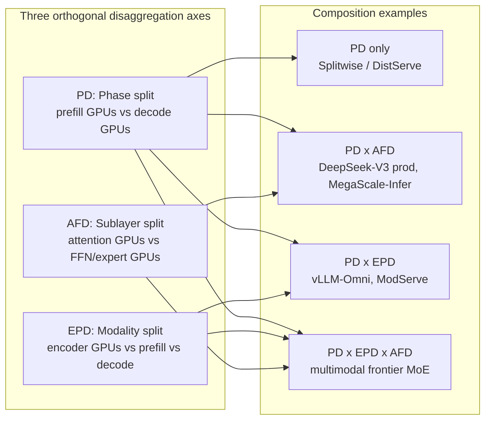
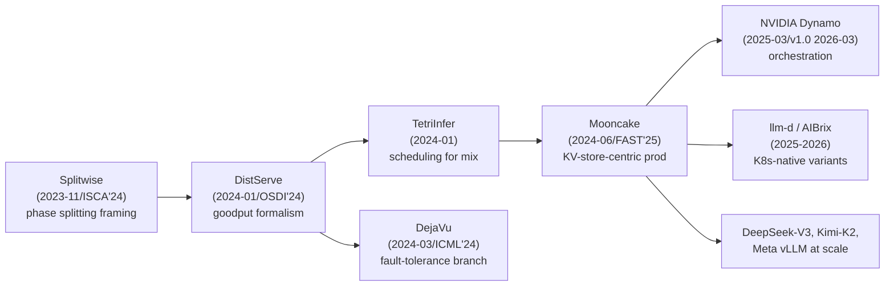

# Prefill–Decode Disaggregation

**After reading this chapter, the reader will be able to:**

- Explain why prefill and decode are governed by different rooflines, derive the resource-ratio formula that fixes the prefill-to-decode replica count for a given workload, and apply the M/D/1 queueing model that motivates per-pool headroom.
- Locate prefill–decode disaggregation on the broader **disaggregation taxonomy** — phase split (PD), modality split (EPD), sublayer split (AFD) — and reason about how the three axes compose in production.
- Read the lineage from Splitwise and DistServe through Mooncake to NVIDIA Dynamo and the contemporary aggregation–vs-disaggregation debate (TaiChi, BeyondBuzz), with enough vocabulary to position any 2025–2026 PD-disagg system against its peers.

The previous chapter on parallelism strategies ([see §20/01-parallelism-strategies](01-parallelism-strategies.md)) treated each request as a single workload that the model gets sharded across. Prefill–decode disaggregation says the opposite: the *request itself* has two phases that should run on physically distinct hardware. This chapter develops the argument, derives the relevant math, walks the canonical lineage, and ends with the regime-dependence debate that emerged in 2025.

## 1. Why split

The argument starts from the rooflines in [§00/02-transformer-arithmetic-roofline](../00-foundations/02-transformer-arithmetic-roofline.md). Prefill at sequence length $L_P$ executes matmuls with arithmetic intensity scaling with $L_P$; decode at batch $B_D$ runs the same matmuls as thin GEMVs with intensity scaling with $B_D$ alone. The two phases land on opposite sides of the roofline ridge:

- **Prefill is compute-bound.** Operations-per-byte at $L_P = 512$ on Hopper sits in the 200–400 range — above the H100 ridge of $\approx 295$ — so prefill saturates Tensor Cores at modest batch and is sensitive to **TTFT**.
- **Decode is memory-bandwidth-bound.** The forward pass reads the entire model from HBM once per token to produce $B_D$ tokens; per-token latency is roughly $2P / (W \cdot B_D)$ for $P$ parameters at HBM bandwidth $W$. The phase wants high $B_D$ to amortize weight reads and is sensitive to **ITL/TPOT**.

Co-locating the two phases on the same GPU forces a compromise. A long prefill iteration stalls every in-flight decode for the duration of the prefill kernel; a large decode batch claims so much KV memory and SM occupancy that incoming prefills queue. Sarathi-Serve [Sarathi-Serve] mitigates this at the scheduler level by chunking each prefill into small token-budgeted slices and piggybacking them on decode iterations [see §10/03-batching-scheduling](../10-engine-core/03-batching-scheduling.md). Disaggregation eliminates the conflict physically: prefill runs on a prefill pool, decode runs on a decode pool, and the request migrates from one to the other at the phase boundary. The cost paid is the **KV transfer** between pools, on the critical TTFT path.

The deeper consequence is that the two pools are no longer obliged to share a parallelism strategy. A prefill pool can run TP4 with no expert parallelism because batch-1 prefill at $L_P = 4{,}096$ already saturates four GPUs' compute; a decode pool can run the same model at TP4 + DP80 + EP320 because decode wants throughput and bandwidth. DeepSeek-V3 production makes this explicit: 4 prefill nodes / 32 GPUs vs. 40 decode nodes / 320 GPUs, with EP320 only on the decode side. No single co-located configuration is Pareto-optimal for both phases.

## 2. The disaggregation taxonomy

Prefill–decode disaggregation is one axis of a broader taxonomy. By 2026 the design space had crystallized into three orthogonal axes:

1. **Phase split (PD).** Separate prefill GPUs from decode GPUs. The subject of this chapter.
2. **Modality split (EPD).** Separate encoder workers (vision, audio, video) from prefill and decode workers. Covered in [see §60/03-multimodal-serving](../60-adjacent-workloads/03-multimodal-serving.md).
3. **Sublayer split (AFD).** Separate attention workers from FFN/expert workers. Covered in [see §20/03-moe-inference](03-moe-inference.md).

The three axes are *orthogonal*: any deployment chooses a position on each. A frontier MoE deployment in production is typically PD × AFD — disaggregated phases, with the decode pool further split into attention nodes and expert nodes. A frontier multimodal deployment is PD × EPD — a vision encoder pool feeding a prefill pool feeding a decode pool. The full cross-product PD × EPD × AFD describes the entire disaggregation design space in 2026.

AFD and EPD are sometimes framed as MoE-specific or multimodal-specific, but the axes are not. AFD is most studied for MoE because experts dominate FFN compute and EP all-to-all is the binding cost; the underlying idea — give attention and FFN their own GPUs because they have different rooflines — applies to dense models too, and Step-3 (Aug 2025) demonstrates it on a dense-tilted architecture. EPD applies wherever a non-text encoder produces an embedding consumed by a transformer; it is most discussed for VLMs only because that is where encoders are large enough to merit their own pool.

This chapter develops the PD axis. The reader who has finished the textbook will hold all three in their head simultaneously.

## 3. Lineage

The PD-disaggregation lineage is short but unusually clean. Five papers and one production system carry the weight; the rest of the literature elaborates on details these set up.

**Splitwise** [Splitwise] (Patel et al., MSR/Microsoft, ISCA 2024 best paper, arXiv 2311.18677) is the framing paper. It is the first systems work to articulate "phase splitting" as a deployment problem rather than a kernel problem. Splitwise observes that prefill and decode have different power and FLOPs profiles, evaluates layer-wise overlapped KV transfer as a way to hide the prefill→decode hand-off inside the next layer's compute, and runs a cross-tier study with H100 prefill and A100 decode that delivers 1.4× throughput at 20% lower cost or 2.35× throughput at iso-power-and-cost. The cross-tier result also opened the door to heterogeneous PD; that branch is developed in [see §20/05-heterogeneous-inference](05-heterogeneous-inference.md).

**DistServe** [DistServe] (Zhong et al., PKU/UCSD/StepFun, OSDI 2024, arXiv 2401.09670) is the formal treatment. DistServe defines **goodput** as the maximum request rate that meets ≥90% of a (TTFT, TPOT) SLO pair and decouples the optimization across phases: each phase chooses its own parallelism (TP, PP, replica count) to maximize per-phase per-GPU goodput, then the system picks the global $(n_P, n_D)$ replica counts that balance the two. DistServe also derives the M/D/1 latency model used in §6 below and presents two placement algorithms — high node-affinity (when intra-node NVLink can carry KV transfer) and low node-affinity (when KV must traverse IB). Reported gains: 7.4× more requests served and 12.6× tighter SLOs vs. SOTA on OPT-13B/66B/175B. Almost every PD paper since 2024 either applies or refines DistServe's goodput formalism.

**TetriInfer** [TetriInfer] (Hu et al., PKU/ByteDance, arXiv 2401.11181) is the scheduling complement. Its three pillars are chunked prompts (so each prefill iteration runs at compute saturation), PD disaggregation (so decodes are not stalled), and a two-level scheduler that predicts each request's resource usage and avoids decode hotspots. The contribution most relevant to later production systems is the second-level scheduler: instead of fixed P:D ratios, TetriInfer dynamically sorts requests onto prefill or decode replicas based on predicted load, which is the foundation of the "elastic PD" pattern that Dynamo's Planner and AIBrix's APA later operationalize.

**Mooncake** [Mooncake] (Qin et al., Moonshot AI / Tsinghua MADSys, FAST 2025, arXiv 2407.00079) is the production system. Mooncake serves Kimi at thousand-node scale processing 100B+ tokens/day. It treats the **KVStore as a first-class disaggregated tier** rather than as a transient artifact between prefill and decode. Mooncake's Conductor scheduler dispatches based on cache locality plus load, replicating and pre-staging blocks for predicted future requests; Mooncake's TransferEngine multiplexes RDMA, TCP, NVLink, NVMe-oF, and CXL transports under one API and is the prototypical KV-transport library. The deeper contribution is a *predictive early-rejection* mechanism: under overload, Mooncake predicts which incoming requests will miss their TTFT SLO and rejects them at admission rather than queueing them, preserving goodput at the cost of admission rate. The architecture is covered in detail in [see §80/04-lmcache-mooncake](../80-oss-deep-dives/04-lmcache-mooncake.md).

**DéjàVu** [DejaVu-FT] (Strati et al., ETH/MSR, ICML 2024, arXiv 2403.01876) supplies the fault-tolerance branch. Its three contributions are prompt-token disaggregation to remove pipeline bubbles, microbatch swapping for memory headroom, and per-stage KV replication to a logical-ring neighbor. The replication scheme keeps recovery overhead at 1.24× vs. 1.91× without replication and is the closest thing to a published reference for fault tolerance in disaggregated stacks. The fault-propagation problem across PD edges — what happens when a decode worker fails mid-generation while its prefiller has already moved on to the next request — remains under-engineered in production stacks ([see §50/03-observability-and-resilience](../50-cluster-systems/03-observability-and-resilience.md)).

**NVIDIA Dynamo** [Dynamo] (1.0 GA, March 2026) is the production orchestrator. Its KVBM (KV Block Manager) provides a four-tier hierarchy — G1 GPU HBM, G2 host pinned memory, G3 local SSD, G4 networked storage — with sequence-hash-based block deduplication across tiers. Its NIXL (NVIDIA Inference Xfer Library) abstracts the transport layer: one API over UCX, GPUDirect Storage, NVLink, IB/RoCE, and S3-class object stores. Its Planner is a multi-load-predictor autoscaler (Constant, ARIMA, Kalman, Prophet) that reads forward-pass metrics and TTFT/ITL correction factors and rebalances the prefill and decode pools online. Architectural detail is in [see §80/05-dynamo-llmd-aibrix](../80-oss-deep-dives/05-dynamo-llmd-aibrix.md).

The take-away is that the lineage is shaped like a Y: Splitwise framed the problem and DistServe formalized it, TetriInfer's scheduling and DéjàVu's fault tolerance branch out as parallel concerns, and Mooncake unifies the production system view that Dynamo, llm-d, and AIBrix then operationalize on Kubernetes.

## 4. Resource-ratio derivation

The first quantitative question disaggregation forces is: how many prefill replicas vs. how many decode replicas? The answer is workload-dependent. Following DistServe, let the workload have arrival rate $R$ requests/sec, per-request input length $L_P$, per-request output length $L_G$. Let $g_P(L_P)$ be the per-prefill-replica goodput (requests/sec satisfying the TTFT SLO at this prompt distribution) and $g_D(L_P, L_G)$ be the per-decode-replica goodput (requests/sec satisfying the TPOT SLO under the corresponding KV pressure). The minimum replica counts are

$$
n_P \;=\; \left\lceil \frac{R}{g_P(L_P)} \right\rceil, \qquad n_D \;=\; \left\lceil \frac{R}{g_D(L_P, L_G)} \right\rceil.
$$

Total accelerator count is $N = n_P \, k_P + n_D \, k_D$ where $k_P, k_D$ are per-replica GPU counts (each phase chooses its own TP, PP, EP). The ratio $n_P : n_D$ is workload-dependent: long output (interactive chat, reasoning, agentic) implies decode-heavy; short output (search, embeddings, classification) implies prefill-heavy.

A concrete example: $T_P = 100$ ms per request, $T_D = 20$ ms per token, $L_G = 50$ tokens. The decode replica does $T_D \cdot L_G = 1{,}000$ ms of work per request. To match flow rates,

$$
\frac{n_P}{n_D} \;=\; \frac{T_P}{T_D \cdot L_G} \;=\; \frac{100\text{ ms}}{1{,}000\text{ ms}} \;=\; \frac{1}{10}.
$$

One prefill replica per ten decode replicas. The DeepSeek-V3 production deployment lands at exactly this ratio (32 prefill GPUs : 320 decode GPUs ≈ 1:10), reflecting long generative outputs at large EP. The general formula factors per-GPU service times in:

$$
\frac{n_P \, k_P}{n_D \, k_D} \;=\; \frac{T_P / T_P^{\text{GPU}}}{T_D \cdot L_G / T_D^{\text{GPU}}}.
$$

Three workload shifts move the ratio: longer output (reasoning, agents) pushes decode-heavy; longer input at fixed output (RAG) pushes prefill-heavy; larger decode batch decreases $T_D^{\text{GPU}}$ per request and again favors decode. Static ratios are brittle, so production stacks expose the ratio as a runtime knob — Dynamo's Planner reallocates between pools every interval, AIBrix's StormService changes RoleSet membership, TokenScale's Convertible Decoders absorb prefill bursts. Reported goodput gains from dynamic adaptation are in the +1.5× / 50–88% → 80–96% SLO-attainment range over fixed-ratio DistServe baselines [DOPD, TokenScale]; these are vendor numbers, workload-conditional, and not yet independently reproduced at scale.

## 5. KV transport

The KV cache produced on the prefill GPU must reach the decode GPU before decode can start. This is on the critical TTFT path; TTFT in disaggregated mode is

$$
\text{TTFT}_{\text{disagg}} \;=\; T_{\text{queue}} + T_{\text{prefill}} + T_{\text{xfer}} + T_{\text{decode}}^{\text{first-token}}.
$$

The KV transfer time $T_{\text{xfer}}$ has to be small relative to $T_{\text{prefill}}$ for disaggregation to be a net win.

### 5.1 Transfer size

Per-request KV size is

$$
S_{\text{KV}} \;=\; 2 \cdot L_P \cdot n_{\text{layer}} \cdot n_{\text{kv\_head}} \cdot d_{\text{head}} \cdot b_{\text{dtype}}.
$$

The factor 2 covers K and V; $b_{\text{dtype}}$ is the per-element byte size. For MLA the head dimensions collapse to the latent rank, dropping KV by an order of magnitude.

Numerical examples for Llama-3.1-70B at FP16 (GQA with 8 KV heads, head dim 128, 80 layers):

- $L_P = 1{,}024$: $S_{\text{KV}} = 2 \cdot 1024 \cdot 80 \cdot 8 \cdot 128 \cdot 2 \approx 335\text{ MB}$.
- $L_P = 8{,}192$: $S_{\text{KV}} \approx 2.7\text{ GB}$.
- $L_P = 32{,}768$: $S_{\text{KV}} \approx 10.7\text{ GB}$.

For DeepSeek-V3 at FP8 with MLA and latent rank 512, the equivalent numbers are roughly 1/15× — MLA is in part a KV-transport optimization ([see §30/03-attention-variants](../30-kv-cache/03-attention-variants.md)).

### 5.2 Transfer time

At 400 GB/s (NDR IB ConnectX-7, single port), transferring $S_{\text{KV}}$ takes:

- 1K context: $\approx 0.84$ ms.
- 8K context: $\approx 6.7$ ms.
- 32K context: $\approx 27$ ms.

Within an NVLink domain (GB200 NVL72 NVLink 5 at ~1.8 TB/s per GPU effective), the same transfers take roughly $4.5\times$ less. Across XDR IB or 8-NIC GPUDirect aggregation (Mooncake reports 87 GB/s on 4×200 Gbps RoCE and 190 GB/s on 8×400 Gbps), the picture again improves; the in-NVLink-domain case is dominant for GB200 NVL72 deployments and the cross-node case is what Splitwise's layer-wise overlap and Mooncake's TransferEngine were designed for.

For overlap-friendly hand-off, the transfer must hide inside the prefill latency budget:

$$
T_{\text{xfer}} \;=\; \frac{S_{\text{KV}}}{B_{\text{link}}} \;\le\; T_P \quad\Longrightarrow\quad B_{\text{link}} \;\ge\; \frac{S_{\text{KV}}}{T_P}.
$$

For 70B-class models at 8K context with $T_P \approx 200$ ms, the link bound is $\approx 13.5$ GB/s — well within IB NDR per request, but at $R = 100$ rps the aggregate is 1.35 TB/s, motivating multi-NIC striping (Mooncake) and layer-wise overlap (Splitwise). The full collectives-and-comm primer in [see §00/04-collectives-and-comm-primer](../00-foundations/04-collectives-and-comm-primer.md) develops the link-bandwidth budget more carefully; KV transfer is the canonical *point-to-point*, *request-keyed*, *one-shot* primitive that is not a collective and that PD disaggregation introduces as a new class of cluster traffic.

### 5.3 The transport landscape

By 2026 four KV-transport libraries cover the production deployments:

- **NIXL** (NVIDIA Inference Xfer Library), open-sourced March 2025. Pluggable backends for UCX, GDS, POSIX, and cloud object stores. Used by Dynamo, vLLM, SGLang, TRT-LLM, and LMCache. NIXL is the closest the ecosystem has to a vendor-blessed default.
- **Mooncake TransferEngine**. C++ core with multi-NIC bandwidth aggregation, NUMA-topology-aware NIC selection, GPUDirect VRAM registration, and transports for RDMA (IB/RoCE/eRDMA), TCP, NVLink, EFA, NVMe-oF, CXL, Ascend, HIP, and Kunpeng. Mooncake TE is registered as a NIXL backend, making the two stacks composable.
- **Perplexity TransferEngine**. RDMA point-to-point library open-sourced November 2025 (MIT). Abstracts NIC differences across NVIDIA ConnectX-7 and AWS EFA; used in Perplexity's production PD path, RL weight transfer, and MoE dispatch/combine.
- **UCCL**. Used by llm-d v0.5 for transport resilience and by some research stacks; less common in commercial production.

The commonality is that all four wrap RDMA over IB/RoCE with NVLink fast-path inside a node and an optional storage-tier fallback. The differences are principally at the API surface (NIXL is the most general; Mooncake TE is the most performance-tuned) and in what storage tiers they integrate (NIXL has S3/Azure/Dell PowerScale/WEKA; Mooncake has 3FS/CXL).

Engine-side, each backend wraps the transport in its own connector pattern. vLLM uses synchronous prefill with `kv_transfer_params` carrying block IDs. SGLang uses asynchronous bootstrap with a `bootstrap_info` (host, port, room id) — prefill runs in the background while decode pre-allocates KV slots and signals readiness. TRT-LLM uses an opaque serialized state shipped through UCX (its default) or NIXL via Dynamo. The asynchronous SGLang path is a measurable TTFT win at high RPS because it removes a synchronous round-trip from the critical path; the synchronous vLLM path is simpler and matches more closely to the request-state model V1 already maintains.

## 6. M/D/1 latency model

PD disaggregation does not merely partition work — it also partitions *queues*. Each pool has its own arrival rate, its own service-time distribution, and its own queueing behavior. The first-order tool for reasoning about either pool is the M/D/1 queue: Poisson arrivals at rate $\lambda$, deterministic service time $D$, single server.

For the prefill pool with arrival rate $\lambda$ and per-request service time $T_P$, M/D/1's mean waiting time is the Pollaczek-Khinchine formula specialized to deterministic service:

$$
\overline{\text{TTFT}} \;=\; T_P \;+\; \frac{\lambda T_P^2}{2 (1 - \lambda T_P)}.
$$

The first term is the service time itself. The second term is the queueing tail, which grows unboundedly as utilization $\rho = \lambda T_P \to 1$. The model is not literally accurate — prefill service times have non-trivial variance because $L_P$ varies across requests, so the true model is closer to M/G/1 — but the deterministic specialization gives a clean lower bound on the queueing penalty and is the model used by DistServe to compare TP vs. PP placement.

DistServe's analytic comparison falls out of M/D/1 directly. Two-way **inter-op (PP)** parallelism with stage time $D_s \approx D$ and merge time $D_m \approx D/2$ gives

$$
\overline{\text{TTFT}}_{\text{PP}} \;=\; D \;+\; \frac{\lambda D^2}{4 (2 - \lambda D)}.
$$

Two-way **intra-op (TP)** parallelism with empirical speedup $1 < K < 2$ (less than ideal because all-reduce overhead) gives

$$
\overline{\text{TTFT}}_{\text{TP}} \;=\; \frac{D}{K} \;+\; \frac{\lambda D^2}{2 K (K - \lambda D)}.
$$

The crossover is informative: at low $\lambda$, TP wins because $D/K$ is the dominant term and $K > 1$. At high $\lambda$, the queueing term in TP blows up sooner (the denominator $K - \lambda D$ approaches zero faster than the PP denominator), and PP wins. This is the model-grounded version of the engineering rule of thumb that low-load latency-sensitive deployments prefer TP and high-load throughput-sensitive deployments tolerate PP — and is the analytic justification for letting prefill and decode pick *different* parallelism strategies even when serving the same model.

The decode pool is harder to model with M/D/1 directly because per-token decode service time depends on batch size, which depends on the queue itself — a feedback loop that closed-form analysis only approximates. Decode pools are sized empirically against measured per-replica throughput at the SLO-bounded ITL, and M/D/1 is reserved for the prefill side. The operational consequence is that **both pools must maintain headroom**: a prefill pool at $\rho = 0.95$ has a queueing penalty of $9.5 \cdot T_P$ — the queue dominates the latency budget. Production deployments target 70–80% utilization on both sides for this reason.

## 7. Aggregation vs. disaggregation: the regime-dependence debate

Through 2024 the implicit assumption in the PD literature was that disaggregation is universally better than co-located serving once a deployment crosses some scale threshold. The 2025 wave of work argues that this is regime-dependent.

**TaiChi** [TaiChi] (Wang et al., arXiv 2508.01989, August 2025) is the headline result. TaiChi's experiments on Qwen2.5 sweep TTFT and TPOT SLO slack and find:

| Regime | Best strategy |
|---|---|
| Tight TTFT, loose TPOT | Aggregation (chunked prefill) |
| Loose TTFT, tight TPOT | Pure disaggregation |
| Both tight | Hybrid (P-heavy + D-heavy instances) |

TaiChi's unified architecture exposes three sliders (instance ratio, P-heavy chunk size, D-heavy chunk size) and a flowing-decode + length-aware-prefill scheduler. Reported gains: +9–47% goodput vs. pure aggregation, +29–77% goodput vs. pure disaggregation. The gains over disaggregation come specifically in the regimes where disaggregation pays its KV-transfer overhead without recouping it through phase isolation.

**BeyondBuzz** [BeyondBuzz] (Mitra et al., NVIDIA, arXiv 2506.05508, June 2025) reaches the same conclusion from an internal-NVIDIA design-space sweep covering hundreds of thousands of configurations. The summary: disaggregation pays off most for prefill-heavy traffic and larger models; dynamic rate matching and elastic scaling are decisive for Pareto-optimal performance; "always disaggregate" is wrong as a default. BeyondBuzz is a single-vendor study and its precise crossover heuristics are best read as guidance rather than as universal rules.

**Nexus** [Nexus] (arXiv 2507.06608) pushes the debate further by disaggregating *inside a single GPU* via dynamic SM allocation. Up to 2× throughput vs. SGLang; TTFT 2–20× better. Nexus is orthogonal to inter-GPU disagg and is most relevant when KV-transfer overhead would otherwise dominate (small models, single-node deployments).

The hedge is that the regime where disaggregation is optimal — large model, long context, tight ITL, high sustained throughput — is *exactly* the regime that frontier production occupies. DeepSeek's published xPyD architecture, Moonshot's Mooncake-driven Kimi serving, Meta's disaggregated vLLM at scale, and the production SGLang and Dynamo deployments behind every public DeepSeek-V3 / Kimi-K2 / GPT-OSS service are all disaggregated. The regime-dependence finding is real and engineering-actionable; it does not refute the production observation that the regime where disagg dominates is where the money is.

A second hedge: reported aggregate goodput numbers from disaggregation papers (1.5×, 2×, 525%, "30× vs co-located on GB200 NVL72") are vendor-supplied or single-paper-source. They are useful as evidence that PD disaggregation is consequential in production, not as predictions for any specific deployment. The textbook-grounded statement is that PD disaggregation is the production default at frontier scale and a regime-dependent choice elsewhere; precise quantitative claims should be reproduced on the operator's own workload before being relied upon.

## 8. Heterogeneous PD and intra-GPU disaggregation

Two extensions are worth flagging because they bend the basic PD picture.

Heterogeneous PD spans GPU tiers within one deployment: H100 prefill, A100 decode. Splitwise's original work studied this; HexGen-2, Helix, and Tessera develop the placement problem [see §20/05-heterogeneous-inference](05-heterogeneous-inference.md). The argument is energy-and-cost: prefill is FLOPs-hungry and benefits from frontier compute, while decode is bandwidth-hungry, and the H100 HBM bandwidth advantage over A100 is smaller than its FLOPs advantage. Splitwise reports 2.35× throughput at iso-power-and-cost; the technique generalizes to B200/H100 and to GPU↔ASIC patterns (Rubin CPX paired with decode-side GPUs).

Intra-GPU disaggregation, exemplified by Nexus, partitions one GPU's SMs between prefill and decode workloads dynamically. This is a separate axis from inter-GPU PD: the GPU still hosts both phases, but they no longer time-share. Whether intra-GPU and inter-GPU disagg compose constructively (Nexus inside each replica of a DistServe-style pool) or one dominates the other for a given workload is open as of 2026.

## 9. PD-aware autoscaling

Disaggregation makes autoscaling *harder*: the two pools must stay in flow balance — prefill running ahead queues at KV transfer, decode running ahead idles replicas. ByteDance's HeteroScale paper [HeteroScale] is the empirical landmark: GPU utilization is misleading for decode pools because KV memory pressure pegs it regardless of throughput; **decode-TPS** is the leading signal. HeteroScale at tens of thousands of GPUs claims hundreds of thousands of GPU-hours/day saved at +26.6 pp utilization. TokenScale [TokenScale] generalizes with "token velocity" plus Convertible Decoders that absorb prefill bursts on demand.

The orchestration layers operationalize these signals differently. Dynamo's Planner computes correction factors $\text{prefill\_correction} = \text{actual\_ttft} / \text{expected\_ttft}$ and $\text{decode\_correction} = \text{actual\_itl} / \text{expected\_itl}$, runs a load predictor (Constant / ARIMA / Kalman / Prophet), and writes targets to a `DynamoGraphDeploymentScalingAdapter` exposing the K8s `scale` subresource. AIBrix's APA adds a fluctuation-tolerance band on top of utilization-based scaling and reads KV-cache-usage % as a primary signal. llm-d's WVA targets multi-variant deployments where one model runs on heterogeneous GPU types under a cost-vs-latency tradeoff. Production PD-aware autoscalers in 2026 converge on three properties: decode-TPS or token-velocity as the primary signal, per-pool independent scaling with explicit flow-balance enforcement, and hysteresis to avoid oscillation under bursty traffic.

## 10. Failure handling and prefix-cache interaction

Two operational subtleties reshape the basic PD picture in production.

**Prefix caching changes when disaggregation pays.** If the decode pod already holds a long prefix from a sticky prior request ([see §10/07-prompt-prefix-caching](../10-engine-core/07-prompt-prefix-caching.md)), shipping that prefix's KV from prefill to decode is wasted. Production stacks insert a *probe-decoder-cache* step (LMCache's `_probe_decoder_cache`; llm-d's "decider") that asks what the decode side already has, and either sends only the missing suffix or — if most of the prompt is already cached — falls back to aggregated serving on D alone. Together AI's three-tier CPD architecture (pre-prefill / prefill / decode) reports +40% sustainable throughput on long-context mixed traffic [TogetherCPD]. Mooncake's KVStore generalizes the pattern to a cluster-wide cache so prefixes survive across decode pods. The "Prefill-as-a-Service" frontier [PrefillAaS] extends the logic across datacenters once MLA-class architectures shrink KV enough to make cross-DC transfer feasible.

**Failure handling at the phase edge is the under-engineered problem.** A prefill worker failing after KV is computed but before transfer forces a restart that loses any sticky prefix-cache hit. A decode worker failing mid-generation loses KV state and must replay — catastrophic for the 30+-minute reasoning generations covered in [see §60/01-test-time-compute](../60-adjacent-workloads/01-test-time-compute.md). DéjàVu [DejaVu-FT] is the published reference, capping recovery overhead at 1.24× via per-stage KV replication to a logical-ring neighbor. Production stacks rely on admission-time replication (Mooncake's Conductor pre-stages predicted blocks), request-level retry-and-replay (vLLM Router circuit breakers), and stickiness-aware resumption (SGLang reconnection). No production stack as of 2026 publishes a complete fault-domain analysis; this is an active frontier and a known operational risk.

## Current production state

By mid-2026, prefill–decode disaggregation is the production default for high-traffic large-model deployments. Kimi (Mooncake-backed) processes 100B+ tokens/day across thousands of nodes at Moonshot AI. DeepSeek-V3 production runs 4-node prefill / 40-node decode units with EP320 on the decode side; SGLang's reproduction reaches 52.3k input TPS / 22.3k output TPS per node on 96-H100 deployments, with follow-up GB200 NVL72 deployments reporting ~3.8× / 4.8× prefill / decode improvements over H100. Meta runs disaggregated vLLM at scale with custom tuning (KV block size 128/256 vs. default 16, sticky routing for 40–50% prefix-cache hit rate). ByteDance's HeteroScale manages tens of thousands of disaggregated GPUs across multiple business workloads.

The orchestration layer is fragmented but converging. NVIDIA Dynamo (v1.0 GA March 2026) is the NVIDIA-blessed stack with KVBM, NIXL, and a multi-load-predictor Planner; llm-d (CNCF Sandbox March 2026) is the Kubernetes-native, vLLM-first reference implementation of the Inference Gateway API; AIBrix (vLLM-org since Feb 2025) is ByteDance's CRD-heavy operational stack with APA autoscaling and L1/L2 KV offload. All three converged on KV-event publication over ZMQ, scoring formulas of the form `cost = w · prefill_blocks + decode_blocks`, and explicit prefill-decode handshake metadata; they diverge on philosophy, KV cache management, and autoscaling primitives.

The aggregation-vs-disaggregation regime debate (TaiChi, BeyondBuzz, Nexus) is real and engineering-actionable: tight TTFT with loose TPOT favors aggregated chunked-prefill; tight TPOT with loose TTFT favors disaggregation; balanced SLOs favor hybrid. The frontier-production observation that DeepSeek, Moonshot, and Meta all disaggregate is consistent with this map — their workloads sit in the loose-TTFT, tight-TPOT, high-throughput corner where pure disaggregation dominates. The textbook-defensible position is that PD disaggregation is the production default at frontier scale, a regime-dependent choice elsewhere, and a serious engineering commitment because the orchestration layer (KV transport, autoscaling, failure handling, prefix-cache integration) is where most of the production complexity lives — not in the per-pool model serving itself.
