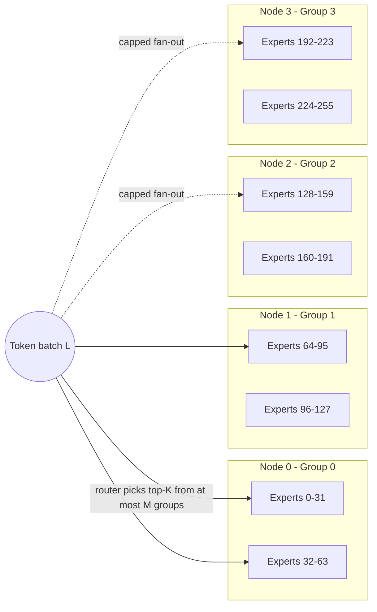
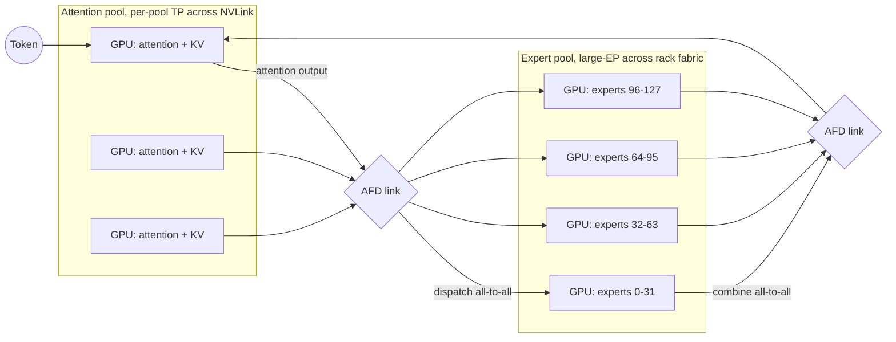

# MoE Inference

**After reading this chapter, the reader will be able to:**

- Reason about why Mixture-of-Experts (MoE) inference is structurally harder than dense inference — the dynamic routing, the all-to-all dispatch, the expert-load skew, and the KV-versus-expert memory budget — and trace how each axis is attacked by Expert Parallelism (EP), DeepEP-class kernels, EPLB-style replication, and DualPipe-class overlap.
- Walk the modern frontier-MoE serving stack from the architectural side (Mixtral → DeepSeekMoE → Kimi-K2 → Qwen3-Next → GPT-OSS) through the systems side (large-EP, AFD, expert offload), and identify which engines (vLLM, SGLang, TensorRT-LLM) implement which pieces.
- Place Attention–FFN Disaggregation (AFD) inside the disaggregation taxonomy that this book uses — phase split (PD), modality split (EPD), sublayer split (AFD) — and recognize that the three axes compose, with the cross-product describing the full design space.

> **Most production traffic is still dense.** This chapter is the priority for those serving frontier MoE models — DeepSeek-V3, Kimi-K2, Qwen3-Next, and the open-MoE deployments that have followed them — or open-MoE deployments that compete on cost-per-token. For everyone else it covers the architecture of the future: activation ratios are moving from "2 of 8" through "8 of 256" and beyond, and the systems patterns developed for serving 5%-active 671B-parameter models are the patterns the next dense-only deployment will be ported on top of.

The chapter assumes the foundations: the four collectives ([§00/04-collectives-and-comm-primer](../00-foundations/04-collectives-and-comm-primer.md)) — especially that **all-to-all has no bandwidth-amortizing identity** — and the decode roofline ([§00/01-inference-landscape](../00-foundations/01-inference-landscape.md)).

## 1. The MoE layer

A standard transformer block has two sub-layers: self-attention and a position-wise feed-forward network (FFN). The FFN dominates parameter count: at hidden dim $H$ and intermediate dim $H_e \approx 4H$, an FFN layer is ${\sim}8 H^2$ parameters versus $4 H^2$ for the attention projections. An MoE layer replaces the single FFN with $E$ parallel expert FFNs and a *router* (also called the *gating network*) that picks a top-$K$ subset of experts for each token. The output is a weighted sum of the chosen experts' outputs:

$$\text{MoE}(x) \;=\; \sum_{e \in \text{topK}(g(x))} \; \sigma_e(g(x)) \cdot \text{FFN}_e(x)$$

where $g(x) \in \mathbb{R}^E$ is the gating vector and $\sigma_e$ normalizes the chosen experts' weights (softmax over the top-$K$ in DeepSeekMoE, sigmoid in Mixtral). $K$ is small — 1, 2, 4, 8 — and $E$ is much larger — 8, 16, 64, 128, 256, 384. Each token therefore touches only $K/E$ of the FFN parameters. The model has nominal *total* parameters $P_{\text{total}}$ but uses *active* parameters $P_{\text{active}} \approx (K/E) \cdot P_{\text{FFN}} + P_{\text{rest}}$ per token.

DeepSeek-V3, with $E = 256$ routed experts plus one always-on shared expert, top-$K = 8$, and 61 layers, is the canonical example: 671B total parameters and ${\sim}37$B active per token, an activation ratio of about 5.5%. Kimi-K2 pushes the same architecture to $E = 384$ and 1.04T total parameters at 32B active. Qwen3-Next-80B-A3B drops the shared expert and runs at 96.25% sparsity (3B active out of 80B). The economic argument is straightforward: model capacity scales with $P_{\text{total}}$ (representational ceiling) while per-token compute and HBM-bandwidth pressure scale with $P_{\text{active}}$. For the same FLOPs budget, MoE delivers materially higher quality than a dense model, and the gap widens with scale.

The price is paid at inference time. Three structural facts make MoE serving harder than dense serving.

1. **Routing is dynamic.** Different tokens in the same batch go to different experts. The "expert" the kernel runs is not known until after the gating forward, so the per-token compute footprint is data-dependent.
2. **Load is imbalanced.** Even with a balancing loss during training, expert popularity at inference time has a long tail. The slowest expert sets the layer's wall-clock time.
3. **Experts must be reachable.** $E$ experts at a few hundred million parameters each blow past one GPU's HBM. Experts must be sharded across many GPUs (Expert Parallelism, EP), and tokens must travel to wherever their chosen experts live — an all-to-all that runs once before each MoE layer's expert FFN and once after.

The rest of the chapter is structured around how the production stack of mid-2026 attacks each of these.

## 2. Architectural lineage

This section names the model families a serving engineer encounters in production today. One paragraph per canonical entry.

**Sparsely-Gated MoE [Shazeer-2017]** introduced the layer — top-$K$ gating, the balancing auxiliary loss, noisy gating — between LSTM blocks. **GShard** (Google, 2020) and **Switch Transformer** (Google, 2021) scaled MoE to TPU pods with all-to-all dispatch on transformer FFNs; Switch's top-1 routing trained a 1.6T-parameter model. Textbook references; neither is what production engines today actually serve.

**Mixtral 8x7B** (Mistral, December 2023) is the layer's mainstream-open-weight inflection point: 47B total, 13B active, $E = 8$ top-2, Apache-2.0. Its accessible scale (one H100 with FP8 quant) made it the testbed every engine integrated against. **Mixtral 8x22B** (April 2024) followed with $E = 8$ top-2 at 141B/39B active.

**DeepSeekMoE** (DeepSeek, January 2024) is the architectural ancestor of the modern frontier-MoE pattern. Two changes from the Mixtral line: experts are **finer-grained** (the FFN intermediate dimension is split across more, smaller experts, more activated per token), and a small set of **shared experts** is always on, capturing common knowledge so routed experts can specialize. **DeepSeek-V2** (May 2024) added Multi-head Latent Attention (MLA, [see §30/03-attention-variants](../30-kv-cache/03-attention-variants.md)), reducing KV cache by ${\sim}93\%$. **DeepSeek-V3** (December 2024) is the canonical frontier MoE: 671B total, 37B active, 256 routed + 1 shared, top-8 routing constrained to $M=4$ groups out of 8 (group-limited routing, bounding inter-node fan-out), MLA, FP8 mixed-precision training, and **multi-token prediction (MTP)** heads for spec-decoding ([see §10/06-multi-token-prediction](../10-engine-core/06-multi-token-prediction.md)). V3 also introduced **auxiliary-loss-free balancing**: a per-expert bias on the top-$K$ decision (the gating weight in the output sum still uses raw affinity), tuned online from observed token counts. **DeepSeek-V3.2** (December 2025) layered DeepSeek Sparse Attention (DSA) on the V3 backbone — the first frontier-class model to ship a natively-trained sparse-attention primitive [see §20/04-long-context-inference](../20-distributed-inference/04-long-context-inference.md), with parity claims not yet independently confirmed beyond DeepSeek's own evaluations.

**Kimi-K2** (Moonshot AI, July 2025) is the largest open-weight MoE as of mid-2026: 1.04T total, 32B active, 384 routed experts, MLA, MuonClip optimizer. Kimi keeps the shared-expert pattern. **Qwen3-235B-A22B** and **Qwen3-30B-A3B** (Alibaba, May 2025) — 128 experts top-8 on the 235B model, *no shared experts* (a deliberate departure from the DeepSeek pattern), global-batch load-balance loss. **Qwen3-Next-80B-A3B** (September 2025) hybridizes ultra-sparse MoE with a Gated DeltaNet + Gated Attention stack and targets 256K–1M context.

**Llama-4** (Meta, April 2025) is Meta's first MoE — Scout (109B/17B, 16 experts) and Maverick (400B/17B, 128 experts, MoE alternating with dense layers). **GPT-OSS** (OpenAI, August 2025) is OpenAI's first open-weight release since GPT-2; public information describes gpt-oss-120b at 117B/5.1B active (128 experts top-4) and gpt-oss-20b at 21B/3.6B active (32 experts top-4), with MoE weights in MXFP4 [see §10/04-quantization](../10-engine-core/04-quantization.md). Architectural details beyond the open weights are not speculated on here.

The takeaway: MoE has converged on **fine-grained, top-8 routing across 128–384 experts plus 0–1 shared experts**, FP8 (or MXFP4) weights, and group-limited or global routing constraints to bound communication. This is what lets vLLM, SGLang, and TensorRT-LLM share most of their MoE infrastructure across DeepSeek-V3, Kimi-K2, and Qwen3.

## 3. Why MoE inference is hard

Decode for a dense transformer is bandwidth-bound on the weight tensor: every token reads the full parameter set from HBM once. For MoE the picture refracts.

**Per-expert batch shrinks.** At a batch of $L$ tokens, top-$K$, and $E$ experts, each expert sees on average $LK/E$ tokens. With $L = 128$, $K = 8$, $E = 256$, each expert handles 4 tokens — a batch far from saturating tensor-core utilization. The arithmetic intensity per expert at decode, with $H_e$ intermediate dim and $s$ bytes per parameter, is

$$\mathrm{AI}_{\text{per-expert-decode}} \;\approx\; \frac{4 H H_e \cdot LK/E}{2 H H_e \cdot s} \;=\; \frac{2 L K}{E s}.$$

For $L = 128$, $K = 8$, $E = 256$, $s = 1$ (FP8), $\mathrm{AI} \approx 8$ FLOP/byte — well under the H100/H200 ridge of ${\sim}100$, so MoE decode is firmly memory-bound. The headline mitigation is to grow the per-expert batch by **EP scaling**: at EP world size $W$ each rank holds $E/W$ experts, so tokens for each expert come from $W$ ranks' worth of batches. Effective per-expert batch becomes $W \cdot LK/E$. This is the structural argument for EP=64, EP=128, EP=320.

**All-to-all volume is the first-order serving cost.** Each MoE layer dispatches per-token activations to expert-holding ranks (dispatch all-to-all), runs experts, combines results back (combine all-to-all). With activation dim $D$ at $b$ bits, two passes per layer:

$$V_{\text{a2a}} \;=\; 2 \cdot L K \cdot D \cdot \tfrac{b}{8} \quad \text{bytes per layer per pass.}$$

At $L=4096$, $K=8$, $D=7168$, FP8 ($b=8$), one MoE layer pushes ${\sim}235$ MB of activation traffic. Multiply by the number of MoE layers (DeepSeek-V3 has 58 of 61), divide by available bandwidth — and that bandwidth is the *hard* number because all-to-all gets no $(P-1)/P$ identity to amortize against. GB200 NVL72's 130 TB/s aggregate NVLink fabric versus 400 Gb/s/NIC InfiniBand NDR is a peak ratio of ${\sim}300\times$. Moving from cross-rack EP-32 to intra-rack EP-72 is a regime change, not an optimization.

**Load imbalance is a tail problem.** A balancing loss bounds the expected token count per expert; at any given iteration some experts are 5×–10× hotter. The all-to-all completes only when every rank has finished; the slowest rank — typically the one with the hot expert — sets the layer's wall-clock.

**Experts vs. KV compete for HBM.** Expert weights take $\frac{E}{W} \cdot S_e$ per rank ($S_e$ = per-expert weight bytes); KV cache takes $L_{\text{ctx}} \cdot \mathrm{kv\_bytes}$ per active sequence per rank. Trading EP degree shifts memory between the two — and the optimal EP degree differs between prefill (compute-bound, KV-light) and decode (bandwidth-bound, KV-heavy), which is one reason PD disaggregation interacts with EP [see §20/02-prefill-decode-disagg](02-prefill-decode-disagg.md).

**Group-limited routing trades quality for communication.** DeepSeek-V3 caps a token's top-$K$ experts to at most $M$ groups (one group per node). Inter-node fan-out becomes $O(L \cdot M)$ messages instead of $O(LK)$. With V3's 8 groups, top-8, $M=4$, this halves cross-node traffic; the aux-loss-free balancer recovers most of the quality.

## 4. Expert parallelism (EP) at scale

EP distributes the $E$ experts across $N_{\text{EP}}$ GPUs, each rank holding $E / N_{\text{EP}}$ experts. EP composes with TP, PP, and DP: a typical DeepSeek-V3 deployment uses **TP-attention-DP** for the attention sub-layer (each rank has its own KV cache, attention compute is replicated across DP shards) plus **EP for the MoE FFN**. The moves are independent — `enable_dp_attention` in SGLang, `Mapping.enable_attention_dp=True` in TRT-LLM, the `EP` flag in vLLM Wide-EP — because the optimal parallelism for attention (latency-bound, KV-heavy) and for the MoE FFN (bandwidth-bound, weight-heavy) are different.

Production EP degrees used in the open record:

| Deployment | Hardware | Prefill EP | Decode EP | Source |
|---|---|---:|---:|---|
| DeepSeek in-house | H800, 4 + 40 nodes | EP32 (TP4-SP × DP8) | EP320 (TP4-SP × DP80) | `[DS-Inference-Overview]` |
| SGLang DeepSeek | 12 × 8 H100 | EP32 | EP128 | `[SGLang-LargeEP]` |
| SGLang Kimi-K2 | 16 × 8 H200 | EP32 | EP128 | `[SGLang-K2-128]` |
| SGLang DeepSeek on GB200 | NVL72 | EP-rack-fit | EP-rack-fit | `[SGLang-GB200-2]` |
| TRT-LLM Wide-EP | GB200 NVL72 | EP=64 | EP=64 (4 experts/GPU + replicas) | `[TRT-LLM-NVL72]` |
| vLLM Wide-EP | H200 | EP-large | EP-large | `[vLLM-WideEP]` |

The qualitative split between EP tiers:

- **EP ≤ 8 (intra-node)**: dispatch and combine happen entirely over NVLink. Latency is in the tens of microseconds; bandwidth is several hundred GB/s per direction. NCCL's stock all-to-all suffices for many cases.
- **EP > 8 (inter-node)**: dispatch crosses InfiniBand or RoCE NICs at ${\sim}400$ Gb/s per NIC. Latency rises by an order of magnitude; bandwidth per GPU collapses to a fraction of NVLink. This is the regime DeepEP, NCCL-EP, and TRT-LLM Wide-EP custom kernels are built for.
- **EP ≥ 64 on rack-scale NVLink (NVL72)**: fits 72 GPUs inside a single NVLink domain with ${\sim}130$ TB/s aggregate fabric. The collective is "intra-domain" but at scale; algorithms become topology-aware (NVSwitch-aware) rather than NIC-aware.

The EP topology under DeepSeek's group-limited routing is illustrated below — tokens choose at most $M$ groups, where each group is a node, so the cross-node fan-out is bounded.

The router output for each token is a sparse vector of $K$ (expert-id, weight) pairs. The dispatcher packs all tokens going to expert $e$ into a contiguous run, ships it to whichever rank holds $e$, runs $e$'s GEMM on that rank, and ships the output back. This is two all-to-alls and a grouped GEMM (one GEMM per local expert), with the grouped GEMM running at the fused-MoE kernel level — DeepGEMM, CUTLASS Grouped-GEMM, FlashInfer cute-DSL MoE, or the TRT-LLM-Gen MoE op, depending on engine and SM target.

## 5. DeepEP and the all-to-all problem

NCCL's all-to-all is general-purpose: it assumes an arbitrary $P \times P$ chunk matrix and runs a deterministic exchange schedule. For MoE, the matrix is structured — most entries are small (each rank has tokens for a few experts on each remote rank), and dispatch and combine are perfectly symmetric. Stock NCCL leaves SM cycles on the table and has launch and synchronization overheads that bite at MoE's small message sizes.

**DeepEP** [DeepEP] (DeepSeek, February 2025) is a custom all-to-all library built specifically for MoE token dispatch. It ships two kernel modes targeting different operating points:

- **Normal mode** (also called *high-throughput*, HT): bandwidth-optimal, designed for prefill and training. Uses NVLink for intra-node dispatch and IB RDMA for inter-node, overlapping dispatch with the previous layer's compute via SM-light kernels (DeepEP V2 uses several times fewer SMs than V1, leaving more SMs for the GEMM).
- **Low-latency mode** (LL): minimizes dispatch latency at the cost of bandwidth efficiency. Designed for decode, where one micro-batch's worth of tokens dispatches per layer and minimum end-to-end latency matters more than raw bytes-per-second.

DeepEP is FP8-native on dispatch and BF16-native on combine (the combine accumulates expert outputs and benefits from higher precision), JIT-compiled, and pairs with DeepSeek's group-limited routing — its scheduling assumes the topological constraint that each token hits at most $M$ groups, which lets it pack inter-node messages efficiently.

The DeepEP claim — that NCCL's all-to-all is not optimized for MoE's sparse, dynamic dispatch pattern, and that DeepEP outperforms NCCL at large EP — is vendor-reported. Public reproductions in [SGLang-LargeEP], [vLLM-WideEP], and TRT-LLM's wide-EP blog series support the qualitative claim and report material end-to-end speedups when DeepEP replaces NCCL all-to-all in the same engine; the precise per-kernel multipliers vary by configuration and have not been compared in a peer-reviewed cross-engine benchmark.

DeepEP integrations:

- **SGLang**: `layers/moe/token_dispatcher/deepep.py::DeepEPDispatcher` exposes Normal and LL modes via `DeepEPMode`; the engine pairs DeepEP with `EPLBManager` for placement and `ElasticEPState` for online rank changes. SGLang ships the most active DeepEP integration in OSS as of mid-2026, with the `--enable-return-routed-experts` path supporting RL workflows that need expert-routing visibility.
- **vLLM**: integrated into the Wide-EP path; also exposes Dual Batch Overlap (DBO).
- **TensorRT-LLM**: DeepEP is bundled at `cpp/tensorrt_llm/deep_ep/` along with NVSHMEM, exposed via the `AlltoallMethodType` enum (`DeepEP`, `DeepEPLowLatency`, plus `NVLinkOneSided` and `NVLinkTwoSided` for non-DeepEP NVLink-resident paths).

Adjacent to DeepEP, **NCCL EP** (NVIDIA, March 2026, arXiv:2603.13606, hedged as `[unverified]` pending arXiv resolution) proposes `ncclEpDispatch` / `ncclEpCombine` as first-class MoE collectives in NCCL itself, with the same HT/LL split. The convergence direction is clear: MoE collectives are becoming standard library primitives rather than per-engine custom code.

**FlashDMoE** [FlashDMoE] (June 2025) takes the fusion further — collapsing dispatch, the per-expert GEMM, and combine into a single CUDA kernel. Inside one kernel, dispatch can stream into the GEMM's K-dimension while the previous expert's outputs stream into the combine; intermediate buffers stay in shared memory and never round-trip HBM. The bandwidth savings are large; the engineering cost is the kernel's complexity. As of mid-2026 this is research and DeepSeek-internal-style work; no major OSS engine ships single-kernel fused MoE as default. **FlashCommV2** (August 2025) explores 2-bit dispatch with bit-splitting and outlier reservation, claiming 3.2× efficiency over NVLink/PCIe baselines; not yet in production engines.

## 6. Compute-communication overlap

The fundamental MoE-decode question: while the all-to-all is in flight, what is the GPU doing? The naïve answer — waiting — leaves much of the SM array idle, which is wasteful for a workload that is bandwidth-bound to begin with. Three families of techniques address this.

**DualPipe** [DualPipe] (DeepSeek, February 2025) is the pipeline-parallel schedule used for V3/R1 training. Each chunk is split into four sub-stages (attention / dispatch / MLP / combine); forward and backward passes run in opposing directions across the PP stages so that the dispatch of one micro-batch overlaps with the MLP of another. DualPipe is a *training-time* schedule, but its split-stage idea propagates to inference as **two-batch overlap** and **single-batch overlap**.

**Two-Batch Overlap (TBO)** in SGLang and **Dual Batch Overlap (DBO)** in vLLM are the inference-time analogs. The scheduler splits a batch into two halves; while one half's tokens are in the dispatch all-to-all, the other half is running attention or the post-combine MLP. SGLang's `batch_overlap/two_batch_overlap.py::model_forward_maybe_tbo` plus the `MaybeTboDeepEPDispatcher` implement this via worker-thread coordination; the published gain on prefill is roughly +27–35% throughput with halved peak memory ([SGLang-LargeEP]). For decode, where latency per token matters and TBO can sometimes underperform on small batches, SGLang ships a **Single-Batch Overlap (SBO)** path that achieves the overlap within one batch by interleaving compute and dispatch at the kernel-launch level. The choice between TBO and SBO is configuration-dependent and benchmark-specific.

**FlashDMoE**, mentioned above, achieves overlap at the *kernel* granularity — dispatch and GEMM happen in the same CUDA kernel — rather than the *batch* granularity. **FineMoE** [FineMoE] (originally cited in the literature as fMoE before naming was clarified) is a related fine-grained-overlap line that pipelines dispatch and per-expert compute at the expert level: while expert $e_i$'s GEMM runs, expert $e_{i+1}$'s tokens are already being dispatched.

The net effect of these techniques: in a well-overlapped schedule, the wall-clock time per MoE layer approaches $\max(T_{\text{compute}}, T_{\text{a2a}})$ rather than $T_{\text{compute}} + T_{\text{a2a}}$. For decode at large EP where $T_{\text{a2a}}$ is the larger term, this directly increases throughput at the same latency.

## 7. Load balancing: EPLB and beyond

A balancing loss bounds expected expert popularity but not realized popularity at any given step. Expert hotness is workload-dependent and can shift during a long generation — code completion routes differently from chat completion routes differently from reasoning rollouts. The serving-time fix is to *replicate hot experts*.

**EPLB** [EPLB] (DeepSeek, February 2025) — Expert Parallelism Load Balancer — implements *redundant-expert replication*. The mechanism, in steps:

1. Maintain a moving-averaged token count $L_e$ per expert across recent forward passes.
2. Compute the imbalance factor $\rho = \max_g L_g / \mathrm{mean}_g L_g$ where $L_g$ is the per-GPU token load (sum over experts on that GPU).
3. Pick the hottest experts (those that contribute most to the maximum load) and replicate them to additional ranks. The model now has $E_{\text{physical}} > E_{\text{logical}}$ experts; the gating network's logical-id is mapped to one of several physical-id replicas.
4. Route overflow tokens to the replicas: tokens for expert $e$ that would go to rank $r$ are split between $r$ and the new replica rank $r'$ in proportion to their available capacity.

EPLB ships two policies in the canonical implementation:

- **Hierarchical** (group-aware): replicate within a node first, then across nodes. Used for prefill, where intra-node bandwidth is plentiful.
- **Global** (group-agnostic): replicate anywhere, regardless of node boundaries. Used for decode at large EP, where the EP world is rack-scale and node locality is less meaningful.

The placement layer (which physical rank holds which expert) is recomputed periodically; in vLLM's integration this happens online without restart, with the logical-to-physical map updated atomically across ranks. SGLang's `eplb/expert_location_updater.py::update` and TRT-LLM's `moe_load_balancer.py` implement the same pattern. Reported gains in `[SGLang-LargeEP]`: 1.49× prefill / 2.54× decode with EPLB on, on the 96-H100 DeepSeek deployment.

**LPLB** [LPLB] (DeepSeek, research-stage) successor to EPLB frames the placement problem as a linear program rather than a heuristic packing — more optimal at compile-time at the cost of solver overhead. As of mid-2026, EPLB heuristics are what production engines ship; LPLB is research but the formalization is important for understanding what an "optimal" placement looks like.

The interaction between EPLB and DeepSeek-V3's **aux-loss-free** training-time balancer is worth flagging: training-time biases shift the expert distribution at training time, but actual production traffic differs from the training distribution, and serving-time EPLB rebuilds physical placement from observed load. The two layers are nominally orthogonal but their composition has not been formally analyzed in published work.

## 8. Expert offload

When the model does not fit in aggregate HBM — small-cluster deployments, single-GPU desktop inference, edge — experts must be paged from CPU DRAM or SSD. The lineage is older than the large-EP serving line:

**Pre-gated MoE** (ISCA 2024) introduced the design pattern: predict the next layer's expert assignments in the current layer, so prefetch can start before the gating-forward of the next layer commits. **Mixtral-Offload** (Eliseev & Mazur, December 2023) demonstrated single-GPU and Colab-grade MoE inference with per-expert mixed quantization and an LRU expert cache for Mixtral-8x7B.

**MoE-Infinity** [MoE-Infinity] (Edinburgh, January 2024) is the canonical activation-aware offloading system: trace sequence-level expert activation, predict which experts a sequence-in-progress will need, prefetch to GPU, page SSD-resident experts on demand. Reports 4–20× latency reduction and ${>}8\times$ cost cut against naïve offload baselines. **HOBBIT** (November 2024) takes a different approach: rather than wait for a cache-miss expert to load, replace it on the fly with a low-precision copy already in HBM; up to ${\sim}10\times$ decode speedup on llama.cpp. **ProMoE** (October 2024), **PreScope** (September 2025), **ExpertFlow-2025** (October 2025), and **FineMoE** (2025) extend the prefetch story with richer predictors and faster I/O.

**KTransformers** (Tsinghua, 2024–2025) was the canonical CPU+GPU hybrid MoE offload system for desktop inference — pinning attention layers and shared experts on GPU while routed experts run on CPU DRAM with AMX-style instructions. After **October 2025**, KTransformers pivoted: it is no longer maintained as a standalone server and now functions as a kernel library called *by* SGLang for the CPU+GPU MoE path. The KTransformers SOSP 2025 paper documents the kernel design that survived the pivot.

The expert-offload roofline: PCIe Gen5 at ${\sim}64$ GB/s, per-expert weight bytes $S_e$, fetch cost $S_e/64$ s. For Mixtral-8x7B at $S_e \approx 350$ MB FP8, that is ${\sim}5.5$ ms — directly comparable to a per-token decode budget. Per-expert mixed precision (HOBBIT) and prefetch prediction (MoE-Infinity, PreScope) are the levers; the underlying bandwidth is the constraint.

## 9. Speculative decoding for MoE

Speculative decoding for MoE uses the same verification framework as dense SD ([see §10/05-speculative-decoding](../10-engine-core/05-speculative-decoding.md)) — modified rejection sampling, accept-then-roll-back per draft token. Two MoE-specific subtleties:

The drafter is typically a **small dense model**, not a smaller MoE: a MoE drafter inherits the same all-to-all and load-imbalance tail multiplied by the draft step count; a tiny dense drafter runs on one GPU with no coordination. EAGLE-3 + a target MoE is the most common setup in OSS production engines. The MoE structure makes draft *quality estimation* harder — the acceptance rate $\alpha$ depends on how well the drafter's distribution matches the target's, and the target's distribution at any token is conditioned on whichever experts the router picked. Workload-conditional variance in $\alpha$ tends to be larger for MoE targets than for dense ones.

A second framing, **bandwidth amortization**, makes spec-dec especially attractive for MoE decode at small batch. Spec-dec verifies $\Gamma$ draft tokens in one target-model forward pass; the *combined* set of experts touched across $\Gamma$ tokens is larger than for one, and the target-model GEMMs run at higher per-expert batch. The Cohere "Why MoE models get more from speculative decoding" argument formalizes this. **SpecMoEOff** (August 2025) and **MoE-SpeQ** (November 2025) push the same line for offloading-bound deployments.

DeepSeek-V3's **MTP** heads ([see §10/06-multi-token-prediction](../10-engine-core/06-multi-token-prediction.md)) are the in-model alternative to an external EAGLE drafter for the V3/V3.1/V3.2 line. MTP heads predict tokens 2, 3, 4 sequentially during pretraining and at serve time act as a drafter under the same SD verification framework. DeepSeek reports MTP1 acceptance >80% on internal eval; this is workload-conditional and varies 10–25 points across SpecBench / SPEED-Bench tasks.

## 10. Attention–FFN Disaggregation (AFD)

PD disaggregation ([see §20/02-prefill-decode-disagg](02-prefill-decode-disagg.md)) splits a request's prefill phase from its decode phase onto different GPU pools; EPD disaggregation ([see §60/03-multimodal-serving](../60-adjacent-workloads/03-multimodal-serving.md)) splits the encoder phase from the LLM phase for VLMs. **AFD** — Attention–FFN Disaggregation — is the third axis: within a single phase, separate GPUs handle the attention sub-layer versus the FFN/expert sub-layer of the same forward pass.

The motivation is profile divergence. **Attention** is memory-bound and KV-heavy, benefiting from low-latency intra-node parallelism (TP across NVLink with KV local to attention ranks). **The MoE FFN** is bandwidth-bound on expert weights, EP-heavy, benefiting from large-EP across whichever fabric is widest. A unified deployment chooses one TP/EP/DP layout across both. AFD lets each sub-layer choose independently, sending activations across an internal "AFD link" between pools. Cost: one extra inter-pool transfer per layer (each direction). Gain: each pool can be scaled, sized, and possibly hardware-tiered to match its sub-layer's bottleneck.

The lineage:

- **Step-3** [Step-3] (StepFun, August 2025) is the first production report of an AFD-style design, applied to a *dense-tilted* 321B-parameter VLM with Multi-Matrix Factorization Attention. Reports 4039 tok/s/GPU decode under a 50 ms TPOT SLA on Hopper. AFD is not MoE-specific — it composes with dense FFNs as well, though the gain is largest where the FFN side is unusually heavy.
- **MegaScale-Infer** [MegaScale-Infer] (ByteDance + PKU, SIGCOMM 2025) is the AFD reference for MoE at ByteDance scale. Ping-pong micro-batch pipelining between attention and expert pools; an M2N communication library bypassing GPU↔CPU copies on the AFD link. Reported gains: 2.56× / 1.28× per-GPU decode versus vLLM / TRT-LLM in homogeneous setups.
- **Janus-AFD** [Janus] (December 2025) layers an adaptive two-phase comm strategy exploiting NVLink/RDMA hierarchy and a microsecond-level activation scheduler. Up to 4.7× per-GPU throughput vs. SOTA, 25% GPU-cost reduction.

The disaggregation taxonomy this book uses: PD, EPD, and AFD are *orthogonal axes*; the cross-product describes the full design space. PD splits the request lifecycle in time; EPD splits the modality boundary; AFD splits the layer's interior. Composing them — running an AFD'd MoE behind a PD'd request lifecycle — is what large-scale deployments increasingly do in practice. The full discussion, including regime-dependence of PD aggregation vs. disaggregation, is in [§20/02-prefill-decode-disagg](02-prefill-decode-disagg.md). The vendor-reported AFD multipliers should be read as configuration-specific; the qualitative claim that decoupling attention and FFN scaling can outpace a unified deployment is well-supported across the three papers.

## 11. The TensorRT-LLM ConfigurableMoE pattern

A short architectural note on how a production engine packages MoE serving as a configurable component.

TRT-LLM's `_torch/modules/fused_moe/` evolved from an **old path** of monolithic `XXFusedMoE` classes (`fused_moe_cutlass.py`, `fused_moe_trtllm_gen.py`, `fused_moe_deepgemm.py`, `fused_moe_cute_dsl.py`, `fused_moe_triton.py`, `fused_moe_vanilla.py`, `fused_moe_wide_ep.py`) toward a **new path** centered on `configurable_moe.py::ConfigurableMoE`, which composes three pluggable axes: a **Backend** (CUTLASS, TRT-LLM-Gen, DeepGEMM, CuteDSL), a **Communication** strategy (`NVLinkOneSided`, `NVLinkTwoSided`, `DeepEP`, `DeepEPLowLatency`), and an optional **EPLB** load balancer (online or offline).

`ConfigurableMoE` is the architectural endpoint MoE is converging toward across engines: an ABC over (compute backend, comm strategy, LB policy) with each axis pluggable. SGLang's separation between `layers/moe/token_dispatcher/{deepep, mooncake, mori, nixl, flashinfer, standard, fuseep}.py` and `eplb/` is the same pattern. vLLM's Wide-EP exposes the equivalent knobs via its EP and EPLB configuration. When a new comm strategy lands (NCCL-EP, FlashCommV2, next DeepEP), it slots in as one axis; when a new compute backend lands, it slots in as the other. DeepEP and NVSHMEM are bundled into the TRT-LLM tree at `cpp/tensorrt_llm/deep_ep/`; reusing DeepSeek's reference kernels rather than reimplementing them is now standard.

## 12. Production state map

This section consolidates which engines implement which pieces of the MoE stack as of mid-2026.

| Engine | DeepEP | EPLB | MoE-aware overlap | DSA / NSA | Wide-EP scale | MoE-specific spec-dec | AFD |
|---|---|---|---|---|---|---|---|
| **vLLM** (V1) | yes (Wide-EP) | yes (online remap) | DBO | day-0 V3.2 (Red Hat / vLLM Recipes) | EP-large reported (Dec 2025) | EAGLE / MTP via standard SD path | not native |
| **SGLang** | yes (DeepEPDispatcher, HT/LL) | yes (EPLBManager + ElasticEP) | TBO + SBO | day-0 V3.2 (NSABackend, HiSparse) | 96 H100 / 128 H200 / GB200 NVL72 | EAGLE3 + MTP V1/V2 workers | not native |
| **TensorRT-LLM** | yes (bundled, ConfigurableMoE) | yes (online + offline) | piecewise CUDA-graph with comm overlap | DSA via sparse-attention framework | GB200 NVL72 EP=64 with replicas | MTP, EAGLE-3, Medusa, ReDrafter | not native |

Deployment patterns reported in the open record:

- **DeepSeek (in-house)**: PD disaggregation; prefill EP32 (TP4-SP × DP8 × EP32) across 4 H800 nodes, decode EP320 (TP4-SP × DP80 × EP320) across 40 H800 nodes; custom DeepEP / DualPipe / EPLB stack. `[DS-Inference-Overview]` is the most-cited public production report.
- **Moonshot AI / Kimi**: Mooncake + SGLang + DeepEP; 128 × H200 for Kimi-K2 reports 224k tok/s prefill, 288k tok/s decode at ${\sim}\$0.21$ per 1M output tokens (`[SGLang-K2-128]`).
- **ByteDance**: MegaScale-MoE (training) and MegaScale-Infer (AFD-based serving, SIGCOMM 2025).
- **Hyperscaler / hardware partners**: NVIDIA Dynamo (orchestration above SGLang/TRT-LLM/vLLM, vendor-reported up to 30× more requests on DeepSeek-R1 / GB200 NVL72); TRT-LLM Wide-EP (up to 6.17× per-GPU vs. EP4/EP8 baselines, 1.8× per-GPU on GB200 NVL72 vs. smaller-EP). Multipliers are vendor-reported and configuration-specific.
- **Open community**: Tutel actively maintained against GPT-OSS / DeepSeek / Kimi-K2 / Qwen3 with FP8 / NVFP4 / MXFP4 paths. llama.cpp / Ollama support most open MoEs for edge with HOBBIT-style mixed-precision offloading.

## Current production state

Frontier-MoE serving converged in 2025–2026 onto a recognizable stack. The compute side is grouped FP8 (or MXFP4) GEMMs on a fused-MoE kernel — DeepGEMM, CUTLASS Grouped-GEMM, FlashInfer cute-DSL MoE, or the TRT-LLM-Gen MoE op — pluggable behind a small ABC (TRT-LLM's `ConfigurableMoE`, SGLang's `FusedMoE`). The communication side is a custom MoE all-to-all library — DeepEP most widely adopted, NCCL-EP converging on first-class library support — running over NVLink intra-node and IB RDMA inter-node, with rack-scale NVL72 collapsing the distinction for the 72-GPU intra-rack case. EPLB-style redundant-expert replication runs online with periodic logical-to-physical remap; aux-loss-free routing absorbs the training-time bias side. Compute–communication overlap is achieved with two-batch and single-batch overlap schedules; FlashDMoE-style single-kernel fusion is the next frontier but not yet default in OSS.

Beyond the within-layer optimizations, AFD has emerged as a third disaggregation axis alongside PD and EPD. Step-3, MegaScale-Infer, and Janus all argue that decoupling the attention pool from the expert pool — different parallelism, different scaling, sometimes different GPU types — outpaces a unified deployment, with vendor-reported gains in the 1.3×–4.7× per-GPU range. As of mid-2026 no major OSS engine ships AFD as a default mode; it is in production at ByteDance and StepFun, and the design is formalized in the open literature. Composing AFD with PD (and EPD for VLMs) is what the next generation of orchestration layers (Dynamo, llm-d, AIBrix) is being asked to support cleanly.

The reproducible-OSS milestone is that the DeepSeek-V3 serving recipe — PD-disagg + large-EP + DeepEP + EPLB + DualPipe-style overlap — was replicated outside DeepSeek within roughly two months of the February 2025 Open Source Week disclosure (LMSYS on 96 × H100 in May 2025, then Kimi-K2 on 128 × H200 in July 2025, then GB200 NVL72 in June and September 2025), and shipped through vLLM Wide-EP and TRT-LLM Wide-EP through 2H 2025. The "MoE-EP-only-at-hyperscalers" assumption that held at the start of 2025 no longer holds; serving a frontier MoE at competitive cost-per-token requires the same stack pattern but is within reach of any operator with rack-scale hardware and the engine integrations to use it.
