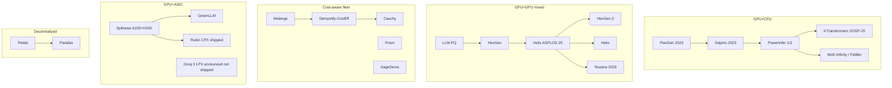

# Heterogeneous Inference

**After reading this chapter, the reader will be able to:**

- Place any heterogeneous-inference proposal on a three-axis taxonomy — *tier* (which classes of hardware are mixed), *granularity* (replica → layer → phase → head → kernel), and *placement vs. routing* (where heterogeneity lives in the system) — and read the literature against that frame.
- Derive the roofline crossover that decides whether a layer, an expert, or a kernel should run on the GPU or be offloaded, and trace it through the FlexGen → DejaVu → PowerInfer → KTransformers lineage.
- Reason about mixed-GPU pipelining as an MILP placement problem (Helix), about cost-aware allocation as an LP over GPU-type prices (Mélange), and about cross-tier disaggregation through the Splitwise / HexGen-2 / Tessera lens — including when KV-transfer bandwidth is the binding constraint.

For most of the field's history, "heterogeneous inference" meant *making do with what was available* — fitting a 175 B model into a single 16 GB consumer card, or pooling volunteer GPUs across the Internet. That framing is dated. By 2026, hardware mix is permanent: production fleets span B200, H200, H100, L40S, A100, A10G, plus consumer cards and ASICs (TPU v7, Trainium2, Groq LPU, Cerebras WSE-3, SambaNova SN40L, AMD MI300X/MI355X). Two further forces converted heterogeneity from accident to strategy. PD-disaggregation [see §20/02-prefill-decode-disagg](02-prefill-decode-disagg.md) showed the phases have opposite arithmetic intensities, so compute-bound prefill can sit on the highest-FLOPs SKU and bandwidth-bound decode on cheaper, older, or specialized chips. MoE sparsity converted *offload* from a hack into a serving regime: when 6 of 256 experts activate per token, hosting cold experts in CPU DRAM is sometimes faster than fitting them on a smaller GPU. The granularity has refined steadily — replica → pipeline-stage → phase → head → kernel.

This chapter develops the taxonomy, then walks the canonical lineages — GPU+CPU offload, mixed-GPU pipelining, cost-aware allocation, GPU+ASIC patterns, and decentralized inference. Splitwise, [Helix](../papers.md#helix), [HexGen-2](../papers.md#hexgen-2), and [Tessera](../papers.md#tessera) are the canonical case studies; vendor-coupled patterns (Rubin CPX shipped, NVIDIA Groq 3 LPX announced) are covered with appropriate hedging.

## 1. Taxonomy

Heterogeneous-inference proposals look incomparable at a glance — a 2023 paper offloading 175 B to SSD on a single 16 GB GPU and a 2025 paper splitting attention heads between H100 and A100 are doing visibly different things. Three axes collapse the differences.

```
                    GRANULARITY
                    (coarse → fine)

                    │
   replica ─────────┼─────────  AlpaServe (multi-model multiplexing)
                    │           Mélange (per-model GPU choice)
                    │
   pipeline-stage ──┼─────────  HexGen, LLM-PQ
                    │           Helix (max-flow + MILP per layer)
                    │
   phase (PD) ──────┼─────────  Splitwise, DistServe, GreenLLM
                    │           HexGen-2, Cauchy
                    │
   head ────────────┼─────────  Hetis (per-attention-head)
                    │
   kernel ──────────┼─────────  Tessera (PTX-kernel granularity)
                    │
   neuron / expert ─┼─────────  PowerInfer (hot/cold neurons)
                    │           KTransformers, MoE-Infinity (experts)
                    │
                    └────►  TIER:  GPU+GPU   GPU+CPU   GPU+ASIC   GPU+edge
                              (homo-vintage) (offload) (specialized) (decent.)
```

**Axis 1 — Tier.** Which classes of hardware are mixed?

- **GPU+GPU**: a fleet of unequal GPUs, usually a vintage mix (B200 alongside H100 alongside A100). NVLink within a node, IB/RoCE across.
- **GPU+CPU**: a single node where the CPU's DRAM (and sometimes NVMe) is enlisted as a slow tier. The link is PCIe, an order of magnitude below NVLink.
- **GPU+ASIC**: a GPU paired with a domain-specific accelerator — Groq LPU, Cerebras WSE-3, SambaNova SN40L, an inline NPU, or an inference-targeted device like Rubin CPX. Strengths (low-latency decode, high-SRAM-bandwidth) differ qualitatively from the GPU's.
- **GPU+edge**: a cloud GPU paired with a phone, laptop, or browser device. Petals and Parallax are the public examples.

The binding constraints differ per tier: *FLOPs/$ vs. HBM-BW/$* across GPUs, PCIe weight-movement cost in GPU+CPU, KV-cache handoff in GPU+ASIC, wide-area network in GPU+edge.

**Axis 2 — Granularity.** At what unit is work assigned? Replica (Mélange, AlpaServe) → pipeline stage (HexGen, LLM-PQ, Helix) → phase (Splitwise, DistServe, HexGen-2, Cauchy) → head (Hetis) → kernel (Tessera) → neuron/expert (PowerInfer, KTransformers, MoE-Infinity, Fiddler). Finer granularity exposes more optimization headroom but raises scheduler and KV-handoff cost. The trend over 2024–2026 is steadily toward finer granularity.

**Axis 3 — Placement vs. routing.** *Static placement* fixes which layers/experts/heads/kernels run on which hardware at deploy time (Helix, HexGen-2, LLM-PQ, Tessera all produce plans). *Dynamic routing* picks at request time, possibly per phase or per kernel (Mélange, Cauchy on running request mix; SageServe across on-demand+spot; Llumnix migrating live requests). Most production systems combine the two: an offline MILP computes the static plan, an online scheduler routes against it with a budget for live re-balancing. Each system in the rest of the chapter sits at one (tier, granularity, placement-vs-routing) coordinate.

## 2. GPU+CPU offload — the bandwidth-bound roofline applied

The single-node GPU+CPU lineage exists because weights are bigger than a consumer GPU's HBM and DRAM is cheaper per gigabyte. The systems differ in how aggressively they exploit *activation sparsity* — the empirical fact that not every weight is read on every token.

### 2.1 The crossover inequality

Hosting a weight on the CPU saves HBM but pays a PCIe transfer on every use. For a tile of $W$ bytes serving $B$ tokens at $f$ FLOPs/token,

$$T_{\text{GPU}}(B) \;=\; \frac{W}{B_{\text{PCIe}}} \;+\; \frac{B \cdot f}{R_{\text{GPU}}} \quad,\quad T_{\text{CPU}}(B) \;=\; \frac{B \cdot f}{R_{\text{CPU}}}$$

where $B_{\text{PCIe}}$ is PCIe bandwidth (≈ 32 GB/s Gen4 x16, ≈ 64 GB/s Gen5), $R_{\text{GPU}}$ the GPU's effective compute rate at this tile, and $R_{\text{CPU}}$ the CPU's (AMX on Sapphire Rapids and successors, AVX-512/VNNI on AMD). The crossover batch is

$$B^{*} \;=\; \frac{W}{B_{\text{PCIe}} \cdot f \cdot \left( \tfrac{1}{R_{\text{CPU}}} - \tfrac{1}{R_{\text{GPU}}} \right)}.$$

Below $B^*$, CPU execution wins (no transfer); above, GPU compute dominates after amortizing the transfer. The offload literature is this inequality applied at finer-grained $W$ with finer-grained sparsity in $f$. KTransformers' kernel selector adds a third branch (AMX vs. AVX-512); Fiddler evaluates the same formula per MoE expert with $f$ scaled by gating probability.

### 2.2 The lineage

**FlexGen** ([FlexGen](../papers.md#flexgen), Sheng et al., ICML 2023) is the foundational work. It serves OPT-175B from a single 16 GB GPU by aggregating GPU+CPU+SSD into a unified hierarchy and solving an LP that schedules block-level weight movement on demand. The headline result was 1 token/s on a 16 GB card — too slow for interactive serving, but a watershed for batch-style throughput. FlexGen pioneered the joint *layout* (where each tensor lives) and *schedule* (when each tensor is moved) framing. Microsoft's contemporaneous ZeRO-Inference is the training-side sibling — weights in CPU/NVMe, streamed to a GPU with zero residency, throughput-optimized.

**DejaVu** ([DejaVu](../papers.md#dejavu), Liu et al., ICML 2023) introduced *contextual sparsity*: for any given token, only a small subset of attention heads and FFN neurons are activated above threshold, and a small predictor can forecast which. The systems consequence — only the predicted-active weights need to be on the GPU — is the conceptual ancestor of every "hot/cold" offload scheme that followed.

**PowerInfer** ([PowerInfer](../papers.md#powerinfer), Song et al., SOSP 2024) operationalizes DejaVu for offload. The empirical observation is power-law FFN activation: a small set of "hot" neurons fires on most tokens, the rest are "cold". PowerInfer pins the hot neurons on the GPU and keeps cold neurons in CPU DRAM, switching to CPU compute when the cold set is hit. On consumer hardware (RTX 4090 + CPU) it reaches up to 11.7× speedup over llama.cpp on the same node and 82% of A100 throughput on OPT-30B. PowerInfer-2 (2024) extends the hot/cold split across (NPU, CPU big/little, GPU) on Qualcomm SoCs, serving a 47 B Mixtral on a phone at >10 tok/s.

**KTransformers** ([KTransformers](../papers.md#ktransformers), Tsinghua MADSys / kvcache-ai, SOSP 2025) is the current SOTA for MoE on commodity hardware. Its distinctive contributions are AMX-aware CPU kernels — the AMX matrix-multiply unit on Sapphire Rapids and successors closes much of the small-batch gap to older GPUs — and *arithmetic-intensity-aware kernel selection* among AMX, AVX-512, and fallback paths using a learned crossover model. The headline demonstration is DeepSeek-R1 671 B on a single RTX 4090D plus DRAM at ~14 tok/s decode (vendor-evaluated). In October 2025 the project pivoted from a standalone server to a *kernel library* that SGLang calls for CPU+GPU MoE serving [see §80/02-sglang](../80-oss-deep-dives/02-sglang.md) — itself a signal that the offload math now favors integration over a separate stack.

**MoE-specific siblings.** [MoE-Infinity](../papers.md#moe-infinity) (Edinburgh, 2024) traces request-level expert activation patterns to guide prefetch into a finite GPU expert cache. [Fiddler](../papers.md#fiddler) (UW, ICLR 2025) picks per-expert execution venue (CPU vs. GPU) based on the input-size-dependent crossover, achieving >3 tok/s for unquantized Mixtral-8x7B on a single 24 GB GPU. [FineMoE](../papers.md#finemoe) and [HybriMoE](../papers.md#hybrimoe) refine cache-replacement policy; HybriMoE's MRS (Minus Recent Score) outperforms LRU on MoE access patterns. The unifying point: a gate-conditioned access pattern is sparse but predictable enough that hit rates are materially better than under general locality assumptions.

The lineage takeaway: GPU+CPU offload moved from curiosity to deployable path because (a) AMX gave CPU a viable compute branch, (b) DejaVu-style activation prediction made selective residency feasible, and (c) MoE provided a structurally sparse access pattern that amplifies (b) by orders of magnitude.

## 3. Mixed-GPU pipelining

The second strand handles a fleet of unequal GPUs serving a single model. The model is partitioned across GPUs (some combination of TP, PP, EP, DP), but the partitioning is asymmetric to match the asymmetric hardware. Several layers of formalization have evolved.

### 3.1 LLM-PQ — phase-aware partition with adaptive quantization

[LLM-PQ](../papers.md#llm-pq) (PPoPP 2024 poster) was first to *jointly* solve pipeline partition, micro-batch sizing, and per-stage quantization precision under heterogeneity. The slowest stage sets iteration time, so

$$\text{bubble fraction} \;=\; 1 - \frac{\sum_i t_i}{S \cdot \max_i t_i}$$

and the bottleneck stage can be quantized down to lower $\max_i t_i$ while higher-end GPUs keep higher precision. Reported up to 2.88× over baseline on 11 heterogeneous configurations. The conceptual point: heterogeneity composes with precision.

### 3.2 HexGen — asymmetric TP+PP

[HexGen](../papers.md#hexgen) (Jiang et al., ICML 2024) generalized the partition to an asymmetric mix of TP and PP. TP degree need not be uniform along the pipeline: a stage on H100s can run TP=4 while a stage on A100s runs TP=2 if the layer fits. Constrained optimization over a hardware-aware cost model; reported 2.3× lower latency or 4× more traffic at the same budget vs. homogeneous baselines. HexGen's main limitation — single PD-coupled pipeline — is what HexGen-2 lifts.

### 3.3 Helix — max-flow + MILP at the canonical place

[Helix](../papers.md#helix) (Mei et al., ASPLOS 2025) is the canonical formal treatment. It models the cluster as a directed graph $G = (V, E)$ where $V$ is the GPU instances and $E$ is the links. Edge capacity $c(u, v)$ encodes link bandwidth; node capacity encodes per-GPU compute and memory. Decision variables are placement indicators $x_{l, u} \in \{0, 1\}$ — is layer $l$ on GPU $u$ — and flow values $f(u, v)$ on each link.

The constraints capture three things at once: **layer continuity** (every request traverses layers in order, so the flow corresponds to a path passing through each layer), **memory feasibility** ($\sum_l x_{l, u} \cdot m_l \le M_u$ for every $u$, with $m_l$ accounting for weights + activations + KV per request), and **link feasibility** (total flow on an edge bounded by its bandwidth). The objective maximizes total flow (sustained request rate); latency SLO is a worst-case-path constraint. Helix solves the MILP with Gurobi, exploiting the fact that variables and constraints scale linearly with $|V|+|E|$ thanks to LLM layer homogeneity.

Reported results on 24-to-42-node heterogeneous clusters mixing H100, A100, and L40S: up to 3.3× throughput, 66% lower prefill latency, 24% lower decode latency vs. heterogeneity-naive baselines. Both simulation and real-cluster numbers appear in the paper; the percentages are reproducible on the tested topologies rather than universal multipliers. The methodological takeaway: optimal placement on heterogeneous clusters is non-obvious (layer sizes, KV pressures, link bandwidths interact), and MILP is the right level of formalization. Subsequent papers (Demystify-CostEff, HexGen-2, Tessera) extend it but inherit the framing.

### 3.4 HexGen-2 — disaggregated PD on heterogeneous fleets

[HexGen-2](../papers.md#hexgen-2) (Jiang et al., ICLR 2025) is HexGen + prefill-decode disaggregation. It partitions the fleet into a prefill pool and a decode pool, each with its own asymmetric TP+PP plan, and uses a graph-partitioning + max-flow framework to jointly choose the split and the placement. Reported result: 2.0× throughput / 1.5× lower latency vs. SOTA at the same price budget. HexGen-2 also handles asymmetric parallelism *across* PD — different TP degrees per stage, different PP depths per phase — which is the natural structural generalization once the phases are physically separated.

### 3.5 Hetis — head-granular heterogeneity

[Hetis](../papers.md#hetis) (UMacau, SC 2025) pushes granularity further: different attention heads within the same layer run on different GPUs. A primary-worker layout dispatches per-head — heads with higher arithmetic intensity go to higher-end GPUs. Reported 1.49× latency / 2.25× throughput over heterogeneity-aware baselines. Head-granular placement is a natural fit because TP already operates per-head, so it falls out of an existing decomposition with relatively little new scheduler complexity; the cost is per-head KV traffic when heads cross physical devices.

### 3.6 Tessera — kernel-granular disaggregation

[Tessera](../papers.md#tessera) (2026-04, arXiv:2604.10180; verification still pending) pushes granularity to its limit: each PTX-level kernel may target a different GPU. Within a transformer layer, kernels have wildly different (FLOPs, bytes, latency) profiles — QKV projection and FFN are matmul-heavy, attention itself is bandwidth-heavy, norm and RoPE are negligible. A heterogeneous pair can run the FFN on the high-FLOPs SKU while attention runs on the high-bandwidth SKU, shipping intermediate activations over PCIe.

Tessera offline-solves an MILP for batch placement and uses a lighter online policy at serving time. Reported tests on (A100+L40S), (H100+RTX Pro 6000), and (B200+H100) pairs show up to 2.3× throughput and 1.6× cost-efficiency over homogeneous baselines — including the headline that *a heterogeneous pair beats two homogeneous high-end GPUs* on cost for some workloads. As of mid-2026 these are simulation + small-cluster measurement; production-fleet reproducibility is not yet demonstrated and the paper is flagged for verification in the bibliography.

### 3.7 Online heuristics — Fast-Heterogeneous-Serving and SageServe

MILP is not free at fleet scale: Gurobi solves at 24-node scale in seconds, but at 1000 nodes or under sub-second budgets, exact MILP becomes the bottleneck. [Fast-Heterogeneous-Serving](../papers.md#fasthetero) (2026, verification pending) replaces the exact solve with greedy / adaptive-greedy heuristics within a small optimality gap. [SageServe](../papers.md#sageserve) (Microsoft + UIUC + IISc, 2025) handles a different axis — mixed SLA tiers across on-demand+spot — with a holistic scheduler that donates surplus capacity to spot, reporting up to 25% GPU-hour savings at provider scale. Together they suggest a layered production scheduler: offline MILP for the static plan, fast-heuristic online layer for re-optimization, workload-aware admission tier on top.

## 4. Cost-aware allocation

The third strand — cost-aware allocation — frames heterogeneity as a *purchasing* decision rather than a deployment one. The question is not "given my fleet, how do I place the model?" but "given the request shape, which GPU should I buy?"

### 4.1 Mélange — dollars per request as the objective

[Mélange](../papers.md#melange) (Griggs et al., UC Berkeley + Microsoft, 2024) frames the problem as an LP over GPU-type prices. For $K$ candidate types, prices $p_k$, and per-type service rates $\tau_k(\text{model}, B, S, \text{SLO})$ at the model and SLO of interest,

$$\min_{n_k \ge 0} \;\; \sum_k p_k n_k \quad \text{s.t.} \quad \sum_k n_k \tau_k \;\ge\; \Lambda, \quad \text{per-request SLO satisfied}.$$

The empirical contribution is in the service-rate model: Mélange measured how request size, request rate, and SLO each shift the cheapest GPU. Across L4, A10G, A100, and H100, the cost-optimal allocation is *almost never* a single GPU type once SLO and request distributions are non-trivial. Reported savings: 9–77% on chat workloads, 2–33% on documents, 4–51% on mixed, vs. homogeneous baselines. Mélange's other contribution is a clean 3-axis decomposition of request shape — **size** × **rate** × **SLO** — each bending a different GPU's cost curve. Long requests prefer high-bandwidth memory; high rates prefer high-throughput SKUs; tight SLOs prefer fast small GPUs.

### 4.2 Demystify-Cost-Efficiency, Cauchy, Prism

[Demystify-CostEff](../papers.md#demystify-costeff) (ICML 2025) is the comprehensive benchmarking exercise that fleshes out the 3-axis decomposition, with binary-search-on-makespan as runtime acceleration. [Cauchy](../papers.md#cauchy) (SoCC 2025) extends static allocation with dynamic re-allocation: as workload drifts, GPUs are reassigned between (prefill GPU, decode GPU) pairings — Cauchy's "GPU Combo" abstraction — with goodput-weighted round-robin scheduling. Reported up to 38.3% Tokens/USD improvement. [Prism](../papers.md#prism) (2025) is the multi-LLM analog: cross-model memory coordination via on-demand virtual page mapping, reporting >2× cost reduction or 3.5× more requests at the same SLO.

These systems all reduce to LP/MILP variants of Mélange's framing, augmented with online re-allocation. They share the conclusion that *homogeneous fleets are almost always overspending* once SLOs and request distributions are non-trivial.

## 5. PD disaggregation across heterogeneous tiers

PD-disaggregation [see §20/02-prefill-decode-disagg](02-prefill-decode-disagg.md) and heterogeneity meet here. Once prefill and decode are physically separated, each phase runs on hardware tuned to its arithmetic intensity, and the tiers need not match. [Splitwise](../papers.md#splitwise) (Microsoft, ISCA 2024) studied the heterogeneity case explicitly: its A100-vs-H100 ablation showed decode on A100 + prefill on H100 Pareto-dominates either homogeneous configuration on cost over a wide band of request mixes, because decode is bandwidth-bound and A100 has reasonable bandwidth at much lower price than H100. [DistServe](../papers.md#distserve) and [Mooncake](../papers.md#mooncake) developed the broader PD-disagg framework; [HexGen-2](../papers.md#hexgen-2) and [Cauchy](../papers.md#cauchy) generalized to arbitrary GPU mixes with explicit cost objectives.

[GreenLLM](../papers.md#greenllm) (Shi et al., 2024) is the carbon variant: replace Mélange's price coefficient with carbon intensity and the optimum shifts. Older GPUs are amortized capex with relatively low marginal carbon, so offloading decode to them while keeping prefill on new GPUs cuts emissions by up to 40.6% at >90% SLO compliance per GreenLLM's evaluation. GreenLLM also sketches a *spec-decode* variant (old GPU drafts, new GPU verifies) — a cleaner statement of the draft/target hardware-pairing question [see §10/05-speculative-decoding](../10-engine-core/05-speculative-decoding.md). Carbon reporting is not yet standard but the cost-framing math is identical.

The binding constraint in cross-tier PD disagg is the *KV handoff*. Splitwise and Mooncake assume RDMA-class links; cross-tier deployments connected only by PCIe or TCP pay enough KV-transfer cost to consume a meaningful fraction of the savings. The hetero-multimodal paper (arXiv:2603.12707, verification pending) finesses this by cutting at the *modality boundary* — vision encoder → MB-scale embeddings → LM, with $O(N_v \cdot d)$ bytes rather than the $O(L \cdot s_{\text{ctx}})$ of a KV handoff. That cut is unique to multimodal; the dense-LM equivalent is still open.

## 6. GPU+ASIC patterns

The newest strand pairs a GPU with a domain-specialized accelerator. The accelerators come in two flavors: **latency-specialized** (Groq LPU, Cerebras WSE-3 — minimize per-token latency at small batch by holding weights in on-chip SRAM) and **throughput-specialized** (SambaNova SN40L, AWS Trainium2, TPU v7 Ironwood). The natural composition pattern is *specialization-by-phase*: GPU handles compute-intensive prefill and large matmuls; LPU/RDU/ASIC handles memory-bound decode, embedding lookups, and other bandwidth-dominated work. The SambaNova–Intel announced blueprint (April 2026) — GPU prefill + RDU decode + Intel Xeon agentic dispatch — is the most explicit public statement of three-tier specialization, slated for 2H 2026; as a vendor announcement, unverified at scale.

The cleanest shipped example is **Rubin CPX** ([NV-RubinCPX-Blog](../papers.md#nv-rubincpx-blog)), NVIDIA's context-processing accelerator alongside Rubin GPUs in the Vera Rubin platform. Rubin CPX is tuned for million-token-context ingestion (high HBM3e bandwidth per dollar of FP4 FLOPs) while Rubin GPUs handle the rest of the request. Announced at GTC 2025-09, expected to ship in volume in 2026 — see [§70/01-nvidia-roadmap](../70-hardware/01-nvidia-roadmap.md) for the hardware deep-dive. The systems-software story is built around NVIDIA Dynamo as orchestrator, with NIXL handling the KV transport [see §80/05-nvidia-dynamo](../80-oss-deep-dives/05-nvidia-dynamo.md).

> **Sidebar: NVIDIA Groq 3 LPX — announced not shipped.** At GTC 2026-03, NVIDIA announced Groq 3 LPX, a low-latency inference accelerator co-designed with Groq (following NVIDIA's $20B IP-licensing deal in December 2025) for integration into Vera Rubin. The pattern — GPU prefill + LPU decode in a single first-party rack — would be the first first-party heterogeneous GPU+LPU rack from one vendor. As of May 2026 it is announced not shipped; canonical case studies in this chapter remain Splitwise, Helix, HexGen-2, and Tessera.

Whether GPU+ASIC extends *outside* vendor-co-designed stacks is the harder question. Dynamo + LPU and SambaNova–Intel are vendor-mediated; for OSS engines to standardize a hardware-agnostic disagg ABI, the KV-handoff transport must be device-agnostic. NIXL is the candidate, with widespread 2026 production adoption, but cross-vendor ASIC work is still early. [WaferLLM](../papers.md#waferllm) (OSDI 2025) provides systems-software for Cerebras WSE-3; [NeuronMM](../papers.md#neuronmm) (2025) provides Trainium2 matmul kernels. Both early-stage relative to the GPU side.

## 7. Decentralized inference

The final tier is the cross-Internet case. [Petals](../papers.md#petals) (Borzunov et al., ACL 2023 demo) is foundational: BLOOM and similar models in a BitTorrent-style swarm, each volunteer GPU hosting a subset of layers, the request flowing through a dynamically-chosen path. Petals introduced fault-tolerant pipeline parallelism — when a node drops the request is rerouted. Throughput is low (wide-area RTTs dominate), tail latency poor; useful for research and community models, not production. [Parallax](../papers.md#parallax) (GradientHQ, 2025) is the modern successor: a two-phase scheduler (DP+water-filling for layer placement, per-request DAG path selection at request time) with reported 3.1× E2E latency / 5.3× ITL / 3.1× throughput improvement. The architectural lesson is that decentralized inference is heterogeneity at its extreme — every link bandwidth, node capacity, and node availability differs — so optimization must be per-request because fleet state changes faster than any static plan. Production economics remain unfavorable as long as RDMA fabric inside one data center is the cheapest serving path.

## 8. Three crossovers, one envelope

The optimization-paper headline numbers reduce to three back-of-envelope inequalities that follow from §2.1's roofline.

- **CPU vs. GPU offload crossover.** Substituting Mixtral-class numbers ($W \approx 32$ MB FFN tile, $f \approx 0.13$ GFLOPs/token, PCIe Gen4 at 32 GB/s, AMX-BF16 at 1 TFLOPS, A100 BF16 at 312 TFLOPS) yields $B^* \approx 7.7$ tokens — fewer than ~8 tokens per expert per iteration, run on CPU; more than that, pay the PCIe transfer to ship to GPU. Fiddler uses this inequality per expert, with $f$ scaled by gating probability.
- **PD-disagg cost crossover.** With prefill cost $F_p \cdot \$_\text{FLOP}^{\text{prefill}}$ and decode cost $D_b \cdot \$_\text{byte}^{\text{decode}}$, the cheapest pair among (H100, H100), (H100, A100), (H100, LPU), (A100, A100) flips with output length: short-output favors (H100, H100), long-output favors (H100, A100). Splitwise's headline reduces to this comparison; GreenLLM swaps $\$$ for $\text{kgCO}_2$ and gets the carbon variant.
- **Bubble fraction.** $1 - \tfrac{\sum_i t_i}{S \cdot \max_i t_i}$ on a heterogeneous pipeline. LLM-PQ minimizes it by quantizing the bottleneck stage; Helix generalizes via the layer-and-flow MILP.

## 9. Systems-by-tier matrix



Every system sits at a (tier, granularity, placement-vs-routing) coordinate; every arrow is either a granularity refinement or a constraint added.

## Current production state

Heterogeneous serving is, as of mid-2026, in active use across every major LLM-serving operator, though the public surface is thinner than the literature.

**GPU+CPU offload** is the most mature strand. KTransformers' October 2025 pivot to an SGLang-integrated kernel library made integrated CPU+GPU MoE the canonical OSS path; PowerInfer's hot/cold framing carried into llama.cpp, mlx, and mistral.rs [see §80/09-llama-cpp-and-edge](../80-oss-deep-dives/09-llama-cpp-and-edge.md). DeepSeek-R1 671 B on a single 4090D + DRAM (~14 tok/s decode, vendor-evaluated) is the legible signal that the strand has crossed from research curiosity into deployable practice.

**Mixed-GPU pipelining at fleet scale** is dominated in production by NVIDIA Dynamo with KV transport via NIXL [see §80/05-nvidia-dynamo](../80-oss-deep-dives/05-nvidia-dynamo.md). Public deployments are mostly variants of phase-disaggregation on intentionally-mixed pools; layer-granular MILPs run offline at hyperscaler scale and have not been reproduced in OSS engines. Together AI's heterogeneous H100/H200/B200/GB200 clusters, Anyscale's wide-EP + disaggregated-serving Ray-Serve LLM compositions, and Microsoft's SageServe deployment are the most concrete public evidence. Hetis and Tessera remain research-grade.

**Cost-aware allocation** (Mélange / Cauchy / Prism) is in widespread use in capacity planning, often implicitly. **GPU+ASIC** has shipped in Rubin CPX, is announced-not-shipped in Groq 3 LPX, and is slated 2H 2026 for SambaNova–Intel's GPU+RDU+CPU blueprint; Cerebras and Groq remain externally-heterogeneous (inference-as-a-service endpoints routed alongside GPU stacks). **Decentralized inference** remains research-grade.

The open questions match the production gaps: KV-transfer cost on commodity links is the binding constraint of cross-tier disagg; MILP placement at fleet scale needs heuristic acceleration; quantization composes with placement (LLM-PQ pioneered, others have not followed); MoE expert-pinning to GPU tier is conceptually obvious but under-exploited; carbon-aware scheduling on aging fleets is the longer-tail trend whose binding signal will be cluster power budgets, not paper acceptances.
