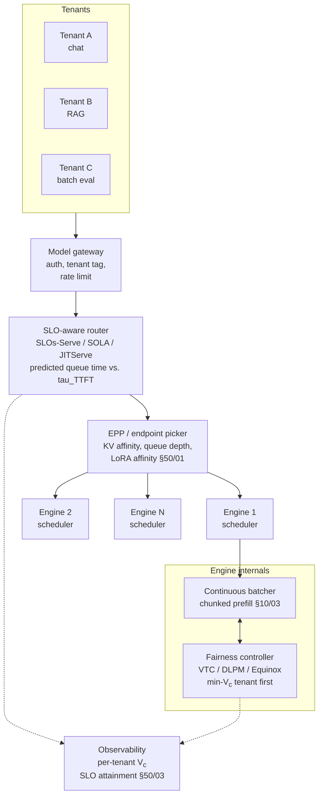

# Fairness, SLO Awareness, and Tenant-Level Routing

**After reading this chapter, the reader will be able to:**

- State VTC's virtual-token-counter formulation, derive its $2\times$ fairness bound, and explain where the bound is tight under adversarial request patterns.
- Compose fairness with prefix-cache locality (DLPM / D²LPM) and with multi-objective SLO scheduling (Equinox), and reason about when each composition is needed in production.
- Distinguish per-engine fairness from cluster-level SLO routing (SLOs-Serve, SOLA, JITServe) and predictive scheduling (Andes QoE, LTR), and locate each system in the multi-tenant serving stack.

A multi-tenant LLM endpoint is a mesh of queues that must enforce three constraints at once: per-token fairness across tenants, per-request SLO attainment, and aggregate goodput against bounded GPU memory. Treating it as a single FIFO is the textbook anti-pattern — a heavy-hitter tenant's burst stalls interactive traffic, a long prompt monopolizes prefill, a low-priority batch job preempts chat because all of them look identical to a stateless load balancer. The systems in this chapter answer the inverse question: given LLM requests with wildly variable per-token cost, partial state (KV-cache locality, LoRA-adapter affinity), and asymmetric SLOs (TTFT vs. ITL), what does *fair* and *SLO-aware* mean, and how does one schedule for both?

The chapter has two halves. The first develops **per-engine fairness** — how a single server arbitrates among many tenants in one scheduling pool, with VTC, DLPM, and Equinox as canonical references related by extending fairness along orthogonal axes (locality, then multi-dimensional SLO). The second develops **cluster-level SLO routing** — how a load balancer fronting $K$ engines picks which engine should serve a given request, with SLOs-Serve, SOLA, and JITServe as the mid-2026 references and Andes and LTR as the predictive-scheduling lineage that crosscuts both halves. The two halves overlap at AIBrix's StormService, which implements VTC fairness at the *orchestrator* rather than the engine level — same algorithm, different enforcement locus, arguably the production state of the art.

## 1. The multi-tenant serving stack

A request enters with a tenant tag. The gateway authenticates, applies coarse rate limits, and forwards to an SLO-aware router. The router scores backends against an SLO budget and forwards to an Endpoint Picker (EPP) [see §50/01-router-gateway](../50-cluster-systems/01-router-gateway.md), which selects a specific engine pod by KV affinity, queue depth, and adapter affinity. Inside the chosen engine, a fairness controller picks which tenant's runnable request to admit into the next scheduling step, and the continuous batcher executes it alongside other in-flight requests. Observability records per-tenant counters, queue times, and SLO attainment at every layer. The fairness controller and the SLO-aware router — the policy layer — are this chapter's focus; the router and EPP are developed at full depth in [§50/01-router-gateway](../50-cluster-systems/01-router-gateway.md).

## 2. Why naive fairness fails

Two intuitions break for LLM serving. The first is that wall-clock CPU shares — Linux CFS, Kubernetes resource quotas — give meaningful fairness. They do not, because the unit of work in a transformer engine is a *token*, not a millisecond, and per-token cost varies by orders of magnitude across requests. Two tenants getting equal scheduler ticks receive radically unequal token throughput.

The second is that round-robin per request gives meaningful fairness. It does not, because per-request granularity ignores per-request length: one tenant submitting a 10,000-token prompt against another submitting ten 100-token prompts gets ten times the GPU work for the same number of "fair turns." A token-level fairness primitive is the correct granularity, which is what the *Virtual Token Counter* formalizes.

A sharper failure appears once prefix caching is in play. Two tenants with disjoint prefixes pay full prefill cost; two requests sharing a prefix may pay near-zero. Token-level fairness that ignores cache state misallocates the *real* resource — marginal compute and memory cost. DLPM is the answer to this misallocation.

## 3. VTC: virtual token counter

VTC, introduced by Sheng et al. at OSDI 2024, is the canonical fair-scheduling algorithm for LLM serving. The construction has three pieces: a per-tenant virtual time, a cost function, and a min-virtual-time scheduling rule.

### 3.1 Virtual time

Each tenant $c$ maintains a counter $V_c \in \mathbb{R}_{\ge 0}$ that grows by a workload-conditional cost each time a token is served on the tenant's behalf. Letting $n_{\text{in}}^{(r)}$ and $n_{\text{out}}^{(r)}$ denote the input and output token counts of a served request $r$ for tenant $c$, the counter advances as

$$
V_c \;\leftarrow\; V_c \;+\; w_{\text{in}} \cdot n_{\text{in}}^{(r)} \;+\; w_{\text{out}} \cdot n_{\text{out}}^{(r)}.
$$

The weights $w_{\text{in}}, w_{\text{out}} > 0$ encode the asymmetric cost of prefill vs. decode. Reference VTC uses $w_{\text{out}} > w_{\text{in}}$; production deployments range from $1{:}1$ (when input and output tokens cost the tenant equally on the contract) to about $1{:}10$ (matching the engine's measured cost asymmetry). The choice is a *policy* decision; VTC is parametric in the cost function.

Tenants entering with no history would otherwise be starved by tenants whose counters are deeply backlogged. VTC's *counter lift* rule corrects this: when a previously-idle tenant becomes runnable, its counter is lifted to the minimum among currently-active tenants,

$$
V_c \;\leftarrow\; \min_{c' \in \mathrm{Active}(t)} V_{c'} \quad \text{when tenant } c \text{ transitions idle} \to \text{active}.
$$

This is the LLM analogue of GPS reset in generalized processor sharing: a fair scheduler must not punish tenants for past quietness, and equally must not reward them for it.

### 3.2 Scheduling rule

At each iteration of continuous batching, the engine picks the runnable request whose tenant has the smallest $V_c$, FIFO-tie-broken. Implementation is a per-tenant min-heap keyed on $V_c$ over per-tenant FIFOs; continuous batching repeatedly draws from the heap root and re-inserts. Per-step cost is $O(B \log T)$ for $T$ active tenants — negligible relative to the forward pass.

### 3.3 The $2\times$ bound

The headline theoretical result is that, under work-conserving scheduling and the VTC rule, the difference in service received by any two backlogged tenants over any time window is bounded:

$$
\big|\, V_{c_1}(t) - V_{c_2}(t) \,\big| \;\le\; 2 \cdot \mathrm{Cost}_{\max},
$$

where $\mathrm{Cost}_{\max} = \max_r\,(w_{\text{in}} n_{\text{in}}^{(r)} + w_{\text{out}} n_{\text{out}}^{(r)})$ is the maximum per-step cost charged to any single served request. The reading: no tenant ever receives less than half the resources it would receive under ideal fluid-fair sharing. The bound is *$2\times$* in the sense that the worst-case gap is twice the largest indivisible request — the granularity at which the scheduler has to commit work atomically.

#### Sketch of the bound

Following GPS / WFQ, let $V^*(t)$ be the ideal continuous-time virtual time of an infinitely-divisible fair scheduler and $\Delta_c(t) = V_c(t) - V^*(t)$ the per-tenant deviation. While $c$ is being served, $V_c$ catches up with $V^*$ and $\Delta_c$ cannot grow. While $c$ is not served, $\Delta_c$ falls behind only if another tenant is served; but min-$V$ selection means $c' \neq c$ runs only when $V_{c'} \le V_c$ at step start, after which $V_{c'}$ can exceed $V_c$ by at most $\mathrm{Cost}_{\max}$. Combining the deviation bounds yields a pairwise gap of at most $2\,\mathrm{Cost}_{\max}$.

The bound is tight: an adversary dropping a long-output request for $c_1$ exactly when $c_1$ wins a tie forces a $\mathrm{Cost}_{\max}$ commitment before $c_2$ becomes runnable; the symmetric next-step construction matches on $c_2$'s side. Any work-conserving token-level scheduler that commits whole requests inherits the $2\times$ floor.

#### Where the bound becomes loose in practice

Three caveats limit how literally $2\times$ predicts production fairness:

- **The bound is on the counter, not on a tenant-perceived metric.** Two tenants with equal $V_c$ may experience different TTFTs because their requests sit on different prefix-cache hot spots. VTC normalizes tokens served, not user-visible latency.

- **Heterogeneous request-cost variance widens the gap empirically.** When $\mathrm{Var}(\mathrm{Cost}_r)$ is large (a tenant interleaving 100k-token prompts among short ones), $\mathrm{Cost}_{\max}$ itself is large and dominates the bound. Chunked prefill [see §10/03-batching-scheduling](../10-engine-core/03-batching-scheduling.md) tightens this implicitly by capping per-iteration tokens, reducing $\mathrm{Cost}_{\max}$ on the prefill side. Operators should pair VTC with chunked prefill not only for ITL stability but for fairness tightness.

- **The bound assumes a single resource.** Prefix-cached prefill costs near-zero compute; decode against a hot KV slab costs less than against a cold one. "Tokens served" stops being a faithful resource counter, which is the gap DLPM closes.

The $2\times$ bound is a textbook guarantee, not a production SLO. A deployment running plain VTC on a heterogeneous-cost workload will measure empirical fairness ratios that diverge from $2\times$ — usually toward *better* fairness in expectation, with worst-case tails that depend on adversarial timing. Empirical fairness is workload-distribution-dependent; characterizing a deployment requires measurement.

### 3.4 Cost-function design choices

Three choices recur in production:

- **Asymmetric in/out weights.** Most deployments use $w_{\text{out}} \in [2 w_{\text{in}}, 10 w_{\text{in}}]$, calibrated against the engine's measured tok/s ratio.

- **Discount for cached-prefill tokens.** Plain VTC overcharges tenants for cached tokens; DLPM (below) makes the discount explicit.

- **Charge for KV-memory occupancy.** A reasoning workload with one long-decode request can hold many KV blocks for many minutes [see §60/01-test-time-compute](../60-adjacent-workloads/01-test-time-compute.md). FairBatching (arXiv:2510.14392) formalizes a memory-aware cost; the corresponding bound is open.

## 4. DLPM and D²LPM: locality-aware fairness

VTC ignores cache state. Fairness and prefix-cache hit rate pull in opposite directions: a fairness scheduler wants to serve the most-behind tenant even if that pulls a cold prefix into HBM and evicts a hot one; a locality scheduler wants to serve whichever request hits the hottest prefix. **DLPM (Deficit Longest Prefix Match)** and its 2-level variant **D²LPM** (Cao, Wang, Mao, Hsu et al., arXiv:2501.14312) make cache locality a first-class scoring term *inside* a fair scheduler.

The construction generalizes the longest-prefix-match primitive from IP routing with a deficit counter. Each tenant maintains a deficit $D_c = V^*(t) - V_c$. For request $r$ of tenant $c(r)$,

$$
\mathrm{score}_{\mathrm{DLPM}}(r) \;=\; \alpha \cdot \mathbb{1}[D_{c(r)} > 0] \cdot \ell(r) \;+\; \beta \cdot D_{c(r)},
$$

where $\ell(r)$ is the longest-prefix match length in the prefix cache. The scheduler picks $\arg\max_r \mathrm{score}_{\mathrm{DLPM}}(r)$. In practice $\alpha$ and $\beta$ are tuned so that fairness binds when deficits diverge and locality binds when deficits are roughly equal.

**The 2-level form (D²LPM).** In a multi-replica deployment, each worker has a local prefix cache and the cluster has a global index. D²LPM runs per-worker DLPM inside each engine and a cluster-level DLPM at the router: the cluster scheduler picks a worker whose locality matches best subject to per-tenant deficit at that worker, then the worker's DLPM picks among the requests routed to it. Fairness is enforced at both granularities — within a worker, and across workers so no tenant is crowded off a hot worker by another tenant's local deficit.

The authors report up to **2.87× throughput vs. VTC** and **7.18× lower latency vs. distributed-scheduler baselines**, with fairness preserved to a constant factor of VTC. The gain is workload-dependent: DLPM helps most when prefix-cache hit rates are high (RAG, multi-turn chat with stable system prompts) and converges to plain VTC when prefixes are cold. A closed-form bound matching VTC's $2\times$ has not been published.

DLPM matters for production for two reasons. First, it is the first scheduler that fairness-bounds and locality-optimizes simultaneously, collapsing what earlier systems treated as a hard dichotomy. Second, it composes naturally with KV-aware routing [see §50/01-router-gateway](../50-cluster-systems/01-router-gateway.md) — the cluster-level D²LPM tier *is* an inference router with a fairness term added.

## 5. Equinox: multi-objective SLO scheduling

VTC and DLPM enforce token-level fairness but do not directly target SLOs. A tenant whose deficit is low but whose request is TTFT-tight will lose to a tenant whose deficit is high but whose request is TTFT-loose, even though the SLO-attainment-maximizing decision is the opposite.

**Equinox** (Wei et al., arXiv:2508.16646) jointly optimizes **fairness, TTFT, and ITL** as a constrained problem. Equinox maintains two per-tenant counters — a *User Fairness* counter (VTC-style virtual time) and a *Resource Fairness* counter (per-tenant share of *physical* GPU resource, which diverges from token count when prefix caches are warm). The dual-counter framing is the structural innovation: it separates "what the user is owed" from "what the engine actually spent" and exposes the relative weight as a policy lever. A *Mixture-of-Prediction-Experts* estimates TTFT and ITL under current scheduler state. The scheduling rule is

$$
\max_r \Big[\,\lambda_U (V^* - V_c^{U}) + \lambda_R (V^* - V_c^{R})\,\Big] \quad \text{s.t.}\;\; \widehat{\mathrm{TTFT}}(r) \le \tau_{\text{TTFT}},\;\; \widehat{\mathrm{ITL}}(r) \le \tau_{\text{ITL}}.
$$

Reported gains are **1.3× throughput**, **60% lower TTFT**, and **13% higher fairness vs. VTC** under the authors' workload mix. Equinox helps most when the workload has a heavy tail of TTFT-tight requests that VTC would stall behind cheaper but TTFT-loose work.

Equinox is single-paper-source as of mid-2026; the dual-counter framing is appealing and consistent with the production direction at AIBrix-scale deployments, but bounds matching VTC's $2\times$ for the dual-counter rule have not been published. Empirical gains should be treated as workload-conditional.

## 6. Cluster-level SLO routing

The systems above run *inside* a single engine. In a multi-engine deployment, an SLO-aware router runs *between* the gateway and the engine fleet, deciding which engine should serve the next request without violating any in-flight SLO. The three canonical references are SLOs-Serve, SOLA, and JITServe.

### 6.1 SLOs-Serve: SLO-feasibility routing

SLOs-Serve (arXiv:2504.08784, MLSys 2025) maintains a per-backend distribution of recently-observed TTFTs and estimates, for an incoming request, the probability of meeting $\tau_{\text{TTFT}}$ on each backend. The router picks the backend with the highest estimated attainment, tie-broken by load. If no backend can meet the SLO with sufficient confidence, the router *defers* the request — admission control — rather than admit it to a backend that will miss SLO and waste resources (a goodput-negative outcome).

The estimator uses a sliding-window TTFT histogram per backend, conditioned on prompt-length quantile, with an analogous ITL histogram; expected $\mathrm{TTFT}^{(r)}$ convolves queue depth, prefill cost, and a recent-history correction. Gains are pronounced under multi-SLO workloads — tight-TTFT chat mixed with loose-TTFT batch — where naive routing wastes tight-SLO budget on batch-loaded backends.

### 6.2 SOLA: bandit-style state-aware routing

SOLA (Tsinghua / Infinigence / SJTU / PKU, MLSys 2025) frames routing as a multi-armed bandit: each backend is an arm, the reward is SLO attainment, and the bandit learns online which backends are SLO-likely for which request classes. SOLA conditions exploration on observable state (KV utilization, queue depth, recent SLO miss rate) rather than treating backends as i.i.d. The structural difference from SLOs-Serve is the learning loop — SLOs-Serve is a heuristic feasibility estimator updating per observation; SOLA is a sequential decision algorithm with regret bounds. The two are interchangeable for many workloads; SLOs-Serve is simpler to debug, SOLA is more aggressive at exploiting heterogeneity.

### 6.3 JITServe: just-in-time dispatch

JITServe (Zhang et al., NSDI 2026, arXiv:2504.20068) sits at the opposite end. Rather than forecasting which backend meets the SLO, JITServe holds a global queue and dispatches to backends *just in time* — when a backend signals free capacity. It does not predict; it reacts. Head-of-line blocking is bounded by the slowest backend's tick rate, not its current state, and decision quality degrades gracefully under imprecise request information because no commitment is made until dispatch. JITServe is the policy of choice when request-cost information is unreliable (long-decode reasoning, agentic loops) but is harder to provision against than a feasibility router.

The three systems are complementary. A production cluster running SLOs-Serve at the SLO-budget layer, SOLA at the per-backend exploration layer, and JITServe-style dispatch at the engine-handoff layer is internally consistent.

## 7. Predictive scheduling: Andes and LTR

A separate lineage attacks scheduling by predicting *what to optimize* and *how long things take*.

**Andes** (Liu, Wu et al., arXiv:2404.16283) models user-perceived **Quality of Experience (QoE)** as a function of TBT (time-between-*visible*-tokens, distinct from engine-internal ITL) and total generation time. The claim is that optimizing p95 ITL does not maximize QoE: a fast-then-slow stream registers worse than a uniformly-slower stream at identical p95, so a QoE-optimizing scheduler favors smoothness over speed. The contribution is conceptual more than algorithmic — production engines now report TBT alongside ITL [see §00/01-inference-landscape](../00-foundations/01-inference-landscape.md) because the operator-relevant metric is the visible one — but Andes-style awareness is showing up in router scoring, where a bimodal ITL distribution scores worse than a tighter one at equal mean.

**LTR** (*Efficient LLM Scheduling by Learning to Rank*, Fu et al., NeurIPS 2024, arXiv:2408.15792) trains an offline model to predict request completion time from features (prompt length, model, tenant, recent traffic) and ranks runnable requests by predicted completion. The intuition is shortest-job-first generalized: when completion time is predictable, scheduling shorter requests first reduces mean response time without much fairness loss, provided fairness is enforced by a wrapping mechanism (VTC over LTR). The gain is predictor-accuracy-bounded: on workloads with near-deterministic output length (structured output, function calls, retrieval Q&A) LTR closes most of the gap to oracle scheduling; on open-ended reasoning or agentic loops it degrades to FIFO. Operators run LTR as one score within a composite rule, not as a standalone scheduler, because pure LTR is fragile under prediction error.

## 8. Composing the layers in production

Production deployments compose the systems above into a five-layer stack. The pattern at AIBrix, llm-d, and the vLLM production stack [see §80/00-overview-comparison](../80-oss-deep-dives/00-overview-comparison.md) is:

1. **Gateway:** coarse per-tenant rate limiting and virtual-token charging for cost accounting. Bookkeeping, not scheduling.
2. **Cluster router (SLOs-Serve / SOLA / JITServe class):** SLO-feasibility filtering. Requests no backend can serve in time are deferred or rejected, preventing goodput-negative admission.
3. **EPP (KV-aware endpoint picker)** [see §50/01-router-gateway](../50-cluster-systems/01-router-gateway.md): a weighted sum over prefix length, KV utilization, queue depth, and LoRA-adapter affinity (covered in [§40/01-lora-serving](01-lora-serving.md)) picks a specific engine pod.
4. **Engine fairness controller (VTC / DLPM / Equinox):** picks the next runnable request under a token-level fairness rule. DLPM is the default when prefix locality dominates; Equinox is the default when multi-SLO trade-offs dominate; plain VTC suffices for homogeneous workloads.
5. **Engine continuous batcher** [see §10/03-batching-scheduling](../10-engine-core/03-batching-scheduling.md): the picked request joins a chunked-prefill or decode batch. Chunked prefill bounds $\mathrm{Cost}_{\max}$ and tightens VTC's effective bound — the engine-internal complement to the policy layer above.

Where VTC lives is an enforcement question. AIBrix's StormService implements it at the *orchestrator* level by stamping each request with a virtual-token charge at admission; per-engine schedulers are simpler (FIFO over orchestrator-dispatched requests). The alternative, used in some vLLM production-stack deployments, runs VTC locally per engine with the gateway only forwarding tenant tags. Both are valid: orchestrator-level placement gives globally consistent fairness across replicas at the cost of orchestrator complexity; engine-level placement gives local consistency with simpler control planes.

## 9. Open questions

Three questions remain open in the published literature as of mid-2026:

- **Bounds for DLPM and Equinox.** VTC's closed-form $2\times$ does not extend cleanly to DLPM's locality-augmented score or Equinox's dual counter. Both report empirical fairness; closed-form bounds are open.

- **Memory-aware fairness.** A reasoning workload's KV occupancy can far exceed its token-served count. FairBatching (arXiv:2510.14392) is the most-cited recent work on memory-aware batch formation but is preprint-tier; no canonical bounded scheduler treats KV occupancy as a first-class fairness term.

- **Cross-replica fairness.** When a tenant's requests are spread across replicas by a prefix-aware router, no published scheduler enforces a *global* VTC bound — each replica enforces locally, and the global gap can in principle reach $K \cdot 2\,\mathrm{Cost}_{\max}$ for $K$ replicas. AIBrix's KV-event broadcast and StormService coordinate state across replicas, but a formal cross-replica bound is open.

## Current production state

As of May 2026, the multi-tenant fairness-and-routing stack looks broadly similar across vendors. **VTC** is implemented or referenced in essentially every engine that supports multi-tenant serving — directly in AIBrix's StormService (where it is the foreground fairness mechanism), as a configurable scheduler in vLLM-derived production deployments, and as the baseline against which DLPM and Equinox are benchmarked. The $2\times$ bound is the textbook fairness floor; production deployments on heterogeneous workloads regularly observe empirical fairness ratios that diverge from the bound in both directions, and operators measure rather than assume.

**DLPM/D²LPM** is the production state of the art when prefix-cache hit rates are non-trivial. AIBrix v0.4 (KV event sync) [AIBrix-v0.4] makes cluster-level cache state visible to the router, which is the prerequisite for D²LPM's worker-level locality scoring; the same primitive underlies llm-d's precise prefix cache aware routing. **Equinox** has not yet seen wide production adoption — the dual-counter framing is novel and numbers are single-source — but separating user-fairness from resource-fairness maps cleanly onto how operators already think about tenant-cost accounting at the gateway. **Cluster-level SLO routing** is converging on the SLOs-Serve / JITServe pattern: a feasibility-aware router filtering out backends unlikely to meet SLO, layered over a KV-affinity EPP. SOLA's bandit framing is intellectually clean but less commonly deployed than the simpler heuristic feasibility estimators. **Andes-style QoE awareness** is implicit — TBT now appears alongside ITL in production metric exports and the OpenTelemetry GenAI conventions [see §50/03-observability-and-resilience](../50-cluster-systems/03-observability-and-resilience.md) — but explicit QoE-objective scheduling remains research-tier. **LTR** is used as one score within a composite rule; pure LTR is not the production default.

The structural shift compared to a year prior is that fairness, SLO, and prefix-locality are no longer treated as competing objectives requiring the operator to pick one. The 2025–2026 schedulers — DLPM, Equinox, and the SLO-aware router family — compose them, and the production stack composes the schedulers themselves into the five-layer pipeline above. The chapters that follow develop the cluster-level half of this pipeline ([§50/01-router-gateway](../50-cluster-systems/01-router-gateway.md)) and the engine-internal half ([§10/03-batching-scheduling](../10-engine-core/03-batching-scheduling.md)) at full depth; the chapter has covered the policy layer that ties them together.
