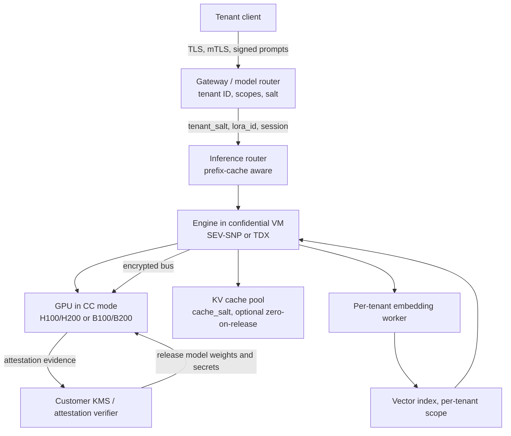

# Trust Boundaries and Isolation

**After reading this chapter, the reader will be able to:**

- Articulate the threat model for multi-tenant LLM inference at the infrastructure layer — what a malicious or compromised tenant could observe or exfiltrate from another tenant sharing the same GPU, KV-cache pool, retrieval index, or model weights — and distinguish that scope from prompt-level adversarial concerns.
- Place each isolation mechanism — `cache_salt` namespacing, KV scrub-on-release, MPS / MIG, GPU Confidential Computing (CC) mode on Hopper / Blackwell, multi-GPU CC, Intel TDX Connect, dedicated-GPU per-tenant VPC — on the cost / strength axis and reason about which combination matches a given regulatory or commercial posture.
- Reason about second-order effects: the interaction between per-tenant cache namespacing and prefix-cache hit rate, between attestation flow and request latency, and between tenant-scoped retrieval and embedding-batch side channels.

Multi-tenant LLM serving is, by default, a *trust-pooled* system. Tenants share GPU hardware, HBM allocations, KV-cache block pools, attention kernels, prefix-cache tries, embedding workers, and very often the same model weights. Cost amortization is the entire reason the architecture exists [see §40/01-lora-serving](01-lora-serving.md), [see §40/02-multi-model-and-gpu-sharing](02-multi-model-and-gpu-sharing.md). The previous chapters treated multi-tenancy as a *performance* problem — fairness, SLOs, adapter-cache hit rates, model-swap latency. This chapter treats it as a *security* problem: when two tenants share a backend, what mechanisms enforce that one tenant cannot read, infer, or corrupt another's data?

The scope is the infrastructure layer. Adversarial prompting, jailbreaks, prompt injection at the application layer, and content-policy evasion are model-side concerns covered in [see §60/07-safety-and-guard-serving](../60-adjacent-workloads/07-safety-and-guard-serving.md). This chapter sits one stratum lower: assuming a well-behaved model, what does the *serving stack* leak across tenant boundaries, and what mechanisms are deployed in 2026 to plug those leaks?

## 1. Threat model

A complete threat model names the adversary, the assets, and the attack surface explicitly.

**Adversary types.** The *co-tenant adversary* is a paying tenant on the same backend who issues crafted requests, observes timings, observes cache-hit signals, and tries to learn something about another tenant's prompts, completions, retrieved documents, or fine-tuned adapters — the dominant adversary in commercial multi-tenant SaaS. The *compromised-tenant adversary* (credential theft, supply-chain, prompt-injection escalation) is indistinguishable from a co-tenant adversary at the infrastructure layer. The *malicious operator or insider* — a cloud provider, hosting employee, or compromised host-OS root with hypervisor access — is the adversary that *confidential computing* exists to defend against. Most multi-tenant SaaS does not contract on this adversary; regulated industries (health, finance, defense) increasingly do.

**Assets.** Tenant prompts (often containing PII, proprietary code, business plans), completions, tenant-scoped retrieval corpora, tenant-fine-tuned weights and LoRA adapters, and request metadata that reveals traffic patterns even without payload disclosure.

**Attack surface.** Seven surfaces matter. *Direct memory access*: a bug in the engine, kernel, or driver lets one tenant's request read another's HBM; software-only multi-tenancy assumes this surface is bug-free, while hardware mechanisms (MIG, GPU CC mode) reduce the assumption to attestable hardware. *KV-cache reuse channels*: the KV cache is shared and content-addressed, so an attacker who can probe whether a given prefix is cached learns about prior traffic. *Prefix-cache eviction channels*: eviction order leaks which prefixes are hot, even without direct hit/miss probing. *Retrieval channels*: in a shared RAG pipeline, an unfiltered query against a multi-tenant vector index may return documents the tenant should not see. *Embedding-batch timing channels*: when a shared embedding worker batches across tenants, per-request latency depends on joint batch composition — the classical side-channel pattern on shared accelerators. *Model-update and adapter-merge channels*: stale adapters, mis-routed requests during adapter rollout, or shared scratch buffers can leak across tenant identity. *Telemetry and log channels*: token-level logs, structured-output traces, and observability metrics often capture tenant-bound data on a path with looser access controls than the inference path itself [see §50/03-observability-and-resilience](../50-cluster-systems/03-observability-and-resilience.md).

This chapter walks the design space for the first six surfaces. Telemetry is largely an organizational-discipline problem, treated in the observability chapter.

## 2. The isolation hierarchy

A useful organizing frame is to place mechanisms on a single ladder from cheapest-weakest to most-expensive-strongest:

| Isolation level | Mechanism | Cost | Use case |
|---|---|---|---|
| None | Shared pool, shared cache | Baseline | Internal APIs, single tenant, trusted callers |
| Logical | `cache_salt` + per-tenant namespacing | Minimal | Multi-tenant SaaS, prefix-cache safety |
| Process | MPS isolation | Low | Moderate isolation, mixed workloads |
| Hardware partition | MIG | Medium | Strong compute isolation, predictable QoS |
| Confidential computing | GPU CC mode (single-GPU, NVL domain) | High | Regulated industries, compliance contracts |
| Network and physical | Per-tenant VPC + dedicated GPU | Very high | Air-gap, classified, sovereignty requirements |

The ladder is not strictly ordered — `cache_salt` and MPS address different surfaces and can compose — but it is a useful first-cut decision tree. The default for commercial multi-tenant SaaS in 2026 is logical isolation layered over a shared engine; regulated workloads add MIG or GPU CC mode; air-gapped deployments collapse the question by handing each tenant their own accelerator.

## 3. KV-cache sanitization across tenants

The KV cache is the most easily mis-shared resource in an inference engine. Two concerns arise.

**Direct re-use after release.** When a request finishes, its KV blocks return to the free pool and are typically overwritten during the next request's prefill or decode. Standard kernels mask attention beyond the current sequence length, so the obvious read-out is prevented; the assumption rests on every kernel respecting the mask and on the block manager's bookkeeping being correct. The defensive primitive is *zero-on-release*: zero-fill (or sentinel-fill) each block before returning it, at a cost of one HBM write per block per request, bounded by the per-token-bytes formula in [§10/02-paged-kv-memory](../10-engine-core/02-paged-kv-memory.md). Most production engines do not zero-on-release by default — the assumption that the next writer overwrites is taken as sufficient — but the option is exposed behind a flag and is the right default for high-assurance deployments.

**Prefix-cache reuse across tenants.** The more interesting channel is *prefix caching* [see §10/07-prompt-prefix-caching](../10-engine-core/07-prompt-prefix-caching.md). Identical token prefixes are stored once and reused across requests, with content-addressed lookup typically over SHA-256 of block-aligned token IDs (extended in vLLM V1 by prior block hashes for Merkle-style chaining). The naïve scheme treats two requests as interchangeable if their prefixes are identical regardless of tenant. The leak has two failure modes:

1. *Cross-tenant prefix collision.* Tenant A submits a prompt with a particular system message; tenant B's prompt, by accident or adversarial probe, contains the same token sequence. Tenant B's TTFT collapses because the prefix is cached; the timing reveals that *someone else previously sent this prompt*. Replayed across many candidate prompts, this is a known-prefix oracle.
2. *Cross-tenant prefix data flow.* If hash-derived block IDs are content-only and a kernel bug or memory-management error allows a stale block to be read with mismatched lengths, residual KV from tenant A can flow into tenant B's attention. Even absent a kernel bug, the acknowledgment that the block exists is an information leak.

The standard mitigation is **per-tenant cache namespacing**, implemented in vLLM V1 (and adopted by SGLang and others) under the field name `cache_salt`. Every block hash incorporates a tenant-scoped secret: $\text{block\_id} = H(\text{tenant\_salt} \,\Vert\, \text{token\_block} \,\Vert\, \text{prior\_hash})$. Two tenants whose prompts begin with byte-identical sequences end up with different block IDs, so neither finds the other's blocks during lookup. The physical block pool stays shared; the logical keying namespace is partitioned.

The cost is a measurable drop in cache hit rate. System-prompt sharing across thousands of requests is often the largest single source of prefix-cache savings, and tenant salting collapses that sharing to within-tenant traffic only. Operators treat this as a tunable: shared cache for tenants in the same trust domain (for example, all employees of one enterprise customer), salted cache across hard tenant boundaries. The salt can be attached at any granularity — per organization, per user, per session — at the gateway or router.

Two refinements appear in production. *LoRA-ID hashing*: the engine extends the cache key with the adapter ID, so two requests with identical token prefixes but different adapters do not collide on a block whose KV was computed under the wrong adapter. *Cache-salt rotation*: salts retained for long-horizon caches (HiCache, LMCache, Mooncake KVStore) are rotated on a schedule or on adapter retirement, accepting the loss of in-flight entries.

Namespacing plus optional zero-on-release covers the common KV-cache surface against co-tenant adversaries on a software-only multi-tenant engine. It does not defend against a malicious operator with host-OS access — for that, the threat model needs a hardware root of trust.

## 4. Tenant-scoped retrieval

In a RAG pipeline [see §60/04-rag-infrastructure](../60-adjacent-workloads/04-rag-infrastructure.md), retrieval is a second cross-tenant surface. A single vector index frequently holds documents from many tenants; a query without tenant scope can return any neighbor in embedding space. Enforcement comes in three layers.

*Index-level filtering*. Each document is embedded with a tenant-ID payload, and the ANN index supports a filter clause that restricts the candidate set before scoring. Production vector stores (Pinecone, Weaviate, Vespa, Qdrant, Milvus) all support this pattern. Implementation matters: naïve post-filtering — retrieve top-$K$ globally, then drop foreign-tenant hits — is both lossy (relevant tenant-scoped neighbors may sit outside the top-$K$) and a covert channel (the post-filtered count leaks cross-tenant index density). Pre-filtering during graph traversal (HNSW with predicate-aware traversal, IVF-PQ with per-tenant centroid partitions) is the correct primitive; the *correct* and *secure* patterns coincide, which is why production vector stores have converged on this design.

*Per-tenant index partitions*. A stronger pattern hosts each tenant's documents in a dedicated index (or a namespace inside a multi-tenant index that physically segregates the underlying graph), eliminating the filter-correctness assumption at the cost of cross-tenant deduplication and higher per-tenant operational overhead.

*Embedding-service isolation*. A subtle channel exists in the embedding step itself. Shared embedding workers (TEI, Infinity, TRT-LLM embedding endpoints) batch requests across tenants for throughput; per-request latency depends on batch composition, so a request landing in a batch with long sequences from another tenant pays a longer wall time. This is the canonical timing side channel on shared accelerators. For most embedding workloads the channel is low-bandwidth and not exploitable in practice; for high-assurance deployments, operators run *per-tenant embedding workers* (or per-trust-domain workers). Rerankers have the same shape and, at lower request volume, the per-tenant deployment overhead is modest.

## 5. Process and hardware GPU partitioning

Two NVIDIA-side mechanisms move the partition into the device itself.

**MPS (Multi-Process Service)** lets multiple CUDA processes share a GPU context with cooperative scheduling. MPS does *not* provide hardware isolation: processes share HBM, the same SMs are time-sliced or co-resident, and a memory bug in one process can corrupt another. MPS is useful where trust between processes is high (multi-process inside one tenant's deployment, decoupling prefill and decode workers) and the goal is to reduce kernel-launch overhead. It is a sharing-and-batching primitive, not a security primitive.

**MIG (Multi-Instance GPU)** is a hardware partition. On Ampere/Hopper/Blackwell, an A100 or H100 can be partitioned into up to seven independent GPU instances, each with dedicated SMs, dedicated L2 cache slice, dedicated HBM partition, and dedicated memory-controller paths. The partition is enforced by the GPU's hardware fabric and survives across processes and containers; a process attached to one MIG instance cannot read another's HBM. MIG is the right primitive for tenants that need *strong compute isolation with predictable QoS* — the QoS angle is often the more important one in production, since MIG removes noisy-neighbor effects entirely.

MIG's cost is fixed-fraction allocation. A 7-way partition gives each instance roughly $1/7$ of SMs and HBM, with the layout drawn from a small set of permitted shapes (1g.10gb, 2g.20gb, 3g.40gb, 7g.80gb on H100). MIG fits the model-fits-in-an-instance regime — small dense models, embedding workers, reranker workers, low-volume tenants — but is awkward for frontier-class models needing the full GPU's HBM. MIG composes with GPU CC mode: a CC-enabled H100 can be partitioned into MIG instances, each operating under CC.

A full treatment of GPU-sharing primitives — time-slicing, KAI Scheduler (Run.AI / NVIDIA), fractional-GPU schedulers (Prism, the NSDI'26 fragmentation-aware scheduler) — lives in [§40/02-multi-model-and-gpu-sharing](02-multi-model-and-gpu-sharing.md). The point here is that MIG is the only one of these mechanisms that provides *hardware* isolation; the rest are throughput primitives.

## 6. Confidential computing on GPUs

The strongest deployable mechanism in 2026 is GPU Confidential Computing (CC) mode. Understanding it requires a brief CPU-side primer.

**CPU TEE background.** Trusted Execution Environments on CPUs — Intel SGX, AMD SEV (SEV, SEV-ES, SEV-SNP), Intel TDX, and ARM TrustZone / CCA — isolate a defined workload from the rest of the system, including the host OS and hypervisor. They combine memory encryption with per-VM or per-enclave keys, hardware-enforced isolation from privileged software, and *attestation*: a cryptographic protocol that lets a remote relying party verify that the code running inside is what it expects. The protection model — "the cloud customer does not have to trust the cloud provider with the data" — is the operative requirement for regulated workloads. SEV-SNP and TDX are the modern production targets.

**NVIDIA H100 / H200 CC mode.** NVIDIA introduced GPU CC with Hopper. It extends the CPU TEE model in three ways. *HBM encryption*: HBM contents are encrypted with keys held inside the GPU; the host CPU cannot read GPU memory through PCIe BAR or DMA bypass. *Encrypted CPU↔GPU bus*: PCIe traffic between the CPU TEE and the GPU is encrypted with a session key established during attestation, so the hypervisor on the bus sees ciphertext. *Attestation*: the GPU produces a signed measurement of its firmware, loaded kernels, and operator-supplied identity payload, which a remote verifier — typically the cloud customer or its KMS — checks against an NVIDIA-rooted PKI before releasing model weights or secrets.

Composed: a CPU TEE (SEV-SNP or TDX confidential VM) holds the orchestrator and the inference engine; the GPU runs in CC mode; the bus between them is encrypted. An attacker with root on the host OS, on the hypervisor, or with bus-tap-class physical access sees only ciphertext, and the cloud customer can attest end-to-end that their model runs on a genuine H100 in CC mode rather than on a forwarder. CC mode adds latency, primarily from the encrypted bus and from attestation handshakes during connection setup; single-GPU CC is the well-trodden path.

**Blackwell extension and multi-GPU CC.** The Hopper mechanism extends to B100 / B200 with the same architectural shape. For multi-GPU CC — two or more CC-mode GPUs in the same NVL domain talking over NVLink — the encryption boundary must extend across NVLink. As of mid-2026 this is supported on small NVLink domains but is not yet GA across full NVL72 racks; production CC deployments still tend to be single-GPU or small-NVLink-island. *Hedge*: NVIDIA's roadmap widens the deployment surface; this status is current as of mid-2026.

**PipeLLM (ASPLOS'25).** The first published serving system to extend CC to *pipeline-parallel* multi-GPU LLM inference. PipeLLM treats activations crossing pipeline-stage boundaries as the cross-trust-domain payload: each stage's GPU is in CC mode with its own attestation, and activations are encrypted at stage boundaries before traversing the inter-GPU link. The paper reports moderate overhead (single-digit percent on prefill, higher on small-batch decode where the encryption setup amortizes less effectively); the contribution is design-level — pipeline-parallel CC serving is *feasible*. *Hedge*: overhead numbers are from the paper's evaluation and have not been independently reproduced at frontier scale, and PipeLLM frames pipeline parallelism as the "easier" multi-GPU CC pattern because activation transfer is well-defined and infrequent compared to TP all-reduce or EP all-to-all; the harder cases remain open.

**Intel TDX Connect.** Intel's parallel construction lifts the CPU TEE (TDX) to encompass external PCIe devices. TDX Connect defines an attestation and key-derivation flow that lets a TD bind a PCIe device into its trust domain. It is most relevant for Intel-CPU-plus-non-NVIDIA-accelerator deployments, including Intel Gaudi accelerators in TDX-enabled servers. LLM-serving coverage is thin as of 2026 — the dominant story remains NVIDIA H100/H200 plus AMD SEV-SNP or Intel TDX on the CPU side — but the pattern is the same: CPU TEE, encrypted device-bus, device attestation.

**Production CC offerings.** *Phala GPU-TEE* is a decentralized compute network running inference on H100 / H200 nodes in CC mode and exposing attestation evidence on a public ledger; a user can attest, without trusting Phala or the node operator, that their request ran on a CC-enabled H100. *OpenRouter TEE endpoints* expose CC-enabled inference endpoints for privacy-sensitive enterprise workloads, routing selected traffic to backend providers running CC-mode GPUs and surfacing the attestation evidence. *Hedge*: both offerings' specific guarantees are vendor-reported; independent third-party security audits of the end-to-end flows are limited as of 2026.

A general health-warning: GPU CC mode is NVIDIA-documented, the architectural model is sound, and real deployments exist — but the surface area for independent academic security audits is still limited. GPU CC mode is the *strongest deployable* infrastructure mechanism, not unconditionally bullet-proof. The CC threat model assumes a non-physical attacker (bus-tap-class physical access is partially in scope; supply-chain or fab-level attacks are out of scope) and assumes NVIDIA's firmware and attestation root are trusted. Operators contracting on CC-mode inference should read the threat-model boundary carefully.

## 7. Composing the mechanisms

In a real production deployment, multiple mechanisms compose. A regulated-industry SaaS in 2026 looks roughly as follows.

Each layer closes a different surface. The gateway attaches `cache_salt` and the LoRA-ID hash so prefix-cache lookups stay tenant-scoped. The router selects an engine replica based on prefix-cache affinity and tenant placement. The engine runs inside a confidential VM (SEV-SNP or TDX), so the host OS cannot read its memory. The GPU runs in CC mode, so the host hypervisor cannot read HBM and bus traffic is encrypted. The KV pool uses `cache_salt` for cross-tenant isolation and, optionally, zero-on-release for high-assurance tenants. The embedding worker is per-tenant for high-trust workloads, removing the shared-batch timing channel. The vector index enforces tenant scope at the ANN-traversal layer, not by post-filter. The attestation flow binds release of model weights and KMS material to a verified GPU-plus-VM measurement, so a substituted backend cannot serve.

Mainstream commercial SaaS — chat APIs, code-completion, generic LLM endpoints — typically deploys only the gateway-plus-`cache_salt` layer plus standard cloud isolation, treating the malicious-operator threat as out of scope. Regulated industries layer in CC-mode GPUs and confidential VMs. Air-gapped customers skip multi-tenancy entirely and provision dedicated accelerators behind a per-tenant VPC or on-prem rack.

## 8. Second-order effects

A few operational pitfalls recur. *Cache-hit-rate cliffs at salting boundaries*: turning on `cache_salt` per tenant on a workload that enjoyed heavy cross-tenant system-prompt sharing drops hit rates by tens of percentage points; mitigation is to scope the salt to the *trust domain* (one enterprise, one workspace) rather than the individual user, so the salt differs only across hard tenant boundaries. *Attestation latency on first request*: GPU CC attestation walks a certificate chain, fetches revocation status, and validates the measurement; the typical deployment amortizes this by establishing the attested session at engine startup and reusing it, while per-request re-attestation imposes a wholly avoidable TTFT penalty. *Stale adapter cross-tenant flow*: during multi-replica rollouts, a replica that has not yet loaded the requested adapter can fall back to base weights silently — a security risk that engines mitigate by treating the adapter as a hard precondition, with AIBrix's `ModelAdapter` CRD and replica-aware routing as the canonical pattern [see §80/07-aibrix](../80-oss-deep-dives/07-aibrix.md). *Telemetry sprawl*: even a perfectly isolated inference path leaks if observability captures full prompts, completions, retrieved documents, or cache keys to a backend with looser access controls; the OpenTelemetry GenAI semantic conventions mark these fields as sensitive, and production deployments redact or omit them. *Adapter pages as private data*: tenant-fine-tuned LoRA adapters are tenant data; the zero-on-release discipline that applies to KV blocks should apply to adapter pages, since free-pool reuse without scrub leaves residual adapter weights readable by the next allocator.

## Current production state

As of mid-2026, the production picture has three regimes.

For **commercial multi-tenant SaaS** — OpenAI, Anthropic, Google's Gemini API, Mistral, Together, Fireworks, OpenRouter, the larger inference aggregators — the default is logical isolation. Per-tenant `cache_salt` (or its equivalent) is supported in vLLM V1, SGLang, and TRT-LLM and is the standard pattern for multi-tenant prefix caching; tenant-scoped retrieval is enforced at the vector-store layer with predicate-aware ANN; embedding workers are typically not per-tenant, with the timing channel treated as below the practical-attack bar. GPU CC mode is supported in the underlying cloud (NVIDIA H100/H200 CC is GA on Azure, GCP, OCI, and selected partners) but is not used by default for the public APIs.

For **regulated industries** — clinical-note summarization in health-care, customer-data analytics in finance, classified text in defense and intelligence — confidential computing has moved from research to deployment. Single-GPU H100/H200 CC is dominant; multi-GPU CC over small NVLink domains is supported but less common. PipeLLM-style pipeline-parallel CC serving is the leading research pattern for extending CC across multi-GPU pipelines, but full NVL72-rack GA is incomplete. Phala GPU-TEE and OpenRouter TEE endpoints expose CC-attested inference to end customers; both are vendor-reported with limited independent audit coverage. Intel TDX Connect is in early adoption, with Intel Gaudi-plus-TDX deployments at pilot rather than GA scale.

For **air-gapped or sovereignty-bound deployments**, the multi-tenant question is collapsed by design: each tenant gets a dedicated accelerator in a dedicated VPC or on-prem rack, and the cross-tenant surface is eliminated by physical separation. Cost is roughly an order of magnitude higher than logical multi-tenancy, but the threat model becomes single-tenant and the audit story is dramatically simpler. This is the posture for most national-security and sovereign-AI procurements, and increasingly for enterprises that have concluded dedicated hardware is the cheaper path against the regulatory-compliance overhead of multi-tenancy.

The direction of travel is unambiguous. `cache_salt` and tenant-scoped retrieval are table stakes; engines that lack them are visibly behind. GPU CC mode is moving from optional to expected for any deployment that contracts on regulatory compliance, and multi-GPU CC over NVLink is likely to reach full-rack production within the next NVIDIA generation. The longer-term open question is whether attestation flows compose cleanly across the gateway, router, KV-fabric, and engine layers, and how the field treats embedding-side and reranker-side timing channels at scale.
