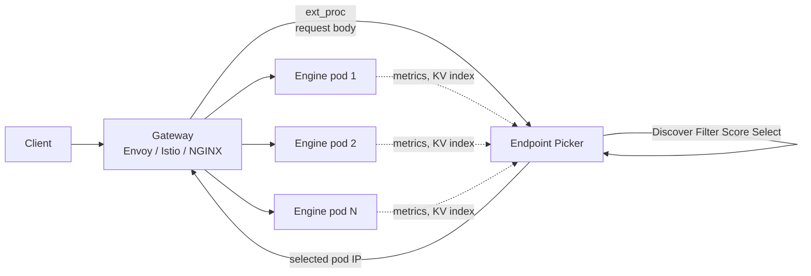

# Routers and Gateways

**After reading this chapter, the reader will be able to:**

- Explain why generic L7 load balancers are pathological for LLM traffic, and state the four-step Discover → Filter → Score → Select cycle that the Endpoint Picker Protocol replaces them with under the Gateway API Inference Extension (GIE).
- Derive the standard KV-aware routing score $S(p, r)$ from its prefix-affinity, KV-utilization, queue-depth, and adapter-affinity components, and reason about when sticky, consistent-hash, and Power-of-Two-choices (PoT) variants are appropriate.
- Locate every major engine-level router (vLLM router, sgl-router, llm-d EPP, AIBrix, Dynamo Smart Router) and client-facing model gateway (Envoy AI Gateway, LiteLLM, Portkey, Kong, Cloudflare, Bifrost) on the gateway stack, and read a production deployment in those terms.

A serving cluster has two routing problems, not one. The *outer* problem is what every API surface has: authenticate, rate-limit, fan out across providers, redact, log, bill. The *inner* problem is unique to LLM traffic: pick which engine pod, of $K$ nominally identical replicas, should serve a given request given that the replicas are not actually identical — they hold different KV caches, carry different queue depths, have different LoRA adapters loaded, and are mid-way through long-lived streaming responses. The first is the job of a *model gateway*. The second is the job of a *router* or *endpoint picker*. The two layers compose; conflating them is one of the more reliable production anti-patterns.

This chapter is laid out from the inside out. It starts with why ordinary L7 load balancing fails for LLMs, develops the Gateway API Inference Extension and its Endpoint Picker Protocol as the standardization point, derives the KV-aware scoring formula that every modern router converges on, walks the session-affinity and Power-of-Two variants, surveys engine-level routers (vLLM, SGLang, llm-d, AIBrix, Dynamo), and finishes with the client-facing model-gateway tier (Envoy AI Gateway, LiteLLM, Portkey, Kong, Cloudflare, Bifrost). The outer-tier fairness and SLO-aware routing problem is developed separately in [§40/03-fairness-slo-routing](../40-multi-tenant/03-fairness-slo-routing.md); this chapter focuses on the *mechanism* that those policies dispatch through.

## 1. Why HTTP load balancers fail for LLMs

A traditional L7 load balancer assumes three properties that LLM traffic violates outright:

1. **Roughly uniform per-request cost.** HTTP services serve responses in milliseconds with cost variance of maybe an order of magnitude. An LLM request can run from 50 ms (cached short prompt, one-token output) to 90 s (long-context reasoning trace, tens of thousands of decode tokens). Round-robin across replicas with 1000× cost variance produces tail latencies dominated by the unlucky pairing of a long request with a backend already serving another long request.

2. **Stateless replicas.** A standard load balancer treats backends as interchangeable. LLM engine pods are not. A pod that has just served a 32k-token system prompt for tenant $T$ holds the corresponding KV blocks; routing $T$'s next request to a *different* pod throws away the cache hit and re-pays the prefill cost. With prefix caching enabled [see §10/07-prompt-prefix-caching](../10-engine-core/07-prompt-prefix-caching.md), the per-pod hit rate is the dominant determinant of TTFT.

3. **Short connections.** Streaming completions are long-lived HTTP/2 or WebSocket connections, often 10–60 s. Mid-flight rebalancing is not possible without aborting the stream. Connection counts and bytes-per-second are useless as load signals because a pod with one streaming decode at batch-1 looks "idle" by both metrics while running flat-out.

The implications for routing are direct. The router needs request-level visibility (prompt content for prefix matching, requested adapter, declared SLO), backend telemetry that includes KV utilization and queue depth, and an extensibility hook to introduce custom scoring per workload. None of this is in the contract of a stock Envoy or NGINX. Specialized LLM routers fill that gap.

## 2. The Gateway API Inference Extension

The fragmentation problem — every engine vendor shipping its own router with incompatible APIs — was acute by mid-2025. The Kubernetes-side response was the **Gateway API Inference Extension (GIE)**, a Kubernetes SIG-Networking subproject that pins down a contract between platform owners (who run the cluster) and model owners (who deploy and tune model variants), with a per-request scheduling extension as the runtime hook. `InferencePool` reached **v1** in 2025; conformant implementations include Envoy Gateway, Envoy AI Gateway, Istio 1.27+, kgateway, NGINX Gateway Fabric, GKE Gateway, and Alibaba Cloud's ACK Gateway.

GIE introduces three custom resources and one protocol:

- **`InferencePool`** — platform-owned. Names a pod selector that resolves to a fleet of engine replicas exposing the OpenAI-compatible API. The pool advertises an EPP endpoint and the pool-level routing policy.
- **`InferenceObjective`** (formerly `InferenceModel`) — model-owner-owned. Names a logical model (e.g., `llama-3.1-70b-chat`), points to a pool, and declares per-objective parameters: priority, traffic-split criteria for canary, LoRA adapter requirements, SLO targets.
- **EPP (Endpoint Picker)** — a sidecar process that the gateway calls per request via Envoy's `ext-proc` filter to obtain the chosen pod IP. EPP holds the live picture of pool state (KV utilization, queue depth, prefix-cache index, loaded adapters) and runs the scoring loop.

The decoupling matters. The platform team owns capacity, autoscaling, and topology via `InferencePool`; the model team owns rollout, priority, and SLO via `InferenceObjective`; and request-level dispatch is encapsulated in EPP, where it can be swapped per cluster without changing either resource. By 2026, EPP-style routing is the default model for any GIE-conformant gateway.

### 2.1 The Endpoint Picker Protocol

EPP runs a fixed four-step cycle per request:

1. **Discover.** Resolve the `InferencePool` selector to a set of healthy candidate pods. Pods failing readiness or above a hard saturation threshold are excluded here.
2. **Filter.** Apply hard predicates: required adapter loaded, sufficient free KV blocks, model-version match, PD-disagg role match (prefill vs. decode pool). Filtering returns a candidate set, not a score.
3. **Score.** Apply composable *scorers* — each plugin returns a numeric contribution per candidate. Standard scorers cover prefix affinity, KV utilization, queue depth, and adapter affinity. Custom scorers attach per workload.
4. **Select.** Combine scores (weighted sum, or a Power-of-Two-choices sample, or strict argmax) and return one pod.

The plugin contract is intentionally narrow: a scorer is a function `(request, candidate_set, telemetry) -> {pod: score}`. Filters and scorers are wired into named **SchedulingProfiles** that the operator selects per pool — for example, a `prefill-aware` profile combines the prefix-affinity scorer with a queue-depth scorer; a `decode-throughput` profile drops prefix affinity and weights KV utilization more heavily. The reference implementation lives in the `kubernetes-sigs/gateway-api-inference-extension` repository under `pkg/epp/scheduling`.

The contract leaves three mechanisms deliberately open. First, **how telemetry is collected**: pull-based scrape over Prometheus, push-based pub/sub over a message bus, or in-band reporting via Envoy `ext-proc` headers all conform. Second, **how prefix indexes are summarized**: a Bloom filter, a Cuckoo filter, an exact block-hash list, or a radix-tree digest are all valid per-pod summaries, with different size/freshness/precision trade-offs. Third, **how the Select step combines scores**: argmax, sampled argmax with a temperature, PoT, or a constraint optimizer. Each of these axes is where engine-specific routers differentiate, while the four-step skeleton stays invariant.

## 3. KV-aware routing: deriving the score

The standard EPP score combines four signals. Each signal is normalized to $[0, 1]$ — zero meaning "this candidate is the worst possible match," one meaning "ideal." The weighted sum is the score the *Select* step argmaxes (or feeds into a stochastic policy).

Let $p$ be a candidate pod, $r$ a request with prompt token sequence and an optional adapter $\text{adapter}(r)$. Define:

**Prefix-affinity term.** Each engine pod publishes a digest of cached prefix tokens — typically a Bloom filter or Cuckoo filter of block-aligned prefix hashes, refreshed periodically. The router computes the longest matching cached prefix length $\ell_{\text{match}}(p, r)$ against the request prompt of length $|r|$:

$$
\sigma_{\text{prefix}}(p, r) \;=\; \frac{\ell_{\text{match}}(p, r)}{|r|} \;\in\; [0, 1].
$$

A score of 1 means the entire prompt is already cached on $p$, so prefill is free; 0 means no overlap. Block-aligned matching against the engine's KV block size (typically 16 or 64 tokens) is required so that the score reflects what the engine can actually reuse — RadixAttention-backed engines like SGLang use a token-level radix tree internally, but the router compares at block granularity to keep the digest cheap to ship.

**KV-utilization term.** Each pod publishes its current KV cache occupancy $u_{\text{kv}}(p) \in [0, 1]$ (used blocks / total blocks). The score is the complement:

$$
\sigma_{\text{kv}}(p) \;=\; 1 - u_{\text{kv}}(p).
$$

A near-empty pod scores 1; a near-full pod scores ≈ 0 to discourage routing requests that would force preemption of in-flight decodes.

**Queue-depth term.** Pods publish their waiting-queue depth $q(p)$ and pool-configured cap $q_{\max}$:

$$
\sigma_{\text{queue}}(p) \;=\; 1 - \min\!\left(\frac{q(p)}{q_{\max}},\, 1\right).
$$

This penalizes pods that already have unscheduled requests waiting, capturing TTFT pressure that KV utilization alone can miss (a pod with low KV but a long queue is still slow).

**Adapter-affinity term.** For LoRA-multiplexed serving [see §40/01-lora-serving](../40-multi-tenant/01-lora-serving.md), a pod that already holds the requested adapter avoids a load-on-demand stall. The signal is binary:

$$
\sigma_{\text{lora}}(p, r) \;=\; \mathbb{1}\!\left[\text{adapter}(r) \in \text{loaded}(p)\right].
$$

The composite score is the weighted sum:

$$
\boxed{\;
S(p, r) \;=\; w_{\text{prefix}}\,\sigma_{\text{prefix}}(p, r) \;+\; w_{\text{kv}}\,\sigma_{\text{kv}}(p) \;+\; w_{\text{queue}}\,\sigma_{\text{queue}}(p) \;+\; w_{\text{lora}}\,\sigma_{\text{lora}}(p, r)
\;}
$$

with weights $w_\bullet \ge 0$ that operators tune per pool. Typical production values place the largest weight on prefix affinity for chat workloads ($w_{\text{prefix}} \approx 2$, others $\approx 1$) and shift toward KV and queue weights for short-prompt embedding or completion workloads where prefix hit rate is low. Adapter affinity gets a strict-priority weight when LoRA fleets are large enough that adapter swaps are expensive.

The formula is deliberately additive rather than multiplicative. A multiplicative form $S = \prod \sigma_i^{w_i}$ would zero out a candidate that is merely *empty of useful prefix*, which is the wrong behavior on cold pools; the additive form degrades gracefully. The trade-off is that additivity lets a single dominant signal mask a problem on another axis — a pod with a perfect prefix match but a saturated KV is selected unless $w_{\text{kv}}$ is high enough. Sensitivity studies in [llm-d-inference-scheduler] and [DLPM] both note that no single weight setting Pareto-dominates across workload mixes; per-pool tuning is the rule, not the exception.

Two refinements are common in production. The first is **prefix-affinity flooring**: the prefix term is clamped to zero below a minimum match length (e.g., one or two KV blocks), to avoid steering on noise from short incidental matches that engines cannot actually reuse. The second is **KV soft-thresholding**: the KV utilization term is replaced with a piecewise-linear function that is flat in the low-utilization region and steepens sharply above a threshold (e.g., 80%), to encode "any pod below 80% is fine; above that, strongly avoid." Both refinements push routing decisions toward the regime where signal differences are meaningful, away from regions where the linear sum is dominated by noise. The exact shapes are operator-tuned; the EPP scorer plugin contract makes them straightforward to express.

### 3.1 Sticky and consistent-hashing baselines

Pure scoring is the heaviest form of routing. Two lighter-weight schemes remain in production for workloads where prefix match is dominated by *session* rather than content:

- **Sticky routing.** A session ID (cookie, JWT claim, header) is hashed once at the gateway and pinned to a backend for the session lifetime. This trivially preserves KV locality for chat sessions where the same conversation continues against the same pod, but breaks under pod churn and ignores cross-session prefix sharing.
- **Consistent hashing.** A standard ring hash on a key derived from the request (session ID, tenant ID, or a hash of the leading $N$ prompt tokens). Routes are stable under modest pod-set changes — only $O(1/K)$ of keys remap when one pod of $K$ leaves. The leading-prefix-hash variant captures prefix sharing across distinct sessions that happen to share a system prompt, at the cost of being insensitive to actual cache state.

Both schemes are *open-loop*: they ignore live load and can route a hot tenant onto an already-saturated pod. They are useful as fallbacks when the EPP is unavailable, and as the cache-affinity layer underneath a Power-of-Two choices probe.

### 3.2 Power-of-Two choices and DualMap

Power-of-Two-choices (PoT) is the standard randomized load-balancing primitive: sample two candidates uniformly at random, pick the less loaded. The classical [Mitzenmacher] result is that PoT reduces maximum load from $O(\log K / \log\log K)$ to $O(\log\log K)$ relative to single-choice random — exponentially better tail behavior at trivial overhead.

For LLM routing, naive PoT discards the prefix-affinity signal. Two random pods rarely both hold a useful prefix, so the lower-loaded one is picked even if a third pod across the cluster has a cache hit. The fix is *cache-affinity-aware* PoT: instead of sampling uniformly, restrict the candidate set to pods that share affinity with the request, then PoT-load-balance within that set. Restriction is implemented as a two-level mapping: a primary hash (consistent-hash on prefix) gives an affinity bucket of $b$ pods, and PoT samples within the bucket.

**DualMap** (arXiv:2602.06502) formalizes this construction. It maintains two maps in parallel: an *affinity* map from prompt-prefix hashes to pod buckets, and a *load* map from pod IDs to current load. The routing decision draws $b$ candidates from the affinity bucket, scores each on load, and picks the minimum. The result is that cache hit rate stays close to a sticky-affinity policy while tail load stays close to PoT — combining the favorable behaviors of both. The construction generalizes: any signal usable as a hash key (tenant, adapter, session, leading prompt N-gram) can drive the affinity dimension.

The intuition for why this works is straightforward. Without affinity, PoT picks the lower-loaded of two random pods; the maximum load over $K$ pods drops from $\Theta(\log K / \log\log K)$ to $\Theta(\log\log K)$. With affinity restriction, the same logic applies *within* the affinity bucket: among the $b$ pods that share affinity with the request, the maximum load drops from $\Theta(\log b / \log\log b)$ to $\Theta(\log\log b)$. The cache-hit guarantee is unchanged from sticky affinity (any pod in the bucket has the cache), and the tail-load guarantee degrades only with $b$, not with $K$. Choosing $b$ small (often 2–4) keeps cache hit rate near 100% in the bucket while still giving PoT room to balance.

In production EPPs, the `Select` step is configurable between strict argmax (deterministic, brittle to ties), full weighted-sum scoring (highest fidelity, highest cost), and PoT/DualMap variants (cheap and resilient). The PoT variants are the default for high-QPS pools where running the full score across $K = 100+$ pods per request is itself a latency cost.

## 4. P/D-disaggregated routing

Prefill–decode disaggregation [see §20/02-prefill-decode-disagg](../20-distributed-inference/02-prefill-decode-disagg.md) doubles the routing problem. A request needs *two* backends — a prefill pod and a decode pod — and the router has to coordinate both, then arrange the KV transfer between them.

The standard pattern in llm-d, Dynamo, and AIBrix is for the EPP to expose two SchedulingProfiles wired to a single objective: a prefill profile that scores against the prefill pool (heavy weight on prefix affinity, KV headroom for the prompt) and a decode profile that scores against the decode pool (heavy weight on KV utilization and queue depth, adapter affinity). The EPP runs both selections, attaches a header on the request describing the chosen decode pod, and dispatches to prefill. The prefill pod, on phase boundary, initiates the KV transfer to the named decode pod via NIXL, Mooncake, or a direct RDMA path, then closes its handle. The router never sees the transfer; it is engine-to-engine.

Two failure modes are specific to disaggregated routing. The first is *stale decode selection*: by the time prefill completes, the chosen decode pod may have saturated. Production EPPs handle this by re-selecting at phase boundary if a freshness window has elapsed. The second is *KV-transfer-aware filtering*: a prefill pod and a decode pod must share an RDMA-reachable network plane, so the candidate set is restricted by topology (rack, NVLink domain) before scoring.

## 5. Engine-level routers

Each major open-source engine ships a router that implements the above, with subtly different design choices. They are converging toward GIE/EPP conformance but predate the standardization and so retain idiosyncratic features.

**vLLM router** (December 2025 GA). Rust-based, ships in the `vllm-project/aibrix` and `vllm/router` repos. Supports round-robin, random, consistent-hashing, and Power-of-Two as selection modes; native first-class P/D-disagg routing including KV-transfer coordination; circuit breakers and configurable retries; a Bloom-filter-based prefix index synchronized from engine pods over a side channel. It functions both as a standalone front-end and as an EPP plugin via a `ext-proc` adapter.

**SGLang sgl-router**. Also Rust, designed around SGLang's RadixAttention internal cache. Each engine pod reports its radix-tree summary; the router maintains an approximate global radix and routes to the pod with the longest cached prefix. The cache-affinity-first orientation makes it especially strong on workloads with heavy prefix sharing (chat systems with large system prompts, agentic workloads with repeated tool prompts), at the cost of being more sensitive to staleness in the prefix-summary feed.

**llm-d EPP** (`llm-d/llm-d-inference-scheduler`). The reference implementation of GIE EPP. Fully implements the four-step Discover/Filter/Score/Select cycle with a precise prefix-cache-aware scorer backed by a global cache indexer that aggregates per-pod prefix advertisements. Prefix matching is exact at block granularity (not Bloom-approximate), trading a higher index footprint for higher hit-rate fidelity. Used in CNCF Sandbox llm-d deployments alongside vLLM as the default engine.

**AIBrix**. The ByteDance-led K8s-native serving project, vLLM-aligned. Its API gateway tier provides prefix-aware and load-aware routing with KV-event synchronization across pods via a messaging middleware (Pulsar in the reference deployment). Prefix events are publish/subscribe rather than periodic snapshot, which improves freshness for high-churn caches at the cost of operational complexity. The `StormService` orchestrator at the next layer enforces VTC-style fairness across tenants on top of the underlying KV-aware route, putting AIBrix in a unique position spanning the dispatch and policy layers [see §40/03-fairness-slo-routing](../40-multi-tenant/03-fairness-slo-routing.md).

**Dynamo Smart Router** (NVIDIA). Rust router that drives dispatch into the broader Dynamo runtime — Smart Router for selection, KVBM for the GPU/CPU/SSD KV memory hierarchy [see §30/02-kv-tiered-offload](../30-kv-cache/02-kv-tiered-offload.md), NIXL for the inter-pod KV transfer, Planner for autoscaling. The Smart Router holds a global radix-tree KV index across pods (HiRadixTree in some deployments) and routes by longest-prefix match plus load. The published architecture positions it as a P/D-disagg-by-default router; vendor benchmarks claim large TTFT improvements on long-prompt workloads, though the exact factor depends on workload mix and is best treated as vendor-supplied [unverified] until reproduced on disclosed traces.

## 6. Client-facing model gateways

The outer tier is the *model gateway* — what tenants and applications integrate against. Its job is provider abstraction, auth, rate-limit, observability, cost attribution, and failover, *not* per-request KV-aware dispatch. Six systems anchor the 2026 landscape.

**Envoy AI Gateway**. CNCF-backed extension of Envoy Gateway specialized for LLM traffic. Token-level flow control (rate limiting in tokens, not requests), unified upstream provider abstraction, and tight integration with EPP for the inner-tier dispatch. The design point is "use the same Envoy data plane for AI as for everything else," which is operationally compelling for organizations already running Envoy. As of late 2025 it is the most widely deployed CNCF-side gateway for LLM workloads, though [unverified] for total share.

**LiteLLM**. Open-source Python proxy. Integrates 100+ providers (every major closed model, every major open-model API surface) under a single OpenAI-compatible interface. Virtual API keys with per-key spend tracking and rate limits, request-level guardrails (PII, content moderation, prompt-injection filters), basic load balancing across providers. The dominant choice in the "I run my own API surface in front of OpenAI/Anthropic/Bedrock/etc." segment, and a common front for the gateway tier even in clusters where the inner tier is GIE/EPP.

**Portkey**. Managed service. Per-tenant cost tracking via metadata tagging, observability dashboards, MCP routing, and a guardrail framework. Differentiated on operational polish more than on technical novelty; the routing layer is provider-aware but not deeply KV-aware (the inner tier remains the engine's problem). Vendor-claimed overhead numbers should be checked against measured traces [unverified].

**Bifrost**. OSS gateway with a published ~11 µs single-hop overhead figure [unverified — vendor-supplied, depends on configuration]. MCP-native by design. Positioned as the "lightest possible" alternative to LiteLLM and Portkey for tenants for whom marginal hop latency matters; the trade-off relative to LiteLLM is a smaller integrated provider catalog and less mature spend tracking.

**Kong AI Gateway**. Provider-agnostic. PII redaction, content filters, response transformation, and full MCP support added in Kong Gateway 3.12 (October 2025). Strong fit when an organization already runs Kong as its general API gateway and wants the AI tier on the same control plane. The MCP support tracks the 2025 standardization trajectory closely.

**Cloudflare AI Gateway**. Edge-deployed. Proxies 350+ models across 6+ providers (vendor-stated; the catalog evolves) at PoP-locality. The design appeal is geographic — requests from a region terminate at a nearby edge, with the gateway handling cache, rate limit, and observability before forwarding to the actual model provider. Operationally distinct from the in-cluster gateways above; deployed *in front of* them rather than instead of.

The phrase "gateway has won" is sometimes used about the LiteLLM/Portkey segment [unverified — segment is fragmented and contested]. As of early 2026 no single client-facing gateway dominates; the choice is driven by operational footprint (CNCF/Envoy-aligned vs. Python proxy vs. managed SaaS) and by which inner-tier engine and EPP the cluster runs.

## Current production state

By 2026 the routing tier has converged on a two-layer model. The outer tier is a provider-abstraction *model gateway* — Envoy AI Gateway, LiteLLM, Portkey, Kong, or Cloudflare — handling auth, rate-limit, cost attribution, and failover across providers. The inner tier is a *KV-aware EPP* dispatched via Envoy `ext-proc` under a GIE-conformant gateway. The mechanism is the Discover → Filter → Score → Select cycle of the Endpoint Picker Protocol, the score is the weighted sum of prefix-affinity, KV-utilization, queue-depth, and adapter-affinity terms, and the selection step is increasingly DualMap-style cache-aware Power-of-Two-choices rather than strict argmax.

The lineage is short and tight. Sticky and consistent-hash routing predate LLMs; PoT predates them by twenty years; what is new is the cache-affinity dimension. RadixAttention (NeurIPS 2024) made the per-engine cache structured enough to summarize and ship; SGLang's sgl-router and llm-d's EPP turned that summary into a routing signal; DualMap (arXiv:2602.06502) generalized the construction. GIE (Kubernetes SIG-Networking, `InferencePool` v1 in 2025) standardized the contract; vLLM's December 2025 router GA, AIBrix's KV-event-driven route, and Dynamo's Smart Router are the production implementations as of May 2026.

The active frontiers in early 2026 are SLO-aware selection on top of KV-aware scoring (so that a router considers tail-latency budgets, not just current load — the topic of [§40/03-fairness-slo-routing](../40-multi-tenant/03-fairness-slo-routing.md)), cross-cluster federation of EPP indexes (so that prefix affinity routes across data centers, not just within one), and routing for heterogeneous fleets where different pods run different quantizations or hardware. The *mechanism* — EPP under GIE — is settled; the *policies* dispatched through it remain a moving target.
