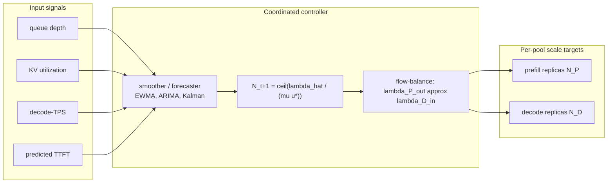

# Autoscaling, Cost, and Sustainability

**After reading this chapter, the reader will be able to:**

- Explain why CPU- and request-rate-based horizontal autoscaling fails for LLM serving, derive the control-loop replica formula from a smoothed token-arrival rate against per-replica goodput, and identify the production-correct signals (queue depth, KV-cache utilization, decode-TPS, predicted TTFT).
- Read the canonical autoscaling lineage from HPA-on-CPU through HeteroScale's decode-TPS coordination, llm-d's predicted-latency scoring, Aegaeon's token-granularity model multiplexing, and KServe / Knative scale-to-zero with activator-based cold start, plus the multi-SLO autoscalers (AdaServe, PolyServe).
- Reason about cost and sustainability at gigawatt scale: define energy-per-token from accelerator power and token throughput, locate the metric in the EuroMLSys'25 / GreenLLM / CCWise lineage, and explain the per-tenant accounting and shared-KV attribution problems that gateway-layer cost meters cannot fully resolve.

The previous chapter on routers and gateways ([see §50/01-router-gateway](01-router-gateway.md)) treated traffic as a fixed pool to be steered. This chapter takes the inverse view: the pool itself must grow and shrink, the wrong signals will steer it badly, and at gigawatt facility scale the *energy* of each token competes with the dollar cost of each GPU-hour as the binding economic constraint.

## 1. Why HPA-on-CPU is the wrong default

Kubernetes' Horizontal Pod Autoscaler defaults to CPU utilization as the scaling signal, and the surrounding ecosystem has long since added requests-per-second (RPS) and custom metrics. Both defaults are systematically wrong for LLM serving for the same underlying reason: **the bottleneck resource on an LLM replica is neither CPU nor request-count.**

A decode replica on H100 spends its time in three regimes — Tensor Cores stalled on HBM reads, KV-cache memory pressure capping batch growth, and SM occupancy bounded by per-token attention work. CPU on the host is idle by design; the GPU process is one Python thread driving CUDA kernels. RPS conflates short and long requests: one 32k-token prompt costs ~100× a 256-token chat turn in compute, KV bytes, and decode steps. Scaling on RPS at constant request-mix happens to track load; scaling on RPS across a regime shift (a long-context surge, a reasoning-mode toggle) does not.

The first-order failure mode is invisibility. A pool can be at 100% goodput-saturated (all replicas dropping requests on KV-cache-full or SLO-violating TTFT) while the HPA reports 30% CPU and refuses to scale. The second-order failure is oscillation: scaling on a noisy signal that does not predict load (CPU sampled in 15s windows, missing prefill bursts) produces flap-cycles that cost more than the load they chase. The third-order failure is *signal saturation under disaggregation*: ByteDance's HeteroScale work [HeteroScale] is the empirical landmark here. On a P/D-disaggregated decode pool ([see §20/02-prefill-decode-disagg](../20-distributed-inference/02-prefill-decode-disagg.md)), GPU utilization itself becomes misleading — KV memory pressure pegs the SM-busy counter at near-100% regardless of whether the pool is at saturating throughput or starved on token output. HeteroScale measured this across tens of thousands of production GPUs and reported +26.6 percentage points average GPU utilization after switching to decode-tokens-per-second as the primary signal; the absolute numbers are vendor-supplied and reflect ByteDance's specific traffic mix, but the qualitative claim that decode-GPU-util is a saturated and uninformative signal is robust across follow-up work.

## 2. Correct signals: queue depth, KV utilization, decode-TPS, predicted TTFT

The production-defensible signals fall into four families, each with a distinct semantics.

**Queue depth.** Pending requests at the router or scheduler is the cleanest leading indicator: it integrates arrival rate against service rate without modelling either. Queue depth above a threshold for $\tau$ seconds triggers scale-up; queue depth below another threshold for a longer $\tau$ triggers scale-down, with hysteresis to prevent flap. The weakness is that queue depth is a *trailing* signal of overload — by the time the queue is non-empty, TTFT has already missed SLO. Production routers (llm-d, AIBrix, Dynamo) all expose queue depth but rarely use it as the primary scaling signal.

**KV-cache utilization.** The fraction of KV blocks in use across the pool is the binding capacity signal for decode replicas: once KV is full, no new requests admit regardless of compute headroom. AIBrix's APA autoscaler reads KV-cache-usage % as a primary signal; vLLM exposes `gpu_cache_usage_perc` natively; SGLang publishes block-occupancy metrics. The threshold is empirical (typically 70–85% — leaving headroom for in-flight prefill that has not yet allocated its KV) and load-mix-dependent.

**Decode-TPS (HeteroScale).** Tokens generated per second per replica is the throughput signal that survives KV-pressure saturation. It moves with actual goodput rather than with utilization-of-saturated-resource. HeteroScale's contribution is to operationalize decode-TPS as the **coordinated** signal across a P/D-disaggregated pool: prefill replicas are scaled against TTFT-budget-violation rate, decode replicas against decode-TPS-vs-target, and a flow-balance constraint ties the two pool sizes so neither runs ahead of the other. Without coordination, scaling prefill alone produces a queue at the KV-transfer step; scaling decode alone produces idle replicas waiting for prefill to feed them.

**Predicted TTFT / latency.** llm-d's predicted-latency scorer is the published reference for latency-prediction-as-control-signal. A small online regression (or the slot-and-token-count model from the routing chapter) projects what TTFT a new request would receive at the current pool configuration; aggregate predicted-TTFT-violation-rate becomes the scale-up trigger. Reported MAPE on llm-d's predictor is approximately 5% on internal traces — useful precision for thresholding, though an internal number that should be reproduced on operator workloads. The advantage over queue depth is that TTFT-prediction is a *leading* signal: it fires before SLO is missed.

In practice, production autoscalers compose these. A typical configuration: predicted-TTFT-violation-rate as the leading scale-up trigger, decode-TPS-vs-target as the steady-state controller, KV-utilization as a hard ceiling that can fire emergency scale-up regardless of other signals, queue-depth as a sanity check.

## 3. The autoscaling control loop

The replica count update for a single pool tracks the simplest queueing identity. Let $\lambda^{(t)}$ be the arrival rate of work units (decode tokens for the decode pool, prompt tokens for the prefill pool) at time $t$, $\hat{\lambda}^{(t)}$ a smoothed estimate (exponential weighted moving average over a window of seconds to a minute), $\mu$ the per-replica sustainable throughput at the SLO target, and $u^\star$ a target utilization (typically 0.6–0.8 to leave headroom for traffic variance). The replica count update is

$$
N^{(t+1)} = \left\lceil \frac{\hat{\lambda}^{(t)}}{\mu \cdot u^\star} \right\rceil
$$

Two engineering details turn this into a stable controller. **Hysteresis** uses different thresholds for scale-up and scale-down — for example, scale up when $\hat{\lambda}^{(t)} / (\mu N^{(t)}) > 0.85$ for $\tau_{\text{up}}$ seconds, scale down only when the ratio falls below 0.55 for $\tau_{\text{down}}$ seconds with $\tau_{\text{down}} \gg \tau_{\text{up}}$ (typically 30s up vs. 5–15 minutes down). The asymmetry reflects an asymmetric cost model: under-provisioning drops requests immediately; over-provisioning wastes GPU-minutes. **Smoothing** prevents response to per-iteration noise. EWMA with half-life on the order of the autoscaler control period is standard; some production stacks (Dynamo's Planner) plug in heavier predictors — ARIMA, Kalman filters, Prophet — to project $\hat{\lambda}^{(t+\Delta)}$ forward by the cold-start latency $\Delta$ so that scale-up completes before load arrives.

For P/D-disaggregated pools, the formula generalizes to two coupled controllers — one for $N_P$ on prefill-token rate, one for $N_D$ on decode-TPS — with a flow-balance constraint enforcing that prefill output rate equals decode input rate within a tolerance band. Independent controllers can violate flow balance during transients, producing KV-transfer queueing or decode starvation; HeteroScale and TokenScale [TokenScale] are the public references for coordinated P/D scaling. TokenScale extends the framework with "Convertible Decoders" — replicas that can absorb prefill bursts on demand — generalizing the discrete pool-size choice into a continuous resource allocation.

## 4. P/D-disaggregated autoscaling in production

HeteroScale's published architecture is a useful concrete instance. The autoscaler runs three loops at different cadences: a fast loop (seconds) updating decode-TPS estimates and triggering KV-utilization-emergency scale-up; a control loop (tens of seconds) running the replica formula above with hysteresis; and a slow loop (minutes) re-balancing the prefill-decode ratio against a target ratio derived from the resource-ratio formula in [§20/02-prefill-decode-disagg](../20-distributed-inference/02-prefill-decode-disagg.md). Empirical thresholds in HeteroScale's deployment: scale up when decode-TPS-vs-SLO-target ratio drops below 0.85 for 30s, scale down when it exceeds 1.4 for 10 minutes, with the ratio measured against a per-model-and-context-length SLO table.

NVIDIA Dynamo's Planner [Dynamo-Planner] takes a different shape: correction factors $\text{prefill\_correction} = \text{actual\_ttft} / \text{expected\_ttft}$ and $\text{decode\_correction} = \text{actual\_itl} / \text{expected\_itl}$ feed a load predictor (configurable: Constant, ARIMA, Kalman, Prophet) which writes targets to a Kubernetes `DynamoGraphDeploymentScalingAdapter` exposing the standard `scale` subresource. AIBrix's APA layers a fluctuation-tolerance band on top of utilization-based scaling with KV-cache-usage % as primary input. llm-d's WVA (Workload-aware Variant Autoscaler) targets multi-variant deployments where the same model runs on heterogeneous GPU types under a configurable cost-vs-latency tradeoff, picking *which tier* to scale rather than only how many replicas.

The three orchestrators converge on three properties: decode-TPS or token-velocity as the steady-state primary signal, per-pool independent scaling with explicit flow-balance enforcement, and hysteresis against bursty traffic. They diverge on prediction horizon, the multi-tier-vs-single-tier scaling target, and the choice of forecasting model.

## 5. Token-granularity model multiplexing

Replica-count autoscaling assumes the model identity is fixed per replica. Multi-tenant GPU pools serve dozens to hundreds of model variants ([see §40/02-multi-model-and-gpu-sharing](../40-multi-tenant/02-multi-model-and-gpu-sharing.md)), and per-model autoscaling at request-granularity wastes GPUs on idle variants. **Aegaeon** [Aegaeon] (Alibaba, SOSP'25) generalizes the autoscaling axis from "how many replicas" to "which model on each replica at each moment," operating at *token granularity*.

The mechanism: each GPU holds one active model's weights and KV at any token-step, but the pool can swap model weights between consecutive tokens. The swap cost (load weights from CPU/SSD to HBM, warm KV, refresh CUDA graphs) is amortized over a burst of generated tokens. The amortization condition is roughly that per-token swap-amortized cost stays below per-token compute cost: if $C_{\text{swap}}$ is the swap cost and $T_{\text{burst}}$ the number of tokens generated before the next swap, the model-swap is profitable when $C_{\text{swap}} / T_{\text{burst}} < \text{slack in token-latency budget}$. Aegaeon reports running up to 7 models concurrently on a single GPU and reducing a 1192-GPU production deployment to 213 GPUs serving the same workload. The numbers are vendor-supplied; the architectural claim that token-granularity multiplexing is a viable axis distinct from request-granularity routing is the durable contribution.

The two-line sibling references: **MuxServe** sketched the same idea earlier with multiplexed inference at request granularity. **SwiftLLM** and **DistServe-Multi** extend the model-swap-amortization framework to disaggregated pools where prefill and decode can hold different models. Token-granularity multiplexing competes with — and partly subsumes — fine-grained autoscaling for the long-tail-of-models problem.

## 6. Scale-to-zero and the activator pattern

Production multi-tenant LLM platforms host long tails of models with sporadic traffic — fine-tuned variants, customer-specific adapters, dev/staging deployments. Keeping a single replica warm per variant is wasteful at the long tail; **scale-to-zero** allows the replica count to drop to zero at idle, with the next request triggering cold-start. The challenge is that LLM cold-start is dominated by *weight loading*: a 70B model in BF16 is ~140 GB to read from object storage to HBM, taking tens of seconds even at high-bandwidth interconnects. Cold TTFT in the tens-of-seconds is unacceptable for interactive workloads.

The **activator pattern**, inherited from Knative, decouples the cold-start path. A persistent low-resource activator process holds the request queue and triggers replica creation; once the replica is ready, the activator forwards queued requests and deactivates itself. KServe's `LLMInferenceService` (v0.16+) uses Knative-backed scale-to-zero with this pattern; llm-d 0.5 ships activator-based scale-to-zero as a first-class feature.

Cold-start mitigation for LLMs falls into three families:

- **Streaming weight load.** Load weights layer-by-layer and begin prefill on the partially-loaded model, hiding load latency behind compute. Production: Fluid's [Fluid] fast model loading reports order-of-magnitude reductions vs. naive sequential load; the technique requires layer-aligned I/O and careful kernel scheduling.
- **Tiered weight caching.** Hot weights stay in CPU RAM, warm weights on local NVMe, cold weights in object storage (S3, GCS). Activation pulls from the warmest tier present. AIBrix's distributed model cache and Mooncake's KVStore generalize this beyond weights to KV state.
- **Replica warm-pool.** Keep a small fixed pool of "loaded but idle" replicas across the most-used models, paying GPU-minutes against cold-TTFT-tail. The pool size is the controller's free parameter, typically tuned against a P99 cold-start SLO.

The composition in production: KServe / llm-d run activator-mediated scale-to-zero with Fluid-class fast loaders and tiered caches; cold TTFT for a 70B-class model is reported in the 5–15s range at the platform layer, an order of magnitude better than naive load but still well above the millisecond TTFT of a warm replica. Scale-to-zero is appropriate for traffic patterns with idle periods that materially exceed cold-start latency; for steady traffic it loses to a minimum-replica floor.

## 7. Multi-SLO autoscaling

A single SLO target collapses the autoscaling problem to one dimension. Real platforms host requests from multiple latency-class tenants — interactive chat at strict TTFT, batch analytics at loose ITL, agentic loops with no human-facing latency at all. Multi-SLO autoscaling addresses this directly.

**AdaServe** [AdaServe] (EuroSys'26, arXiv:2501.12162) treats the per-request tolerance as input to scheduling rather than as a global pool target. Each request carries its SLO tier; the scheduler computes a per-request **speculation tree depth** ([see §10/05-speculative-decoding](../10-engine-core/05-speculative-decoding.md)) tuned against the tier — looser SLOs get deeper trees (more verification work, more accepted tokens per step), tighter SLOs get shallower trees (more iterations, lower per-step latency). AdaServe reports 4.3× SLO-violation reduction vs. tier-agnostic scheduling on mixed-SLO traffic; the contribution is that SLO-awareness can be pushed down into the kernel-level work allocation rather than only into admission control.

**PolyServe** [PolyServe] (arXiv:2507.17769) takes the routing angle: route requests to the highest-loaded replica that still attains the request's SLO. The mechanism creates an explicit load gradient across replicas — some run hot at the SLO ceiling, others run cool with headroom — which gives the autoscaler a clean step function: when even the hottest replica violates SLO, the autoscaler scales up. The contrast with uniform load-balancing is sharp: uniform balancing produces a flat utilization profile that gives the autoscaler no signal until *every* replica violates simultaneously. PolyServe-style gradient-routing is now in production at several gateway-layer routers as an opt-in scoring mode.

The two systems are complementary axes: AdaServe reshapes per-request work, PolyServe reshapes per-replica load. Production multi-SLO stacks combine both with the hierarchical-SLO router patterns from [§40/03-fairness-slo-routing](../40-multi-tenant/03-fairness-slo-routing.md).

## 8. Energy-per-token: the gigawatt-scale economic constraint

For GPU-cost-optimization at single-cluster scale, $/GPU-hour is the right ledger. At gigawatt facility scale, it ceases to be. xAI's Colossus 2 is reported at 2 GW total facility power, OpenAI's Stargate at >7 GW planned, Meta's Hyperion at 5 GW planned. Industry estimates put facility capex per GW in the range of ~$29B (vendor-supplied estimates from datacenter-buildout press; the absolute dollar figure is volatile and should be read as order-of-magnitude). At this scale, the binding constraint shifts from "do we have enough GPUs" to "do we have enough power" — and within the power envelope, the binding economic question becomes how many tokens of useful work each joule produces.

The metric is **energy-per-token**. For a deployment with accelerator power $P_{\text{accel}}$ (watts, summed across all GPUs in the serving pool) and aggregate token throughput $\Theta$ (tokens/second across the pool):

$$
E_{\text{tok}} = \frac{P_{\text{accel}}}{\Theta} \quad [\text{J/token}]
$$

The accelerator-power-only form is the *device-level* energy. The full operational form adds host CPU, networking, storage, cooling overhead (PUE), and embodied carbon of the hardware amortized over its lifetime. Vendor spec-sheet reasoning starts from peak FLOPS-per-watt: GB200 NVL72 at ~120 kW for 1.4 EFLOPS FP4 yields ~12 TFLOPS/W as a peak number; actual deployed energy-per-token depends on utilization, model architecture, batch size, context length, quantization, and prefill/decode mix. The peak number is a ceiling, often 5–10× above measured energy-per-token in production; reproducing the metric on operator workloads is essential.

**Advocating Energy-per-Token** [EnergyPerToken] (EuroMLSys'25, arXiv:2506.05811) makes the formal case for energy-per-token as a first-class operational reporting metric — alongside TTFT, ITL, and throughput. The argument: optimizing for FLOPs-per-watt or for $/GPU-hour produces a different deployment than optimizing for J/token, and at gigawatt scale only the J/token optimization tracks the binding cost. The paper proposes standardized measurement methodology (workload-aligned, batch-aware, end-to-end including idle-pool overhead) and argues that platform-level reporting should expose energy-per-token alongside latency SLOs. As of 2026 the metric is not standardized in vendor reporting and is rarely exposed at the gateway layer; the EuroMLSys'25 framing is the canonical reference for treating it as such.

**How Hungry is AI** [HowHungryAI] surveys LLM energy use at deployment scale and is the canonical "how big is the problem" reference; the contribution is empirical measurement across model classes and serving regimes rather than a new technique. The survey number worth quoting is order-of-magnitude: per-query energy spans roughly two orders of magnitude across the small-chat-to-frontier-reasoning spectrum, with the tail dominated by long-context and agentic workloads where token counts run into the hundreds of thousands.

The implication for autoscaling and routing is direct. At gigawatt scale, the autoscaler's objective function should include J/token as a first-class term, not only $/GPU-hour. A pool that runs at higher utilization with slightly worse $/GPU-hour but materially better J/token (because idle-pool overhead is amortized over more tokens) is the right answer; a token-multiplexing policy (Aegaeon) that improves J/token by raising effective utilization is in the same family. Energy-per-token is also the metric that connects software-side autoscaling decisions to facility-level power budgeting.

## 9. Carbon-aware routing

Energy-per-token measures *how much* energy each token costs; carbon-aware routing addresses *what kind* of energy. Datacenter electricity carbon intensity varies across regions (hydroelectric vs. coal grids), across times of day (solar peaks vs. evening peaks), and across hardware generations (GB200 J/token differs from H100 J/token at the same workload). **GreenLLM** [GreenLLM] formalizes carbon-aware disaggregated serving on heterogeneous GPU pools: prefill replicas land on lower-carbon regions or generations, decode replicas on regions where decode-bandwidth-per-watt favours the local hardware mix, and the router shifts load across regions in response to grid carbon intensity signals. **CCWise** [CCWise] develops a carbon-aware serving framework with explicit grid-intensity inputs and a control loop that trades latency-SLO slack against carbon-intensity reductions when slack is available.

The mechanism in both systems is a multi-region router with a carbon-intensity input feed (per-region grid CO2/kWh, typically updated at 5-minute granularity from grid operators) and a routing scoring function of the form

$$
\text{score}(r, \text{region}) = w_{\text{lat}} \cdot \widehat{\text{latency}}(r, \text{region}) + w_{\text{carb}} \cdot E_{\text{tok}}(\text{region}) \cdot I_{\text{CO2}}(\text{region})
$$

where $I_{\text{CO2}}(\text{region})$ is the current carbon intensity. The weights $w_{\text{lat}}$ and $w_{\text{carb}}$ encode the operator's tradeoff. A latency-strict request runs at $w_{\text{carb}} \to 0$; a batch-tier request can take $w_{\text{carb}}$ much larger, willingly accepting cross-region routing to lower-carbon regions when SLO slack permits.

Carbon-aware routing reported gains are 10–30% carbon-intensity reductions at modest latency cost in published evaluations, with the qualifier that they depend on the available regional and temporal grid-intensity variance — operators in single-region or homogeneous-grid deployments have less room to optimize. The framework is operationally useful at the scale where multi-region deployment is already in place; it does not justify multi-region deployment on its own.

## 10. Cost and per-tenant accounting

Per-tenant cost accounting in LLM serving is conceptually simple at the gateway and operationally hard underneath. The simple model: each request carries a tenant identity (header, virtual key); the gateway records input and output token counts at request completion; the bill is $\text{tokens} \times \text{model-pricing}$. **LiteLLM**, **Portkey**, and **Helicone** all implement this gateway-layer pattern: virtual API keys with per-key spend tracking, tenant-metadata propagation through to logging, per-tenant dashboards. In a single-model, no-shared-cache deployment this is the entire problem.

Two complications break the simple model in production.

**Shared KV cache and marginal-cost attribution.** Prefix caching ([see §10/07-prompt-prefix-caching](../10-engine-core/07-prompt-prefix-caching.md)) and cluster-scale KV stores (Mooncake KVStore, LMCache) make the marginal cost of a request depend on what *other tenants* have already cached. A request whose prompt shares a long prefix with another tenant's recent traffic incurs near-zero prefill cost; the same request to a cold cache pays the full prefill. Naive token-count billing treats both as identical. Cache-aware billing — bill only for the prefill tokens that actually compute, refund the cached suffix — is technically possible but introduces a coupling problem: tenant A's bill now depends on tenant B's traffic. Resolving this is an open problem in 2026; production stacks fall into three categories: ignore (bill flat per token, absorb cache benefit as platform margin), pass through (bill cache-discounted rates and accept the cross-tenant coupling), and shadow-bill (bill flat but expose cache-savings to tenants in dashboards as a non-billable line). No category dominates as standard practice.

**Disaggregation and per-pool resource attribution.** Under P/D-disaggregation, a request consumes prefill-pool GPU-seconds and decode-pool GPU-seconds independently; under intra-GPU disaggregation (Nexus, [§20/02-prefill-decode-disagg](../20-distributed-inference/02-prefill-decode-disagg.md)) the per-request resource attribution becomes a per-SM accounting problem. Production stacks generally handle this by aggregating to per-token cost at the gateway and not pushing the resource breakdown through to billing — the per-pool details stay internal to platform finance.

Operationally, the pattern that has converged in 2026 is: gateway-layer metering with virtual keys and per-tenant metadata propagation, completion-time billing on token counts, cache benefits absorbed at the platform unless the tenant contracts otherwise, and per-pool resource attribution kept out of the tenant-facing billing path. The open frontier is shared-KV cost attribution and cross-tenant cache-benefit pricing; no production reference architecture has solved it as of early 2026.

## Current production state

By mid-2026, the production autoscaling stack for high-traffic LLM serving is decode-TPS-or-token-velocity-driven, P/D-coordinated, hysteresis-stabilized, and integrated with a gateway-layer metering plane for per-tenant billing. ByteDance's HeteroScale runs at tens of thousands of disaggregated GPUs across multiple internal workloads with reported +26.6 pp average GPU utilization vs. utilization-based scaling; NVIDIA Dynamo's Planner ships with multi-predictor support (Constant / ARIMA / Kalman / Prophet) and per-pool independent scaling against TTFT and ITL targets; AIBrix's APA reads KV-cache-usage % with a fluctuation-tolerance band; llm-d's WVA targets multi-variant deployments with explicit cost-vs-latency tradeoff. Token-granularity multiplexing via Aegaeon-class systems has moved from research to deployment in long-tail-model platforms (vendor-reported 1192-to-213 GPU reductions; the absolute number is workload-specific). KServe `LLMInferenceService` and llm-d 0.5 ship activator-based scale-to-zero with Fluid-class fast loaders; reported cold TTFT in the 5–15s range for 70B-class models is platform-specific and excludes the long tail of distribution-storage stalls.

The energy-per-token framing has moved from EuroMLSys'25 advocacy to operational metric on the autoscaling roadmap of the major orchestrators, but is not yet standardized in vendor reporting and is rarely exposed at the gateway plane. Carbon-aware routing (GreenLLM, CCWise) is deployed in multi-region operators that already had multi-region routing for latency reasons; it is not yet a default feature in single-region or homogeneous-grid deployments. At the gigawatt scale that frontier deployments are entering — Colossus 2 at 2 GW, Stargate at >7 GW planned, Hyperion at 5 GW planned — the binding constraint visibly shifts from $/GPU-hour to J/token, and the autoscaling and routing optimizations that improve effective utilization (token multiplexing, predicted-latency routing, P/D coordination) are simultaneously the optimizations that improve energy-per-token.

Per-tenant cost accounting at the gateway layer (LiteLLM, Portkey, Helicone) is mature for the simple token-count-times-pricing case and operationally fragile for shared-KV and disaggregated-pool attribution. Shared-prefix-cache cost attribution is the open problem that has not converged on a standard production solution; the three patterns in current use (absorb, pass-through, shadow-bill) reflect different operator philosophies rather than a settled technical answer. Autoscaling, cost, and sustainability now form one coupled system at frontier scale: the same control loop that picks replica counts also determines per-token energy cost, per-tenant economic cost, and per-region carbon cost, and operators that treat them independently leave the largest optimization wins on the table.
