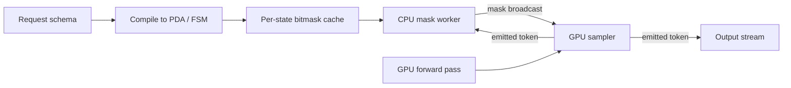

# Structured Output and Tool Calling

**After reading this chapter, the reader will be able to:**

- Explain the 99%/1% mask split that makes grammar-constrained decoding effectively free at H100/B200 decode latencies, and trace the production lineage from Outlines (FSM) through llama.cpp grammars, lm-format-enforcer, and guidance to today's de-facto defaults — XGrammar and llguidance.
- Describe how serving engines (vLLM, SGLang, TensorRT-LLM) integrate constrained decoding off the GPU critical path, including the dedicated CPU mask worker pattern, jump-forward / coalescence for multi-token determinism, and the coverage-vs-timeout trade-offs surfaced by recent benchmarks.
- Treat tool calling as a thin convention on top of schema-constrained JSON generation, place provider features (OpenAI Structured Outputs, Anthropic Structured Outputs / Tool Search Tool / Programmatic Tool Calling, Llama 3.1 tool format, MCP) onto the same primitive, and reason about the open interaction between structured output and speculative decoding.

Modern serving systems must routinely emit a JSON object that validates against a caller-supplied schema, a SQL query that parses against a known dialect, or a tool call whose arguments match a tool definition. Naive sampling cannot guarantee any of these properties: the language model assigns nonzero probability to ill-formed continuations, and a single bad token (an unescaped quote, a wrong key name, a missing comma) makes the whole output unusable downstream. The classical fix — sample, parse, retry on failure — wastes tokens and breaks streaming. The modern fix is *constrained decoding*: at every step, mask the logits to the subset of vocabulary tokens that keep the partial output on a path to a valid completion. By 2026 this primitive has converged on a single architectural pattern, two dominant implementations, and a small set of trade-offs that every inference engine exposes. This chapter describes that convergence and the tool-calling layer built on top. [See §10/05-speculative-decoding](../10-engine-core/05-speculative-decoding.md) for the speculative-decoding background invoked in §9, and [§60/04-rag-infrastructure](04-rag-infrastructure.md) for the RAG-side use of schema-enforced outputs.

The historical context matters. Through 2023, "structured output" usually meant prompt engineering plus retry: ask the model to emit JSON, parse the result, and retry with an error message if parsing failed. Smaller models failed often enough that this loop was a meaningful tax on tool-calling latency. The 2024 wave of constrained-decoding libraries — Outlines, lm-format-enforcer, guidance — turned the per-token mask into a serving primitive. The 2024–2025 wave (XGrammar, llguidance) reduced the mask cost to where it is no longer a meaningful overhead at typical batch sizes. By 2026 the question has flipped: structured output is the default for tool-call paths, and post-validation retry survives only as a fallback when the schema cannot be expressed for the chosen backend.

A note on chapter scope. This chapter covers structured-output enforcement at the engine layer (mask production, sampling-time constraints, jump-forward) and the agent-layer surface that reduces to it (tool calling, MCP, Anthropic's Tool Search Tool / Programmatic Tool Calling). It does *not* cover the broader agent-orchestration question of how to design tool catalogs, plan multi-step tool sequences, or evaluate end-to-end agent quality — those are model-and-runtime questions, not infrastructure questions. The infrastructure question this chapter answers is: given a schema, how does the engine emit a string conforming to it, at what cost, and how does that compose with the rest of the inference pipeline?

## 1. The mask-based primitive: why grammar constraints work

The starting point is that a serving engine needs *exact* enforcement of a typed constraint, not a soft preference. Schema validation post hoc fails open in two ways: it wastes generated tokens that turn out to be invalid, and on streaming workloads it can return invalid prefixes to the caller before the failure is detected. Constrained decoding fails closed by construction: at every step, the only tokens the sampler can choose are tokens that keep the output on a path to a valid completion. The cost is a per-step mask computation; the benefit is a hard guarantee.

Fix a partial output sequence $x_{<t}$ and a typed grammar $G$ — a regex, a JSON schema, a CFG, or some combination. At decode step $t$ the engine must determine the set $V_t \subseteq V$ of vocabulary tokens whose appendage $x_{<t} \cdot v$ keeps the sequence on a path to a string accepted by $G$. The model produces logits $\ell_t \in \mathbb{R}^{|V|}$; the engine forms a binary mask $m_t \in \{0, 1\}^{|V|}$ with $m_t[v] = 1$ iff $v \in V_t$, and replaces $\ell_t \leftarrow \ell_t + \log m_t$ (treating $\log 0 = -\infty$). Sampling then proceeds normally on the masked logits. Because the masked distribution is the conditional of the original distribution on $V_t$, sampling is exact under the constraint, and a sequence of well-defined token choices stays inside $G$ by construction.

The "path to a valid completion" qualifier matters. A token that is locally valid (keeps the partial output well-formed *so far*) but admits no valid continuation must be excluded, otherwise the engine paints itself into a corner. The grammar's reachability relation handles this: $V_t$ is the set of $v$ such that there exists *some* string $s$ with $x_{<t} \cdot v \cdot s \in L(G)$. For deterministic grammars (like JSON schemas) reachability is decidable in linear time over the parser state; for ambiguous CFGs it requires a non-trivial check that engines either solve exactly (llguidance) or approximate with a conservative under-approximation (some XGrammar paths). Approximation in the conservative direction is safe — the engine may reject a few tokens that would have been valid — but it can degrade quality if the model's high-probability mass lands on the rejected tokens.

The engineering question is the cost of $V_t$. A naive implementation walks the grammar's parser state for every $v \in V$ each step — $O(|V|)$ parser calls at vocab size $|V| \approx 128\,000$ per token. That is the cost regime of early implementations and it is far too slow: with decode steps of 5–20 ms on an H100, even a few hundred microseconds of mask compute becomes meaningful, and on faster hardware (TPUv5p, B200 at small batch) the overhead grows.

The unlock, surfaced rigorously by [XGrammar-2024], is that for a typed grammar most tokens are *context-independent*: their validity at the next step depends only on the grammar state, not on the current token sequence below the byte level. Concretely, partition $V$ into

$$V = V_{\text{indep}} \;\sqcup\; V_{\text{dep}},$$

where $V_{\text{indep}}$ contains tokens whose acceptance under any reachable parser state is decidable from a precomputed table indexed by parser state, and $V_{\text{dep}}$ contains the residual. Empirically across JSON-schema and CFG workloads, $|V_{\text{dep}}| / |V| \approx 1\%$ — most tokens encode whitespace, common ASCII, or grammar-irrelevant byte sequences whose validity depends only on whether the parser is in a "free text" state, an "in-string" state, an "expecting punctuation" state, etc. The validity of $V_{\text{indep}}$ tokens reduces to a bitmask lookup keyed by parser state. Only the ~1% in $V_{\text{dep}}$ requires runtime parser-stack inspection, and the inspection is cheap because the candidate set is small. This is the *99%/1% split*. (The exact ratio is grammar-dependent; the qualitative claim — vast majority precomputed, small minority runtime — is robust across reported benchmarks.)

The split motivates the production architecture: precompute the per-state bitmask once at grammar-compile time (or lazily, with caching), then at each decode step intersect the active state's bitmask with a small runtime check for $V_{\text{dep}}$. XGrammar reports under 40 µs CPU per token at 128K vocab. Compared to a 5–20 ms decode step on a single H100 this is roughly 0.5% overhead — small enough to be invisible behind any reasonable scheduler, *provided* it is computed off the GPU's critical path.

The cost budget is worth fixing concretely. Let $C_{\text{mask}}$ be the per-token CPU cost of mask production and $C_{\text{decode}}$ the per-token GPU decode cost. Modern engines hide $C_{\text{mask}}$ behind $C_{\text{decode}}$ via overlap (start computing the next mask while the GPU is decoding the current step). The structured-output overhead under perfect overlap is

$$\text{overhead} = \max\!\left(0, \; \frac{C_{\text{mask}}}{C_{\text{decode}}} - 1\right).$$

For $C_{\text{mask}} = 40\,\mu s$ and $C_{\text{decode}} = 10\,\text{ms}$ on H100, overhead is zero up to overlap precision. On a TPU pod with $C_{\text{decode}} \approx 1\,\text{ms}$ per token, $C_{\text{mask}}$ becomes 4% of the budget and engine-side pipelining matters. On B200 at small batch, decode steps fall further; the cost ratio tightens correspondingly. The architectural takeaway is that off-GPU mask compute is mandatory in the current regime and becomes more so as decode latency falls.

## 2. Lineage: Outlines → llama.cpp → LMFE → guidance / llguidance

The 2023 wave of constrained-decoding libraries established the engineering vocabulary that XGrammar then accelerated.

**[Outlines-2023]** (W. Willard, R. Louf, .txt; arXiv 2307.09702) was the first widely deployed FSM-based constrained decoder. The core idea is to compile a regex or JSON schema into a finite-state machine over the *byte alphabet*, then build a token-level transition table mapping (FSM state, token) $\to$ (FSM state or reject) by matching each token's byte sequence against the FSM. At decode time the engine walks the FSM by token, using the precomputed mask. Outlines drove the industry shift to "regex / JSON-schema as a serving primitive" and remains the integration of choice when XGrammar fails on a complex grammar. The contribution is conceptual as much as technical: Outlines made schema constraints a first-class request-level option instead of a downstream validation pass, which is how every modern serving API exposes them.

**llama.cpp grammars (GBNF)** introduced grammar-constrained decoding for local CPU inference. The grammar format is a CFG variant with the inclusion-friendly properties that caching and incremental parsing rely on. GBNF made CFG-based constraints commonplace beyond regex/JSON, particularly for SQL, structured DSLs, and programming-language outputs. Production engines borrowed the CFG semantics; the GBNF format itself remained niche. The wider lesson, for the lineage, is that grammar-constrained decoding became viable on CPU inference *before* it was a default feature on GPU servers — local-inference users were the early demand signal.

**[LMFE-2023]** (lm-format-enforcer, N. Gat) integrated token-mask-per-step as a standard logits-processor plug-in for HuggingFace Transformers and early vLLM. It established the API pattern — a per-request grammar object, a per-step `process_logits(state, logits)` callable — that every engine still exposes, even after replacing the underlying engine. The plugin pattern's longevity is a useful piece of infrastructure history: an API shape that originated to solve a 2023 integration problem persists in 2026 engines because it is the natural seam between sampling and schema enforcement, regardless of how the schema enforcement is implemented underneath.

**[Guidance-2023]** (Microsoft) introduced the "guidance program" abstraction: a templated DSL where some segments are model-generated (under constraints) and others are literal text the engine inserts directly. The literal-insertion idea anticipates jump-forward (§5). guidance evolved into **llguidance** (2024–2025), a Rust core targeting ~50 µs CPU per token at 128K vocab — within the same order of magnitude as XGrammar, with stronger CFG coverage (see §4). llguidance is the default in some Microsoft and Azure deployments and the fallback in vLLM when XGrammar declines a grammar. The Rust implementation choice is not incidental: at the per-token cost levels these libraries operate in, garbage-collected language overhead (Python interpreter dispatch, allocation churn) becomes significant, and Rust gives both predictable latency and easy multi-threading for parallel mask broadcast.

The lineage shows two concurrent design pressures that XGrammar resolves: lower per-token cost (Outlines $\to$ XGrammar/llguidance) and broader grammar coverage (regex $\to$ JSON-schema $\to$ CFG). The current production answer keeps the FSM/PDA representation but adds aggressive bitmask precomputation and CPU-side parallelism.

A representational subtlety threads through the lineage. Regex and JSON-schema reduce naturally to FSMs; deeper CFGs require a pushdown automaton (PDA) because they admit unbounded nesting (matched braces, recursive structures). Outlines's pure-FSM core handles the regex and JSON cases efficiently but cannot represent context-free recursion without unrolling. llama.cpp's GBNF and guidance/llguidance use stack-based parsers that handle the PDA case directly. XGrammar bridges both, compiling JSON schema and regex through an FSM fast path and CFGs through a PDA with bitmask precomputation per stack-top symbol. The choice of representation determines what the precomputed bitmask is keyed on; the engineering goal of precomputing $V_{\text{indep}}$ is the same.

Strictly speaking, JSON schema sits in between regex and full CFG: it has nesting (objects within objects), so an FSM-only representation requires bounding the nesting depth at compile time, but it does not need full context-free recursion since the schema itself is finite. Outlines handles this by unrolling the schema into an FSM up to the structural depth bound; this works for typical schemas but fails on schemas with `$ref` self-references (recursive types). XGrammar's PDA handles self-references natively. The practical asymmetry is that most production schemas are non-recursive and FSM-friendly — typed tool definitions, RAG response schemas — but the long tail of recursive schemas (tree structures, nested AST representations) requires the PDA path.

A compact summary of the lineage:

| Library | Year | Core representation | Coverage | Per-token cost | Status |
|---|---|---|---|---|---|
| Outlines | 2023 | byte-FSM + token table | regex, JSON schema | medium | active; XGrammar fallback in vLLM |
| llama.cpp grammars (GBNF) | 2023 | CFG via stack parser | CFG | CPU-bound | local/edge inference |
| LMFE | 2023 | logits processor wrapper | mixed | medium | superseded |
| guidance | 2023 | guidance-program DSL | CFG-flavoured | medium | superseded by llguidance |
| llguidance | 2024–2025 | Rust PDA core | broad CFG | ~50 µs / token | default in some Microsoft/Azure paths |
| XGrammar | 2024 (MLSys 2025) | PDA + bitmask precompute | regex, JSON, CFG (with timeouts) | <40 µs / token | de-facto default in vLLM, SGLang, TRT-LLM, MLC-LLM |

## 3. XGrammar deep-dive

[XGrammar-2024] (Dong, Ruan, Cai, Lai, Xu, Zhao, Chen — CMU/MLC, NVIDIA, SJTU, Berkeley; MLSys 2025; arXiv 2411.15100) is the de-facto default backend in vLLM, SGLang, TensorRT-LLM, and MLC-LLM. It reports up to 14× JSON-schema speedup and up to 80–100× CFG speedup over prior constrained decoders. Two architectural choices drive the headline numbers.

**Bitmask precomputation, applied aggressively.** XGrammar compiles a grammar to a pushdown automaton (PDA) and, for every reachable PDA state, materializes a bitmask of size $|V|/8$ bytes (16 KB at 128K vocab) marking which vocabulary tokens are admissible. Tokens whose admissibility depends only on the *top* of the PDA stack (the 99% indep set) are decided by the bitmask alone; tokens whose admissibility depends on deeper stack contents (the 1% dep set) trigger a runtime check using a per-state stack-context cache. The compile step is amortized: a typical JSON schema compiles in tens of milliseconds and then serves an entire request stream.

**CPU worker, off the critical path.** The decisive engineering choice is that mask computation runs on a dedicated CPU worker thread, asynchronously to the GPU forward pass. The worker computes the next step's mask from the current step's emitted token (or, in tree settings, from each candidate position) and broadcasts the resulting bitmask to GPU memory. The GPU samples against `logits + log_mask` directly, with no synchronous CPU-side parsing in the decode loop. vLLM has migrated to a single CPU process that broadcasts to all GPU workers, removing per-worker mask compute entirely [vLLM-Structured-Decoding-Blog].

The combination yields the reported per-token mask cost. With an H100 decode step at ~10 ms and mask compute at ~40 µs hidden behind the forward pass, structured-output overhead is a fraction of a percent. The *off-GPU* placement is mandatory: GPU-side mask compute would serialize against the model forward, and on hardware with sub-millisecond decode steps even a few hundred microseconds of serialized CPU work becomes a dominant overhead.

XGrammar's other contributions matter for serving correctness: incremental token-by-token state updates that survive prefix-cache reuse, support for streaming output where the schema may admit early termination, and a tokenizer-aware mask compilation that handles BPE merge-tag edge cases (the "subword alignment" issue that constrained-decoder bugs trace back to). The published numbers — 14× JSON-schema and 80–100× CFG speedup over prior work — are end-to-end serving numbers and depend on the harness, vocabulary size, and grammar; they should be read as "the same order of magnitude faster across the workloads the paper evaluates," not as a fixed multiplier. The qualitative claim — that constrained decoding has stopped being a meaningful tax on serving — is the robust takeaway.

The subword-alignment problem is worth understanding. A grammar is naturally defined over bytes (or characters), but sampling happens over tokens, where each token is a multi-byte BPE sequence. A naive token-level constraint can fail in two directions: it can mask out a token whose prefix is grammar-valid but whose suffix would force an invalid byte (false reject), or it can permit a token whose acceptance commits the engine to a byte sequence the grammar would reject in a longer view (false accept). XGrammar handles this by reasoning over (token, grammar-state) pairs at compile time, and by rejecting tokens that cross grammar-significant boundaries unless the grammar admits all possible suffix bytes. Tokenizer-specific quirks — Llama 3.x's byte-fallback rules, GPT-style merge tables, special-token handling — turn this from a clean theoretical problem into an engineering one with many edge cases.

The data-flow diagram is roughly:

The mask worker runs concurrently with the GPU forward pass; the broadcast is the only cross-process synchronization point per step. Because bitmasks are per-state rather than per-sequence, the cache is small and naturally shared across requests using the same schema — important for high-fanout workloads where many concurrent requests use the same tool definition.

## 4. llguidance and the CFG coverage trade-off

[llguidance-2024] (Microsoft / guidance-ai; Rust) takes a different point on the coverage-vs-cost frontier. Where XGrammar precomputes for fast common-case dispatch and runtime-checks the residual, llguidance leans on a more expressive parser that handles broader CFG features (lookahead, certain context-sensitive constructs) at slightly higher per-token cost — ~50 µs CPU at 128K vocab in the project's reported numbers. The trade-off pays off on grammars where XGrammar's bitmask precomputation does not fit the structure: very large CFGs (think full SQL dialects), grammars with heavy ambiguity, and grammars that cross tokenizer-merge boundaries in pathological ways.

The empirical evidence is consistent. [Generating-Structured-Outputs-Bench-2025] (arXiv 2501.10868) benchmarks Guidance, Outlines, llama.cpp, XGrammar, OpenAI, and Gemini across multiple datasets; Guidance-family approaches (which include llguidance) report the highest schema coverage (8/8 datasets at the top tier), while XGrammar covers more schemas at lower latency in the typical case but times out on a non-trivial subset. [SqueezeBits-Bench-2025] (the "Guided Decoding Performance on vLLM and SGLang" benchmark) corroborates this on production engines and explicitly motivates the fallback chain.

The serving conclusion is that production engines should not pick a single backend. vLLM's *auto-mode* selects XGrammar by default and silently falls back to Outlines or llguidance when the schema is rejected at compile time or times out at runtime; SGLang exposes the choice per request. This is the same pattern the speculative-decoding chapter notes for drafters: the best default differs from the best fallback, and the engine routes per request.

[FlexGCD-ICML2025] (arXiv 2502.05111) generalizes CFG handling for very large grammars (full code/SQL constraints), pushing the coverage frontier further; it has not yet displaced XGrammar/llguidance as a default. [IterGen-2025] (ICLR 2025) is a separate research thread that adds rollback / undo across grammar symbols using KV-cache reuse — the grammar engine influencing the cache layer rather than just the sampler. Neither has reached production-default status.

The IterGen direction is worth flagging because it points to where the next round of integration work is heading. Most current engines treat the grammar engine as a stateless logits processor: given a state, produce a mask. IterGen-style approaches treat the grammar engine as a cache participant — partial outputs that violate a higher-level invariant can be rolled back to an earlier grammar state, with the corresponding KV-cache slots reused. This makes constrained decoding *transactional*, not just per-token. It composes naturally with prefix caching ([§10/07-prompt-prefix-caching](../10-engine-core/07-prompt-prefix-caching.md)), since rollback is a small extension of the existing prefix-extend mechanism. As of early 2026 the production engines have not adopted this pattern; whether they will depends on whether the agent-orchestration layer pushes it down.

An infrastructure subtlety in the SqueezeBits results: per-engine numbers for the same backend can differ because the engine-level integration matters. XGrammar inside vLLM and XGrammar inside SGLang are running the same core but with different scheduler integration, different mask broadcast paths, and different prefix-cache interactions. Comparing constrained-decoding performance across backends therefore requires holding the engine fixed. The benchmark consequently reports per-engine matrices rather than single-number rankings.

## 5. Jump-forward and coalescence: deterministic multi-token emission

When the grammar admits exactly one continuation — e.g., the literal `"name":` after the opening brace of a JSON object whose schema has a single required field — sampling is wasted work. The engine knows the next several tokens before consulting the model. Outlines documented this optimization as **coalescence** ([Outlines-Coalescence], dottxt blog 2024) and reports up to 5× speedups on heavily structured outputs where the grammar dictates large literal stretches.

The mechanic is straightforward. After each model step the engine asks the grammar: *given the current state, is there a unique sequence of tokens of length $\ge 1$ that the grammar forces?* If yes, the engine appends those tokens to the output, advances the grammar state, and updates the KV cache as if those tokens had been generated — but *without* running the model forward pass for them. The next forward pass is run with the longer prefix already materialized. For schemas where 30–50% of output bytes are grammar-dictated literals (keys, punctuation, type tags), the savings are direct.

Two implementation subtleties matter for correctness. First, the KV cache must be extended for the coalesced tokens before the next forward pass; engines do this by treating the coalesced suffix as a small chunked-prefill segment, reusing the prefill path for KV materialization. (See [§10/03-batching-scheduling](../10-engine-core/03-batching-scheduling.md) for chunked prefill.) Second, coalescence must compose with prefix caching ([§10/07-prompt-prefix-caching](../10-engine-core/07-prompt-prefix-caching.md)): if a future request has the same schema, the literal stretches are part of the canonicalizable prefix and should hit the cache.

SGLang and XGrammar implement analogous *jump-forward decoding* paths native to the engine. The optimization is essentially free in serving terms — the engine already has the grammar state machine — and is enabled by default in current builds.

A concrete example clarifies the savings. Consider a JSON schema with three required string fields `name`, `email`, `phone`. After the model emits the opening `{`, the grammar forces `"name":"`. The first quote, the four characters `n`, `a`, `m`, `e`, the closing quote, and the colon, and the opening string-quote — eight tokens at typical BPE — are all grammar-determined. The engine appends them in one pass and resumes model decoding for the value of `name`. After the value's closing quote and the comma, the next key `"email":"` is again forced. Across a tightly schema'd output the literal stretches can account for a third or more of total bytes; coalescence converts those bytes from model-driven decode steps into pure grammar-driven appends. (The 5× peak number reported by [Outlines-Coalescence] applies to densely structured short outputs; the gain on long mixed outputs is proportionally smaller.)

A composition concern with chunked prefill ([§10/03-batching-scheduling](../10-engine-core/03-batching-scheduling.md)) is that coalesced tokens land at decode-time but are processed prefill-style for KV materialization. Schedulers that account for chunked-prefill budget separately from decode budget must recognize coalesced runs as the same kind of token-budget consumer as a fresh prefill chunk. SGLang handles this natively because its token-budget accounting is unified across prefill and decode; vLLM's V1 scheduler exposes this via `num_lookahead_tokens` shared with the speculative-decoding budget.

Coalescence also interacts with continuous-batching constraints. A request emitting a long literal stretch consumes scheduler budget that another request in the batch is not consuming, creating intra-batch heterogeneity. The pathological case is a batch where one request hits a thousand-token literal stretch (e.g., a large enum value forced by the schema) while others continue normal decode; without careful budgeting, the stretch can starve other requests of forward-pass slots. Production schedulers cap the per-step coalesced-token budget per request to bound this. The cap is a soft latency floor for any one request but preserves throughput for the batch.

An auxiliary observation on prefix caching ([§10/07-prompt-prefix-caching](../10-engine-core/07-prompt-prefix-caching.md)): coalesced literal stretches that come from a stable schema are deterministic, so multiple requests using the same schema produce identical literal byte-sequences at identical offsets. The prefix cache can therefore reuse KV-cache slots for these stretches across requests, even when the variable content differs. The savings are workload-dependent — large for high-fanout same-schema serving (a single tool definition serving millions of agent calls), small for one-off requests — but free when the cache hit lands.

## 6. Coverage and timeout trade-offs in practice

Production engines have learned that no single grammar backend solves all schemas. The [SqueezeBits-Bench-2025] study and the cross-framework [Generating-Structured-Outputs-Bench-2025] paper agree on a few practical points.

XGrammar's failure mode is *timeout*: certain CFGs with deep nesting, heavy ambiguity, or tokenizer-merge edge cases push the precomputation out of its budget, and the engine rejects the grammar at compile time. The fallback path then kicks in. llguidance's failure mode is *latency*: it accepts almost everything but at the higher per-token cost, which adds up on long structured outputs. Outlines's failure mode is *expressiveness*: pure-FSM constructs cannot represent context-sensitive constraints, and JSON schemas with complex `oneOf` / `anyOf` may compile but produce large state explosion.

A simple way to think about the trade-off space: XGrammar optimizes the median, llguidance optimizes the tail, Outlines optimizes simplicity. A serving deployment that touches a wide variety of schemas — common in multi-tenant API products — will see all three modes regularly, and the routing layer should treat backend selection as a first-class scheduling decision rather than a static config.

Empirically, the [Generating-Structured-Outputs-Bench-2025] paper benchmarks across the JSON-Mode-Eval, BFCL, Glaive-Function-Calling, BIRD, and ToolBench-style datasets, with both task accuracy and per-token latency reported. The headline observations: Guidance-family approaches lead on coverage (Guidance achieves top-tier success on 8/8 benchmarked datasets); XGrammar leads on latency for the schemas it accepts; OpenAI and Gemini's hosted APIs match OSS coverage and latency in absolute terms but with the asterisks of provider-side observability. The benchmark's own caveat — that the reported numbers are sensitive to exact engine version and grammar-compile flags — applies to any cross-engine constrained-decoding comparison.

The serving stack therefore exposes a fallback chain. vLLM's auto-mode tries XGrammar first, escalates to llguidance on rejection, and degrades to Outlines / no-constraint as last resort. SGLang's defaults are similar with explicit per-request override. The engine should also expose *grammar-compile time* as a metric: a compile that takes hundreds of milliseconds eats into TTFT for the first request, even if subsequent requests amortize.

A separate trade-off concerns *partial-output semantics* during streaming. If a grammar admits early termination (e.g., a JSON object that closes with `}`), the engine must decide whether to keep generating or stop. Schemas that prescribe a fixed shape are unambiguous; schemas that allow trailing content are not. OpenAI, Anthropic, and Gemini differ subtly in their partial-output and error-reporting semantics; cross-provider parity in capability does not imply cross-provider parity in edge-case behaviour.

A third practical concern is *schema validation at compile*. Schemas with deeply nested `oneOf` / `anyOf` branches, recursive `$ref` definitions, or pattern constraints over Unicode classes can compile to PDAs whose state count is large enough to consume gigabytes of bitmask cache. Production engines bound this with a maximum-state-count parameter and reject schemas that exceed it; the user-visible failure is a clean schema-rejection error rather than a memory blow-up at decode time. Caching compiled grammars per-schema is essential for any deployment where the same schema serves many requests.

A subtler benefit of coalescence is improved decoding stability under quantized weights. When the model is run in low-precision formats (FP8, FP4 — see [§10/04-quantization](../10-engine-core/04-quantization.md)), free-running generation can drift slightly across runs even with greedy sampling because of floating-point non-associativity in the forward pass. Coalesced tokens are *deterministic* — they come from the grammar, not the model — so a substantial fraction of the output bytes are identical across replicas and runs. For audited workflows (regulated tool calls, reproducible RAG outputs) this determinism on the structured portion of the output is a feature.

Determinism in the unstructured portion of the output requires more than coalescence: it requires reproducible kernels (no atomic non-determinism), fixed batch composition (since attention reductions are batch-order-sensitive on most kernels), and identical numeric paths across replicas. Constrained decoding does not solve any of these. What it does is bound the *surface area* over which non-determinism can manifest in the output — for a 90%-coalesced output, only the 10% of tokens that traverse the model can diverge. This is a partial answer to determinism, sufficient for many compliance use cases without solving the full problem.

A practical note on engine integration: the CPU-side mask cost depends on whether the engine pre-computes masks for all candidate tokens or only the tokens the sampler is likely to visit (top-k, top-p, temperature-shaped). Modern engines compute the full $|V|$-bit mask because the bit-vector AND with the logits is cheap on the GPU and the alternative — partial mask computation — adds a hard-to-amortize branching cost on the CPU side. Full-mask computation also composes naturally with deterministic sampling (greedy, top-1) and with the standard logits-warp pipeline.

## 7. Tool calling as schema-constrained JSON

Tool calling has converged. The pattern across providers — OpenAI Structured Outputs, Anthropic Structured Outputs (added 2025 for Sonnet 4.5 / Opus 4.1) [Anthropic-StructuredOutputs-2025], Google Gemini structured generation, Llama 3.1's tool-call format — is *the same* primitive: emit a JSON object validating against this schema, where the schema is derived from the tool definition. The differences are in convention (where the JSON appears in the output stream, how multiple tool calls are framed, what error format the API returns when the model emits text instead of a call), not in the underlying decoding constraint.

This convergence has two consequences. First, every closed-API provider's "Structured Outputs" feature is server-side schema enforcement implemented with the same family of techniques as the OSS engines (FSM/PDA precomputation, off-critical-path mask compute). Anthropic's 2025 addition was the last major closed API to ship server-side enforcement; the API surface across OpenAI, Anthropic, and Gemini is now approximately at parity. Second, *every* tool call is, mechanically, a constrained-JSON generation problem. The reported accuracy delta — [Outlines-Coalescence] cites 98% schema adherence under constrained decoding versus 76% under post-validation — translates directly to tool-call success rates, particularly for smaller models where free-form JSON generation is unreliable.

The 98% / 76% framing deserves a small disclaimer. Schema *adherence* is not the same as tool-call *correctness*: a model can emit a schema-valid JSON object whose argument values are wrong. The constraint forces the right shape; it cannot force the right contents. Constrained decoding therefore raises the floor (no malformed outputs ever reach the tool runtime) without raising the ceiling (the model still has to choose the right tool with the right arguments). Empirical practice is that the floor is the binding issue for small and mid-sized open models, where free-form JSON malformation is the dominant tool-call failure mode; for frontier models on simple schemas, the constraint is mostly a safety net. This explains the asymmetric production posture: structured-output enforcement is more eagerly deployed on smaller open models than on the largest closed ones, even though the engine-level cost is the same.

**MCP (Model Context Protocol)**, donated by Anthropic to the Linux Foundation Agentic AI Foundation in late 2025, standardizes the *tool surface* — how a tool is described, discovered, and invoked across vendors and runtimes. MCP does not change the decoding-time primitive; it standardizes what gets handed to the schema constraint. Combined with structured-output enforcement at the engine, MCP is the layer at which "tool calling" becomes a portable contract rather than a per-vendor convention. (See [§60/04-rag-infrastructure](04-rag-infrastructure.md) for MCP's role in retrieval-tool standardization.)

The cross-engine API conventions are similar enough to summarize compactly. Every major provider accepts a JSON schema (or a tool definition that contains one) and returns either a tool-call object or a structured response object containing the schema-validated payload. The differences cluster in three places: (1) whether the constraint is enforced strictly (the model cannot emit text that breaks the schema) or loosely (the model emits free text that the server post-validates and may retry); (2) whether streaming partial outputs are validated incrementally or only at completion; and (3) how the API surfaces partial-success states when the model emits multiple tool calls in one turn. OpenAI's strict mode and Anthropic's structured-output mode both enforce strictly; legacy "function calling" modes from 2023 era are loose. Production deployments should prefer the strict path everywhere it is available.

MCP's specific contribution to this picture is *tool description portability*. A tool defined under MCP carries its name, description, input schema, and output schema in a vendor-neutral form. The agent runtime that ingests an MCP tool definition feeds the input schema into the model's tool-call constraint and uses the output schema to validate the tool's response. Without MCP, every vendor's agent SDK described tools in a slightly different shape, forcing tool authors to maintain parallel definitions; with MCP, a tool is defined once and consumed across vendors. The engine-level constraint primitive does not change.

For Llama 3.1 and similar open models, the tool-call format is documented as a JSON object inside a special token sequence (e.g., `<|python_tag|>` framing for tool calls in Llama 3.1, or the role-tagged blocks in newer chat templates); constrained decoding enforces both the framing tokens and the body schema. For OSS deployments this is implemented by composing two grammar fragments: a regex/literal for the framing and a JSON schema for the arguments, intersected at compile time. Models trained with tool-call examples in the post-training mix produce well-formed JSON without constraints most of the time; the engine-level constraint is the safety net that turns "most of the time" into a hard guarantee.

Schema composition is itself an interesting design space. A tool definition typically includes typed parameters (string, number, enum, nested object), each of which expands to a JSON-schema fragment. Engines compose these into a single grammar by union/intersection/concat operations on the underlying FSMs/PDAs. The composition is closed under the FSM operations for regex-style schemas and closed under PDA operations for CFG-style schemas, but the *cost* of composition (state explosion) is grammar-dependent. A tool with many enum-valued parameters can blow up the state count exponentially in the naive product construction; XGrammar uses a lazy-product approach that materializes states only when reached, bounding memory in practice. This is a place where engine implementations differ in subtle ways that users observe only as "schema X is supported by engine A but rejected by engine B."

[GuidedDecoding-RAG-2025] (arXiv 2509.06631) makes the related point for retrieval-augmented generation: enforcing field-level schemas on RAG outputs measurably reduces hallucinated fields, because the constraint forces the model to populate exactly the fields the schema requires. The tool-calling and RAG cases share the underlying mechanic — schema-constrained JSON — and differ only in what the schema describes.

A practical observation about tool-call latency. The constraint primitive is cheap, but tool execution itself often dominates wall-clock time: a tool call that hits an external API, performs a database query, or runs a code interpreter takes orders of magnitude longer than the model's emission of the call. This shifts the optimization target. Reducing tool-call malformation from 24% to 2% (the Outlines numbers) can be a much larger latency win than shaving microseconds off the mask compute, simply because every malformed call costs a full tool-execution round-trip plus a second model invocation. Constrained decoding's value at the agent layer is dominated by *avoided retries*, not by per-token cost.

## 8. Anthropic advanced tool use: orchestration above the primitive

Two Anthropic 2025 features illustrate the agent-level layer built on top of structured-output enforcement [Anthropic-Advanced-Tool-Use-2025].

**Tool Search Tool** addresses the case where the agent has access to many tools (hundreds to thousands) and listing them all in the prompt is prohibitive in context-window terms. The provider exposes a meta-tool that the model invokes to *search* for the right tool by description; the agent runtime then resolves the matched tool definitions, injects them into the working context, and continues. From the engine's perspective this is still constrained JSON generation — the meta-tool's invocation is itself schema-constrained — but the orchestration is at the agent layer, not the decoding layer.

**Programmatic Tool Calling** lets the model emit a *program* that orchestrates tool calls (loops, conditionals, data flow between tools) instead of issuing one call at a time and round-tripping through the model. The output is itself a constrained DSL with its own schema. The engine sees nothing different: the schema is more elaborate, but the constrained-decoding primitive applies unchanged. The win is reduced model invocations and tighter agent loops; the cost is a more complex grammar to validate.

These features show how the agent surface is moving up. The engine-level primitive — schema-constrained JSON — is settled. The interesting design space is what schemas the agent runtime defines on top.

The infrastructure consequence is that agent runtimes are becoming opinionated about *which* schemas to emit. A naive runtime emits one tool call per turn; a more sophisticated runtime emits a small program that batches several calls together (Programmatic Tool Calling), reducing context regrowth and round-trip count. Both run on the same engine-level primitive. The performance ceiling for agent serving is set by how aggressively the runtime can compress turns into structured emissions, not by the cost of the structured emission itself.

Tool Search Tool's serving impact is quieter but real. The pattern of "one search call followed by one tool call" doubles the model invocations per turn relative to "list all tools in the system prompt." The trade-off favours search when the tool catalog is large enough that listing it would consume tens of thousands of context tokens, since context cost is paid per turn while the search overhead is paid once per turn. Estimates vary by deployment, but rough rules of thumb in production: list-all is preferred up to ~20–30 tools; tool-search becomes preferable beyond ~100 tools; the band in between is workload-dependent. The agent runtime should expose this as a configurable knob rather than a hardcoded choice.

A note on engine integration paths. In **vLLM**, the constrained-decoding hook lives at the sampling layer (`vllm/v1/sample/`) with backend selection in the engine config; the dedicated CPU mask process is launched alongside the engine workers and broadcasts via shared memory. **SGLang** integrates structured output more deeply into its scheduler, since its RadixAttention prefix cache and structured-program execution model already track per-request grammar state. **TensorRT-LLM**'s integration uses a logits-processor abstraction that calls into XGrammar's C++ bindings, with mask staging in pinned host memory. The implementations differ but the data-flow shape — CPU-side mask production, GPU-side masked sampling — is identical.

A multi-tenant consideration deserves mention. When many concurrent requests use the same schema (a common pattern for tool-calling agents serving the same fleet of tools), the per-state bitmask cache should be shared across requests. XGrammar's compile output is keyed by schema identity, so a content hash of the schema is enough to deduplicate. Engines that do this see compile cost amortize over the request stream; engines that do not see a small but real first-request latency tax for every schema. The accounting is similar to the prompt-cache hit/miss distinction at [§10/07-prompt-prefix-caching](../10-engine-core/07-prompt-prefix-caching.md), with grammar-compile cache as a complementary axis.

Memory pressure is the practical bound on how aggressively to cache compiled grammars. A 16 KB bitmask per state, multiplied by the state count of a non-trivial JSON schema (tens of thousands of states), multiplied by the count of distinct schemas in flight, can reach the gigabyte range on a busy multi-tenant deployment. Engines manage this with LRU eviction over compiled grammars, plus a short retention window to absorb burst patterns. Eviction is cheap because re-compilation from the schema source is fast (tens of milliseconds for typical schemas); the cost is paid only on cache miss. The engineering bar is to keep the working set of hot schemas resident.

A concrete agent-level design pattern worth flagging: schema *progressive disclosure*. Instead of giving the model the full schema at the start of a turn, the runtime exposes a top-level schema first, observes the model's choice, then exposes the relevant sub-schema for the next emission. The constraint primitive does not change at any step; only what the schema is. This pattern keeps the working schema small at every step (faster compile, smaller state count) and avoids forcing the model to choose among many parallel options. It is the agent-runtime analogue of what Tool Search Tool does at the tool-discovery layer.

## 9. Structured output and speculative decoding: an open interaction

Speculative decoding ([§10/05-speculative-decoding](../10-engine-core/05-speculative-decoding.md)) and constrained decoding both intervene at sampling time. Their composition is non-trivial and, as of early 2026, lacks public formal analysis.

The interaction. SD's modified rejection sampler accepts draft token $\tilde{x}_i$ with probability $\min(1, p_i(\tilde{x}_i)/q_i(\tilde{x}_i))$, where $p$ is the verifier and $q$ is the drafter. If the verifier's distribution is masked by the grammar — $p_i^G(v) \propto p_i(v) \cdot m_i^G(v)$ — and the drafter is *not* masked, the drafter will draft tokens with $m_i^G = 0$ and the verifier's masked distribution will assign them zero probability, forcing rejection. This is correct but wasteful: every grammar-invalid draft is a wasted draft slot.

Quantitatively, the expected acceptance rate $\alpha$ at position $i$ becomes

$$\alpha_i^G = \mathbb{E}_{x \sim q_i}\!\left[\min\!\left(1, \frac{p_i^G(x)}{q_i(x)}\right)\right] = \sum_{x \in V_t} q_i(x) \cdot \min\!\left(1, \frac{p_i(x) \, m_i^G(x)}{Z_i^G \, q_i(x)}\right),$$

where $Z_i^G = \sum_x p_i(x) m_i^G(x)$ normalizes the masked verifier distribution. Tokens with $m_i^G(x) = 0$ contribute zero to the acceptance integral; tokens with $m_i^G(x) = 1$ enter at rate $p_i(x)/(Z_i^G \cdot q_i(x))$. If the drafter places non-trivial mass on grammar-invalid tokens, $\alpha_i^G$ falls below the unconstrained $\alpha_i$. Masking the drafter as well restores the standard rejection-sampling regime over the constrained vocabulary, with $\alpha$ computed against the conditional distributions on $V_t$.

The natural fix is to mask the drafter as well, requiring grammar-state consistency between drafter and verifier. This is straightforward when the drafter shares the verifier's tokenizer (EAGLE, MTP), since the grammar state advances identically. It is harder when drafter and verifier have different tokenizers (rare in current production but possible with cross-architecture spec-dec), since the grammar state at a given byte offset may not align with a token boundary on both sides. With consistent grammar state on both sides, acceptance can in principle be tighter — the drafter is sampling from a distribution that already respects the constraint — but no public benchmark has formalized the expected speedup.

A back-of-the-envelope bound is illustrative. Suppose the drafter places fraction $\rho$ of its mass on grammar-invalid tokens at a given step. Without drafter masking, the expected acceptance rate falls by approximately $\rho$ relative to the unconstrained case (every grammar-invalid draft is a guaranteed rejection). On grammars with tight literal stretches (JSON keys, schema-forced punctuation), $\rho$ can be 50% or more; on free-text spans within a structured output, $\rho$ approaches the drafter's natural error rate, which is small. Engines that mask only the verifier therefore see workload-dependent SD speedup degradation: large on tightly structured outputs, small on mixed outputs. Coalescence (§5) papers over much of this by handling the densest literal stretches outside the SD path entirely.

[DOMINO-2024] (Beurer-Kellner et al., ETH SRI; arXiv 2403.06988) is the cleanest published treatment in this neighbourhood: it formalizes *subword-aligned* constrained decoding, addressing the tokenizer-misalignment failure mode, and reports cases ~2× faster than unconstrained generation by combining grammar-driven jump-forward with careful tokenization. DOMINO's primary contribution is to constrained decoding rather than to spec-dec interaction, but the subword-alignment machinery is the precondition for any honest analysis of constrained-spec-dec composition.

DOMINO's framing is worth elaborating because it captures a recurrent design principle. The grammar is over bytes; the model emits tokens; the engine must reason about both consistently. DOMINO's trick is to align grammar transitions to *token boundaries* rather than byte boundaries when possible, so that a single token consumption advances the grammar state by exactly one transition — no partial-token states, no straddling-boundary edge cases. When the grammar's natural byte-level boundary doesn't line up with the tokenizer's token boundary, DOMINO retokenizes around the boundary or substitutes an equivalent grammar fragment that does. The result is fewer corner cases and a measurable speedup. XGrammar adopts a similar alignment philosophy without DOMINO's full retokenization machinery.

Engines today take the simple path: structured output composes with spec-dec via verifier-side masking only. The drafter generates freely, the verifier rejects grammar-invalid drafts, and the system accepts the wasted-draft cost. (With the caveat that this composition is correct under the standard SD analysis — the verifier's masked distribution remains the target distribution conditioned on the constraint, and rejection sampling preserves it.) Tighter compositions are an open production question. Where structured-output workloads are common (tool-calling agents, structured RAG), the wasted-draft overhead is real but small, since grammar-valid tokens dominate most of the output.

Coalescence (§5) interacts more cleanly with SD: a coalesced literal stretch is, by construction, deterministic and grammar-forced, so the engine can append the entire stretch without consulting the drafter and without running the model forward pass for those tokens at all. In effect, coalescence subsumes a small piece of SD's work for the structured portion of the output. Engines that compose both gain on heavily structured outputs (tool calls, JSON-heavy RAG) where coalescence is dense and SD adds value mainly on the free-text spans between literal stretches.

There is also a tree-verification subtlety. Tree-based SD ([§10/05-speculative-decoding](../10-engine-core/05-speculative-decoding.md)) extends the verifier to evaluate multiple draft branches in parallel; each branch corresponds to a different candidate continuation. Under a grammar constraint, branches whose first token is invalid can be pruned at mask time before the verifier runs, cheaply. Engines have not standardized this optimization; it requires the grammar engine to expose mask checks for arbitrary candidate positions, which XGrammar supports but the integration into tree-attention kernels is engine-specific. Note that the formal speedup analysis is not public, but the prune-before-verify direction is the natural one.

The MTP case ([§10/06-multi-token-prediction](../10-engine-core/06-multi-token-prediction.md)) is a useful special case to consider. MTP heads emit multiple tokens per forward pass without a separate drafter, and DeepSeek-V3-style stacks treat each head's output as a draft to be verified by the next decode step. Under structured output, each head's output must satisfy the grammar; if a head emits a token that violates the constraint, the verification step rejects it and the engine falls back to single-token generation for the failed position. This composes correctly because MTP shares the verifier's tokenizer and grammar state by construction. Whether the wasted-rejection cost is meaningful depends on how aligned the MTP heads are with grammar-valid continuations on the target workload — an empirical question with no published numbers as of early 2026.

A final note on the research-vs-production gap. The constrained-decoding research literature has moved past per-token cost into more ambitious territory: rollback semantics ([IterGen-2025]), program-level constraints (spans of CFG composed across turns), and constraint-aware fine-tuning where the model is trained to assign mass to grammar-valid tokens by construction. None of these have reached production-default status as of early 2026. The reason is not that they fail to work — they work, in published settings — but that the production constraint-decoding cost is already so low that the marginal value of further reducing it is small. The frontier has shifted from "make constraints cheaper" to "make constraints richer," and the engines have not yet seen sufficient demand for richer constraints to invest in implementing them.

## Current production state

As of mid-2026, every major open-source serving engine ships constrained decoding as a first-class feature, and the choice of backend is converging. **vLLM** auto-mode selects XGrammar by default and falls back to Outlines or llguidance per request properties; the code path runs the mask worker in a dedicated CPU process that broadcasts to all GPU workers, off the model-forward critical path. **SGLang** ships XGrammar by default with native jump-forward enabled; per-request overrides expose llguidance and Outlines. **TensorRT-LLM** integrated XGrammar in January 2025 and uses it as the default in the PyTorch backend. **MLC-LLM** uses XGrammar natively. **llama.cpp** retains its GBNF grammar engine for local CPU/edge inference; it is not the same code path as XGrammar but expresses the same constraint surface.

On the closed-API side, **OpenAI Structured Outputs**, **Anthropic Structured Outputs** (added 2025 for Sonnet 4.5 / Opus 4.1), and **Google Gemini structured generation** are at approximate parity in capability. They differ in error semantics, partial-output behaviour during streaming, and how multi-call scenarios are framed. Anthropic's **Tool Search Tool** and **Programmatic Tool Calling** sit one level up, treating structured output as a primitive and orchestrating agent behaviour on top. **MCP** has emerged as the cross-vendor tool-surface standard, decoupling tool definition from tool consumption.

The settled picture: schema-constrained JSON is the universal contract. XGrammar is the universal default with llguidance as the universal fallback. Mask compute lives on a dedicated CPU worker, never on the GPU critical path. Jump-forward is enabled by default. Tool calling reduces, mechanically, to constrained JSON generation. The remaining open area is the formal interaction with speculative decoding — relevant to high-throughput agent serving where the wasted-draft cost compounds — and the long tail of grammars (large CFGs, code/SQL) where coverage rather than latency is the binding constraint. The agent layer is where the next generation of optimization is being explored: schemas that compress multi-turn agent flows into a single structured emission, runtimes that maintain transactional grammar state across rollbacks, and tool-search patterns that scale to thousands of tools without context blow-up. The decoding-time primitive is mature; the orchestration layer above it is not.
