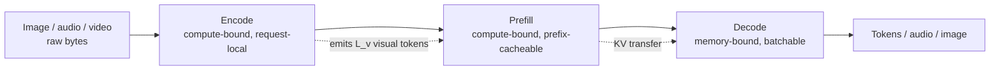
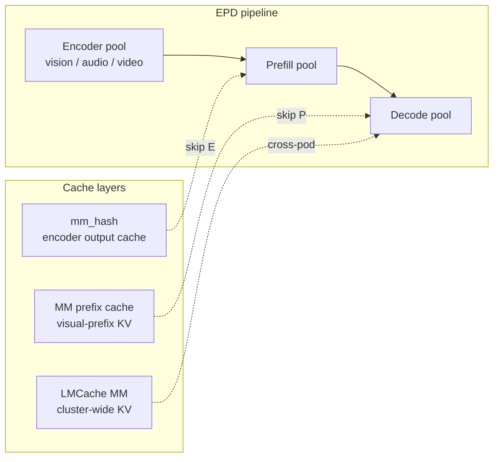
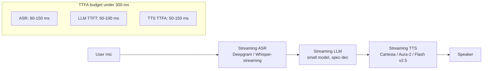

# Multimodal Serving

**After reading this chapter, the reader will be able to:**

- Decompose a multimodal request into its three serving stages — encode, prefill, decode — derive each stage's resource profile, and use the resulting **EPD** workload model to reason about token-count economics, encoder amortization, and disaggregation choices.
- Trace the lineage of multimodal serving from naïve in-engine vision encoders through `mm_hash` deduplication and the MM prefix cache to disaggregated stacks (HydraInfer, ModServe, vLLM-Omni, SpaceServe, Nova) and encoder redesigns (FastVLM), with enough vocabulary to read any 2025–2026 multimodal serving paper.
- Map the same EPD framing onto audio (batched Whisper, audio-token LLMs) and video (chunked / streaming encoders) workloads, and locate the sub-300 ms time-to-first-audio target inside the streaming voice pipeline that production assistants (GPT-4o realtime, Cartesia Sonic, LiveKit, Deepgram Aura-2, ElevenLabs Flash v2.5) now build against.

The previous chapter on RAG serving ([see §60/01-rag-serving](01-rag-serving.md)) treated retrieval as a pre-prefill stage that injects extra text tokens. Multimodal serving generalizes the move: image, audio, and video inputs each pass through a *non-text encoder* before they enter the standard prefill–decode pipeline. That third stage is large enough — both in compute and in tokens emitted — to merit its own design vocabulary, its own caching layer, and in production its own GPUs. This chapter develops the EPD model, walks the encoder caching and disaggregation lineage, treats audio and video as variants of the same model, and ends with the real-time streaming voice pipeline that has crystallized as the latency frontier of multimodal serving in 2026.

## 1. The EPD workload model

A vision-language model (VLM) request such as "describe this image" runs in three distinct stages on the serving stack:

1. **Encode (E).** A vision encoder — typically a ViT-class transformer (CLIP, SigLIP, FastViTHD) — converts the image into a sequence of *visual tokens* (more precisely, embedding vectors that are concatenated into the LLM input stream alongside the text-token embeddings). This is one or a few forward passes through the encoder, request-local, with no shared structure across requests beyond the encoder weights themselves.
2. **Prefill (P).** The LLM consumes the concatenated `[visual tokens] + [text tokens]` sequence and produces the KV cache used by decode. Prefill is the standard compute-bound phase analyzed in [see §00/02-transformer-arithmetic-roofline](../00-foundations/02-transformer-arithmetic-roofline.md), now lengthened by however many visual tokens the encoder emitted.
3. **Decode (D).** The LLM autoregressively generates the response one token at a time. Standard memory-bound decode as in [see §10/03-batching-scheduling](../10-engine-core/03-batching-scheduling.md).

The three stages have *three different rooflines*. Encode is compute-bound and request-local: each image goes through the encoder once with no batching benefit beyond stacking other images at the same resolution. Prefill is compute-bound and benefits from shared text prefixes ([see §10/07-prompt-prefix-caching](../10-engine-core/07-prompt-prefix-caching.md)). Decode is memory-bandwidth-bound and benefits from large concurrent batches. Co-locating all three on the same GPU forces the same tradeoff that PD disaggregation already documented for the P/D edge — a long encoder forward stalls every in-flight decode for its duration, and a heavy decode batch starves the encoder of SMs.

| Stage | Roofline | Sharing across requests | Latency-sensitive | Throughput lever |
|---|---|---|---|---|
| Encode | compute-bound | weights only; output cacheable by `mm_hash` | yes (TTFT) | smaller encoder, fewer tokens emitted |
| Prefill | compute-bound | weights + visual / text prefix KV | yes (TTFT) | chunked-prefill, prefix cache |
| Decode | memory-bandwidth-bound | weights only | yes (ITL / TPOT) | large concurrent batch |

EPD is therefore the **modality-split axis** of the disaggregation taxonomy laid out in [see §20/02-prefill-decode-disagg §2](../20-distributed-inference/02-prefill-decode-disagg.md#2-the-disaggregation-taxonomy). It is orthogonal to PD (phase split) and AFD (sublayer split). The cross-product PD × AFD × EPD describes the full disaggregation design space; a frontier multimodal MoE deployment is a specific point in that cube.

The boundary cost between E and P is the *visual-token transfer* — typically embeddings of size $L_v \times d$ in FP16, where $L_v$ is the visual-token count and $d$ is the LLM hidden dim. For a 5K-token visual prefix with $d = 4096$, this is $5000 \times 4096 \times 2 = 40$ MB per request, well within NVLink bandwidth and small enough that the E→P boundary rarely binds. The P→D boundary cost is the same KV transfer that PD disaggregation already pays ([see §20/02-prefill-decode-disagg §1](../20-distributed-inference/02-prefill-decode-disagg.md#1-why-split)), now with the visual prefix's KV included.

### Token-count economics

The single most consequential number in VLM serving is the count of visual tokens the encoder emits, because that count multiplies into both prefill cost and KV-cache memory. CLIP / ViT-L at patch size 14 turns a $1024 \times 1024$ image into $(1024/14)^2 \approx 5{,}329$ tokens before any compression. Native-resolution Qwen2-VL routinely emits more than 10,000 visual tokens per high-resolution image. The KV memory for that prefix is significant on its own: a 32-layer 4K-hidden FP16 model with KV size $2 \cdot \text{layers} \cdot \text{heads} \cdot \text{head\_dim} \cdot 2$ bytes lands near 256 KB per token, so a 5,000-token image produces roughly $5{,}000 \times 256 \text{ KB} \approx 1.3$ GB of KV cache *before* the LLM has generated a single output token.

The economic consequence is that for VLMs, **TTFT is dominated by visual-token count, not by text length**, and KV-cache memory pressure is dominated by the visual prefix. Two derived quantities matter for capacity planning. First, the **prefill FLOPs** scale as $\Theta(L_v \cdot d^2 + L_v^2 \cdot d)$ for visual prefix length $L_v$ and hidden size $d$, so doubling the visual-token count more than doubles prefill cost in the attention regime. Second, the **decode KV-bandwidth tax** scales linearly with the visual prefix because the decoder reads every visual KV entry on every generated token; for long-decode workloads (reasoning, agentic loops) the steady-state HBM bandwidth budget is dominated by the visual prefix even though the prefix was paid for once at prefill. Section 5 returns to visual-token count as the master design knob.

## 2. Image encoder caching

Once visual tokens are computed, two cache layers can amortize their cost:

**Encoder cache (`mm_hash`).** vLLM V1 introduced an encoder-output cache keyed by `mm_hash`, a 16-byte content hash of the visual input (the raw image bytes after pre-processing). When a second request arrives with the same image — common in galleries, thumbnails, "explain this screenshot" follow-ups, and multi-turn conversations on the same attachment — the encoder forward pass is skipped entirely and the cached embeddings are reused. The cache lives in the engine's encoder-cache manager and is reused across pipeline steps within a request as well, so chunked-prefill scheduling does not re-invoke the encoder for the same image on every chunk.

**MM prefix cache.** Once the visual tokens are concatenated into the LLM input and the LLM prefills over them, the resulting *KV cache* for the visual-token prefix is itself cacheable as a prefix. vLLM V1 and SGLang both extend their text-prefix-caching machinery (RadixAttention in SGLang, the block manager's prefix table in vLLM V1; see [see §10/07-prompt-prefix-caching](../10-engine-core/07-prompt-prefix-caching.md)) to recognize visual-token prefixes. The hash key for a visual prefix combines `mm_hash` with the encoder version and any pre-LLM projector state, then concatenates with the text-prefix hash for the rest of the prompt. A repeat query on the same image with a different question lands as a partial prefix-cache hit on the visual block and a miss on the text block.

**LMCache MM.** LMCache's mid-2025 multimodal release [LMCache-MM] extends the cross-engine, cross-tier KV-cache-as-a-service architecture ([see §30/02-kv-tiered-offload](../30-kv-cache/02-kv-tiered-offload.md)) into the multimodal regime. Visual-prefix KV blocks are stored in the cluster KV tier alongside text-prefix KV; a routing-aware request lands on whichever decode pod has — or can fastest fetch — the matching prefix. LMCache MM is the first production-quality cluster-wide multimodal KV cache and bridges encoder caching with the disaggregated KV transport developed for text-only PD.

The three cache layers compose: a request first probes the cluster KV cache for its full visual prefix; on miss, it probes the engine-local MM prefix cache; on miss, it probes the engine-local encoder cache for visual embeddings; on miss, it runs the encoder. Each lower layer is cheaper and more shareable, and the routing layer (llm-d's prefix-aware router, AIBrix's KV-aware scheduling, Mooncake's Conductor) selects pods that maximize the deepest cache hit. The interaction with PD disaggregation is non-trivial: a decode pod that already holds the visual-prefix KV from a sticky prior request makes E→P→D execution wasteful; the *probe-decoder-cache* pattern from text-only PD ([see §20/02-prefill-decode-disagg §10](../20-distributed-inference/02-prefill-decode-disagg.md#10-failure-handling-and-prefix-cache-interaction)) generalizes directly.

### Encoder amortization math

The cache numbers are large enough to drive deployment decisions. Consider a workflow where users iterate on a 5-image gallery with 100 follow-up questions. Without caching, the encoder runs $100 \times 5 = 500$ times. With `mm_hash` deduplication, the encoder runs $5$ times — once per unique image. The reduction is exactly $100\times$ for a workload of 100 queries per image, or $N\times$ where $N$ is the average number of queries per cached image:

$$
\text{encoder\_amortization} \;=\; \frac{N_\text{queries}}{N_\text{unique\_images}}.
$$

Production VLM workloads — chat with image attachments, document QA, screenshot debugging — routinely sit at $N \in [5, 50]$, which means the encoder cache buys an order-of-magnitude reduction in encoder cost. This is the analytic justification for treating `mm_hash` as table-stakes rather than as an optimization. The MM prefix cache adds a second multiplicative factor on top: even when the encoder hits, the prefill over the visual tokens still costs FLOPs unless the visual-prefix KV is also cached.

The capacity-planning consequence is that the encoder pool must be sized against the *uncached* request rate, not the total request rate. If $\rho_\text{cache-hit}$ is the encoder-cache hit rate, the encoder pool sees an arrival rate of $\lambda_\text{enc} = (1 - \rho_\text{cache-hit}) \cdot \lambda_\text{requests}$. At a hit rate of 90% (well within reach for chat-with-attachment workloads), the encoder pool is one-tenth the size it would otherwise need — which is the disaggregation argument's strongest case for putting the encoder on its own (often cheaper) accelerator pool. Cache-miss workloads (single-shot image queries, novel uploads) do not benefit and should be routed differently.

## 3. Disaggregated multimodal serving

Once cache-amortized cost stabilizes, the next move is to break the encode / prefill / decode co-location entirely. Five systems carry the EPD-disaggregation lineage.

**HydraInfer** [HydraInfer] (arXiv 2505.12658, May 2025) is the first paper to articulate encode–prefill–decode disaggregation as a deployment problem. It places the encoder, prefill, and decode stages on heterogeneous GPU instances chosen per-stage roofline: small GPUs (or CPUs / cheaper accelerators) for encode, frontier GPUs for prefill compute, and bandwidth-rich GPUs for decode. The contribution closest to DistServe's PD goodput formalism is HydraInfer's per-stage replica-count optimizer, which fixes the encode-to-prefill-to-decode ratio analogously to how DistServe fixes the P:D ratio. HydraInfer reports throughput improvements that scale with the relative cost of the encoder; the larger the encoder relative to prefill, the more disaggregation pays. The replica-count derivation generalizes the M/D/1 prefill-pool argument from PD ([see §20/02-prefill-decode-disagg §6](../20-distributed-inference/02-prefill-decode-disagg.md#6-the-mdq1-cap)) to a chain of three M/D/1 stages with cache-hit-rate corrections at the encoder edge.

**ModServe** [ModServe] (SoCC '25) is the modality- and stage-aware reference architecture. ModServe generalizes the disaggregation argument across modalities — vision, audio, depth, point clouds — and across stages, with a unified scheduler that assigns each (modality, stage) pair to a resource pool selected for that pair's profile. The stage-aware framing is the conceptual contribution: rather than treat "the encoder" as monolithic, ModServe decomposes encoder execution into pre-processing, attention, and projection sub-stages, each of which can be placed on a different accelerator. ModServe is the architectural antecedent of vLLM-Omni's stage-abstraction backend.

**vLLM-Omni** [vLLM-Omni] (arXiv 2602.02204, early 2026) is the first open characterization of EPD for **any-to-any** omni models — models that accept and emit text, image, audio, and video tokens in the same sequence. Its stage-abstraction backend exposes E, P, and D as first-class scheduling primitives that any backend (vLLM V1, SGLang, TRT-LLM) can drive, and it formalizes the encoder side for output modalities: an audio-emitting model needs an audio *decoder* (vocoder) at the output edge that mirrors the input encoder. The full pipeline becomes E (input) → P → D → E⁻¹ (output), and vLLM-Omni schedules the four stages independently. This is the production-relevant generalization of EPD to omni models such as Qwen3-Omni and the GPT-4o family.

**SpaceServe** [SpaceServe] takes the opposite tack: instead of disaggregating across GPUs, it spatially multiplexes encode and decode kernels on the *same* GPU using SM partitioning (analogous to Nexus's intra-GPU PD multiplexing in [see §20/02-prefill-decode-disagg §8](../20-distributed-inference/02-prefill-decode-disagg.md#8-heterogeneous-pd-and-intra-gpu-disaggregation)). The argument is that for small-to-medium VLMs the inter-GPU EPD transfer cost outweighs the kernel-interference cost, and SM-level co-location with explicit partitioning recovers most of the disaggregation benefit without the network hop. SpaceServe is the multimodal counterpart of the aggregation-vs-disaggregation regime debate developed for PD; it is most relevant for single-node deployments and small VLMs.

**Nova** [Nova] (arXiv 2509.21301, Sep 2025) bridges agentic VLM and edge serving via single-GPU pipelining of encode / prefill / decode plus *encoder weight offload*. The encoder lives in CPU pinned memory and streams to GPU on demand, freeing HBM for KV cache during decode-heavy phases. Nova is most relevant when HBM is the binding constraint — edge deployments, agentic loops with long decode runs, and reasoning-model VLM serving where decode dominates wall time.

The five systems span a clean Pareto front: HydraInfer and ModServe are the heterogeneous-cluster designs (encoder, prefill, decode each on their own pool); vLLM-Omni is the omni-model generalization that adds output-side encoders for audio and video emission; SpaceServe is the same-GPU spatial multiplexer for small-VLM regimes; Nova is the single-GPU pipeline-with-offload variant for edge and HBM-constrained settings. The choice among them tracks the same regime question that aggregation-vs-disaggregation poses for PD ([see §20/02-prefill-decode-disagg §7](../20-distributed-inference/02-prefill-decode-disagg.md#7-aggregation-vs-disaggregation-the-regime-dependence-debate)): disaggregation pays when the encoder is large relative to prefill and decode, which is exactly the high-resolution-VLM regime that frontier production occupies.

## 4. FastVLM and the encoder-token master knob

If visual-token count drives TTFT and KV pressure, the obvious lever is to *emit fewer visual tokens at the same input resolution*. FastVLM [FastVLM] (Apple ML, CVPR 2025) is the lineage-defining work: a hybrid CNN + transformer encoder (FastViTHD) that produces dramatically fewer tokens per image than CLIP / SigLIP / ViT at matched downstream accuracy. The reported numbers — 85× faster TTFT on LLaVA-OneVision-0.5B and 7.9× on the 7B variant — are not kernel-level wins; they are the linear consequence of cutting the visual-token count by an order of magnitude and feeding a shorter prefix to the LLM. The hybrid CNN front-end exploits image locality (early layers see only nearby pixels, the way a CNN does) while the transformer back-end handles the global aggregation; the net effect is that the encoder emits coarse-grained tokens at high effective resolution, breaking the patch-size-locked token-count of pure ViT encoders.

The general principle is that for VLMs, **token count is the master TTFT knob**. Encoder choice matters more than encoder kernel optimization. Architectures that pursue token-count reduction — FastVLM's hybrid encoder, Qwen2-VL's dynamic-resolution token packer, the "perceiver resampler" lineage from Flamingo, and mixture-of-resolution routing in DeepSeek-VL2 — collectively push the visual token budget for a $1024^2$ image from 5K+ down to a few hundred at acceptable accuracy. Beyond a certain threshold, further token reduction trades against accuracy in ways that are workload-specific; this is the multimodal analog of the quantization quality cliff in [see §10/04-quantization](../10-engine-core/04-quantization.md).

A hedge: the FastVLM speedups are reported on a specific LLM backbone size and a specific benchmark suite. The general claim — that token count drives TTFT linearly through prefill — is robust; the specific multipliers do not transfer unchanged to other backbones. Practitioners should re-measure on their own model.

The token-count knob also interacts with the encoder-cache hit-rate analysis from §2. A token-economical encoder reduces per-request prefill cost regardless of cache state; an encoder cache reduces *encoder* cost only on cache hits. A workload with low cache hit rate — single-shot image queries, novel content — benefits primarily from FastVLM-class encoders, while a workload with high hit rate — multi-turn chat, document QA — benefits from `mm_hash` and the MM prefix cache. Production VLM stacks combine both axes: a token-economical encoder (FastVLM, Qwen2-VL-style dynamic resolution) feeding the cache layer (vLLM V1's `mm_hash`, LMCache MM at cluster scale).

A complementary lever, not yet GA in open engines, is **encoder-side speculative decoding**: an audited fast encoder produces draft visual tokens that a heavy verifier accepts or rejects. The arithmetic is the same as text-side spec-dec ([see §10/05-speculative-decoding](../10-engine-core/05-speculative-decoding.md)) but applied to the encoder forward pass. As of early 2026 this is research-grade; the production-default lever remains FastVLM-style architectural reduction.

## 5. Audio: batched Whisper and audio-token LLMs

Audio serving splits into two regimes with different rooflines.

**Batched ASR (Whisper-class).** Whisper Large V3 is the canonical batched-ASR target. The OpenAI reference implementation is unbatched and CPU-friendly; faster-whisper (CTranslate2 backend) reports roughly $4\times$ over the reference; *batched* faster-whisper variants reach ~$12.5\times$. MLPerf v5.1 added an ASR benchmark in 2025 that fixed Whisper Large V3 throughput as a comparable metric across stacks. The serving picture is straightforward: ASR is request-local (no shared prefix), encoder-only (no decode), and benefits directly from batching across concurrent audio streams. It is the audio analog of the encoder stage of a VLM, and the same `mm_hash`-style content-deduplication caching applies for repeat-audio workloads (e.g., podcast transcription with re-runs).

Whisper Large V3 is itself an encoder-decoder architecture (the "decoder" produces text tokens autoregressively from encoded audio features), so the EPD framing collapses partially: the audio encoder and the text decoder are part of the same model. Production stacks treat this as a single co-located deployment for batched ASR and reserve the disaggregated EPD framing for *audio-token LLMs* below, where the LLM is genuinely separate from the audio encoder.

**Audio-token LLMs.** Qwen2-Audio, Qwen2.5-Omni, and Qwen3-Omni emit *audio tokens directly* — the LLM's vocabulary is extended with a discrete audio codec (typically a residual VQ-VAE or SoundStream variant), so the model produces the audio waveform autoregressively the same way it produces text. Qwen3-Omni reports SOTA on 32 / 36 audio benchmarks at the time of release. The serving consequence is that audio-emitting LLMs are subject to a stricter latency budget than text LLMs: the user hears a stutter or gap whenever decode pauses, so per-token decode latency must stay under the audio frame interval (typically 20 ms per frame at 50 fps, with a hierarchical codec emitting multiple tokens per frame).

The hierarchical-codec detail matters for serving math. A residual VQ-VAE with $Q$ quantizer levels at frame rate $f$ Hz emits $Q \cdot f$ tokens per second of audio. At a typical $Q = 8$ and $f = 50$ Hz this is 400 tokens / second. A real-time decode pipeline must therefore sustain at least 400 tokens / second per stream on the audio path, with bursts during phoneme-dense speech. This is a strictly tighter ITL constraint than text serving, where 50–100 tokens / second is human-readable; text-LLM ITL targets do not transfer to audio-LLM serving without re-derivation.

**GPT-4o realtime audio.** OpenAI's GPT-4o realtime API floors at roughly 320 ms time-to-first-audio (TTFA), and its sustained audio output requires the decode pipeline to keep up with playback in real time. This is the production-relevant target. Section 8 returns to the architecture that hits sub-300 ms TTFA at the full pipeline level.

## 6. Video: chunked encoding and streaming

Video serving is the least mature of the three modalities in production engines, primarily because of two compounding problems:

- **Frame-count explosion.** A 1-minute clip at 16 fps is 960 frames; at the same per-frame token count as a single image, the visual token budget runs into the hundreds of thousands. Native chunking is mandatory.
- **Whole-video encode anti-pattern.** vLLM's known issue as of late 2025 is that VLM video paths encode the *entire* video before any text token is produced, eliminating the streaming property. Chunked / streaming video encoders are not yet GA in mainstream open engines.

The 2025 frontier on the model side is **F-16 VideoLLM** [F-16] (ICML 2025), which targets 16 fps high-FPS video — a non-trivial throughput regime that production serving stacks are not yet built for. **Streaming VideoLLMs** [StreamVideoLLM] (ICCV 2025) develops memory-propagated chunk encoding for long video: the encoder ingests fixed-size chunks, propagates a compressed memory state forward, and emits visual tokens in lockstep with the LLM's prefill–decode loop. The serving challenge is integrating this state-propagating chunk encoder into the engine's scheduling primitives — the encoder is no longer a stateless pre-prefill function but a streaming kernel whose state must be pinned for the duration of the request.

Production deployments in 2026 work around the engine gap by either (a) doing whole-video encode out-of-band on a separate worker pool and treating the resulting visual tokens as a standard prefix, or (b) using model variants that natively chunk (LLaVA-OneVision in SGLang) but accepting that "live video QA" remains a research workload more than a deployed product.

A second engine gap is **KV-cache contention under streaming video.** Long video means a long visual prefix means a large per-request KV footprint, and concurrent video streams compete for HBM in ways that text-only continuous batching does not. The mitigation in research stacks is *KV compression specific to visual tokens* — quantizing visual KV to FP4 or INT4 while keeping text KV at FP16, on the empirical observation that visual KV is more error-tolerant. This is the multimodal application of the KV quantization techniques in [see §30/01-kv-compression](../30-kv-cache/01-kv-compression.md), and is an active area through 2026.

## 7. Real-time streaming voice and agent pipelines

A separate frontier deserves its own treatment: the **streaming voice agent**, where the user speaks and the system responds in near-real-time audio, with a target time-to-first-audio (TTFA) below 300 ms — roughly the threshold where a human listener begins to perceive the system as conversational rather than lagged.

The pipeline composes three stages, each of which must stream into the next:

$$
\text{TTFA}_{\text{end-to-end}} \;\approx\; T_\text{ASR} \;+\; T_\text{LLM TTFT} \;+\; T_\text{TTS TTFA}.
$$

Each stage's contribution must fit inside the budget: a 100 ms ASR stream + 100 ms LLM TTFT + 100 ms TTS TTFA hits the 300 ms target with no slack. The architecture is necessarily streaming end-to-end — no stage can wait for full output of its predecessor — and is the audio analog of speculative decoding's "chase the leading token" pattern but applied across a heterogeneous pipeline.

**ASR side.** Deepgram and OpenAI's Whisper-streaming (custom variants) provide partial-hypothesis streaming with end-of-utterance detection. The latency budget is dominated by the lookahead window the model needs for stable recognition — typically 80–200 ms of audio. End-of-utterance (EOU) detection is the trickiest bit: detecting it eagerly cuts the user off mid-sentence, while detecting it conservatively adds dead air to the response. Voice-agent stacks tune this with semantic EOU (a small classifier trained to distinguish "thinking pauses" from "I'm done") and with explicit latency-vs-accuracy tradeoff settings exposed to operators.

**LLM side.** A standard streaming LLM with sub-100 ms TTFT — achievable on small models (1–8B) at modest context length — feeds tokens to the TTS as soon as they are produced. The LLM in this regime is *latency-critical, not throughput-critical*, and is often a separately-tuned model variant. Speculative decoding ([see §10/05-speculative-decoding](../10-engine-core/05-speculative-decoding.md)) applies directly because it reduces decode latency at the cost of compute, and a voice pipeline's binding constraint is latency. The LLM also faces an unusual constraint: TTS quality degrades when given streaming text in awkward chunks (mid-word boundaries, mid-clause breaks), so the LLM-to-TTS handoff often buffers to *sentence boundaries* rather than streaming token-by-token. This buffering adds 20–80 ms to TTFA and is the largest single controllable cost in the streaming voice budget; vendor-provided "low-latency mode" settings typically tune this buffer down at the cost of TTS prosody.

**TTS side.** Three production vendors anchor the TTS market in 2026: Cartesia Sonic [CartesiaSonic] is a *state-space-model* TTS with sub-300 ms TTFA at the TTS stage alone (the SSM avoids attention's quadratic cost in the audio sequence and provides the structurally lowest TTFA in the field); Deepgram Aura-2 [Aura2] is a streaming-first transformer TTS exposed as a low-latency API, with sub-200 ms TTFA on managed paths; ElevenLabs Flash v2.5 [ElevenLabsFlash] is the production-grade voice-cloning TTS with low-latency streaming as a v2.5 addition, trading some TTFA for higher voice fidelity. The TTS stage takes streaming text tokens as input and emits streaming audio frames at sub-frame-interval cadence.

The architectural choice — SSM vs. transformer for streaming TTS — mirrors the broader hybrid-architecture debate in [see §30/03-attention-variants](../30-kv-cache/03-attention-variants.md). SSMs offer constant-time per-step generation independent of audio history length, which is structurally favorable for streaming TTS where the audio history grows monotonically. Transformer TTS retains higher quality on long-form prosody but requires KV-cache management within the TTS itself. Voice-agent stacks that prioritize latency over fidelity converge on SSM-based TTS; stacks that prioritize fidelity (audiobook generation, voice acting) keep transformer TTS.

**End-to-end orchestration.** LiveKit [LiveKit] is the open-source SDK for real-time voice pipelines: WebRTC for client transport, pluggable STT / LLM / TTS providers, and explicit support for the streaming-into-streaming chain that the architecture demands. LiveKit's design choice to expose each stage as a streaming-callable backend reflects the broader convergence: the pipeline is heterogeneous (different vendors, different models) but the streaming protocol is uniform. Voice-agent stacks built on LiveKit additionally include *barge-in* and *interruption* handling — when the user starts speaking again mid-response, the LLM and TTS must cancel in-flight generation and free their KV / vocoder state. This requires explicit streaming-cancel semantics on every backend, which is a stricter API contract than the standard streaming-completion endpoint.

**GPT-4o realtime.** OpenAI's realtime API is the integrated end-to-end product: a single audio-token model handles ASR + LLM + TTS internally and streams audio out, with the ~320 ms TTFA floor noted above. The integrated path avoids the inter-stage hop costs but binds the operator to OpenAI's models and their numerical regime; the disaggregated LiveKit-style path keeps each stage swappable at the cost of explicit streaming glue. The convergence pattern in 2026 is that integrated audio-token-LLM stacks dominate the highest-touch consumer applications (ChatGPT voice, Gemini Live), while disaggregated streaming pipelines dominate the enterprise / vertical-agent market where vendor lock-in is unacceptable and where the LLM must be a specific fine-tuned model.

The hedge: TTFA numbers from each vendor are vendor-supplied and measured in ideal network conditions. End-to-end production TTFA over open internet routinely sits 50–150 ms above any single vendor's claim. The textbook-defensible statement is that sub-300 ms TTFA is a feasible architectural target on managed network paths in 2026, achieved by integrated stacks (GPT-4o realtime) and by carefully composed disaggregated stacks (LiveKit + best-of-breed providers); it is not a guarantee for any specific deployment.

## 8. Per-engine capability matrix

The major open and proprietary engines diverge sharply on multimodal coverage as of mid-2026.

| Engine | VLM support | Audio | Video | Disaggregated MM |
|---|---|---|---|---|
| vLLM V1 | `mm_hash` encoder cache, MM prefix cache, chunked-prefill over visual tokens | limited (basic Whisper-class wrappers) | whole-video encode anti-pattern; chunked not GA | via vLLM-Omni and HydraInfer integrations |
| SGLang | Multi-image and video (v0.3+), LLaVA-OneVision native, RadixAttention extends to MM prefixes | limited | LLaVA-OneVision streaming variants | separate; not yet integrated with disagg PD |
| TensorRT-LLM | VLM with disaggregated encode for selected models, Triton-orchestrated | — | — | via Triton ensemble graphs |
| LMCache | MM KV-tier (LMCache MM), engine-agnostic | partial | partial | yes — cluster-wide KV cache feeds any backend |

vLLM V1 leads on the engine-internal cache layer (`mm_hash` and MM prefix cache are deepest in vLLM); SGLang leads on raw model coverage (LLaVA-OneVision multi-image / video out of the box); TRT-LLM leads on production-grade encoder disaggregation through Triton's ensemble-graph orchestration; LMCache leads on the cluster-wide KV-cache tier that any engine can plug into. The convergence pattern in 2026 is that the engines are picking up each other's missing pieces — vLLM is adding video chunking, SGLang is integrating with LMCache, TRT-LLM is exposing more of its encoder-disagg machinery — but no single open engine yet covers the full EPD × audio × video × cluster-cache cross-product.

A separate gap, common to all engines, is the **failure-handling story at the E→P→D boundaries**. The PD-disagg literature already flags fault tolerance as under-engineered ([see §20/02-prefill-decode-disagg §10](../20-distributed-inference/02-prefill-decode-disagg.md#10-failure-handling-and-prefix-cache-interaction)); EPD adds a third boundary and a third class of failure modes. An encoder worker failing after computing visual tokens but before transferring them forces re-encoding of a potentially expensive image; a prefill worker failing after consuming visual tokens loses both the visual KV and the encoder's amortized work; a decode worker failing on an audio-emitting model loses an in-flight audio waveform that the user is actively hearing. No production stack in 2026 publishes a complete fault-domain analysis covering the EPD edges, and the operational risk in long-running multimodal sessions (video QA, voice agents, long generative-image runs) tracks accordingly.

## 9. Multimodal autoscaling and observability

EPD makes autoscaling harder along the same lines that PD does. The three pools (E, P, D) must stay in flow balance: encoder running ahead piles up encoded visual tokens with nowhere to go, prefill running ahead piles up KV at the P→D edge, and decode running ahead idles. The signals that matter generalize the PD-aware autoscaling story from [see §20/02-prefill-decode-disagg §9](../20-distributed-inference/02-prefill-decode-disagg.md#9-pd-aware-autoscaling):

- **Encoder pool** is sized against the *uncached* request rate (§2's $\lambda_\text{enc} = (1 - \rho_\text{cache-hit}) \cdot \lambda_\text{requests}$), measured in encode-FLOPs / s rather than request rate, because per-image encode cost varies with input resolution.
- **Prefill pool** is sized against visual-token-aware prefill throughput; the standard PD signal of prefill-tokens/s must be re-interpreted because a single VLM request can carry 5–10× more prefill tokens than a text-only request of the same prompt length.
- **Decode pool** carries the dominant share of HBM pressure due to the visual prefix's KV footprint; the PD-side signal of decode-TPS plus KV-cache-usage % applies directly, with the addendum that visual-token KV is more compressible than text KV (§6) and a separate quantization tier may be applied.

Production autoscalers in 2026 (Dynamo Planner, AIBrix APA, llm-d WVA) extend their PD primitives to EPD by adding a per-pool scale loop with explicit flow-balance enforcement. A common-mode failure of naïve EPD autoscaling is that the encoder cache-hit rate is bursty — a viral attachment spikes hit rate to >99%, then a normal traffic mix returns it to 60% — and the encoder pool is alternately starved or overloaded across the diurnal cycle. Production stacks address this with hysteresis on the encoder pool and with admission-side rate limiting on uncached visual content.

Observability for EPD requires per-stage TTFT decomposition: total TTFT = encode-time + E→P transfer + prefill-time + P→D transfer + first-token-decode. Without this decomposition, capacity-planning guesses go in the wrong direction (engineers add prefill GPUs when the encoder pool is the bottleneck, or vice versa). The convergence pattern in 2026 is that observability stacks ([see §50/03-observability-and-resilience](../50-cluster-systems/03-observability-and-resilience.md)) are extending their TTFT decomposition with a third stage label, and the engine APIs are exposing per-stage timestamps on every multimodal request.

## Current production state

By mid-2026, EPD is the dominant mental model for multimodal serving design. `mm_hash` encoder caching and MM prefix caching are table-stakes in vLLM V1 and SGLang, and LMCache MM has made cluster-wide multimodal KV reuse a production possibility for the first time. The encoder-token-count master-knob argument (FastVLM and the wider perceiver-resampler / dynamic-resolution lineage) is the dominant model-side lever for VLM TTFT, and the disaggregated EPD stacks (HydraInfer, ModServe, vLLM-Omni, SpaceServe, Nova) supply the deployment-side lever. The two combine: a token-economical encoder feeding a disaggregated EPD pipeline is the production-default architecture for high-traffic VLM workloads, with the SpaceServe / Nova single-GPU-multiplexed variants reserved for smaller deployments and edge.

Audio serving has bifurcated cleanly. Batched Whisper (faster-whisper, batched-faster-whisper, MLPerf-tracked) is mature and effectively a solved problem at the per-stack level; the open work is on cluster-level batching across many concurrent streams. Audio-token LLMs (Qwen3-Omni, GPT-4o family) sit at the latency frontier — TTFA sub-300 ms is achievable in integrated stacks (GPT-4o realtime hovers around 320 ms; Cartesia Sonic claims sub-300 ms at the TTS stage alone) but requires end-to-end streaming with no buffering hops. The streaming voice pipeline (ASR → LLM → TTS, orchestrated by LiveKit or an integrated provider) is the production frontier of 2026 for conversational voice agents, and its architecture — small latency-tuned LLM, speculative decoding, SSM or transformer streaming TTS, WebRTC transport — is the audio analog of the disaggregated PD architecture for text.

Video serving is the least mature of the three. The whole-video-encode anti-pattern in mainstream engines remains the binding constraint, and chunked / streaming video encoders (F-16 VideoLLM, Streaming VideoLLMs) are research-grade rather than deployed-grade as of early 2026. Production "video QA" workloads in 2026 are typically run as offline batch jobs over pre-encoded visual tokens, with live video applications restricted to short clips or to specialty stacks. The textbook-defensible expectation is that streaming video encoders enter open engines through 2026–2027 and that the EPD model — already extended to audio — generalizes cleanly to streaming video once the engine-side scheduling primitives catch up.
