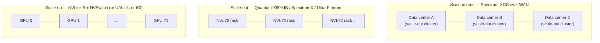

# Networking Fabric

**After reading this chapter, the reader will be able to:**

- Place every modern interconnect — NVLink 4 / 5, NVSwitch, NVLink-C2C, NVLink Fusion, InfiniBand NDR / XDR (Quantum-X800, ConnectX-8 SuperNIC), Spectrum-X, Spectrum-XGS, Ultra Ethernet 1.0, UALink 1.0 — into the three-tier scale-up / scale-out / scale-across taxonomy, and quote per-GPU bandwidth, port count, and dominant production deployment for each.
- Apply the NVLink-domain bandwidth budget to determine the largest tensor-parallel degree a workload can run inside one rack-scale fabric, why crossing the NVLink/IB boundary inflates per-layer all-reduce time by 5–10×, and how scale-across distance-aware congestion control changes that calculus for multi-data-center deployments.
- Distinguish kernel-bypass primitives — GPUDirect RDMA, GPUDirect Storage, NVSHMEM — from collective libraries, name where each lives in the LLM serving stack (large-EP all-to-all, KV-cache offload to NVMe, weight transfer in RL rollouts), and explain why co-packaged optics in switches is the enabling technology for million-GPU and gigawatt-scale clusters.

Earlier chapters introduced the *protocols* (NCCL all-reduce, all-gather, all-to-all in [§00/04-collectives-and-comm-primer](../00-foundations/04-collectives-and-comm-primer.md)) and the intra-node fabric they ride on (NVLink + NVSwitch in [§00/03-gpu-hardware-primer](../00-foundations/03-gpu-hardware-primer.md), §5). This chapter is the *fabric* layer in full: every wire and switch between an SM and another SM, whether that other SM is in the same baseboard, the same rack, the next rack, or the next state. Numbers reused below — NVLink 4 / 5 per-GPU bandwidth, IB NDR / XDR line rates, NVL72 aggregate — come from those chapters and are not re-derived. The placement decisions for tensor-parallel, expert-parallel, and pipeline-parallel deployments come from [§20/01-parallelism-strategies](../20-distributed-inference/01-parallelism-strategies.md) and [§20/03-moe-inference](../20-distributed-inference/03-moe-inference.md); this chapter is the hardware they sit on.

## 1. Three scales — the production taxonomy

Production AI fabrics in 2026 are organized into three concentric tiers, each with its own dominant technology, latency budget, and traffic pattern.

**Scale-up — within one logical accelerator domain.** Eight to seventy-two GPUs joined by NVLink + NVSwitch (or AMD's Infinity Fabric / UALink, or TPU's ICI), forming what every parallelism strategy treats as "one logical GPU." Latency: ~1 μs per hop. Per-GPU bandwidth: 900 GB/s on Hopper, 1.8 TB/s on Blackwell. Aggregate: 7.2 TB/s in HGX H100, 130 TB/s in GB200 NVL72. Traffic: TP all-reduce, EP all-to-all, KV transfer between PD pools sharing a rack, weight loading. The structural rule from [§00/04-collectives-and-comm-primer](../00-foundations/04-collectives-and-comm-primer.md): tensor parallelism wants to live entirely inside one scale-up domain.

**Scale-out — across racks and across one cluster.** Hundreds to tens of thousands of GPUs joined by InfiniBand (NDR 400 Gb/s, XDR 800 Gb/s) or AI-tuned Ethernet (Spectrum-X, Ultra Ethernet) in a fat-tree or rail-optimized topology. Latency: 5–15 μs end-to-end RDMA. Per-GPU bandwidth: 50 GB/s (NDR) to 100 GB/s (XDR) per port. Traffic: PP point-to-point activations, DP gradient or weight broadcasts (RL rollouts), KV transfer between PD pools across racks, EP dispatch when EP exceeds one rack's NVLink domain. The structural rule: PP and DP cross IB without penalty; TP across IB is a footgun; large-EP straddles the boundary and is what custom libraries like DeepEP exist to optimize.

**Scale-across — between distributed data centers as one logical AI factory.** Multiple AZ-class or campus-class facilities, separated by tens to hundreds of kilometers, joined into one training or inference cluster. Latency: hundreds of microseconds to single-digit milliseconds, dominated by speed of light. Bandwidth: 800 Gb/s ports, but link-distance-induced buffering costs become first-class. Traffic: cross-DC DP, cross-DC checkpoint streaming, cross-DC asynchronous RL weight sync. The dominant fabric: Spectrum-XGS (NVIDIA, August 2025), which adds distance-aware congestion control on top of Spectrum-X. The motivating workloads — OpenAI Stargate, xAI Colossus 2 (2 GW), Meta Hyperion / Prometheus — are gigawatt-scale and exceed the power envelope of any single facility.

The three tiers compose hierarchically: scale-across joins scale-out clusters which contain scale-up domains. The latency ratios are roughly $1 : 10 : 1{,}000$ from scale-up to scale-out to scale-across (1 μs intra-NVLink, 10 μs intra-cluster IB, 1+ ms cross-DC), and the bandwidth ratios run the other way — scale-up has 10–20× the per-GPU bandwidth of scale-out, which has 1–10× the per-GPU bandwidth of scale-across. Every distributed inference layout in this book exploits these ratios to keep tightly coupled traffic on tight tiers and tolerant traffic on loose tiers.

A schematic across the three tiers:

Three-tier composition is what every chapter from §20 onward implicitly assumes. The fabric chapter's job is to name each tier's hardware.

## 2. NVLink and NVSwitch — the scale-up fabric

NVLink is a point-to-point GPU-to-GPU SerDes-based interconnect; NVSwitch is the switch ASIC that turns those point-to-point links into an all-to-all fabric within a baseboard or rack. Generations track the GPU generation:

| Gen | First product | Per-GPU bidirectional BW | Aggregate (8-GPU node) | Aggregate (rack) | Switch ASIC |
|---|---|---|---|---|---|
| NVLink 3 | A100 (2020) | 600 GB/s | 4.8 TB/s (8-GPU NVSwitch) | — | NVSwitch 2 |
| NVLink 4 | H100 / H200 (2022–2024) | 900 GB/s | 7.2 TB/s (HGX H100/H200) | — | NVSwitch 3 |
| NVLink 5 | B100 / B200 (2024–2025) | 1.8 TB/s | 14.4 TB/s (HGX B200) | 130 TB/s (GB200 NVL72) | NVSwitch 4 |
| NVLink-C2C | GB200 (2024) | 900 GB/s | — (CPU↔GPU) | — | — |
| NVLink Fusion | announced May 2025 | licensable | — | — | — |
| NVLink-next | Rubin (H2 2026) | ~3.6 TB/s (vendor-claimed) | — | NVL576 ("12× NVLink") | NVSwitch 5 |

Hopper's 900 GB/s per GPU is built from 18 NVLink 4 lanes at 50 GB/s each; Blackwell's 1.8 TB/s is also 18 lanes, each at 100 GB/s. NVSwitch 3 (Hopper) and NVSwitch 4 (Blackwell) provide full bisection — every GPU can talk to every other GPU at full per-GPU bandwidth simultaneously. The 8-GPU HGX baseboard uses 4 NVSwitch chips; GB200 NVL72 uses 9 NVSwitch trays delivering 130 TB/s aggregate across 72 GPUs. Numbers cited as Rubin / NVL576 are NVIDIA-disclosed roadmap figures and have not been independently benchmarked as of May 2026.

**NVLink-C2C** is the coherent CPU-to-GPU link that ties Grace to Blackwell in GB200: 900 GB/s, cache-coherent, addressable as one unified memory (Extended GPU Memory, EGM). This is what makes a GB200 superchip behave as a tightly coupled CPU+GPU pair rather than as a PCIe-attached accelerator; the bandwidth is roughly 7× PCIe Gen5 ×16 (128 GB/s).

**NVLink Fusion** (announced GTC, May 2025) opens NVLink IP to partner silicon — MediaTek, Marvell, Fujitsu, Qualcomm, Alchip, Astera Labs, Synopsys, Cadence — for non-NVIDIA CPUs and accelerators wishing to participate in an NVLink scale-up domain. The motivation is competitive: hyperscalers want custom CPUs and ASICs to coexist with NVIDIA GPUs in the same scale-up fabric. As of May 2026 no partner silicon has shipped in an NVLink Fusion configuration; the announcement is a strategic commitment, not yet a production reality.

**NVLink-next / Rubin.** NVIDIA's roadmap calls for a follow-on NVLink generation timed to the Rubin GPU (H2 2026), with vendor-claimed per-GPU bandwidth of ~3.6 TB/s (a 2× lift from NVLink 5) and a rack-scale NVL576 domain that bundles 576 GPUs into one logical accelerator (8× the GPU count of NVL72, marketed as a "12× NVLink" aggregate uplift due to per-link bandwidth doubling combined with a wider switch fabric). The figures are NVIDIA-disclosed roadmap claims; product launches typically deliver headline bandwidth at the upper bound of disclosed figures and effective bandwidth somewhat lower under realistic kernel pressure. Independent benchmarks at Rubin / NVL576 scale do not exist as of May 2026.

### 2.1 GB200 NVL72 as the canonical scale-up domain

GB200 NVL72 is the architectural touchstone the rest of this section returns to. One liquid-cooled rack: 72 B200 GPUs and 36 Grace CPUs, joined by 9 NVSwitch 4 trays into a single 72-way NVLink-5 fabric at 130 TB/s aggregate. The rack is treated as one logical accelerator with 13.8 TB of HBM (72 × 192 GB) and no PCIe anywhere on the compute path. Every TP all-reduce, every EP all-to-all, and every intra-rack PD KV transfer rides this fabric.

The bandwidth math the fabric makes possible: a TP=72 all-reduce over NVLink 5 transports $\approx 2N$ bytes per GPU (the ring-allreduce asymptote from [§00/04-collectives-and-comm-primer](../00-foundations/04-collectives-and-comm-primer.md), §3). At 1.8 TB/s per GPU and a 4 MB per-token activation tensor at TP=72, the all-reduce takes $\approx 2 \cdot 4\text{ MB} / 1.8 \text{ TB/s} \approx 4.5\,\mu s$ in the bandwidth term. Per-layer compute on a 70B-class model at FP8 is hundreds of microseconds, so TP=72 is *mechanically* viable — but production deployments rarely use TP=72 because per-GPU GEMM saturates much earlier; the reasons are in [§20/01-parallelism-strategies](../20-distributed-inference/01-parallelism-strategies.md), §6. The key fabric fact is that the 130 TB/s aggregate budget would not exist without NVLink 5 + NVSwitch 4.

## 3. TP scaling math — when NVLink enables TP and when IB breaks it

The structural reason chapters from §20 onward say "TP within an NVLink domain" reduces to one inequality. Pick a TP degree $d$, hidden dim $H$, batch $B$, bytes-per-element $b$, and per-link bandwidth $\beta$. Each transformer layer triggers two all-reduces — one after the attention output projection and one after the FFN down-projection — each on a $B \times H$ activation tensor:

$$T_{\text{TP-allreduce}}(d, H, B) \;\approx\; 2 \cdot \underbrace{2 \cdot \frac{d-1}{d} \cdot B \cdot H \cdot b}_{\text{ring volume per layer}} / \beta.$$

For NVLink 5 ($\beta = 1.8$ TB/s per GPU bidirectional, treated as 900 GB/s unidirectional for ring purposes) and a 70B-class layer at $H = 8192$, $B = 32$ decode tokens, BF16:

$$T_{\text{TP=8, NVLink-5}} \;\approx\; 2 \cdot 2 \cdot \tfrac{7}{8} \cdot 32 \cdot 8192 \cdot 2 \;/\; 9{\times}10^{11} \;\approx\; 1\,\mu s\text{ per layer}.$$

For the same layer over IB NDR ($\beta = 50$ GB/s per port):

$$T_{\text{TP=8, IB-NDR}} \;\approx\; 2 \cdot 2 \cdot \tfrac{7}{8} \cdot 32 \cdot 8192 \cdot 2 \;/\; 5{\times}10^{10} \;\approx\; 18\,\mu s\text{ per layer},$$

before adding the IB end-to-end RDMA latency of 5–15 μs *per all-reduce step*, which the latency-bounded ring algorithm at small messages multiplies by $2(P-1) = 14$. The total per-layer overhead at TP=8 across IB lands in the 100+ μs range; for an 80-layer model, that is 8+ ms per token of all-reduce alone — many times the compute. This is the 5–10× per-layer inflation [§00/04-collectives-and-comm-primer](../00-foundations/04-collectives-and-comm-primer.md), §4 names without deriving in full.

Inside an NVL72 rack the same inequality runs in the other direction. At TP=72 on NVLink 5, the per-GPU bandwidth budget is the same 1.8 TB/s; the ring-volume factor $2(d-1)/d$ asymptotes to 2 regardless of $d$. The bandwidth term grows weakly with $d$ — but the *latency term* grows linearly with $d$, so a TP=72 all-reduce on a 0.5 MB tensor pays $2(72-1) \cdot 1\,\mu s \approx 142\,\mu s$ in latency before any bytes move. This is why NVL72 enables but does not encourage TP=72; production deployments cap TP at 8–16 even on rack-scale fabrics and spend the remaining rank budget on EP or DP.

The compact rule the chapter underwrites: TP scales gracefully *up to* the NVLink domain's GPU count, *if* the latency term $2(d-1)\alpha$ stays within the per-layer compute budget. Beyond the NVLink domain, the bandwidth term plus the per-step IB latency multiplies per-layer time by an order of magnitude, and TP becomes economically irrational.

### 3.1 Scale-across latency analysis

Scale-across — joining multiple data centers into one logical cluster — runs against a different latency floor: the speed of light in fiber, $\approx 200{,}000$ km/s (5 μs/km round-trip). Two facilities 10 km apart pay 100 μs of round-trip propagation alone, before any switching or queuing. At 100 km separation (a metro-area pair) the floor is 1 ms RTT; at 1,000 km (continental) it is 10 ms.

The speed-of-light floor reframes which collectives can cross the WAN. Repeating the latency-bandwidth model $T_{\text{comm}}(m) = \alpha + m / \beta$ with $\alpha_{\text{WAN}} \approx 1$ ms and $\beta_{\text{WAN}} \approx 100$ GB/s aggregated across many 800 Gb/s links, the crossover message size from [§00/04-collectives-and-comm-primer](../00-foundations/04-collectives-and-comm-primer.md), §5 jumps:

$$N^{*}_{\text{WAN}} \;=\; P \cdot \alpha_{\text{WAN}} \cdot \beta_{\text{WAN}} \;\approx\; P \cdot 100\text{ MB}.$$

For any $P$ above a handful, only multi-gigabyte messages amortize the WAN latency — which excludes per-token TP, per-layer EP, and per-microbatch PP. What *fits* over scale-across: full-checkpoint synchronization (10–100 GB on a model checkpoint), batched RL weight broadcast (an entire actor model state, often consolidated and sent once per global step), bulk dataset replication, and async / off-policy collective steps where staleness is tolerable. What does *not* fit: any per-iteration collective on the model's critical path. The DeepSeek-V3 reference deployment, the Kimi-K2 deployment, and the Llama-4 production stack all keep every per-iteration collective inside one cluster's scale-out tier.

Distance-aware congestion control — the Spectrum-XGS contribution — does not change the speed-of-light floor; it changes the *bandwidth efficiency* at distance. Standard DCQCN tunes its control loop for ~10 μs RTT and either fails to react in time or oscillates when RTT is 100× larger; XGS retunes for the WAN regime and reportedly recovers $\approx 1.6\times$ effective throughput vs. naively-configured DCQCN at distance. Combined with precision latency management (per-flow priority that survives WAN buffering), the practical effect is that 800 Gb/s ports actually deliver close to their line rate across a 10–100 km link, where standard Ethernet at distance commonly sustains 30–50% of the headline figure under bursty AI traffic. The numbers are vendor-supplied and workload-conditional; independent benchmarks at production multi-DC scale are not yet public.

## 4. InfiniBand — NDR, XDR, and the SuperNIC

InfiniBand has been the canonical scale-out fabric for AI clusters since the H100 era. The 2024–2026 generation lift is from NDR (400 Gb/s) to XDR (800 Gb/s).

**NDR (400 Gb/s).** NVIDIA Quantum-2 switch (64 × 400 G or 128 × 200 G ports), ConnectX-7 NIC, 100 G/lane PAM4 SerDes. NDR is the production fabric for the median H100 / H200 SuperPOD in 2026. Per-GPU bandwidth at one ConnectX-7 NIC per GPU: 50 GB/s unidirectional.

**XDR (800 Gb/s).** IBTA-ratified, 200 Gb/s PAM4 SerDes per lane. Two key products:

- **Quantum-X800 Q3400-RA** (4U switch): 144 × 800 Gb/s ports across 72 OSFP cages, 115 Tb/s aggregate switching. Liquid-cooled in rack-mount form factor; replaces Quantum-2 in Blackwell-default deployments.
- **ConnectX-8 SuperNIC**: PCIe Gen 6 ×48 host interface plus an integrated PCIe switch on-die, single OSFP at 800 Gb/s or dual OSFP at 400 Gb/s. The SuperNIC designation indicates the integrated PCIe switch — eliminating an external PCIe switch from the host topology — which is what lets one GB200 superchip drive 400 Gb/s+ of fabric per GPU without a PCIe bottleneck. ConnectX-8 entered full production with HGX B300 and GB300 NVL72 in late 2025.

The PCIe Gen 6 ×48 interface delivers 768 GB/s of host bandwidth, sized to feed one ConnectX-8 from a B200 / B300 GPU's HBM through a single PCIe link without contention. This matters because the previous generation (ConnectX-7 + PCIe Gen 5 ×16 at 128 GB/s) is bandwidth-bound at 400 Gb/s NIC line rate when the host tries to drive both NIC and storage simultaneously. The integrated PCIe switch on ConnectX-8 also exposes downstream PCIe Gen 5 / 6 lanes that the SuperNIC can multiplex to NVMe drives, which is the hardware enabler for the GDS bandwidth tiering described in §7.

Per-GPU bandwidth at one ConnectX-8 per GPU: 100 GB/s unidirectional, double NDR. The bandwidth lift is meaningful for cross-rack EP all-to-all (the dispatch/combine in DeepSeek-V3-class deployments where EP straddles many racks) and for cross-rack KV transfer in PD-disaggregation. It is largely irrelevant for cross-rack PP, where activation tensors are small and the per-message latency dominates.

A 2026 production rule of thumb: H100 / H200 fleets run NDR; B200 / B300 / GB200 / GB300 fleets are XDR-capable, though NDR remains common where the cluster is upgrading hosts faster than fabric. The choice of fabric generation typically lags the GPU generation by 6–18 months at the median deployment.

**NIC ratio.** The 2024-era reference design used one ConnectX-7 per two GPUs (4 NICs per HGX H100); the 2025–2026 default has shifted to one ConnectX-7 or ConnectX-8 per GPU (8 NICs per HGX, 72 NICs per NVL72), motivated by the bandwidth pressure of large-EP MoE all-to-all and PD KV transfer. The 1:1 ratio is what makes the per-GPU 50 GB/s (NDR) or 100 GB/s (XDR) numbers in §1's taxonomy real at the rank level, rather than averaged across a multi-GPU host. Reference architectures from NVIDIA (DGX H200, DGX B200, DGX GB200) and from the major cloud providers all default to 1:1 NIC-per-GPU as of 2026.

**Roadmap.** The IBTA roadmap continues with NDR (400 G, current production), XDR (800 G, ramping), and a future tier sometimes called GDR (1.6 Tb/s) targeted for the post-Rubin / post-Helios generation. Per-lane SerDes is currently 200 Gb/s PAM4; 400 Gb/s per lane on PAM6 or coherent modulation is the technology that unlocks the next doubling. As of mid-2026 there are no shipping switches above XDR; vendor disclosures point to 2027–2028 for GDR-class silicon.

### 4.1 Rail-optimized topology

Production AI fabric topologies differ from classical HPC fat-trees in one important way: at the leaf level, GPUs do not connect to a single TOR switch. Instead, each GPU's NIC is *rail-aligned* with its position in the host — GPU 0 in host A connects to "rail 0" leaf switch, GPU 0 in host B also connects to rail 0, and so on. With 8 GPUs per host and 8 leaf rails, intra-rail traffic (which dominates AI workloads where rank $i$ communicates with rank $i$ on every other host, e.g., DP all-reduce) traverses a single switch hop. Inter-rail traffic — when collective patterns are not rail-aligned — incurs a spine traversal.

Rail-optimized topology is *physical* topology aware, and NCCL is rail-aware in its plan generation: an all-reduce at DP fan-out chooses a permutation that keeps each step on its rail. The fabric implication is that the 50 GB/s (NDR) or 100 GB/s (XDR) per-port number is the *rail-aligned* number; cross-rail traffic pays an extra hop and shares a higher-fanin spine link. Cluster designers spend significant effort on placement (which rank goes on which host on which rail) precisely to keep traffic rail-aligned. The deeper treatment of this lives in the cluster-systems chapters; the fabric-side fact is that NDR / XDR per-port numbers are achievable in production only when rank placement matches rail topology.

## 5. Ethernet for AI — Spectrum-X, Spectrum-XGS, and Ultra Ethernet

InfiniBand is not the only option for scale-out, and increasingly is not the dominant one. Three Ethernet-based fabrics define the 2025–2026 alternative.

### 5.1 Spectrum-X — RoCE, tuned for AI

**Spectrum-X** (NVIDIA, 2023–2024 GA) is RoCE-based 800 Gb/s Ethernet plus a control plane tuned for collective traffic: adaptive routing (per-flowlet load balancing), fine-grained telemetry, and congestion control parameterized for the bursty all-reduce / all-to-all patterns that dominate AI workloads. Spectrum-X switches pair with ConnectX-7 or ConnectX-8 SuperNICs to deliver IB-comparable effective bandwidth on Ethernet substrate. The motivation is not performance — Spectrum-X and Quantum-2 / Quantum-X800 are roughly comparable per-flow — but operational fit: hyperscalers run Ethernet for their entire fleet and prefer not to operate two fabrics. Microsoft Azure, Oracle Cloud Infrastructure, and CoreWeave have publicly disclosed Spectrum-X deployments at AI-cluster scale.

### 5.2 Spectrum-XGS — the scale-across fabric

**Spectrum-XGS** (NVIDIA, August 2025) is the scale-*across* extension of Spectrum-X — Ethernet for connecting distributed data centers as one logical AI factory. The technical claims are three:

- **Distance-aware congestion control.** Standard DCQCN tuning fails when round-trip times move from ~10 μs (intra-DC) to ~1 ms (inter-DC); Spectrum-XGS adjusts the control loop for WAN RTTs without collapsing into either bufferbloat or underutilization.
- **Precision latency management.** Per-flow and per-priority class latency budgeting that survives the WAN buffering required at distance.
- **End-to-end telemetry.** Visibility across the multi-DC fabric for the cluster control plane.

NVIDIA-claimed performance: 1.6× bandwidth density vs. standard Ethernet at distance and ~2× NCCL all-reduce performance in multi-DC configurations. Both numbers are vendor-supplied; independent benchmarks at gigawatt-scale multi-DC deployments are not yet public. The deployments Spectrum-XGS underpins — the OpenAI Stargate buildout, xAI Colossus 2 (2 GW), Meta Hyperion / Prometheus — are the largest AI clusters on the 2026 roadmap, and the scale-across fabric is what makes them mechanically possible: power and cooling at gigawatt density exceed any one site's envelope, so the cluster *must* span sites.

### 5.3 Ultra Ethernet Consortium 1.0 — the open counter-narrative

**Ultra Ethernet Consortium 1.0** (UEC 1.0, released June 11 2025, ~560 pages) is the industry's open answer to the NVLink-plus-proprietary-IB axis. UEC defines an Ethernet-native AI/HPC stack across NICs, switches, optics, and cables: a packet delivery sub-layer (PDS) with reordering, multi-pathing, and selective acknowledgement; a semantic sub-layer (SES) for collective offload; and a congestion-management spec tuned for incast traffic. Members include Broadcom, AMD, Cisco, Arista, Juniper, Intel, Meta, Microsoft, and the founding "anyone but NVIDIA" coalition. As of mid-2026, the PDS compliance checklist is published and the trimming-plus-SES spec is the next milestone; production silicon claiming UEC 1.0 conformance is shipping (Broadcom Tomahawk 6, AMD Pensando NICs) but full-stack UEC-only deployments at frontier scale are still rare.

The strategic framing matters as much as the technical content. UEC is the explicit counter-narrative to "NVLink for scale-up plus IB for scale-out as the default frontier topology." If UEC 1.0 succeeds, the scale-out tier becomes interchangeable across vendors; if it does not, NVIDIA's vertical Quantum-X800 + ConnectX-8 + Spectrum-X stack remains the path of least resistance for new builds. As of May 2026 the production reality is that the largest AI clusters run a mix — NVIDIA fabric where NVIDIA GPUs are the primary scale-up domain, Ethernet-with-UEC-influence where the cluster is multi-vendor — and the durability of either pattern through 2027 is genuinely uncertain.

A side-by-side of the three scale-out fabric options:

| Fabric | Line rate | Substrate | Congestion control | Vendor lock | Production share (2026) |
|---|---|---|---|---|---|
| InfiniBand XDR | 800 Gb/s | IB SerDes | DCQCN-equivalent + IB credit-based flow control | NVIDIA + Marvell | ~50% of frontier AI clusters |
| Spectrum-X | 800 Gb/s | RoCE on Ethernet | Adaptive DCQCN tuned for AI | NVIDIA | ~30%, growing |
| Ultra Ethernet 1.0 | 800 Gb/s | Ethernet | UEC PDS / SES | multi-vendor (Broadcom, Cisco, AMD…) | <10%, ramping |

Production-share figures are best estimates from public deployment disclosures and have substantial uncertainty.

## 6. UALink 1.0 — the open scale-up alternative

The scale-*up* tier has its own open counter-narrative. **UALink 1.0** (UALink Consortium, AMD-led, 1.0 spec ratified April 2025) is an open scale-up interconnect intended to do for NVLink what UEC does for IB. The 1.0 spec defines a 200 Gb/s per-lane SerDes layer, link-layer flow control, and a memory-semantic transaction model compatible with cache-coherent AMD Infinity Fabric semantics. The launch-vehicle silicon is **AMD Helios** (H2 2026), which uses UALink 1.0 over Ethernet PHY (tunneled on Broadcom Tomahawk 6) for its scale-up fabric joining MI355X / MI400-class accelerators.

The architectural choice — UALink semantics on Ethernet PHY rather than a dedicated SerDes — is what differentiates UALink from NVLink. NVLink is a vertically integrated SerDes-plus-protocol-plus-switch stack; UALink targets reuse of Ethernet silicon by tunneling memory semantics through it. The bet is that volume Ethernet economics will eventually outpace vertical optimization. Production data points are not yet available; AMD Helios deployments through late 2026 will be the first material test. The risk, openly discussed in the UALink working groups, is that protocol-on-Ethernet introduces enough extra latency and variance to cede the scale-up TP regime back to NVLink even on AMD platforms.

For an inference engineer choosing infrastructure in 2026, the practical state is: NVLink is the only production-default scale-up fabric. NVLink Fusion and UALink are credible 2026–2027 alternatives, neither yet the path-of-least-resistance.

A summary of the scale-up landscape:

| Fabric | Vendor | Per-GPU BW | Aggregate | Status (May 2026) |
|---|---|---|---|---|
| NVLink 5 + NVSwitch 4 | NVIDIA | 1.8 TB/s | 130 TB/s (NVL72) | Production, frontier-default |
| NVLink-C2C | NVIDIA | 900 GB/s (CPU↔GPU) | — | Production (GB200/GB300) |
| NVLink Fusion | NVIDIA + partners | licensable IP | TBD | Announced May 2025; no shipped silicon |
| UALink 1.0 | UALink Consortium (AMD-led) | 200 Gb/s/lane over Ethernet PHY | TBD | 1.0 spec ratified April 2025; AMD Helios H2 2026 |
| Infinity Fabric | AMD | ~1 TB/s (MI300X 8-GPU) | ~8 TB/s | Production (MI300X / MI355X) |
| ICI | Google | TPU-internal | TPU-pod-scale | Production (TPU v4–v7) |

## 7. GPUDirect RDMA, GPUDirect Storage, and the kernel-bypass stack

The fabric is only half the story; the *driver path* between an SM and the wire is the other half. The GPUDirect family is the kernel-bypass stack that lets GPU memory talk to a NIC or a storage device without staging through host DRAM.

**GPUDirect RDMA (GDR).** A NIC reads or writes GPU HBM directly, bypassing host CPU and host RAM. Implementation requires cooperation between the NVIDIA driver (which exposes the `nvidia_p2p_get_pages` API to pin GPU pages and translate them into DMA addresses) and the NIC vendor's OFED stack (Mellanox / NVIDIA ConnectX line). The end result is that an `ibv_post_send` against a GPU-resident buffer triggers a NIC PCIe DMA against HBM directly. Performance: ~10× lower latency and 2–8× higher bandwidth versus a CPU-mediated transfer that stages through host DRAM. GDR is the substrate every NCCL inter-node all-reduce sits on, every PD KV transfer over IB sits on, and every RL weight broadcast sits on. Without GDR, multi-node LLM serving at scale is mechanically impossible.

**GPUDirect Storage (GDS).** A storage subsystem (NVMe, NVMe-oF, parallel filesystem) reads or writes GPU HBM directly, bypassing system memory. Implementation: the `cuFile` API plus NVMe drivers that understand GPU buffer descriptors. GDS is the substrate that makes high-throughput KV-cache offload to NVMe or to parallel filesystems (VAST Data, WekaIO) practical: the 30 GB/s+ of throughput a single NVMe array can deliver lands in HBM without melting through the host PCIe / DRAM tax. The KV-tiered-offload story in [§30/02-kv-tiered-offload](../30-kv-cache/02-kv-tiered-offload.md) and the prefix-cache cross-tier replay in [§10/07-prompt-prefix-caching](../10-engine-core/07-prompt-prefix-caching.md) both rely on GDS as a foundation.

The bandwidth-tiering math GDS makes possible: a DGX-class host with 8× ConnectX-8 SuperNICs at 100 GB/s each provides 800 GB/s of NIC bandwidth; an attached NVMe-oF tier at 8× 25 GB/s NVMe drives provides 200 GB/s of storage bandwidth. Without GDS, both flows stage through host DRAM at the PCIe Gen5 ×16 budget per host (128 GB/s in each direction, shared between NIC, NVMe, and CPU traffic) — a structural bottleneck. With GDS, each flow lands in HBM directly and the host PCIe is reserved for the modest traffic that genuinely belongs there (control, telemetry, occasional CPU compute). This is the architectural reason DGX SuperPOD and equivalent reference designs allocate one ConnectX SuperNIC per GPU rather than aggregating through fewer larger NICs.

**NVSHMEM.** A PGAS-style one-sided GPU-to-GPU communication library: kernel threads issue `put` / `get` / atomic operations against remote GPU memory directly, without an explicit collective barrier or CPU mediation. NVSHMEM rides NVLink intra-node and IB inter-node (over GDR) transparently. The strength is fine-grained, kernel-issued, point-to-point traffic — exactly what large-EP MoE dispatch and combine kernels want. DeepEP and NCCL-EP both use NVSHMEM under the hood for the inter-node phase; TRT-LLM's `ConfigurableMoE` ships an NVSHMEM backend alongside DeepEP. The full story for MoE all-to-all is in [§20/03-moe-inference](../20-distributed-inference/03-moe-inference.md); the fabric-side observation is that NVSHMEM is the kernel-bypass substrate that makes per-token-granularity inter-node communication feasible at all.

**RoCE and the Ethernet substitution.** GPUDirect RDMA was originally specified against InfiniBand Verbs but works equally over RoCE (RDMA over Converged Ethernet v2). The driver path is identical from the GPU's perspective; the difference is at the wire (Ethernet PHY, IP encapsulation, UDP for RoCEv2). On Spectrum-X and Ultra Ethernet substrates, GDR-equivalent semantics ride RoCE with the same `ibv_*` API. This is the structural reason a vLLM or SGLang deployment that runs over IB at one site can run over Ethernet at another with no engine code changes — only the fabric and the NIC firmware change.

The collective library and the kernel-bypass library are layered, not competing. NCCL uses GPUDirect RDMA for its inter-node transport; DeepEP uses NVSHMEM (which uses GPUDirect RDMA) for its expert-dispatch kernels. Stripping a layer at a time — NCCL → NVSHMEM → GPUDirect RDMA → ConnectX-8 firmware → IB SerDes — is what production-grade fabric engineering demands.

## 8. NVSHMEM in MoE — DeepEP and expert-parallel all-to-all

The most demanding fabric workload in 2026 LLM serving is large-EP MoE all-to-all. The fabric-side picture is worth making explicit.

A DeepSeek-V3-class deployment running EP=320 across 40 NVL72-equivalent nodes dispatches every token at every MoE layer to top-$K = 8$ experts spread across the EP group. Per-rank dispatch volume per layer at $B = 256$, $d = 7168$, FP8 is $B \cdot K \cdot d \cdot 1 = 14.7$ MB; the combine-phase volume is the same. With 58 MoE layers and a target of 50 tokens/sec/GPU decode, the per-GPU all-to-all bandwidth demand crosses 100 GB/s steady state — the entire ConnectX-8 budget, before any other traffic.

What makes this tractable is that the *intra-NVLink-domain* portion of the all-to-all is much cheaper than the inter-rack portion. DeepEP's design — specifically its high-throughput (HT) and low-latency (LL) kernel families — splits the all-to-all into an NVLink intra-rack phase and an IB inter-rack phase, schedules them in parallel, and uses NVSHMEM `put` operations from inside the dispatch kernel to overlap with compute. The kernel issues remote puts to NVSHMEM-mapped windows on remote-rank GPUs without crossing the kernel-launch boundary; the puts traverse NVLink within the rack and IB-with-GDR across racks, with the same source code. The overlap is what keeps EP=320 from saturating the fabric with synchronous waits.

The library trade-offs are covered in [§20/03-moe-inference](../20-distributed-inference/03-moe-inference.md). The fabric implication is that the modern MoE serving stack treats the NVLink + IB hierarchy as one programmable target, with NVSHMEM as the abstraction layer. This is not a property of NCCL — NCCL's all-to-all does not natively expose the hierarchy at kernel-issue granularity — and is the structural reason DeepEP, NCCL-EP, FlashDMoE, and Janus exist as separate kernel paths.

A fabric-side design contrast worth naming: NCCL exposes *collective* operations (all-reduce, all-to-all) and lets the library decide when to issue NVLink versus IB sends. NVSHMEM exposes *one-sided primitives* (`nvshmem_put_block`, `nvshmem_get_block`, atomics) and lets the kernel decide. For the bulk-synchronous tensor parallelism case, NCCL's higher-level abstraction is the right one — the kernel does not want to manage individual sends. For the latency-sensitive sparse routing case (MoE dispatch, where each token has a dynamic destination set), NVSHMEM's one-sided puts let the kernel issue exactly the traffic that token routing demands, with no extra synchronization. The two libraries co-exist in the same engine: a vLLM Wide-EP run uses NCCL for TP and NVSHMEM-via-DeepEP for EP, both riding the same NVLink + IB physical fabric.

## 9. Co-packaged optics — the photonic switch tier

The fabric chapters above implicitly assumed *pluggable optics*: each switch port terminates in an OSFP cage holding a transceiver module that converts electrical signals to laser light and back. At one cluster the math works fine. At a million-GPU cluster — the 2026–2028 roadmap target for several frontier labs and at least one nation-state — the math collapses: pluggable optics consume 8–15 W per port, generate proportional heat, and require a discrete laser per transceiver. A 100,000-port switch tier consumes hundreds of kilowatts on optics alone before any compute, and the laser yield problem (optical lasers have poor reliability vs. silicon) becomes a fleet-level reliability tax.

Co-packaged optics (CPO) is the response. The lasers are moved to *external laser sources* (ELS), independent of the switch package; optical modulation is integrated *on the switch package* using silicon photonics; and the SerDes runs over micro-ring modulators driven directly from the switch ASIC. The result: fewer lasers (one per ELS, multiplexed across many wavelengths), better wall-plug efficiency, higher signal integrity, and dramatically better fleet reliability.

The 2025–2026 inflection products:

**Google TPU OCS (Optical Circuit Switching).** Not strictly CPO, but the same family: MEMS-based 2D mirror arrays optically switch entire wavelengths between TPU pods. OCS has been in production at TPU v4 (2022) and scaled through v5p, v6e, and v7. Google reports OCS at <5% of system cost and <3% of system power, enabling flexible topology — pods can be re-stitched into different shapes (3D torus dimensions, sparser cubes) at deployment time. OCS is one of the structural reasons TPU has been able to scale to multi-pod training without a multi-tier electrical fabric.

**NVIDIA Quantum-X Photonics** (announced GTC 2025, available late 2025). CPO InfiniBand switch: 144 × 800 Gb/s ports, 200 Gbps per wavelength PAM4 micro-ring modulator silicon photonics, liquid-cooled. NVIDIA-claimed metrics: 4× fewer lasers, 3.5× perf/W, 63× signal-integrity gain, 10× resiliency vs. pluggable-optics generation. All four numbers are vendor-supplied and not yet independently characterized at production deployment; the ratios are plausible from the architectural description but should be treated as headline claims rather than measured.

**NVIDIA Spectrum-X Photonics** (announced for 2026). CPO Ethernet switch: 128–512 ports at 800 Gb/s, up to 400 Tb/s aggregate. Same silicon-photonics substrate as Quantum-X Photonics but in Spectrum-X (RoCE, AI-tuned Ethernet) form factor.

**Why CPO matters at gigawatt scale.** A pluggable 800 Gb/s OSFP transceiver dissipates 12–15 W. A 144-port Quantum-X800 switch therefore burns ~2 kW on optics alone, which is recovered (claimed) at ~600 W with CPO. Multiplied across thousands of switches in a million-GPU cluster the savings compound, but the primary motivation is rarely the absolute power number — it is the *thermal density* and *laser yield* problems. Pluggable transceivers concentrate heat at switch faceplates, complicating airflow and demanding higher chassis fan power. Lasers, being non-silicon devices, fail at order-of-magnitude higher rates than the silicon they ride alongside; at fleet scale this is a daily replacement burden, with optical-module maintenance becoming a meaningful operations cost line. CPO moves the lasers to consolidated external sources where they are individually serviceable, keeps the modulation on the switch package where silicon reliability dominates, and changes the failure-mode profile from per-port to per-laser-bank.

The motivating workload is the gigawatt cluster. At 1 GW total draw, even a 5% fabric power tax is 50 MW — enough to power tens of thousands of additional GPUs. CPO recovers some fraction of that budget. The 2026 inflection year is when CPO becomes the default for switch tiers in new frontier-scale builds; pluggable optics remain the standard at the median enterprise cluster through at least 2027–2028. The economic logic of CPO does not yet apply at 8-rack or 16-rack deployments; it applies at 1,000-rack and above, which is where every credible 2026–2028 frontier-scale deployment sits.

A summary of the photonic-switch landscape:

| Switch | Vendor | Ports × line rate | Status (May 2026) | Tier |
|---|---|---|---|---|
| TPU OCS (MEMS) | Google | wavelength-switched | Production v4–v7 | scale-out (TPU pods) |
| Quantum-X Photonics | NVIDIA | 144 × 800 Gb/s | Available late 2025 | scale-out (IB) |
| Spectrum-X Photonics | NVIDIA | 128–512 × 800 Gb/s | 2026 | scale-out / scale-across (Ethernet) |
| Pluggable OSFP | multi-vendor | 144 × 800 Gb/s typical | Production default | scale-out (any) |

The strategic question CPO raises is whether silicon-photonics CPO becomes a vendor-neutral commodity (Broadcom, Marvell, and Cisco all have published roadmaps) or remains vertically integrated with each switch vendor's ASIC. As of mid-2026, the silicon-photonics IP is largely vendor-specific — NVIDIA's micro-ring modulator design, Broadcom's competing modulator family — which suggests CPO will follow the historical pattern of SerDes IP: differentiated for one to two generations, then commoditizing as standards bodies catch up. The Ultra Ethernet Consortium has begun working group activity on a CPO-compatible PHY layer; production specs are expected in the 2027–2028 timeframe.

## 10. Fabric-selection decision tree

The chapter's body has named every component; the decision tree distills which combination an inference engineer chooses for a given workload.

1. **Within an NVLink domain (one HGX baseboard or one NVL72 rack).** No fabric choice — NVLink + NVSwitch is the only production path. Optimization is at the parallelism layer (TP, EP placement) and the kernel layer (DeepEP, FlashDMoE).
2. **Across racks within one cluster.** Choose between IB (Quantum-X800 + ConnectX-8) and Ethernet (Spectrum-X or UEC-class). The performance gap is small per-flow; the operational fit drives the choice. Cluster-wide Ethernet → Spectrum-X or UEC; cluster-wide IB → Quantum-X800. Multi-vendor accelerator clusters → UEC for vendor neutrality.
3. **Across data centers.** Spectrum-XGS is the only purpose-built scale-across fabric as of May 2026. Standard MPLS/Internet WAN works for asynchronous workloads (batch RL weight broadcast, checkpoint replication) but does not deliver the bandwidth efficiency at distance that synchronous frontier-scale training and disaggregated inference require.
4. **For PD KV transfer.** Choose the transfer library (NIXL, Mooncake TE, Perplexity TE) on top of whichever fabric is available; the library abstracts the underlying transport. Intra-rack runs on NVLink; cross-rack runs on IB or Ethernet via GDR; cross-tier (offload to NVMe / parallel filesystem) runs on GDS.
5. **For large-EP MoE all-to-all.** DeepEP via NVSHMEM is the production default in 2026; NCCL-EP and FlashDMoE are alternatives with narrower deployment. The fabric requirement is full-bandwidth NVLink within the EP rank cluster and IB / Ethernet bandwidth proportional to the cross-rack EP fan-out.
6. **For RL weight sync at trillion-parameter scale.** Perplexity TransferEngine over RDMA on whichever scale-out fabric is available; cross-DC sync rides Spectrum-XGS where deployed. The 2026 production reference is Perplexity's reported 1.3 s sync time for a trillion-parameter actor model, which is what scale-across fabric quality enables.

## Current production state

As of May 2026, the production fabric stack is bifurcated. At the median enterprise H100 / H200 deployment, the fabric is NVLink 4 within an HGX baseboard (8 GPUs at 900 GB/s per GPU) and InfiniBand NDR (Quantum-2 + ConnectX-7 at 400 Gb/s per port) across racks, with NCCL as the collective layer and pluggable-optics OSFP transceivers in the switch tier. This is the same fabric pattern that has dominated since 2023; the 2024–2026 product cycle has refined the NIC (ConnectX-7), the switch silicon (Quantum-2), and the NCCL software stack (NVL-SHARP, IB SHARP, hierarchical all-reduce), but the topology is recognizable. PD disaggregation libraries — NIXL, Mooncake TransferEngine, Perplexity TransferEngine — ride GPUDirect RDMA over this fabric for cross-rack KV transfer; large-EP MoE rides DeepEP over NVSHMEM-on-GPUDirect-RDMA for its dispatch and combine kernels.

At the frontier — GB200 NVL72 / GB300 NVL72 racks at the major hyperscalers and frontier labs, the OpenAI Stargate buildout, xAI Colossus 2, Meta Hyperion / Prometheus — the fabric is one or two generations newer. NVLink 5 + NVSwitch 4 builds the rack-scale 130 TB/s scale-up domain that GB200 NVL72 names; Quantum-X800 (144 × 800 Gb/s) plus ConnectX-8 SuperNICs delivers 100 GB/s per GPU of scale-out fabric across racks; Spectrum-X is the Ethernet alternative at the equivalent line rate; Spectrum-XGS (August 2025) is the scale-across fabric joining gigawatt-scale multi-DC deployments. Quantum-X Photonics (CPO IB) is shipping into late-2025 builds and Spectrum-X Photonics is targeted for 2026; co-packaged optics are the path the largest deployments are committing to for the 2026–2028 fabric tier.

The competitive picture is that NVIDIA has a vertically integrated stack — NVLink + NVSwitch for scale-up, Quantum-X800 + ConnectX-8 for scale-out IB, Spectrum-X / Spectrum-XGS for scale-out and scale-across Ethernet, all with first-party CPO roadmaps — and the open alternatives (UALink 1.0 for scale-up debuting in AMD Helios H2 2026, Ultra Ethernet Consortium 1.0 published June 2025 with production silicon shipping but full-stack deployments early) are credible but not yet path-of-least-resistance. NVLink Fusion (announced May 2025, no shipped partner silicon as of May 2026) is the strategic hedge that lets non-NVIDIA accelerators participate in NVLink scale-up domains. Whether the open alternatives consolidate the fabric tier through 2027 — UEC + UALink + open CPO substituting for Quantum + Spectrum + NVLink + first-party CPO — is the most consequential open question in AI infrastructure economics, and it is genuinely undetermined as of mid-2026.
