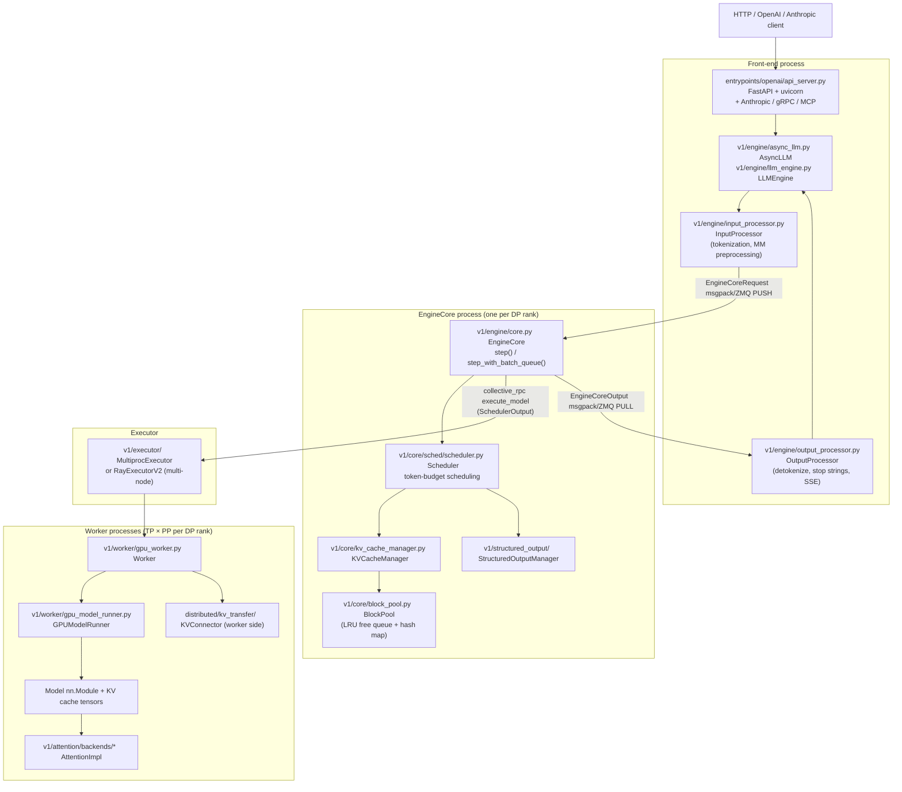

# vLLM V1: The Reference Production Engine

**After reading this chapter, the reader will be able to:**

- Trace a request through the vLLM V1 process split (front-end / EngineCore / Worker) and explain why the EngineCore process boundary exists
- Describe the token-budget scheduler's model of a step: how it allocates KV budget, handles chunked prefill, and makes preemption decisions
- Explain hash-chained prefix caching: the key structure, how blocks are chained by content hash, and the LRU eviction policy
- Read the KVConnector abstraction and describe how it decouples the engine from disaggregated transfer backends (NIXL, Mooncake, LMCache, P2P)
- State which attention backend (FA-3 vs FA-4) vLLM V1 selects for Hopper vs Blackwell and why
- Describe vLLM's LoRA serving (Punica-based SGMV kernels, adapter slots, rank-sorted batching) and its speculative decoding integration

---

## Introduction

vLLM is the de-facto reference engine for multi-tenant LLM serving on NVIDIA hardware. Since its public release in mid-2023, it has accumulated the largest open-source contributor base in the inference-systems space, and its core design decisions — PagedAttention block management, continuous batching over a token budget, hash-chained prefix caching — have been adopted, adapted, or consciously reacted against by every production engine that followed. TensorRT-LLM's paged-KV implementation mirrors vLLM's block layout. SGLang adopted the same continuous-batching discipline before diverging on prefix caching (using a radix tree instead of chained hashes). The cluster orchestrators at major cloud providers use vLLM's scheduler as a baseline when benchmarking in-house alternatives, and several have shipped vLLM directly to production for general-purpose endpoints without modification. This influence is not coincidence: vLLM was the first system to combine PagedAttention memory management ([arXiv:2309.06180](https://arxiv.org/abs/2309.06180)) with continuous batching in open-source form, and the combination proved so effective at GPU utilization that it set the baseline all subsequent engines are measured against.

The V1 rewrite, which became the default engine in early 2025, was motivated by accumulating structural debt in the V0 architecture. V0 maintained separate "prefill" and "decode" states in the scheduler, which required distinct code paths for admission, memory accounting, and batching. Each new feature — chunked prefill, speculative decoding, multi-modal inputs, LoRA — had to be threaded through both code paths, and interaction bugs between them were common. The V0 async executor, which attempted to overlap Python scheduling with GPU execution inside a single process, made reasoning about correctness harder because Python's GIL created implicit serialization that conflicted with the intended async model. The result was a codebase that was technically correct but increasingly difficult to extend without introducing subtle ordering bugs.

V1 resolved both issues at once. The process split (described in Part 1) moved scheduling to a dedicated process whose only job is to run the step loop at GPU cadence, free of front-end GIL pressure. The token-budget model (Part 2) replaced the dual-state scheduler with a unified model in which every request — whether it is mid-prefill, decoding, or waiting for speculative draft verification — is described by a single number: `num_computed_tokens`. Chunked prefill became a cap on that number per step rather than a separate scheduling phase. Speculative decoding became a lookahead extension to the same budget. The simplification removed thousands of lines of scheduling logic and made the system amenable to the additional axes (EP, DBO, PCP/DCP, KVConnector) that followed.

The V1 architecture also positioned vLLM for the disaggregated-serving era. With the EngineCore isolated in its own process and communicating with the front-end via ZMQ, it is straightforward to run multiple EngineCore instances — one per data-parallel rank — under a single API server, or to replace in-process KV transfer with a remote connector that pulls KV blocks from a separate prefill cluster. The KVConnector abstraction, described in Part 6, is the mechanism that makes this possible without touching the scheduler. The rest of this chapter traces all components in order: process topology, GPUModelRunner, scheduler, KV cache, attention selection, distributed runtime, disaggregated serving, LoRA, speculative decoding, quantization/compilation, multimodal, structured output, and key design trade-offs.

---

## Part 1: Process Architecture and IPC

vLLM V1 runs as three logical process tiers. A single **front-end process** owns the HTTP surface, tokenization, and output post-processing. One **EngineCore process** per data-parallel rank owns the scheduler and KV cache state machine. One **worker process** per GPU owns the model weights, KV cache tensors, and attention kernels.



### Why the EngineCore process boundary exists

The front-end process handles HTTP parsing, tokenization (which involves large vocabularies and regex-based stop strings), multimodal preprocessing, and streaming detokenization — work that is GIL-bound and latency-sensitive relative to the request, not the batch. If this work were colocated with the scheduler, any stall in the Python HTTP stack would delay the schedule step. Conversely, the scheduler's step loop must run at GPU cadence, ideally completing before the current forward pass finishes so the next batch is ready without bubbles.

The second motivation is data-parallel scaling. Each DP rank needs its own scheduler and KV cache manager, because they track per-replica request state. With the EngineCore isolated in a separate process, adding a DP replica requires spawning another EngineCore process — no front-end code changes. The `Coordinator` (`vllm/v1/engine/coordinator.py`) aggregates the `has_unfinished` flags across all DP EngineCore processes and injects dummy batches to keep collective operations aligned across ranks that would otherwise stall waiting at a barrier.

The ZMQ + msgpack channel between front-end and EngineCore carries two types. `EngineCoreRequest` (front-end → EngineCore) contains token ids, sampling parameters, LoRA request id, and multimodal data content hashes. `EngineCoreOutput` (EngineCore → front-end) contains sampled token ids, finish reason, logprobs, and KV event notifications. Both are flat msgpack-serializable dataclasses — no shared memory, no Python object graphs — which means the front-end and EngineCore can be on different NUMA nodes or even (with some latency cost) different physical machines.

The EngineCore–Executor channel is different: `collective_rpc(method, args)` is a synchronous fan-out to all worker processes via `MultiprocExecutor` (shared-memory message queues, `vllm/distributed/device_communicators/shm_broadcast.py`) or Ray actors (`RayExecutorV2`). The executor sends a `SchedulerOutput` — a richer object containing block tables, token arrays, KV connector metadata, and speculative draft tokens — and receives a `ModelRunnerOutput`.

### GPUModelRunner: the hot loop

`vllm/v1/worker/gpu_model_runner.py::GPUModelRunner` is the component that actually executes each forward pass and is the hottest code path in the entire system. It holds:

- The persistent `InputBatch` (`vllm/v1/worker/gpu_input_batch.py`): a GPU-resident data structure that is updated incrementally each step from the `SchedulerOutput` delta. Rather than constructing the full input arrays from scratch each step, the runner applies only the changes described in `CachedRequestData` (new tokens, new block ids). This amortizes the O(batch × seq_len) construction cost over many steps.
- The block table tensors: mapping from (request, block_index) to physical block id, updated as the KV cache manager allocates new blocks.
- `AttentionMetadataBuilder` instances for each attention backend: convert the block table and token counts into the per-backend attention metadata (slot mapping, query_start_loc, seq_lens) used by `AttentionImpl.forward()`.
- The `PunicaWrapperGPU` for LoRA batch matmuls (Part 7).
- The KV connector mixin (`kv_connector_model_runner_mixin.py`) that calls `start_load_kv()` / `wait_for_layer_load()` around each transformer layer.
- The CUDA-graph dispatcher (`CudagraphDispatcher`) that selects the right graph mode for each batch (Part 9).

The per-step execution order inside `GPUModelRunner.execute_model()`:

1. Update `InputBatch` with the delta from `SchedulerOutput`.
2. Build attention metadata (slot mapping, block table, query positions).
3. Call KV connector `start_load_kv()` to initiate any pending remote KV pulls.
4. For each transformer layer: `wait_for_layer_load(layer)` (sync remote KV if needed), then run the attention and FFN sublayers.
5. Run the sampler; if speculative decoding, run the proposer on the target's hidden states.
6. Call KV connector `wait_for_save()` if this is a prefill node pushing KV to a remote store.
7. Return `ModelRunnerOutput` to `EngineCore`.

The CUDA-graph path for uniform decode replaces steps 2–5 with a graph replay that avoids Python overhead entirely. The graph was captured once at warmup for each canonical batch size; at replay time the input tensors are written in-place and the graph is launched as a single CUDA event.

### Request states and the EngineCoreClient

From the front-end's perspective, every live request passes through the following states tracked inside `AsyncLLM` / `LLMEngine`:

1. **Tokenized** — `InputProcessor` has tokenized the text, preprocessed any multimodal inputs, and validated sampling params. An `EngineCoreRequest` dataclass is assembled and sent via ZMQ PUSH to the EngineCore.
2. **Queued** — EngineCore has received the request and added it to the waiting queue.
3. **Running** — the scheduler has admitted the request; its KV blocks are allocated; it is receiving tokens on each step.
4. **Streaming** — `OutputProcessor` is receiving `EngineCoreOutput` messages containing new token ids; it detokenizes incrementally and pushes SSE events or response chunks to the client.
5. **Finished** — stop condition triggered; the request is removed from the scheduler and its KV blocks are freed (non-shared) or ref-count decremented (shared prefix blocks).

`EngineCoreClient` (`vllm/v1/engine/core_client.py`) wraps the ZMQ channel with a `make_client(multiprocess_mode, asyncio_mode, ...)` factory that returns an appropriate client class: an in-process client for the single-worker development path, a synchronous multiprocess client for `LLMEngine`, an async multiprocess client for `AsyncLLM`, and a DP-coordinator-aware client when multiple EngineCore processes are running. All clients expose the same `add_request` / `abort_request` / `get_output` interface so neither `LLMEngine` nor `AsyncLLM` needs to know whether the EngineCore is in-process or cross-process.

### The EngineCore step loop

`EngineCore.step()` (`vllm/v1/engine/core.py`) is the innermost loop that runs at GPU-forward-pass cadence:

1. If no requests are pending, return immediately.
2. `scheduler_output = scheduler.schedule()` — allocates KV blocks, chunks prefills, sets lookahead slots for speculative decoding. This is the critical path discussed in Part 2.
3. `future = model_executor.execute_model(scheduler_output, non_block=True)` — dispatches the forward pass asynchronously.
4. `grammar_output = scheduler.get_grammar_bitmask(scheduler_output)` — builds structured-output vocabulary bitmasks in a thread pool, in parallel with the GPU forward.
5. `model_output = future.result()` — waits for the forward pass; if sampling was deferred (pending grammar bitmask), calls `model_executor.sample_tokens(grammar_output)`.
6. Drain any in-flight abort requests (`_process_aborts_queue`).
7. `engine_core_outputs = scheduler.update_from_output(scheduler_output, model_output)` — advances per-request state, reconciles speculative drafts, caches completed prefix blocks.
8. Return outputs and a "model executed" flag to the ZMQ output loop.

When pipeline parallelism is enabled (`PP > 1`) or when the executor sets `max_concurrent_batches > 1`, `step_fn` is replaced by `step_with_batch_queue()`. This maintains a deque of in-flight `(future, scheduler_output)` pairs sized to fill all pipeline stages simultaneously: while stage $k$ processes batch $n$, stage $k+1$ is processing batch $n-1$, and the scheduler prepares batch $n+1$ on the CPU. Without this batching queue, PP would run at a fraction of peak throughput due to pipeline bubbles.

The `AsyncScheduler` (`vllm/v1/core/sched/async_scheduler.py`) is a `Scheduler` subclass that loosens the strict FCFS scheduling invariant to allow preparing the next batch before the current step's outputs are fully observed. This is enabled by `async_scheduling=True` in `SchedulerConfig` and requires careful invariant tracking for stop-string detection and speculative-decode rejection accounting.

---

## Part 2: The Token-Budget Scheduler

The scheduler (`vllm/v1/core/sched/scheduler.py`) is the most important component in vLLM V1 to understand deeply. Everything else — attention backends, prefix caching, speculative decoding — contributes to throughput or latency margins, but the scheduler's decisions directly determine which requests make progress on every step and how fairly resources are distributed.

### The token-budget model

V1 discards the prefill/decode dichotomy at the scheduling level. There is no separate "prefill queue" and "decode queue." Every request is described by two numbers:

- `num_computed_tokens`: how many of its input tokens have already been processed and whose KV has been written to cache.
- `num_tokens_with_spec`: how many tokens the request needs to advance in the current step — equal to the full input length for a freshly admitted request, equal to $1 + \text{num\_draft\_tokens}$ for a decoding request with active speculative proposals.

At each step the scheduler draws from a **token budget** of at most `max_num_scheduled_tokens` tokens across all requests simultaneously. It assigns tokens to requests until the budget is exhausted, treating a 1000-token chunked-prefill contribution and a 1-token decode contribution identically from a budget-accounting perspective. This unification is the key insight of the V1 design: chunked prefill and speculative decoding are the same code path — each request simply has `num_tokens_with_spec − num_computed_tokens` tokens left to process, regardless of whether it is mid-prefill or mid-decode.

The `long_prefill_token_threshold` parameter caps any single request's per-step token contribution, implementing Sarathi-Serve-style chunked prefill (Agrawal et al., [arXiv:2403.02310](https://arxiv.org/abs/2403.02310)). Without this cap, a single long-context prompt could monopolize the entire token budget for many consecutive steps, causing head-of-line blocking on decode requests and unbounded first-token latency for other queued requests.

### Two-pass scheduling algorithm

**Pass 1 — running requests.** The scheduler iterates over the currently running set. For each request:

1. Compute `num_new_tokens = num_tokens_with_spec + num_output_placeholders − num_computed_tokens`. The `num_output_placeholders` term accounts for positions reserved for speculative draft tokens that have been committed to the block table but not yet verified.
2. Cap `num_new_tokens` by `long_prefill_token_threshold`, by the remaining step budget, by `max_model_len − 1`, and by any block-alignment constraints (Mamba models require token counts aligned to their SSM block size).
3. If the request has multimodal inputs not yet encoded, call `_try_schedule_encoder_inputs` to attempt reserving encoder compute budget. If the encoder budget is exhausted, the request may be deferred.
4. Call `kv_cache_manager.allocate_slots(request, num_new_tokens, num_lookahead_tokens)`. The `num_lookahead_tokens` are future write targets for EAGLE/MTP draft slots — they must be pre-allocated before the forward pass runs so the drafter can write to them.
5. If allocation fails because the free-block pool is exhausted, the scheduler must **preempt** a running request. Under `SchedulingPolicy.PRIORITY`, it evicts the running request with the lowest priority value (using arrival time as a tiebreak). Under `SchedulingPolicy.FCFS`, it evicts the most recently added running request. The evicted request's KV blocks are freed (or, if swap is enabled, copied to CPU), and it reverts to WAITING state to be re-admitted in a later step.

**Pass 2 — waiting requests.** The scheduler walks the waiting queue, which is a `heapq` sorted by `(priority, arrival_time)` under `SchedulingPolicy.PRIORITY` or a FIFO deque under `SchedulingPolicy.FCFS`. For each candidate:

1. Call `kv_cache_manager.get_computed_blocks(request)` to find the longest local prefix-cache hit. This is a hash lookup described in Part 3.
2. If a KVConnector is attached (disaggregated serving), call `connector.get_num_new_matched_tokens(request, num_local_hits)`. This may return additional externally-cached tokens from a remote prefill node. If the external load is not yet complete, the connector sets a `WAITING_FOR_REMOTE_KVS` flag and the request is shelved into `skipped_waiting` until a later step's connector check reports completion.
3. Check that multimodal encoder budget (`max_num_encoder_input_tokens`) and the LoRA slot limit (`max_loras`) allow admission. If not, skip the request for this step.
4. Compute the effective new-token count: the tokens to actually allocate is `tokens_needed − prefix_hit − connector_hit`, capped by the remaining budget.
5. Call `allocate_slots` for the new tokens plus lookahead. If allocation fails, stop admitting new requests for this step (rather than preempting a running request).
6. Add to the scheduled set; subtract from the remaining step budget; move from WAITING to RUNNING.

The full algorithm in pseudocode form:

```
# Inputs
budget = max_num_scheduled_tokens
running_requests = sorted by priority (or FCFS order)
waiting_queue = heapq by (priority, arrival_time)

# ── Pass 1: running requests ──────────────────────────────────────────────
for req in running_requests:
    new_tokens = req.num_tokens_with_spec + req.output_placeholders
                 - req.num_computed_tokens
    new_tokens = min(new_tokens,
                     long_prefill_token_threshold,
                     budget,
                     max_model_len - 1)
    # Schedule encoder inputs for multimodal models
    encoder_ok = try_schedule_encoder_inputs(req)
    if not encoder_ok:
        continue  # defer this request until encoder budget frees up

    # Attempt KV allocation including lookahead slots for spec decode
    allocated = kv_cache_manager.allocate_slots(
        req, new_tokens, num_lookahead_tokens=req.spec_lookahead)
    if not allocated:
        victim = lowest_priority_running_request()
        preempt(victim)  # free blocks, move victim to WAITING
        # retry allocation for req with freed blocks
        allocated = kv_cache_manager.allocate_slots(
            req, new_tokens, num_lookahead_tokens=req.spec_lookahead)
    if allocated:
        schedule(req, new_tokens)
        budget -= new_tokens

# ── Pass 2: waiting requests ──────────────────────────────────────────────
for req in waiting_queue:
    if budget == 0:
        break
    # Local prefix-cache hit
    prefix_tokens = kv_cache_manager.get_computed_blocks(req)
    # Remote connector hit (P/D disagg, LMCache, CPU offload)
    connector_tokens = connector.get_num_new_matched_tokens(req, prefix_tokens)
    if connector_tokens is WAITING_FOR_REMOTE:
        park_as_skipped(req)
        continue
    # Resource checks
    if not encoder_budget_ok(req) or not lora_slots_ok(req):
        continue
    # Tokens to allocate this step
    new_tokens = min(tokens_needed(req) - prefix_tokens - connector_tokens,
                     long_prefill_token_threshold, budget)
    allocated = kv_cache_manager.allocate_slots(
        req, new_tokens, num_lookahead_tokens=0)  # no spec yet at admission
    if not allocated:
        break  # pool exhausted; stop admitting
    admit_to_running(req)
    budget -= new_tokens
```

### Preemption strategies

Two preemption strategies are available via `EngineConfig.preemption_mode`:

- **Recompute**: the victim request's KV blocks are freed entirely. When re-admitted, the request recomputes its KV from the token ids. This is cheaper in memory but adds TTFT latency for the re-admitted request.
- **Swap**: the victim request's GPU KV blocks are copied to CPU swap space. Re-admission copies them back. This preserves GPU memory at the cost of PCIe bandwidth. For large requests the swap latency can exceed recompute latency, so the optimal strategy is workload-dependent.

In practice, the prefix cache mitigates recompute cost: if the evicted request had a long shared prefix, re-admission will hit the prefix cache and avoid recomputing those blocks.

### The SchedulerOutput dataclass

`Scheduler.schedule()` returns a `SchedulerOutput` (`vllm/v1/core/sched/output.py`) that is the primary interface between the scheduler and the executor:

- `scheduled_new_reqs: list[NewRequestData]` — requests being admitted for the first time; carry full sampling params, token ids, and block assignments.
- `scheduled_resumed_reqs` — requests returning from WAITING after preemption; need their KV state re-established.
- `scheduled_cached_reqs: CachedRequestData` — already-running requests continuing this step; carry token deltas, block ids per KV group, and updated `num_computed_tokens`.
- `num_scheduled_tokens: dict[req_id, int]` — per-request token count for this step; drives the worker's token-array construction.
- `total_num_scheduled_tokens` — the step's total token footprint; used by the worker to size the input batch.
- `scheduled_encoder_inputs` — multimodal encoder tasks to run in this step.
- `scheduled_spec_decode_tokens` — the draft token ids for speculative-decoding requests; carried to the worker so the draft tokens can be appended to the model input.
- `kv_connector_metadata: KVConnectorMetadata` — per-step KV transfer instructions assembled by the scheduler-side connector.
- `pending_structured_output_tokens` — signals whether to defer sampling until grammar bitmasks are ready.

The `CachedRequestData` in particular carries only the *delta* from the previous step — the new block ids allocated since the last schedule call. The worker maintains a persistent `InputBatch` (`vllm/v1/worker/gpu_input_batch.py`) that it updates incrementally, avoiding O(batch × seq_len) copies on every step.

### `update_from_output`

After the worker returns its `ModelRunnerOutput`, `Scheduler.update_from_output` closes the step loop:

- Increments `num_computed_tokens` for each scheduled request.
- Appends sampled output tokens and checks stop conditions: `max_tokens`, stop strings (regex and exact), EOS token, `min_tokens` floor.
- For speculative decoding: reads the rejection-sampler's accept count and bonus token, rolls back KV slots for rejected draft positions (via block-table truncation), and updates the per-request draft token list for the next step's proposer.
- Calls `kv_cache_manager.cache_blocks(request)` on newly completed full blocks, inserting them into the prefix-cache hash map so future requests sharing this prefix skip recomputation.
- Builds the `EngineCoreOutputs` list sent back to the front-end via ZMQ.

### Scheduling policy and SLO knobs

- `SchedulingPolicy.FCFS`: first-come-first-served; lowest TTFT variance for homogeneous traffic.
- `SchedulingPolicy.PRIORITY`: priority-aware; `LoRARequest.lora_int_id` and application-level priority integers control which requests run and which are preempted. This is the policy used for multi-tier SLA enforcement (e.g. premium vs standard tiers in the same engine instance).
- `max_num_running_reqs`: hard cap on concurrent in-flight requests; bounds peak memory usage.
- `max_num_scheduled_tokens`: the step budget ceiling; the primary knob for trading prefill throughput against decode latency.

---

## Part 3: KV Cache Manager and Hash-Chained Prefix Caching

### Physical block layout

The KV cache is a single GPU buffer per layer of shape `(num_blocks, block_size, num_heads, head_dim)` where `block_size` defaults to 16 tokens. The `BlockPool` (`vllm/v1/core/block_pool.py`) owns a flat array of `KVCacheBlock` objects and two global data structures:

- `free_block_queue: FreeKVCacheBlockQueue` — a doubly-linked list of blocks with `ref_count == 0`, maintained in LRU order. Allocation pops from the front; blocks freed by a finishing request are appended to the tail. Blocks that are free but still hold valid prefix-cache content sit at the tail — they are the eviction candidates when new allocations are needed.
- `cached_block_hash_to_block: BlockHashToBlockMap` — a map from `BlockHashWithGroupId` to one or more `KVCacheBlock` objects. The multimap is necessary because hash collisions are theoretically possible; the implementation resolves collisions by storing multiple candidate blocks under the same hash key and performing exact token-id comparison at lookup time.

### Content-hash chaining

vLLM's prefix caching is hash-based, not tree-based. (SGLang uses a radix tree, `RadixAttention` [arXiv:2312.07104](https://arxiv.org/abs/2312.07104); vLLM chose chained block-level hashing as a simpler append-only structure with no tree rebalancing.) The hash of block $i$ in a sequence is:

$$h_i = \text{hash}(h_{i-1},\ \text{token\_ids}[i \cdot B : (i+1) \cdot B],\ \text{extra\_keys})$$

where $B$ is `block_size`, $h_0$ is a fixed sentinel, and `extra_keys` carries the LoRA adapter id, multimodal content hashes (the SHA-256 of the raw image bytes), and an optional per-tenant cache salt. Because $h_i$ depends transitively on all prior blocks via $h_{i-1}$, two sequences that share a common prefix of $L$ tokens produce identical hashes for all blocks fully covered by that prefix. The check is entirely content-driven — no explicit prefix-sharing API is required, and no tree traversal is needed to find the longest hit.

The key design consequence: if 1,000 concurrent requests all use the same 4,096-token system prompt (256 blocks at `block_size=16`), those 256 blocks are allocated once and shared among all 1,000 requests via reference-counted `KVCacheBlock` objects. The `ref_count` field prevents the shared blocks from appearing in the free queue; they will only be evicted once all referencing requests finish.

#### Hash algorithm choice

The supported algorithms are `sha256` (default), `sha256_cbor` (deterministic across Python versions, important for distributed cache coherence when multiple EngineCore instances share a remote prefix store), `xxhash`, and `xxhash_cbor`. The move to `sha256` as the default was a security decision: in a multi-tenant deployment, a prefix-cache poisoning attack via hash collision is a realistic threat at scale, and non-cryptographic hashes like xxhash provide insufficient collision resistance against adversarial inputs. The `cache_salt` per-tenant isolation field was introduced alongside the `sha256` default.

### Prefix-cache lookup and allocation

`KVCacheManager.get_computed_blocks(request)` calls `coordinator.find_longest_cache_hit(request.block_hashes, max_cache_hit_length)`. The `max_cache_hit_length` is `num_tokens − 1` — the last token always recomputes. This constraint ensures that logits for the final input token are always computed fresh, which is required for correct autoregressive sampling: the KV for the last token must be written by the current forward pass, not read back from cache.

`KVCacheManager.allocate_slots` (`vllm/v1/core/kv_cache_manager.py`) then arranges the block sequence as:

```
| computed (prefix hit) | ext_computed (connector hit) | new_tokens + lookahead |
  ^already in cache       ^from remote connector            ^to allocate now
```

Blocks in the prefix-hit region have their `ref_count` incremented. Blocks for the `ext_computed` region are allocated from the free pool as write targets for incoming remote KV (the connector will DMA into them). New-token blocks and lookahead blocks are allocated from the free pool. If the free pool is empty after exhausting the LRU eviction candidates, allocation fails and the scheduler must preempt.

### The `BlockHashType` struct

`vllm/v1/core/kv_cache_utils.py` defines `BlockHashType` as a named tuple `(hash_value: int, token_ids: tuple[int, ...], extra_keys: tuple)`. The `token_ids` field stores the actual token ids in the block alongside the hash, which is what enables collision resolution: two blocks with the same `hash_value` are distinguished by their `token_ids`. The `extra_keys` tuple carries LoRA id, multimodal hashes, and cache salt. The full tuple `(hash_value, token_ids, extra_keys)` is what is compared when resolving a hash map collision.

When computing `request.block_hashes` at admission time, `InputProcessor` iterates over the token sequence in chunks of `block_size` and computes the chain of `BlockHashType` objects. This computation happens once per request in the front-end process; subsequent steps only need to hash newly completed blocks (those whose `num_computed_tokens` just crossed a block boundary). The incremental hash approach means the hashing cost per step is $O(\text{num\_new\_full\_blocks})$ rather than $O(\text{total\_sequence\_length} / B)$.

### LRU eviction

When the free-block pool is exhausted, `_maybe_evict_cached_block` removes the front of `free_block_queue` (the LRU free block). If that block was in the prefix-cache hash map, it is removed from the map and a `BlockRemoved` `KVCacheEvent` is emitted. `KVCacheEvent`s are exposed via `EventPublisherFactory` so downstream observers — KV connectors, Prometheus metrics, external cache managers — can react. In particular, when `NixlConnector` observes a `BlockRemoved` event for a block it previously pushed to the remote store, it invalidates the corresponding remote entry.

The LRU ordering within the free queue ensures that recently freed blocks — which are more likely to be referenced again by new requests sharing the same prefix — survive longer. A block freed by a request that just finished is appended to the tail of the free queue; it will only be evicted if all older free blocks have already been consumed by new allocations. This is the standard LRU invariant applied at block granularity.

### Hybrid KV cache manager

Models that mix attention types in a single forward pass — Mamba + full attention (Jamba, Bamba), sliding-window + full attention (Gemma 2/3, Llama 4), MLA + sparse (DeepSeek V3) — require different KV layouts per layer type. The hybrid manager (`vllm/v1/core/kv_cache_coordinator.py`) resolves this by computing a uniform **page size**:

$$\text{page\_size} = \text{block\_size} \times \text{num\_layers\_in\_group} \times \text{kv\_hidden\_size}$$

and assigning multiple sub-blocks per layer to keep page sizes equal across groups. Per-type logic lives in `vllm/v1/kv_cache_interface.py` via the `SlidingWindowSpec`, `MambaSpec`, and `AttentionSpec` descriptor classes. This design allows a model with both full-attention layers (needing large KV per token) and sliding-window attention layers (needing small KV per token) to share the same block pool with uniform allocation granularity.

### Tiered CPU offload

`vllm/v1/kv_offload/` adds a CPU-tier offload beneath the GPU block pool. When GPU blocks are evicted by the LRU policy, they can be copied to a CPU DRAM buffer managed by `OffloadingConnector` rather than discarded. Re-admission then copies them back over PCIe, which is faster than recomputation for large blocks when the recompute cost exceeds the PCIe transfer cost. The CPU offload tier hooks into the same KVConnector framework as remote P/D transfer, making it composable via `MultiConnector`.

For the broader prefix-caching landscape across engines, see [§10/07](../10-engine-core/07-prompt-prefix-caching.md).

---

## Part 4: Attention Backend Selection

### The backend registry

Backend selection happens once at engine startup via `vllm/v1/attention/selector.py::get_attn_backend()`. The function builds an `AttentionSelectorConfig` named-tuple (capturing head size, dtype, KV cache dtype, MLA flag, sparse flag, sink attention flag, and the `VLLM_BATCH_INVARIANT` environment variable), then queries `current_platform.get_attn_backend_cls()`. On CUDA, this dispatches to `vllm/platforms/cuda.py::CudaPlatformBase.get_attn_backend_cls`.

If the user pinned `--attention-backend`, the platform validates the request via `backend_class.validate_configuration()` (checks head size, dtype, device capability, block size, MLA requirements, sparse support). Otherwise it iterates a priority list and picks the first valid entry. The backend enum lives in `vllm/v1/attention/backends/registry.py::AttentionBackendEnum`.

Default priorities differ by hardware generation and model type:

| Hardware | Model type | Priority order |
|---|---|---|
| Hopper / Ada / Ampere | Non-MLA | FLASH\_ATTN → FLASHINFER → TRITON\_ATTN → FLEX\_ATTENTION → TURBOQUANT |
| Blackwell (SM 10.x) | Non-MLA | FLASHINFER → FLASH\_ATTN → TRITON\_ATTN → FLEX\_ATTENTION → TURBOQUANT |
| Non-Blackwell | MLA (DeepSeek) | FLASH\_ATTN\_MLA → FLASHMLA → FLASHINFER\_MLA → TRITON\_MLA |
| Blackwell | MLA (DeepSeek) | FLASHINFER\_MLA → CUTLASS\_MLA → FLASH\_ATTN\_MLA → FLASHMLA → TRITON\_MLA |

### FA-3 vs FA-4 on Hopper vs Blackwell

The `FLASH_ATTN` backend (`vllm/v1/attention/backends/flash_attn.py`) resolves the actual FlashAttention version at runtime via `fa_utils.get_flash_attn_version()`. On Hopper (SM 9.0), it selects FA-3 from the `flash_attn` package. On Blackwell (SM 10.x), it selects FA-4 from `flash_attn_4`. This version dispatch was consolidated into `get_flash_attn_version()` in commit `2228fe6`.

The reason Blackwell requires FA-4 rather than FA-3 is architectural. FA-3 was engineered around Hopper's TMA (Tensor Memory Accelerator) + WGMMA + warp-specialization model, exploiting Hopper-specific instructions for async data copy and matrix multiplication. Blackwell introduces `tcgen05` tensor-core instructions and TMEM (tensor memory), which provide a different and asymmetric hardware scaling — Blackwell's TMEM organization makes FA-3's pipeline schedule suboptimal. FA-4 was rewritten in CuTe-DSL to express the Blackwell-native compute pattern. See [§10/01](../10-engine-core/01-attention-kernels.md) for the full hardware analysis.

On Blackwell, FlashInfer is the top-priority non-MLA backend because its BSR (Block-Sparse Register) tile format maps well to Blackwell's tile shapes and its async-prefetch pipeline was tuned for TMEM-style workflows before FA-4 shipped. This is a deliberate tuning choice, not a permanent architectural preference.

### The full backend roster

`vllm/v1/attention/backends/registry.py::AttentionBackendEnum` lists the available backends:

| Backend | Class | Use case |
|---|---|---|
| `FLASH_ATTN` | `flash_attn.FlashAttentionBackend` | FA-2/3/4 path; version selected by `fa_utils.get_flash_attn_version()` |
| `FLASHINFER` | `flashinfer.FlashInferBackend` | FlashInfer (Ye et al., MLSys 2025, [arXiv:2501.01005](https://arxiv.org/abs/2501.01005)); BSR paged layout |
| `TRITON_ATTN` | `triton_attn.TritonAttentionBackend` | Pure-Triton unified attention kernel (`ops/triton_unified_attention.py`) |
| `FLEX_ATTENTION` | `flex_attention.FlexAttentionBackend` | torch FlexAttention (custom mask support) |
| `TREE_ATTN` | `tree_attn.TreeAttentionBackend` | Tree masks for EAGLE-2 / Medusa tree verification |
| `TURBOQUANT` | `turboquant_attn.TurboQuantAttentionBackend` | Quantized attention kernel |
| MLA family | `mla/flash_attn_mla`, `mla/flashmla`, `mla/flashinfer_mla`, `mla/cutlass_mla`, `mla/triton_mla` | DeepSeek MLA variants (DeepSeek-V2/V3, [arXiv:2405.04434](https://arxiv.org/abs/2405.04434), [arXiv:2412.19437](https://arxiv.org/abs/2412.19437)) |
| Mamba family | `mamba1_attn`, `mamba2_attn`, `gdn_attn`, `linear_attn`, `short_conv_attn` | Hybrid state-space model layers |
| ROCm family | `ROCM_ATTN`, `ROCM_AITER_FA`, `ROCM_AITER_UNIFIED_ATTN` | AMD MI-series backends |

The abstract interface lives in `vllm/v1/attention/backend.py`: `AttentionBackend`, `AttentionImpl`, `AttentionMetadataBuilder`, `CommonAttentionMetadata` (block_table, slot_mapping, query_start_loc, seq_lens). The model `Attention` layer (`vllm/model_executor/layers/attention/`) defers entirely to the selected backend's `AttentionImpl.forward()`.

### KV cache layout negotiation

Each attention backend may have a preferred KV cache layout — the ordering of dimensions in the `(num_blocks, block_size, num_heads, head_dim)` tensor. For example, FlashInfer's BSR format expects KV blocks in a specific striding that differs from FA-3's expected layout. The selector accounts for this via `backend_class.get_required_kv_cache_layout()`: if the selected backend requires a specific layout, the KV cache is allocated with that layout at startup, and all other backends that might be used in the same engine (e.g. `tree_attn` for speculative decoding) must accept the same layout or perform a reshape.

This layout negotiation happens once at engine initialization — before any memory is allocated — so there is no runtime reshape overhead. The tradeoff is that an operator cannot hot-swap attention backends after the engine starts.

### Custom backends via `AttentionBackendEnum.CUSTOM`

The backend registry supports a `CUSTOM` entry point: third-party kernel vendors (TurboQuant, AITER, TRT-LLM Gen, proprietary accelerator vendors) can register their attention backend via `register_backend(name, class_path)` without modifying vLLM core. The per-backend `validate_configuration()` method is the integration contract: the custom backend declares which head sizes, dtypes, device capabilities, and KV formats it supports, and the selector's validation pass checks these declarations before selecting the backend. This plugin-first design has allowed the attention backend roster to grow from 3 backends (FA-2, Triton, ROCM) in V0 to the current 15+ entries in V1 without proportional growth in the selector code.

### Cascade attention

`GPUModelRunner._compute_cascade_attn_prefix_lens` implements cascade attention for batches that share a long common prefix: the shared prefix part of attention is computed once, then per-request suffix attention is computed with a corrected running softmax state (the online-softmax recurrence applied at the batch level). This saves $O(N_{\text{prefix}} \cdot B_{\text{batch}})$ attention FLOPs when $B_{\text{batch}}$ requests share an $N_{\text{prefix}}$-token system prompt — a meaningful saving at typical system-prompt lengths of 1–8 K tokens.

---

## Part 5: Distributed Runtime

### Parallelism axes

vLLM V1 supports six parallelism axes, managed via `vllm/distributed/parallel_state.py`, which builds process groups via `init_world_group` and `init_model_parallel_group`:

**Tensor parallelism (TP)** splits attention heads and FFN weight columns across GPUs within a node. Each layer boundary issues a NCCL all-reduce. `vllm/distributed/device_communicators/cuda_communicator.py` implements a custom hybrid NCCL+SHM all-reduce (`use_custom_allreduce=True`) that avoids kernel-launch overhead for small all-reduces on intra-node topologies by using shared memory for tensors below a size threshold.

**Pipeline parallelism (PP)** partitions transformer layers across nodes in a ring topology. The `EngineCore` pairs PP with `step_with_batch_queue()` to keep all pipeline stages occupied without bubbles. PP scheduling utilities live in `vllm/v1/core/sched/pp_utils.py`.

**Data parallelism (DP)** runs multiple independent EngineCore instances, each owning a disjoint worker group. The `Coordinator` (`vllm/v1/engine/coordinator.py`) ensures cross-rank `has_unfinished` consensus and injects dummy batches to avoid hangs in collective operations that must run uniformly across all DP ranks.

**Expert parallelism (EP)** for MoE models assigns a disjoint subset of experts to each EP rank. Token dispatch and gather use all-to-all collectives via DeepEP or FlashInfer A2A backends. `vllm/distributed/eplb/` implements **Expert Parallel Load Balancing (EPLB)**: rather than a fixed expert assignment, EPLB maintains redundant expert copies and periodically rebalances the logical→physical expert mapping based on observed routing statistics. The rebalance is performed asynchronously by `eplb/async_worker.py` — the weight migration happens in the background without blocking inference steps. EPLB was designed for the DeepSeek-V3 / Kimi deployment pattern, where expert routing statistics are highly skewed and static EP assignment leads to severe load imbalance.

**Dual Batch Overlap (DBO)** overlaps MoE all-to-all communication with computation. `vllm/v1/worker/gpu_ubatch_wrapper.py::UBatchWrapper` and `vllm/v1/worker/ubatching.py::UBatchContext` split each step's batch into two microbatches, then ping-pong: while microbatch $A$'s expert dispatch all-to-all is in flight over the network, the GPU is computing the attention/FFN for microbatch $B$. The DBO scheduler lives at `vllm/v1/core/sched/dbo.py`. This is currently limited to DeepEP-capable EP configurations.

**Prefill/Decode Context Parallelism (PCP/DCP)** splits a long sequence's KV context across ranks during prefill (PCP, `get_pcp_group`) or decode (DCP, `get_dcp_group`), enabling long-context inference beyond what fits on a single GPU's memory. PCP is the context-parallel analog of sequence parallelism in training.

### Communication primitives

The `GroupCoordinator` class in `vllm/distributed/parallel_state.py` is the uniform interface over all process groups. Its methods map to NCCL collectives:

- `all_reduce` / `all_gather` / `reduce_scatter` — standard tensor-parallel collectives.
- `send` / `recv` — point-to-point for pipeline stages.
- `dispatch` / `combine` — MoE all-to-all for expert routing (backed by DeepEP or FlashInfer A2A).
- `dispatch_router_logits` — routes the router logit tensor to the correct EP rank before expert computation.

For TP all-reduce, the custom hybrid implementation (`cuda_communicator.py`) first checks whether all TP ranks share a NUMA node and whether the tensor is small enough for the SHM fast path. If both conditions hold, the reduce is done via shared memory without going through the NCCL device driver — bypassing hundreds of microseconds of kernel-launch overhead per layer boundary. This is material at high TP degrees (TP=8) where each forward pass crosses $2 \times \text{num\_layers}$ all-reduce barriers.

For PP send/recv, `step_with_batch_queue()` keeps the pipeline filled by overlapping batch $n$'s execution on stage $k$ with batch $n-1$'s execution on stage $k+1$. The batch queue depth equals the number of pipeline stages, so ideally zero stages ever idle. In practice, bubble fraction is $\frac{P-1}{P + (B-1)}$ where $P$ is the number of pipeline stages and $B$ is the number of microbatches; the scheduler's variable chunked-prefill sizes make $B$ effectively larger than 1 for most serving workloads, because a single incoming batch may contain several chunked-prefill fragments that each consume a pipeline slot. The `AsyncScheduler` further reduces bubbles by preparing the next batch on the CPU while the current batch is still in-flight on the GPU, hiding scheduler latency behind compute time.

The PP topology is a ring: the last stage sends its activation to the first stage for the next layer group, and the final layer group's output goes directly to the sampler on the last stage. In-flight pipeline state (activations between stages) is held in GPU DRAM; the per-stage memory overhead is the intermediate activation tensor size times the pipeline queue depth. For large models with many PP stages, this can be several hundred MB per concurrent batch.

### Executor types

| Executor | When used | Notes |
|---|---|---|
| `UniProcExecutor` | Single GPU, no parallelism | In-process worker; zero IPC overhead; used for development |
| `MultiprocExecutor` | Single-node TP/PP (default) | One OS process per worker via `multiprocessing`; SHM broadcast for model execution |
| `RayExecutorV2` | Multi-node (default with Ray) | Ray actors per worker; became the default in 2026 via commit `f04fd16` |
| `ExecutorWithExternalLauncher` | SLURM / torchrun | External process manager handles rank assignment |

All executor types expose the same `collective_rpc(method, args)` interface. Custom third-party executors can plug in by providing their fully qualified class name to `--distributed-executor-backend`. This design lets cluster operators with proprietary networking stacks (InfiniBand fabrics, custom NCCL substitutes) swap in their own executor without modifying vLLM core.

### Elastic EP

`vllm/distributed/elastic_ep/` allows changing the EP degree at runtime without restarting the engine (`VLLM_ELASTIC_EP_SCALE_UP_LAUNCH` environment variable). A cluster can start with EP=8 for baseline traffic and scale to EP=16 under load spikes by migrating expert weight shards to newly provisioned GPUs using the `vllm/distributed/weight_transfer/` framework. The same weight transfer framework supports RLHF weight updates and sleep-mode (reduced-footprint standby) wake-up.

The EPLB policy (`vllm/distributed/eplb/policy/`) is pluggable. The default policy (`DefaultEplbPolicy`) follows the DeepSeek-V3 approach: accumulate per-expert token-count statistics over a window of steps, then solve an assignment problem that minimizes the maximum load across EP ranks by cloning over-loaded experts and retiring under-utilized ones. The rebalance is triggered asynchronously by `eplb/async_worker.py`, which runs weight migration on a background thread pool without blocking the inference loop. The frequency of rebalancing is a trade-off: too frequent and the migration bandwidth cost eats into throughput; too infrequent and routing imbalance persists across load-pattern shifts.

---

## Part 6: Disaggregated Serving and KVConnector

The `KVConnector` abstraction (`vllm/distributed/kv_transfer/kv_connector/v1/base.py::KVConnectorBase_V1`) is the mechanism that keeps disaggregated prefill/decode orthogonal to the scheduler. Rather than baking P/D disaggregation into the scheduling algorithm, vLLM treats KV transfer as an observable side effect: the scheduler sees "how many tokens are already computed remotely" but does not directly manage the transfer.

### The connector interface

Each connector implementation provides two co-bound roles accessed via `KVConnectorRole` enum:

**Scheduler-side** (`KVConnectorRole.SCHEDULER`): called inside `scheduler.schedule()` and `scheduler.update_from_output()`:
- `get_num_new_matched_tokens(request, num_local_hits)` — returns how many additional tokens can be credited as "already computed." May set `load_kv_async=True` to park the request as `WAITING_FOR_REMOTE_KVS`.
- `update_state_after_alloc(request, blocks, num_external)` — informs the connector of the block allocation decision so it can schedule the pull.
- `update_connector_output(...)` — processes the worker's connector output to update load completion state.
- `request_finished(request)` — on the prefill side, triggers pushing all completed KV blocks to the transfer fabric.
- `take_events()` — yields `KVCacheEvent` objects (block added, block removed) for downstream observers.

**Worker-side** (`KVConnectorRole.WORKER`): called by `GPUModelRunner` around the forward pass:
- `start_load_kv()` — initiates async pull of remote KV blocks into the allocated GPU buffer slots.
- `wait_for_layer_load(layer_index)` — synchronizes before the model consumes layer $i$'s KV, allowing transfer and compute to overlap layer-by-layer.
- `save_kv_layer(layer_index, kv_tensor)` — on the prefill node, initiates push of completed layer $i$ KV to the transfer fabric while the forward pass continues to later layers.
- `wait_for_save()` — synchronizes on push completion before the request is finalized.
- `build_connector_worker_meta(scheduler_output)` — builds the per-step `KVConnectorMetadata` bundle that `SchedulerOutput` carries to the worker.

### Concrete connectors

All connector implementations live in `vllm/distributed/kv_transfer/kv_connector/v1/`:

| Connector | Transport | Notes |
|---|---|---|
| `NixlConnector` (`nixl/`) | NVIDIA NIXL (RDMA / NVLink / NVSHMEM) | Default for high-performance P/D disaggregation in production |
| `MooncakeConnector` (`mooncake/`) | Moonshot AI KV pool ([arXiv:2407.00079](https://arxiv.org/abs/2407.00079)) | Used in Kimi production |
| `LMCacheConnector` / `LMCacheMPConnector` | LMCache hierarchical KV store | Cross-request KV reuse across nodes |
| `P2PConnector` (`p2p/`) | Direct NCCL peer-to-peer | Simpler alternative to NIXL within a cluster |
| `OffloadingConnector` (`offloading/`) | CPU DRAM | GPU→CPU→GPU tiering; wraps `vllm/v1/kv_offload/` |
| `MultiConnector` | Composed | Stacks connectors (e.g. CPU offload + NIXL); `SupportsHMA` marker enables Hierarchical Multi-Adapter composition |
| `HF3FSConnector` (`hf3fs/`) | Hugging Face 3FS distributed filesystem | KV persistence across sessions |
| `MoriIOConnector` (`moriio/`) | MoriIO transport | Alternate high-perf fabric |

`MultiConnector` with `SupportsHMA` (Hierarchical Multi-Adapter, commit `efdc956`) allows composing a local CPU offload tier beneath a remote NIXL tier: when GPU blocks are evicted by LRU, they go to CPU DRAM; if still needed by a re-admitted request, the CPU connector serves them; otherwise they may be fetched from the NIXL remote store. This creates a three-tier KV hierarchy (GPU → CPU → remote) analogous to what the OS memory hierarchy does for page tables.

### Request lifecycle with a connector

During Pass 2 of `Scheduler.schedule`, for each waiting request the scheduler queries `connector.get_num_new_matched_tokens()`. If the prefill node has already finished and pushed the KV for this request's prefix, the decode-side connector returns the full prefix length as externally matched; the scheduler skips allocating GPU blocks for those tokens and instead the worker pulls them at forward-pass time via `start_load_kv()` and `wait_for_layer_load()`. If the KV is not yet available, the request is parked and re-evaluated on the next step. When the worker's `KVConnectorOutput` signals completion, the scheduler promotes the request from `WAITING_FOR_REMOTE_KVS` back to running.

On the prefill side, `request_finished` triggers `save_kv_layer()` layer-by-layer as the forward pass proceeds, overlapping network push with compute on later layers. This layer-pipelined transfer means the decode node may start receiving KV for layer 0 while the prefill node is still computing layer 31.

Recent development (commit `3179e53`) added bi-directional P↔D KV transfers: the prefill node can also receive partial decode state that the decode node has already accumulated, enabling round-trip exchange that reduces idle time on both sides in high-throughput streaming workloads.

For disaggregation fundamentals and the P/D capacity-planning problem, see [§20](../20-distributed-inference/).

---

## Part 7: LoRA and Multi-Tenant Serving

### Adapter management

`vllm/lora/model_manager.py::LoRAModelManager` and `worker_manager.py::LRUCacheWorkerLoRAManager` implement a two-tier adapter store. Adapters are loaded from disk or an artifact store into CPU memory on demand, and promoted to GPU memory when a request referencing them is admitted to the scheduler. The GPU pool holds at most `max_loras` adapters simultaneously; LRU eviction from the GPU pool triggers a CPU→disk eviction only when CPU memory is also exhausted.

Plugin-based on-demand adapter download is supported via `vllm/lora/resolver.py` and the `vllm/plugins/lora_resolvers/` entry point, which allows operator-defined resolvers to fetch adapters from S3, Hugging Face Hub, or proprietary registries. Each `LoRARequest` carries a `lora_int_id` that the scheduler checks against `lora_config.max_loras` during Pass 2 admission. A batch will not admit a request for adapter $A$ if doing so would require evicting adapter $B$ currently in use by another scheduled request.

### Punica SGMV/BGMV kernels

The core of vLLM's batched LoRA execution is `vllm/lora/punica_wrapper/punica_gpu.py::PunicaWrapperGPU`, which implements per-request batched LoRA matmuls via Triton kernels in `vllm/lora/ops/triton_ops/`. The design follows the Punica paper (Chen et al., [arXiv:2310.18547](https://arxiv.org/abs/2310.18547)) and S-LoRA ([arXiv:2311.03285](https://arxiv.org/abs/2311.03285)):

**During decode** (all requests contribute exactly 1 token): the BGMV (batched grouped matrix-vector) kernel computes $x_r A_r$ for each request $r$ in a single kernel launch, where $A_r \in \mathbb{R}^{d \times k}$ is request $r$'s low-rank down-projection. A per-token adapter index tensor routes each token to the correct $A_r$ weight slice. The follow-up expand kernel computes $z_r B_r + \text{base\_output}_r$.

**During prefill** (requests have variable lengths): the SGMV (segmented grouped matmul) variant handles variable-length segments. The segmented kernel uses a prefix-sum of request lengths to compute the correct index range for each adapter's weight slice.

The key property is that all adapters in a batch are processed in a single kernel launch regardless of how many distinct adapters are present. There is no per-adapter kernel-launch overhead, which is what makes serving hundreds of LoRA adapters simultaneously on a single GPU practical.

```
lora_shrink_op.py:  x_r → x_r @ A_r   (down-project to rank k)
lora_expand_op.py:  z_r → z_r @ B_r   (up-project to output dim, add to base output)
```

`fused_moe_lora_op.py` and `fused_moe_lora_fp8_op.py` extend LoRA to MoE expert weight matrices, allowing adapters to target expert layers as well as dense projections. `lora_experts_mixin.py` in `fused_moe/` provides the MoE integration.

Memory cost: with `max_loras = 8` active adapters and `max_lora_rank = 64`, the GPU adapter weight store requires $8 \times 2 \times 64 \times d$ parameters per LoRA-targeted linear layer. For a 70 B model with $d = 8192$, this is approximately 8 × 2 × 64 × 8192 × 2 bytes (BF16) per LoRA-targeted layer ≈ 16 MB per targeted layer — a small fraction of the total model weight.

LoRA weights are loaded into pre-allocated GPU tensor slots at admission time. The slot assignment is tracked per LoRA id and persists for the duration of the adapter's GPU residency. When a new adapter is needed and the GPU pool is full, the LRU adapter is evicted (its slot is overwritten) and the new adapter's weights are DMA'd from CPU. This CPU→GPU transfer happens synchronously before the next step that needs the adapter, so there is at most one adapter transfer per step boundary. If multiple adapters are admitted simultaneously and all require GPU loading, transfers are serialized — a known bottleneck for workloads with very high adapter churn rates.

For the broader multi-tenant LoRA serving design space, see [§40](../40-multi-tenant/01-lora-serving.md).

---

## Part 8: Speculative Decoding

vLLM V1 integrates speculative decoding as a token-budget extension rather than a separate pipeline. In the scheduler, a running request with active draft tokens simply has `num_tokens_with_spec > 1`, and the `num_lookahead_tokens` pre-allocated by `allocate_slots` provide write targets for the drafter's KV. The verifier target model runs a single forward pass over the verified sequence concatenated with all draft tokens; `vllm/v1/sample/rejection_sampler.py` then accepts a prefix of the drafts and samples a "bonus" token at the first rejection point. Rejected draft tokens' KV slots are freed by truncating the block table to the last accepted position.

The speculative decoding pipeline across a single step:

1. `Scheduler.schedule` propagates `request.spec_token_ids` (set by the previous step's proposer) into `SchedulerOutput.scheduled_spec_decode_tokens` and reserves `num_lookahead_tokens` pre-allocated write targets.
2. The worker runs the target model over the combined `verified_tokens + draft_tokens` sequence, computing logits at each draft position.
3. `RejectionSampler.sample` (`vllm/v1/sample/rejection_sampler.py`) accepts draft token $k$ if the target distribution at position $k$ is compatible with the draft distribution (the standard speculative sampling criterion); on the first rejection, it samples a "correction" token.
4. `EngineCore.post_step` calls `model_executor.take_draft_token_ids()` to retrieve the proposer's next candidate set, then feeds them to `scheduler.update_draft_token_ids` for the following iteration.

The number of accepted tokens per step is variable: in the best case all $K$ draft tokens are accepted plus the bonus (net $K+1$ tokens from one forward pass); in the worst case only the bonus is accepted (net 1 token from one forward pass, same as without speculation). The scheduler's token budget must account for the full draft sequence even though some tokens will be rejected: it allocates KV for all $K$ positions up front and frees the tail on rejection.

The proposer implementations in `vllm/v1/spec_decode/` cover:

| Proposer | Method | Paper |
|---|---|---|
| `NgramProposer` | Prompt-lookup decoding; no extra model | Numba-jitted n-gram lookup |
| `EagleProposer` | EAGLE-1/2/3; draft head on target hidden states | [arXiv:2401.15077](https://arxiv.org/abs/2401.15077), [arXiv:2406.16858](https://arxiv.org/abs/2406.16858), [arXiv:2503.01840](https://arxiv.org/abs/2503.01840) |
| `MedusaProposer` | Multiple parallel LM heads on target | [arXiv:2401.10774](https://arxiv.org/abs/2401.10774) |
| `DraftModelProposer` | Classical small-target draft model | [arXiv:2211.17192](https://arxiv.org/abs/2211.17192), [arXiv:2302.01318](https://arxiv.org/abs/2302.01318) |
| `MTPProposer` | DeepSeek-V3 Multi-Token-Prediction heads | [arXiv:2412.19437](https://arxiv.org/abs/2412.19437) |
| `SuffixDecodingProposer` | Snowflake Arctic suffix decoding | [arXiv:2411.04975](https://arxiv.org/abs/2411.04975) |
| `DFlashProposer` | DFlash; vLLM-specific; stable CUDA-graph addresses | — |

EAGLE and MTP proposers use `pass_hidden_states_to_model=True` to share the target model's last hidden states with the drafter, running both in a single forward pass on the same worker. The drafter consumes the target's final hidden-state tensor to predict draft tokens: rather than a full forward pass through a separate small model, the drafter runs a lightweight autoregressive head on top of the already-computed target hidden states. This eliminates the small-model forward pass latency for EAGLE/MTP at the cost of slightly more complex weight management.

Tree-style verification for EAGLE-2 and Medusa uses `vllm/v1/attention/backends/tree_attn.py`, which supports an arbitrary tree mask without changing the scheduler's flat-lookahead interface. In tree speculation, the proposer generates a fan-out tree of candidate continuations (e.g. EAGLE-2 generates a breadth-first tree of width $w$ at depth $d$); the verifier evaluates all $w^d$ leaf candidates in a single forward pass using the tree mask to block attention across incompatible branches. The tree attention backend is selected automatically when the proposer sets a tree-shaped candidate structure; from the scheduler's perspective, the tree is still a flat array of $w^d$ lookahead tokens.

The `ngram_proposer` is the cheapest option: it uses Numba-jitted n-gram lookup in the prompt to propose draft tokens based on historical context without any model forward pass. For workloads with repetitive structure (code, structured documents, conversations that quote earlier content), n-gram acceptance rates of 50–80% are achievable with zero draft-model overhead. The GPU variant (`ngram_proposer_gpu.NgramProposerGPU`) avoids CPU→GPU transfer by running the lookup kernel directly on-device, which reduces the round-trip latency that would otherwise erode the net throughput gain at small batch sizes.

### The sampler

`vllm/v1/sample/sampler.py::Sampler` is the component that converts logits to token ids. It runs after the model forward pass inside the worker (or, if sampling is deferred for structured output, after `grammar_output` is ready). The sampler applies logit processors in order: repetition penalty, frequency penalty, presence penalty, temperature scaling, top-k and top-p filtering, min-p filtering, and any user-supplied logit-bias tensors. The output is a `SamplerOutput` containing sampled token ids, optional log-probabilities, and prompt-log-probability arrays.

When speculative decoding is active, the sampler does not run independently; instead `RejectionSampler.sample` handles both the draft acceptance decision and the bonus token sampling in a single fused call. The rejection sampler supports two modes: stochastic (standard speculative sampling criterion from [arXiv:2211.17192](https://arxiv.org/abs/2211.17192)) and greedy (accept only if the draft token matches the top-1 token; no random correction needed). The greedy mode is used when `temperature == 0` for all requests in the batch, which eliminates the random-correction overhead and maximizes acceptance rate for deterministic generation.

For the full speculative-decoding design space, see [§10/05](../10-engine-core/05-speculative-decoding.md).

---

## Part 9: Quantization and Compilation

### Quantization

The quantization registry (`vllm/model_executor/layers/quantization/__init__.py::QuantizationMethods`) lists over twenty supported schemes. Each maps to a `QuantizationConfig` subclass that builds quantized `LinearMethodBase` layers consumed by model definitions. The practically important configurations for NVIDIA hardware:

**FP8 W8A8** (`quantization/fp8.py`): per-tensor or per-token activation scaling with static or dynamic calibration. Runs on Hopper via CUTLASS scaled-mm (`kernels/linear/scaled_mm/cutlass.py`) or cuBLASLt. The `compressed-tensors` format (NeuralMagic / LLM Compressor, `quantization/compressed_tensors/`) supports W4A8, W4A16, and unstructured sparsity variants, and is the preferred pre-quantized checkpoint format for vLLM's production quantization pipeline.

**MXFP4 / NVFP4** (`quantization/mxfp4.py`): microscaled FP4 per the OCP MX standard. NVFP4 KV cache (`cache_dtype=nvfp4`, added in commit `947138b`) cuts KV memory by 4× versus FP16 for Blackwell deployments where the hardware can consume NVFP4 KV directly.

**GPTQ-Marlin / AWQ-Marlin** (`gptq_marlin.py`, `awq_marlin.py`): INT4 weight-only quantization with Marlin sparse-tiling kernels ([arXiv:2402.05137](https://arxiv.org/abs/2402.05137)) for W4A16 GEMMs on Ampere. On Hopper, the **Machete** kernel (`kernels/linear/mixed_precision/machete.py`) supersedes Marlin: it uses warp-specialized thread blocks tuned for H100's SM scheduling and achieves better utilization at the batch sizes typical in production serving.

**ModelOpt** (`quantization/modelopt.py`): NVIDIA TensorRT-Model-Optimizer formats, including NVFP4 Mixed and INT8 SmoothQuant. This is the pathway for checkpoints quantized by NVIDIA's official toolchain.

**Online quantization** (`quantization/online/`): apply quantization at load time via `--quantization=fp8_per_tensor` without a pre-quantized checkpoint. This trades checkpoint portability for per-deployment calibration flexibility. Online quantization inserts calibration passes during model loading; the resulting quantized weights are used directly without writing a new checkpoint.

**KV-cache quantization** (`quantization/kv_cache.py`): `cache_dtype` ∈ {`fp8`, `fp8_e5m2`, `fp8_e4m3`, `nvfp4`} reduces the KV buffer size independently of weight quantization. FP8 KV cuts KV memory by 2× versus BF16 with quality impact typically below 1% on standard benchmarks. NVFP4 KV cuts by 4×, but the quality impact is more workload-dependent. FP8 KV is the standard production choice for long-context serving; NVFP4 KV is primarily deployed on Blackwell hardware where the tensor cores can consume NVFP4 KV natively without dequantization overhead.

**Fused MoE quantization**: `vllm/model_executor/layers/fused_moe/` has dedicated quantized paths for expert GEMMs — `fused_marlin_moe.py`, `flashinfer_cutlass_moe.py`, `triton_deep_gemm_moe.py`, and `experts/cutlass_moe.py`. The `modular_kernel.py` framework composes prepare/dispatch/compute/combine stages so DBO can yield between microbatches in the middle of an expert GEMM sequence. Quantization of expert weights (W4A16 Marlin, W8A8 FP8) uses the same `QuantizationConfig` registry as dense layers, so new quantization schemes automatically apply to expert layers if they implement the `MoEMethodBase` interface.

### CUDA graphs and `torch.compile`

vLLM V1 uses `torch.compile` by default. `vllm/compilation/backends.py::VllmBackend` is the Inductor adapter; `vllm/compilation/partition_rules.py` defines piecewise-compilation rules that split the FX graph at attention boundaries (attention kernels are excluded from CUDA-graph capture because their shapes are variable during prefill). All compilation completes before any request is served — the engine blocks on `compile_or_warm_up_model()` at startup. Compiled artifacts are cached under `~/.cache/vllm/torch_compile_cache/` keyed by model config, parallelism config, dtype, and PyTorch version.

For CUDA-graph capture, `vllm/v1/cudagraph_dispatcher.py::CudagraphDispatcher` selects among four modes at runtime:

| Mode | When used |
|---|---|
| `FULL_AND_PIECEWISE` (default since v0.20) | Full graph for uniform decode; piecewise for mixed prefill batches |
| `FULL_DECODE_ONLY` | Full graph for decode only; used on dedicated decode replicas in P/D disaggregation |
| `FULL` | Full graph for all batch types |
| `NONE` | Eager mode; no CUDA graphs; for debugging |

The dispatcher identifies "uniform decode" by checking that `max_query_len == 1` (or `1 + num_spec_tokens` for speculative decoding). Capture runs once over a list of canonical batch sizes during warmup; replay eliminates kernel-launch overhead for the decode hot path. The encoder/ViT side has a separate capture path (`vllm/v1/worker/encoder_cudagraph.py`).

The `FULL_AND_PIECEWISE` default reflects a key observation: decode batches are shape-uniform (all requests contribute exactly 1 token), making them ideal CUDA-graph candidates; prefill batches are shape-variable (each request contributes a different number of tokens), making full-graph capture impractical. By dispatching to different graph modes based on batch shape, vLLM gets graph replay benefits on the highest-frequency case (decode) without sacrificing flexibility on the lower-frequency case (prefill).

For the full treatment of CUDA graphs and compilation, see [§10/08](../10-engine-core/08-cuda-graphs-compilation.md).

---

## Part 10: Multimodal Pipeline

Multimodal inputs — images, audio, video — flow through `vllm/multimodal/registry.py::MultiModalRegistry`, which dispatches to per-model `BaseProcessingInfo` factories registered in each model file under `vllm/model_executor/models/` (LLaVA, Qwen-VL, Pixtral, Llama 3.2 Vision, Phi-3.5-Vision, InternVL, DeepSeek-VL2, Whisper, Granite-Speech, and others). The front-end `Renderer` calls `MultiModalRegistry.create_processor()` to convert raw media bytes into either (a) placeholder token ids that mark where visual embeddings will be injected, or (b) the embeddings themselves, depending on the model's expected input format.

Vision encoders (ViT variants) run separately from the LLM backbone. Their forward pass consumes the raw image tensors and produces a sequence of visual tokens; these tokens are gathered and inserted into the LLM token sequence at the `<image>` placeholder positions before the transformer forward pass. The ViT forward pass is CUDA-graph captured separately (`vllm/v1/worker/encoder_cudagraph.py`), with its own set of canonical input shapes and graph instances.

The scheduler maintains two resource budgets and two caches for multimodal inputs:

- **Encoder compute budget** (`max_num_encoder_input_tokens`): limits how many raw image-token positions can be processed by the vision encoder in a single step. A batch that would exceed this budget defers some image inputs to later steps.
- **EncoderCacheManager** (`vllm/v1/core/kv_cache_manager.py`): caches encoder outputs (visual token embeddings) across steps. A request whose image was encoded on step $t$ does not re-run the ViT on step $t+1$ — the encoder output is retrieved from the encoder cache and inserted directly.

Multimodal prefix caching works automatically: the block hash for LLM KV blocks following an image placeholder includes the multimodal content hash (the SHA-256 of the raw image bytes). Two requests with the same image therefore share the LLM KV cache for the visual tokens without any application-level coordination. The `multimodal/evs.py` Encoder-Visit Selector manages which visual tokens to keep when the vision token budget is tight, providing a compression mechanism for high-resolution images.

For disaggregated multimodal serving, `vllm/distributed/ec_transfer/` provides the encoder-cache transfer analog of the KV connector framework. A vision encoder running on a dedicated GPU cluster pushes its output to the NIXL/Mooncake fabric; the LLM decode cluster's `ec_transfer` connector pulls it and injects it at the `<image>` position. The scheduler wires this through `Scheduler.ec_connector` and `_try_schedule_encoder_inputs`'s `external_load_encoder_input` path, following the same WAITING_FOR_REMOTE pattern as KV transfer.

---

## Part 11: Structured Output and Tool Calling

Production serving often requires the engine to constrain token sampling to a schema — JSON, a regex, a context-free grammar — so that the output can be parsed reliably downstream. vLLM V1 handles this via `vllm/v1/structured_output/__init__.py::StructuredOutputManager`, which owns one grammar backend instance per engine and coordinates per-request grammar state machines.

### Grammar backends

`SamplingParams.structured_outputs._backend` selects among four grammar backends:

| Backend | Library | Approach |
|---|---|---|
| `xgrammar` (`backend_xgrammar.py`) | XGrammar (Dong et al., [arXiv:2411.15100](https://arxiv.org/abs/2411.15100)) | Compiled grammar automata; very fast bitmask generation |
| `guidance` (`backend_guidance.py`) | llguidance (Microsoft Guidance) | Bytecode-interpreted grammar; supports Guidance-native schemas |
| `outlines` (`backend_outlines.py`) | Outlines (Willard & Louf, [arXiv:2307.09702](https://arxiv.org/abs/2307.09702)) | FSM-based vocabulary masking; original production structured-output approach |
| `lm-format-enforcer` (`backend_lm_format_enforcer.py`) | LM Format Enforcer | Incremental tokenizer-level masking |

### Scheduling interaction

Grammar compilation is expensive (parsing the JSON schema or regex, building the automaton). The `StructuredOutputManager` submits compilation to a `ThreadPoolExecutor` (capped at `(num_cpus + 1) // 2` workers) when a request is admitted. The request is held in state `WAITING_FOR_STRUCTURED_OUTPUT_GRAMMAR` until its grammar future completes — the scheduler will not advance it past the waiting queue until the grammar is ready.

Per-request `StructuredOutputGrammar` exposes:
- `fill_bitmask(token_ids, vocab_size)` — writes a `vocab_size`-bit mask where 0 = forbidden token; used as an additive $-\infty$ mask in the sampler.
- `accept_tokens(token_ids)` — advances the automaton state after sampling.
- `rollback(n)` — rolls back $n$ tokens; used when speculative decoding rejects draft tokens that advanced the grammar state.

`get_grammar_bitmask` is invoked inside `EngineCore.step()` between `schedule()` and `future.result()`, so bitmask construction runs in the CPU thread pool while the GPU is executing the forward pass. For large batches, bitmask filling is parallelized when the batch size exceeds `fill_bitmask_parallel_threshold` (default 128 requests).

### Tool calling and reasoning parsers

`vllm/tool_parsers/` provides server-side OpenAI-compatible tool-call parsers for model families that emit tool calls in different formats (Hermes, Mistral, Llama-3, Granite, Phi, Pythia). These parsers operate on the output stream before it reaches the client, converting model-specific tool-call syntax into the OpenAI `tool_calls` JSON format.

`vllm/reasoning/` provides reasoning-trace parsers for chain-of-thought models (DeepSeek-R1, Qwen, OpenThinker). These parsers identify `<think>` blocks in the output and suppress grammar constraints within them, so the model can reason freely in natural language before producing the constrained JSON output. The `ReasoningParserManager` is consumed by the `StructuredOutputManager` to exempt reasoning spans from schema enforcement.

---

## Design Trade-offs and Architectural Observations

Several design choices in vLLM V1 deserve explicit discussion, because they represent decisions where reasonable alternatives existed and the vLLM team chose a specific point in the trade-off space.

**Hash-chained prefix caching vs radix tree.** vLLM uses block-level content hashes chained by parent hash. SGLang chose a radix tree (RadixAttention). The hash-chained approach is simpler: it supports append-only block allocation with no tree rebalancing, and the hash computation is a fixed-cost operation at each block boundary regardless of depth. The radix tree approach supports finer-grained prefix sharing (at arbitrary token-count granularity rather than block-size granularity) and provides O(1) longest-prefix lookup in some implementations. vLLM's choice favors implementation simplicity and deterministic behavior; the block-size granularity loss is typically small in practice (the last partial block at the prefix boundary recomputes, which is at most `block_size − 1` tokens).

**Token-budget scheduler vs separate prefill/decode queues.** The unified token-budget model eliminates a large class of scheduling edge cases that plagued V0: there is no special-case logic for "what if a decoding request needs to be preempted to admit a prefill" because all requests are treated identically. The cost is that the scheduler cannot express strict latency SLOs that distinguish "this request is currently decoding and must not be interrupted" from "this request is still prefilling." The priority field is the only SLO knob, and it is coarse-grained. Production deployments that need strict decode-latency isolation run separate engine instances rather than relying on in-engine prioritization.

**Front-end / EngineCore process split.** The process boundary adds ~1–2 ms of ZMQ + msgpack serialization overhead per step (round-trip for a single `EngineCoreRequest` and its `EngineCoreOutput`). This is negligible for batch sizes above ~4 requests but is non-trivial for single-request offline workloads. The `UniProcExecutor` path avoids the ZMQ hop for development and benchmark scenarios. The benefit — GIL-isolated front-end, independently scalable DP EngineCore instances — outweighs the serialization cost at production batch sizes.

**CUDA graph dispatch at decode time.** The `FULL_AND_PIECEWISE` default captures full CUDA graphs only for uniform-decode batches. This means the decode path — which is by far the most latency-sensitive and highest-frequency path in production — gets full graph replay with zero Python overhead. The prefill path, which is less frequency-critical and has variable shapes, runs eagerly or piecewise-compiled, accepting higher per-step overhead in exchange for shape flexibility. Operators running decode-only replicas (P/D disaggregation decode nodes) can use `FULL_DECODE_ONLY` mode to restrict graph capture to the decode shape exclusively, further reducing warmup time and memory overhead.

**Connector-first disaggregation.** By making KV transfer a connector abstraction rather than a scheduler primitive, vLLM separates the "what to compute" policy (scheduler) from the "how to move KV" mechanism (connector). The cost is a slightly more complex scheduler-connector interface (the `WAITING_FOR_REMOTE_KVS` state and the two-phase `get_num_new_matched_tokens` / `update_state_after_alloc` contract). The benefit is that new transfer backends (NIXL, Mooncake, LMCache, CPU offload) can be added without modifying the scheduler, and multiple backends can be composed via `MultiConnector`. This design has proven extensible: the same abstraction covers CPU offload, remote disaggregated prefill, cross-session KV reuse, and now disaggregated multimodal encoder caches.

**Punica SGMV/BGMV vs other LoRA fusion approaches.** The segmented grouped matmul approach avoids per-adapter kernel launches at the cost of requiring all active adapters to fit in GPU memory simultaneously (up to `max_loras` slots). Systems like S-LoRA explored memory-efficient paging of adapter weights, allowing more adapters in DRAM than GPU slots. vLLM's current model — LRU eviction from a fixed GPU slot pool — is simpler but may not scale to scenarios with hundreds of concurrent distinct adapters, each referenced by only a few requests per minute. The LRU GPU adapter pool is a pragmatic design for the common case (tens of active adapters, moderate traffic per adapter).

**`torch.compile` + CUDA graphs composability.** Piecewise compilation splits the FX graph at attention boundaries so that the CUDA-graphable regions (linear layers, norms, activations) can be captured while the variable-shape attention regions run eagerly or use pre-captured FlashAttention kernels. The split is expressed by `compilation/decorators.py` markers on non-CUDA-graphable ops and enforced by the `partition_rules.py` graph pass. The result is that the compile path and the CUDA-graph path are co-designed — the compile artifacts are the same kernels that feed into CUDA-graph capture — rather than two separate optimization passes that could conflict. This co-design is what allows `FULL_AND_PIECEWISE` mode to benefit from both compilation (for all ops) and graph replay (for the decode subgraph) simultaneously.

---

## Current Production State

vLLM V1 became the default engine in early 2025 and V0 has been soft-deprecated; all new development is exclusively in `vllm/v1/`. The architecture is now the de-facto baseline for multi-tenant cloud serving: major cloud providers use it as the reference implementation when evaluating whether their own in-house engines justify the maintenance cost. The `transformers`-as-source-of-truth model backend — where new architectures are defined in `transformers` and exposed through a `ModelForCausalLM` interface that vLLM loads without a custom port — is reducing the per-architecture engineering cost substantially and closing the gap between a model's research release date and its production-serving availability. New model families (Llama 4, Gemma 3, DeepSeek-V4, Cohere Command R++) now appear in vLLM within days of their public weight release. vLLM's plugin system (`vllm/plugins/` via `importlib.metadata` entry points) supports custom attention backends, platform integrations, IO processors, stat loggers, and LoRA resolvers without requiring forks; this has helped the ecosystem fragment less than might be expected given the pace of hardware and model development.

The active engineering frontier is disaggregated serving. NIXL is the de-facto transfer fabric for P/D disaggregation in production: it provides RDMA and NVLink-based KV transfer at near-memory-bandwidth speeds, making the decode node's admission wait for prefill KV small relative to the decode latency itself. The `MultiConnector` + HMA composition allows stacking a local CPU offload tier beneath the NIXL remote connector, so that KV evicted from GPU can be recovered from DRAM before requiring recomputation — a three-tier hierarchy (GPU → CPU → remote prefill) that mirrors what the OS memory hierarchy does for page tables. Bi-directional P↔D KV transfers, where the prefill node can also receive partial decode state from the decode node, are under active development following commit `3179e53`. Elastic EP allows dynamic adjustment of expert-parallelism degree without engine restarts — an operational capability that was previously available only in custom internal engines.

The attention backend landscape continues to evolve. FlashInfer is already the top-priority backend on Blackwell (SM 10.x), and there is active discussion about elevating it to the Hopper default as well. Its BSR tile format and pluggable prefetch/dispatch pipeline compose more easily with paged KV layouts, quantization, and MLA than the monolithic FlashAttention kernel, and its FlashInfer-based MLA stack (`FLASHINFER_MLA`, `FLASHINFER_MLA_SPARSE`) already dominates the Blackwell MLA priority list. Whether FlashInfer or FA-4 ultimately holds the Hopper top slot will depend on the pace of FA-4's paged-attention support and the operational maturity of FlashInfer's new BSR decode kernel; as of v0.20.1, FA-3 remains the Hopper default for standard non-MLA workloads. The convergence of multiple production engines on FlashInfer as the preferred attention runtime is the clearest signal that attention-kernel development has entered a phase of consolidation around a single maintained library rather than the per-engine custom-kernel era that characterized 2023–2024.

vLLM remains the best instrument for understanding how these pieces fit together: the codebase is open, the abstractions are well-named, the research-to-production pipeline is fast, and the design decisions described in this chapter are directly traceable to source code at the commit granularity cited throughout. For engineers building or evaluating inference infrastructure, reading the vLLM V1 source is the most efficient path to understanding the current state of the art in production LLM serving. The chapters that follow examine alternative engines (TRT-LLM, SGLang, MLC-LLM) and specialized hardware runtimes — but the architectural vocabulary introduced here (token budget, KVConnector, paged blocks, prefix hash chains, BGMV kernels) is the common language those comparisons will use.
