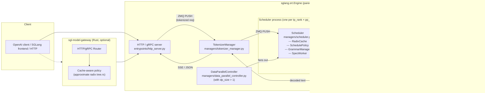

# SGLang: RadixAttention and the Zero-Overhead Scheduler

**After reading this chapter, the reader will be able to:**

- Describe the SGLang process layout (TokenizerManager, Scheduler, TpModelWorker, ModelRunner) and the ZMQ IPC channels between them
- Explain RadixAttention: the global radix tree structure, the RadixKey, match_prefix/insert/evict operations, and why the tree-based approach enables multi-level cache sharing that block-hash approaches cannot match
- Describe the HiCache three-level hierarchy (L1 GPU / L2 CPU / L3 storage) and the layered CUDA stream pipeline that enables GPU computation to overlap with L2-to-L1 transfer
- Explain the zero-overhead overlap scheduler (`event_loop_overlap`) and the class of hidden latency it eliminates
- Describe SGLang's EAGLE3 speculative decoding integration and the Two-Batch Overlap (TBO) orchestration for large-EP DeepSeek inference

---

SGLang emerged from the LMSYS group as both a research engine and a production serving system. It powered the Chatbot Arena backend during the period when that benchmark became the dominant model ranking methodology, and its throughput numbers have repeatedly anchored published benchmarks. The system is built around a single unified bet: that a globally-shared radix tree over the KV cache, coupled with a scheduler that treats tree structure as a first-class scheduling input, will outperform any approach that bolts prefix caching on top of a block allocator as an afterthought. The original NeurIPS 2024 paper (Zheng, Yin, Xie et al., "Efficiently Programming Large Language Models using SGLang") described both a frontend DSL and the radix-tree runtime co-design; the frontend remains in `python/sglang/lang/` but production usage has largely migrated to the OpenAI-compatible HTTP interface, and the runtime is where active development concentrates.

The technical bets SGLang makes differ from vLLM's in a handful of specific ways. RadixAttention uses a global radix tree rather than block-hash chaining; IPC uses ZMQ sockets rather than Python multiprocessing queues; routing uses a Rust gateway rather than a Python dispatcher; and the scheduler uses an overlap design that hides CPU scheduling time behind GPU execution rather than running them sequentially. By v0.5, SGLang and vLLM have largely converged on the kernel layer — both use FlashInfer on Hopper, both support MLA for DeepSeek, both have FP8 and MoE quantization — so the live differentiation is in the scheduler, the prefix cache, and the serving architecture surrounding them. This chapter examines those pieces in depth using commit `b2420d72ff3ed9cf3b162149e8fc6e7f07925c4a` (v0.5.11 tag) as the reference.

The monorepo contains two separate runtime systems: the autoregressive LLM serving engine described in this chapter (`python/sglang/srt/`), and a separate "SGLang Diffusion" engine for image/video generation (`srt/multimodal_gen/`, covering Wan, HunyuanVideo, Flux, Qwen-Image). The diffusion engine is not covered here; it has its own scheduler, batching primitives, and parallelism setup. The custom kernel package `sgl-kernel/` is shared across both engines and packages CUDA/HIP/MUSA kernels for attention, MoE, speculative decoding, grammar bitmask application, quantization, and KV cache I/O.

---

## Part 1: Process Architecture

SGLang's serving engine ("SRT" — SGLang Runtime, in `python/sglang/srt/`) decomposes into four functional layers of processes. This is not a two-process split like many simpler engines; it is a deliberate separation of tokenization, scheduling, and execution so that no phase starves any other.

### 1.1 The four processes

**TokenizerManager** (`sglang/srt/managers/tokenizer_manager.py`) lives in the parent process alongside the HTTP/OpenAI/gRPC server. It owns tokenization and detokenization at the per-request level: encoding input text to token IDs, managing per-request state for streaming output, applying chat templates, and driving multimodal preprocessing for vision and audio inputs. When a request arrives it is encoded here, then a ZMQ PUSH message carries the tokenized request downstream to the Scheduler. Completed token ID sequences from the Scheduler flow through a separate `DetokenizerManager` process (`managers/detokenizer_manager.py`) and back up to the TokenizerManager as decoded text. Keeping tokenization CPU-side in the parent process means Python tokenizer overhead never occupies the GPU-bound scheduler or worker processes.

**Scheduler** (`sglang/srt/managers/scheduler.py`, approximately 4,000 lines) is the operational center of the engine. It owns the RadixCache, the running and waiting request queues, the schedule policy, the GrammarManager, and the speculative decoding worker. It runs the primary event loop — either `event_loop_normal` or `event_loop_overlap` — and dispatches batches to TpModelWorker via ZMQ PUSH. The `Scheduler` class is composed from a chain of mixins:

```
Scheduler(
  SchedulerOutputProcessorMixin,
  SchedulerUpdateWeightsMixin,
  SchedulerProfilerMixin,
  SchedulerMetricsMixin,
  SchedulerDisaggregationDecodeMixin,
  SchedulerDisaggregationPrefillMixin,
  SchedulerMultiplexMixin,
  SchedulerRuntimeCheckerMixin,
  SchedulerPPMixin,
  SchedulerDPAttnMixin,
  SchedulerDllmMixin,
  SchedulerMlxOverlapMixin
)
```

Each mixin cleanly initializes one feature surface. The `__init__` is essentially a long sequence of `init_*` calls — `init_model_worker`, `init_memory_pool`, `init_schedule_policy`, `init_watchdogs`, `init_overlap`, `init_lora_drainer`, `init_grammar_backend`, and so on.

**TpModelWorker** (`sglang/srt/managers/tp_worker.py`) is one process per TP rank. It receives a `ModelWorkerBatch` from the Scheduler, drives the NCCL collectives for tensor parallelism, and calls into ModelRunner. The ZMQ channel from Scheduler to TpModelWorker uses Python object serialization; `ModelWorkerBatch` is a slimmed-down dataclass compared to `ScheduleBatch` — it contains only what the worker needs to execute the forward pass, not the full request metadata the scheduler needs for lifecycle management.

**ModelRunner** (`sglang/srt/model_executor/model_runner.py`, approximately 3,600 lines) owns the loaded model weights, the KV memory pools, and the attention backend. It executes `model.forward()` through the appropriate backend and returns output logits. ModelRunner is what actually calls into the CUDA kernels; TpModelWorker is the process wrapper that handles distributed coordination above it.

The `RadixAttention` layer (`sglang/srt/layers/radix_attention.py`) is a thin `nn.Module` that every model's attention call site instantiates with its `(num_heads, head_dim, num_kv_heads, layer_id, ...)` configuration. Its `forward()` either calls a `unified_attention_with_output` custom op during prefill or piecewise CUDA graph mode, or delegates to `forward_batch.attn_backend.forward(q, k, v, self, forward_batch, ...)` for the backend-specific kernel. The key point is that `RadixAttention` is *not* a CUDA kernel — it is the integration layer that connects the model's attention call to the RadixCache-managed memory pool and the chosen backend.

### 1.2 IPC topology



One Scheduler process is launched per `tp_rank × pp_rank × dp_rank` shard. With `dp_size=1` and `pp_size=1` there is a single Scheduler process. `DataParallelController` (`managers/data_parallel_controller.py`) fans requests across multiple Scheduler processes when DP is on. The controller implements a `MultiTokenizerRouter` and `MultiHttpWorkerDetokenizerMixin` that allow multiple HTTP worker threads to share a pool of Scheduler/Detokenizer processes, with `tokenizer_worker_num` controlling the degree of parallelism in the tokenization front-end.

### 1.3 Batching and the ScheduleBatch object

`ScheduleBatch` (`sglang/srt/managers/schedule_batch.py`, approximately 2,800 lines) is the single object that flows from Scheduler to ModelWorker. Its field set is the full runtime state of one GPU step: `req_pool_indices`, `seq_lens`, `seq_lens_sum`, `out_cache_loc`, `output_ids`, `multimodal_inputs`, `forward_mode` (PREFILL, DECODE, MIXED, EXTEND), `spec_algorithm`, `chunked_req`, `return_logprob`, `tbo_split_seq_index` (for TBO), `inner_idle_batch` and `global_num_tokens` (for DP-attention), `mamba_track_*` (for hybrid Mamba/SSM models). `ScheduleBatch.init_new` constructs it; `prepare_for_extend` and `prepare_for_decode` allocate KV slots and set `out_cache_loc`; `get_model_worker_batch()` yields the slimmer `ModelWorkerBatch` that is actually serialized over ZMQ.

Prefill admission is handled by `PrefillAdder` (`sglang/srt/managers/schedule_policy.py`). It tracks how many tokens the current prefill batch can accept given `chunked_prefill_size`, `max_prefill_tokens`, `max_prefill_bs`, `max_running_requests`, and the available KV slots from `token_to_kv_pool_allocator.available_size()`. Key policies:

- **Chunked prefill**: long requests are chunked into segments of `chunked_prefill_size` tokens. Dynamic chunking (`enable_dynamic_chunking`) predicts the optimal chunk size based on current batch state.
- **Mixed chunked prefill** (`is_mixed_chunk`): a chunked prefill request is concatenated onto the running decode batch in a single forward, so decode and prefill share the same GPU step.
- **Retraction**: when KV memory fills during a running batch, requests in the running batch can be retracted — their KV freed and their state pushed back to the waiting queue. Controlled by `TEST_RETRACT`.
- **Prefill delayer** (`managers/prefill_delayer.py`): backs off on prefill admission when KV usage is high, leaving headroom for ongoing decodes rather than immediately filling memory.

`get_next_batch_to_run` selects between prefill and decode each iteration: it first tries `get_new_batch_prefill()`; if no prefill batch is ready it returns the running decode batch after calling `update_running_batch` to check for retraction and reservation. Prefill is preferred to keep TTFT low.

### 1.4 CUDA graph strategy

ModelRunner has three CUDA graph modes, selected through server arguments and model type:

- `CudaGraphRunner` (`model_executor/cuda_graph_runner.py`) — whole-decode capture. The standard path: one captured graph per batch size. Requires that batch size is known at capture time and that no dynamic control flow varies between captures.
- `PiecewiseCudaGraphRunner` (`model_executor/piecewise_cuda_graph_runner.py`) — per-fragment capture. The model is split into pieces (typically at MoE routing boundaries) and each piece is captured separately. This allows MoE routing decisions (which are dynamic) to fall between captured pieces.
- `BreakableCudaGraphRunner` (`model_executor/breakable_cuda_graph/`) — experimental; a captured graph that can fall back to eager for specific ops without re-capturing. The design allows the same captured graph to cover EAGLE verify and decode steps that share most operations, with the differing ops handled eagerly in the "break" regions. Landed in April 2026 (PR #22218).

Speculative decoding has its own CUDA graph variants: `eagle_draft_cuda_graph_runner.py`, `eagle_draft_extend_cuda_graph_runner.py`, `multi_layer_eagle_draft_extend_cuda_graph_runner.py`. Piecewise CUDA graph with speculative decoding landed in 2026 (PR #22128).

### 1.5 Comparison to vLLM V1

vLLM V1 splits the serving loop into a front-end process (HTTP + tokenization), an EngineCore process (scheduling + execution dispatch), and Worker processes. SGLang keeps tokenization in its own manager but collocates scheduling with ZMQ dispatch inside the Scheduler process rather than merging scheduling into the worker. The practical consequence: in SGLang the Scheduler can inspect the RadixCache and issue a schedule decision without crossing a process boundary to the workers, which matters for the overlap mode described in Part 4 — the Scheduler can assemble the next batch while waiting for the current batch's GPU result, because both the schedule logic and the result-receiving socket live in the same process.

### 1.6 The SGLang frontend DSL

The original SGLang paper introduced a frontend DSL (`python/sglang/lang/`) as the user-visible interface to the runtime's prefix-sharing capabilities. While production usage has largely migrated to the OpenAI-compatible HTTP interface, the DSL remains in active use for complex multi-turn programs and is the reason the `fork` construct exists in the system.

The DSL is implemented as a small embedded Python DSL with a tracing-style interpreter. Core IR nodes (`lang/ir.py`): `SglFunction`, `SglGen`, `SglSelect`, `SglFork`/`SglGetForkItem`, `SglRoleBegin`/`SglRoleEnd`, `SglImage`, `SglVideo`, `SglConstantText`, `SglVariable`, `SglSeparateReasoning`. Public surface in `lang/api.py`: `function`, `gen`, `select`, `fork`, `image`, `video`, `system`, `user`, `assistant`, `set_default_backend`.

Three constructs are characteristic of SGLang and have no direct equivalent in an OpenAI-API-only design:

- **`gen`** — a typed completion call with `regex=`, `json_schema=`, `choices=`, `dtype=` (int/float/bool/str — syntactic sugar over canned regexes like `REGEX_INT` defined in `ir.py`), and sampling parameters.
- **`select`** — pick one of `choices=[...]` evaluated by the runtime via token-length-normalized scoring; implemented in `lang/choices.py`.
- **`fork(n)` / `s.fork(n)`** — branch the program state into $n$ parallel children that share the same prefix. Each child is its own `StreamExecutor`; children copy the shared text state up to the fork point, then run independently. This maps directly onto RadixAttention: the $n$ children share the forked prefix's KV cache and each pays only for their divergent suffix. `fork` is the user-visible version of the "split-on-divergence" operation described in Part 2.

A program is a Python function decorated with `@sgl.function` whose first argument is a `ProgramState`. Calling `.run(...)` constructs a `StreamExecutor` (`lang/interpreter.py`) which submits each IR node to the chosen backend. Backends in `lang/backend/`: `runtime_endpoint.py` (local SGLang HTTP runtime), `openai.py`, `anthropic.py`, `vertexai.py`, `litellm.py`. For the HTTP backend, each `gen` call becomes a request to the `/generate` endpoint; the runtime handles the batching and prefix reuse transparently.

---

## Part 2: RadixAttention — the Global Prefix Tree

RadixAttention is the data structure that distinguishes SGLang most sharply from competing systems. The implementation lives in `sglang/srt/mem_cache/radix_cache.py`.

### 2.1 Motivation: what block-hash caching cannot do

Before examining the tree itself, it is worth being precise about the limitation it addresses.

Block-hash prefix caching (vLLM's original design) hashes each fixed-size KV block independently and checks whether a hash match exists in a hash table. Two requests share a cached block if and only if their token sequences are identical in every position within that block. This works correctly when the shared prefix is a multiple of the block size. It has two structural limitations.

First, sharing is detected only at block granularity. If `block_size=16` and two requests share 30 tokens of prefix, the first block (tokens 0–15) is shared, but the second is not — even though tokens 16–29 are identical — because the second block's hash includes token 30, which differs. The missed sharing is $\lfloor(P \bmod B) / B\rfloor \cdot B$ tokens per request, where $P$ is the shared prefix length and $B$ is the block size.

Second, the hash table is flat: it records which individual blocks are cached, not how they relate to each other. The scheduler cannot ask "which of my waiting requests would benefit most from running the next prefill?" without scanning every request and computing every match independently.

The radix tree addresses both structurally, not as engineering patches.

As a concrete example, consider a RAG system where a 2048-token system prompt is shared across all requests, and `block_size=16`. Block-hash caching will cache 128 blocks (tokens 0–2047, fully aligned) and share them across requests. Now two users each append a 512-token retrieved document that happens to share the first 200 tokens — tokens 2048–2247 — and then diverges. Block-hash caching can share 12 of those 200 tokens as blocks (tokens 2048–2063, 2064–2079, ..., 2224–2239 = 12 blocks = 192 tokens); the last partial block (tokens 2240–2247) cannot be shared because block 2240–2255 also contains the divergent token at position 2248, and its hash differs between the two requests. The radix tree instead splits at position 2248 and shares all 200 tokens. At scale, with $M$ distinct documents each partially overlapping, the block-hash approach misses $O(M \cdot B)$ tokens of sharing per pairwise match while the radix tree recovers all of it.

### 2.2 The data structure

`RadixCache` is a global radix tree over token sequences. Every node corresponds to a contiguous segment of tokens for which KV blocks have been computed and stored. Paths from the root to any node spell out a complete token prefix; the root represents the empty prefix. All requests whose inputs share a common prefix share the same tree path up to the divergence point.

`TreeNode` carries:

- `key: RadixKey` — the edge label from parent to this node: the contiguous token ID suffix for this edge
- `value: Optional[torch.Tensor]` — a 1-D int64 tensor of physical KV block indices into the device pool; `None` means the node has been evicted
- `lock_ref: int` — count of in-flight requests holding this node (and all its ancestors). A node with `lock_ref > 0` cannot be evicted
- `last_access_time`, `creation_time`, `hit_count`, `priority` — fields consumed by the pluggable eviction strategy
- `host_value: Optional[torch.Tensor]` and `host_ref_counter` — CPU-tier counterparts used by HiCache (Part 3)
- `hash_value: Optional[List[str]]` — lazily computed per-page chained SHA-256 hashes, used for KV-cache events and storage backends
- `children: Dict[child_key, TreeNode]`, `parent`

`RadixKey` is the edge label abstraction. It packs `token_ids: List[int]`, an optional `extra_key: Optional[str]` namespace string, and an `is_bigram: bool` flag for EAGLE-style speculative decoding. The `extra_key` is the LoRA adapter ID when present; requests with different adapter IDs share no prefix nodes even when their token sequences are identical. `is_bigram` is a flag that indicates the cache key is conceptually `(t_i, t_{i+1})` pairs; since PR #23106, this is an O(1) view flip rather than materializing a new list — a meaningful optimization in the cache hot path.

`RadixKey.page_aligned(page_size)` truncates the key to a multiple of the model's KV page size before insertion or lookup. `RadixKey.child_key(page_size)` produces the hashable dict key used as the lookup key into `children` — a single token for `page_size=1`, a tuple of tokens for larger pages, optionally suffixed with `extra_key`. `RadixKey.hash_page(start, end, prior_hash)` produces chained per-page SHA-256 hashes that feed the KV-cache event system (`BlockStored` / `BlockRemoved` / `AllBlocksCleared` in `sglang/srt/disaggregation/kv_events.py`).

### 2.3 Core operations

**`match_prefix(MatchPrefixParams)`** walks the tree from the root, following `child_key`-indexed children. At each candidate child node it calls `child.key.match(remaining_key, page_size)` to find the longest matching prefix segment. If the match ends *inside* a stored edge — that is, the incoming request shares only a partial prefix with an existing node's key — it calls `_split_node` to split the edge at the divergence point before returning. The result is a `MatchResult` carrying `device_indices` (the physical KV block indices for the matched prefix), `last_device_node` (the deepest device-tier node in the match path), and `last_host_node` (the deepest CPU-tier node, for HiCache). Time complexity per walk step is O(match-length) due to the key comparison, but with `child_key` indexing, each node lookup is O(1) in the children map.

**`insert(InsertParams)`** walks the same path and either reuses an existing node (incrementing `hit_count`) or appends a new leaf carrying newly computed KV blocks. When the new sequence shares a prefix with an existing edge but diverges before the edge's end, `_split_node` is called: the shared prefix becomes a new internal node, and both the old suffix and the new suffix become its children.

**`evict(EvictParams)`** maintains `evictable_leaves: set[TreeNode]` — the set of leaves with `lock_ref == 0` and no live device children — updated incrementally by `_update_leaf_status`. It pushes these into a min-heap ordered by the configured `EvictionStrategy` (one of `LRUStrategy`, `LFUStrategy`, `FIFOStrategy`, `MRUStrategy`, `FILOStrategy`, `PriorityStrategy`, `SLRUStrategy`, all in `sglang/srt/mem_cache/evict_policy.py`). After deleting a leaf, if its parent now has no remaining children and `lock_ref == 0`, the parent becomes a new eviction candidate. The freed block indices are returned to `token_to_kv_pool_allocator`.

**`inc_lock_ref` / `dec_lock_ref`** walk from a node up to the root, modifying `lock_ref` on every ancestor. While `lock_ref > 0`, the node is tracked in `protected_size_`; when it drops to zero, the node is eligible again and moves to `evictable_size_`.

### 2.4 Split-on-divergence in detail

The critical operation that enables arbitrary-granularity sharing is `_split_node`. Suppose the tree already has a node N whose edge `key = [a, b, c, d, e]` from its parent. A new request arrives whose token sequence matches `[a, b, c]` but then diverges. The split proceeds:

1. A new internal node M is created with `key = [a, b, c]` and N's original parent.
2. N's `key` is trimmed to `[d, e]` (the remaining suffix) and N is re-attached as a child of M.
3. M's KV blocks are set to the first portion of N's original blocks (those corresponding to tokens `a`, `b`, `c`).
4. The new request's diverging suffix is attached as a new sibling leaf of N under M.

After the split, M holds the shared KV for `[a, b, c]`, and both N (representing the old path) and the new leaf (representing the new request's path) hold only their respective suffixes. Memory overhead is one new `TreeNode` Python object; the KV blocks themselves are never copied — only the index array is split.

This operation is also what makes the tree composable with chunked prefill: if a long request is processed in multiple chunks, each chunk's KV can be inserted incrementally with `cache_unfinished_req`, and the tree splits correctly at whatever chunk boundary happens to coincide with another request's prefix.

The `_split_node` operation has a subtle interaction with `lock_ref`. The original node N has `lock_ref > 0` if any in-flight request holds it (the request that is currently processing N's suffix). After the split, the lock on N should apply to both M (the new shared prefix) and the new leaf, not to N's old parent. The implementation re-walks from both the new leaf and N to the root, incrementing lock refs to match the existing reference counts on N. This re-walk is O(depth) and is the most expensive part of the split operation; in practice, depth is bounded by the maximum request sequence length divided by the page size.

### 2.5 Lifecycle hookpoints

The Scheduler integrates with RadixCache at three points per request:

1. **Admission**: `Req.init_next_round_input(self.tree_cache)` calls `match_prefix` to set `req.prefix_indices` (already-cached KV block indices) and `req.last_node`. `req.prefix_indices` is passed to `prepare_for_extend` in `ScheduleBatch` so the model forward only computes KV for the unmatched suffix. The matched prefix's blocks are loaded directly into the attention backend's page table.

2. **Chunked prefill in progress**: `cache_unfinished_req(req, chunked=True)` is called after each prefill chunk. It inserts the in-progress prefix into the tree and updates `req.cache_protected_len`, incrementing `lock_ref` on the new node so the partial result cannot be evicted before the request finishes.

3. **Completion**: `cache_finished_req(req)` inserts the full completed sequence, frees any dangling partial-page tail (the tail that does not fill a complete page is dropped since it cannot be shared), and decrements the lock on `req.last_node`. Any `extra_key` namespace is preserved in the inserted node.

If `enable_kv_cache_events` is set, the radix cache emits `BlockStored` / `BlockRemoved` / `AllBlocksCleared` events on insert and evict, carrying `block_hashes`, `parent_block_hash`, `token_ids`, `block_size`, `lora_id`, and a `medium` tag distinguishing GPU from CPU from disk tiers. These events feed the Rust gateway's cache-aware routing policy and the HiCache storage backends.

### 2.6 KV-cache events

When `enable_kv_cache_events` is set, the RadixCache emits `BlockStored`, `BlockRemoved`, and `AllBlocksCleared` events (`sglang/srt/disaggregation/kv_events.py`) on insert and evict. Each event carries `block_hashes`, `parent_block_hash`, `token_ids`, `block_size`, `lora_id`, and a `medium` tag (`StorageMedium.GPU` for device blocks, `CPU` for HiCache host blocks). Two consumers depend on these events:

1. The Rust gateway's cache-aware routing policy subscribes to the event stream to maintain its approximate per-worker radix tree, pruning the tree when blocks are evicted. This is the mechanism by which the gateway learns that a prefix it believed was cached is no longer present.
2. HiCache storage backends consume `BlockStored` events to trigger asynchronous L2→L3 writes, and `BlockRemoved` events to maintain consistency between GPU and host tiers.

Per-page SHA-256 chained hashes (`RadixKey.hash_page(start, end, prior_hash)`) are computed lazily and stored in `TreeNode.hash_value`. These hashes serve as stable storage keys for L3 backends — a KV block stored to Mooncake or 3FS is addressed by its hash chain, which is deterministic for a given token sequence regardless of which physical GPU slot it occupies.

### 2.7 Cache-aware scheduling

The tree structure enables two scheduling policies in `sglang/srt/managers/schedule_policy.py` that have no equivalent with a flat hash table:

`CacheAwarePolicy.LPM` (longest-prefix-match) sorts the waiting queue by `match_prefix` result length, admitting requests that will require the least new KV computation first. This is naturally greedy: the requests that contribute the most cache reuse are admitted earliest, maximizing GPU utilization per token of KV allocation. The implementation calls `match_prefix_for_req` on every waiting request and sorts in $O(Q \log Q)$ where $Q$ is queue length, with each `match_prefix` call taking $O(d)$ tree depth steps.

`CacheAwarePolicy.DFS_WEIGHT` performs a DFS over the radix tree weighted by the count of waiting requests under each subtree, selecting the subtree that will generate the most cache hits for the most requests. This is a batch-level optimization: rather than optimizing per-request, it chooses the admission order that maximizes total cache hit rate for the entire waiting queue. DFS_WEIGHT is particularly effective when many requests share a common prefix but then diverge into distinct subtrees — it will batch together all requests from the largest subtree before moving to the next, keeping the shared prefix hot in the GPU KV cache.

For queues exceeding 128 requests, LPM is automatically downgraded to FCFS to bound the sort cost: at 128 requests the sort overhead is under 1 ms, but at 1,000 requests sorting dominates scheduling time. In-batch prefix caching (`IN_BATCH_PREFIX_CACHING_CHECK_THRESHOLD`, `IN_BATCH_PREFIX_CACHING_DEPRIORITIZE_THRESHOLD`) re-uses KV emerging from requests within the same iteration for other requests in that same iteration — the canonical case is when two identical requests arrive simultaneously; the second one is de-prioritized and waits for the first to complete its prefill, then reuses the KV rather than recomputing it.

`CacheAgnosticPolicy` options are `FCFS` (first-come first-served), `LOF` (longest output first — prioritizes requests expected to produce the most output, to improve head-of-line blocking on short outputs), `RANDOM`, and `ROUTING_KEY` (an application-level key for custom scheduling logic).

### 2.8 RadixCache variants

The codebase maintains a family of implementations because the tree semantics differ across model architectures:

- `RadixCache` (`radix_cache.py`) — the canonical implementation for standard MHA/MLA/GQA models.
- `HiRadixCache` (`hiradix_cache.py`) — HiCache-aware extension (Part 3).
- `SWARadixCache` (`swa_radix_cache.py`) — sliding-window attention; nodes can be partially valid when the attention window slides past them.
- `MambaRadixCache` (`mamba_radix_cache.py`) and `HiMambaRadixCache` — for Mamba/SSM and hybrid models. Mamba's recurrent state is not a simple function of the token prefix — it is a compressed summary of all past context — so caching and splitting semantics fundamentally differ from token-indexed KV caching.
- `UnifiedRadixCache` (`unified_radix_cache.py` + `unified_cache_components/`) — a 2026 consolidation effort. `UnifiedTreeNode`s carry per-component data (`FullComponent`, `SWAComponent`, `MambaComponent`), each with its own LRU, `lock_ref`, evictable/protected accounting, and cascade-eviction rule. The design document in `mem_cache/unified_cache_components/README.md` states the goal: "zero special-casing in the main tree — the tree operates purely on keys; physical resource management is in components." HiCache integration with the unified tree landed in April–May 2026 (PRs #22924, #23316, #24346).
- `radix_cache_cpp.py` + `cpp_radix_tree/` — a C++ implementation (`tree_v2*.{h,cpp}` with pybind bindings, JIT-compiled via `torch.utils.cpp_extension.load`) for deployments where Python overhead in the hot-loop matters at very large batch sizes.

---

## Part 3: HiCache — Hierarchical KV Cache

For workloads with long shared prefixes — a 50,000-token system prompt, a persistent RAG corpus, multi-turn conversations that span many rounds — the GPU KV cache is too small to hold all useful prefix state simultaneously. HiCache extends the memory hierarchy downward: GPU HBM as L1, host DRAM as L2, and persistent storage as L3. It is controlled by `--enable-hierarchical-cache` and the `hicache_*` server arguments.

### 3.1 Three tiers

**L1 (GPU HBM)**: `MHATokenToKVPool` / `MLATokenToKVPool` / `NSATokenToKVPool` (`sglang/srt/mem_cache/memory_pool.py`). The standard device KV pool, indexed by the RadixCache's flat int64 index space. One row per token, all transformer layers interleaved.

**L2 (host DRAM)**: `MHATokenToKVPoolHost` / `MLATokenToKVPoolHost` (`sglang/srt/mem_cache/memory_pool_host.py`). Allocated as pinned (page-locked) memory for fast PCIe DMA. Sized via `hicache_ratio` (a multiple of the GPU pool size, e.g., 4× or 8×) or an absolute `hicache_size`. The `hicache_mem_layout` argument selects layer-major vs token-major arrangement, trading sequential DMA throughput against random access flexibility.

**L3 (storage)**: Pluggable backends under `sglang/srt/mem_cache/storage/`, selected at startup via `backend_factory.py` (or at runtime via `attach_storage_backend`). Supported backends: Mooncake (`mooncake_store/`), DeepSeek's 3FS distributed filesystem (`hf3fs/`), NIXL (`nixl/`), LMCache (`lmcache/`), AiBrix KVCache (`aibrix_kvcache/`), EIC (`eic/`), SiMM (`simm/`). L3 is intended for KV state that should survive server restarts — very long system prompts or shared context that is stable across deployments.

`TreeNode.host_value` tracks the L2 slot indices for the same logical sequence segment, parallel to `value` for L1. `TreeNode.hash_value` tracks the chained per-page SHA-256 hashes used as L3 storage keys.

### 3.2 HiCacheController and the layered stream pipeline

`sglang/srt/managers/cache_controller.py::HiCacheController` manages all L1↔L2 and L2↔L3 traffic. Its design is organized around one insight: a layer-by-layer pipeline allows GPU attention at layer $k$ to proceed while the L2→L1 transfer for layer $k+1$ is in flight.

The infrastructure:

- Two dedicated CUDA streams: `write_stream` (L1→L2 backup) and `load_stream` (L2→L1 prefetch). Both are separate from the model's compute stream, so they can proceed concurrently.
- `LayerLoadingEvent` and `LayerDoneCounter` — per-layer CUDA events. Before the model executes attention at layer $k$, it checks whether layer $k$'s KV blocks have been transferred from L2. The counter has 3 producer/consumer slots so the overlap scheduler can pipeline events across consecutive steps without stalling.
- Background threads `prefetch_thread` and `backup_thread` drive `prefetch_queue` and `backup_queue`, executing DMA transfers independently of the scheduler event loop.

The throughput condition for stall-free operation is:

$$t_{\text{transfer, layer } k} \leq t_{\text{compute, layers 0 \ldots k-1}}$$

For a 70B model with a 4K-token prefix, per-layer KV is roughly $4096 \times 2 \times \text{num\_kv\_heads} \times \text{head\_dim} \times 2$ bytes (BF16). With 8 KV heads and $d_h = 128$, that is about 8 MB per layer. At PCIe 5.0 bandwidth of roughly 60 GB/s, one layer transfers in approximately 0.13 ms. At H100 decode compute time of 3–8 ms per layer, the condition is comfortably satisfied, meaning L2 prefetch is effectively free.

**Write policies**: `write_through` copies every inserted RadixCache node to L2 immediately. `write_through_selective` writes only nodes that have been accessed at least a configurable number of times (to avoid polluting L2 with one-shot requests). `write_back` is lazy, writing on eviction from L1.

**Storage integration with the scheduler**: `pop_prefetch_loaded_tokens` and `check_prefetch_progress` are called from the Scheduler inside `_get_new_batch_prefill_raw`. A request whose long prefix is being prefetched from L3 can carry `req.storage_hit_length`, and the scheduler can admit it as soon as the transfer is sufficiently advanced rather than waiting for completion.

**Cross-TP/CP consistency**: when tensor parallelism or context parallelism is active, `prefetch_sync_groups` performs a gloo all-reduce across `attn_tp_group` and `attn_cp_group` to ensure all TP/CP participants agree on the number of prefetched tokens before admitting a request. Without this, one TP rank might begin attention with a prefetched prefix while another has not yet received the transfer.

**EAGLE draft KV backing**: since PR #21125, the draft model's KV cache for EAGLE speculative decoding can also be stored in L2/L3, so speculative decoding workloads benefit from the hierarchy the same way the main model does. When a request is admitted with a speculative draft that was previously cached, both the target model's KV and the draft model's KV are prefetched from L2 in parallel on separate transfer operations.

KV-cache events are also emitted for L2 insertions: `_record_store_event` / `_record_remove_event` emit `BlockStored` / `BlockRemoved` with a `medium` tag (`StorageMedium.GPU` for L1, `CPU` for L2, storage for L3), so consumers can distinguish tier-specific evictions. This was a 2026-04 fix (PR #22894).

### 3.3 Memory pool details and layout

`MHATokenToKVPoolHost` allocates memory using `torch.zeros(..., pin_memory=True)` when running on CUDA hardware, or the platform-specific pin allocator on MUSA/other accelerators. `MLATokenToKVPoolHost` handles the compressed latent KV for MLA models, where the host pool stores the low-rank $C^{KV}$ vectors rather than the full per-head KV; since MLA's KV is already compressed, the L2 pool is proportionally smaller.

The `hicache_mem_layout` choice matters for DMA patterns:

- **Layer-major**: all tokens for transformer layer $k$ are stored contiguously. Optimal for whole-layer DMA transfers (one `cudaMemcpyAsync` per layer per request prefetch), which is the `LayerLoadingEvent` design's natural match. Suboptimal for random per-token access patterns.
- **Token-major**: all layers for token $i$ are stored contiguously. Optimal for streaming a single token's KV from L2 to L1 in one transfer, but requires $L$ separate DMA calls per layer in the layer-pipeline model.

The default is layer-major.

For very long shared prefixes (e.g., a 100,000-token system prompt used across millions of requests), L3 storage provides persistence across server restarts. When the server starts, it can prefetch the hash-addressed KV blocks from the storage backend into L2, and then from L2 to L1 as requests arrive. This startup prefetch converts what would otherwise be a cold-start penalty — the first $N$ requests after restart each must prefill the full 100k-token prefix — into a warm-start at the cost of the L3→L2→L1 pipeline latency, which is typically dominated by L3 I/O bandwidth. The hash-addressed storage key (chained SHA-256 per page) makes this cross-restart sharing robust: the same token sequence will produce the same storage key regardless of which physical GPU slot it occupied in the previous session.

See [§30](../30-kv-cache/) for the broader KV cache hierarchy chapter.

---

## Part 4: Zero-Overhead Overlap Scheduler

The overlap scheduler is SGLang's most operationally significant architectural contribution. Understanding it requires first understanding what it replaces.

### 4.1 The sequential baseline: `event_loop_normal`

`event_loop_normal` runs the straightforward production loop, visible in `sglang/srt/managers/scheduler.py::run_event_loop`:

```
while True:
    receive_requests()
    process_input_requests()
    batch = get_next_batch_to_run()
    result = run_batch(batch)        # GPU launch + synchronous wait
    process_batch_result(batch, result)
```

In this loop the GPU is idle during `get_next_batch_to_run`. That call includes:

- Walking the RadixCache for `match_prefix` on every waiting request
- Sorting waiting requests by cache-aware policy (LPM requires sorting; DFS requires a tree walk)
- Calling `PrefillAdder` to determine how many tokens fit given available KV memory
- Allocating KV slots via `token_to_kv_pool_allocator`
- Constructing the `ScheduleBatch` object with all metadata fields
- Calling `get_model_worker_batch()` to produce the ZMQ payload
- Running any grammar compilation checks (`has_waiting_grammars`, `get_ready_grammar_requests`)
- Handling speculative decoding setup (draft allocation, EAGLE tree initialization)

On a moderately loaded system with an active radix tree and 100–200 waiting requests, this totals 1–5 ms of Python. At an H100 decode step time of 15–25 ms for a typical batch of 128 sequences, sequential scheduling overhead is 5–25% of total step time. This is pure wall-clock waste — the GPU is waiting for Python to finish a task that is logically independent of GPU execution.

The observation that makes the overlap design possible: the scheduling decision for step $N+1$ does *not* require step $N$'s output. Step $N$'s output (the set of accepted tokens) is needed for two things: inserting new KV into the RadixCache (via `cache_unfinished_req` / `cache_finished_req`), and extending the request sequences. But neither of these is needed to *decide which requests to include in the next batch* — that decision is based on the current queue state, which is already consistent with step $N-1$'s results.

### 4.2 The overlap design: `event_loop_overlap`

`event_loop_overlap` is what SGLang calls the "zero-overhead" scheduler, introduced in v0.4 (December 2024) and the default from v0.4 onward. The invariant: while the GPU is executing step $N$, the CPU is assembling the batch for step $N+1$.

The implementation uses a `result_queue: Deque[(ScheduleBatch, BatchResult)]` and a dedicated `schedule_stream` (a CUDA stream separate from the compute stream). The loop is approximately:

```
# Startup: launch batch 0
batch_0 = get_next_batch_to_run()
launch_async(batch_0, on=schedule_stream)

while True:
    # CPU assembles batch N+1 while GPU executes batch N
    batch_next = get_next_batch_to_run()      # concurrent with GPU
    launch_async(batch_next, on=schedule_stream)

    # Only now consume batch N's result (GPU has moved past it)
    (batch_prev, result_prev) = result_queue.popleft()
    process_batch_result(batch_prev, result_prev)
```

The `launch_async` returns immediately; the GPU executes the batch asynchronously. By the time the CPU finishes assembling `batch_next` and launches it, `batch_prev`'s result is already in the `result_queue` (because `run_batch` uses a non-blocking GPU→CPU result copy, or the result is signaled via a CUDA event). The CPU then calls `process_batch_result` on `batch_prev`, which inserts new KV into the RadixCache and decrements lock refs.

### 4.3 Why double-buffering is necessary

The `ScheduleBatch` object must remain stable during GPU execution. The model forward on the worker side references `batch.req_pool_indices`, `batch.seq_lens`, `batch.out_cache_loc`, `batch.seq_lens_sum`, and many other fields in the GPU kernels. If `process_batch_result` ran *before* `launch_async(batch_next)`, it would modify the RadixCache — inserting new nodes, decrementing lock refs, potentially evicting blocks — while `batch_N` was being assembled. That could invalidate pointers or indices that `batch_N` holds.

The double-buffer invariant: `batch_N`'s `ScheduleBatch` object is assembled while `batch_{N-1}`'s GPU execution is in flight, and `process_batch_result(batch_{N-1})` runs only after `batch_N` has been launched. This ordering ensures:

1. The RadixCache state observed during `get_next_batch_to_run()` for step $N$ is consistent: it reflects step $N-2$'s results (already processed) but not step $N-1$'s (not yet processed).
2. The `ScheduleBatch` for step $N-1$ is not mutated while the GPU is executing it.
3. Step $N$'s cache allocations are safe: any blocks freed by step $N-2$'s `process_batch_result` are available, and step $N-1$'s blocks are still locked.

### 4.4 When overlap must be disabled

One case requires falling back to sequential mode: grammar-constrained speculative decoding in decode mode. The condition is checked via `is_disable_overlap_for_batch`:

```python
if batch.is_spec_v2 and batch.has_grammar and batch.forward_mode.is_decode():
    return True  # disable overlap
```

The reason: the grammar bitmask for step $N+1$ depends on which draft tokens were accepted in step $N$. That acceptance decision is not known until `process_batch_result(batch_N)` runs. Since overlap schedules `batch_{N+1}` before processing `batch_N`'s results, the grammar state for `batch_{N+1}` would be stale. The fallback is graceful: the scheduler detects the condition per-batch and switches to the sequential path for those steps only.

### 4.5 Quantitative impact

The "zero overhead" claim is specific: scheduling CPU time ($\sim 1$–5 ms) is hidden behind GPU step time ($\sim 15$–25 ms). The recovered fraction is $t_{\text{schedule}} / t_{\text{step}}$, or 5–25% per step. Over a multi-hour benchmark producing tens of billions of tokens, this compounds substantially into throughput.

The remaining overhead — CUDA launch latency ($\sim 50$–200 µs), ZMQ serialization ($\sim 100$–300 µs for typical batch sizes), and PyTorch Python overhead before the kernel launch — is unaddressed by this design. These components are in the $10^2$ µs range and account for perhaps 1–2% of step time. Eliminating them would require moving to a compiled or Rust-based dispatch loop, which is a distinct engineering effort from the scheduling overlap.

One consequence of the overlap design is that the RadixCache's state at the moment `get_next_batch_to_run` runs is always one step behind: step $N$'s KV insertions have not happened yet when scheduling step $N+1$. In practice this means a request whose prefix was just completed by step $N$ will not see that prefix as cached until step $N+2$ (when `process_batch_result(N)` runs, which is after `batch_N+1` is already committed). This one-step lag is typically negligible — the prefix is cached within tens of milliseconds — but it means that two requests arriving simultaneously with the same prefix will not share each other's KV within a single scheduling step. The scheduler handles this via in-batch prefix caching (the `IN_BATCH_PREFIX_CACHING_*` thresholds), which explicitly detects same-iteration prefix matches.

Pipeline-parallel and Apple Silicon variants follow the same principle: `event_loop_pp` in `SchedulerPPMixin` and the MLX overlap loop in `SchedulerMlxOverlapMixin` both maintain the double-buffer invariant while adapting to their respective execution models. The PP variant is more complex because the pipeline stages must be coordinated: stage $k+1$ can only begin when stage $k$'s activations are ready, so the overlap benefit is only achievable in the steady state of a filled pipeline.

---

## Part 5: Attention Backends

SGLang supports an unusually large matrix of attention backends, selected through `sglang/srt/layers/attention/attention_registry.py`. The registry maps string names to backend classes via the `@register_attention_backend(name)` decorator. The `_handle_attention_backend_compatibility` logic in `server_args.py` encodes the selection rules as hundreds of lines of hardware/model/topology guards.

### 5.1 Production-default backends on NVIDIA hardware

**FlashAttention-3/4** (`fa3` → `FlashAttentionBackend` with `fa_impl_ver=3`, `fa4` → same class with `fa_impl_ver=4`, in `flashattention_backend.py`) — currently the default on Hopper (H100/H200). FA3 uses Hopper-specific warp specialization (producer/consumer asynchronous pipeline) and TMA (Tensor Memory Accelerator). FA4 is the CuTe-DSL rewrite targeting Blackwell's different core count and tcgen05 instruction set. On Hopper, FlashInfer with BSR-format KV layout is also supported as an alternative attention backend alongside FA-3; it is preferred for certain quantized and paged-decode workloads where its inspector-executor JIT pipeline provides better CUDA-graph compatibility. See [§10/01](../10-engine-core/01-attention-kernels.md) for the full FA lineage.

**FlashInfer** (`flashinfer` → `FlashInferAttnBackend` for non-MLA, `FlashInferMLAAttnBackend` for MLA, in `flashinfer_backend.py` / `flashinfer_mla_backend.py`) — the paged-KV backend using BSR (block sparse row) format. Provides `BatchPrefillWithRaggedKVCacheWrapper`, `BatchPrefillWithPagedKVCacheWrapper`, and `BatchDecodeWithPagedKVCacheWrapper`. `cascade.merge_state` is used for cascade attention when chunked prefill results must be merged with the running decode state. Multi-item scoring (`MultiItemScoringParams`) supports chunk-aware scoring with item delimiters, used for retrieval-augmented scoring tasks.

### 5.2 MLA family for DeepSeek

DeepSeek-V2/V3/V4's Multi-head Latent Attention uses a low-rank compressed KV representation ($C^{KV} \in \mathbb{R}^{d_c}$ with $d_c \ll d_{\text{model}}$) that dramatically reduces KV cache size — roughly 5–6× compression versus standard MHA for DeepSeek-V2/V3 (the exact ratio depends on model dimensions). The asymmetric head dimensions ($qk\_\text{head\_dim} \neq v\_\text{head\_dim}$) and optional fused-RoPE path require specialized kernel variants. SGLang maintains four MLA backends:

- `flashmla` → `FlashMLABackend` — DeepSeek's FlashMLA, the primary production path
- `cutlass_mla` → `CutlassMLABackend` — CUTLASS-based variant for specific precision/platform combinations
- `trtllm_mla` → `TRTLLMMLABackend` — TensorRT-LLM MLA integration
- `flashinfer_mla` → `FlashInferMLAAttnBackend` — FlashInfer MLA path

The corresponding memory pool, `MLATokenToKVPool` (`sglang/srt/mem_cache/memory_pool.py`), stores the compressed latent KV rather than the full per-head KV. For DeepSeek-V3, MLA's $d_c = 512$ with RoPE decoupled from the latent, so the KV cache stores 512-dimensional vectors per token rather than $128 \times 128 = 16384$ elements per token (128 KV heads × 128 head dim for a hypothetical GQA equivalent). This is approximately a 30× reduction in KV cache size compared to naive full-attention storage. The four MLA backends differ in how they reconstruct the full-rank attention at inference time: `flashmla` absorbs the up-projection into the Q projection offline; `trtllm_mla` uses TensorRT-LLM's optimized MLA implementation that keeps the projection separate but fuses the absorption into the attention kernel; `cutlass_mla` uses a CUTLASS-based kernel that allows lower-latency execution on specific batch configurations.

### 5.3 NSA for DeepSeek-V3.2

`NativeSparseAttnBackend` (`nsa_backend.py`, `layers/attention/nsa/`) implements Native Sparse Attention for DeepSeek-V3.2. The backend drives:

- `nsa/nsa_indexer.py::Indexer` — predicts per-token attention sparsity (which top-k attention windows to materialize) from per-layer signals, using `weights_proj` and a fused-store kernel (`fused_store_index_k_cache.py`)
- `nsa/transform_index.py::transform_index_page_table_{prefill,decode}` — constructs the sparse page table for FlashMLA from the indexer output
- `nsa/quant_k_cache.py` / `dequant_k_cache.py` — FP8/BF16 K-cache quantization for the sparse path
- NSA prefill context parallelism: `is_nsa_enable_prefill_cp`, `nsa_cp_round_robin_split_q_seqs` — for very long sequences, the query sequence is split across CP ranks

The HiSparse system (`mem_cache/hisparse_memory_pool.py`, `managers/hisparse_coordinator.py::HiSparseCoordinator`) handles staging and decode-side KV admission for sparse attention separately from the regular running batch; the scheduler takes a distinct path when `enable_hisparse` is set: `if self.enable_hisparse: ready_reqs = self.hisparse_coordinator.collect_ready_reqs()` bypasses the normal `last_batch` merge. HiSparse admits requests only when their NSA sparse index has been computed, which requires a separate precompute pass; the coordinator manages this asynchronous dependency. MTP precomputation paths (`nsa/nsa_mtp_verification.py`, `nsa/nsa_backend_mtp_precompute.py`) overlap the sparse index computation with the speculative draft step so the sparse page table is ready when verification runs.

### 5.4 Hybrid and fallback backends

`HybridLinearAttnBackend` composes a full-attention backend with a linear-attention backend for hybrid models (Mamba2, GDN, KDA, Lightning, Nemotron-H), routing attention calls by layer index. The `attn_backend_wrapper` in `layers/attention/attention_registry.py` wraps any chosen backend with the hybrid linear-attention adapter when the model config specifies hybrid layers.

`HybridAttnBackend` allows prefill and decode to use different backends — for example, `flashinfer` for prefill (where the ragged KV wrapper is efficient) and `fa3` for decode (where the paged decode wrapper is more optimized). This is useful when a single backend is not Pareto-optimal across both phases.

`TboAttnBackend` wraps any backend to support Two-Batch Overlap (Part 7), splitting the batch into two halves and executing them in pipeline.

`DualChunkFlashAttentionBackend` (`dual_chunk_flash_attn`) handles attention for very long contexts by splitting the KV sequence into two chunks processed with separate compute streams, reducing peak memory pressure for sequences that exceed the SRAM capacity of a single FA tile pass.

Hardware-specific backends — `aiter` (AMD ROCm AITER), `wave` (AMD Wave), `ascend` (Huawei NPU), `intel_amx` (Xeon AMX), `xpu` (Intel XPU), `triton` (pure-Triton fallback) — provide coverage for non-NVIDIA hardware paths and encoder-decoder models. The FlexAttention backend (`flex_attention` → `TorchFlexAttnBackend`) uses PyTorch 2.5+ FlexAttention for research paths where custom attention masking patterns need to be expressed in Python.

### 5.5 Backend integration with the KV pool

All backends consume the same RadixCache-managed memory indirection: `req_to_token_pool.req_to_token` is a `(num_reqs, max_context_len)` int32 tensor mapping (request, position) → KV slot index; the flat `token_to_kv_pool` stores the actual key and value tensors indexed by slot. Each backend's `init_forward_metadata(forward_batch)` call builds a backend-specific paging metadata blob (FlashInfer's BSR descriptor, FA3's page table, etc.) from this shared representation once per batch, then the kernel reads/writes through its own format. This separation — shared pool, per-backend metadata — means adding a new attention backend requires only a new metadata builder, not changes to the allocator or the scheduler.

---

## Part 6: LoRA Serving

SGLang's multi-adapter LoRA support is in `sglang/srt/lora/`, adapted from the S-LoRA (Sheng et al.) and Punica (Chen et al.) designs, both cited at the top of `lora/lora_manager.py` and `lora/lora.py`. See [§40/01](../40-multi-tenant/01-lora-serving.md) for the broader multi-tenant serving chapter.

**LoRAManager** (`lora/lora_manager.py`) holds the global adapter state: which adapters are loaded, which model layers each adapter touches (auto-detected via `auto_detect_lora_target_modules`), and the `LoRAMemoryPool`. It installs LoRA-aware wrappers by calling `replace_submodule(base_model, name, BaseLayerWithLoRA(...))` to swap base `nn.Linear`, embedding, and MoE layers for variants in `lora/layers.py` (`BaseLayerWithLoRA`, `FusedMoEWithLoRA`, `get_lora_layer`).

**LoRAMemoryPool** (`lora/mem_pool.py`) is bounded by `max_loras_per_batch` GPU slots. CPU-resident adapter weights are paged onto GPU on demand, with `EvictionPolicy` (`eviction_policy.py`) managing the bounded pool.

**`chunked_sgmv`** (`lora/triton_ops/chunked_sgmv_*.py`) — the hot-path kernel. SGMV (Segmented Gather Matrix-Vector) computes batched LoRA-A and LoRA-B multiplications over a heterogeneous batch where different requests use different adapters. The kernel partitions the batch by `(adapter_id, adapter_rank)` groups and executes a fused GEMM per group, amortizing the overhead of mixed adapter assignment. Companion kernels `gate_up_lora_b` and `qkv_lora_b` handle the gated activation and QKV projection cases.

**LoRADrainer** (`lora/lora_drainer.py`) — a fairness mechanism for adapter hot-swap. When an adapter is being drained (signaled by the serving API or by internal adapter management), no new requests for that adapter enter the running batch; existing in-progress requests are allowed to finish, then the adapter weights are freed from GPU memory. This bounds tail latency for the in-flight requests during adapter churn and prevents the adapter pool from filling with partially-drained adapters. The `Scheduler.init_lora_drainer` call sets up the drainer on startup; `Scheduler._get_new_batch_prefill_raw` checks the drainer state before admitting LoRA requests.

**LoRAOverlapLoader** (`lora/lora_overlap_loader.py`) — overlaps adapter weight loading (CPU→GPU DMA) with the model forward, hiding PCIe transfer time behind GPU execution. The design mirrors the overlap scheduler: the next adapter's weights are being transferred on a background DMA stream while the current batch is executing on the compute stream. When the next batch begins, the adapter weights are already on GPU. Without this, the first batch using a newly-loaded adapter would stall waiting for the DMA to complete, creating a latency spike visible to users of that adapter.

The RadixCache is LoRA-aware through `RadixKey.extra_key`: two requests with the same token sequence but different LoRA IDs have different `extra_key` values and therefore will never share a prefix node. Multi-LoRA batching is a first-class scheduler concept: `Scheduler._can_schedule_lora_req` tracks the `running_loras` set and enforces `max_loras_per_batch` to prevent the LoRA memory pool from overflow.

The `chunked_sgmv` kernel's performance characteristics differ from standard GEMM: SGMV is memory-bound at small adapter ranks (r=4, r=8) because each group's GEMM is too small to saturate tensor cores. At larger ranks (r=64, r=128), the per-group GEMMs are compute-bound and SGMV performance approaches a single fused GEMM. The Punica design amortizes this by batching all requests for the same adapter into a single group before calling SGMV; `chunked_sgmv` further partitions by chunks of requests to improve memory access patterns for adapters with many requests.

Recent LoRA additions include MoE-LoRA via virtual-experts kernel (`lora/triton_ops/virtual_experts.py`), which handles LoRA applied to MoE expert layers by treating each (expert, adapter) pair as a virtual expert; and chain-style multi-layer EAGLE LoRA support, where the EAGLE draft model itself can have LoRA adapters alongside the target model.

---

## Part 7: Speculative Decoding and Tree-Based Orchestration

### 7.1 Algorithm variants

`sglang/srt/speculative/spec_info.py::SpeculativeAlgorithm` enumerates six modes: `NONE`, `EAGLE`, `EAGLE3`, `DFLASH`, `STANDALONE`, `NGRAM`. Each algorithm has a v1 worker (no overlap) and a v2 worker (overlap-capable, `supports_spec_v2`). The v2 workers are designed to be used with `event_loop_overlap`; v1 workers fall back to `event_loop_normal` for their batches.

**EAGLE / EAGLE3** (`eagle_worker.py`, `eagle_worker_v2.py`) — the primary speculative decoding path. The EAGLE draft model is trained on residual hidden states of the target model; EAGLE3 is the production refinement that captures auxiliary hidden states directly from the target during verification and feeds them to the draft, improving acceptance rate.

The forward pass has three phases:

*Phase 1 — Drafting*: `draft(batch)` runs the draft model `speculative_num_steps` times. Each step does a small forward of the draft head (typically a 1- or 2-layer MLP followed by an embedding lookup), performs top-k sampling (`fast_topk`), and grows a draft tree per request. The draft tree is a breadth-first expansion: at each step, the top $k$ candidates per node are expanded.

*Phase 2 — Tree packing*: `build_tree_kernel_efficient` (a Triton/CUDA kernel from `sgl-kernel/speculative/`) takes the per-step `parent_list`, `top_scores_index`, and `draft_tokens` arrays and produces a packed `tree_mask` (one of `FULL_MASK`, `QLEN_ONLY`, `QLEN_ONLY_BITPACKING` from `TreeMaskMode`), position IDs for the target model forward, retrieval indices for acceptance, and a flat `draft_token` tensor. The mask tells the target model which positions can attend to which other positions in the draft tree; `QLEN_ONLY_BITPACKING` is the most compressed format for large trees.

*Phase 3 — Verification*: `verify(batch, EagleVerifyInput)` runs the target model once over the entire draft tree as a single batched forward pass. The target model produces logits for every node in the tree; speculative acceptance selects the longest prefix in each tree branch where the target's greedy token matches the draft. All accepted tokens are appended to the request's sequence; rejected suffixes are discarded and the target model's output at the first rejection becomes the new token.

EAGLE3's additional mechanism: after the verify forward, the target model's auxiliary hidden states (from specified intermediate layers) are captured and forwarded to the draft head as conditioning input for the next draft step. This closes the distribution gap between draft and target that EAGLE-1 left open.

**`AdaptiveController`** (`speculative/adaptive_runtime_state.py`) dynamically adjusts `speculative_num_steps` and `speculative_eagle_topk` over time based on observed acceptance rates. When acceptance is high, more steps and higher topk are profitable; when acceptance falls (e.g., due to output diversity), fewer steps waste less compute. PR #21599 made this adaptive tuning automatic for EAGLE topk=1.

**EAGLE + RadixCache**: EAGLE's draft head consumes `(t_i, t_{i+1})` token pairs (bigrams) rather than single tokens, because the draft model sees two positions at each step. Since PR #23106, the bigram view is an O(1) flag flip on `RadixKey.is_bigram` rather than materializing a new list — meaningful given that cache lookups happen on every accepted token.

**MultiLayerEagleWorker** (`multi_layer_eagle_worker.py`, `multi_layer_eagle_worker_v2.py`) — a chain-style variant where the draft is a stack of multiple transformer-style layers, each predicting further ahead. This is conceptually similar to DeepSeek's Multi-Token Prediction (MTP) idea. Chain MTP support was added in early 2026.

**DFlashWorker** (`dflash_worker.py`) — reuses FlashInfer's draft-decoding kernel path for the speculative drafting step. Does not yet support overlap scheduling.

**StandaloneWorker** (`standalone_worker.py`, `standalone_worker_v2.py`) — generic separate-model drafting: a smaller model (e.g., a 7B draft for a 70B target) generates candidates, same verify path as EAGLE.

**NGRAMWorker** (`ngram_worker.py`) — n-gram drafting using retrieved n-gram completions from the request's own context as draft candidates. Triton ops in `speculative/triton_ops/`, n-gram embedding in `jit_kernel/ngram_embedding`. Does not support overlap.

Grammar-constrained speculative decoding: in `speculative/spec_utils.py`, `generate_token_bitmask` applies XGrammar bitmasks during the verify step to filter accepted tokens to the grammar-legal set. The accepted token at each position must pass both the speculative acceptance criterion (target matches draft) and the grammar bitmask test (token is grammar-legal). Rollback is bounded by `MAX_ROLLBACK_TOKENS = 200` to prevent unbounded grammar-state rewind: if a long draft sequence is fully rejected, the grammar matcher rolls back at most 200 tokens rather than re-scanning the entire sequence.

The interaction between grammar and overlap scheduling is the most complex corner of the system: when `batch.is_spec_v2 and batch.has_grammar and batch.forward_mode.is_decode()`, `is_disable_overlap_for_batch` returns True and the sequential path is used for that batch. This is the known performance regression corner mentioned in the production section.

CUDA graph capture for speculative decoding uses dedicated runners because the draft and verify forward passes have different shapes: `eagle_draft_cuda_graph_runner.py` captures draft-only graphs (small batch, `speculative_num_steps` decode steps), `eagle_draft_extend_cuda_graph_runner.py` captures the draft extend path (used when a request has a cached prefix that the draft model must also extend over), and `multi_layer_eagle_draft_extend_cuda_graph_runner.py` covers the multi-layer chain-EAGLE extend case. EAGLE on AMD ROCm uses CUDA events for targeted draft-to-verify synchronization rather than stream synchronization (PR #21940), matching AMD's event model more efficiently.

### 7.2 Two-Batch Overlap (TBO) for large-EP MoE

For large expert-parallel deployments — DeepSeek-V3/V4 with 256 or more experts across 4–16 nodes — the DeepEP all-to-all dispatch for expert routing is a dominant latency contributor. Each MoE layer requires an all-to-all scatter of tokens to their assigned expert ranks, followed by expert computation, followed by an all-to-all gather back.

`sglang/srt/batch_overlap/two_batch_overlap.py::model_forward_maybe_tbo` implements a pipelined execution strategy that overlaps dispatch latency with compute latency:

1. Split the current batch into two halves, A and B.
2. Begin half A's expert dispatch (DeepEP all-to-all) asynchronously.
3. While half A's dispatch is in flight, execute half B's attention and dense MLP compute.
4. When A's dispatch completes, execute A's expert compute while B's dispatch runs.
5. Combine results from both halves.

The `MaybeTboDeepEPDispatcher` wrapper makes this transparent to the model forward: from the model's perspective it calls `dispatch` and `combine` in the standard way; the TBO wrapper handles the interleaving. `TboAttnBackend` wraps the underlying attention backend to correctly handle the two-half split (each half has its own attention metadata).

`single_batch_overlap.py::SboFlags` / `compute_overlap_args` / `CombineOverlapArgs` provides a single-batch variant for cases where TBO's two-half split is not applicable (very small batches, or when the batch is already a prefill that cannot be split).

The `ScheduleBatch.tbo_split_seq_index` field marks the split point for TBO batches. DeepEP's Normal mode (`DeepEPNormalDispatchOutput` / `DeepEPNormalCombineInput`) and Low-Latency mode (`DeepEPLLDispatchOutput` / `DeepEPLLCombineInput`) are both TBO-compatible; the LL mode is preferred for latency-sensitive decode batches where minimizing the all-to-all overhead is the priority.

The TBO benefit is most pronounced when the ratio of dispatch latency to expert compute time is large — i.e., when the number of nodes is large (long NVLink/IB latency), the MoE routing density is sparse (few tokens per expert, low expert compute intensity), or the batch is small (less work to hide behind). For DeepSeek-V3 with 256 experts across 16 nodes of H100s (EP=64, 4 nodes per EP group), the all-to-all dispatch alone can take 5–10 ms per layer without overlap, while expert GEMM for a typical decode batch is 2–4 ms. TBO's pipeline trades this for a combined latency closer to $\max(t_{\text{dispatch}}, t_{\text{compute-other-half}})$, potentially cutting per-layer latency by 30–50%.

Recent TBO issues cluster around DP-attention mode (PR #24241): when `enable_dp_attention` is on, both halves of the TBO split must participate in the attention all-reduce across DP ranks, creating a synchronization dependency between the two halves. The fix requires careful ordering of DP-attention all-reduces relative to the TBO interleave to avoid deadlocks.

See [§10/05](../10-engine-core/05-speculative-decoding.md) for the speculative decoding chapter.

---

## Part 8: Distributed Runtime and DeepSeek EP

SGLang's parallelism axes are independent and named explicitly in `server_args.py`. Each corresponds to a distinct process group built in `sglang/srt/distributed/parallel_state.py` (adapted from vLLM/Megatron-Core). `compute_dp_attention_world_info` derives `(attn_tp_rank, attn_tp_size, attn_dp_rank)` from the global `(tp_rank, tp_size, dp_size, attn_cp_size)` topology.

**TP (tensor parallelism)** — `tp_size`, `tp_group`. Intra-layer weight sharding with NCCL all-reduces. `moe_dense_tp_size` allows attention and dense MLP layers to use a different TP degree than routed-expert layers, enabling the DP-attn + EP-MoE split that is standard for DeepSeek/Kimi deployments.

**PP (pipeline parallelism)** — `pp_size`. Managed by `SchedulerPPMixin` with microbatching and `point_to_point_pyobj` for inter-stage activation transfer. The overlap scheduler has a dedicated `event_loop_pp` variant.

**DP (data parallelism)** — `dp_size`, `DataParallelController`. With `enable_dp_attention`, attention layers are replicated across DP shards while MoE/MLP layers use EP across those same ranks. This allows much larger expert-parallel groups for MoE models without paying the all-to-all cost in the attention layers.

**EP (expert parallelism)** — `ep_size`, `moe_ep_rank`. The `DeepEPDispatcher` (`layers/moe/token_dispatcher/deepep.py`) implements the DeepEP all-to-all with Normal and Low-Latency modes, configured via `DeepEPConfig` and `get_deepep_config()`. Alternative dispatchers for non-DeepEP setups include `flashinfer.py`, `mooncake.py`, `mori.py`, `nixl.py`, `standard.py`, and `fuseep.py` under `layers/moe/token_dispatcher/`.

**Expert Parallelism Load Balancing (EPLB)** (`sglang/srt/eplb/`): `EPLBManager.rebalance` runs every `eplb_rebalance_num_iterations` forward passes. `expert_distribution.py` measures per-expert traffic during recording windows. `expert_location.py::ExpertLocationMetadata` maintains the `(layers, num_physical_experts) → logical_expert_id` map and `logical_to_all_physical_map` — one logical expert can be replicated to $N$ physical experts for hot-expert relief, where $N$ is determined by the imbalance metric. The rebalance can be chunked across layers (`eplb_rebalance_layers_per_chunk`) to bound latency per iteration. The EPLB algorithms (`eplb/eplb_algorithms/`) include `deepseek.py`, `deepseek_vec.py`, and `elasticity_aware.py`.

The EPLB cycle is: record expert activation frequencies for `eplb_rebalance_num_iterations` steps → run placement algorithm to find the new $N$-replica assignment for each logical expert → broadcast the new `ExpertLocationMetadata` to all ranks → `expert_location_updater.py` updates the physical routing table. The full cycle takes one forward pass at the rebalance step (the pass where the new routing is committed) plus the amortized measurement window. Hot experts — those with activation frequency more than $k\times$ the mean — receive extra replicas, distributing their token load across more physical slots and reducing their all-to-all dispatch pressure. Cold experts may lose replicas to free physical slots for hot experts.

**Elastic EP** (`sglang/srt/elastic_ep/`): `ElasticEPState` tracks `active_ranks` vs `last_active_ranks` for recovery from EP rank failure. `expert_backup_manager.py` periodically copies expert weight slices to peer ranks via GPU P2P (`torch.distributed.send` with a fixed peer assignment). On rank failure, surviving ranks pick up the missing experts from these peer backups. PRs #12068 and #15771 landed the P2P backup and recovery mechanisms respectively; the `--enable-return-routed-experts` flag at HEAD commit `b2420d72` exposes the per-step expert routing decisions for RL workflow observability.

**attn_cp (attention context parallelism)** — `attn_cp_size`. Ring attention for very long contexts: the query sequence is split across CP ranks with round-robin scheduling. Partial attention outputs (partial softmax numerator and denominator) are all-reduced across the CP group to produce the final result. Used for DeepSeek-V3.2 NSA prefill (`is_nsa_enable_prefill_cp`) where the query sequence exceeds what a single GPU can handle in a single attention pass.

**MoE DP+EP interaction**: when `enable_dp_attention` is set, the attention layers run with `dp_size × attn_tp_size` participants per rank, while the MoE layers use a separate `ep_size`-way group. `moe_dp_size`, `moe_ep_rank`, and `moe_dense_tp_size` let the MoE dense layers (embedding, LM head) use a third TP degree. The resulting topology for a DeepSeek-V3 deployment on 8 H100 nodes might be `tp=8, dp=8, attn_tp=1, ep=64`, with the DP-attention ranks all sharing MoE experts across the EP group. `compute_dp_attention_world_info` encodes the derivation from these four numbers to each rank's view.

**Rust gateway** (`sgl-model-gateway/`, versioned separately as `gateway-v0.3.x`): handles multi-node HTTP/gRPC routing with policies including `cache_aware` (backed by an approximate radix tree `src/policies/tree.rs` per worker), `power_of_two` (P2C), `prefix_hash`, `round_robin`, `bucket`, and `consistent_hashing`. The gateway also provides circuit breakers and a worker manager (`src/worker_manager/`) for health monitoring. The gateway's radix tree is an approximate replica of the engine's exact RadixCache — it tracks request token hashes and evictions independently, without consuming the engine's `BlockStored`/`BlockRemoved` event stream in real time (at least in the open-source configuration). This means routing decisions can mismatch actual cache state when the engine evicts a prefix that the gateway believes is still present. The KV-event channel is the natural feedback loop to close this gap.

---

## Part 8b: Disaggregated Prefill–Decode Serving

SGLang supports disaggregated prefill–decode (PD-disagg), where prefill computation runs on a dedicated set of GPUs and the resulting KV tensors are transferred to a separate decode fleet via RDMA or NVLink. The implementation is in `sglang/srt/disaggregation/`.

The decode-side lifecycle (from `disaggregation/decode.py`) has four queues:

1. **PreallocQueue** — handshake phase: the prefill worker and decode worker negotiate a KV transfer. The decode worker pre-allocates KV slots.
2. **TransferQueue** — the decode worker polls its receiver, waiting for the KV transfer to finish.
3. **WaitingQueue** — once transfer is complete, a `PrebuiltExtendBatch` is constructed: this is a batch that has its KV already loaded and needs no prefill forward, only the attention layer's metadata setup.
4. **RunningBatch** — the prebuilt extend batch is merged into the running decode batch.

The decode side never recomputes prefill FLOPs. The prefill side's `cache_finished_req` still inserts into its local `RadixCache` so subsequent requests hitting the same prefix do not need a new prefill transfer. This means PD disagg and prefix caching are orthogonal optimizations that compose: the prefill fleet caches prefixes for its own future reuse, while the decode fleet receives the actual KV tensors for its current step.

The `PrebuiltExtendBatch` design is what allows the decode scheduler to be unaware that a given request did not prefill locally. From the decode scheduler's perspective, a request that arrived via KV transfer looks identical to a request that was prefilled locally — it has `seq_len` already populated with the full prefix length, `out_cache_loc` already filled with the transferred KV block indices, and no prefix tokens in its waiting queue. The scheduler simply adds it to the running batch and begins decode.

Three transport backends are supported:
- **Mooncake** (`disaggregation/mooncake/conn.py`) — the primary RDMA-based transport; widely deployed for DeepSeek-scale operations.
- **NIXL** (`disaggregation/nixl/conn.py`) — NVIDIA's KV-transfer library, with heterogeneous-TP support (PRs #22145, #22240) and an Ascend HIXL bridge.
- **Mori** (`disaggregation/mori/conn.py`) — AMD's transport for ROCm platforms.

A **decode-side radix cache** was added in May 2026 (PR #19746): even though the decode worker receives KV from the prefill worker, maintaining a local `RadixCache` allows multi-turn requests or sibling requests on the same decode shard to reuse previously received KV without re-triggering a transfer. In multi-turn deployments where the same user returns with a new message, the decode shard's cache will hit on the shared prefix of previous turns and the new system prompt, avoiding a redundant KV transfer from the prefill fleet.

The KV transfer itself is heterogeneous-TP aware (PR #22145): when the prefill fleet uses `tp=4` and the decode fleet uses `tp=8`, the transfer must redistribute KV blocks from 4 ranks to 8 ranks. The implementation uses a GPU staging buffer and a dynamic ring allocator to piece together KV from multiple source ranks into the correct layout for the target.

**PD-multiplexing** (`enable_pdmux`, `SchedulerMultiplexMixin`) runs prefill and decode on the same GPU but on disjoint SM groups via `sm_group_num`. Each SM group has its own attention backend instance. This is the cost-efficiency mode: when the prefill and decode workloads are not balanced enough to justify separate fleets, PD-mux provides a middle ground. The `SchedulerMultiplexMixin` mixin on the Scheduler exposes `_mux_prefill_scheduler` and `_mux_decode_scheduler` as two separate scheduling state machines operating on the same physical GPU.

Encoder disaggregation (`disaggregation/encode_server.py`, `encode_receiver.py`, `encode_grpc_server.py`) extends PD disagg to VLMs: a dedicated encoder server runs only the vision encoder, and the resulting embeddings (or KV) are shipped to the LLM server. This lets the encoder be scaled independently when it is the bottleneck — for example, in high-resolution image processing workloads where the ViT encoder may consume as much compute as several decode steps.

---

## Part 8c: Quantization

SGLang's quantization support is in `sglang/srt/layers/quantization/`, exposing `QUANTIZATION_METHODS: Dict[str, Type[QuantizationConfig]]`. The list at v0.5.11 includes: `fp8`, `mxfp8`, `blockwise_int8`, `modelopt`/`modelopt_fp8`/`modelopt_fp4`/`modelopt_mixed`, `w8a8_int8`, `w8a8_fp8`, `awq`, `awq_marlin`, `bitsandbytes`, `gguf`, `gptq`, `gptq_marlin`, `moe_wna16`, `compressed-tensors`, `qoq`, `w4afp8`, `petit_nvfp4`, `fbgemm_fp8`, `quark`, `auto-round`, `modelslim`, `quark_int4fp8_moe`, and `mxfp4` on CUDA/HIP.

The `QuantizationConfig` abstract base class (`layers/quantization/base_config.py`) defines `from_config(cfg)` and `get_quant_method(layer, prefix)`. Per-layer subclasses register kernel implementations — `Fp8MoEMethod`, `Fp8LinearMethod`, `CompressedTensorsFusedMoEMethod`, `QuarkW4A4MXFp4MoE` — which are instantiated when the quantized model checkpoint is loaded. The design follows the vLLM quantization ABC pattern (SGLang's `QuantizationConfig` is structurally similar) but with a larger set of MoE-specific method classes.

KV cache quantization is a separate axis from weight quantization: `layers/quantization/kv_cache.py` and `fp4_kv_cache_quant_method.py` handle quantized KV storage. The `kv_cache_dtype` server argument accepts `auto|fp8_e4m3|fp8_e5m2|nvfp4`. When FP8 KV is enabled, the KV pool stores FP8 values (halving memory vs BF16) and a per-head scale factor; quantization and dequantization are fused into the attention kernel. NVFP4 KV cache support landed in a four-PR series in April 2026 (#21954 and follow-ups), targeted at Blackwell B200/GB200 hardware where FP4 tensor cores are available and 4-bit KV reduces HBM bandwidth consumption by 4× relative to BF16.

The interaction between quantization and the RadixCache is through the memory pool type selection in `ModelRunner.init_memory_pool()`. When `kv_cache_dtype=fp8_e4m3`, the allocator uses an `MHATokenToKVPool` with `dtype=torch.float8_e4m3fn`; when `nvfp4`, it uses the FP4 variant. The `RadixCache` stores the same int64 block indices regardless of the underlying precision — quantization is below the level of abstraction the cache operates at.

Notable recent developments: MXFP4 (block-FP4, `Mxfp4Config`) for Hopper and Blackwell — used by GLM-5 mxfp4, Kimi-K2.6 Quark MXFP4, and Qwen3.5 FP8/MXFP4 EAGLE on AMD AITER. A `DeepGEMM` wrapper (`layers/deep_gemm_wrapper`) and FlashInfer cutlass-FP4 MoE / TRT-LLM-Gen FP4 MoE are the Blackwell inference paths for FP4 MoE. For AMD, `rocm_mxfp4_utils.py`, `quark/`, and `quark_int4fp8_moe.py` cover the ROCm FP4 path. The `modelopt_fp4` and `modelopt_mixed` configs handle NVIDIA ModelOpt-quantized checkpoints for FP4 on B200, where ModelOpt produces checkpoints with mixed-precision layers that SGLang reads natively.

---

## Part 9: Structured Output and Tool Calling

Constrained decoding in SGLang is a first-class feature integrated with both the scheduler and the speculative decoding path.

**Grammar backends** (`sglang/srt/constrained/`): `GrammarManager` (`constrained/grammar_manager.py`) runs grammar compilation in a thread pool so heavy JSON schemas do not block the scheduler event loop. `has_waiting_grammars()` and `get_ready_grammar_requests()` are polled inside `get_new_batch_prefill` so requests waiting on compilation are admitted exactly when their grammar is ready. Three backends are available:

- `xgrammar` (default) — `XGrammarBackend` wraps `xgrammar.GrammarCompiler` and `GrammarMatcher`. The compiled grammar is cached in `XGrammarGrammarCache` keyed by EBNF or JSON schema string. `accept_token` advances the matcher state; the produced bitmask is applied in-place to logits via `apply_token_bitmask_inplace_cuda` from `sgl-kernel/grammar/` (or Triton / PyTorch fallbacks). `StructuralTag`s mark JSON tool-call spans as grammar-constrained while leaving free-form text unconstrained.

- `outlines` — `OutlinesGrammarBackend` plus `outlines_jump_forward.py`. The jump-forward mechanism identifies deterministic fixed-length spans in the grammar's FSM (e.g., the literal `{"key": "` at the start of a JSON value), appends those tokens without sampling, and resumes sampling at the first non-deterministic position. This was the basis of the LMSYS "3× faster JSON decoding" result from early 2024.

- `llguidance` — Microsoft's llguidance library via `GuidanceBackend`.

A `reasoner_grammar_backend.py` wraps any backend to handle the "reasoning then constrained answer" pattern (e.g., `<think>...</think>` followed by a structured JSON answer), deferring grammar enforcement until after the reasoning span. The wrapper tracks whether the model is currently in reasoning mode (between `<think>` and `</think>` tags) or in answer mode; in reasoning mode, no grammar bitmask is applied and the model generates freely; in answer mode, the underlying grammar backend enforces the schema.

Grammar compilation is the bottleneck for `--grammar-backend xgrammar` at high request rates with complex schemas: a JSON schema with 50+ fields or deeply nested `$ref` chains can take 10–50 ms to compile. The `GrammarManager`'s thread pool (default 4 threads for heavy-schema workloads) processes compilations concurrently and caches results. The cache key is the schema string, so identical schemas across requests are compiled only once. For JSON schemas, xgrammar's `StructuralTag` API further reduces per-token overhead: rather than advancing a grammar FSM on every token, the grammar annotates specific output spans as constrained (the JSON value spans) and leaves others unconstrained (the JSON key literals, which are fixed by the schema). The bitmask is only computed and applied for tokens within constrained spans.

The bitmask application itself uses a custom CUDA kernel from `sgl-kernel/grammar/apply_token_bitmask_inplace_cuda.cu`: it takes the logit tensor and a packed bitmask (one bit per vocabulary token) and sets logits to $-\infty$ for forbidden tokens in-place. This fuses the grammar constraint into the logit post-processing without a separate sampling kernel invocation.

Grammar interacts with speculative decoding: `generate_token_bitmask` in `speculative/spec_utils.py` produces per-position grammar bitmasks for the verify step, so EAGLE verify accepts only grammar-legal tokens. Rollback is bounded by `MAX_ROLLBACK_TOKENS = 200` to prevent unbounded grammar-state rewind.

**Tool calling** (`sglang/srt/function_call/`): `FunctionCallParser` dispatches per-request to one of approximately 25 model-specific detectors (`*_detector.py`), each implementing `BaseFormatDetector.parse_streaming_increment(new_text)` returning `(normal_text, tool_call_items)`. Models covered include all DeepSeek-V3/V3.1/V3.2/V4 variants, GLM-4.5/GLM-4.7 MoE, Kimi-K2, Qwen-2.5/Qwen-3-coder, Llama-3.2, Mistral, Hermes, MiMo, MiniMax-M2, Gemma-4, GigaChat3, Trinity, Step3, and others.

The need for model-specific detectors reflects a real fragmentation in tool-call output formats. DeepSeek-V3 emits `<tool_call>...</tool_call>` XML-like tags; Qwen-2.5 uses a Python-syntax format; Llama-3.2 uses JSON with `<|python_tag|>` markers; Hermes uses `<tool_call>{"name": ...}</tool_call>`; the "pythonic" detector handles models that output `func_name(arg=val)` syntax. Each detector must parse its format in streaming fashion — receiving tokens one at a time — without buffering the entire response. `parse_streaming_increment` returns normal text and completed tool-call items as soon as they are parseable.

The parser is paired with `StructuralTagResponseFormat` so the model's output is constrained by xgrammar's tagged schema: the grammar forces the model into the correct JSON/XML structure, and the detector reads the tagged output as structured tool-call data. `srt/entrypoints/openai/serving_chat.py` wires this to the OpenAI `tool_calls` response field; `entrypoints/tool.py` and `tool_server.py` handle MCP-style tool server integration. The Rust gateway has parallel implementations in `sgl-model-gateway/src/routers/` for tool parsing on the gRPC path, allowing gateway-side tool extraction without round-tripping to the Python engine.

---

## Part 10: Notable Design Trade-offs

A few cross-cutting design decisions distinguish SGLang from alternative architectures in ways that are not obvious from any single section above.

**Tight coupling between the scheduler and the KV cache**: every model in SGLang's ~150-model registry must use the `RadixAttention` `nn.Module` at its attention call sites, and every request lifecycle must call `cache_finished_req` / `cache_unfinished_req` / `inc_lock_ref` at the right moments. This coupling is the price of the radix-tree approach: the cache cannot be an optional layer. The payoff is that the scheduler always has a complete, consistent view of KV usage and can make admission decisions with exact knowledge of what is cached. Systems that bolt prefix caching on as an optional layer cannot safely prioritize requests by prefix length because the cache state may be stale.

**Many backends, many edge cases**: the `_handle_attention_backend_compatibility` function in `server_args.py` is hundreds of lines of conditional logic mapping `(hardware, model_arch, quantization, parallelism, features)` tuples to the correct backend. The cost of this matrix is ongoing maintenance burden: each new hardware platform, new quantization format, or new model architecture can create O(N) new compatibility rules. The benefit is that users get a single configuration interface rather than separate code paths for each combination.

**ZMQ for IPC**: ZMQ PUSH/PULL sockets provide reliable asynchronous message delivery between the Scheduler and TpModelWorker without blocking. The cost relative to shared-memory IPC is Python serialization overhead for each `ModelWorkerBatch`. For typical batch sizes (128 sequences, each with ~100 ints of metadata), this is sub-millisecond and dominated by Python object overhead rather than socket I/O. For very large batches with many fields (multimodal inputs, extensive logprob requests), ZMQ serialization can become measurable; the `ModelWorkerBatch` design strips out scheduler-only fields before serialization to minimize this. The use of `recv_from_tokenizer` and `recv_from_rpc` as named socket endpoints in `Scheduler.recv_requests` makes it straightforward to add new IPC channels for new features (e.g., the RPC channel for weight updates) without restructuring the message loop.

---

## Current production state

SGLang occupies the primary alternative position to vLLM for GPU cluster serving. Its throughput numbers have led published benchmarks at multiple points since the original NeurIPS 2024 release, and it is the engine behind the official DeepSeek inference service. The combination of RadixAttention and the overlap scheduler is the key throughput advantage for workloads where requests share long prefixes — RAG pipelines with shared document corpora, tool-use agents with shared system prompts, code generation with a shared large context window. For these workloads, the radix tree's arbitrary-granularity sharing detection and the cache-aware admission policies (LPM, DFS-weight) translate directly into fewer prefill FLOPs per request, which in turn increases sustainable throughput at a given memory budget. The overlap scheduler then ensures that the CPU overhead of managing the tree does not appear as GPU idle time. For workloads with low prefix reuse (diverse short requests, low inter-request correlation), the gap between SGLang and vLLM narrows substantially, since both systems reduce to roughly equivalent continuous batching loops with similar attention kernels.

The DeepSeek story is the most concrete production datapoint. SGLang provided day-zero support for DeepSeek-V3 in January 2025 and for each subsequent revision: V3.2 with NSA sparse attention (September 2025), V4 verified across H200/B200/GB200/GB300 (April 2026). The TBO + large-EP stack — DeepEP dispatcher, EPLB, elastic EP rank recovery, PD disaggregation via Mooncake and NIXL — is what powers the official DeepSeek inference at the scale described in the May 2025 blog post (96 H100s, PD disagg, large-EP). The GB200 NVL72 benchmark series (2.7× and then 3.8× prefill / 4.8× decode over the preceding generation) demonstrates that TBO + EPLB translates into hardware-generation throughput scaling for MoE models. Kimi-K2.6 (1T MoE parameters) with B200/GB200/GB300 support in May 2026 followed the same infrastructure path. The breadth of model support — approximately 150 model files in `sglang/srt/models/`, covering DeepSeek-V2/V3/V4, Kimi-K2.6, Qwen3/Qwen3.5, GLM-4.7, Gemma-4, LLaMA-4, Mistral, and many others — means that new flagship models are typically supported within days of release, with day-0 commits often appearing alongside the model publication.

Several open architectural questions will determine SGLang's evolution over the following year. First, the `UnifiedRadixCache` consolidation (PRs #22924, #23316, #24346 in 2026) is a meaningful behavior change, not merely a refactor. The per-component cascade-eviction policy — evicting a GPU-tier component also cascades to lower-priority components on the same node — differs from the existing per-variant independent eviction behavior. Benchmarking is required across the full range of model types (MHA, MLA, SWA, Mamba, hybrid) to verify that the unified policy's eviction decisions are no worse than the current specialized variants. Second, the Rust gateway's approximate radix tree and the engine's exact `RadixCache` are logically the same structure implemented twice with eventual consistency between them. The KV-event stream is the natural synchronization mechanism, but routing latency in cache-aware mode is bounded by how quickly the gateway observes evictions at the engine; stale routing decisions send requests to workers that have already evicted the expected prefix. Third, the grammar + speculative + overlap disable path is the system's known performance regression corner: any request mix that combines structured output, EAGLE, and high request volume will periodically fall back to the sequential scheduler, partially undoing the overlap benefit. Closing this gap — likely by computing grammar bitmasks asynchronously or carrying them in the result queue — is the remaining correctness constraint on the overlap scheduler's generality.
