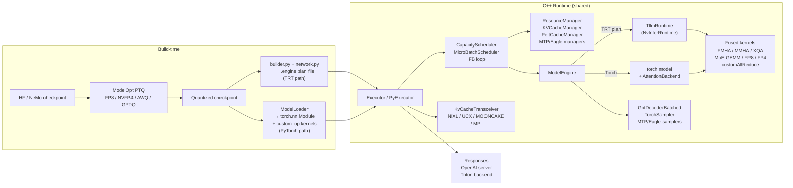

# TensorRT-LLM: NVIDIA's Production Inference Engine

**After reading this chapter, the reader will be able to:**

- Describe TRT-LLM's dual-path architecture (legacy TRT plan vs PyTorch path) and why the PyTorch path became the default in v1.x
- Trace a step through the In-Flight Batching (IFB) loop: the 7 phases from request arrival to output emission and what each resource manager owns
- Explain TRT-LLM's attention plugin (FMHA/MMHA/XQA/MLA) selection and the two-level KV cache manager
- Describe TRT-LLM's MoE stack: ConfigurableMoE, DWDP, Helix parallelism, EPLB, DeepEP
- State how disaggregated serving works in TRT-LLM (trtllm-serve, Dynamo integration, NIXL/Mooncake transceiver)

TensorRT-LLM is NVIDIA's official high-performance inference engine and the canonical answer when the question is "how do I extract maximum throughput from an H100 or B200 cluster?" It is not a research engine or a pedagogical framework; it is the deployment target for NVIDIA's cloud partners, internal serving teams, and the AI Enterprise product line. The codebase at `v1.3.0rc14` (commit `a753934d6445b32b7175a97eb32de06ee3319a94`) is simultaneously a mature C++ runtime that has handled production traffic for years and a live frontier for Blackwell-specific features like NVFP4, Helix parallelism, and DeepSeek sparse attention. Understanding it means understanding both the historical AOT path and the newer PyTorch path that has become the default.

The engine's defining architectural tension is between compilation and dynamism. Ahead-of-time compilation to a TensorRT plan file delivers maximum kernel fusion and the lowest possible per-step overhead — but a plan is a binary artifact built for a specific model, precision, batch-size range, and GPU generation. Every change to any of those parameters requires a rebuild that can take tens of minutes. The PyTorch path defers most compilation decisions to `torch.compile` and runtime CUDA-graph capture, which dramatically reduces iteration time while still applying TRT-LLM's custom kernels for attention, MoE, and quantized GEMMs. As of v1.x the PyTorch path is the default because the gap in steady-state throughput has closed sufficiently that the faster iteration cycle dominates the decision. The TRT plan path remains available — and in some Triton-based deployments is still preferred — but new features target the PyTorch path first.

---

## Part 1: Dual-path architecture

### The TRT plan path (legacy)

The TRT plan path treats model compilation as an offline, build-once operation. The Python frontend in `tensorrt_llm/builder.py` and `tensorrt_llm/network.py` uses TensorRT's `INetworkDefinition` API to *describe* the transformer symbolically. Each operator in the graph is either a native TRT layer or a custom plugin from `cpp/tensorrt_llm/plugins/` — the attention plugin, MoE GEMM plugin, LoRA plugin, NCCL plugin, and a family of quantization-aware GEMM plugins are all registered through the `IPluginRegistry` at `cpp/tensorrt_llm/plugins/api/`. The builder calls `tensorrt_llm.functional` to convert model-level operations into plugin nodes, then invokes `trt.Builder.build_serialized_network`, which runs TensorRT's tactic search (autotune over CUTLASS GEMM tactics, FMHA cubin selection) and emits a `.engine` plan file alongside a `config.json`.

At runtime, `cpp/tensorrt_llm/runtime/tllmRuntime.cpp:TllmRuntime` deserializes the plan, creates execution contexts, and feeds them to the In-Flight Batching loop in `cpp/tensorrt_llm/batch_manager/trtGptModelInflightBatching.cpp`. The plan file is a binary blob that captures fixed shape profiles — `min/opt/max` for batch size and sequence length. This is the core AOT contract: shape specialization enables aggressive kernel fusion, but changes to model architecture, hardware generation, or batch-size envelope require a full rebuild. The `REFIT` flag allows weight updates without rebuilding the engine graph, which helps for LoRA adapter swaps and for shipping a single engine to multiple weight variants of the same architecture.

Checkpoint conversion is handled by per-family `convert_checkpoint.py` scripts (e.g., `examples/llama/convert_checkpoint.py`) that translate HF or NeMo weights into TRT-LLM's expected tensor-parallel sharding and naming conventions. Quantization via ModelOpt (`tensorrt_llm/quantization/quantize_by_modelopt.py`) happens before engine build and attaches a `QuantConfig` to each `Linear` layer so the builder instantiates the correct quantized plugin variant.

### The PyTorch path (default since v1.x)

The PyTorch path lives under `tensorrt_llm/_torch/`. Models are `torch.nn.Module` subclasses in `tensorrt_llm/_torch/models/` (e.g., `modeling_llama.py`, `modeling_deepseekv3.py`). Attention and MoE operations are replaced with TRT-LLM custom ops registered via `torch.library.custom_op` in `cpp/tensorrt_llm/thop/`. These ops call the same C++ FMHA, MMHA/XQA, and grouped-GEMM kernels used by the TRT plan path, but they are invoked through PyTorch's dispatch machinery rather than through TensorRT's plugin registry.

`torch.compile` with a piecewise CUDA-graph capture pass (`tensorrt_llm/_torch/compilation/backend.py` and `piecewise_optimizer.py`) is layered on top. The compilation backend identifies "static" segments (fixed-shape regions like the attention GEMM) and captures them as CUDA graphs; "dynamic" segments (e.g., scheduling logic, variable-length padding operations) run eagerly. This piecewise approach avoids the shape-recompilation problem that trips up naive full-graph captures on variable-length inference workloads. The `CUDAGraphRunner` in `tensorrt_llm/_torch/pyexecutor/cuda_graph_runner.py` manages graph replay.

The `PyExecutor` in `tensorrt_llm/_torch/pyexecutor/py_executor.py` drives the loop. It binds the same C++ `KVCacheManager`, `CapacityScheduler`, and `MicroBatchScheduler` that the TRT path uses — these are exposed to Python via nanobind in `cpp/tensorrt_llm/nanobind/`. The Python executor loop additionally implements an **overlap scheduler** (documented in `docs/source/features/overlap-scheduler.md`) that launches GPU work for step $n+1$ while the CPU finalizes step $n$'s responses, mirroring the zero-overhead schedulers in NanoFlow and SGLang.

There is also a third, forward-looking path: **AutoDeploy** (`tensorrt_llm/_torch/auto_deploy/`). AutoDeploy runs `torch.export` on any HuggingFace model, then applies a sequence of FX-graph rewrites to inject TRT-LLM kernels without requiring a hand-written `modeling_*.py`. It is the long-term on-ramp for new architectures, but today it covers a narrower feature set than the bespoke model files.

### Both paths, one runtime

The defining structural fact is that everything below the model forward pass is shared:

The C++ side in `cpp/tensorrt_llm/batch_manager/`, `cpp/tensorrt_llm/executor/`, and `cpp/tensorrt_llm/runtime/` implements In-Flight Batching, the paged KV-cache block manager, the `Executor` API, the disaggregated cache transceiver, and the fused kernels. Whether a request arrives through a TRT-engine-driven `Executor` or a PyTorch-driven `PyExecutor`, it becomes an `LlmRequest` object managed by the same `KVCacheManager` and `ScheduledRequests` machinery defined in C++.

---

## Part 2: The In-Flight Batching loop

### Executor and deployment modes

The public C++ API is `Executor`, declared in `cpp/include/tensorrt_llm/executor/executor.h` and implemented in `cpp/tensorrt_llm/executor/executorImpl.cpp`. Python users access it via `tensorrt_llm/bindings/executor` or through the high-level `LLM` class in `tensorrt_llm/llmapi/llm.py`. Three deployment modes are supported:

- **In-process**: `LLM` constructs a `PyExecutor` directly inside the calling Python process, one per rank. Simplest for single-node setups.
- **MPI orchestrator**: `tensorrt_llm/llmapi/mpi_session.py:MpiPoolSession` spawns `MPI_Comm_spawn`'d worker processes; the leader runs `tensorrt_llm/llmapi/mgmn_leader_node.py:MgmnLeaderNode` and dispatches through `tensorrt_llm/executor/proxy.py:ExecutorProxy`. This is the primary production path for multi-node MGMN deployments.
- **Ray orchestrator**: `tensorrt_llm/executor/ray_executor.py:RayExecutor` is an alternative to MPI better suited to Kubernetes deployments, though the codebase still defaults to MPI for most production paths.

### The 7-step IFB loop

`cpp/tensorrt_llm/batch_manager/trtGptModelInflightBatching.cpp` is the heart of the runtime. Each iteration processes a mixed batch of prefill (context) tokens from newly admitted requests and decode tokens from ongoing sequences. The steps are:

**Step 1 — Request intake.** `Executor::enqueue()` adds a new `LlmRequest` to the waiting queue. Each request carries token ids, sampling parameters, LoRA task id (if applicable), and optional disaggregation metadata (`DisaggregatedParams`). Priority and cancellation are enforced here; the executor guarantees exactly-once delivery.

**Step 2 — Scheduling.** `cpp/tensorrt_llm/batch_manager/capacityScheduler.cpp:CapacityScheduler` decides which waiting requests can be admitted given current KV-cache block availability and PEFT-cache budgets. Two policies are available via `executor::SchedulerPolicy`: `MAX_UTILIZATION` (admit aggressively and evict on overflow) and `GUARANTEED_NO_EVICT` (admit only if completion is feasible). `cpp/tensorrt_llm/batch_manager/microBatchScheduler.cpp:MicroBatchScheduler` then splits fitting requests into context and generation sub-batches, respecting `max_batch_size`, `max_num_tokens`, and `max_context_length`. **Chunked prefill** is implemented here: a long context can be split across iterations so that one step packs a partial context chunk alongside many decode tokens — this is the mechanism that maintains decode throughput even during long-prompt ingestion.

**Step 3 — KV block allocation.** `cpp/tensorrt_llm/batch_manager/allocateKvCache.cpp` calls `cpp/tensorrt_llm/batch_manager/kvCacheManager.cpp:KVCacheManager::addSequence` to reserve paged blocks for newly admitted requests. For chunked prefill, only the blocks needed for the current chunk are allocated at this step; the remainder are allocated in subsequent iterations as the context advances.

**Step 4 — Model execution.** The runtime buffers in `cpp/tensorrt_llm/batch_manager/runtimeBuffers.cpp` pack `input_ids`, `position_ids`, `kv_cache_block_offsets`, and `host_request_types` into the engine's input tensors. Remove-input-padding is mandatory in IFB mode: context and decode tokens are concatenated into a single packed tensor segmented by `host_context_lengths`, with context sequences first and generation sequences after (per the comment in `cpp/tensorrt_llm/plugins/gptAttentionPlugin/gptAttentionPlugin.h`). The forward pass then runs — either `TllmRuntime::executeV2` for the TRT plan path or `CUDAGraphRunner::replay` for the PyTorch path.

**Step 5 — Sampling.** `cpp/tensorrt_llm/runtime/gptDecoderBatched.cpp` and `cpp/tensorrt_llm/layers/dynamicDecodeLayer.cpp` apply the sampling stack: penalty layers, banned words, top-k/top-p (`samplingAirTopPKernels.cu`), beam search (`beamSearchLayer.cu`), and speculative-decoding samplers. Temperature and repetition penalties are applied before the top-p/top-k gate.

**Step 6 — Output emission.** `cpp/tensorrt_llm/batch_manager/handleGenerationLogits.cpp` (and `handleContextLogits.cpp` for logit-return requests) places completed tokens into the response queue. The executor delivers `RequestOutput` objects with token ids and, optionally, log-probabilities. Streaming is supported; each generated token can be emitted immediately.

**Step 7 — State update.** `cpp/tensorrt_llm/batch_manager/updateDecoderBuffers.cpp` writes new tokens back into KV slots and advances sequence lengths. For speculative decoding, rejected tokens are evicted here. Finished sequences release their KV blocks via `KVCacheManager::removeSequence`; sequences that were paused due to capacity pressure are marked in `pauseRequests.cpp` and re-queued.

### RequestSlot and resource managers

Each in-flight sequence occupies a `RequestSlot`: a struct tracking the sequence's current position in the batch, its list of allocated KV block pointers, its generation state, and speculative-decoding metadata (draft token positions, tree masks). The slot is the unit of work the scheduler reasons about.

The Python-side `tensorrt_llm/_torch/pyexecutor/resource_manager.py:ResourceManager` registers per-resource-type managers — `KV_CACHE_MANAGER`, `PEFT_CACHE_MANAGER`, `MAMBA_CACHE_MANAGER`, `EAGLE3_RESOURCE_MANAGER`, `MTP_HIDDEN_STATES_MANAGER` — each exposing `prepare_resources` / `update_resources` / `free_resources`. This registry is the extension point for new state-bearing decoding schemes: adding Mamba state management or MTP hidden-state caching required no changes to the core IFB loop, only a new manager implementation.

---

## Part 3: Attention plugin and KV cache

*See also [§10/01](../10-engine-core/01-attention-kernels.md) for the algorithmic foundations and [§10/02](../10-engine-core/02-paged-kv-memory.md) for the block-manager design.*

### Kernel selection: FMHA, MMHA, XQA, MLA

The GPT attention plugin (`cpp/tensorrt_llm/plugins/gptAttentionPlugin/gptAttentionPlugin.{h,cpp}`) is the master attention operator for the TRT plan path. It dispatches between four kernel families based on request type and shape:

**FMHA (Fused Multi-Head Attention)** serves the prefill (context) phase. The kernels live in `cpp/tensorrt_llm/kernels/contextFusedMultiHeadAttention/` and are precompiled CUBINs selected at runtime by `fmhaRunner.cpp`. Supports MHA, GQA, and MQA; FP16/BF16 and FP8 variants (`use_fp8_context_fmha`); ALiBi, sliding-window, causal, and chunked-prefill mask types via `AttentionMaskType`. On Hopper, the Hopper-specialized variant uses warp-specialized pipelines exploiting TMA and WGMMA — the same principles as FlashAttention-3. Speculative-decoding tree masks are supplied as packed 32-bit bitmaps via `fmhaPackedMask.cu`.

**MMHA (Masked Multi-Head Attention)** serves the decode phase. `cpp/tensorrt_llm/kernels/decoderMaskedMultiheadAttention/` implements per-token decode where each query reads from the full KV cache accumulated so far. Each running request produces exactly one query vector per head; the kernel fuses the KV load, scaled dot-product, and value aggregation into a single pass.

**XQA (Cross-Query Attention)** is NVIDIA's optimized decode kernel for GQA and MQA. It loads each KV block once and processes multiple query vectors against it — amortizing the KV memory bandwidth across queries sharing KV heads. Two implementation strategies coexist: a precompiled path (`decoderXQAImplPrecompiled.cpp`) for known hardware configurations and a JIT-cubin path (`decoderXQAImplJIT/`) for others. XQA supports FP8, paged KV, speculative tree masks, and NVFP4 KV (on Blackwell, NVFP4 K/V are decoded back to BF16 inside the kernel via micro-block scales). The dispatcher is `xqaDispatcher.cpp`; head dimension, KV head count, and precision together select the cubin.

**MLA (Multi-head Latent Attention)** is the kernel path for DeepSeek V3 and R1. Rather than storing full K and V tensors, MLA stores compressed latent vectors of dimension `kv_lora_rank + qk_rope_head_dim` per token and decompresses them on-the-fly inside the attention kernel. The implementation is `cpp/tensorrt_llm/kernels/mlaKernels.cu`, `mlaChunkedPrefill.cu`, and the bundled FlashMLA project at `cpp/tensorrt_llm/flash_mla/`. On Hopper, the FP8 FlashMLA kernel from DeepSeek's open-source release is preferred; on Blackwell, a TRT-LLM-Gen CUTE-DSL variant under `cpp/tensorrt_llm/kernels/trtllmGenKernels/fmha/` is used instead. The attention plugin was extended with new input tensors for the MLA projections: `q_a_proj_tensor`, `q_b_proj_tensor`, `kv_a_proj_with_mqa_tensor`, and associated scale tensors.

For the PyTorch path, the `AttentionBackend` interface in `tensorrt_llm/_torch/attention_backend/interface.py` selects between backends: `trtllm.py` (default, wraps the same C++ kernels via `tensorrt_llm.bindings.internal.thop.attention_op`), `flashinfer.py`, `trtllm_gen.py` (Blackwell CUTE-DSL kernels), `vanilla.py` (reference), and sparse variants under `sparse/` (DSA, RocketKV, BLASST).

### Two-level KV cache manager

`cpp/tensorrt_llm/batch_manager/kvCacheManager.{h,cpp}` implements the block manager. The key types:

- `KVCacheBlock`: a fixed-size physical block. `tokens_per_block` is configurable (typically 32–128, default 64) and determines block granularity — smaller blocks improve reuse precision at the cost of more pointer indirection; larger blocks reduce metadata overhead.
- `BlockManager`: owns a two-level pool. `kPrimaryLevel` is GPU HBM (the primary working set). `kSecondaryLevel` is host DRAM accessed via UVM or pinned memory (overflow and swap for sequences that exceed GPU capacity). When the primary pool is exhausted, `KVCacheTransferManager` evicts cold blocks to secondary asynchronously. The eviction policy is pluggable (`evictionPolicy.cpp`); LRU and a priority-aware `KvCacheRetentionConfig` (per-request retention hints that can mark blocks as high-priority) are both provided.

Block sizing accounts for model specifics: MLA sequences store latent vectors of size `kv_lora_rank + qk_rope_head_dim` rather than full KV heads, so the block pool is sized accordingly via `cacheType=MLA` in `kvCacheType.h`. For models with mixed full-attention and sliding-window attention layers (Mistral, Gemma-3 hybrid), `BlocksPerWindow` tracks separate primary/secondary block budgets per attention-window size, and `kSWAExtraBlock` reserves an extra block per SWA layer to maintain the rolling window invariant.

**Radix prefix cache.** When `enable_block_reuse=true`, `cpp/tensorrt_llm/batch_manager/radixBlockTree.h` builds a radix tree keyed by `BlockKey` — a hash of the token window plus LoRA task id plus cache salt. When two requests share a token prefix, their physical blocks are shared; on divergence a copy-on-write split occurs. The scheduler in `capacityScheduler.cpp` exploits this: when chunked prefill is active, the first block contributed by an in-flight prefix is registered immediately, and subsequent requests with the same prefix are deferred one iteration to share the block rather than duplicate work.

**KV cache events.** `cpp/tensorrt_llm/batch_manager/kvCacheEventManager.cpp` emits `BlockAdded`, `BlockRemoved`, and `Updated` events to the executor. These events feed the `KVCacheAwareRouter` in the disaggregated serving layer, enabling the router to prefer sending requests to the worker that already holds the relevant prefix blocks.

**FP8 and NVFP4 KV.** FP8 KV cache is enabled per layer via `KvCacheConfig(dtype='fp8')`; quant/dequant scales are passed alongside the QKV tensor. NVFP4 KV cache (`KvCacheConfig(dtype='nvfp4')`) requires Blackwell hardware and a ModelOpt-quantized checkpoint. Attention outputs can optionally be returned pre-quantized so the next GEMM remains in FP8/FP4 (via `attention_output_quantization_scale`).

---

## Part 4: MoE — ConfigurableMoE and advanced parallelism

*See also [§20](../20-distributed-inference/) for the broader parallelism chapter.*

### ConfigurableMoE

`tensorrt_llm/_torch/modules/fused_moe/configurable_moe.py:ConfigurableMoE` is the new unified MoE layer that replaced the proliferation of `XXFusedMoE` subclasses. It composes three orthogonal concerns:

1. **Backend** (pure compute): CUTLASS grouped-GEMM, TRT-LLM-Gen CUTE-DSL, DeepGEMM, or Triton. The backend is selected at creation time via `create_moe.py:create_moe` based on hardware generation and precision. The CUTLASS MoE GEMM kernels live in `cpp/tensorrt_llm/kernels/cutlass_kernels/moe_gemm/`; the TRT plan path uses `cpp/tensorrt_llm/plugins/mixtureOfExperts/mixtureOfExpertsPlugin.{h,cpp}`.
2. **Communication** (token dispatch): the `communication/` subdirectory provides `NVLinkOneSided`, `NVLinkTwoSided`, `DeepEP`, and `DeepEPLowLatency` strategies. At runtime `AlltoallMethodType` picks between them based on EP size and interconnect topology.
3. **Load balancer** (EPLB, optional): `moe_load_balancer.py:MoeLoadBalancer` tracks tokens-per-expert per step and manages redundant expert replicas.

Routing is in `routing.py`, which implements top-$k$ routing with optional auxiliary-loss-free balancing (DeepSeek's no-aux-loss algorithm via `noAuxTcKernels.cu`), sigmoid-gate routing, and perfect-router precomputation.

The MoE quantization matrix in `tensorrt_llm/_torch/modules/fused_moe/MOE_DEVELOPER_GUIDE.md` maps (Backend, QuantAlgo, SM architecture) triples to supported configurations. NVFP4 and MXFP4 MoE GEMMs require SM100/103/120/121 (Blackwell B100/B200/RTX 50-series). FP8 MoE GEMMs work from Hopper (SM90) onward.

### DWDP (Dual-Worker Data Parallelism)

DWDP (`tensorrt_llm/_torch/modules/fused_moe/dwdp.py`, blog post 19) is a technique for maintaining data-parallel efficiency when expert weights are too large to replicate fully across all GPUs. Two DP workers share a single physical GPU and process separate micro-batches. The key insight is that the two workers' MoE communication phases can be interleaved: while worker A is dispatching tokens to experts (all-to-all), worker B is accumulating expert outputs (all-to-all return), and vice versa. This double-buffered overlap eliminates the network idle gap that would otherwise stall the GPU between forward passes. DWDP uses `cudaMemcpyAsync` to prefetch expert weights from peer GPUs (via NVLink IPC), avoiding NCCL all-gather collectives entirely.

### Helix parallelism

Helix (`docs/source/features/helix.md`, arXiv 2507.07120, `CpType.HELIX` in `tensorrt_llm/mapping.py`) is a hybrid CP+TP+EP layout that reconfigures the same $N$ GPUs between two phases within each layer. During the **attention phase**, GPUs are arranged as KVP groups times TP\_A shards; the KV cache is sequence-sharded across KVP groups using a hierarchical Flash-Decoding approach (log-sum-exp rescaling for exact online-softmax across ranks). During the **FFN/MoE phase**, the same GPUs are reconfigured as TP\_F shards times EP groups. The configuration switch happens at the layer boundary with no weight movement — the same physical GPU holds both the attention-TP shard and the expert-EP shard, but applies different collective patterns depending on which phase is executing. Helix is currently MLA-only on Blackwell and is the primary mechanism for multi-million-token decode on GB200 NVL72 racks.

### EPLB (Expert Parallel Load Balancing)

`tensorrt_llm/_torch/modules/fused_moe/moe_load_balancer.py:MoeLoadBalancer` tracks the per-expert token count over a sliding window of steps. When an expert becomes hot (receives disproportionately many tokens), EPLB creates redundant replicas of that expert on additional ranks and updates the dispatch table so subsequent routing decisions spread load across replicas. Weight migration between ranks uses the copy engine (`cudaMemcpyAsync`) to avoid stalling the compute stream. Both online (live migration) and offline (pre-computed static layout) variants are supported, documented in blog post 4.

### DeepEP

For large-scale expert parallelism (EP > 8), TRT-LLM bundles DeepSeek's EP all-to-all implementation under `cpp/tensorrt_llm/deep_ep/`. DeepEP uses NVSHMEM for one-sided RDMA over NVLink/InfiniBand, allowing each GPU to push tokens directly to the destination GPU's memory buffer without a matching receive call. The `DeepEPLowLatency` path is tuned for decode-phase traffic where token counts per step are small but latency is critical. The `AlltoallMethodType` enum in `configurable_moe.py` selects between `NVLinkOneSided` (best for NVL72 racks with full NVLink fabric), `NVLinkTwoSided`, `DeepEP`, and `DeepEPLowLatency` based on EP size and whether NVSHMEM is available.

---

## Part 5: Quantization

*See also [§10/04](../10-engine-core/04-quantization.md) for the algorithmic foundations.*

### Supported algorithms

`tensorrt_llm/quantization/mode.py:QuantAlgo` enumerates every supported algorithm. The production-relevant subset:

- **W8A8 FP8** (`QuantAlgo.FP8`, `FP8_PER_CHANNEL_PER_TOKEN`, `FP8_BLOCK_SCALES`): weight and activation quantization to E4M3. FP8 GEMM kernels use CUTLASS Hopper `fp8_blockscale_gemm` (`cpp/tensorrt_llm/kernels/cutlass_kernels/fp8_blockscale_gemm/`) or TRT-LLM-Gen CUTE-DSL kernels. Block-scale FP8 improves accuracy by applying per-block rather than per-tensor scaling.
- **NVFP4 / W4A4** (`QuantAlgo.NVFP4`, `NVFP4_AWQ`, `NVFP4_ARC`): NVIDIA's Blackwell-native block FP4. Both attention GEMMs and FFN GEMMs can use NVFP4. Kernels live in `cpp/tensorrt_llm/kernels/cutlass_kernels/fp4_gemm/` and `cpp/tensorrt_llm/plugins/fp4GemmPlugin/`. Requires B100/B200/GB200 (SM100+).
- **INT4 GPTQ-Marlin** (`QuantAlgo.W4A16_GPTQ`, `W8A16_GPTQ`): W4A16 weight-only quantization using the Marlin kernel for fast dequant. Implemented via `weightOnlyGroupwiseQuantMatmulPlugin`.
- **AWQ** (`QuantAlgo.W4A16_AWQ`, `W4A8_AWQ`): activation-aware weight quantization with per-group scaling. Same plugin family as GPTQ; the scaling vectors are different.
- **SmoothQuant** (`QuantAlgo.W8A8_SQ_PER_CHANNEL_PLUGIN` and variants): W8A8 INT8 with per-channel activation smoothing. Implemented via `cpp/tensorrt_llm/plugins/smoothQuantGemmPlugin/`.
- **Mixed-precision MoE** (`W4A8_NVFP4_FP8`, `W4A8_MXFP4_FP8`, `W4A8_MXFP4_MXFP8`): separate precision for expert weights (FP4/MXFP4) and activations (FP8/MXFP8) in MoE layers.
- **KV cache quantization**: `KvCacheConfig(quantType=KV_CACHE_QUANT_ALGO_LIST)` where valid options are `FP8`, `INT8`, and `NVFP4`. Applied independently from weight quantization.

### ModelOpt integration

Calibration-side quantization is delegated to NVIDIA's Model Optimizer via `tensorrt_llm/quantization/quantize_by_modelopt.py`. The workflow:

1. Load the HF model with `transformers.AutoModelForCausalLM`.
2. Configure `modelopt.torch.quantization` with the target algorithm and a per-recipe `QuantConfig`. For KV cache quantization, the config contains a regex map (`KV_CACHE_CFG`) targeting `*.k_proj.output_quantizer` and similar projection outputs.
3. Calibrate on a small dataset (default: CNN DailyMail) to collect activation statistics and determine per-layer scales.
4. Export to a TRT-LLM-style checkpoint (safetensors + `config.json`) consumable by either the TRT plan path or the PyTorch path.

This separation of concerns means calibration always runs in PyTorch, which supports the full model graph including control flow; TRT-LLM then consumes the pre-calibrated scales without needing to re-run calibration at build time. LoRA adapters can compose with FP8 or NVFP4-quantized base models.

---

## Part 6: Speculative decoding

*See also [§10/05](../10-engine-core/05-speculative-decoding.md) and [§10/06](../10-engine-core/06-multi-token-prediction.md).*

The speculative decoding zoo lives in `tensorrt_llm/_torch/speculative/`. TRT-LLM supports both **two-engine** mode (separate draft and target model engines) and **one-engine** mode (draft mechanism baked into the target model, e.g., MTP heads). One-engine mode optionally uses a separate draft KV cache (`should_use_separate_draft_kv_cache` in `mtp.py`) to prevent rejected draft trees from polluting the target's prefix cache.

| File | Algorithm |
|------|-----------|
| `mtp.py` | DeepSeek **Multi-Token Prediction** — parallel prediction heads attached to the target model. `MTPHiddenStatesManager` reserves per-request hidden-state slots in the resource manager; `MTPSampler` handles verification and draft generation. |
| `eagle3.py`, `eagle3_dynamic_tree.py` | **EAGLE-3** (Li et al., arXiv 2503.01840) — external draft model conditioned on residual hidden states from the target's intermediate layers. Supports both chain drafting and dynamic tree-of-drafts (`SpecTreeManager`, `dynamic_tree_ops.py`). `Eagle3ResourceManager` caches the activations. |
| `ngram.py` | **Prompt-lookup decoding** — n-gram cache self-speculative. `NGramPoolManager` maintains per-request or shared pattern→draft pair pools. |
| `pard.py` | **PARD (Parallel Auto-Regressive Decoding)** — joint decode of multiple next-token candidates. |
| `dflash.py` | **DFlash** — speculative decoding with flash-attention integration. |
| `suffix_automaton.py` | **Suffix automaton** — longest suffix matching for code and structured generation; useful when repetition patterns exceed ngram coverage. `sa_enhancer.py` layers this on top of MTP or EAGLE as a secondary draft source. |
| `auto_heuristic.py`, `speculation_gate.py` | Dynamic enable/disable of speculation based on live batch state; prevents speculation overhead when batch utilization is high enough that speculative gains are negative. |

**MTP Relaxed Acceptance** is NVIDIA's headline contribution to this space (blog post 2). Standard speculative decoding accepts a draft token only if the target model's top-1 prediction matches exactly. Relaxed acceptance extends this: a draft token is accepted if the target's output places that token within the top-$N$ candidates. For reasoning tasks (DeepSeek-R1-style chain-of-thought), the acceptance rate improvement from relaxed acceptance is substantial because the model is frequently uncertain between a small set of grammatically valid continuations. The trade-off is a bounded (not zero) change to the output distribution, which is acceptable for inference workloads that do not require exact sampling guarantees.

The `gptAttentionPlugin` accepts speculative-tree-mask inputs (`spec_decoding_packed_mask`, `spec_decoding_position_offsets`, `spec_decoding_generation_lengths`) from the decoding layers, allowing the attention kernel to process tree-structured draft batches in a single forward pass.

---

## Part 7: Disaggregated serving

*See also [§20](../20-distributed-inference/) for the general disaggregation architecture.*

### Three serving paths

TRT-LLM supports disaggregated prefill-decode across three deployment configurations, all using the same underlying KV cache transceiver.

**`trtllm-serve` native.** The built-in disaggregated server is launched via the CLI entry in `tensorrt_llm/commands/serve.py`. $N$ context (prefill) workers and $M$ generation (decode) workers run as separate processes. An `OpenAIDisaggServer` (`tensorrt_llm/serve/openai_disagg_server.py`) acts as the orchestrator: it accepts OpenAI API requests, routes each to a context instance (round-robin or via `KVCacheAwareRouter` consuming KV-cache events from `kvCacheEventManager.cpp`), waits for the context worker to signal completion of KV transfer, then forwards a `DisaggregatedParams` token to a generation instance. The generation instance begins decoding from the transferred KV state without recomputing the context. The router in `tensorrt_llm/serve/router.py:Router` handles load balancing and health monitoring.

**Dynamo integration.** NVIDIA's `ai-dynamo/dynamo` inference router can use TRT-LLM workers as Dynamo workers. The integration point is the same disaggregated executor request pattern; Dynamo contributes dynamic instance scaling, Kubernetes integration, and a dedicated KV-aware routing layer. NIXL is the KV transfer fabric on Dynamo deployments.

**Triton Inference Server backend.** The C++ backend in `triton_backend/inflight_batcher_llm/src/libtensorrtllm.cc` directly exposes the C++ `Executor` to Triton's C API. The `all_models/inflight_batcher_llm/` ensemble glues a Python tokenizer (`preprocessing/`) to the executor backend (`tensorrt_llm/`) to a Python detokenizer (`postprocessing/`). The `tensorrt_llm_bls/` model is a Python Business Logic Scripting backend that ties them together with stop-word logic and streaming. `disaggregated_serving/` extends the BLS orchestrator to route between context and generation Triton model instances. The Triton path is NVIDIA AI Enterprise's primary production deployment surface; it speaks gRPC and HTTP and integrates with Kubernetes autoscaling.

### KV cache transceiver

`cpp/tensorrt_llm/batch_manager/cacheTransceiver.cpp`, `dataTransceiver.cpp`, and `cacheFormatter.cpp` implement a sender/receiver state machine that moves KV blocks from the prefill worker to the decode worker. For MLA-shaped KV layouts, `mlaCacheFormatter.cpp` handles the latent-vector packing. The transceiver supports **TP/PP/DP layout transformation**: the context instance can run with a different TP and PP configuration than the generation instance, and a small layout-conversion kernel rebins blocks during transfer — this is critical for heterogeneous clusters where prefill and decode are provisioned with different parallelism strategies.

A key optimization is **per-layer overlap** (`cpp/tensorrt_llm/batch_manager/contextProgress.cpp`): the context worker exposes a per-layer progress pointer that the generation worker polls. As soon as layer $i$'s KV blocks are computed at the context worker, the generation worker begins pulling them over the fabric — overlapping context compute with KV transfer rather than waiting for the full context forward pass to complete before starting any transfer.

Pluggable transceiver backends:
- **NIXL**: NVIDIA's cross-tier transfer agent (default); unifies CPU-pageable memory, GPU RDMA, and NVLink fabric into a single API. Python entry: `tensorrt_llm/_torch/disaggregation/nixl/agent.py:NixlTransferAgent`.
- **UCX**: userspace RDMA via UCX, suitable for InfiniBand clusters without NIXL.
- **MOONCAKE**: Moonshot AI's KV transfer implementation, used in Kimi-scale deployments.
- **MPI**: `MPI_Isend`/`MPI_Irecv`, legacy path for simple setups.

The Python orchestration wraps these in `tensorrt_llm/_torch/disaggregation/transceiver.py:KvCacheTransceiverV2`. The `AsyncTransferManager` inside `py_executor.py` pins KV blocks for the duration of an async transfer and unpins on completion, preventing the block manager from evicting blocks that are in flight.

---

## Part 8: LoRA

*See also [§40/01](../40-multi-tenant/01-lora-serving.md) for the multi-tenant serving perspective.*

TRT-LLM supports LoRA on both paths. On the **TRT plan path**, `loraPlugin` (`cpp/tensorrt_llm/plugins/loraPlugin/`) fuses the low-rank matmul $\Delta W = B A$ into the base linear layer. Adapter weights live in `cpp/tensorrt_llm/runtime/loraCache.cpp:LoraCache`, an LRU host/device cache, and are paged in per-request via `cpp/tensorrt_llm/batch_manager/peftCacheManager.cpp:PeftCacheManager`. Per-request LoRA selection is via `LoraTaskIdType` in the `LlmRequest`. Multi-LoRA — different adapters for different requests in the same batch — is the explicit design goal. The `loraModule.cpp` enumerates all projection points that can carry LoRA (q, k, v, o, gate, up, down, and fused qkv).

On the **PyTorch path**, `tensorrt_llm/_torch/peft/lora/layer.py:LoraLayer` wraps the base linear and adds the rank-decomposed delta. `adapter_slot_manager.py:AdapterSlotManager` manages a slot pool sized by `max_loras`. `cuda_graph_lora_manager.py:CudaGraphLoraManager` packs LoRA inputs in a way compatible with CUDA-graph replay — a non-trivial challenge because CUDA graphs capture pointer addresses at record time, and LoRA adapter selection is dynamic per request. Dynamic LoRA loading for multi-tenant scenarios (loading and evicting adapters between requests) uses rank-sorted SGMV batching to group requests by LoRA rank and minimize kernel launch overhead.

Both HuggingFace and NeMo LoRA formats are ingested. LoRA composes with FP8 and NVFP4 quantized base models. The DoRA variant (`doraPlugin`, `cpp/tensorrt_llm/kernels/doraScaling.cu`) adds magnitude scaling on top of the standard LoRA delta.

---

## Current production state

TensorRT-LLM is the engine of choice when maximum single-cluster throughput on NVIDIA hardware is the primary objective and the operator can absorb the longer build pipeline and tighter hardware coupling. NVIDIA's cloud partners and internal serving teams run it in production on H100 and B200 clusters; the Triton Inference Server backend is the primary deployment surface for AI Enterprise customers. The combination of AOT kernel specialization (or piecewise CUDA graph capture for the PyTorch path), custom CUTLASS-DSL kernels shipped as CUBINs, and first-party hardware feature exploitation (NVLink one-sided all-to-all, NVLS multicast, Blackwell TMEM, copy-engine weight migration) gives TRT-LLM a persistent throughput advantage over framework-agnostic alternatives on NVIDIA hardware.

The maturation of the PyTorch path has substantially closed the iteration-velocity gap relative to vLLM and SGLang. The main remaining friction is compile overhead: `torch.compile` with piecewise CUDA-graph capture still adds startup latency that pure eager-mode frameworks avoid, and debugging compilation failures requires familiarity with both PyTorch's FX graph machinery and TRT-LLM's backend. The AutoDeploy path (`tensorrt_llm/_torch/auto_deploy/`) aims to eliminate the per-model `modeling_*.py` authoring burden by exporting and rewriting HF model graphs automatically, but it has not yet reached feature parity with the bespoke model implementations for non-trivial capabilities like MoE, MLA, and sparse attention.

The headline production use case for 2025–2026 is DeepSeek-V3/R1 inference at scale. TRT-LLM was first-to-market with working DeepSeek FP8 inference, and the combination of MLA latent KV cache, MTP with relaxed acceptance, EPLB, DeepEP, and DWDP is the most thoroughly optimized DeepSeek stack available. For a 256-GPU GB200 NVL72 deployment running DeepSeek-V3 at maximum throughput, the recommended configuration is Helix parallelism (attention-DP for KV sharding + expert parallelism for FFN) combined with DWDP (peer-GPU expert weight prefetch) and online EPLB (hot expert replication) — a configuration that would require assembling three separate optimization systems in any other engine.
