# LMCache: Hierarchical KV Cache as a Library

**After reading this chapter, the reader will be able to:**

- Describe LMCache's position in the stack: a library that adds hierarchical KV cache tiers on top of any engine (vLLM, SGLang, TRT-LLM) via a well-defined connector interface, without requiring changes to the engine's scheduler or attention kernels.
- Trace a KV chunk through the storage tier stack — from GPU HBM through CPU DRAM, peer-to-peer transfers, NIXL endpoints, NVMe (with and without GPUDirect Storage), Redis, and S3 — and explain what governs promotion and eviction at each boundary.
- Explain `CacheEngineKey`: the content-addressable key structure and why fixed 256-token chunks enable cross-request, cross-instance, and cross-time prefix sharing.
- Describe CacheGen's arithmetic-coding compression for KV data, the compression ratio tradeoffs, and when the GPU encode/decode overhead pays off against the bandwidth savings.
- Explain how LMCache integrates with vLLM V1 via the `KVConnector` hook, specifically the layerwise save hook pattern that allows copy-out to overlap with the next layer's forward pass.

---

## Introduction

Production LLM serving exposes a mismatch between how compute is priced and how content is structured. System prompts, few-shot examples, retrieval passages, and multi-turn conversation prefixes are reused constantly across requests, across instances, and across time — yet every inference engine that performs its own in-process prefix caching discards that work when the request completes, the GPU is preempted, or the instance is scaled down. vLLM's radix cache [§10/07](../10-engine-core/07-prompt-prefix-caching.md) and SGLang's RadixAttention are excellent within a single process; they cannot reach across instance boundaries or survive restarts.

LMCache, developed at the University of Chicago SKIR group and released in 2024, reframes KV cache reuse as a *Knowledge Delivery Network* problem: KV blocks are content-addressable objects that can be stored in, retrieved from, and promoted through any combination of DRAM, NVMe, Redis, and object storage. The library is implemented primarily in Python, with a small C++/CUDA core in `csrc/` for memory copies, position-encoding kernels, and the CacheGen arithmetic-coding kernels. It hooks into the inference engine via a thin connector interface (`KVConnectorBase_V1` in vLLM) and `init_lmcache_engine` adapter functions in SGLang, requiring no changes to the scheduler or attention kernels. The compression component, CacheGen, was published at SIGCOMM 2024 [CacheGen] and established that arithmetic coding of per-layer KV tensors achieves 2–4× compression at negligible decode latency, making NVMe and network-bound tiers practically viable for hot system prompts.

The key insight that distinguishes LMCache from engine-internal prefix caching is *time independence*: a chunk of KV computed at 3 pm is valid at 4 pm because the model weights have not changed and the token content is identical. Engine-internal caches are scoped to the lifetime of one serving process; LMCache externalizes the cache so its lifetime matches the deployment, not the process. This means a cached system prompt computed by a vLLM instance that was subsequently scaled down is still available to the instances that replaced it, and a prefill worker's KV output is already staged in the decode cluster's NIXL memory before the decode request is routed there.

---

## Part 1: Architecture and Storage Tiers

### The LMCacheEngine object

The central object is `LMCacheEngine`, defined in `lmcache/v1/cache_engine.py`. One instance is created per worker process, so each tensor-parallel rank has its own engine keyed to its shard. The engine exposes four operations to the connector layer: `lookup`, `store`, `retrieve`, and `prefetch`. Internally it delegates to a `StorageManager` (`lmcache/v1/storage_backend/storage_manager.py`), which runs an asyncio event loop on a dedicated thread and multiplexes operations across the ordered backend list.

Alongside the `StorageManager`, the engine holds:

- A **`TokenDatabase`** (`lmcache/v1/token_database.py`) — either `ChunkedTokenDatabase` or `SegmentTokenDatabase` — that translates a token-id sequence into a list of `(start, end, CacheEngineKey)` triples and manages the running-hash chain.
- A **`GPUConnector`** (`lmcache/v1/gpu_connector/gpu_connectors.py`) that bridges the engine's paged KV layout to the contiguous CPU buffer that storage tiers expect. The connector exposes a `load_stream` — a dedicated CUDA stream for async DMA — and handles the reshape from paged block format to the contiguous `MemoryFormat` layout that backends consume.
- A **`MemoryAllocator`** anchored to the `LocalCPUBackend`, which owns all pinned CPU memory and lends buffer slabs to every downstream tier.

```mermaid
flowchart LR
    subgraph EngineProc["Inference engine process"]
      Engine["Engine scheduler\n+ model runner"]
      Conn["KVConnector V1\n(integration/vllm, /sglang, /tensorrt_llm)"]
      Engine --> Conn
    end

    subgraph LMC["LMCacheEngine (v1/cache_engine.py)"]
      TDB["TokenDatabase\n(Chunked / Segment)"]
      GPUC["GPUConnector\n(KV ↔ paged GPU buffer)"]
      SMgr["StorageManager\n(asyncio loop + per-backend executors)"]
      Conn --> TDB
      Conn --> GPUC
      TDB --> SMgr
      GPUC --> SMgr
    end

    subgraph Backends["Storage backends (ordered)"]
      direction TB
      B1["1. PDBackend\n(prefill ↔ decode sidecar)"]
      B2["2. LocalCPUBackend\n(pinned DRAM, allocation owner)"]
      B3["3. P2PBackend\n(peer GPU mesh)"]
      B4["4. NixlStorageBackend\n(NIXL remote DRAM)"]
      B5["5. LocalDiskBackend\n(NVMe async I/O)"]
      B6["6. GdsBackend\n(NVMe via cuFile)"]
      B7["7. MaruBackend\n(vendor backend, maru_path)"]
      B8["8. RemoteBackend\n(Redis / S3 / Mooncake / ...)"]
    end

    SMgr --> B1 --> B2 --> B3 --> B4 --> B5 --> B6 --> B7 --> B8
```



### The storage tier stack

`CreateStorageBackends` (`lmcache/v1/storage_backend/__init__.py`) wires the hierarchy in a fixed order. On a cache miss, the `StorageManager` descends the list until a hit is found or all tiers are exhausted. On eviction from a higher tier, the evicted entry propagates down to the next tier asynchronously. The `LocalCPUBackend` is always the staging buffer for everything below it — almost every tier takes `local_cpu_backend` as a buffer pool parameter.

**Tier 1 — PDBackend.** Enabled by `enable_pd=True`. Used in prefill/decode disaggregation: the prefill worker produces KV and sends it directly to the decode worker without writing to any persistent tier. The control path runs over ZMQ; the data path uses a `transfer_channel` — either `nixl_channel.py` (NIXL-based, for RDMA-capable clusters) or `py_socket_channel.py` (TCP fallback). This tier does not buffer — it is a direct point-to-point transfer that bypasses all persistent tiers.

**Tier 2 — LocalCPUBackend.** Always present. Backed by pinned (page-locked) DRAM allocated via `cudaMallocHost`. Data moves from GPU via `cudaMemcpyAsync` on the `load_stream` returned by the `GPUConnector`. This tier enforces `max_local_cpu_size` and applies the per-backend eviction policy — LRU by default, with LFU, FIFO, and MRU available from `lmcache/v1/storage_backend/cache_policy/`. It also registers its pinned buffers with NIXL so downstream RDMA transfers operate on them without a bounce copy. Effective GPU→CPU DMA bandwidth is limited by PCIe Gen 5 (bidirectional ~128 GB/s per GPU on H100 SXM), not by DDR5 DRAM bandwidth.

**Tier 3 — P2PBackend.** Enabled by `enable_p2p=True`. Allows any LMCache instance in the cluster to serve a cache hit from another instance's CPU tier, without touching disk or a remote store. ZMQ is used for control-plane lookup (one round-trip to `LMCacheClusterExecutor`); the transfer channel carries the payload. A peer hit is therefore one ZMQ round-trip plus one NIXL/socket transfer.

**Tier 4 — NixlStorageBackend.** Enabled by `extra_config.enable_nixl_storage`. Uses a NIXL endpoint — which may reside on another node — as a remote DRAM target. This is the natural tier for disaggregated P/D clusters where the prefill side pre-stages KV into a shared NIXL-accessible region before the decode request arrives, decoupling KV transfer from the decode-side admission decision.

**Tier 5 — LocalDiskBackend.** Enabled by `local_disk` config. Async file I/O through per-thread `LocalDiskWorker` objects running `pwrite`/`pread`. The key-to-path mapping is `_key_to_path`; optional `local_disk_path_sharding` spreads entries across multiple directories (and thus drives) to aggregate bandwidth. Each sharding directory maps to a separate `LocalDiskWorker` thread pool, so writes to four NVMe drives proceed in parallel.

**Tier 6 — GdsBackend.** Enabled by `gds_path`. Uses NVIDIA GPUDirect Storage (`cuFile`) to transfer KV data between GPU HBM and NVMe without routing through a CPU bounce buffer. The `CuFileMemoryAllocator` in `lmcache/v1/memory_management.py` handles the required `cuFileBufRegister` calls on the pinned CPU buffers — even GDS transfers stage through CPU-registered memory at the kernel level, but the CPU copy step is eliminated from the software path. Requires the `libcufile` driver and a compatible NVMe controller.

**Tier 7 — MaruBackend.** Enabled by `maru_path` configuration. A vendor backend that provides an additional storage path for specialized hardware or software integrations.

**Tier 8 — RemoteBackend.** One instance per `remote_storage_plugins` entry (the legacy `remote_url` config creates a single entry). Each entry wraps a connector from `lmcache/v1/storage_backend/connector/`:

| Connector | Notes |
|---|---|
| `redis_connector.py` | Single-node Redis or `RedisCluster`; `AsyncPQExecutor` prioritizes `PEEK < PREFETCH < GET < PUT` |
| `valkey_connector.py` | Valkey (Redis fork) variant |
| `s3_connector.py` | AWS CRT async S3; zero-copy upload via `MemoryViewStream` |
| `mooncakestore_connector.py` | Mooncake Store pybind client (see §80/08) |
| `infinistore_connector.py` / `eic_connector.py` | DataDirect / EIC backends |
| `fs_connector.py` / `hfbucket_connector.py` | Filesystem / HuggingFace bucket |
| `sagemaker_hyperpod_connector.py` | AWS SageMaker HyperPod |
| `lm_connector.py` | LMCache's own TCP server protocol (`v1/server/__main__.py`) |

The `remote_storage_plugins` list allows multiple remote tiers simultaneously — for example, a fast Redis tier for recent system prompts and a slower S3 tier for archival content. Multiple backends at the same tier level are queried in declaration order; the first hit wins.

### StorageManager mechanics

`StorageManager` runs an asyncio event loop on a dedicated thread. Every `put`, `batched_put`, `get`, `get_non_blocking`, `batched_contains`, and `prefetch` call arrives as a coroutine on this loop. Two serializer helpers gate blocking CPU-side operations behind asyncio without stalling the main loop:

- `AsyncSingleSerializer` — wraps a single sequential operation (e.g., one file write) in a `run_in_executor` call.
- `AsyncMultiSerializer` — batches multiple operations behind a shared executor for throughput; used by `batched_put` on disk tiers.

`LocalDiskBackend` spawns per-thread `LocalDiskWorker` objects that wrap blocking `pwrite`/`pread` calls, keeping disk I/O off the asyncio thread.

A `WeightedSemaphore` provides chunk-budget back-pressure per backend. The semaphore weight of a chunk is its byte size; the total budget is the tier's configured capacity. Bulk submissions that would exceed the budget block until prior operations complete, preventing a flood of incoming KV from evicting in-flight writes before they finish propagating to the next tier. This is critical for the NVMe tier: a burst of 100 new system prompt chunks landing simultaneously would saturate the write queue; the semaphore limits the in-flight volume to what the drive can absorb.

Operator levers available at runtime without process restart:

- `set_hot_cache` — marks a key set as eviction-immune for the duration of a serving window (e.g., a known high-traffic system prompt scheduled for a product launch).
- `set_freeze` — puts the CPU tier in read-only mode; used during failover so decode workers continue serving hits while the prefill side drains.
- `set_backend_bypass(name)` — excludes a failing tier from lookup and store paths without tearing it down; the `health_monitor/` calls this on repeated I/O errors.
- `recreate_backend(name)` / `create_backends()` — hot-plug a new tier or reconfigure an existing one, responding to `/conf` HTTP configuration updates without restarting the process.

### Eviction policies

Each tier runs an independent eviction policy configured via `cache_policy`. The `BaseCachePolicy` abstract interface is in `lmcache/v1/storage_backend/cache_policy/base_policy.py`; the `POLICY_MAPPING` registry maps strings `"LRU"`, `"LFU"`, `"FIFO"`, `"MRU"` to implementations. When the CPU tier evicts an entry, the entry propagates to the next tier asynchronously — evictions do not block the serving path.

`MemoryObjMetadata.pin_count` distinguishes *temporary lookup pins* (held for the duration of a single lookup-then-copy operation) from *persistent controller pins* that survive across requests. `PinMonitor` (`lmcache/v1/pin_monitor.py`) sweeps for stuck pins and releases them, preventing memory leaks when a connector crashes mid-transfer. A `MemoryObjMetadata.ref_count` tracks how many backends currently hold a reference to the same physical buffer; the `MixedMemoryAllocator` only frees the buffer when `ref_count` drops to zero, which is important when the CPU tier and the GDS tier share the same pinned buffer via a zero-copy path.

---

## Part 2: CacheEngineKey — Content-Addressable KV Chunks

### Key structure

`CacheEngineKey` is defined in `lmcache/utils.py` as a `dataclass(slots=True)`. Its string representation is:

```
model_name @ world_size @ worker_id @ chunk_hash_hex @ dtype [@ tag.k%v ...]
```

Each field serves a distinct isolation purpose:

- **`model_name`**: prevents key collision between models. Two models sharing a token prefix produce different KV tensors; the model name partitions the key space.
- **`world_size` and `worker_id`**: for tensor-parallel models, each TP rank holds a different shard of the KV tensors. Rank 0 and rank 1 store and retrieve disjoint shards; a lookup on rank $r$ retrieves the rank-$r$ shard stored by rank $r$ of a prior identical request.
- **`chunk_hash_hex`**: a running prefix hash over the token IDs in this chunk. The hash function is drawn from vLLM's `vllm.v1.core.kv_cache_utils.init_none_hash` when available, so LMCache and vLLM agree on chunk identity across process boundaries:

$$h_i = \mathrm{hash}(\mathrm{tokens}_i,\; h_{i-1}), \qquad h_0 = \texttt{NONE\_HASH}$$

  Two requests sharing the same first 512 tokens produce identical $h_1$ and $h_2$ values regardless of their subsequent tokens. The hash for chunk $i$ commits to the entire prefix through chunk $i$, not just the local chunk content — this prevents false sharing when two different prefixes happen to produce identical tokens at position $i$.

- **`dtype`**: FP16, BF16, or FP8. Ensures a chunk stored by a FP16 engine is not served to a FP8 engine.

Optional tag key-value pairs (the `@ tag.k%v` suffix) allow further namespacing — for example, isolating KV from different LoRA adapters, or from different quantization configurations, without changing the token sequence.

For layerwise stores, `LayerCacheEngineKey` extends `CacheEngineKey` with a `layer_id` suffix, making each layer's data independently addressable in the CPU tier while the forward pass continues.

### The 256-token chunk size

The default chunk size is **256 tokens**, set in `ChunkedTokenDatabase`. This is a deliberate departure from vLLM's block size of 16–32 tokens per block [§10/02](../10-engine-core/02-paged-kv-memory.md). The choice sits at the intersection of three constraints:

- **Storage overhead amortization.** Each stored chunk carries metadata overhead: the key string, shape descriptor, allocator bookkeeping, and msgpack envelope for remote stores. At 16-token granularity, the overhead-to-payload ratio is significant; at 256 tokens it is negligible.
- **Compression effectiveness.** CacheGen's arithmetic coding operates per chunk per layer. Larger chunks give the entropy coder more samples from which to estimate the per-layer CDF stably. Empirically, 256 tokens is sufficient for distribution estimation to be stable while small enough to keep encode latency bounded.
- **Cross-request sharing granularity.** Two requests sharing 300 tokens share only the first 256-token chunk; tokens 257–300 are a miss for the second request. Finer granularity captures more sharing at proportionally higher per-entry overhead.

The `SegmentTokenDatabase` offers an alternative chunking strategy where text-level separators (e.g., document boundaries in a RAG prompt) carve chunk edges rather than fixed token counts. This produces variable-length chunks aligned to semantic boundaries, improving sharing for workloads where content structure is well-defined and predictable across requests.

**Cross-process hash agreement.** The requirement for `PYTHONHASHSEED=0` in all worker processes is strict. Without it, Python's randomized hash seed causes `chunk_hash_hex` values to diverge across workers. LMCache logs a warning and treats the mismatch as a hard error for PD disaggregation (`token_database.py`, top of file). Deployments that set a non-zero seed for security reasons must configure a fixed hash seed explicitly in LMCache's configuration.

### Chunk lifecycle: from write to cross-instance retrieval

A complete chunk lifecycle illustrates how the key and tier stack interact:

1. **Request admission.** The vLLM scheduler calls `get_num_new_matched_tokens`, which asks `LMCacheEngine.lookup` how many tokens of the incoming request's prefix are cached. The lookup runs `ChunkedTokenDatabase.process_tokens` to generate keys for each 256-token chunk, then calls `StorageManager.batched_contains` to check each key against each tier in order.
2. **Pre-fill acceleration.** For each chunk hit found in any tier, vLLM's `num_external_tokens` is incremented by 256. The scheduler allocates KV blocks for these tokens as if they were already computed.
3. **KV load.** `start_load_kv` initiates async DMA from the hit tier (e.g., CPU DRAM) into the pre-allocated KV blocks. If the hit is in NVMe, the file read runs on a `LocalDiskWorker` thread, depositing bytes into a CPU buffer, then a `cudaMemcpyAsync` moves them to HBM.
4. **Forward pass.** For the loaded prefix chunks, the attention mechanism reads directly from the pre-populated KV blocks — no new attention computation for those tokens. Only the suffix (unmatched tokens) goes through prefill.
5. **Layerwise save.** For the suffix's newly computed KV, `save_kv_layer` is called after each layer's attention. The layer-$l$ KV is copied from HBM to CPU DRAM asynchronously, tagged with `LayerCacheEngineKey` for layer $l$, while layer $l+1$'s computation runs in parallel.
6. **Tier promotion.** After `wait_for_save` completes, the full chunk is assembled in CPU DRAM. The `StorageManager` then queues a write to the configured disk or remote tiers.
7. **Cross-instance retrieval.** When a second vLLM instance receives a request with the same prefix, its `lookup` finds the chunk in Redis (or Mooncake Store). The remote connector downloads the chunk into the CPU tier's staging buffer, and a `cudaMemcpyAsync` moves it to HBM. The second instance's prefill for those tokens is skipped entirely.

---

## Part 3: MemoryFormat — KV Layout Variants

`MemoryFormat` is an enum in `lmcache/v1/memory_management.py`. Different inference engines and attention backends store KV tensors in different physical layouts; the enum allows LMCache to receive and return data in the layout the engine already uses, avoiding a transpose copy on insertion or retrieval.

| Format | Logical shape | Primary use |
|---|---|---|
| `KV_2LTD` | `[2, num_layers, num_tokens, hidden_dim]` | Default chunk format; all layers concatenated |
| `KV_T2D` | `[num_tokens, 2, hidden_dim]` | Layerwise pipeline; one layer at a time |
| `KV_2TD` | `[2, num_tokens, hidden_dim]` | Per-layer slab; `num_layers` already split by caller |
| `KV_MLA_FMT` | `[1, num_layers, num_tokens, aligned_head]` | DeepSeek MLA; single latent tensor |
| `EC_TD` | `[num_tokens, hidden_dim]` | After CacheGen entropy coding; one layer |
| `BINARY` / `BINARY_BUFFER` | opaque bytes | After CacheGen/KIVI serde; over-the-wire form |

The `KV_2LTD` format concatenates all layers into one tensor, so a single `cudaMemcpyAsync` transfers the entire chunk. The `KV_T2D` format is used by the layerwise pipeline where `save_kv_layer` is called once per transformer layer; the `layer_id` in `LayerCacheEngineKey` indexes the layer. Format selection is done by the `GPUConnector` based on the engine's attention backend, e.g., a FlashInfer backend with paged layout produces a different default format than a naive attention backend.

**`KV_MLA_FMT` and MLA optimization.** With DeepSeek MLA, the KV is stored as a compressed latent vector rather than full K and V tensors. The `save_only_first_rank` flag in `MemoryObjMetadata` exploits this: with `use_mla=True`, only TP rank 0 stores the latent vectors to LMCache; the other ranks broadcast from rank 0 on retrieval. This halves (for TP=2) or further reduces the per-instance cache footprint for DeepSeek-style models [§10/01](../10-engine-core/01-attention-kernels.md).

`MemoryObjMetadata` accompanies each stored object with fields `shape`, `dtype`, `address`, `phy_size`, `ref_count`, `pin_count`, `fmt`, and `cached_positions`. Serialization to remote stores uses msgpack via `to_dict`/`from_dict` rather than pickle or protobuf, keeping cross-language clients viable and avoiding pickle's security surface. The `phy_size` field records the physical allocation size, which may exceed the logical tensor size due to alignment padding required by cuFile and NIXL registration.

---

## Part 4: CacheGen — Arithmetic Coding Compression

### Background and motivation

Every tier below CPU DRAM is bandwidth-limited relative to HBM: NVMe at ~7–10 GB/s per drive, Redis over a 10 Gbps link at ~1.25 GB/s effective throughput, S3 at 100 Mbps–1 Gbps. For a concrete example, consider a 256-token chunk of KV for Llama-3 70B (80 layers, 8 GQA KV heads, head dimension 128, FP16):

$$\text{chunk bytes} = 256 \times 80 \times 2 \times 8 \times 128 \times 2 \;\approx\; 84\;\text{MB}$$

At 7 GB/s NVMe bandwidth, storing that chunk takes approximately 12 ms. At 3× compression it takes ~4 ms — a savings that compounds over thousands of requests sharing the same system prompt. For a 10-instance deployment each serving a 100k-token prompt, the total write reduction per cold-start is:

$$100{,}000 \;\div\; 256 \;\approx\; 390 \;\text{chunks} \;\times\; 84\;\text{MB} \;\approx\; 32.8\;\text{GB}$$

uncompressed vs. ~10.9 GB at 3× compression — a saving of ~22 GB on the initial warm-up write per prompt.

KV compression strategies and their accuracy-bandwidth tradeoffs are covered in depth in [§30/01](../30-kv-cache/01-kv-compression.md); this section focuses on LMCache's specific arithmetic-coding implementation and its integration with the storage tier stack.

### The arithmetic coding approach

CacheGen (Liu et al., SIGCOMM 2024) treats the KV tensor for a given layer and head as a sequence of floating-point symbols and applies **arithmetic (entropy) coding** — the information-theoretically optimal lossless compressor given a known symbol probability distribution. The key empirical observation is that KV vectors within a layer exhibit strong spatial correlation: tokens that are positionally adjacent or semantically similar produce activations that cluster around similar values. This concentration makes the empirical per-layer symbol distribution non-uniform, giving entropy coding significant leverage over uniform coding (raw binary).

The implementation lives in `lmcache/v1/storage_backend/naive_serde/` with the CUDA kernels in `csrc/ac_enc.cu` and `csrc/ac_dec.cu`. Supporting files: `csrc/cachegen_kernels.cuh` provides per-layer quantization helpers; `csrc/cal_cdf.cu` estimates cumulative distribution functions from calibration data. `CacheGenConfig` in `cachegen_basics.py` specifies per-layer bin counts — 32 bins for early layers, 16 for later layers by default — and `QuantizationSpec` holds the fitted per-layer min/max ranges. The `CacheGenSerializer`/`CacheGenDeserializer` classes in `cachegen_encoder.py`/`cachegen_decoder.py` orchestrate the GPU kernel calls and produce/consume `BINARY_BUFFER` payloads.

The per-tier configuration controls which serde plugin applies. A typical deployment enables CacheGen only for the `LocalDiskBackend` and `RemoteBackend` tiers, leaving the `LocalCPUBackend` tier in raw `KV_2LTD` format (no encode/decode overhead on the fast CPU path). The `naive_serde.py` is the no-op pass-through for tiers where compression is disabled.

### The encode path in detail

The full encode sequence for one 256-token, 80-layer chunk on H100:

1. **Quantize.** For each layer $l$, the KV sub-tensor of shape `[2, num_tokens, hidden_dim]` is quantized to $b_l$ bins using the per-layer `(min_val, max_val)` range from `QuantizationSpec`. Integer bin indices are stored as `uint8` (for $b \leq 256$) or `uint16`. This is a parallel GPU reduction kernel in `cachegen_kernels.cuh`.

2. **Estimate CDF.** If online CDF estimation is enabled (for models where calibration data was not pre-fitted), `cal_cdf.cu` computes a per-layer histogram and normalizes it to a CDF before the arithmetic coder begins. This adds ~0.1 ms per layer but improves compression on out-of-distribution prompts.

3. **Arithmetic encode.** `ac_enc.cu` processes each layer's quantized symbols with a GPU-parallel arithmetic coder. The coder maintains a range `[lo, hi)` that narrows with each symbol, and emits bytes when the high bits of `lo` and `hi` converge. The output byte stream is deposited into a `BINARY_BUFFER` allocated from the `LocalCPUBackend`'s pinned pool.

4. **Metadata envelope.** The byte stream is wrapped with a small header (layer count, per-layer byte offsets, `QuantizationSpec` reference, original `dtype`) serialized via msgpack for portability across connectors.

Total encode time on H100: approximately 0.5–1.5 ms for a 256-token chunk of Llama-3 70B, depending on the bin count configuration.

### The decode path

On retrieval, `CacheGenDeserializer` reverses the sequence:

1. **Fetch compressed bytes** from the tier (NVMe read, Redis GET, or S3 GET) into the CPU-pinned staging buffer.
2. **Decode layers.** `ac_dec.cu` launches one CUDA kernel per layer, decoding the byte stream back into `uint8`/`uint16` bin indices directly in HBM.
3. **Dequantize.** `cachegen_kernels.cuh` maps bin indices back to FP16/BF16 values using `(min_val, max_val)` from the embedded spec, writing the result into the pre-allocated KV blocks.

Total decode time on H100: approximately 1–2 ms for a 256-token chunk. The GPU decode is compute-bound rather than memory-bound because the compressed input is small and the dequantization is cheap.

### Compression ratios and tradeoffs

Typical compression ratios are **2–4× on FP16 KV**. GQA models (fewer KV heads, more regular head structure per layer) tend to compress more than MHA models because the reduced head count creates more predictable per-layer CDFs. FP8 KV compresses less because the values already occupy a narrow quantized range, leaving less entropy to exploit.

Bandwidth savings vs. GPU overhead at key tier boundaries:

| Tier | Uncompressed bandwidth (84 MB chunk) | Compressed bandwidth (28 MB at 3×) | Decode overhead | Net saving |
|---|---|---|---|---|
| NVMe (7 GB/s) | 12 ms write / 12 ms read | 4 ms / 4 ms | +1.5 ms | ~6 ms per read |
| Redis (1.25 GB/s) | 67 ms | 22 ms | +1.5 ms | ~44 ms per read |
| S3 (250 MB/s) | 336 ms | 112 ms | +1.5 ms | ~222 ms per read |

The tradeoff inverts for the CPU DRAM tier (200+ GB/s): at that bandwidth an 84 MB chunk transfers in ~0.4 ms, far below the 1.5 ms decode overhead. CacheGen should not be applied to the CPU tier.

The `kivi_serde.py` plugin offers KIVI-style 2-bit KV quantization (lossy) as an alternative. KIVI provides higher compression ratios at lower decode overhead, at the cost of quantization error. For deployments where accuracy on long system prompts is critical, lossless CacheGen is preferred; for aggressive cost reduction where slight accuracy degradation is acceptable, KIVI provides higher compression at lower latency.

---

## Part 5: Engine Integrations

### vLLM V1 (KVConnector)

The production integration path is `lmcache/integration/vllm/lmcache_connector_v1.py`, which defines `LMCacheConnectorV1Dynamic` as a subclass of vLLM's `KVConnectorBase_V1` (`vllm.distributed.kv_transfer.kv_connector.v1.base`). A compatibility shim for vLLM ≤ 0.8.5 lives in `lmcache_connector_v1_085.py`; a multi-process variant for vLLM ≥ 0.18.0 lives in `lmcache_mp_connector_0180.py`.

The connector implements two halves of vLLM V1's connector contract:

**Scheduler side** (runs in the scheduler process):

- `get_num_new_matched_tokens(request, num_local_hits)` — called after the local prefix cache check. Calls `LMCacheEngine.lookup` synchronously to ask how many additional tokens are cached in external tiers beyond what vLLM's local prefix cache found. The returned integer is added to `num_external_tokens`, which the scheduler uses to skip prefill blocks for those tokens. This is the *pre-fill acceleration* entry point.
- `update_state_after_alloc` — records which KV block IDs vLLM has allocated for the cached prefix, so the worker side knows the target addresses for the load.
- `build_connector_meta` — packages per-step metadata into `LMCacheConnectorMetadata` (a subclass of `KVConnectorMetadata`) and ships it from scheduler to worker via vLLM's existing metadata channel (msgpack + ZMQ).
- `_probe_decoder_cache` — for disaggregated PD, checks what the decode instance's LMCache already holds before routing to a prefill worker; the result is included in `DisaggSpec` to avoid redundant KV transfer.
- `request_finished` — notifies LMCache that the request has completed so any in-flight save operations for this request's chunks can be finalized.

**Worker side** (runs in the model-runner process):

- `register_kv_caches(kv_caches)` — called once at startup to register the engine's KV block tensors with the `GPUConnector`, establishing the mapping from (layer, block_id) to HBM address.
- `start_load_kv(request_load_spec)` — initiates async DMA of cached KV chunks into pre-allocated blocks before the forward pass begins. If the source is CPU DRAM, `cudaMemcpyAsync` fires immediately; if the source is NVMe or Redis, the file/network read runs on a worker thread while the GPU starts on other requests.
- `wait_for_layer_load(layer_id)` — called at the start of each transformer layer's forward pass to ensure the cached KV for that layer is resident in HBM before the attention kernel reads it. This is a fine-grained synchronization that allows the load stream to pipeline across layers.
- `save_kv_layer(layer_id, kv_layer)` — called immediately after layer `layer_id`'s attention computes its KV. Copies the KV from HBM to CPU DRAM asynchronously on the `load_stream`, tagged with `LayerCacheEngineKey` for layer `layer_id`. Returns before the copy completes, allowing layer `layer_id + 1`'s computation to run concurrently with the DMA.
- `wait_for_save` — called at the end of the forward pass to join all pending layerwise saves. At this point all layers' KV for the current request's suffix are in CPU DRAM, and the `StorageManager` queues the assembled chunks for disk/remote writes.
- `get_finished` / `get_block_ids_with_load_errors` — reports completed requests and blocks that failed to load, for scheduler accounting.

The real glue logic lives in `LMCacheConnectorV1Impl` in `lmcache/integration/vllm/vllm_v1_adapter.py`. This class:

- Tracks per-request lifecycle state via `RequestTracker`/`ReqMeta`.
- Maintains `LoadSpec`/`SaveSpec`/`DisaggSpec` per request, encoding what to load, what to save, and what to transfer for disaggregated PD.
- Manages the `LMCacheConnectorMetadata` that ships between scheduler and worker processes each step.
- Emits per-step `kv_events` notifications when remote loads complete asynchronously, allowing the scheduler to un-shelve requests that were blocked on remote KV availability.

Additional connector variants:

- **Multi-process variant** (`lmcache_mp_connector_0180.py`, `vllm_multi_process_adapter.py`): LMCache runs in a sidecar process, sharing pinned memory back to vLLM workers via IPC. Used when dedicated CPU cores for serialization are needed or when the GIL contention from in-process LMCache would hurt GPU utilization.
- **Encoder cache adapter** (`vllm_ec_adapter.py`): handles multimodal vision encoder outputs as a separate cache domain with its own `EC_TD` format path, distinct from the decoder-layer KV cache.

### SGLang

`lmcache/integration/sglang/sglang_adapter.py` provides `init_lmcache_engine` and the `StoreMetadata`/`LoadMetadata` data classes that translate SGLang's RadixAttention nodes (`last_node`, `token_ids`, `kv_indices`) into `LMCacheEngine.process_tokens` calls. The adapter uses `mock_up_broadcast_fn` because SGLang manages its own TP communication; LMCache constructs its engine keyed off the SGLang `ModelConfig`.

The integration participates as one of SGLang HiCache's L3 storage backends alongside Mooncake Store. SGLang's RadixAttention handles within-request in-process prefix sharing (L1/L2 of HiCache); LMCache provides the persistent cross-request L3 tier. A request whose prefix is a hit in L1 (GPU DRAM) never reaches LMCache; LMCache is only queried when the local radix tree misses, keeping LMCache on the cold path rather than the hot path.

### TensorRT-LLM

`lmcache/integration/tensorrt_llm/tensorrt_adapter.py` and `tensorrt_mp_adapter.py` implement the same `LoadSpec`/`SaveSpec` contract for TensorRT-LLM's executor cache transmission interface. This integration is functional but less mature than the vLLM V1 path; the preferred production path for TRT-LLM + persistent KV cache is currently LMCache in sidecar mode via the multi-process adapter.

---

## Part 6: Cluster Control Plane

For multi-instance deployments, LMCache provides a cluster-level control plane in `lmcache/v1/cache_controller/`.

- **`LMCacheWorker`** runs *inside* every engine process as the local agent; it is the node's representative in the cluster directory.
- **`LMCacheClusterExecutor`** lives in a controller process and dispatches cluster-wide operations.
- The wire protocol is a tagged-msgspec message family in `cache_controller/message.py`: `LookupMsg`, `BatchedP2PLookupMsg`, `MoveMsg`, `CompressMsg`, `DecompressMsg`, `ClearMsg`, `PinMsg`, `HeartbeatMsg`, `HealthMsg`, `RegisterMsg`, and `FullSync*` variants — all over ZMQ (`rpc_utils.py`). `KVController` handles KV placement queries; `RegistrationController` manages worker join/leave events.

The `P2PBackend` uses this controller for global lookup. When a local miss occurs, the worker sends a `BatchedP2PLookupMsg` to the executor, which queries all registered workers. A hit response identifies the peer holding the chunk; the data path transfers the chunk directly via NIXL or sockets, bypassing the executor entirely. The controller handles only directory lookups, not data — it is not a bandwidth bottleneck.

The `MoveMsg` and `CompressMsg`/`DecompressMsg` messages allow the controller to actively rebalance the cluster: for example, migrating hot chunks from a worker that is about to be drained for maintenance, or compressing chunks that are cooling down from the CPU tier to NVMe to make space for fresh writes.

A parallel `lmcache/v1/distributed/` tree is building a more explicit multi-tier cluster orchestration surface with separate manager, controllers, L1/L2 adapters, serde, and eviction-policy layers. As of v0.4.4, both surfaces coexist; the `distributed/storage_controllers/` tree appears to be the long-term destination.

### Standalone server mode

`lmcache/v1/server/__main__.py` runs a TCP server speaking a custom binary protocol (`v1/protocol.py`). This is the "remote = another LMCache instance" deployment used when Redis or S3 would introduce unacceptable serialization overhead or operational complexity. The `lm_connector.py` in the remote backend connector list wraps this protocol. A `lmcache/v1/standalone/` manager supports inference engines that lack a Python connector path (C++ or Rust backends).

The standalone server exposes the same `put`/`get`/`contains`/`prefetch` operations as the in-process `StorageManager`, making it a drop-in remote KV cache for any connector that can speak the binary protocol.

---

## Part 7: Deployment Patterns

### Disaggregated prefill/decode with shared KV staging

In a disaggregated P/D cluster [§20/02](../20-distributed-inference/02-prefill-decode-disagg.md), the prefill worker computes KV for a long prompt and the decode worker produces tokens. The naive approach transfers the entire KV tensor over the network after prefill completes, adding a transfer penalty equal to the network transit time to TTFT as seen from the decode side.

LMCache enables a pre-staging variant: the prefill worker stores completed KV chunks to the `NixlStorageBackend` (or `PDBackend`) as each layer finishes. The decode worker, on request admission, calls `LMCacheEngine.lookup` and finds the staged chunks already resident. The decode forward pass begins immediately rather than waiting for a full-block KV transfer.

The `_probe_decoder_cache` scheduler-side call checks the decode instance's LMCache before routing, and the `DisaggSpec` encodes what must be sent vs. what the decoder already holds. This collapses the KV transfer latency from serial-after-prefill to overlapping-with-prefill, particularly effective when prefill compute time exceeds KV transfer time — i.e., for long prompts on compute-bound prefill workers.

### Multi-instance system-prompt sharing

A common serving configuration has multiple vLLM instances sharing a long system prompt (100k tokens for RAG, legal, or coding assistants). Without LMCache, every instance independently prefills the system prompt on first use — $N$ instances pay $N \times$ the prefill cost.

With LMCache configured to use a shared `RemoteBackend` (Redis or Mooncake Store), the first instance to process the system prompt writes KV chunks to the remote store; all subsequent instances, on any request containing the same system prompt, find the chunks and skip the prefill for those tokens entirely.

At 256-token chunk granularity, a 100k-token system prompt produces approximately 390 chunks. Each chunk is stored once and served to arbitrarily many instances. Considering the Llama-3 70B example above (84 MB per chunk) with CacheGen enabled (3× compression, 28 MB per chunk), the Redis write on first request costs approximately:

$$390 \;\times\; 28\;\text{MB} \;\div\; 1{,}250\;\text{MB/s} \;\approx\; 8.7\;\text{s}$$

which happens in the background on the storage path. Subsequent requests on any instance find all chunks in Redis and skip the system prompt prefill entirely, saving roughly:

$$100{,}000 \;\times\; T_{\text{prefill per token}}$$

per avoided prefill. At 10 ms/token prefill throughput on a 70B model, that is ~1,000 s of H100 GPU-time per prefill saved — a compelling justification for the storage cost.

The Redis connector's `AsyncPQExecutor` assigns priority ordering `PEEK < PREFETCH < GET < PUT`, ensuring reads that unblock a waiting request are served before background prefetch and write operations.

### Hot-cache and freeze modes

For scheduled maintenance or cluster failover, LMCache provides `set_hot_cache` (pin a key set against eviction) and `set_freeze` (CPU tier read-only). A rolling restart of prefill workers can be executed without disrupting decode service: freeze the decode workers' CPU tiers before the restart, let them continue serving hits from the frozen state, then unfreeze after the prefill workers rejoin. The `health_monitor/` triggers `set_backend_bypass` automatically when a tier reports repeated I/O errors, excluding the failing tier without a manual reconfiguration.

---

## Current production state

LMCache v0.4.4 is the leading open-source hierarchical KV cache library for deployments where per-request in-process prefix caching is insufficient — chiefly disaggregated P/D serving and multi-instance shared-prompt scenarios. The vLLM V1 `KVConnector` path (`LMCacheConnectorV1Dynamic`) is the production-blessed integration: it is actively maintained, has compatibility shims spanning vLLM 0.8.5 through 0.18.x, and the layerwise hook design gives it a well-characterized overhead profile. SGLang integration via `sglang_adapter.py` is actively maintained as an L3 HiCache backend. TensorRT-LLM integration is functional but experimental. The common production deployment shape is vLLM ↔ LMCache (in-process) ↔ tier list ending at Mooncake Store or Redis, with CacheGen compression enabled on the NVMe and remote tiers.

The primary architectural limitation is the fixed 256-token chunk granularity. Requests sharing 300 tokens share only the first chunk; the next 44 tokens are a full miss. Finer granularity captures more sharing at proportionally higher per-entry overhead and lower compression ratio; coarser granularity compresses better but loses sharing. The `SegmentTokenDatabase` addresses this for structured prompts with natural content boundaries but not for arbitrary prefix overlap. A secondary operational constraint is the `PYTHONHASHSEED=0` requirement in all worker processes; environments that set non-zero seeds for security reasons must configure a fixed hash seed in LMCache explicitly. The coexistence of `lmcache/v1/distributed/` and `lmcache/v1/cache_controller/` as parallel cluster-orchestration surfaces reflects an in-progress refactor; operators building multi-node deployments should expect the control-plane API to stabilize in a future minor release.
