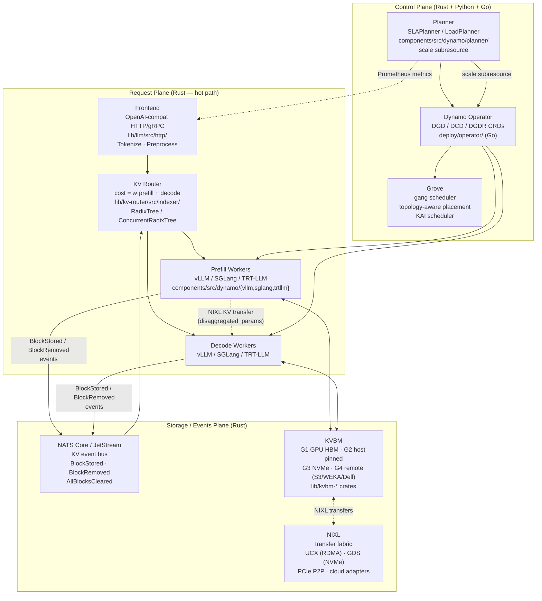
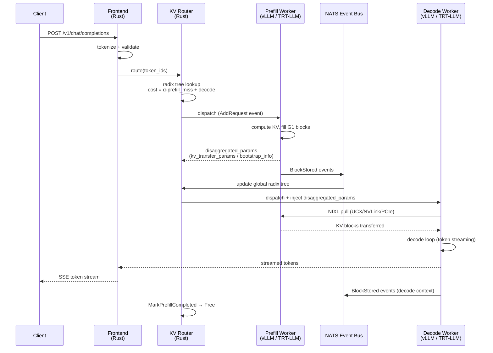

# NVIDIA Dynamo: The KV-Aware Inference Routing Plane

**After reading this chapter, the reader will be able to:**

- Describe Dynamo's three-plane architecture (request, control, storage) and why the Rust core is the right implementation language for the hot path
- Explain the KV router: how the global RadixTree indexes KV blocks across all workers and how the cost function ($w \cdot \text{prefill} + \text{decode}$) makes routing decisions
- Describe the KVBM (KV Block Manager) four-tier hierarchy (G1–G4) and what each tier represents
- Explain how NIXL is used as the transfer fabric and what GAIE (Gateway Inference Engine) does in the Kubernetes ingress path
- State how Dynamo integrates with vLLM and TRT-LLM workers

Traditional load balancers route inference requests by queue depth or CPU utilization — signals that are entirely blind to the most expensive part of an LLM request: the prefill computation. When a model has already computed the key-value tensors for a long system prompt, routing the next request with the same prompt to a *different* worker discards that work and forces a full recompute. NVIDIA Dynamo is the open-source control and routing plane that eliminates this waste at fleet scale. Rather than load-balancing requests across workers, Dynamo routes each request to the worker that already holds the KV prefix for that request, turning a cold prefill into a warm cache hit. The primary novelty is a **global radix tree** that tracks which KV blocks are resident on which workers, updated in real time as workers complete prefills and evict cache entries. This is the system-level analog of RadixAttention within a single SGLang or vLLM process — the same prefix-tree insight lifted from per-engine scope to fleet scope. The cost function that drives routing decisions is $\text{cost}(w) = \alpha \cdot N_{\text{prefill-miss}}(w) + N_{\text{decode}}$, where $\alpha$ encodes the relative expense of computing a prefill token versus a decode step; high $\alpha$ drives the router toward cache-hit maximization, low $\alpha$ toward load balance.

Dynamo sits between the HTTP ingress and a pool of inference workers running vLLM, SGLang, or TensorRT-LLM. It is also NVIDIA's integration point for NIXL (NVIDIA Inference Xfer Library), the high-performance transport library that moves KV blocks between workers during disaggregated prefill/decode and between memory tiers during offload. Disaggregated prefill/decode (splitting the prompt processing and token generation onto separate GPU pods) is a first-class deployment mode: Dynamo's `PrefillRouter` selects a prefill worker, waits for KV computation, then dispatches to a separate decode worker along with the NIXL transfer metadata. The KV Block Manager (KVBM) provides a four-tier storage hierarchy — GPU HBM, host DRAM, local NVMe, and remote object storage — with NIXL as the transfer fabric across all four tiers. The system reached 1.0 GA in March 2026 and is the routing foundation for NVIDIA NIM deployments. The source lives at `ai-dynamo/dynamo`; the version surveyed here is v1.1.0-rc11 (commit `9c54b4d3`). The repo is a polyglot monorepo: Rust for the hot path, Python for engine-adapter glue, and Go for the Kubernetes operator.

---

## Part 1: System architecture — three planes

Dynamo divides its responsibilities into three named planes. The separation is not merely conceptual: each plane has different latency requirements, different consistency needs, and different failure modes. The implementation language choices follow directly from those requirements.



### 1.0 Repository layout

The `ai-dynamo/dynamo` monorepo organizes its code by language and function. Understanding this layout is necessary for reading the source references throughout the chapter:

| Path | Language | Role |
|------|----------|------|
| `lib/runtime/` | Rust | Async runtime, transport layer, service discovery (`lib/runtime/src/discovery/`, `lib/runtime/src/transports/`) |
| `lib/llm/` | Rust | LLM-specific core: HTTP/gRPC frontend, KV router (`lib/llm/src/kv_router/`), block manager (`lib/llm/src/block_manager/`), preprocessor, model card, LoRA, migration |
| `lib/kv-router/` | Rust | Standalone router crate: indexer, scheduler, sequence tracking, ZMQ wire format; consumed by frontend and standalone router binary |
| `lib/kvbm-physical/`, `lib/kvbm-logical/`, `lib/kvbm-engine/`, `lib/kvbm-config/`, `lib/kvbm-common/`, `lib/kvbm-kernels/` | Rust | KVBM split into layout-agnostic (logical), backend-tied (physical), kernel-level, and engine-binding crates |
| `lib/memory/` | Rust | Storage backends (host pinned, device, NIXL, file, S3) and NIXL agent wrapper (`lib/memory/src/nixl/agent.rs`) |
| `components/src/dynamo/` | Python | Entrypoint modules: `frontend`, `router`, `global_router`, `planner`, `global_planner`, `profiler`; engine adapters `vllm`, `sglang`, `trtllm` |
| `deploy/operator/` | Go | Kubernetes operator (controller-runtime); API in `deploy/operator/api/v1beta1/` and `v1alpha1/` |
| `deploy/inference-gateway/epp/` | Go | GAIE EPP plugin calling into Rust router via CGO/`libdynamo_llm_capi.a`; plugins `dynamo_kv_scorer`, `disagg/{prefill,decode}_scorer`, `disagg/profile_handler`, `label_filter` |
| `lib/bindings/python/` | Rust/Python | Maturin-built PyO3 bindings exposing Rust runtime, router, and KVBM to Python adapters |
| `recipes/` | Helm/Kustomize | Per-model recipes for DeepSeek-V4-Pro/Flash, Llama-3-70B, Qwen3-32B-FP8, Kimi K2 |

The split between `lib/kv-router/` (the standalone router crate) and `lib/llm/src/kv_router/` (the in-LLM-process router) is a common source of confusion. The former is a library crate that implements the indexer, scheduler, and wire format; the latter is the request-handling integration layer that uses the library crate and adds the prefill/decode orchestration logic.

### 1.1 Request plane (Rust)

The request plane is the hot path: every request and every generation step flows through it. It is implemented entirely in Rust to avoid garbage-collection pauses and to achieve the memory-layout precision needed for zero-copy routing decisions at sub-millisecond latency.

The **Frontend** (`lib/llm/src/http/`, `components/src/dynamo/frontend/`) handles OpenAI-compatible HTTP/1.1 and gRPC ingress. It applies chat templates, tokenizes the prompt using the model's tokenizer, validates the request schema, and hands the resulting token-ID array to the router. Engine-specific preprocessing is isolated in per-backend modules — `components/src/dynamo/frontend/vllm_processor.py`, `frontend/sglang_prepost.py`, and `frontend/sglang_processor.py` — so the Rust router sees a uniform token-ID sequence regardless of the backend. The frontend also exposes `/openapi.json` and `/metrics` endpoints and is the source of TTFT and ITL observations consumed by the Planner.

The **KV Router** (`lib/kv-router/`, `lib/llm/src/kv_router/`) sits immediately downstream of the frontend. It receives the token-ID array, queries the global radix index, computes a per-worker routing cost, and dispatches the request to the winning worker via the Dynamo runtime transport. Transport is TCP by default; NATS or HTTP are available via the `DYN_REQUEST_PLANE` environment variable. The dispatch decision happens once per request, not per token.

For disaggregated prefill/decode, a `PrefillRouter` (`lib/llm/src/kv_router/prefill_router/`) handles the two-step dispatch: it first selects a prefill worker (maximizing KV cache hit), waits for the prefill to complete and return `disaggregated_params`, then selects a decode worker (typically ignoring KV overlap) and injects the transfer metadata into the decode request. This separation is critical: the right objective for prefill selection (minimize cache miss) differs from the right objective for decode selection (minimize current load).

A **standalone router** binary (`components/src/dynamo/router/__main__.py`) wraps the same Rust code for deployments where the router runs as an independent process in front of a heterogeneous prefill pool, rather than being embedded in the frontend process.

### 1.2 Control plane (Rust + Python + Go)

The control plane manages worker lifecycle and capacity. It operates between requests rather than on the token path, so its latency budget is orders of magnitude looser than the request plane.

The **Planner** (`components/src/dynamo/planner/`) is the SLA-driven autoscaler. It runs in two modes:

- *Throughput-based (`SLAPlanner`)*: every `adjustment_interval` seconds it pulls Prometheus metrics from the Frontend, computes correction factors `prefill_correction = actual_ttft / expected_ttft` and `decode_correction = actual_itl / expected_itl`, then runs a load predictor — Constant, ARIMA, Kalman, or Prophet, all implemented in `planner/core/load_scaling.py` — to project future load. Prefill replica counts are derived as $\lceil \text{load} \cdot \min(1, \text{prefill\_correction}) / \text{interp\_throughput} / \text{gpus\_per\_engine} \rceil$. Decode replicas come from a performance interpolator (`planner/core/perf_model/`) that finds the highest-throughput configuration achieving the corrected ITL at the predicted context length.
- *Load-based (`LoadPlanner`)*: uses `ForwardPassMetrics` emitted directly by the engine event plane and online linear regression. Currently vLLM-only because `ForwardPassMetrics` is a vLLM-specific construct.

The Planner does not call Kubernetes directly. It writes to the `DynamoGraphDeploymentScalingAdapter` resource, which exposes a standard Kubernetes `scale` subresource. This indirection allows the Planner, Kubernetes HPA, and KEDA to co-exist as scaling drivers on the same target without coordination — each sees a vanilla `scale` endpoint. A **global_planner** (`components/src/dynamo/global_planner/`) extends this to multi-cluster scenarios, and a **global_router** (`components/src/dynamo/global_router/`) selects across model pools using a TTFT×ITL objective.

The **Dynamo Operator** (`deploy/operator/`) is a Go controller-runtime program that reconciles the DGD, DCD, and DGDR custom resources (see Part 6). It is the only Go component in the hot-path stack; all other Rust components communicate with the operator through Kubernetes resource updates rather than direct API calls.

**Grove** (a separate NVIDIA repository, integrated via the operator) is a topology-aware gang scheduler for NVLink-dense GPU racks. It provides `packDomain` and `clusterTopologyName` placement constraints that the Kubernetes scheduler uses to co-locate pods on the same NVL72 rack, ensuring that prefill-to-decode NIXL transfers use NVLink bandwidth rather than InfiniBand.

### 1.3 Storage / events plane (Rust)

The storage plane manages the distributed KV tier hierarchy and the event bus that keeps the router's index synchronized with actual worker state.

**NATS** (Core by default, JetStream for durable HA) is the KV event bus. Workers emit `BlockStored`, `BlockRemoved`, and `AllBlocksCleared` events encoded with the codec in `lib/kv-router/src/zmq_wire/`. The router subscribes to these events and updates the global radix index accordingly. NATS JetStream is required only for the durable multi-replica variant where KV events must survive an EPP restart; the default NATS Core mode works without persistent storage. ZMQ is an alternative transport for environments without NATS.

The **KVBM** (KV Block Manager, `lib/llm/src/block_manager/` plus the `lib/kvbm-*` crates) manages the four-tier KV hierarchy; it is described in detail in Part 3. The KVBM is the storage plane's primary runtime component; NIXL is its transfer fabric.

---

## Part 2: KV router — global radix tree

The KV router is Dynamo's primary contribution. The insight is that the radix-tree prefix caching described in [§10/07](../10-engine-core/07-prompt-prefix-caching.md) — per-engine in vLLM and SGLang — can be lifted to fleet scope: instead of one radix tree per engine tracking that engine's local cache, Dynamo maintains one global radix tree tracking every KV block on every worker. A routing decision becomes a prefix-matching problem over this global index. A worker with a full prefix match pays zero prefill cost; a cold worker pays the full prefill cost of the prompt.

### 2.1 Index structure

The global index lives in `lib/kv-router/src/indexer/`. Two implementations coexist:

- **`RadixTree`** — single-threaded, appropriate when the router runs as a single-threaded process or during testing.
- **`ConcurrentRadixTree`** — multi-threaded with per-worker sticky thread shards, enabled with `--router-event-threads N`. Workers are consistently assigned to the same shard, so all events for a given worker are always processed by the same thread. This eliminates contention on the index for the common case where events are worker-local, with only cross-worker queries needing the full tree.

Each node in the tree represents one KV block and stores:
- The block's content hash (`sequence_hash`), derived from the token IDs of the corresponding prefix span
- The set of workers holding this block
- The tier (G1–G4) on each worker
- A timestamp used for LRU pruning of stale index entries

The tree is keyed by content: tokens are hashed into block IDs, and traversal follows block hashes rather than raw token values. Two requests with identical prefix tokens produce identical traversal paths and resolve to the same set of candidate workers, regardless of session identity. This property is what makes global prefix caching work at fleet scale: system prompts, few-shot examples, and document contexts shared across many users all resolve to the same tree nodes and route to the same workers.

### 2.2 Cost function and routing decision

On request arrival, `KVRouter::route(token_ids)` traverses the global tree to find the longest matching prefix across all workers. For each candidate worker, the router computes:

$$\text{cost}(w) = \alpha \cdot N_{\text{prefill-miss}}(w) + N_{\text{decode}}$$

where $\alpha$ (controlled by `--kv-overlap-score-weight`, typically 10–100 depending on model size and hardware) is the relative cost of computing one prefill token versus one decode step, $N_{\text{prefill-miss}}(w)$ is the number of prompt tokens *not* covered by worker $w$'s cached prefix, and $N_{\text{decode}}$ is the expected number of decode tokens (estimated from the request's `max_tokens` field). The worker with the lowest cost wins.

The cost function encodes the fundamental tradeoff clearly. A worker holding the full prompt prefix contributes $N_{\text{prefill-miss}} = 0$, so its total cost is just $N_{\text{decode}}$, which is equal across all workers with a full hit. A cold worker with no prefix overlap contributes $\alpha \cdot N_{\text{prompt}} + N_{\text{decode}}$. For a 4096-token system prompt with $\alpha = 50$, a cold worker carries a 204800-unit penalty versus a worker with a full hit — the router will not choose the cold worker unless it is the only option. For short prompts or low $\alpha$, the cache-miss penalty is smaller and load balance dominates.

The temperature parameter `--router-temperature τ` replaces argmin-over-cost with softmax sampling, converting costs to probabilities $p(w) \propto e^{-\text{cost}(w)/\tau}$. At $\tau \to 0$ the selection is deterministic (pure cost minimization); at large $\tau$ the selection approaches uniform random (pure load smoothing). This is useful when multiple workers have nearly equal cached prefixes and strict argmin would create a hot spot on the best-hit worker.

The cost function applies separately to prefill and decode stages in disaggregated deployments. Prefill worker selection uses high $\alpha$ to maximize cache hit rate. Decode worker selection typically sets `--kv-overlap-score-weight 0`, collapsing the cost to pure $N_{\text{decode}}$ and routing decode by load balance only — because a decode worker's KV cache state is overwritten by the incoming KV transfer anyway.

Active-block accounting is local to each router shard (tracking in-flight prefills that have not yet emitted `BlockStored`); cached-block accounting is global (the shared radix tree). This split avoids a central lock for the common case while preserving global consistency for the routing decision.

### 2.3 Tree update path

After a prefill worker finishes computing a batch of KV blocks, it emits `BlockStored` events over NATS. The router's event handler (`lib/kv-router/src/indexer/`) inserts the new block hashes into the global tree tagged with the worker ID, tier G1, and the current timestamp.

When a worker evicts a block from GPU HBM, it emits `BlockRemoved`. The router either removes the node entirely (if no other tier holds the block) or updates the tier tag (if the block was offloaded to G2 or G3 and is still accessible). `AllBlocksCleared` is emitted on worker restart and causes the router to prune all entries for that worker atomically.

The request lifecycle in `lib/llm/src/kv_router/scheduler.rs` exposes three events for multi-router consistency:

- `AddRequest`: emitted when a request is dispatched to a prefill worker; reserves the worker's slot in active-block accounting *before* the prefill begins. This prevents two requests from racing to the same "winning" worker under the assumption that neither has started yet.
- `MarkPrefillCompleted`: emitted when the prefill finishes and KV blocks are committed to G1.
- `Free`: emitted when the request is fully complete and the worker's slot is released.

The agentic inference path adds agent-hint routing (`lib/llm/src/kv_router/agent_controller.rs`, `sticky_sessions.rs`, `shared_cache.rs`): per-request hints including priority, expected output length, and cache TTL allow the router to implement session stickiness and cache-lifetime-aware dispatch for multi-turn agent conversations.

For comparison with per-engine approaches, see [§80/01](./01-vllm.md) for vLLM's per-engine radix/hash-table prefix caching and SGLang's RadixAttention. The per-engine approach optimizes KV reuse within one worker process; Dynamo's global tree optimizes across the entire fleet.

### 2.4 Disaggregated serving flow

When disaggregated prefill/decode is enabled, the `PrefillRouter` (`lib/llm/src/kv_router/prefill_router/`) orchestrates a two-phase dispatch that is worth tracing end-to-end:



Steps 1–4 happen on the critical TTFT path; steps 5–8 (NIXL transfer) occur between the prefill completion and the first decode step. The NIXL pull latency is the primary disaggregation overhead: for vLLM (synchronous), the decode worker waits for the NIXL pull to complete before running token 1; for SGLang (asynchronous), the prefill begins before the decode worker initiates the pull, and the decode worker may begin waiting at token 1 while the pull finishes. This async overlap is the source of SGLang's disaggregated TTFT advantage for long prompts.

The xPyD ratio — X prefill workers, Y decode workers — is runtime-reconfigurable. Workers register and deregister via the discovery service (`lib/runtime/src/discovery/`), and the router picks them up automatically without a redeployment. This is the mechanism the Planner uses when adjusting P/D replica counts: it writes to the ScalingAdapter scale subresource, the operator creates or destroys pods, and the new workers self-register with the router.

---

## Part 3: KVBM — KV Block Manager and tier hierarchy

The KVBM (`lib/llm/src/block_manager/` plus the `lib/kvbm-physical/`, `lib/kvbm-logical/`, `lib/kvbm-engine/`, `lib/kvbm-config/`, `lib/kvbm-common/`, and `lib/kvbm-kernels/` crates) is a multi-tier KV block manager that acts as a write-through cache between the inference engine and the memory hierarchy. It is fully implemented in Rust and is the integration point between the router's index and the physical memory tiers. The KVBM is write-through: when the engine produces a new KV block in G1 (GPU HBM), the KVBM can immediately begin offloading a copy to G2 or G3 without waiting for eviction pressure.

### 3.1 Tier definitions and bandwidth reference

The KVBM organizes KV blocks into four tiers, each with a distinct hardware backing. The bandwidth figures below are approximate for typical 2025–2026 server hardware and set the baseline for understanding promotion and eviction costs:

| Tier | Backing | Typical bandwidth | Typical capacity per node | Path to G1 |
|------|---------|-------------------|--------------------------|------------|
| G1 | GPU HBM (H100/H200) | 3.35 TB/s (HBM3e) | 80–141 GB | — (already in G1) |
| G2 | Host pinned DRAM (DDR5) | 450 GB/s (NVLink) / 64 GB/s (PCIe Gen5) | 1–2 TB | DMA: NVLink or PCIe |
| G3 | Local NVMe SSD | 7–12 GB/s | 1–8 TB | GDS (bypass CPU) or POSIX + DMA |
| G4 | Remote object / RDMA store | 1–100 GB/s (network-dependent) | Unbounded | Network → G3 → G2 → G1 |

These numbers matter for the routing decision: a G3 hit for a 4096-token prefix with 70B FP16 weights (approximately 160 MB of KV data at 80 layers) takes approximately 13–23 ms for the NVMe read alone, before the G2→G1 DMA. A G4 hit over a 10 Gb/s link takes approximately 130 ms. The Planner's performance interpolator (`planner/core/perf_model/`) uses per-tier latency estimates when computing the expected TTFT under different cache-hit distributions, so the routing decision's value is grounded in measured hardware characteristics, not just token counts.

The KVBM organizes KV blocks into four tiers, each with a distinct hardware backing:

**G1 — GPU HBM** (`block_manager/storage/device.rs`, `pool/device.rs`): blocks resident on the worker's GPU HBM. Access latency is sub-microsecond and bandwidth exceeds 3 TB/s on H100/H200. G1 is the only tier from which a decode step can execute directly; a block must be in G1 before the attention kernel can use it. G1 capacity is determined by the GPU's HBM size minus model weights and activations; for a 70B model on 8×H100, this leaves roughly 20–40 GB for KV cache.

**G2 — Host pinned memory** (`block_manager/storage/pinned.rs`): blocks in CPU DRAM allocated with pinned (page-locked) memory to enable fast DMA without OS page-fault overhead. The transfer path from G2 to G1 is DMA over PCIe (approximately 64 GB/s for PCIe Gen5 x16) or NVLink (approximately 900 GB/s aggregate bandwidth on an NVL72 rack, though the relevant per-link figure is 450 GB/s bidirectional). G2 provides the first overflow tier for blocks evicted from G1 but expected to be reused within the next few requests. Host DRAM capacity is typically 1–2 TB per node, providing 10–50× the capacity of G1 HBM.

**G3 — Local NVMe SSD** (`block_manager/storage/`, NIXL POSIX or CUDA GDS path): blocks on the worker's local NVMe drive. NIXL POSIX uses standard `pread`/`pwrite` through the page cache; CUDA GDS (GPU Direct Storage) uses a DMA path that bypasses the CPU entirely, moving data from NVMe controller to GPU HBM with no bounce buffer and no CPU cycles for the copy. Sequential NVMe bandwidth is approximately 7–12 GB/s per drive. G3 is the second overflow tier, appropriate for blocks infrequently reused but needed faster than a full recompute would provide. NVMe capacity is typically 1–8 TB per node.

**G4 — Remote object or network storage**: blocks in an opaque remote store — S3, Azure Blob, NFS, Lustre, GPFS, Dell PowerScale, or WEKA. S3 and Azure support landed under `block_manager/storage/object.rs`; Dell PowerScale and WEKA NIXL integrations were announced in late 2025. G4 is the cold archive tier: access latency is dominated by network round-trip time and bandwidth is network-limited, but G4 has effectively unbounded capacity and is appropriate for very long conversations, multi-day agentic workflows, or document corpora that are shared across the entire fleet.

### 3.2 Block identity and deduplication

Each block is identified by a `sequence_hash` derived from the token content of the corresponding prefix span. Blocks with the same `sequence_hash` are *fungible* across tiers: a G1 block, a G2 block, and a G4 block carrying the same hash represent the same KV data and are treated as aliases in both the KVBM and the router's global index. The offload manager can migrate blocks between tiers without changing their identity or invalidating router index entries — only the tier tag changes. This property makes it safe to have a block simultaneously resident in G1 (serving live decode steps) and G3 (as a warm fallback if G1 eviction occurs under memory pressure).

`BlockLayout` (`block_manager/layout/`) abstracts over two physical organizations: `FullyContiguous` (the default — a single contiguous slab of shape `[num_layers][page_size · inner_dim]` with `align_up` stride math) and `LayerSeparated` (one allocation per layer). The same layout type is used on GPU (G1) and CPU (G2), with storage backends swapping in behind the abstraction. This uniformity is what allows block-hash deduplication to work across tiers without format conversion.

The block lifecycle is enforced by a state machine in `block_manager/block/state.rs`:

```
Reset → Partial → Complete → Registered
```

`Registered` blocks are reference-counted and shared across all requests that reference the same prefix. A `Registered` block transitions back to `Reset` when its reference count drops to zero; this drop emits a `BlockRemoved` event to the NATS bus, which propagates to the router's global index.

### 3.3 Promotion and eviction

**G2 hit**: The `TransferManager` (`block_manager/offload.rs`) initiates an asynchronous DMA from the host-pinned G2 buffer to G1. If the forward pass can proceed from G2 until the G1 copy arrives, the transfer is pipelined; otherwise the engine waits on a synchronization fence. In practice, for batch sizes greater than one, the G2→G1 transfer for one sequence can overlap with G1-resident computation on other sequences.

**G3 hit**: The `OffloadManager` queues a Disk→H transfer (NVMe → G2 via GDS or POSIX read), then queues the resulting G2→G1 transfer. The two-step promotion means the block may not be in G1 before the first decode step executes; the engine stalls on initial access and then proceeds at full speed once G1 is populated. For workloads with predictable context reuse, a prefetch hint in the `agent_hint` path can trigger G3→G1 promotion ahead of the request.

**G4 hit**: The remote block is fetched into G3 first via the appropriate NIXL transport (UCX for RDMA-backed stores, POSIX/S3 for cloud storage), then the G3→G2→G1 chain proceeds as above. G4 access latency is dominated by network bandwidth; a single 4096-token KV page for a 70B FP8 model with 80 layers is approximately 50 MB, costing approximately 50 ms over a 1 GB/s link and approximately 5 ms over a 10 GB/s link.

**Eviction** proceeds tier-by-tier under LRU policy. The `OffloadManager` maintains per-path queues for D→H, H→D, H→Disk, and Disk→D transfers with backpressure against the engine's `Scheduler` hook, ensuring that KV traffic never preempts an in-progress forward pass. A block may simultaneously occupy G1 and G3 — the G1 copy serves live decode steps while the G3 copy provides a warm fallback if G1 is reclaimed. G4 is the terminal eviction point; a G4-evicted block must be fully recomputed from tokens if it is needed again.

The KVBM integrates with the router's global index through the connector layer (`block_manager/connector/`), which maps engine-specific KV events into KVBM block operations. The vLLM V1 connector has a first-class path; TRT-LLM has its own connector module under `components/src/dynamo/trtllm/`.

---

## Part 4: NIXL — the transfer fabric

NIXL (NVIDIA Inference Xfer Library, internally "NVIDIA Interchange Library") is the low-level transport library Dynamo uses for all KV block movement: prefill-to-decode transfers in disaggregated serving, tier-to-tier offload within the KVBM, and remote G4 fetches. It is consumed as the `nixl-sys = "=0.10.1"` Rust crate (pinned in `lib/llm/Cargo.toml` behind the `block-manager` feature) and as the `nixl-cu12` Python wheel on the engine side.

The central Rust abstraction is `NixlAgent` (`lib/memory/src/nixl/agent.rs`), which wraps `nixl_sys::Agent`. The agent owns memory registration handles and an `XferRequest` pool. The API workflow is: register buffers (GPU or host memory) with the agent, establish connections to remote agents on other workers, then call `transfer()` to initiate an asynchronous DMA. NIXL returns immediately; completion is signaled through callbacks registered in `lib/kvbm-physical/src/transfer/notifications/nixl_status.rs` and `nixl_events.rs`.

Transport backends are selected at configuration time (`lib/memory/src/nixl/config.rs`):

- **UCX**: RDMA over InfiniBand or RoCE; used for GPU-to-GPU P→D transfers and G4 RDMA-backed stores
- **GDS (GPU Direct Storage)**: DMA from NVMe directly to GPU HBM without CPU bounce buffer; used for G3→G1 promotion
- **POSIX**: conventional file I/O through the page cache; used for G3 when GDS is unavailable
- **Cloud adapters**: S3 and Azure Blob backends for G4 object storage (`block_manager/storage/object.rs`)

The transfer executor in `lib/kvbm-physical/src/transfer/executor/nixl.rs` batches multiple block transfers into `XferList` objects to amortize per-transfer setup overhead. This is important for the G3→G1 promotion path where dozens of pages may need to be moved before a long decode sequence can begin.

NIXL is the same library used by vLLM's `NixlConnector` (upstream vLLM) and LMCache's `NixlStorage` backend. A vLLM worker already speaking the NIXL protocol can participate in Dynamo's disaggregated P→D flow with no additional transfer-layer changes. Transfer metadata is engine-specific — Dynamo's `PrefillRouter` relays `disaggregated_params` from the prefill response to the decode request without interpreting the contents:

- **vLLM**: `kv_transfer_params` carrying block IDs and remote worker connection info; prefill is synchronous
- **SGLang**: `bootstrap_info` (host, port, room ID) for RDMA bootstrap; prefill runs as a background task and the decode side coordinates with the prefill in flight
- **TRT-LLM**: opaque serialized state; prefill is synchronous

Recent work (April–May 2026) extended NIXL beyond same-cluster GPU-to-GPU transfers into storage tiers — Dell PowerScale and WEKA integrations were announced in late 2025, and S3/Azure blob support landed under `block_manager/storage/object.rs`. This makes NIXL the unifying transport layer across all four KVBM tiers, not just the P→D hot path. The Dell PowerScale integration was reported to achieve a 19× TTFT reduction for very-long-context requests by prefetching G4 blocks over WEKA's high-bandwidth distributed storage rather than recomputing them.

The NIXL interoperability story is notable: because vLLM's `NixlConnector`, LMCache's `NixlStorage`, and Dynamo's `NixlAgent` all use the same underlying `nixl-sys` crate, a heterogeneous fleet can mix NIXL-capable workers from different frameworks. A vLLM worker and a TRT-LLM worker can both register memory buffers with their respective NIXL agents and transfer blocks between them as long as they can establish a UCX connection — which is what enables Dynamo to treat vLLM and TRT-LLM as interchangeable prefill sources for the same decode pool.

For an alternative transfer architecture that avoids NIXL and instead designs the entire serving stack around KV transfer as a first-class primitive, see [§80/08](./08-mooncake.md).

---

## Part 5: GAIE — Gateway Inference Engine

Dynamo's Kubernetes ingress is handled by a plugin for the **GAIE** (Gateway API Inference Extension), the CNCF standard for inference-aware HTTP routing at the Kubernetes layer. The plugin lives in `deploy/inference-gateway/epp/` and implements the **EndpointPicker Protocol** (EPP): the standard contract by which a Kubernetes Gateway delegates endpoint selection to an external sidecar process over `ext-proc`.

### 5.1 Plugin architecture

The Dynamo EPP plugin registers three components with the upstream `gateway-api-inference-extension` framework: `dyn-prefill-scorer`, `dyn-decode-scorer`, and a label filter (`label_filter`). The prefill and decode scorers are disaggregation-aware: they know that a request may need to be split across two worker pools and score each pool independently. The label filter narrows the candidate set to pods carrying the appropriate role label before scoring begins.

The key differentiator from a generic EPP implementation is that the Dynamo plugin performs a full tokenization and KV prefix lookup for each request rather than routing on the raw un-tokenized prompt. This is possible because the plugin loads the Rust router as a static library — `libdynamo_llm_capi.a` — and calls into it via **CGO**, Go's C foreign function interface. The Go request handler calls the C API, which invokes the Rust `route()` function, which consults the in-process global radix tree, and returns a worker selection with an associated cost. The gateway receives a token-aware KV-scored endpoint rather than the hash-based or round-robin selection a generic EPP would provide.

The plugin also exposes a `disagg/profile_handler` that orchestrates the two-phase dispatch for disaggregated prefill/decode: on a disaggregated request it calls the prefill scorer to select a P worker, then calls the decode scorer to select a D worker, and sets the `x-prefiller-host-port` header that downstream workers use to initiate the NIXL transfer.

### 5.2 The CGO bridge

The CGO bridge is a design constraint arising from the mismatch between Dynamo's implementation language and the Kubernetes ecosystem's language. Kubernetes infrastructure — controller-runtime, client-go, the GIE framework — is overwhelmingly Go-native. The Dynamo routing core is Rust for performance reasons: the radix tree traversal, cost computation, and XferRequest pool are all on the sub-millisecond critical path where GC pauses are unacceptable. CGO is the only practical way to wire a Rust routing library into a Go Kubernetes extension without forking or reimplementing the router in Go.

The overhead of one CGO call per request is approximately 100–200 ns, negligible compared to the tens-of-milliseconds network round-trip that dominates request latency. The static library approach (`libdynamo_llm_capi.a`) avoids the dynamic linking complexity of a shared library in a containerized environment; the GAIE pod carries the compiled Rust library embedded in its Go binary.

### 5.3 Deployment topology

The EPP plugin runs as a separate `GatewayPlugin` Deployment in Kubernetes. The standard Kubernetes Gateway API topology applies: a shared `Gateway` resource routes HTTP traffic to an `InferencePool` via an `HTTPRoute`; the `InferencePool` declares the Dynamo EPP as its endpoint-picker backend via the `extensionRef` field. The ext-proc stream runs in `FULL_DUPLEX_STREAMED` mode, allowing the EPP to observe both the request body (for tokenization) and the streamed response (for future per-response routing adjustments).

Service discovery within the EPP uses the `DynamoWorkerMetadata` CRD written by the operator plus `EndpointSlices` populated by the Kubernetes endpoint controller. Etcd is not required for single-cluster deployments; the operator's use of Kubernetes-native resources (`EndpointSlices`, CRDs) means the full discovery stack runs on standard Kubernetes infrastructure.

The GAIE plugin was generalized in April 2026 to support data-parallel deployments, where multiple pods may hold identical KV content because they share a common prefix shard (common in expert-parallel MoE deployments where routing is deterministic). In this mode the decode scorer returns a set of equivalent workers and the label filter selects among them by current load rather than KV overlap — the system falls back to load balance within the equivalent set.

For llm-d's EPP approach — the *reference implementation* of the GIE standard, written in pure Go with a plugin-composable Filter/Score/Pick chain and no CGO dependency — see [§80/06](./06-llm-d.md). The structural contrast is instructive: llm-d's EPP is extensible (new scorers and filters are Go structs implementing defined interfaces) and has no native-library dependency, but its routing decisions are bounded by what the Go scorer chain can express; Dynamo's CGO bridge gives the GAIE plugin access to the full Rust router, including the `ConcurrentRadixTree` and `XferList` machinery, at the cost of a harder build and deployment process.

---

## Part 6: Kubernetes operator and CRDs

The Dynamo Kubernetes operator (`deploy/operator/`, Go, controller-runtime) manages inference graph lifecycle through four custom resources defined in `deploy/operator/api/v1beta1/` and `v1alpha1/`.

**`DynamoGraphDeployment` (DGD)** is the top-level resource. It describes a complete prefill/decode graph: the set of component types (frontend, router, prefill workers, decode workers, planner), per-component replica counts, model reference, NIXL transfer endpoint advertisement, and optionally an EPP plugin to attach. Each component is specified as a `DynamoComponentDeploymentSharedSpec`. At most one `epp` component is allowed per DGD. The DGD is the unit of deployment for a complete serving configuration; changing the DGD triggers a reconcile loop that brings all child resources into the desired state.

**`DynamoComponentDeployment` (DCD)** is the single-component reconciler. It owns the Kubernetes Deployment, Service, ServiceAccount, and any PodDisruptionBudget for one worker type. DCD is the target of `kubectl scale` or HPA scaling actions on individual components; the Planner writes to the DCD's `scale` subresource (via the ScalingAdapter) when adjusting replica counts.

**`DynamoGraphDeploymentRequest` (DGDR)** is the zero-configuration deploy path. The user specifies only model name, hardware type, and SLA targets; the controller drives a state machine through:

```
Pending → Profiling (SweepingPrefill → SweepingDecode → SelectingConfig
          → BuildingCurves → GeneratingDGD) → Ready → Deploying → Deployed
```

The `Profiling` phase uses an `AIConfigurator` to generate candidate P/D ratio configurations and the Dynamo profiler to measure actual TTFT and ITL on each configuration before selecting the optimal one. The DGDR approach is particularly useful for first-time deployments where the right xPyD ratio is not known in advance.

**`DynamoGraphDeploymentScalingAdapter`** exposes a Kubernetes `scale` subresource on the parent DGD. This indirection allows three scaling drivers — the Dynamo Planner, Kubernetes HPA, and KEDA — to co-exist on the same target. Each driver sees a standard `scale/{replicas}` endpoint and does not need to understand Dynamo internals.

**`DynamoWorkerMetadata`** is a lightweight per-worker CRD written by each worker on startup. It carries the worker's NIXL endpoint address, KV capacity, and current tier configuration. The router uses this metadata for initial population of the global radix tree before any KV events have been emitted.

### 6.1 Grove gang scheduler

Grove (a separate NVIDIA repository integrated via the operator) provides topology-aware gang scheduling for NVLink-dense GPU racks. The operator writes `ClusterTopology` placement constraints (`packDomain`, `clusterTopologyName`) that Grove uses in conjunction with the KAI scheduler to co-locate prefill and decode pods on the same NVL72 interconnect domain. The motivation is direct: a P→D KV transfer over NVLink within an NVL72 rack achieves hundreds of GB/s and completes in microseconds for typical KV page sizes; the same transfer over a 400 Gb/s InfiniBand backbone takes milliseconds. Grove ensures that the fast path is the common case by making co-location a Kubernetes scheduling constraint rather than a deployment convention.

Workers register their `RuntimeConfig` with KV capacity and tier configuration on startup, enabling online xPyD reconfiguration — changing the P/D worker ratio — without a full operator re-deploy. Workers register and deregister via the discovery service and are picked up by the router automatically.

---

## Part 7: Engine integrations

Each backend engine connects to Dynamo through a Python adapter that registers with the Dynamo runtime and exposes a `generate` endpoint typed as `model_input=Tokens`. This typing constraint is a hard requirement for KV routing: the router hashes token IDs before dispatch and therefore needs the token-ID array, not raw text or chat-template output. The adapter is responsible for converting the Dynamo `Tokens` input back into the engine's native request format.

**vLLM workers** (`components/src/dynamo/vllm/`) are the reference integration path. The vLLM adapter includes a custom scheduler instrumentation layer (`vllm/instrumented_scheduler.py`) that intercepts vLLM's internal scheduling decisions and emits `ForwardPassMetrics` to the Dynamo event plane. These metrics — per-step batch composition, active/waiting request counts, KV cache utilization — are what the load-based `LoadPlanner` consumes. The KVBM connector for vLLM V1 (`block_manager/connector/`) maps vLLM's internal block allocation events directly into KVBM block operations, giving Dynamo complete visibility into and control over the vLLM KV cache. Disaggregated P/D is synchronous for vLLM: the prefill worker completes the full forward pass, emits `kv_transfer_params` carrying block IDs and connection info, and only then does the router dispatch to a decode worker. The vLLM integration also supports multimodal inputs via the E/P/D (Encode/Prefill/Decode) pipeline with an embedding cache for vision tokens.

**TRT-LLM workers** (`components/src/dynamo/trtllm/`) follow the same registration pattern. The P/D handshake uses an opaque serialized state blob rather than explicit block IDs; TRT-LLM's KV cache transceiver uses NIXL as its transport backend, so the wire protocol is identical to vLLM at the NIXL layer. The SLA-based `SLAPlanner` mode is fully supported for TRT-LLM. KVBM integration is present and covers G1 and G2 tiers; G3 and G4 offload use the same `NixlStorage` path as vLLM.

**SGLang workers** (`components/src/dynamo/sglang/`) differ in one important way: the P/D handshake is *asynchronous*. The prefill worker starts the forward pass as a background task and immediately returns `bootstrap_info` (host, port, room ID) for an RDMA session. The decode worker initiates the RDMA connection and receives KV state in parallel with the ongoing prefill computation. This reduces the disaggregated TTFT for long prompts because the decode-side setup time overlaps with prefill compute time. The tradeoff is that the decode worker must tolerate an initial stall if the prefill is still in flight when the first decode step would otherwise begin. KVBM integration for SGLang is partial as of v1.1; the HiCache integration via NIXL is documented at `docs/backends/sglang/sglang-hicache.md`.

The engine support matrix:

| Engine | Disagg P/D | KV-aware routing | KVBM | Multimodal | Planner mode |
|--------|-----------|-----------------|------|-----------|--------------|
| vLLM | yes (sync) | yes | yes | yes | SLA + load-based |
| SGLang | yes (async) | yes | partial | yes | SLA only |
| TRT-LLM | yes (sync) | yes | yes | yes | SLA only |

A `model_input=Tokens` registration is required across all backends — workers that register with raw-text input cannot participate in KV routing because the router has no token IDs to hash.

---

## Part 8: Notable design choices

Several architectural decisions in Dynamo are worth examining as deliberate trade-offs rather than implementation accidents.

**Cost function as a single knob.** The $\alpha \cdot N_{\text{prefill-miss}} + N_{\text{decode}}$ cost function has one operator-visible parameter — $\alpha$ — that smoothly interpolates between "maximize cache hit rate" (high $\alpha$) and "minimize queue depth" (low $\alpha \to 0$, pure load balance). This is a useful property in production: the same cost function works for both aggregated serving (where there is no P/D split and cache hits directly reduce TTFT) and disaggregated serving (where prefill cost savings compound with the bandwidth cost of NIXL transfer). The same cost structure also appears in llm-d's prefix-cache scorer, but Dynamo expresses it as a closed-form per-worker decision rather than a composable scorer in a filter/score/pick chain. The closed-form approach is faster (one arithmetic expression per worker per request) but less extensible.

**Block deduplication across tiers by `sequence_hash`.** A device block, a host block, and a remote block carrying the same `sequence_hash` are fungible: the offload manager can migrate blocks between tiers without changing identity or invalidating the router's index. This enables the KVBM to act as a single logical cache spanning four physical tiers, with the router's global index always reflecting the current tier location. The alternative — separate identity systems per tier — would require the router to maintain separate index entries for G1 and G3 copies of the same block, complicating the cost function and eviction logic.

**Workers register `RuntimeConfig` with KV capacity.** On startup, each worker writes its KV capacity, tier configuration, and NIXL endpoint into the `DynamoWorkerMetadata` CRD. This allows the router to populate its initial index with accurate tier information before any KV events have been emitted, and allows the Planner to make scaling decisions that account for heterogeneous workers with different HBM capacities. It also enables online xPyD reconfiguration: changing the prefill/decode worker count does not require a new DGD deployment, only a ScalingAdapter update that triggers pod creation/deletion and re-registration.

**Rust for the hot path, Go for Kubernetes, Python for engine glue.** This language split is not arbitrary. Rust provides deterministic latency (no GC), memory safety (no use-after-free in the router's index), and the ability to call NIXL's C API from the same process without marshaling overhead. Python is the lingua franca of ML infrastructure; all three supported engines (vLLM, SGLang, TRT-LLM) expose Python interfaces, and the engine-adapter glue is a thin Python layer that imports PyO3 bindings to the Rust runtime. Go is the language of the Kubernetes ecosystem; all Kubernetes extension points (controller-runtime, client-go, GIE framework) are Go-native. The CGO bridge at the GAIE layer is the only point where the language boundaries create non-trivial complexity.

**NATS as the event bus (not ZMQ).** Dynamo's default KV event transport is NATS Core rather than the ZMQ pub/sub used by llm-d and AIBrix. The practical difference: NATS provides a broker that persists in-flight messages across transient subscriber restarts and supports the JetStream durable mode for active-active multi-EPP HA, while ZMQ is a direct peer-to-peer socket that requires the subscriber to be running when the publisher sends. For deployments where the router may restart independently of the workers (e.g., during a GAIE EPP upgrade), NATS JetStream ensures no `BlockStored` events are lost.

**ModelExpress integration.** Co-designed with KVBM but shipped in a sibling repository (`ai-dynamo/modelexpress`), ModelExpress streams GPU-to-GPU model weights over NIXL at cold-start time, achieving approximately 7× faster cold-start compared to loading from NFS/S3. The NIXL-as-fabric principle extends to model weights, not just KV cache: any large tensor that needs to move between nodes or tiers can use the same transport abstraction. This is a meaningful operational advantage for deployments that autoscale frequently; cold-start latency is often the bottleneck in scale-out scenarios.

**Agentic inference path.** The `agent_controller.rs`, `sticky_sessions.rs`, and `shared_cache.rs` modules in `lib/llm/src/kv_router/` implement a per-request hint system for agentic multi-turn conversations. A client can attach hints to a request:

- `priority`: a numeric priority that the flow-control layer uses for admission ordering when the router is under load
- `expected_output_length`: an estimate of the generation length, used to improve the decode term in the cost function when `max_tokens` is set to a conservative upper bound
- `cache_ttl`: a duration that tells the KVBM how long to retain this conversation's KV blocks before making them eligible for eviction

Session stickiness (`sticky_sessions.rs`) ensures that subsequent turns in the same conversation are routed to the same worker as long as that worker holds the prefix in G1 or G2. The `shared_cache.rs` module handles the case where multiple agent steps share a common prefix (e.g., a tool-call scaffold that is reused across steps) and ensures the shared blocks are reference-counted so they survive across individual step completions.

**Global router and multi-cluster deployment.** The `global_router` (`components/src/dynamo/global_router/`) selects across *model pools* — groups of workers running the same model on different hardware or in different Kubernetes clusters — using a TTFT×ITL objective. It acts as a meta-router that queries each pool's local router for its estimated cost, then selects the pool that minimizes expected latency. This is relevant for deployments that span multiple data centers or availability zones: the global router can route to a remote cluster when the local cluster is saturated, absorbing the inter-cluster latency as a known cost rather than a failure mode. The `global_planner` (`components/src/dynamo/global_planner/`) provides the autoscaling analog: it watches aggregate metrics across pools and issues scaling requests to each pool's Planner independently.

---

## Current production state

Dynamo reached 1.0 GA in March 2026 and is NVIDIA's flagship open-source inference routing project, deployed as the routing layer for NIM (NVIDIA Inference Microservices). The project reported benchmark results at SemiAnalysis InferenceMax and MLPerf on Blackwell Ultra and GB300 NVL72 hardware. These numbers reflect the full stack — Blackwell hardware, TRT-LLM or vLLM backend, NVLink-native NIXL transfers, and Dynamo routing — not routing alone; attributing the full improvement to the routing layer would be misleading. The specific contribution of KV-aware routing is measurable in isolation: on workloads with high prompt reuse (shared system prompts, document QA, multi-turn agents), cache-hit-rate improvements translate directly to lower TTFT by eliminating redundant prefill computation and to higher aggregate throughput by freeing prefill GPU capacity for new requests. The Planner's SLA-mode closed-loop autoscaler compounds this by right-sizing the P/D replica ratio for the observed workload distribution rather than requiring manual tuning.

The Rust core + CGO bridge + Go operator combination reflects production engineering priorities rather than language preference. The hot path — radix tree traversal, cost computation, NIXL transfer orchestration — requires deterministic sub-millisecond latency without garbage-collection pauses; Rust is the practical choice. Kubernetes integration requires Go because controller-runtime, client-go, and the GIE framework are Go-native with no practical alternatives. CGO is the seam between them, with approximately one 100–200 ns call per request. In the competitive landscape, Dynamo occupies the middle ground between two alternatives: llm-d ([§80/06](./06-llm-d.md)) is lighter — no custom runtime, no NIXL dependency in the routing layer, pure-Go EPP, CNCF reference implementation of the GIE standard — and is the right choice for operators who want to use industry-standard proxies with minimal new infrastructure. AIBrix ([§80/07](./07-aibrix.md)) is heavier — eight orchestration CRDs, a bespoke Python L1/L2 KV offload framework, a full Envoy ext-proc gateway plugin, and a web console — and is the right choice for operators running at hyperscale with heterogeneous GPU fleets and complex multi-tenant fairness requirements. Dynamo is the right choice when NIXL-native transfers, the KVBM tier hierarchy, and NVIDIA hardware integration are first-class requirements.
