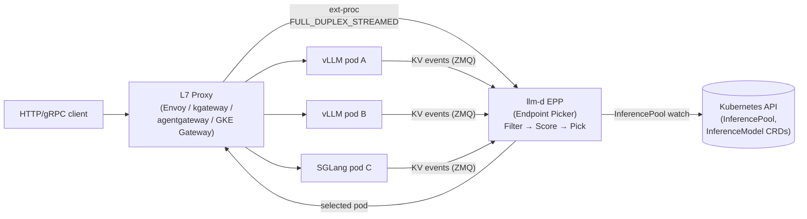
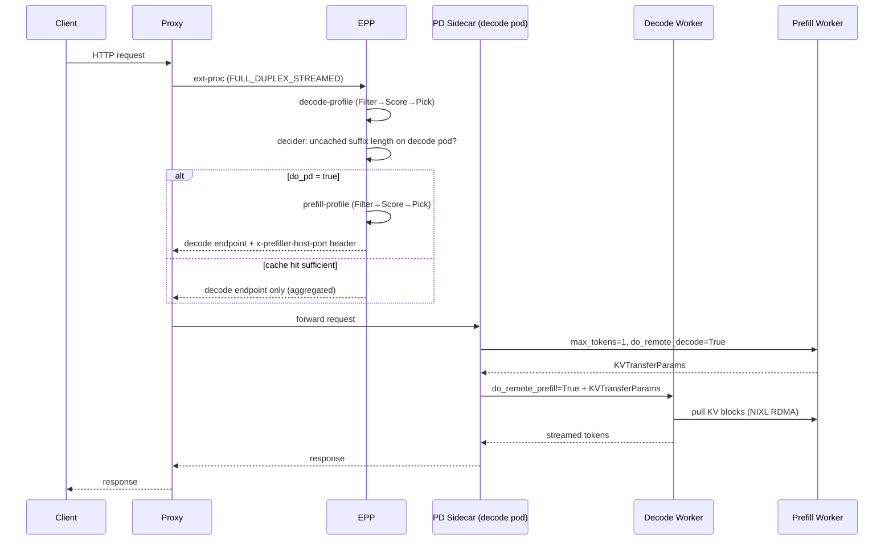

# llm-d: Kubernetes-Native LLM Inference Routing

**After reading this chapter, the reader will be able to:**

- Describe llm-d's architectural position: a Kubernetes-native routing layer that adds no new data plane, relying on existing engines (vLLM, SGLang) for execution
- Explain the EPP plugin chain: Filter → Score → Pick and the plugin inventory spanning 4 filter plugins, 10+ scorer plugins, and 3 picker plugins
- Describe the `precise-prefix-cache-scorer` and how it integrates with a KV block indexer to make prefix-aware routing decisions
- Explain the llm-d Gateway Inference Extension (GIE) relationship and its position as the reference implementation of `kubernetes-sigs/gateway-api-inference-extension`
- State llm-d's CNCF Sandbox status and how it fits in the broader CNCF inference ecosystem alongside Kueue and KServe

---

## Introduction

While NVIDIA Dynamo [§80/05](./05-nvidia-dynamo.md) provides a complete control, routing, and storage plane — its own Rust runtime, KV Block Manager, NIXL transport, Planner, and Kubernetes operator — llm-d takes a deliberately minimal approach. It is a pure routing layer: an Endpoint Picker (EPP) that integrates with the Kubernetes Inference Gateway (KIG) as an Extension Provider. There is no new inference engine, no new KV transfer protocol, no new GPU operator. The only thing llm-d introduces is a plugin chain that makes smarter routing decisions by being KV-cache-aware, combined with the operational machinery to run that chain as a reliable Kubernetes workload.

The project was founded by Red Hat, Google Cloud, IBM Research, CoreWeave, and NVIDIA, and joined the CNCF Sandbox in March 2026 — a signal that the Kubernetes community now treats KV-aware inference routing as a first-class infrastructure concern, on par with the service mesh and the network gateway. AMD, Cisco, HuggingFace, Intel, Lambda, Mistral, UC Berkeley, and University of Chicago are listed as supporters in the CNCF proposal. llm-d's positioning as the *reference implementation* of the upstream `kubernetes-sigs/gateway-api-inference-extension` (GIE) project means its plugin model is not just one team's design choice but is becoming the specification that gateway vendors (Envoy, Istio, kgateway, agentgateway) will implement against. The CNCF sandbox status also makes llm-d a natural coordination point for the broader Kubernetes inference ecosystem: projects like Kueue (queue management), KServe (model serving CRDs), and KIG (gateway routing) each handle a different layer of the stack, and llm-d is explicitly designed to compose with all three without replacing any of them.

---

## Part 1: Architectural position and design philosophy

### What llm-d is and is not

llm-d occupies a narrow but important position in the inference stack. It **is**:

- A KIG Extension Provider (EPP) that routes HTTP/gRPC inference requests to the correct pod, consulted per-request via `FULL_DUPLEX_STREAMED` ext-proc
- A Kubernetes controller that watches `InferencePool` and `InferenceModel` CRDs and keeps routing state synchronized with the actual pod population
- The reference implementation of GIE (Gateway Inference Extension), meaning its Filter/Score/Pick plugin chain is the normative data model that GIE specifies

It **is not**:

- An inference engine: execution happens entirely inside vLLM or SGLang pods
- A KV transfer protocol: when P/D disaggregation is needed, the actual block transfer uses vLLM's NIXL connector; llm-d only selects which prefill and decode pods to pair
- A GPU manager or scheduler: placement constraints, node selectors, and resource quotas are handled by the existing Kubernetes stack (Kueue for queue management, the default scheduler for placement, KIG for traffic management)

This minimalism is a deliberate project principle: the `llm-d/llm-d` README calls it "no new data plane." All data-plane work is delegated to industry proxies, and llm-d adds intelligence as the EPP that proxies consult.

### The KIG (Kubernetes Inference Gateway) model

KIG is a CNCF project (`kubernetes-sigs/gateway-api-inference-extension`) that extends the Kubernetes Gateway API with two CRDs specific to LLM inference:

- **`InferencePool`** — a named set of pods (vLLM, SGLang, or any OpenAI-compatible engine) serving a model, along with resource and health configuration
- **`InferenceModel`** — a logical model name (e.g., `llama-3-70b-instruct`) mapped to an `InferencePool` with SLO targets (target TTFT, target ITL); allows the same physical pool to be accessed under different logical names with different priority policies

The **Endpoint Picker Protocol (EPP)** is the interface that KIG defines for pluggable routing logic. When a request arrives at the L7 proxy (Envoy, kgateway, GKE managed Gateway), the proxy calls the EPP over `ext-proc` with the full request context — headers and body streamed bidirectionally in `FULL_DUPLEX_STREAMED` mode. The EPP inspects the request (model name, input tokens or their hash, session ID), runs the Filter/Score/Pick pipeline over the current pod state, and returns a selected pod address. In disaggregated mode it additionally returns a prefill-pod address via the `x-prefiller-host-port` header, which the PD sidecar inside the decode pod reads to coordinate the KV transfer. llm-d's EPP is the component that implements this interface with KV-cache awareness.

The ext-proc model means the proxy owns the TCP connection to the client and the TCP connection to the backend; the EPP is a sidecar that is consulted on the routing decision but does not sit in the hot data path for token streaming. This is architecturally significant: it means the EPP's latency budget is only the routing decision latency (typically sub-millisecond for cached state lookups), not the full token generation latency.

The EPP is stateless with respect to routing decisions — all persistent KV state is held in the KV indexer (described in Part 3). This means the EPP can be scaled horizontally for active-active HA without coordination between replicas; each replica subscribes independently to ZMQ events from every pod. UCCL-based transport resilience (v0.5) provides a fallback path for clusters where ZMQ reliability is a concern.

### Operating modes

llm-d supports two deployment modes:

1. **Standalone Mode** — Envoy runs as a sidecar to the EPP process in a single pod. Requires no Gateway API infrastructure. Useful for development environments or clusters without a shared gateway.
2. **Gateway Mode** — Production. The EPP runs as a backend for an `InferencePool` referenced by an `HTTPRoute` on a shared `Gateway`. Verified conformance with kgateway, agentgateway, GKE managed Gateway, and OpenShift Gateway.

### Source layout

The llm-d codebase is intentionally split across multiple repositories, each with a narrow scope:

| Repo / path | Role |
|---|---|
| `llm-d/llm-d/guides/` | Kustomize "well-lit path" deployment guides: optimized-baseline, pd-disaggregation, precise-prefix-cache-aware, tiered-prefix-cache, wide-ep-lws, workload-autoscaling |
| `llm-d/llm-d/docs/` | Architecture docs and proposals (`architecture/core/router/epp/`, `architecture/advanced/{disaggregation,kv-management,autoscaling,batch}/`) |
| `llm-d/llm-d-inference-scheduler/pkg/epp/` | The EPP itself: `scheduling/`, `framework/plugins/scheduling/{filter,scorer,picker,profilehandler}`, `flowcontrol/`, `datalayer/`, `requestcontrol/`, `handlers/` |
| `llm-d/llm-d-inference-scheduler/pkg/sidecar/proxy/` | The PD Routing Sidecar (merged from deprecated `llm-d-routing-sidecar` in April 2026); per-engine connector logic |
| `llm-d/llm-d-inference-scheduler/cmd/{epp,pd-sidecar}/` | The two compiled binaries |
| `llm-d/llm-d-kv-cache-manager/pkg/kvcache/` | KV-Cache Indexer Go library: `indexer.go`, `kvblock/`, `kvblock_scorer.go`, traced scorer |
| `llm-d/llm-d-kv-cache-manager/pkg/kvevents/` | ZMQ subscription and event types (`BlockStored`, `BlockRemoved`, `AllBlocksCleared`); pool and subscriber-manager design |
| `llm-d/llm-d-kv-cache-manager/kv_connectors/` | Kubernetes-aware connectors: `llmd_fs_backend/`, `pvc_evictor/` |
| `llm-d-incubation/ig-wva` | Workload Variant Autoscaler (separate incubator repo) |
| Upstream `vllm-project/vllm` | KV connector interface, NIXL connector, KV event publisher; llm-d intentionally upstreams engine-side changes rather than forking |
| Upstream `kubernetes-sigs/gateway-api-inference-extension` | `InferencePool` CRD, ext-proc protocol, endpoint-picker contract |

---

## Part 2: EPP plugin chain — Filter, Score, Pick

The EPP is the scheduling brain of llm-d. Its implementation lives in `llm-d/llm-d-inference-scheduler/pkg/epp/` and is organized into five layers (`docs/architecture/core/router/epp/README.md`):

1. **Ext-Proc Server** — fixed contract with the proxy; speaks `FULL_DUPLEX_STREAMED` ext-proc
2. **Data Layer** — async; watches Kubernetes for `InferencePool`/`Pod` changes, probes model servers for state, ingests ZMQ KV events, runs a prefix cache tree, talks to consultant sidecars (latency predictor, tokenizer, KV indexer)
3. **Request Handler** — pluggable parser that converts OpenAI-compatible, vLLM-gRPC, and other request formats into an internal `InferenceRequest`
4. **Flow Control** — admission and queuing with priority bands, fairness policies (Round Robin), ordering policies (FIFO or SLO-based), and `SaturationDetector` plugins that back-pressure when the pool is at capacity
5. **Request Scheduler** — the Filter → Score → Pick engine orchestrating one or more `SchedulerProfile`s via a `ProfileHandler`

When a request arrives, the data layer has already built a view of every pod in the `InferencePool`: their queue depths, active request counts, KV utilization, and prefix cache state (from the KV indexer). The request scheduler operates on this snapshot.

### Flow control: admission and queuing

Before the Filter/Score/Pick pipeline runs, the **flow-control layer** (`pkg/epp/flowcontrol/`) gates admission. It maintains per-model priority bands and enforces:

- **Ordering policies** (FIFO or SLO-based): SLO-based ordering re-sequences the queue so requests whose TTFT deadline is soonest are dispatched first, decoupled from arrival order
- **Fairness policies** (Round Robin across tenants within a band): prevents a single high-volume tenant from starving others at the same priority level
- **`SaturationDetector` plugins**: monitor aggregate queue depth and KV utilization across the pool; when the pool is detected as saturated, the flow-control layer can shed excess requests with a 503 response rather than letting them accumulate in the queue and degrade latency for all

The flow-control layer is what translates `InferenceObjective` SLO targets into concrete scheduling behavior: a request with a tight TTFT budget is placed in the `Critical` band, which maps to the `CriticalProfile` weight vector (higher latency-scorer weight, lower prefix-affinity weight) and is ordered ahead of `BestEffort` requests in the queue.

### Filters

Filters eliminate pods that are ineligible to serve the request. A pod removed by a filter is not scored. Filters are applied in order; if no pods remain after filtering, the EPP falls back to the full pool or returns an error depending on configuration.

The filter plugins live in `pkg/epp/framework/plugins/scheduling/filter/`:

| Plugin | Logic |
|---|---|
| `HasCapacityFilter` | Removes pods over capacity — queue depth or active request count exceeds the configured threshold |
| `ModelAdapterFilter` | Removes pods that do not have the requested LoRA adapter loaded or scheduled for loading |
| `SoftConstraintFilter` | Removes pods that violate soft placement constraints (e.g., zone affinity, hardware-variant preference) |
| `HealthFilter` | Removes pods in an unhealthy or terminating state as reported by the data layer's pod watcher |

The `prefix-cache-affinity-filter` is a special stickiness filter: it narrows the candidate set to pods that hold a cached prefix for this conversation, unless the predicted TTFT on the sticky pool exceeds the non-sticky pool by more than a configured slack (the TTFT load gate). Stickiness is implemented as a filter rather than a scorer so that the picker logic — weighted random, max-score — operates on an already-narrowed candidate set rather than needing to encode stickiness as a high-weight scorer term.

### Scorers

Each surviving pod is assigned a score in $[0, 1]$ by each scorer plugin. Scores from all active scorers are combined by a weighted sum:

$$\text{final\_score}(p) = \sum_{i} w_i \cdot s_i(p)$$

where $w_i$ is the configured weight for scorer $i$ and $s_i(p) \in [0, 1]$ is scorer $i$'s output for pod $p$. Weights are set per deployment profile (see Profile handlers below) and can be tuned without redeploying the EPP binary.

The scorer plugins in `pkg/epp/framework/plugins/scheduling/scorer/`:

| Plugin | What it measures |
|---|---|
| `precise-prefix-cache-scorer` | KV prefix overlap: queries the KV indexer for how many tokens of this request's prefix are cached on pod $p$; a pod holding 2000 prefix tokens scores near 1.0, a pod holding 0 scores near 0.0 |
| `prefix-scorer` | Heuristic prefix overlap: in-EPP block tree updated from scheduling decisions, no engine cooperation required; cheaper but less accurate than `precise-prefix-cache-scorer` |
| `kv-cache-utilization-scorer` | Prefers pods with lower KV cache utilization (more headroom for the new request's KV blocks) |
| `queue-depth-scorer` | Prefers pods with shorter request queues |
| `running-requests-size-scorer` | Prefers pods with fewer in-flight requests weighted by estimated token count |
| `token-load-scorer` | Prefers pods with lower aggregate token load (prefill + decode tokens in flight) |
| `latency-scorer` | Estimates per-pod TTFT using the optional XGBoost latency predictor sidecar; selects to minimize predicted TTFT relative to SLO headroom |
| `lora-affinity-scorer` | Scores higher if the requested LoRA adapter is in the pod's hot adapter cache |
| `session-affinity-scorer` | Prefers to route follow-up turns of a conversation to the same pod, increasing KV reuse across turns |
| `no-hit-lru-scorer` | Scores pods with the least recently used cache entries lower, steering new requests to pods more likely to have cache space |
| `loadaware`, `contextlengthaware`, `runningrequests` | Additional load and context-size aware scorers for fine-grained balancing |

### Pickers

After scoring, a picker selects one pod from the ranked list. Picker plugins in `pkg/epp/framework/plugins/scheduling/picker/`:

- **`max-score-picker`** — deterministically selects the highest-scoring pod; optimal for scenarios where the scoring model is trusted and load is already balanced by other scorers
- **`weighted-random-picker`** — samples proportionally to score (Boltzmann-style lottery); avoids thundering-herd on a single hot pod while still biasing toward high-scoring candidates; the default in most production profiles
- **`random-picker`** — uniform random selection; used as a fallback or for A/B traffic splitting

### Profile handlers

A `SchedulerProfile` is a named tuple of (filter list, scorer weight vector, picker). The profile handler selects which profile to apply per request based on priority tier. Three built-in profile handlers cover standard patterns:

| Handler | Behavior |
|---|---|
| `single-profile-handler` | All requests use one profile; the common case for homogeneous pools |
| `disagg-profile-handler` | Runs two sub-pipelines per request: a decode profile (picks the target decode pod) and a prefill profile (picks the target prefill pod); the proxy receives the decode endpoint plus an `x-prefiller-host-port` header |
| `dataparallel-profile-handler` | For data-parallel (non-disaggregated) multi-replica deployments; applies load-aware scoring without disaggregation logic |

Three standard weight vectors are defined as named profiles:

- **`DefaultProfile`** — balanced weights on prefix-cache affinity, KV utilization, and queue depth
- **`CriticalProfile`** — higher weights on latency scorer and queue depth; lower weight on prefix affinity; used for requests with tight TTFT SLOs where cache miss is acceptable
- **`BestEffortProfile`** — higher weight on prefix-cache scorer and KV utilization; lower weight on latency; used for batch or background requests where throughput matters more than TTFT

---

## Part 3: Precise prefix-cache-scorer and KV indexer

The `precise-prefix-cache-scorer` is llm-d's key differentiator over naive load balancing and over the cheaper `prefix-scorer` heuristic. It requires cooperation from the inference engines via a KV event stream and a shared indexer, but in return it makes routing decisions based on the actual state of each pod's KV cache rather than an approximation.

### The KV block event pipeline

Each vLLM or SGLang pod publishes KV block events over ZMQ as blocks are allocated and freed. The event types are `BlockStored`, `BlockRemoved`, and `AllBlocksCleared` — the same wire format used by Dynamo's `lib/kv-router/src/zmq_wire/` and standardized upstream in vLLM. The llm-d KV event subscription logic lives in `llm-d/llm-d-kv-cache-manager/pkg/kvevents/`.

The events flow to the **KV-Cache Indexer**, a Go module in `llm-d/llm-d-kv-cache-manager/pkg/kvcache/`. The indexer maintains a map from block key to the set of pods that currently hold that block. Block keys incorporate:

- Content hash of the token sequence within the block
- Chained parent hash (so the key encodes position in the prefix tree, not just block content)
- LoRA adapter ID and name (so a block cached for adapter A does not collide with the same token sequence cached for adapter B)
- Multimodal extra keys (image hash, audio hash) when applicable

This key structure means cross-LoRA and cross-modal collisions are impossible, which matters for multi-tenant pools where many adapters coexist.

### How the scorer uses the indexer

When the EPP is scoring pod $p$ for an incoming request with token sequence $T$:

1. The request handler tokenizes $T$ (or retrieves the token hashes from the request metadata)
2. The scorer computes block hashes for the prefix of $T$ using the same chained-hash scheme as the indexer
3. It queries the KV indexer: "how many contiguous prefix blocks of $T$ does pod $p$ hold?"
4. The score is proportional to prefix overlap length: a pod holding all $k$ prefix blocks scores near 1.0; a pod holding 0 scores near 0.0; the exact mapping is a configurable linear or sigmoid function of the overlap ratio

The indexer can be deployed in two modes:

- **Centralized**: each pod ZMQ-publishes to a single EPP-bound port; works for single-EPP deployments
- **Pod-discovery**: each pod binds its own ZMQ port; each EPP replica discovers pods via Kubernetes label selectors and creates per-pod subscribers — required for active-active multi-EPP HA (available since v0.5)

The scorer is backed by `llm-d-kv-cache-manager/pkg/kvcache/kvblock_scorer.go`, which implements the block-set intersection query. An optional traced scorer wraps it with OpenTelemetry spans for latency visibility.

### Fallback behavior

The `precise-prefix-cache-scorer` requires a running KV indexer with active ZMQ subscriptions to the pods. If the indexer is unavailable or a pod has not yet published events, the scorer falls back to the cheaper `prefix-scorer` heuristic — an in-EPP block tree updated from scheduling decisions. This degraded mode is correct (it does not route incorrectly) but loses the accuracy benefit of true KV state visibility. As of v0.5, the `precise-prefix-cache-scorer` no longer requires a fixed `PYTHONHASHSEED` environment variable — a previous constraint that made reproducible benchmark workflows difficult.

### Latency predictor sidecar

The `latency-scorer` plugin, when active, consults an optional **Latency Predictor** sidecar that runs an online XGBoost model. The predictor is trained continuously from observed completions: for each completed request it records (input length, output length, pod queue depth, KV utilization, pod hardware type) → (observed TTFT, observed ITL), and updates its model online. At scoring time, the EPP sends the predicted input and output lengths to the predictor sidecar, which returns a per-pod TTFT estimate. The `latency-scorer` converts this into a score based on headroom relative to the `InferenceObjective`'s TTFT budget: a pod predicted to complete within 80% of the budget scores near 1.0; one predicted to exceed it scores near 0.0. This scorer is optional — most deployments omit it for simplicity and rely on `queue-depth-scorer` and `kv-cache-utilization-scorer` as cheaper proxies for latency.

### WVA: Workload Variant Autoscaler

Some deployments run multiple variants of a model in the same `InferencePool` — for example, a base checkpoint on A100s alongside a fine-tuned checkpoint on H100s, or FP8 and BF16 variants. The **Workload Variant Autoscaler (WVA)**, in `llm-d-incubation/ig-wva`, provides variant-aware scaling: it monitors per-variant latency and cost metrics, emits scaling targets to Prometheus, and lets the standard Kubernetes HPA act on them. The `label-selector-filter` in the EPP ensures requests are routed only to pods running the correct variant.

The scorer is variant-aware in the sense that block keys include the LoRA adapter ID; a base-model block is never matched against a fine-tuned pod's cache. For full-checkpoint variants, the pod labels carry the variant identifier and the filter prevents cross-variant routing before scoring begins.

### PD routing sidecar

In disaggregated prefill/decode deployments, the EPP alone cannot complete the handoff — it can select which prefill and decode pods to use, but the actual sequence of HTTP calls (send to prefiller, capture `KVTransferParams`, re-issue to decoder) must happen inside the request path. This is the job of the **PD Routing Sidecar**, which runs inside each decode pod.

The sidecar (code now in `llm-d/llm-d-inference-scheduler/pkg/sidecar/proxy/` after the `llm-d-routing-sidecar` repo was deprecated and merged in April 2026) reads the `x-prefiller-host-port` header set by the EPP and follows one of two paths:

1. **P/D path**: rewrite the request with `max_tokens=1, do_remote_decode=True`, send to the named prefill pod, receive `KVTransferParams` in the response, then re-issue to the local decode pod with `do_remote_prefill=True`. The decode pod pulls KV blocks from the prefill pod via NIXL RDMA.
2. **Decode-only path**: direct passthrough when the EPP decides the decode pod already holds enough of the prefix to serve without disaggregation.

Per-engine connector logic:

| File | Engine |
|---|---|
| `connector_nixlv2.go` | vLLM with NIXL v2 |
| `connector_sglang.go` | SGLang async bootstrap |
| `connector_shared_storage.go` | Shared filesystem (NFS, EFS) |
| `connector_epd_shared_storage.go` | Shared-storage multimodal (Encode/Prefill/Decode) |

The EPP's disaggregation decider gates whether the P/D path fires per-request: if the decode pod already caches most of the prompt (above a configurable threshold), llm-d falls back to aggregated serving on the decode pod alone, avoiding unnecessary NIXL transfer latency.

The full disaggregated flow is:

Pods are labeled `llm-d.ai/role: prefill | decode | prefill-decode`. Prefill and decode endpoints are members of the *same* `InferencePool`; the `disagg-profile-handler` filters by label inside each profile. Both prefill and decode profiles compose independently with prefix scorers — the EPP's Filter/Score/Pick machinery is orthogonal to disaggregation. An environment flag (`DYN_ENFORCE_DISAGG=true` or its llm-d analog) can override the per-request decider to enforce strict P/D separation for latency-sensitive workloads.

### Engine integration

A key design principle of llm-d is that anything engine-side is upstreamed into vLLM itself rather than maintained in a fork. The KV connector interface, NIXL connector, and KV event publisher all live in `vllm-project/vllm`. This means llm-d's engine surface is thin:

| Engine | KV events | P/D disagg | Notes |
|---|---|---|---|
| **vLLM** | yes (≥ 0.7, ZMQ) | yes, via `connector_nixlv2.go` | Reference path; TPU disaggregation landed in v0.4; Intel XPU support also in v0.4 |
| **SGLang** | yes | yes, via `connector_sglang.go` async bootstrap | SGLang's async P/D bootstrap allows prefill to run as a background task; decode can begin without waiting for the full synchronous prefill response |
| **TRT-LLM** | via shared protocol | not a primary path | llm-d does not orchestrate TRT-LLM as a first-class engine the way Dynamo does |

Wide-EP (expert-parallel) deployments use LeaderWorkerSet (LWS), documented at `guides/wide-ep-lws/`, which allows a single logical pod to span multiple worker nodes sharing a GPU rank topology.

---

## Part 4: Reference GIE implementation

### What GIE is

**GIE** (Gateway Inference Extension, `kubernetes-sigs/gateway-api-inference-extension`) is the CNCF specification for how inference-aware routing extensions expose themselves to Kubernetes infrastructure. It defines:

- The `InferencePool` and `InferenceModel` CRDs and their semantics
- The **Endpoint Picker Protocol**: the ext-proc wire format (request/response schema, header conventions, streaming mode requirements) that a proxy uses to call an EPP
- The **Filter/Score/Pick data model**: the abstract plugin chain that an EPP implementation must support

llm-d's `llm-d-inference-scheduler` repo is the reference implementation. The relationship, as documented in `llm-d-inference-scheduler/README.md`, is:

- **GIE** owns: the `InferencePool` CRD, the Endpoint Picker Protocol spec, ext-proc contracts
- **`llm-d-inference-scheduler`** owns: the EPP implementation, the `InferenceObjective` and `InferenceModelRewrite` CRDs, and all scheduling plugins

This split means gateway vendors implementing GIE do not need to understand inference internals — they implement the ext-proc contract, and a GIE-compliant EPP handles the rest. Envoy, Istio, kgateway, agentgateway, and GKE's managed Gateway have all been verified against this contract.

### NVIDIA Dynamo's GAIE EPP

NVIDIA Dynamo [§80/05](./05-nvidia-dynamo.md) also implements a GIE-compliant EPP, in `deploy/inference-gateway/epp/`. Dynamo's EPP registers as a plugin with the upstream GIE framework and exposes three plugins: `dyn-prefill-scorer`, the corresponding decode scorer, and a label filter. It loads the Rust router as a static library (`libdynamo_llm_capi.a`) via CGO so the gateway receives a token-aware KV scorer backed by Dynamo's global radix indexer — rather than the hash-based approximation that a pure-Go EPP would use without engine cooperation.

Both llm-d and Dynamo thus share the same GIE plugin chain model (Filter → Score → Pick). The implementations diverge in what backs the scorer: llm-d's KV indexer is a Go module subscribing to ZMQ events, while Dynamo's scorer is a CGO call into a Rust radix tree maintained by the Dynamo router process. The shared GIE interface is what makes the two interoperable at the gateway layer.

### InferenceObjective and InferenceModelRewrite CRDs

Beyond `InferencePool` and `InferenceModel` (which are upstream GIE CRDs), `llm-d-inference-scheduler` now owns two additional CRDs that were recently moved from upstream GIE into the llm-d scheduler repo:

- **`InferenceObjective`** — encodes per-request SLO targets (TTFT budget, ITL budget, priority class) as a Kubernetes object; the EPP's flow-control layer reads these to select the appropriate `SchedulerProfile` and priority band; this allows operators to express SLO policy declaratively in YAML rather than baking it into EPP configuration
- **`InferenceModelRewrite`** — allows the EPP to rewrite the model name in the request (e.g., map `llama-3-70b-instruct` to a specific checkpoint path or adapter name) before forwarding, enabling A/B testing and canary rollouts at the model-name level without any change to the client or the inference pod configuration

---

## Part 5: Kubernetes integration

### EPP deployment

The EPP binary (`cmd/epp/`) deploys as a standard Kubernetes `Deployment`. The EPP is intentionally stateless — all KV block state lives in the KV indexer, which can be backed by an in-memory store (single EPP) or a shared store for multi-EPP HA. In active-active HA mode (available since v0.5), each EPP replica discovers pods via Kubernetes label selectors and creates its own ZMQ subscriptions; no cross-replica coordination is needed because routing decisions are computed independently from the same shared indexer state.

The PD routing sidecar deploys as a container inside each decode pod, injected via a mutating webhook or added explicitly to the pod spec.

### Kubernetes controller

The EPP process embeds a Kubernetes controller (using controller-runtime) that watches:

- `InferencePool` objects to know which pods are in scope
- `Pod` objects (filtered by `InferencePool` label selectors) to track readiness, labels, and annotations
- `InferenceObjective` and `InferenceModelRewrite` objects for SLO and model-name routing policy

Pod labels written by the controller carry role information: `llm-d.ai/role: prefill | decode | prefill-decode`. The `disagg-profile-handler` reads these labels inside each profile's filter stage to route prefill-only requests to prefill pods and decode-only requests to decode pods.

### Helm and Kustomize packaging

The `llm-d/llm-d` repo's `guides/` directory provides Kustomize-based "well-lit paths" for standard deployment topologies:

| Guide | What it deploys |
|---|---|
| `guides/recipes/optimized-baseline/` | EPP + proxy + vLLM pool with default scoring |
| `guides/recipes/pd-disaggregation/` | EPP + proxy + PD sidecar + prefill/decode pools |
| `guides/recipes/precise-prefix-cache-aware/` | Adds the KV indexer + ZMQ subscriptions |
| `guides/recipes/tiered-prefix-cache/` | Adds CPU-tier KV offloading via vLLM's tiering |
| `guides/recipes/workload-autoscaling/` | Adds WVA and HPA for multi-variant scaling |
| `guides/recipes/wide-ep-lws/` | LeaderWorkerSet deployment for wide expert-parallel MoE models |

The Helm chart under `llm-d/helm-charts/` packages the EPP, the KV indexer, and RBAC resources. The `modelservice` Helm chart was deprecated in v0.7 (April 2026) in favor of these Kustomize bases, reflecting the project's preference for upstream Kubernetes primitives over bespoke chart logic.

### No GPU operator required

llm-d deliberately avoids introducing a GPU scheduler or operator. GPU placement is handled by the standard Kubernetes scheduler with node selectors and resource limits; queue management is handled by Kueue; execution is handled by vLLM or SGLang. llm-d contributes only the routing layer, which is intentionally compatible with any cluster management stack that can run a Kubernetes `Deployment` and a Kubernetes `Gateway`.

### Observability

llm-d's observability stack uses standard CNCF tooling: Prometheus metrics from both the EPP and the inference engine pods, Grafana dashboards, and OpenTelemetry tracing across vLLM, the proxy, and the EPP. The optional traced scorer in `llm-d-kv-cache-manager` adds per-request OpenTelemetry spans on the KV indexer query path, making it possible to measure the latency cost of the `precise-prefix-cache-scorer` in production and compare it to the cheaper `prefix-scorer` heuristic without code changes.

### Autoscaling: HPA, KEDA, and WVA

Since llm-d does not own an autoscaler, it exposes standard Prometheus metrics that external autoscalers consume. The EPP exports per-model metrics including queue depth, active request count, and KV cache utilization — the same signals exposed by vLLM and SGLang themselves. A standard Kubernetes HPA (or KEDA for scale-to-zero) watches these metrics and scales the vLLM `Deployment` replicas.

For multi-variant pools, the **WVA** (`llm-d-incubation/ig-wva`) adds a cost-optimization layer: it monitors per-variant latency and cost metrics, solves an optimization to find the cheapest variant mix that satisfies the `InferenceObjective` SLO, and writes scaling targets back to Prometheus. The HPA then executes the target replica counts. KEDA is supported as an HPA alternative for scenarios requiring scale-to-zero (cost-sensitive batch workloads that should not hold GPU capacity when idle). Scale-to-zero with KEDA was documented as available since v0.5.

The philosophy is that autoscaling is a solved problem in Kubernetes — HPA and KEDA are production-grade, widely understood, and already running in most clusters. llm-d's job is to ensure the signals it exposes are inference-aware (not just CPU utilization), and to let the existing autoscaling machinery act on them. This contrasts with Dynamo's Planner, which is a bespoke SLA-driven autoscaler with ARIMA/Kalman/Prophet load predictors and a dedicated performance model for P/D replica ratio optimization.

---

## Current production state

llm-d is at v0.7 (CNCF Sandbox, March 2026), with the EPP plugin chain stable since v0.4 and the GIE specification it implements stabilizing toward a 1.0 contract. Production deployments use the `precise-prefix-cache-scorer` combined with `kv-cache-utilization-scorer` as the default scoring policy for disaggregated workloads; the cheaper `prefix-scorer` heuristic remains the default for aggregated deployments where the KV indexer operational overhead is not justified. Published benchmark results from v0.5 show approximately 3.1k tokens/s per B200 decode in wide-EP configuration, and an order-of-magnitude TTFT reduction compared to round-robin routing on a 16×16 B200 P/D topology. The `modelservice` Helm chart was deprecated in v0.7 in favor of Kustomize bases, and active-active multi-EPP HA has been available since v0.5; both reflect the project's stated goal of preferring upstream Kubernetes primitives over bespoke tooling. Recent work (May 2026) added TPU P/D disaggregation guides (Qwen 3.5 on TPU v7) and AWS EFS as a backend for tiered prefix cache, expanding the platform surface beyond GPU-only clusters.

The primary trade-off versus Dynamo [§80/05](./05-nvidia-dynamo.md) is KV visibility depth: Dynamo's scorer is backed by a Rust radix tree receiving block events at engine latency (NATS or ZMQ in the same process graph), while llm-d's KV indexer receives events over ZMQ from a separate subscriber and holds only the indexer's view of cache state — not the engine's internal radix tree. This means llm-d's prefix overlap estimates may lag by one block-event cycle, which is acceptable for workloads with long stable prefixes (RAG retrieval, shared system prompts) but less accurate for short or rapidly-changing prompts. The trade-off versus AIBrix is feature scope: llm-d has no built-in autoscaler (relying on standard HPA plus the optional WVA) and no GPU optimizer; it is purely a routing layer, which reduces operational complexity at the cost of needing external tools for capacity management. The trade-off versus both is simplicity of adoption: llm-d requires no new runtime, no new event bus, and no custom scheduler — a team already running vLLM on Kubernetes with an Envoy or kgateway deployment can adopt llm-d by adding an EPP `Deployment` and an `InferencePool` CRD, gaining prefix-cache-aware routing without any changes to the data plane.
