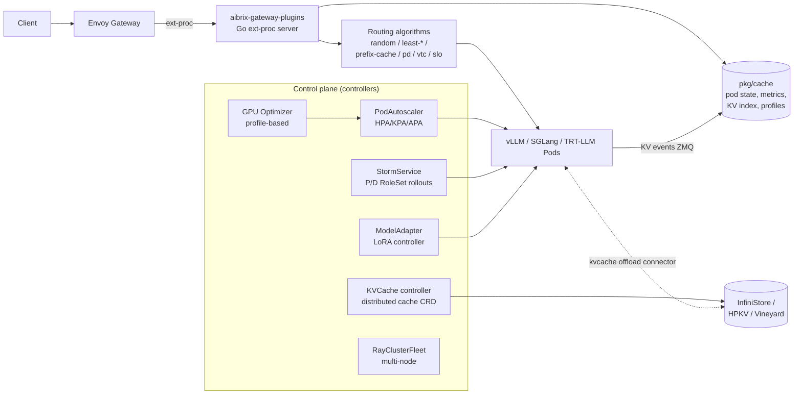
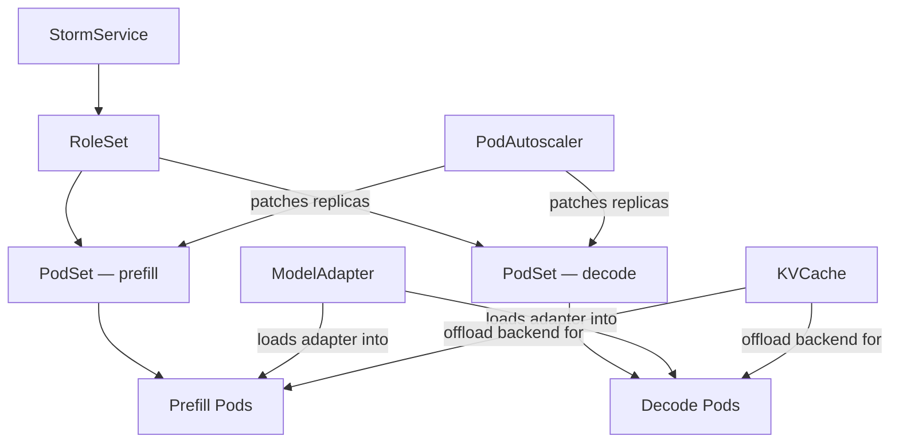
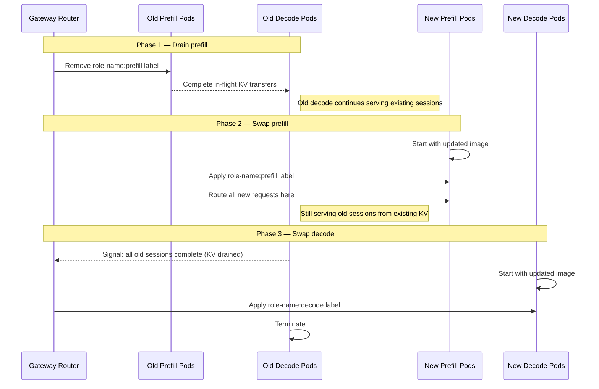

# AIBrix: Full-Stack Kubernetes Inference Platform

**After reading this chapter, the reader will be able to:**

- Describe AIBrix's 8 CRDs and which problems each one solves
- Explain the L1+L2 KV offloading Python library: the tier structure, the pluggable connector interface, and how it integrates with vLLM
- Describe the APA (Autoscaling Pod Autoscaler) and VTC (Virtual Token Counter) fairness mechanism
- Explain StormService: the pattern for managing rolling P/D cluster upgrades without request loss
- State AIBrix's origin (ByteDance, vLLM org) and current governance

AIBrix is the most complete Kubernetes-native inference platform in this survey. Where NVIDIA Dynamo and llm-d each organize their control plane around three to four CRDs, AIBrix defines eight, covering model serving, adapter management, autoscaling, KV offloading, multi-tenant fairness, GPU optimization, and P/D rollout management in a single cohesive operator. The design reflects its origin: AIBrix began as ByteDance's internal platform for operating vLLM at hyperscale, and was subsequently contributed to the `vllm-project` GitHub organization. That organizational placement gives AIBrix privileged access to vLLM internals — KV connector hooks, KV event streams, LoRA adapter APIs, and the vLLM V1 block manager interface — in ways that a more upstream-agnostic system cannot assume. The white paper describing the system ("AIBrix: An Open-Source, Large-Scale LLM Inference Infrastructure for System Research," arXiv 2504.03648) was presented at the ASPLOS 2025 workshop. The most recent tagged release is v0.6.0 (March 2026), and the project reached a public milestone at KubeCon EU/China 2025 when ByteDance presented joint work with Google on LLM-aware load balancing.

The design philosophy is to provide a production-grade inference platform that a platform team deploys once and exposes to application teams via ordinary Kubernetes manifests. In ByteDance's internal deployment, this means model teams submit `PodSet` and `ModelAdapter` manifests describing what they need, and the operator handles the operational concerns that would otherwise require per-team expertise: GPU scheduling, adapter lifecycle, KV offload configuration, fair queuing, and zero-downtime rollouts. Application teams interact with `PodSet` and `ModelAdapter` objects; the operator handles the rest — scheduling pods on GPUs, loading adapters, autoscaling replicas, routing traffic, offloading KV to distributed storage, and orchestrating rolling upgrades of disaggregated P/D topologies. Each of the eight CRDs targets one specific operational concern and can be adopted incrementally, but the full value emerges when they compose: `StormService` orchestrates `RoleSet`, which groups `PodSet`s, which are scaled by `PodAutoscaler` and served via the gateway layer that reads `VirtualTokenCounter` fairness scores and routes to KV tiers managed by `KVCache`.

The monorepo (`vllm-project/aibrix`) is organized as a Go operator with a Python data-plane library. The control plane — CRD definitions under `api/`, controllers under `pkg/controller/`, gateway plugins under `pkg/plugins/gateway/` — is pure Go. The KV offloading library (`python/aibrix_kvcache/`) and the runtime sidecar (`python/aibrix/`) are Python. CUDA kernels for fast GPU-to-CPU KV movement live in `python/aibrix_kvcache/csrc/`.

### Overall architecture



AIBrix's data plane is an Envoy gateway extended via the External Processing (ext-proc) API. The Go ext-proc server (`pkg/plugins/gateway/gateway.go`) intercepts each request, applies per-user and per-model rate limits (`gateway_ratelimit.go`), selects a routing algorithm from the registry by the `model.aibrix.ai/routing-strategy` annotation or `RoutingProfile`, and returns a pod address to Envoy. The in-memory cache (`pkg/cache/`) maintains live pod metrics ingested from vLLM's Prometheus `/metrics` endpoint, KV prefix hash tables updated via ZMQ event subscription (`kv_event_manager_zmq.go`), and model-GPU profile data consumed by the GPU Optimizer. The routing algorithm consults this cache — for example, `prefix_cache.go` scores pods by how many prefix blocks they already hold in their GPU KV pool — and returns a routing decision without a remote call.

---

## Part 1: The 8 CRDs

AIBrix's CRD surface is defined under `api/{autoscaling,model,orchestration}/v1alpha1/` and reconciled by Go controllers under `pkg/controller/`. The eight CRDs form a clear hierarchy: high-level lifecycle primitives (`StormService`, `RoleSet`) decompose into compute primitives (`PodSet`, `RayClusterFleet`) that ultimately own pods, while orthogonal controllers (`KVCache`, `ModelAdapter`, `PodAutoscaler`) attach auxiliary behavior at each level.

### CRD hierarchy overview



### 1. `KVCache`

`KVCache` (`api/orchestration/v1alpha1/kvcache_types.go`) is the control-plane abstraction over a cluster-wide distributed KV cache service. The controller reconciles a StatefulSet for the chosen backend plus a metadata sidecar that coordinates cache placement across engine instances. Its purpose is to decouple the life-cycle of the distributed cache tier from the individual inference pods that use it — pods are ephemeral; the `KVCache` resource persists across rolling upgrades and pod restarts.

Key spec fields:

| Field | Description |
|---|---|
| `backend` | One of `infinistore`, `vineyard`, `hpkv`, `distributed` |
| `l1_capacity_gb` | Per-engine DRAM tier size (informs the L1 eviction threshold) |
| `l2_capacity_gb` | Distributed/remote tier capacity (aggregated across replicas) |
| `eviction_policy` | `LRU`, `FIFO`, or `S3FIFO` |
| `metadata_service` | `redis` or `etcd` — coordinates block placement across instances |
| `runtime.replicas` | Number of backend replicas |
| `runtime.resources` | CPU/memory per replica |

Backend implementations live in `pkg/controller/kvcache/backends/`: `infinistore.go` (ByteDance's InfiniStore, RDMA-capable), `vineyard.go` (CNCF Vineyard), `hpkv.go` (high-performance KV store), and `distributed.go` (generic RDMA cluster).
The controller reconciles the backend StatefulSet and exposes a `ServiceSpec` — hostname, port, auth secret — that the Python `aibrix_kvcache` library reads at startup to configure its L2 connector. Changes to the backend (e.g., expanding from 4 to 8 replicas, migrating to a new backend type) are handled by the controller; the connectors in running pods pick up the updated `ServiceSpec` on their next reconnect cycle without requiring a pod restart.

### 2. `ModelAdapter`

`ModelAdapter` (`api/model/v1alpha1/`) manages the complete lifecycle of LoRA adapter loading and unloading across a fleet of inference pods. The controller, implemented in `pkg/controller/modeladapter/`, does not move weights itself; it delegates downloading to the AI Engine Runtime sidecar (a lightweight Go process running in each engine pod) and then calls vLLM's `/v1/load_lora_adapter` REST endpoint.

The adapter lifecycle progresses through states `Pending → Scheduled → Loading → Bound → Running`. A `Bound` adapter has been downloaded to the target pods; a `Running` adapter has a live Kubernetes Service exposing it under its own model name so callers can address it directly. The key spec fields are:

- `baseModel` — the model the adapter targets; used to match engine pods
- `podSelector` — label selector for pods eligible to host this adapter
- `artifactURL` — source location: HuggingFace Hub slug, `s3://` URI, or `gcs://` URI
- `rank` — LoRA rank, communicated to vLLM's adapter manager
- `replicas` — number of pods that must hold the adapter before the resource is `Running`

Multiple adapters can coexist on a single pod (multi-LoRA-per-pod is the intended production mode), keyed by name in vLLM's internal registry. The controller manages load/unload across pod restarts and evictions — if a pod is terminated and a replacement is scheduled, the controller re-runs the loading lifecycle on the new pod.

### 3. `PodAutoscaler` (APA)

`PodAutoscaler` (`api/autoscaling/v1alpha1/`) is AIBrix's custom autoscaler CRD with controller in `pkg/controller/podautoscaler/`. It supports three interchangeable scaling algorithms selected by `scalingStrategy`:

- **`HPA`** — wraps the standard Kubernetes HPA (`hpa_resources.go`). Useful for teams already operating HPA-based tooling.
- **`KPA`** — Knative-style stable/panic windows (`algorithm/kpa.go`). Responds aggressively during traffic spikes (panic mode) and stabilizes once load returns to baseline.
- **`APA`** — the AIBrix native algorithm (`algorithm/apa.go`). Adds a fluctuation tolerance band to suppress oscillation. This is the recommended mode for production LLM inference.

Key spec fields: `target_metric` (one of `request_count`, `kv_cache_usage_percent`, GPU utilization, or engine throughput in tokens per second), `min_replicas`, `max_replicas`, `scale_up_window_seconds`, `scale_down_window_seconds`. The controller adjusts replica count by patching `PodSet.spec.replicas`; it does not interact with the Kubernetes HPA object in APA mode — all reconciliation is internal.

### 4. `PodSet`

`PodSet` is the primitive for a single homogeneous group of inference pods — one tensor-parallel group, one pipeline stage, or one aggregated-serving replica set. It owns the underlying Deployment. Key spec fields include `model` (model identifier, used to locate weights), `parallelism` (tensor-parallel degree), `resources` (GPU type and count per replica), and `replicas`. `PodSet` is the atomic unit that `PodAutoscaler` scales and that `RoleSet` composes into roles.

A `PodSet` for a TP=4 deployment on 4×H100 pods might look like:

```yaml
apiVersion: orchestration.aibrix.ai/v1alpha1
kind: PodSet
metadata:
  name: llama-70b-decode
spec:
  model: meta-llama/Llama-3-70B-Instruct
  parallelism: 4
  replicas: 2
  resources:
    requests:
      nvidia.com/gpu: "4"
    limits:
      nvidia.com/gpu: "4"
```

The controller creates a Deployment with the vLLM container spec populated from the `PodSet` spec, injecting TP configuration as environment variables.

### 5. `RoleSet`

`RoleSet` manages a heterogeneous collection of `PodSet`s organized into named roles. The canonical configuration is a prefill `PodSet` and a decode `PodSet` with routing labels written to each pod: `roleset-name: <name>`, `role-name: prefill` or `role-name: decode`, and `model.aibrix.ai/engine: vllm` (or `sglang`, `trtllm`). The gateway's PD disaggregation algorithm (`pkg/plugins/gateway/algorithms/pd_disaggregation.go`) reads these labels to bucket pods into the appropriate pool per request. The disaggregation flow at runtime is:

1. The gateway receives a request, identifies the model, and activates the `pd_disaggregation` algorithm.
2. It buckets available pods by `roleset-name`, then by `role-name`.
3. For each (prefill pool, decode pool) pair, it checks for load imbalance: if the max–min outstanding request count on the prefill side exceeds a threshold, it fast-paths to least-loaded prefill regardless of KV affinity.
4. Otherwise it scores prefill pods using the configured `prefill score policy` (either `least_request` or `prefix_cache`) and decode pods using a composite score of running requests, pending queue depth, and drain rate.
5. The selected prefill pod receives the request with `max_tokens=1` and `do_remote_decode=True` (vLLM), executes prefill, and returns `kv_transfer_params`. The decode pod then pulls the KV state and begins token generation.

`RoleSet` can be used without `StormService` for P/D topologies that do not require rolling-upgrade semantics.

### 6. `StormService`

The rolling upgrade primitive for P/D deployments, described in detail in [Part 4](#part-4-stormservice--zero-downtime-pd-upgrades). At a structural level, `StormService` sits above `RoleSet` in the hierarchy and manages it through a multi-phase upgrade state machine implemented in `pkg/controller/stormservice/`. The spec includes `prefill_pod_set`, `decode_pod_set`, `upgrade_strategy` (phases, health gates, and update mode — rolling and inplace are StormService-level modes; parallel, sequential, and interleaved are RoleSet-level modes), and `drain_timeout_seconds`. `StormService` writes `roleset-name` and `role-name` pod labels that the gateway's PD disaggregation algorithm reads; the tight coupling between the controller and the gateway is intentional and is what makes the drain-aware phase transitions possible.

### 7. `RayClusterFleet`

`RayClusterFleet` (`pkg/controller/rayclusterfleet/`) manages a fleet of Ray clusters for large distributed inference jobs. It acts as a Deployment-over-ReplicaSet analog for Ray clusters, wrapping KubeRay. Coarse-grained Kubernetes resource orchestration (GPU allocation, node placement) is handled by the AIBrix controller; fine-grained task scheduling is delegated to Ray inside the cluster. This split is intentional: Ray's actor model and object store are well-suited to the irregular communication patterns of MoE wide-expert-parallel inference, while Kubernetes is the appropriate level of abstraction for GPU quota management and node affinity.

### 8. `RayClusterReplicaSet`

`RayClusterReplicaSet` (`pkg/controller/rayclusterreplicaset/`) is the per-cluster primitive underlying `RayClusterFleet`. The separation mirrors the Kubernetes Deployment/ReplicaSet pattern: `RayClusterFleet` carries the update strategy and desired count; `RayClusterReplicaSet` owns the pod-level reconciliation loop for a single Ray cluster spec.

One concrete motivation for the Fleet/ReplicaSet split is heterogeneous inference: different Ray clusters in the fleet may target different GPU types (H100 dense vs. A100) and thus have different per-cluster resource specs. `RayClusterFleet` can manage a mixed fleet with a single desired count and distribute across `RayClusterReplicaSet` objects bound to node-affinity rules for each GPU type, with the GPU Optimizer providing per-GPU-type throughput curves that inform routing.

### KV event sync

A thread separate from the routing algorithms handles the KV event subscription. `pkg/cache/kv_event_manager_zmq.go` (built only with `-tags=zmq`) subscribes to vLLM's KV-event stream and maintains the `SyncPrefixHashTable` that routing algorithms query. Each vLLM pod (≥ 0.7) publishes `BlockStored`, `BlockRemoved`, and `AllBlocksCleared` events over ZMQ; the event manager decodes them via `pkg/cache/kvcache/zmq_client.go` with a msgpack codec and updates the hash table atomically. The table maps prefix hash → set of pod addresses; `prefix_cache.go` reads it on the critical path. Requirements for KV event sync: vLLM ≥ 0.7 with the KV cache event publisher enabled, gateway-plugins binary built `-tags=zmq`, `libzmq3-dev` present in the container, and the remote tokenizer sidecar enabled (the gateway must tokenize the prompt to compute the prefix hash on the routing side).

### AI Engine Runtime sidecar

While not a CRD itself, the AI Engine Runtime deserves mention here because the `ModelAdapter` controller depends on it. A lightweight Go sidecar runs alongside each engine pod; it exposes a uniform management API covering model load/unload, LoRA adapter load/unload, and metric normalization across engine types. The `ModelAdapter` controller calls the sidecar's adapter load endpoint rather than calling vLLM's REST API directly — the sidecar handles engine-specific differences. Data-plane request traffic does not flow through the sidecar; it is a pure control-plane shim. The sidecar also participates in accelerator health diagnostics: `cmd/kvcache-watcher/` and the accelerator-diagnostic tooling detect GPU hardware failures and can trigger pod eviction, with the `KVCache` backend handling replication and replay for any KV blocks that were on the failed node.

---

### Gateway routing catalog

The gateway plugin (`pkg/plugins/gateway/`) maintains a registry of over fifteen routing algorithms, selectable per model at deploy time via the `model.aibrix.ai/routing-strategy` annotation or a `RoutingProfile`. The breadth reflects the operational reality that no single algorithm wins across all traffic shapes:

- **`random.go`** — uniform random; baseline and debugging.
- **`least_request.go`**, **`least_busy_time.go`**, **`least_load.go`**, **`least_util.go`** — variants of load-proportional routing.
- **`least_kv_cache.go`**, **`least_gpu_cache.go`** — route to the pod with the most available KV headroom; useful for memory-pressure avoidance.
- **`prefix_cache.go`** — prefix-cache-aware routing with a load-imbalance guard; the standard production choice for prompt-heavy workloads. Uses a configurable tokenizer (`character` or `tiktoken`) to hash the prompt prefix and match against the ZMQ-synchronized `SyncPrefixHashTable`.
- **`prefix_cache_preble.go`** — implementation of the Preble distributed prompt scheduling algorithm (Srivatsa et al., arXiv 2407.00023); optimizes prefix cache hit rate across a heterogeneous pod fleet.
- **`vtc.go`** — Virtual Token Counter fairness scorer.
- **`pd_disaggregation.go`** (with `pd/` sub-package) — full PD router. Buckets pods by `roleset-name` and `role-name` labels, applies load-imbalance fast paths for both prefill and decode, scores with pluggable prefill and decode score policies (added April 2026), and handles engine-specific KV transfer handshakes (vLLM synchronous, SGLang async bootstrap, TRT-LLM synchronous).
- **`slo.go`** — SLO-aware routing that consults predicted TTFT/ITL from the in-memory output predictor (`pkg/cache/output_predictor.go`).
- **`throughput.go`**, **`pack_load.go`**, **`power_of_two.go`** — throughput-maximizing and bin-packing variants.

The `RoutingProfile` (introduced February 2026, `#1944`) allows a model to specify a compound strategy — for example, apply VTC fairness to select a tenant-eligible subset, then use prefix-cache-aware routing within that subset. Profiles are stored as Kubernetes custom resources and consulted by the gateway per model name.

---

## Part 2: L1+L2 KV Offloading Library

AIBrix ships a dedicated Python library (`python/aibrix_kvcache/`) that adds a hierarchical KV cache tier below the GPU's HBM. It is AIBrix's most architecturally distinctive data-plane contribution. Dynamo's KVBM (described in [§80/05](./05-nvidia-dynamo.md)) is fully implemented in Rust and managed entirely by the orchestrator, with the engine connecting via a block-manager connector. llm-d delegates KV tiering to upstream vLLM CPU offload or to LMCache/Mooncake connectors, and does not own a separate offloading library. The AIBrix library is a standalone Python package that the inference engine imports as a plugin, giving it a different trade-off: easier to modify and deploy incrementally, but requiring Python-level coordination for performance-critical paths (mitigated by CUDA kernels for the hot GPU-to-CPU movement path).

### Tier structure

**L1 — CPU DRAM.** The first offload tier lives in the engine's own process, backed by pinned (page-locked) host memory to allow GPU DMA without extra copies. Capacity is bounded by available DRAM on the inference node and configured via the `KVCache` CRD's `l1_capacity_gb` field. Eviction policies are pluggable and implemented in `python/aibrix_kvcache/aibrix_kvcache/l1/eviction_policy/`:

- `LRU` — least recently used; the standard choice for most workloads
- `FIFO` — first in, first out; lower bookkeeping overhead for high-throughput streaming workloads
- `S3FIFO` — scan-resistant policy that divides blocks into small and main segments; avoids the LRU "scan" problem where a single long sequential access evicts all hot blocks

CUDA kernels under `csrc/` accelerate GPU-to-CPU KV movement. Zero-copy APIs landed in v0.6.0 (`#2056`) for vLLM v0.14, eliminating an intermediate copy on the CPU side when L1 pinned memory is already page-aligned.

**L2 — Distributed persistent tier.** The second tier is a remote distributed cache, shared across many engine instances. Cross-engine prefix sharing is the primary motivation: a system prompt whose KV blocks were computed by one engine pod can be reused by any other pod serving a subsequent request with the same prefix, eliminating redundant prefill computation across the cluster. L2 also absorbs overflow when L1 is exhausted — blocks evicted from L1 are written to L2 asynchronously rather than discarded.

A **meta service** (`meta_service/redis_meta_service.py`) coordinates cache placement across engine instances. The meta service maps prefix hash keys to (backend host, block key) tuples; on an L1 miss the connector queries the meta service, locates the L2 entry, and promotes it back to L1 before the forward pass starts. When the `KVCache` controller replaces or drains a backend, it updates the meta service, and all connectors transparently redirect to the new location.

**Tensor-parallel coordination.** For TP-sharded deployments, all TP ranks must see a consistent view. On an L1 partial miss, the library enforces a barrier across TP participants before issuing L2 fetches, ensuring that all ranks either receive the cached blocks or all ranks fall back to recomputation. Selective offloading uses eviction policy "hot/cold" labels to control which blocks are worth shipping over PCIe or RDMA — cold blocks from rarely-accessed suffixes are not worth the transfer cost.

### Connector interface

The L2 tier is accessed through a `BaseConnector` abstract class in `l2/connectors/`. The interface is intentionally minimal:

```python
class BaseConnector:
    def get(self, key: str) -> Optional[Tensor]: ...
    def put(self, key: str, value: Tensor) -> None: ...
```

Connectors also advertise capability flags (`mput_mget`, `prefetch`, `rdma`, `gdr_put`, `gdr_get`) that the tier manager uses to select optimal transfer paths. When `gdr_put` and `gdr_get` are both set — as with InfiniStore on a system with GPUDirect RDMA — the library can move KV blocks directly from GPU HBM to the remote store without staging through CPU memory, eliminating the PCIe round-trip.

Built-in implementations:

| Connector | Backend | Notable capability |
|---|---|---|
| `infinistore.py` | ByteDance InfiniStore | RDMA, GDR put/get |
| `hpkv.py` | High-performance KV store | `mput_mget` |
| `rocksdb.py` | Local NVMe via RocksDB | Persistent, no RDMA |
| `shfs.py` | Shared filesystem (NFS, EFS) | Cross-node, no RDMA |
| `eic.py` | ByteDance internal | Internal |
| `priskv.py` | ByteDance internal | Internal |

### vLLM integration

The library installs as a vLLM `KVConnector` plugin. The `AIBrixKVConnector` class inherits from vLLM's `KVConnectorBase` and is registered in vLLM's plugin registry; the vLLM engine calls it at the layer hook points defined in the V0 and V1 block manager interfaces. The full request lifecycle through the connector is:

1. On prefill completion, the connector writes the newly computed KV blocks to L1 asynchronously. The forward pass is not blocked.
2. If L1 eviction is triggered, victim blocks are written to L2 before being released from pinned memory.
3. On a new request, the connector probes L1 using the prefix hash. On an L1 hit, blocks are already in pinned memory and can be transferred to GPU via DMA before the forward pass. On an L1 miss, the connector queries the meta service for an L2 location. If found, it promotes the blocks to L1 (and then to GPU) before the forward pass starts.
4. The vLLM block allocator is informed which KV positions are already populated. Those positions are skipped during attention computation, achieving the prefix cache speedup.

For SGLang, integration reached parity with vLLM in v0.5 (November 2025). TRT-LLM does not yet have an `aibrix_kvcache` connector. The engine integration matrix is tracked in the AIBrix docs under the KV cache offloading feature page; the `vLLM V0/V1 connectors` column in that matrix distinguishes between the older V0 `KVConnectorBase` interface (block-level hooks) and the newer V1 interface that the zero-copy APIs target.

### Fault tolerance in the KV tier

When a backend node in the L2 tier fails, the meta service detects the failure (either via Redis Sentinel health checks or etcd watchdogs) and removes the failed node's entries from the placement table. KV blocks that were exclusively on the failed node are treated as misses on the next access; the engine recomputes the affected prefixes. For backends that support replication (InfiniStore's replica factor, Vineyard's fault-tolerant mode), blocks can survive a single node failure. The `cmd/kvcache-watcher/` binary provides an accelerator health watcher that monitors GPU hardware failures at the node level and can trigger pod eviction before the engine process crashes; combined with the `KVCache` controller's replication support, this gives the tier a degree of fault tolerance absent from single-node CPU-DRAM offload schemes.

### Comparison with LMCache

The AIBrix library occupies the same design space as LMCache ([§80/04](./04-lmcache.md)) but differs in integration depth and feature breadth. LMCache is engine-agnostic — it supports vLLM, SGLang, and others through the same connector interface — and includes CacheGen compression to reduce L2 bandwidth by encoding KV tensors at lower bitwidth before network transfer. LMCache also supports S3-compatible object stores as a backend, which the AIBrix library does not. The AIBrix library's advantage is tighter control-plane integration: the `KVCache` CRD provisions the L2 backend; the meta service lifecycle is managed by the controller; connector failover is coordinated with the operator's view of backend health. For teams running the full AIBrix operator, the library is the natural choice; for engine-agnostic or multi-orchestrator deployments, or for workloads where cross-engine compression is important, LMCache offers a broader feature set.

---

## Part 3: APA Autoscaler and VTC Fairness

### APA (Autoscaling Pod Autoscaler)

The `PodAutoscaler` CRD is a custom Kubernetes controller (`pkg/controller/podautoscaler/`) that addresses a practical shortcoming of standard HPA for LLM inference workloads. The problem is metric noise: GPU utilization and KV cache occupancy respond to individual long-context requests in ways that do not predict steady-state load. A single 32k-token prompt can saturate KV memory for its duration without indicating that the cluster needs more replicas. Standard HPA reacts to these transients, triggering scale-up followed by scale-down thrashing within minutes, which wastes GPU capacity (new vLLM processes take 30–90 seconds to load weights) and creates latency spikes during the transition.

The AIBrix-native APA mode (`algorithm/apa.go`) addresses this with two mechanisms. First, a fluctuation tolerance band prevents small deviations from the target from triggering a replica count change:

$$\text{desired\_replicas} = \left\lceil \frac{\text{current\_metric}}{\text{target\_metric} \cdot (1 \pm \epsilon)} \right\rceil,$$

where $\epsilon$ is a configurable tolerance (defaulting to 0.1, i.e. 10%). If the observed metric is within 10% of the target, the current replica count is kept unchanged. Beyond the band, the formula computes the standard desired count. Second, the algorithm is asymmetric in time: scale-up takes effect within one reconciliation window (`scale_up_window_seconds`), while scale-down requires the metric to remain below the lower band for the full `scale_down_window_seconds` window before replicas are reduced. This prevents premature scale-down after a short-lived traffic lull.

**Metrics sources.**

APA pulls metrics from Prometheus — specifically vLLM's `/metrics` endpoint scraped into the AIBrix in-memory cache at `pkg/cache/cache_impl.go` — and from the Kubernetes metrics API for pod-level CPU/memory. Primary signals are:

- `request_count` — requests per second per pod, the most direct proxy for load
- `kv_cache_usage_percent` — fraction of the GPU's paged KV pool in use; added to APA in April 2026 (`#2057`)
- Engine throughput in tokens per second — useful for throughput-SLO-driven scaling
- GPU utilization — coarser signal; less reliable for inference workloads where high utilization does not mean high throughput

When both `request_count` and `kv_cache_usage_percent` are configured, the controller takes the maximum of the two desired replica counts — scale up if either signal indicates the need, but do not scale down unless both signals agree. This dual-signal approach prevents the common failure mode where KV cache occupancy is high (blocking new requests) while request-rate is temporarily low (because the KV-full condition is already throttling intake), which would incorrectly signal to a single-signal autoscaler that the cluster can be reduced.

**GPU Optimizer proactive path.** A separate `GPUOptimizer` controller (described in [Part 5](#part-5-gpu-optimizer)) reads per-(GPU-type, model) profiles from `pkg/cache/model_gpu_profile.go`, solves a configuration selection problem offline, and writes the recommended replica count as an input to KPA. This proactive path is orthogonal to APA's reactive loop; for workloads with a predictable diurnal pattern, the two can be combined: the Optimizer sets the baseline replica count, and APA handles intra-day variation.

### VTC (Virtual Token Counter) Fairness

In multi-tenant deployments where multiple teams or API consumers share a single model endpoint, without fairness enforcement a high-throughput tenant can monopolize the serving capacity and starve others. Simple rate limiting (tokens per minute per tenant) reduces the problem but wastes capacity when high-priority tenants are idle. AIBrix implements the Virtual Token Counter (VTC) mechanism — first described in "Fairness in Serving Large Language Models" (Sheng et al., OSDI 2024) and reimplemented in `pkg/plugins/gateway/algorithms/vtc.go` — as a routing algorithm that the gateway selects per model via the `model.aibrix.ai/routing-strategy: vtc` annotation.

Each tenant (identified by API key or Kubernetes namespace) accumulates a `VirtualTokenCount` $v_t$ tracking recent normalized consumption:

$$v_t = \frac{\text{tokens\_consumed}_{t,\,\text{window}}}{\text{quota}_t}.$$

The routing layer uses $v_t$ to implement weighted fair queuing. When multiple requests are eligible for dispatch, those from tenants with a lower $v_t$ receive higher priority. A tenant that has consumed fewer tokens relative to its quota in the recent window is favored; a tenant that has consistently hit its quota is deprioritized relative to quiescent tenants. After the window expires, token counts decay, restoring priority to previously heavy tenants.

This mechanism prevents noisy-neighbor effects without requiring a hard throttle that would increase latency for well-behaved tenants during periods of low overall utilization. The VTC scorer is composable: a `RoutingProfile` (introduced February 2026) can combine VTC fairness with prefix-cache-aware pod selection, routing traffic to the pod with the highest KV prefix hit rate among pods whose tenant quota has headroom.

Neither Dynamo nor llm-d implements a token-counter fairness primitive. Dynamo exposes agent-hint priority fields (`priority`, `expected_output_length`, `cache_ttl`) that modulate routing cost but do not accumulate a bounded counter per tenant. llm-d implements priority bands and FIFO/SLO-based ordering policies in its EPP flow-control layer (`flowcontrol/`) but does not maintain per-tenant token consumption state.

The VTC is most valuable in internal platform deployments where multiple product teams share a single model deployment and each team has a stated token quota. Without VTC, a team running a high-parallelism batch job (e.g., offline document processing) can saturate the decode pool and push interactive request latency up for other teams. VTC bounds this: once the batch team's $v_t$ exceeds 1.0 (consumed their full quota window), their requests are deprioritized relative to interactive requests from teams with $v_t < 1.0$, without hard rate-limiting either workload. The gate is soft, allowing burst above quota when capacity is available, and self-correcting as the window rolls forward.

---

## Part 4: StormService — Zero-Downtime P/D Upgrades

### The problem

In a disaggregated P/D deployment, prefill and decode pods are separated by design — different computation, potentially different GPU types, independently scaled. This separation creates a coupling problem during rolling upgrades. When a new model version (updated weights or engine binary) must be deployed, both prefill and decode pods eventually need to restart. But in-flight requests have their KV state split across the two tiers: the prefill pod computes and holds the prompt's KV blocks, then hands a reference to the decode pod. If the prefill pod restarts before the decode pod finishes consuming that KV state, the decode pod holds a dangling reference and the request is lost. If the decode pod restarts first, the prefill result is never consumed.

Standard Kubernetes rolling update strategies operate within a single Deployment and restart pods independently without awareness of inter-Deployment KV dependencies. Running separate rolling updates on the prefill and decode Deployments sequentially reduces (but does not eliminate) the hazard, and imposes a maintenance window during which one pool is at reduced capacity. `StormService` solves this properly.

### Three-phase coordinated upgrade

The `StormService` controller (`pkg/controller/stormservice/`) implements a three-phase upgrade state machine that respects the KV ownership boundary between prefill and decode generations.

**Phase 1 — Drain prefill.** The controller stops routing new requests to the old prefill pods by removing their `role-name: prefill` label, which the gateway's PD router uses for pod selection. In-flight prefill operations on the old pods are allowed to complete. Old decode pods continue processing their existing sessions from KV state already transferred from the old prefill generation.

**Phase 2 — Swap prefill.** New prefill pods (running the updated image) are brought up and labeled `role-name: prefill`. All new requests are routed to the new prefill pods. Old decode pods continue serving their existing sessions — they hold KV state from the old prefill generation and can complete their current decode steps without interaction with the new prefill pods.

**Phase 3 — Swap decode.** The controller monitors old decode pods for KV drain: once all sessions originating from the old prefill generation have completed (no active decode steps remain on the old pods), new decode pods (updated image) are brought up and receive the `role-name: decode` label. Old decode pods terminate cleanly.

The `StormService` spec fields that drive this process include `prefill_pod_set`, `decode_pod_set`, `upgrade_strategy` (phase definitions and health gates), and `drain_timeout_seconds` (a safety valve: if old decode pods do not drain within this window, the phase advances and in-flight sessions are dropped or migrated at the operator's discretion).

Two operating modes modify how the state machine applies across the cluster. **Replica Mode** (configured with `replicas >= 1`) treats each `RoleSet` as an independent P+D pair; upgrades proceed per-pair, so the cluster continues serving from other pairs during each pair's upgrade window. Update order within the fleet can be rolling (one pair at a time), parallel (all pairs simultaneously), sequential (deterministic pair-by-pair), or interleaved. **Pooled Mode** (single logical replica with each role scaling independently in a shared pool) upgrades the entire shared pool and requires tighter drain coordination across all pods in the role.

### Sequence diagram



### Comparison with Dynamo and llm-d

The StormService is AIBrix's most distinctive control-plane contribution. Dynamo's `DynamoGraphDeploymentRequest` (DGDR) CRD handles zero-config initial deployment and profile-driven configuration selection, but its update flow restarts the graph's components via standard Kubernetes machinery without a KV-drain-aware phase protocol. llm-d relies entirely on Kubernetes rolling update semantics, which restarts pods within a Deployment without awareness of inter-Deployment KV state. Neither system exposes anything equivalent to the three-phase drain-swap-swap protocol with configurable update modes (rolling, parallel, sequential, interleaved).

The gap is sharpest for latency-sensitive production deployments with large decode pools: in a 16-prefill + 64-decode topology, a naive rolling restart of the decode Deployment would simultaneously drop up to 25% of decode capacity and leave in-flight KV references dangling on each restarted pod. With StormService in Replica Mode and a rolling update order, the same upgrade proceeds pair-by-pair, losing only 1/N of capacity at a time and guaranteeing KV-clean handoffs throughout.

---

## Part 5: GPU Optimizer

The `GPUOptimizer` is a controller that bridges offline workload profiling and the runtime autoscaler. It observes the inference workload over a configurable measurement window — collecting batch size distribution, input and output sequence length distribution, and throughput target — and stores per-(GPU-type, model) profile data in `pkg/cache/model_gpu_profile.go`. Given the observed traffic and a cost function over GPU-hours, it solves a configuration selection problem: find the TP degree, number of GPUs per replica, and KV block size that achieves the throughput target at minimum cost. The solution is written as a recommended replica count and configuration into KPA's input, which the `PodAutoscaler` controller then enforces by patching the relevant `PodSet.spec` fields.

The GPU Optimizer is primarily a tool for initial deployment configuration and periodic capacity planning — think of it as a one-time or scheduled advisor rather than a continuous control loop. It runs offline calibration using the model's compute profile and the observed traffic distribution, then emits `PodSet` patches with recommended TP degree, replica count, and KV block size. It does not react in real time to individual requests. For heterogeneous GPU inference — serving the same model across a mix of H100, A100, and L4 nodes — the Optimizer's profile model (`RoutingProfile`, introduced February 2026) also informs routing: the gateway selects the lowest-cost GPU pool that meets the current request's predicted latency SLO, with profile data providing the per-pool throughput/latency curve. This proactive profile-based path complements APA's reactive loop: the Optimizer sets the baseline configuration for each GPU type, and APA handles intra-day traffic variation around that baseline.

The GPU Optimizer's heterogeneous serving capability is architecturally analogous to llm-d's Workload Variant Autoscaler (WVA), which also models multi-GPU-type deployments and emits scaling targets based on cost-vs-SLO optimization. The key difference is that AIBrix integrates the profile data directly into the routing layer (the gateway reads `model_gpu_profile.go` to score pools), while llm-d's WVA acts purely at the Kubernetes scaling level and relies on the standard EPP scoring chain for request routing. For workloads where routing and scaling decisions must be co-optimized — for example, preferring H100 pods for latency-sensitive requests and L4 pods for throughput-optimized batch requests — AIBrix's tighter integration is an advantage.

---

## Part 6: Comparison with Dynamo and llm-d

Each orchestrator in this survey started from a different organizational home and different pain points: Dynamo from NVIDIA's need to demonstrate Blackwell-scale disaggregated throughput; llm-d from Red Hat's goal of a CNCF-conformant inference platform built on standard industry proxy components; AIBrix from ByteDance's requirement to operate vLLM cost-effectively at production scale with full LoRA lifecycle management and fairness enforcement. Those origins explain most of the architectural divergence in the table below.

| Aspect | Dynamo | llm-d | AIBrix |
|---|---|---|---|
| **Origin** | NVIDIA | Red Hat / Google / IBM / CoreWeave (CNCF Sandbox 2026-03) | ByteDance, donated to vLLM org |
| **Data plane integration** | Deep NIXL: Rust KVBM owns G1 GPU / G2 host / G3 SSD / G4 remote tiers; engine connects via block-manager connector | Go sidecar in each decode pod orchestrates NIXL v2 P→D pull; KV tiering delegated to upstream vLLM or LMCache | Python `KVConnector` plugin (`aibrix_kvcache`); L1 DRAM + L2 distributed backends via `BaseConnector`; CUDA kernels for hot path |
| **KV routing** | Global radix index (Rust `RadixTree` / `ConcurrentRadixTree`); cost = `w·prefill_blocks + decode_blocks` | EPP `precise-prefix-cache-scorer` backed by ZMQ KV-event indexer; heuristic `prefix-scorer` as fallback | `prefix_cache.go` + `prefix_cache_preble.go`; ZMQ event sync with vLLM ≥ 0.7 |
| **Autoscaling** | Planner: SLA throughput-based (ARIMA/Kalman/Prophet) + load-based; writes to `DynamoGraphDeploymentScalingAdapter` `scale` subresource | HPA + EPP metrics; KEDA optional; WVA for multi-variant cost optimization | HPA + KPA + APA (fluctuation-tolerant native); GPU Optimizer proactive profile path |
| **Rolling upgrade** | DGDR: zero-config initial deploy + profile-driven config selection; standard K8s rollout for running deployments | Standard Kubernetes rolling update, no KV-drain protocol | StormService: three-phase drain-swap-swap with per-role KV-drain awareness |
| **Multi-tenancy fairness** | Agent hints (priority, output-len, cache TTL) modulate routing cost | EPP flow-control: priority bands + FIFO/SLO ordering policies | VTC: per-tenant virtual token counter with weighted fair queuing; composable with routing algorithms |
| **LoRA management** | Supported via vLLM GAIE caveat; no dedicated CRD | Cache-aware LoRA routing scorer (since v0.5); no dedicated lifecycle CRD | First-class `ModelAdapter` CRD: full `Pending → Running` lifecycle, multi-adapter-per-pod, dedicated per-adapter Service |
| **GAIE / Inference Gateway conformance** | First-class EPP plugin using CGO into Rust router | Reference implementation of GIE; `llm-d-inference-scheduler` is the official EPP | Pre-dates GIE; uses Envoy ext-proc directly; some compatibility but not GAIE-conformant |

On the question of whether AIBrix's CRD-heavy approach or llm-d's upstream-first approach is more operable at scale, the answer is workload-dependent. The AIBrix model pays a higher initial complexity cost (eight CRDs to understand and manage) in exchange for tighter lifecycle automation, especially for LoRA-heavy and P/D-disaggregated deployments where the operator-managed state transitions are complex enough to justify dedicated controllers. The llm-d model pays a lower bootstrap cost and benefits from CNCF community momentum, but delegates more operational responsibility to the platform team (rolling upgrades, LoRA loading, heterogeneous GPU routing) through composable but un-integrated components.

---

## Current production state

AIBrix v0.6.0 (released March 2026, git HEAD `31176b4ac242b3d2f3e31ee6e3cd31ba931f5d5d`) represents a production-ready baseline aligned with the ByteDance inference infrastructure model. The 8 CRDs cover the full operational lifecycle: `PodSet` and `RoleSet` describe the compute topology; `ModelAdapter` manages LoRA loading and multi-adapter coexistence; `PodAutoscaler` handles reactive scaling with APA's fluctuation tolerance and proactive scaling via the GPU Optimizer; `KVCache` provisions and manages the distributed L1+L2 offload tier; `StormService` coordinates zero-downtime P/D upgrades; and `RayClusterFleet`/`RayClusterReplicaSet` manage large multi-node jobs. The vLLM engine integration is deepest across all features — KV connectors, KV event sync (vLLM ≥ 0.7 required), and LoRA adapter APIs all tie into vLLM internals — with SGLang reaching comparable feature parity in v0.5 (November 2025) and TRT-LLM end-to-end P/D tests landing in April 2026. The gateway plugin algorithm catalog (`pkg/plugins/gateway/algorithms/`) has grown to over fifteen routing strategies, from `random.go` and `least_request.go` through `prefix_cache_preble.go` (Preble paper, arXiv 2407.00023) and `vtc.go` (VTC, OSDI 2024), reflecting the operational reality that no single routing algorithm dominates all traffic shapes. The March 2026 addition of a web console (`apps/console/`) with a BFF and SQLite-backed local mode pushes toward a single-pane-of-glass operator UX that distinguishes AIBrix from the more CLI- and CRD-centric Dynamo and llm-d.

Looking at the release timeline: v0.3 (May 2025) introduced the initial production KVCache Offloading Framework with cross-engine reuse via L2 distributed cache; v0.4 (August 2025) was a major release presented at KubeCon EU/China, featuring KV-aware load balancing; v0.5 (November 2025) added SGLang KV cache offloading and PD support; v0.6 (March 2026) delivered L2 KVCache zero-copy APIs for vLLM v0.14, the Power-of-Two router, and chat-template tokenization for the prefix-cache router. The full TRT-LLM e2e P/D test suite landed in April 2026. The cadence is roughly one major release per quarter with significant data-plane changes in each, plus a continuous stream of routing algorithm additions, metrics improvements, and bug fixes in between.

The L1+L2 KV offloading library is less mature than LMCache in backend breadth — no S3-compatible store, no CacheGen compression — but more integrated with the AIBrix control plane. The `KVCache` CRD provisions the L2 backend; the meta service lifecycle is operator-managed; connector failover is coordinated with the operator's backend health view. The StormService remains AIBrix's unique contribution with no equivalent in Dynamo or llm-d — it is the only system in this survey that exposes a KV-drain-aware P/D rolling upgrade protocol as a first-class CRD.

On governance: the project is hosted in the `vllm-project` GitHub organization, which gives it visibility and ensures close alignment with vLLM's roadmap, but also means that engine-layer decisions made upstream — such as how much KV management vLLM absorbs natively — directly affect the scope of AIBrix's library. If vLLM continues expanding its native CPU offload and tiered prefix caching support, `aibrix_kvcache` may evolve toward a thin connector adapter rather than a full-featured offloading framework; if vLLM delegates this concern to pluggable connectors, the library's current architecture remains the right level of abstraction. A parallel open question is whether AIBrix will adopt the Gateway API Inference Extension (GAIE) `InferencePool` CRD as its routing surface: doing so would bring it into conformance with llm-d and Dynamo's EPP plugins and reduce the per-ecosystem tooling burden for operators running multiple orchestrators in the same cluster. As of v0.6.0 the gateway remains ext-proc-but-not-GAIE-conformant; the team has indicated awareness of the gap but no committed migration timeline.
