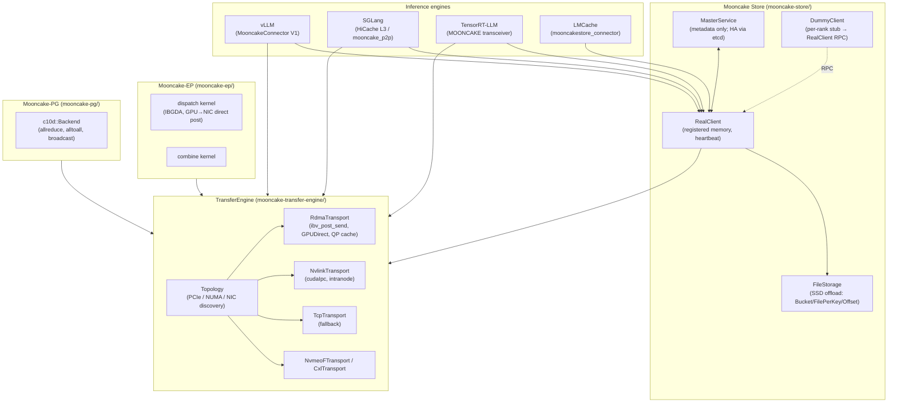
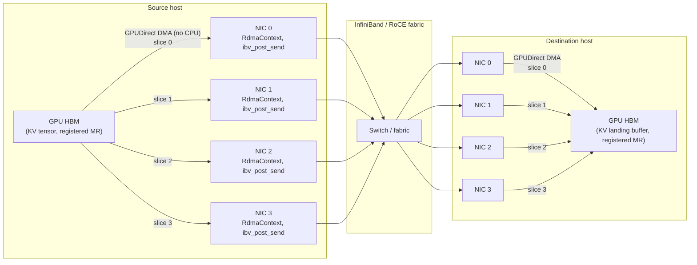

# Mooncake: Multi-NIC RDMA KV Transfer and Distributed Store

**After reading this chapter, the reader will be able to:**

- Describe Mooncake's layered architecture: TransferEngine → Mooncake Store → Mooncake-EP / Mooncake-PG
- Explain the multi-NIC RDMA bandwidth aggregation design in TransferEngine: how it routes transfers across multiple NICs to saturate aggregate bandwidth
- Describe Mooncake Store: the MasterService / RealClient / DummyClient model, the two-phase PutStart/PutEnd protocol, and HA via etcd
- Explain Mooncake-EP and how it replaces the standard all-to-all in MoE expert-parallel inference
- State Mooncake's FAST '25 Best Paper status and Moonshot AI origin

In disaggregated prefill/decode serving, the network transfer of KV tensors from a prefill worker to a decode worker is the critical path between the end of prefill and the first decode step. Any byte of KV that has not arrived at the decode worker adds directly to time-to-first-token. That transfer must saturate available network bandwidth and must not introduce head-of-line blocking: one slow link or one retransmit cannot stall the entire request. Mooncake is Moonshot AI's open-source answer to this problem, built specifically for their Kimi inference infrastructure (Kimi K1.5, K2, K2.5) and released with the FAST '25 Best Paper "Mooncake: Trading More Storage for Less Computation — A KVCache-centric Architecture for Serving LLM Chatbot" (Qin et al., arXiv:2407.00079). The paper's PDF ships in the repository at `FAST25-release/Mooncake-FAST25.pdf`.

The central hardware observation is that a single InfiniBand port — even a ConnectX-7 at 400 Gbps — delivers roughly 50 GB/s of usable memory bandwidth into a GPU. A single H100 HBM bandwidth is ~3.35 TB/s, so the GPU can produce KV cache far faster than one NIC can drain it. At 10 GB of KV for a long-context request, a single NIC takes 200 ms to drain the payload — longer than many requests' total TTFT budget. Mooncake's solution is to treat every NIC on a host as a parallel RDMA endpoint and stripe each large transfer across all of them. On a 4-NIC host with CX7 cards the aggregate is ~200 GB/s and the same 10 GB transfer takes 50 ms; on an 8-NIC host with 400 Gbps cards the README cites 190 GB/s sustained. This multi-NIC aggregation is implemented in `TransferEngine`, the C++ library at the bottom of the stack, and everything above it — Mooncake Store, Mooncake-EP, Mooncake-PG — inherits the bandwidth without additional code. The work received the FAST '25 Best Paper award; the paper is included in the repository at `FAST25-release/Mooncake-FAST25.pdf` alongside the request traces used in the evaluation.

### System architecture overview

The three major layers of the Mooncake stack, and how the inference engines plug in:



---

## Part 1: TransferEngine — the C++ low-level transfer library

`TransferEngine` (`mooncake-transfer-engine/`) is the lowest-level component in the Mooncake stack: a C++ library with a C ABI header (`transfer_engine_c.h`), Python bindings via pybind11 (`mooncake-integration/transfer_engine/transfer_engine_py.cpp`), and a Rust crate wrapping the C ABI. All higher-level components — Mooncake Store, Mooncake-EP, Mooncake-PG, and the vLLM/SGLang connectors — call into TransferEngine for the actual data movement.

### API surface

The public interface in `mooncake-transfer-engine/include/transfer_engine.h` exposes six key methods:

```cpp
class TransferEngine {
    int init(const std::string& metadata_conn_string,
             const std::string& local_server_name,
             const std::string& ip_or_host_name = "",
             uint64_t rpc_port = 12345);

    Transport* installTransport(const std::string& proto, void** args);

    int registerLocalMemory(void* addr, size_t length,
                            const std::string& location = kWildcardLocation,
                            bool remote_accessible = true,
                            bool update_metadata = true);

    SegmentHandle openSegment(const std::string& segment_name);
    BatchID       allocateBatchID(size_t batch_size);
    Status        submitTransfer(BatchID, const std::vector<TransferRequest>&);
    Status        submitTransferWithNotify(BatchID,
                                           const std::vector<TransferRequest>&,
                                           NotifyDesc);
    Status        getBatchTransferStatus(BatchID, TransferStatus&);
};
```

Each `TransferRequest` specifies `{opcode=READ|WRITE, source, target_id, target_offset, length}`. The `openSegment` call resolves a remote peer name to a `SegmentHandle` by querying the metadata service (etcd, Redis, or the built-in `http_metadata_server.py`). Once a handle is open, `submitTransfer` issues the batch asynchronously; `getBatchTransferStatus` polls completion.

`submitTransferWithNotify` piggybacks a small `NotifyDesc` on an `IBV_WR_SEND_WITH_IMM` completion, which is what the vLLM PD connector uses to signal "decoder has received this KV block, prefiller may free."

The metadata service connection string passed to `init` determines how segment metadata (peer names, RKeys, addresses, liveness) is stored and discovered. Three options are supported: etcd (`etcd://host:port`), Redis, or the built-in Python HTTP metadata server (`http_metadata_server.py`, useful for single-machine testing or small clusters without etcd). The metadata service only stores control-plane records (segment descriptors, liveness heartbeats); all measured bandwidth flows over the RDMA transport and never touches the metadata service.

### Transport backends

`installTransport(proto, args)` installs one backend per call. The full list in `mooncake-transfer-engine/src/transport/` is:

| Protocol string | Backend | Notes |
| --- | --- | --- |
| `rdma` | `RdmaTransport` | IB / RoCE / eRDMA, CX5/CX6/CX7; GPUDirect |
| `tcp` | `TcpTransport` | Fallback; forces TCP-only mode when `isTcpOnly()` |
| `nvlink` | `NvlinkTransport` | cudaIpc handles, inter-GPU within node |
| `intranode_nvlink` | `IntranodeNvlinkTransport` | Peer-to-peer GPU copies on NVLink fabric |
| `efa` | `EfaTransport` | libfabric/EFA (host memory only, AWS) |
| `nvmeof` | `NvmeoFTransport` | NVMe-oF namespace reads and writes |
| `cxl` | `CxlTransport` | CXL memory as a target segment |
| `ascend` | `AscendTransport` | Huawei Ascend |
| `hip` | `HipTransport` | AMD ROCm |

The multi-protocol `mp_*` API allows a single segment to be registered under several transports simultaneously; per-batch selection picks the best available path.

### Multi-NIC RDMA bandwidth aggregation

The key design decision is in `RdmaTransport` (`rdma_transport.cpp`, `rdma_context.cpp`, `rdma_endpoint.cpp`). Topology discovery in `topology.h` / `topology.cpp` enumerates every RDMA NIC on the host, resolves their PCIe root complexes, and builds a NUMA-distance matrix relating each NIC to each CPU socket and GPU.

When `submitTransfer` is called with a large `TransferRequest` of length $L$:

1. The engine slices the payload into sub-segments, each assigned to one NIC.
2. Each NIC issues its sub-segment via `ibv_post_send` with opcode `IBV_WR_RDMA_WRITE`.
3. All sub-segment sends are in flight simultaneously; hardware RDMA DMA runs in parallel across NICs.
4. If one NIC's completion queue reports a failure, the engine retries that sub-segment on a different NIC rather than failing the entire request.

The slice assignment is topology-aware: the engine selects the NIC whose PCIe root is closest to the source GPU (minimizing PCIe traversal) and whose remote counterpart is closest to the destination GPU. For transfers within the same NVLink domain the `nvlink` transport takes precedence over RDMA.

The bandwidth math is straightforward. One IB CX7 port at 400 Gbps delivers $400 / 8 = 50$ GB/s. A 10 GB KV payload over a single port takes $10 / 50 = 200$ ms. Over four CX7 ports ($4 \times 50 = 200$ GB/s aggregate) the same payload takes $10 / 200 = 50$ ms — a 4× reduction. The README quotes 87 GB/s on $4 \times 200$ Gbps RoCE and 190 GB/s on $8 \times 400$ Gbps. Multi-NIC also improves tail latency: one NIC's retransmit stalls only its slice (typically $1/N$ of the payload); the remaining slices continue in parallel, so the p99 transfer time does not spike by the full retransmit penalty.

### QP setup and endpoint caching

Each `RdmaContext` owns a completion queue and one or more queue pairs (QPs) per remote peer. QP creation involves a three-way handshake (local QP attributes → exchange LIDs and GIDs → transition to RTR/RTS states); Mooncake amortizes this cost by caching established QPs in `endpoint_store.cpp`. The QP cache is keyed by `(local_NIC_index, remote_peer_name)`; cache hits skip the handshake entirely. This matters for serving workloads where the same prefill→decode pairs recur across requests: after the first request the QP is warm, and `submitTransfer` issues directly into the send queue without any setup overhead.

`WorkerPool` manages threads that drain completion queues and repost receive work requests. The pool uses one thread per RDMA NIC to avoid cross-NUMA completion processing. An alternative QP-multiplexed implementation under `mooncake-transfer-engine/tent/` (selected by `use_tent_`) shares a smaller QP pool across more concurrent transfers; this is used in deployments where the total QP count would exceed the NIC's hardware limit.

The bug fixed in the most recent HEAD commit (`2a5a94a0`, "TE: Fix possible dead lock in RDMA transport connection setup") illustrates a real-world challenge: the QP handshake involves RPCs between both sides, and if both sides initiate simultaneously (as can happen when two workers both issue `openSegment` to each other on startup) a deadlock could occur in the connection state machine. The fix adds a tiebreaker based on peer name ordering so that exactly one side acts as initiator.

### GPUDirect RDMA

For GPU-resident KV tensors (the common case), TransferEngine avoids all CPU and system memory involvement. When `registerLocalMemory` is called with a CUDA device pointer, `memory_location.cpp` calls `cudaPointerGetAttributes` to confirm the address is a VRAM range. `RdmaContext` then registers the region via `ibv_reg_mr` with `IBV_ACCESS_REMOTE_WRITE | IBV_ACCESS_RELAXED_ORDERING`. From that point the NIC DMAs directly from source GPU HBM to destination GPU HBM: the sequence is

```
Source GPU HBM → PCIe → NIC → InfiniBand fabric → remote NIC → PCIe → destination GPU HBM
```

with no bounce buffer and no CPU involvement on either end. The `tcp_transport` and `nvlink_transport` make the same `cudaPointerGetAttributes` check and fall back to a CPU-staging path when GPUDirect is unavailable.

Memory regions must be registered before transfers can reference them. `registerLocalMemory` is called once per buffer at worker startup — for vLLM this happens during `KVConnectorWorker.register_kv_caches`, which iterates over the paged KV buffer pool and registers each page's backing allocation. Registration is sticky: memory regions remain registered for the lifetime of the TransferEngine instance, so the per-transfer overhead is a single `ibv_post_send` call per NIC per slice, not a registration round-trip.

### Architecture diagram



---

## Part 2: Mooncake Store — distributed KV object store

Mooncake Store (`mooncake-store/`) layers an *object* abstraction over TransferEngine. The design separates metadata operations (which go through a central service) from data operations (which go point-to-point between workers via TransferEngine). The central service never touches the data plane; it only returns descriptors. This is the key scalability decision: the master is never a bandwidth bottleneck.

### MasterService

`MasterService` (`mooncake-store/include/master_service.h`, `src/master_service.cpp`) is the single-leader metadata server. It tracks:

- Which clients have mounted memory segments and how much capacity each contributes.
- For each object key, the list of `Replica::Descriptor` structs identifying which client holds which slice, at what offset, and in what tier (`DRAM`, `VRAM`, or `SSD`).

The public API is metadata-only:

```cpp
Status PutStart(key, slice_length, ReplicateConfig) -> vector<Replica::Descriptor>
Status PutEnd(key)
Status PutRevoke(key)
Status GetReplicaList(key)    -> vector<Replica::Descriptor>
Status BatchExistKey(keys)    -> vector<bool>
Status Remove(key)
Status CreateCopyTask(src_key, dst_segment)
```

`GetReplicaList` (called `Lookup` in usage) returns transfer metadata without returning any data. The calling client then issues `TransferEngine::submitTransfer` directly to the owning client's registered memory. The MasterService is therefore not on the critical data path: it handles one small RPC per operation, while the actual GB/s flow between workers over RDMA.

MasterService is stateless with respect to object data. Object payloads live in workers' registered memory and are managed by the workers themselves. Restarting MasterService does not destroy objects; objects survive until the worker that holds them evicts them or the worker process exits. This property is exploited in the HA design: a new MasterService leader that restores its metadata snapshot immediately knows where all objects are, without any data migration.

**HA via etcd.** The `ha/` subdirectory and `etcd_helper.h` / `hot_standby_service.h` implement multi-master leader election through etcd. Multiple MasterService instances run simultaneously; etcd consensus determines the leader. The hot standby (`hot_standby_service.h`) keeps a follower warm with the current metadata state. Snapshot persistence is in `SnapshotCatalogStore`; the on-disk operation log uses `EtcdOpLogStore`. On failover the new leader reloads the snapshot plus the op log and resumes serving within seconds. Clients detect the leader change via etcd watch notifications and reconnect transparently; in-flight `PutStart` calls whose leader disappeared are retried (with `PutRevoke` on the old allocation if it was recorded in the op log). A small HTTP metadata server (`http_metadata_server.py`) is available as an alternative for deployments that do not want an etcd dependency; it trades HA for operational simplicity and is suitable for single-rack or single-host deployments.

The `MountSegment` RPC is how clients join the pool. Each `RealClient` calls `MasterService::MountSegment(segment_name, capacity_bytes, affinity)` at startup. MasterService records the segment in its allocation table; subsequent `PutStart` calls can place object slices on this segment. `BatchReplicaClear` allows MasterService to garbage-collect a segment when its client heartbeat lapses — objects on a dead client are removed from the metadata, and in-flight readers receive a transfer error that triggers retry on a surviving replica (if `replica_num > 1`) or a cache miss (if `replica_num == 1`).

### RealClient

`RealClient` (`mooncake-store/include/real_client.h`, `src/real_client.cpp`) is the primary client implementation. It runs inside an inference worker process (or in a sidecar via `mooncake_store_service.py`) and:

- Owns the registered memory segment that contributes capacity to the store's pool.
- Communicates with MasterService for metadata RPCs.
- Uses TransferEngine for all data transfers.
- Runs background heartbeats to MasterService to keep segment registrations alive.
- Drives the SSD offload subsystem (`file_storage.h`) under instruction from MasterService.

Buffer-mode `Get` / `Put` and `BatchGet` / `BatchPut` are the main interfaces; slice-mode APIs are available for large objects that span multiple RDMA regions. `ResourceTracker` is a singleton that prevents double-registration of the same buffer region.

With tensor-parallelism degree $T$, a typical deployment runs one `RealClient` per inference instance plus one `DummyClient` per TP rank — so a TP=8 deployment has one RealClient and eight DummyClients per node.

### DummyClient

`DummyClient` (`mooncake-store/include/dummy_client.h`) is a lightweight stub for ranks (or nodes) that do not contribute memory to the store but need to issue requests. It forwards all operations to a co-located `RealClient` via zero-copy shared memory. This is used for TP ranks that don't own NIC resources, and for CPU-only router nodes that need to query the store without contributing DRAM.

### Two-phase Put protocol

The two-phase protocol is the key correctness mechanism. Writes are never visible until fully committed:

**Phase 1 — PutStart.** The client calls `PutStart(key, slice_length, config)`. MasterService allocates slots in one or more workers' registered memory (according to `AllocationStrategy` and `ReplicateConfig`) and returns a vector of `Replica::Descriptor` records. The client begins issuing `TransferEngine::submitTransfer` calls (RDMA WRITEs) to write the object data directly into the pre-allocated slots. The object is not yet visible to readers.

**Phase 2 — PutEnd.** Once all RDMA WRITEs complete, the client calls `PutEnd(key)`. MasterService marks the object as committed and durable; subsequent `GetReplicaList(key)` calls return the descriptors. No reader can observe a partially-written object.

`PutRevoke` aborts the write and returns the slots to the free pool. `BatchPutEnd` and `BatchPutRevoke` handle the batched path. `Upsert` combines PutStart and PutEnd when the key already exists and the new value has the same size; it reuses existing descriptors rather than reallocating.

The separation between phases allows transfer overlap: phase 1 can proceed concurrently with other computation; the MasterService allocate-RPC is cheap; the bulk of time is in the RDMA writes, which proceed asynchronously.

### SSD offload walkthrough

The full evict-and-restore cycle (`docs/source/design/ssd-offload.md`) is worth tracing in detail because it illustrates the interplay between MasterService and RealClient on the non-critical path:

1. **Capacity pressure.** MasterService tracks free space across all segments via periodic heartbeats. When segment utilization exceeds a threshold, the eviction strategy (`LRUEvictionStrategy` or `FIFOEvictionStrategy`) selects candidate keys.
2. **Offload instruction.** MasterService sends the eviction set to the responsible RealClient in the heartbeat response payload.
3. **BatchOffload.** RealClient calls `file_storage.BatchOffload(keys)`. The `FileStorage` coordinator picks one of three on-disk layouts based on configuration: `Bucket` (fixed-size slab; fast sequential I/O, wastes space for variable-size objects), `FilePerKey` (one file per object; easy `ls`-based enumeration but high metadata overhead), or `Offset`-allocator (packed sequential writes with an in-memory free list; best space efficiency). If cuFile / GPUDirect Storage is available, the GPU buffer is written directly to NVMe without staging through CPU memory.
4. **Descriptor update.** RealClient reports completion to MasterService. MasterService updates the replica descriptor to `tier=SSD, path=<on-disk-location>` and frees the DRAM segment slot.
5. **Read promotion.** When a decode worker calls `GetReplicaList(key)` and receives an SSD descriptor, the owning RealClient is responsible for promotion: it reads the object from NVMe (again via cuFile or POSIX staging) into a new DRAM/VRAM slot, updates MasterService with the promoted descriptor, and only then does the fetching client issue the RDMA READ. The promotion is transparent to the fetching client; it sees the new in-memory descriptor.

For 3FS-based deployments (`mooncake-store/include/hf3fs/`), the offload target is Moonshot's distributed filesystem instead of local NVMe, enabling objects to be shared across machines and surviving worker restarts.

### Allocation and eviction

`AllocatorManager` (`allocator.h`, `allocation_strategy.h`) implements three placement strategies: `RandomAllocationStrategy` (uniform random across segments), `FreeRatioFirstAllocationStrategy` (fill the segment with the most free space first), and `CxlAllocationStrategy` (preferentially fill CXL-attached memory). Eviction at the master uses `LRUEvictionStrategy` or `FIFOEvictionStrategy` (`eviction_strategy.h`). Per-client *hot-cache* tracking (`local_hot_cache.h`) soft-pins recently-accessed keys; `count_min_sketch.h` estimates per-key access frequency without per-key counters.

`ReplicateConfig` carries `{replica_num, with_soft_pin, with_hard_pin, preferred_segment}`. Hard-pinned objects are never evicted; soft-pinned objects are last-evicted. Each slice within an object is placed on a different segment, so a single-segment failure loses at most one replica.

### Consistency model

Once `PutEnd` is acknowledged, the object is immutable until `Remove`. Concurrent `GetReplicaList` calls always return a consistent set of descriptors pointing to a fully-written object. There is no "dirty read" window: the two-phase protocol ensures that a `GetReplicaList` either finds the object (committed) or does not find it (not yet committed or not yet `PutEnd`-ed). This immutability guarantee is what makes zero-copy `Get` safe: the client can issue a `TransferEngine::submitTransfer` READ directly into user-provided memory and be certain the source bytes will not change during the transfer.

Replication is *best-effort* with respect to replica count. `ReplicateConfig.replica_num` is a target, not a quorum requirement. MasterService will place replicas on up to `replica_num` segments, but if only one segment has capacity it will proceed with `replica_num=1`. The rationale stated in the codebase is that re-replication is cheap (the data is KV cache, not ground truth; evicting and re-fetching is acceptable) and that stalling on quorum would increase TTFT on the critical path. This is a deliberate trade-off between durability and latency that is appropriate for a cache but would be unacceptable for a primary data store.

`CreateCopyTask(src_key, dst_segment)` is used by the master to proactively replicate popular objects to segments that have capacity, driven by the `count_min_sketch` access frequency estimator. This is the background re-replication path and does not block client operations.

### The P2P Store

`mooncake-p2p-store/` is the older, master-less predecessor, designed for checkpoint distribution rather than KV transfer. `Register` advertises a local payload to etcd; `GetReplica` finds peers with the data and pulls slices over TransferEngine; the receiver then becomes a source for further peers, forming a BitTorrent-shaped dissemination tree. The P2P Store is used in Moonshot's training-to-inference checkpoint pipeline and is not part of the inference serving hot path.

---

## Part 3: Mooncake in the disaggregated P/D flow

The end-to-end lifecycle for a prefill/decode disaggregated request, using Mooncake as the KV transport layer, proceeds as follows. See [§20](../20-distributed-inference/) for the disaggregated serving architecture.

**Step 1 — Prefill completes.** The prefill worker runs the forward pass; KV tensors for all layers are in GPU HBM, registered with TransferEngine via `registerLocalMemory`.

**Step 2 — PutStart.** The prefill worker calls `PutStart(key=request_id, size=kv_bytes, config)`. MasterService allocates a slot in the decode worker's registered memory (or a shared pool worker's memory) and returns `Replica::Descriptor` records containing the target node, NIC affinity, base address, and size.

**Step 3 — Multi-NIC RDMA write.** The prefill worker calls `TransferEngine::submitTransfer` with the descriptor. The engine slices the KV payload across all available NICs and issues parallel RDMA WRITEs. GPUDirect RDMA moves data from prefill GPU HBM directly to decode GPU HBM with no CPU involvement on either end.

**Step 4 — PutEnd.** Once all RDMA WRITEs complete (confirmed via `getBatchTransferStatus`), the prefill worker calls `PutEnd(request_id)`. MasterService commits the object; it is now visible to readers.

**Step 5 — Lookup.** The decode worker (or the routing proxy, `vllm_v1_proxy_server.py`) calls `GetReplicaList(request_id)`. MasterService returns the transfer metadata. No data crosses the master.

**Step 6 — Decode begins.** The decode worker's KV landing buffer already contains the full KV from step 3. The decode worker maps the buffer into its attention kernel and begins autoregressive generation.

In the fast path — prefill and decode workers on the same NVLink domain — steps 3–5 complete in under 1 ms because the `nvlink` or `intranode_nvlink` transport is selected and no RDMA fabric is involved. In the cross-node slow path, the duration is $\text{kv\_bytes} / \text{aggregate\_NIC\_bandwidth}$: for 10 GB over 4× CX7 (200 GB/s aggregate), 50 ms.

The `submitTransferWithNotify` variant is used in the vLLM connector (`mooncake_connector_v1.py`) to piggyback a completion notification on the final RDMA send, signaling the decode worker without an additional polling loop.

A sequence diagram showing the control-plane and data-plane interactions:

```mermaid
sequenceDiagram
    participant PW as Prefill worker
    participant MS as MasterService
    participant DW as Decode worker
    participant TE as TransferEngine (RDMA)

    PW->>PW: forward pass complete; KV in GPU HBM
    PW->>MS: PutStart(key, size, config)
    MS-->>PW: [Replica::Descriptor list]
    note over PW,TE: data plane; no MasterService involvement
    PW->>TE: submitTransfer(descriptors) → RDMA WRITEs
    TE-->>DW: GPUDirect DMA into landing buffer
    PW->>TE: getBatchTransferStatus → DONE
    PW->>MS: PutEnd(key)
    MS-->>PW: OK (object committed)
    DW->>MS: GetReplicaList(key)
    MS-->>DW: [Replica::Descriptor list]
    note over DW: KV already in landing buffer from step 4
    DW->>DW: begin decode
```

The critical observation is that MasterService handles exactly two small RPCs (`PutStart` and `PutEnd`) per KV object, both on the control plane. The actual KV bytes flow directly from prefill GPU to decode GPU via RDMA without touching the master at all. This means MasterService throughput is bounded by the rate of completed requests, not by data volume — a cluster handling 10,000 requests per second with 10 GB of KV each requires MasterService to handle 20,000 small RPCs per second, not 100 TB/s of data.

---

## Part 4: Mooncake-EP — expert-parallel all-to-all replacement

In mixture-of-experts inference with expert-parallel (EP) degree $K$, each input token must be routed to its top-$k$ experts, which may reside on any of the $K$ workers. The standard communication pattern is an all-to-all: each worker sends a partition of its activations to every other worker. NCCL implements all-to-all efficiently when traffic is uniform across worker pairs, using ring or binary-tree topologies that amortize per-link setup cost over many transfers.

MoE routing is non-uniform. Hot experts (high routing probability) receive many more tokens than cold experts. With NCCL's ring topology, a hot expert's worker receives traffic from all $K-1$ peers at roughly equal rates, so the bottleneck is not the hot expert's NIC — it is the collective's fixed schedule, which serializes some links when the traffic distribution is skewed. The result is that the all-to-all completes at the rate of the schedule's longest critical path, not at the rate of the available aggregate bandwidth.

**Mooncake-EP** (`mooncake-ep/`) replaces the NCCL all-to-all with a direct point-to-point scheme built on TransferEngine. The design is:

- Each worker uses `TransferEngine::submitTransfer` to send activations directly to each target worker that holds an expert receiving tokens from this worker's batch.
- Workers with no tokens to send to a given peer simply skip that peer; there is no fixed schedule.
- For hot experts, the sending worker issues multiple parallel RDMA sends simultaneously (one per target worker), saturating the aggregate NIC bandwidth.
- The `ibgda` (InfiniBand GPUDirect Async) path in `mooncake-ep/include/mooncake_ep_api.cuh` allows the dispatch and combine kernels to post RDMA work requests from GPU kernels directly, without a CPU round-trip per operation.
- For intra-node communication, `intranode_nvlink_transport` is used instead of RDMA.

The Python entry points are `mooncake-wheel/mooncake/ep.py` and `mooncake_ep_buffer.py`; these wrap the C++ `dispatch` / `combine` primitives.

To make the contrast concrete, consider a 128-worker EP cluster where expert 7 is a hot expert receiving 60% of all tokens. Under NCCL ring all-to-all, every worker sends its partition to every other worker in a fixed schedule; worker 7's incoming links are no faster than any other pair's, and the schedule cannot allocate more bandwidth to the hot links. Under Mooncake-EP, each sending worker issues exactly the RDMA writes needed for its routing decisions. Worker 7's links are flooded — all 127 other workers send to it simultaneously — saturating worker 7's aggregate NIC bandwidth. Workers with no tokens routed to expert 7 do not participate in that communication at all. The all-to-all duration for the hot case becomes $\max_i(\text{tokens}_{i \to \text{hot}} \times \text{token\_size}) / \text{aggregate\_NIC\_bandwidth}$, not the fixed-schedule cost.

```mermaid
flowchart LR
    subgraph NCCL["NCCL ring all-to-all (uniform schedule)"]
        W0n["W0"] --> W1n["W1"] --> W2n["W2"] --> W7n["W7 (hot)"] --> W0n
    end

    subgraph EP["Mooncake-EP (demand-driven)"]
        W0e["W0"] -- "60 tokens" --> W7e["W7 (hot)"]
        W1e["W1"] -- "58 tokens" --> W7e
        W2e["W2"] -- "1 token" --> W3e["W3 (cold)"]
        W5e["W5"] -- "0 tokens" -->|skip| W3e
    end
```

Measured on the Kimi K2 128×H200 deployment (128-worker EP degree, July 2025), Mooncake-EP reduced all-to-all time by approximately 40% versus NCCL at peak load. The gain is larger under skewed routing (concentrated traffic to a few hot experts) because the point-to-point scheme saturates only the links that carry traffic, while NCCL's collective spends bandwidth on the uniform-schedule overhead.

This work is directly analogous to DeepSeek's DeepEP (`dispatch`/`combine` kernels with IBGDA), released in early 2025. Both Mooncake-EP and DeepEP address the same NCCL scheduling mismatch, with similar API shapes; the `mooncake-ep/include/mooncake_ep_api.cuh` header parallels DeepEP's interface.

Connect to [§20](../20-distributed-inference/) for MoE EP fundamentals and the broader distributed inference landscape.

---

## Part 5: Mooncake-PG — PyTorch process group backend

`Mooncake-PG` (`mooncake-pg/`, `mooncake-wheel/mooncake/pg.py`) implements the `torch.distributed.ProcessGroup` interface — specifically the `c10d::Backend` C++ abstract class — using TransferEngine as the communication backend. This allows PyTorch collective operations (all-reduce, all-to-all, broadcast, gather, scatter) to be dispatched through Mooncake's multi-NIC RDMA path instead of NCCL. The primary use case is multi-node inference with heterogeneous NIC configurations or with NIC topologies that NCCL's automatic topology discovery does not handle well: NCCL optimizes for the common single-rail or dual-rail InfiniBand cases, whereas Mooncake-PG can express arbitrary per-NIC affinity for workloads where the topology is already known (e.g., a fat-tree with unequal port speeds).

Mooncake-PG is not a full NCCL replacement for training — it lacks the double-binary-tree allreduce optimizations that allow NCCL to approach peak bisection bandwidth for large gradient tensors — but for inference collective patterns (broadcast of updated model weights after an online learning step, all-to-all in MoE expert dispatch, point-to-point KV handoffs) it exposes the same multi-NIC stripe that makes TransferEngine fast. The `c10d` interface means that existing PyTorch code can switch to Mooncake-PG by replacing `dist.init_process_group(backend="nccl")` with the Mooncake backend string, with no other code changes. Mooncake-PG was announced as part of the Mooncake ecosystem in February 2026; the RLHF weight transfer speedup reported in April 2026 (53 s → 7.2 s for Kimi-K2 1T parameters) uses this backend for the weight broadcast step in RL rollouts.

---

## Part 6: Integration ecosystem

Mooncake is integrated into the three major open-source inference engines and is listed as a backend in LMCache:

**vLLM.** `MooncakeConnector` (`mooncake-wheel/mooncake/mooncake_connector_v1.py`) subclasses vLLM's `KVConnectorBase_V1` and splits into `MooncakeConnectorScheduler` and `MooncakeConnectorWorker`. The scheduler tracks `_reqs_need_recv` (decode side) and `_reqs_need_send` (prefill side), keyed by `kv_role` (`kv_producer` / `kv_consumer` / `kv_both`). The worker owns a `mooncake.engine.TransferEngine` instance, registers vLLM's paged KV buffers, and issues `batch_transfer_sync_write` calls per step. A companion FastAPI proxy (`vllm_v1_proxy_server.py`) routes OpenAI-compatible requests across prefill and decode pools. This path does not require Mooncake Store; it uses TransferEngine in a pure prefill→decode mode, analogous to NIXL's role in Dynamo.

**SGLang.** Mooncake is a first-class HiCache L3 backend. SGLang HiCache's `page-first` and `page-first-direct` KV layouts ensure that each RadixTree page is a contiguous object, allowing Mooncake Store zero-copy `Put` / `Get` without reformatting. The disaggregation manager at `sglang/srt/disagg_mgr/mooncake_p2p.py` uses TransferEngine directly for PD KV transfer.

**TensorRT-LLM.** The `MOONCAKE` transceiver backend lives under `cpp/tensorrt_llm/executor/cache_transmission/mooncake_utils` (and `runtime/kvCacheTransfer/` in older layout references). The TRT-LLM integration ships in the Mooncake repository changelog dated December 2025.

**LMCache.** `mooncakestore_connector.py` (`lmcache/v1/storage_backend/connector/`) wraps Mooncake Store's pybind11 client as a `RemoteBackend` connector. This makes a vLLM ⇄ LMCache ⇄ Mooncake Store deployment the common production shape when cluster-wide prefix KV reuse is wanted without a Redis or S3 hop.

**LMCache → Mooncake Store.** The `Mooncake x LMCache` collaboration (announced May 2025) wires LMCache's `RemoteBackend` to a Mooncake Store cluster. In this deployment shape, vLLM runs LMCache as its KVConnector; LMCache's `mooncakestore_connector.py` wraps the Mooncake pybind11 client; and Mooncake Store holds the cluster-wide KV pool. LMCache contributes the chunk-hash keying, the layerwise save hooks, and the prefix-match scheduler logic; Mooncake contributes the RDMA transfer bandwidth and the distributed object store. The combined stack avoids a Redis or S3 hop on the data path.

**NIXL (NVIDIA Inference Xfer Library).** NIXL added Mooncake TransferEngine as a plugin backend in May 2025. Stacks that already speak NIXL (e.g., Dynamo) can therefore reach Mooncake-backed endpoints without adopting the Mooncake API directly. The two libraries address the same layer but with different default assumptions: NIXL is tighter with the NVIDIA ecosystem (Dynamo uses NIXL natively); Mooncake is more mature for multi-NIC InfiniBand deployments and carries the Moonshot production provenance.

**vLLM-Omni and multi-modal disaggregation.** The vLLM-Omni multi-modal variant uses both `MooncakeStoreConnector` and `MooncakeTransferEngineConnector` for prefill/decode disaggregation of visual encoder embeddings and language model KV tensors respectively, demonstrating that TransferEngine's generic object-transfer model generalizes beyond standard attention KV.

---

## Design principles

Understanding why Mooncake is structured the way it is requires holding five principles simultaneously.

**Bandwidth over latency for large objects.** KV tensors for a long-context request can easily exceed 10 GB. At these sizes the limiting factor is not setup latency (a few microseconds of QP handshake) but sustained throughput. Multi-NIC striping and GPUDirect RDMA are both aimed at maximizing bytes per second, not minimizing the first-byte latency.

**Master out of the data path.** The MasterService sees only metadata RPCs; it is never a bandwidth bottleneck regardless of how large the cluster is. This design allows MasterService to be a relatively simple single-threaded service (with etcd for HA) rather than a distributed coordinator.

**Immutability enables zero-copy.** The two-phase Put protocol guarantees that objects are fully written before any reader can observe them. This means the TransferEngine can issue an RDMA READ of a remote object without any locking, checksumming, or version checking — the object will not change under the read. Zero-copy GET is therefore a correctness property, not just a performance optimization.

**Best-effort replication preserves TTFT.** For KV cache objects, the cost of a cache miss (re-compute the KV) is acceptable; the cost of blocking on quorum is not. Mooncake Store accepts `replica_num < requested` rather than stalling the caller. This is the inverse of a database storage system, where durability is non-negotiable.

**Unified data plane across layers.** TransferEngine is the same component underneath KV transfer, MoE all-to-all (Mooncake-EP), and PyTorch collectives (Mooncake-PG). The result is that multi-NIC topology discovery and RDMA optimization work is written once and inherited by all three consumers. This is an unusual design — most inference stacks use NCCL for collectives and a separate KV transfer library — and it gives Mooncake a path to become the single data-movement substrate for the entire inference serving and RL training loop.

---

## Current production state

Mooncake is the production KV transfer library for Moonshot AI's Kimi inference infrastructure. Kimi K1.5, K2, and K2.5 all use Mooncake for prefill/decode disaggregation; the FAST '25 paper documents the architecture as it existed in the K1.5 serving stack. The K2 deployment (128×H200, released 2025) adds Mooncake-EP for MoE all-to-all, demonstrating that TransferEngine's multi-NIC substrate generalizes from KV transfer to collective communication. A notable recent result is a 7× acceleration in RL weight transfer for Kimi-K2 (1T parameters, 53 s → 7.2 s using TransferEngine P2P), reported April 2026, which extends Mooncake's remit from inference serving into training-adjacent workloads.

The FAST '25 Best Paper recognition and the three major engine integrations — vLLM, SGLang, TRT-LLM — mark Mooncake as the leading open-source KV transfer library on the RDMA path as of mid-2026. The repository tag `v0.3.10.post2` (HEAD `2a5a94a0`) reflects continued production hardening: HA mode, hot standby, snapshot persistence, and the QP deadlock fix are all post-paper additions that reflect the gap between a research paper's architecture and a production system's requirements. The main competitor at this layer is NIXL, which is tighter with the NVIDIA ecosystem (Dynamo uses NIXL natively) and has broader collective operation support. Mooncake's advantages are its multi-NIC topology discovery, its Mooncake Store object abstraction (which NIXL does not offer natively), and its production track record at Moonshot AI scale. The two systems are increasingly complementary rather than mutually exclusive: NIXL's May 2025 Mooncake plugin means the same cluster can speak both APIs.

The two key architectural contributions that explain Mooncake's performance and scalability properties are: (1) the **two-phase Put protocol**, which ensures that no partially-written object is ever visible to readers, enabling safe concurrent reads without locking or versioning overhead; and (2) the **master-out-of-data-path design**, which means MasterService handles only small metadata RPCs — a `GetReplicaList` call returns a few hundred bytes — while actual GB/s flow directly between workers. Metadata operations are $O(1)$ in message size regardless of object size; transfer operations are point-to-point between workers at wire speed. Together these properties allow Mooncake Store to scale to thousands of worker nodes without the master becoming a bottleneck, which is the property that makes it viable as a shared KV substrate for a large production serving cluster.
