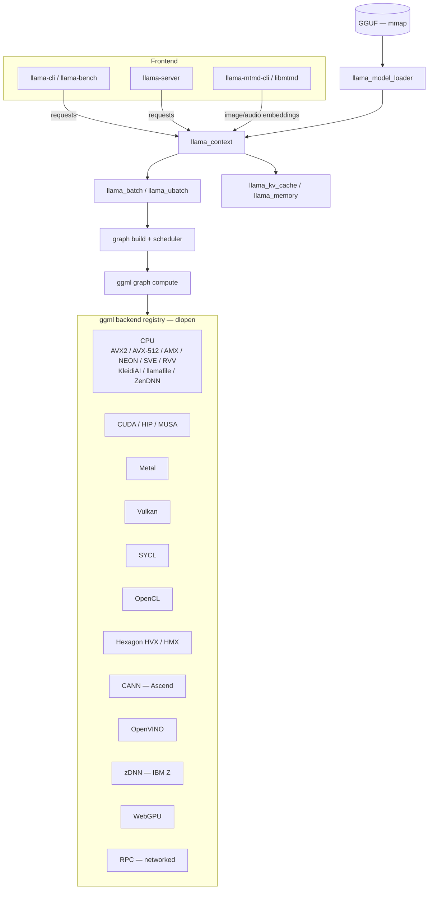
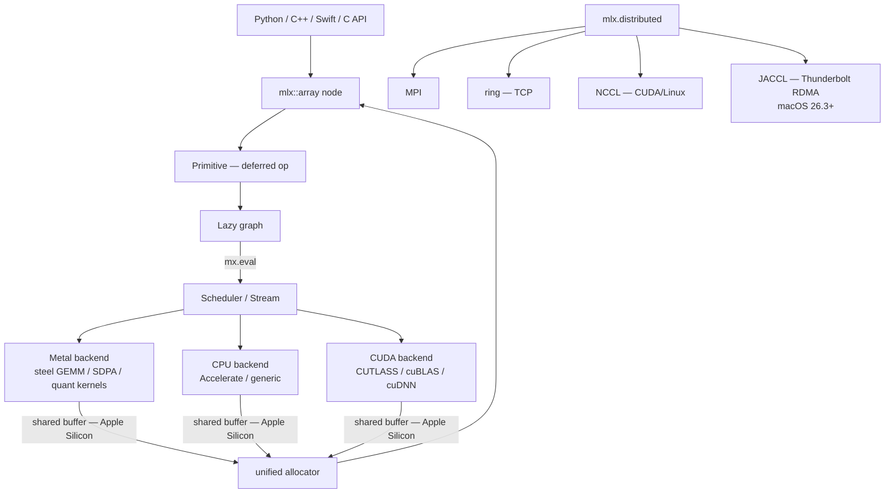
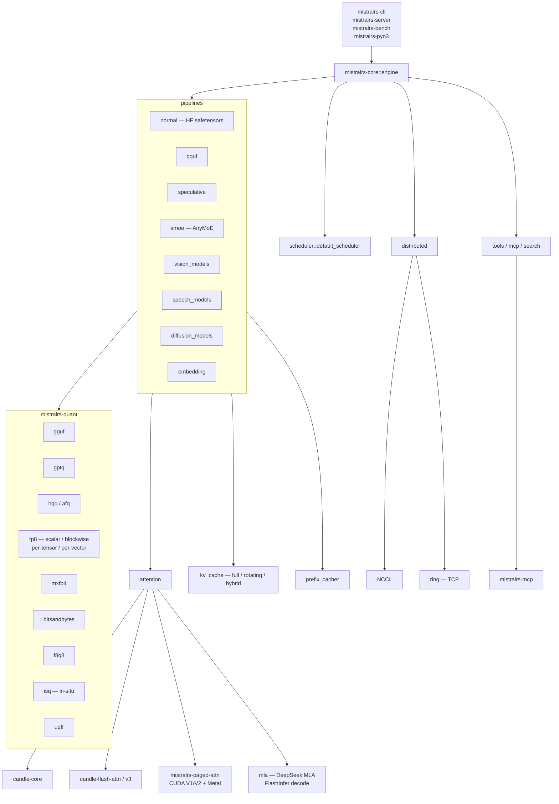

# Edge Inference: llama.cpp, MLX, and mistral.rs

**After reading this chapter, the reader will be able to:**

- Explain why a portable, backend-agnostic engine (llama.cpp) and a framework-native engine (MLX) make different trade-offs than cluster engines like vLLM
- Describe llama.cpp's ggml backend registry (dlopen), GGUF format properties, and the kernel specialization matrix across CPU ISAs, CUDA, Metal, Vulkan, Hexagon, and more
- Describe MLX's unified-memory lazy-graph model and why it makes Apple Silicon a peer-class inference target
- Describe mistral.rs's format-agnostic loader, In-Situ Quantization (ISQ), per-layer topology, and AnyMoE
- State the hardware coverage matrix of each engine and the workloads each one is best suited for

---

The cluster engines surveyed in [§80/01–03](01-vllm.md) — vLLM, SGLang, TRT-LLM — are designed for a world where the hardware is fixed NVIDIA GPUs, the workload is multi-user, and the primary objective is throughput: requests per second per GPU-dollar. That design space rewards specialization. Fused CUDA kernels, NCCL-based tensor parallelism, block-scoped KV memory, and continuous batching are all consequences of committing to that narrow hardware target and scaling problem. The engines in this chapter make the opposite bet: **portability and reach matter more than peak throughput**. A 70B Q4\_K\_M model running at 15 tok/s on a MacBook Pro is a qualitatively different product from a 70B FP16 model serving 500 requests/second on an H100 cluster. The former fits in a laptop bag; the latter requires a data center. The engineering trade-offs that follow — binary portability, format self-description, unified memory, runtime backend discovery — are consequences of that reversed priority order.

This chapter covers the three most capable edge engines in the OSS landscape. **llama.cpp** is the canonical portable engine: a C/C++ codebase with no mandatory Python runtime, a backend registry that covers over a dozen accelerator families through dlopen, and GGUF as the de-facto interchange format for community-quantized models. **MLX** is Apple's array framework for Apple Silicon, designed from the ground up around unified memory and lazy evaluation; its Metal + Accelerate stack turns a MacBook Pro or Mac Studio into a first-class inference target without any host-to-device copies. **mistral.rs** is a Rust-native all-in-one engine: format-agnostic loader, in-situ quantization, per-layer device topology, and a built-in autotuner — the strongest Rust contender in this space and well-suited to environments where Python is unavailable.

The three engines serve distinct primary use cases that rarely overlap. llama.cpp is the choice when hardware portability is the constraint: the same binary runs on a Snapdragon NPU, an IBM mainframe, a Mac, and a Linux server. MLX is the choice when the hardware is Apple Silicon and the workflow requires the Python/NumPy API surface — research, prototyping, fine-tuning on a MacBook. mistral.rs is the choice when the deployment artifact must be a compiled binary without a Python runtime, when format flexibility (HF → GGUF → UQFF at load time) is required, or when the operational model is a single-binary edge appliance. The quantization format ecosystems are partially overlapping: llama.cpp produces and consumes GGUF; mistral.rs consumes both GGUF and HF safetensors and produces UQFF; MLX uses HF safetensors with a native quantized format and does not read or write GGUF.

These engines are not in direct competition with the cluster engines covered in the preceding chapters. A staff engineer choosing between vLLM and llama.cpp for a 64-GPU H100 deployment is not choosing correctly: vLLM is the answer. The question this chapter addresses is the other end of the deployment spectrum — the engineering decisions that arise when the hardware is heterogeneous, the model must run on hardware that CUDA does not support, or the operational constraint is a single redistributable binary with no external dependencies. Understanding both the cluster engines and the edge engines is necessary for a complete picture of the inference infrastructure landscape; many production deployments use cluster engines for high-concurrency serving and edge engines for on-device or developer-facing inference simultaneously.

---

## Part 1: llama.cpp

### 1.1 Design philosophy

llama.cpp's thesis is maximally portable inference with a single file format. The differentiator is not throughput on H100 — it is **reach**: the same GGUF weights run on a Mac laptop's Metal GPU, an Android phone's Hexagon NPU, a Jetson Orin, a Linux desktop with Vulkan, an AMD ROCm box, an Ascend NPU, an Intel Arc GPU via SYCL, an IBM zSystems mainframe via zDNN, and a CPU-only server with AVX2/AVX-512/AMX/NEON/SVE/RVV, all from the same binary. The engine and the file format are co-designed: GGUF is mmap-friendly, self-describing, tokenizer-inclusive, and the community distribution format for every major quantization variant. Adding a new accelerator means implementing the ggml backend interface and per-quant-type kernels; graph construction, KV management, batching, and the server are all inherited.

The architecture can be summarized as a stack of three separable layers: the **ggml tensor library** (backends, kernel dispatch, graph compute), the **model layer** (`src/`, which builds per-architecture compute graphs and manages KV cache), and the **serving layer** (`tools/server/`, which handles HTTP, continuous batching, and multimodal preprocessing). Each layer has a clearly defined interface to the next.

The model layer (`src/`) handles architecture-specific graph construction in `llama-model.cpp`. Each supported architecture (Llama, Mistral, Falcon, StarCoder, GPT-2, Phi, Gemma, DeepSeek, Qwen, MiniCPM, etc.) is a case in the architecture dispatch table; the model builder constructs a `ggml_cgraph` using the per-step input tokens and the current KV state. This separation means adding a new model architecture does not require modifying any backend — the new architecture simply adds a new graph builder in `llama-model.cpp` that calls the same ggml ops the existing architectures use. The KV cache (`llama-kv-cache.cpp`) supports full dense attention, sliding-window (hybrid architectures), and recurrent state caches for Mamba and SSM-based layers.



### 1.2 ggml backend registry

The abstraction that makes the hardware matrix possible is the **ggml backend interface**, declared in `ggml/include/ggml-backend.h`. Every backend must implement three operations on a `ggml_backend_t` handle: `get_name` (identifies the backend for logging and device selection), `get_buffer_type` (allocates device-local tensor buffers), and `graph_compute` (executes a compiled `ggml_cgraph`). The interface is intentionally minimal; graph construction, shape inference, and quantized tensor storage are all backend-agnostic.

`ggml/src/ggml-backend-reg.cpp` implements the backend registry. Backends are discovered and loaded via `dlopen` at runtime — no recompile is needed to add or remove a backend. A process startup scan finds shared libraries matching the backend naming convention, calls each library's registration entry point, and populates a global `ggml_backend_reg_t` table. Model code selects a backend by name or capability mask; if no GPU backend is available, the CPU backend is the automatic fallback. The dlopen design means a single distributed binary (e.g., a wheel or APK) can ship multiple backends and select the best one at runtime based on hardware detection.

The current backend roster:

| Backend | Source directory | Notes |
|---|---|---|
| CPU | `ggml/src/ggml-cpu/` | x86 AVX2/AVX-512/AMX; ARM NEON/SVE/dot/i8mm; RVV; POWER VSX; s390x |
| CUDA | `ggml/src/ggml-cuda/` | Compiles for HIP (ROCm) and MUSA via preprocessor shims |
| Metal | `ggml/src/ggml-metal/` | Apple Silicon; JIT-compiled MSL |
| Vulkan | `ggml/src/ggml-vulkan/` | Cross-platform GPU |
| SYCL | `ggml/src/ggml-sycl/` | Intel Arc, Intel Data Center GPU |
| OpenCL | `ggml/src/ggml-opencl/` | Broad GPU coverage |
| Hexagon | `ggml/src/ggml-hexagon/` | Snapdragon HVX (vector DSP) and HMX (matrix) NPU |
| CANN | `ggml/src/ggml-cann/` | Huawei Ascend NPU |
| OpenVINO | `ggml/src/ggml-openvino/` | Intel inference runtime |
| zDNN | `ggml/src/ggml-zdnn/` | IBM z/OS neural network library |
| ZenDNN | `ggml/src/ggml-zendnn/` | AMD CPU deep-learning library |
| WebGPU | `ggml/src/ggml-webgpu/` | Browser and WASM targets |
| RPC | `ggml/src/ggml-rpc/` | Networked backend: serve tensors from a remote process |

The CPU backend contains the most differentiated kernel tree. Under `ggml/src/ggml-cpu/`:

- **`arch/`** — per-ISA kernel implementations. x86 paths include AVX2 dot-product loops, AVX-512 variants with VNNI (integer dot), VBMI (byte permute), and BF16 accumulation, and AMX-INT8/AMX-BF16 tile kernels for SPR and EMR. ARM paths include NEON (4×4 byte GEMM), SVE (scalable vector), the `dotprod` extension (UDOT/SDOT), and `i8mm` (FEAT\_I8MM, 8×8 signed GEMM). RISC-V uses RVV (v1.0); POWER uses VSX; s390x is present for IBM Z CPU-side ops when zDNN is unavailable.
- **`kleidiai/`** — integration of Arm's [KleidiAI](https://gitlab.arm.com/kleidi/kleidiai) library, which ships hand-tuned Q4\_0 GEMM microkernels for Neoverse V2 and Cortex-X4. KleidiAI is updated independently of llama.cpp and provides silicon-specific tuning for modern Arm server and mobile cores.
- **`amx/`** — Intel AMX tile kernels. AMX introduces a 2D register tile abstraction (`TMUL`, `TDPBSSD`, `TDPBF16PS`) operating on 16×64-byte tiles; the kernels here map Q4/Q8 quantized GEMM onto tile ops for the INT8 and BF16 accumulation paths.
- **`llamafile/`** — high-performance SGEMM kernels imported from Mozilla's llamafile project. These are the fallback FP32 matmul path on CPUs without specialized quant acceleration and are used by ktransformers as well (see §80/10).
- **`hbm.cpp`** — a High Bandwidth Memory-aware allocator that preferentially places weight tensors in the HBM pool on Xeon Max (Sapphire Rapids HBM) processors, avoiding the DDR5 bandwidth cap on CPU-bound decodes.
- **`repack.cpp`** — runtime weight repacking. Some ISA-specific kernels require a different physical memory layout than the standard ggml block-quant layout (e.g., block-interleaved Q4\_0 for AVX-512 dot-product). Repacking happens once at model load and is cached.

The CUDA backend (`ggml/src/ggml-cuda/`) is shared across CUDA, HIP, and MUSA via preprocessor shims. Key files include `fattn.cu`/`fattn-mma-f16.cuh`/`fattn-tile.cu`/`fattn-vec.cuh` — hand-written FlashAttention variants covering the full-attention and decode-mode paths — and `mmq.cu`/`mmqf.cu`, which implement fused dequantize-and-multiply (matrix-multiply-quantized) kernels for each quantization type. The `mma.cuh` header wraps `mma.m16n8k16` PTX instructions for the tensor-core paths. The Metal backend (`ggml/src/ggml-metal/`) ships a single `ggml-metal.metal` file containing all kernels, JIT-compiled at first use; Apple's MPS Graph is not used — llama.cpp ships its own kernels for every quant type and FlashAttention variant.

**ggml graph compute model.** When `llama-model.cpp` builds a per-step compute graph, it constructs a `ggml_cgraph` — a directed acyclic graph of `ggml_tensor` nodes where each node records its op type, operand pointers, and backend assignment. The scheduler in `ggml-backend.cpp` walks the graph in topological order, assigns each node to a backend based on the tensor's buffer type, and calls `graph_compute` on each backend for its assigned subgraph. Cross-backend data transfers (e.g., a tensor computed on GPU needed by a CPU node) are handled by `ggml_backend_tensor_copy`, which dispatches to the appropriate copy primitive for the (src, dst) backend pair. This architecture makes hybrid graphs — some layers on GPU, some on CPU (the `--split-mode` feature) — a natural consequence of the backend assignment, not a special case.

**RPC backend.** `ggml-rpc` enables a use case unique among edge engines: serving a model that does not fit in any single machine's memory by distributing tensor storage across multiple machines on a network. The RPC backend exposes a remote machine as a `ggml_backend_t`; tensors assigned to it are stored in the remote process's memory and operated on by remote `graph_compute` calls over a TCP socket. The local process holds only the tensors assigned to local backends; at each compute step, the scheduler sends the RPC backend its subgraph and operand buffers, waits for the result, and continues. This is not tensor parallelism — there is no NCCL all-reduce; compute for RPC-assigned layers is sequential with local layers — but it enables, for example, a 70B model to be split across two 32 GB Mac Minis with no code changes, using only `--rpc server1:50052 --split-mode layer`.

### 1.3 GGUF format

GGUF (GPT-Generated Unified Format) replaced the older GGML container format and has become the de-facto interchange format for community-quantized LLMs. Its key properties:

**Single-file, mmap-able.** A GGUF file contains the model architecture configuration, tokenizer vocabulary and merge rules, RoPE scaling parameters, quantization metadata, and all weight tensors in a single binary. The data region is `mmap`'d at load time; weights are never copied to the heap unless a backend requires a device upload. Cold start time is bounded by storage bandwidth (typically 2–10 seconds for a 70B model from NVMe) rather than heap allocation or a separate config-loading step. The contrast with the HF safetensors ecosystem is significant: a safetensors model requires `config.json`, `tokenizer.json`, `tokenizer_config.json`, and potentially a `model.safetensors.index.json` shard manifest alongside the weight files. GGUF collapses all of this into one binary, making model distribution simpler and reducing the surface for version mismatch.

**On-disk layout.** The GGUF file begins with a 4-byte magic (`GGUF`), a 4-byte version number, and counts for the number of tensors and metadata key-value pairs. The metadata section follows as a sequence of key-value entries; values can be scalars, strings, arrays, and nested types. The tensor table follows: each entry records the tensor name (a length-prefixed UTF-8 string), the number of dimensions and their sizes, the `ggml_type` enum, and the byte offset into the data section. The data section is page-aligned, so mmap on any 4096-byte-aligned OS produces valid tensor pointers directly. The Python authoring tools live in `gguf-py/gguf/` (`gguf_writer.py`, `gguf_reader.py`) and are sufficient for writing custom GGUF files programmatically.

**Self-describing tensor table.** Each tensor record in the GGUF header carries its name, `ggml_type` (the quantization format enum), shape, and byte offset. No separate `config.json` or `model.safetensors.index.json` is needed at runtime. The model loader (`src/llama-model.cpp`) reads the tensor table directly and constructs the compute graph using tensor names as keys.

**Tokenizer-in-file.** SentencePiece (BPE/unigram), WordPiece, and custom BPE vocabularies are serialized into the GGUF metadata section along with merge tables, special token IDs, and chat templates. `convert_hf_to_gguf.py` is the canonical Hugging Face→GGUF bridge; it handles architecture detection, vocab extraction, and per-tensor type assignment. The conversion script supports over 60 model architectures as of HEAD; each architecture maps its parameter names to canonical GGUF tensor names so the runtime can load models from any HF checkpoint with a single code path.

**Per-tensor quantization tags.** Each tensor independently records its `ggml_type`. A single GGUF file can therefore mix formats: the `_M` quantization recipes (e.g., Q4\_K\_M) encode the convention that attention norms and output projection use Q6\_K while feed-forward body tensors use Q4\_K, without needing a separate manifest. This means a GGUF file can be partially re-quantized — replacing a subset of tensors with a different format — by rewriting only those tensor records and updating the data region, without touching the metadata or tokenizer sections.

**Forward-compatible metadata.** The GGUF metadata is a key-value store. New architecture parameters — RoPE-yarn scaling factors, MLA projection shapes, MoE expert layout, sliding-window context lengths — are added as new keys without breaking existing readers that ignore unknown keys. This is what makes day-0 GGUF support for a new architecture tractable: the converter adds new keys; old runtime versions silently skip them and fall back to defaults.

The Python authoring and reading tools in `gguf-py/gguf/` (`gguf_writer.py`, `gguf_reader.py`) are sufficient for writing custom GGUF files programmatically — for example, to package a custom architecture or a non-HF model checkpoint. The `gguf_writer.py` API follows a builder pattern: open a writer, add metadata keys (architecture, context length, RoPE base, etc.), add tensor entries with name/data/type, and close to flush the binary. The resulting file is directly loadable by any GGUF-compatible runtime, including llama.cpp, mistral.rs (via its GGUF loader), and the HF `gguf` Python library.

GGUF versioning is backward-compatible by design. Version 1 (the original) had a bug in array-type metadata handling; version 2 fixed this. Version 3 (the current production format) added a `general.file_type` integer field for the "ftype" shorthand. Readers check the version field in the header and reject files with a version number they do not understand, so old readers will never silently misparse new files — they will fail explicitly.

### 1.4 Quantization formats

`ggml/include/ggml.h` defines `enum ggml_type`; the full live list spans several families:

**Float types.** `F32`, `F16`, `BF16`, `F64` — used for norm parameters, output projections, and full-precision serving.

**K-quants** (the standard deployable formats). `Q2_K`, `Q3_K`, `Q4_K`, `Q5_K`, `Q6_K`, `Q8_K`. The K-quant scheme stores weights in blocks of 256 values with a block-wise scale and a super-block scale; this two-level scaling achieves the target bits-per-weight (bpw) on average while using higher precision (F16 or Q8) for the scale factors themselves. The `_M`/`_S` recipe variants mix quant types across tensor classes: Q4\_K\_M uses Q6\_K for the attention value projections and output weights (higher sensitivity) and Q4\_K for feed-forward tensors, achieving a practical mean of ~4.8 bpw on a Llama 3.1 70B.

A K-quant block of width $B = 256$ stores weights $w_i$ as

$$w_i \;\approx\; s_\text{super} \cdot s_\text{block} \cdot q_i, \qquad q_i \in \{0, 1, \ldots, 2^k - 1\},$$

where $s_\text{super}$ is shared across a group of blocks and $s_\text{block}$ is per-block. Both scales are stored in higher precision (typically F16 or Q8\_0), so the effective bits-per-weight for the body is $k$ but the overhead of scale storage adds $\approx 0.2\text{–}0.5$ bpw depending on block size.

**Legacy block-quants.** `Q4_0`, `Q4_1`, `Q5_0`, `Q5_1`, `Q8_0`, `Q8_1` — the original formats from the GGML era. Still widely supported and used as fallback paths where K-quant decode kernels are not available.

**IQ-quants** (importance-matrix-aware, sub-4-bit). `IQ1_S`, `IQ1_M`, `IQ2_XXS`, `IQ2_XS`, `IQ2_S`, `IQ3_XXS`, `IQ3_S`, `IQ4_NL`, `IQ4_XS`. These use a calibration step (`tools/imatrix/`) that computes per-weight activation magnitudes on a small calibration corpus; the resulting importance matrix guides quantization to allocate more precision to high-activation weights. IQ-quants enable sub-2 bpw 70B models on a 24 GB GPU. They require the imatrix file at quantization time but not at inference time.

**Ternary quants.** `TQ1_0`, `TQ2_0` — BitNet-style 1.58-bit weights. Intended for models trained with ternary-aware quantization (BitNet b1.58); applying them to standard dense models produces significant quality loss.

**Microscaling FP.** `GGML_TYPE_MXFP4` (type index 39, OCP MX standard) and `GGML_TYPE_NVFP4` (type index 40, Blackwell-native E4M3 group scales). Added to track the emerging hardware-native low-bit float formats; NVFP4 aligns with NVIDIA Blackwell's native FP4 tensor core format.

**One-bit.** `GGML_TYPE_Q1_0` (type index 41) — single-bit binary weights with a per-block scale. The most extreme memory compression option.

The following table summarizes the practical trade-off between formats for a representative 70B-class model (parameter count ~70B, embedding dim 8192, 80 layers):

| Format | Nominal bpw | Approx. 70B VRAM | Typical perplexity vs F16 | Common use case |
|---|---|---|---|---|
| F16 | 16.0 | ~140 GB | baseline | Reference / eval |
| BF16 | 16.0 | ~140 GB | ~0.0 | Training compat |
| Q8\_0 | 8.5 | ~75 GB | ~0.01 | Near-lossless |
| Q6\_K | 6.6 | ~58 GB | ~0.05 | High quality |
| Q5\_K\_M | 5.7 | ~50 GB | ~0.1 | Quality/size |
| Q4\_K\_M | 4.8 | ~42 GB | ~0.15 | Community default |
| Q3\_K\_M | 3.9 | ~34 GB | ~0.3 | Compressed |
| Q2\_K | 3.4 | ~30 GB | ~0.8 | Highly compressed |
| IQ4\_XS | 4.3 | ~38 GB | ~0.1 | imatrix-calibrated |
| IQ2\_XXS | 2.1 | ~18 GB | ~0.6 | Sub-2bpw, 24 GB GPU |
| TQ2\_0 | 1.7 | ~15 GB | model-dependent | BitNet-trained only |

For models that fit the K-quant sweet spot, Q4\_K\_M is the community standard: it achieves perplexity within ~0.1–0.2 points of F16 on standard benchmarks at ~4.8 bpw, compared to F16's 16 bpw — roughly a 3.3× memory reduction. A 70B F16 model requires ~140 GB; Q4\_K\_M brings it to ~42 GB, fitting in a single 48 GB GPU or a 64 GB Mac Studio. For users with a 24 GB GPU (RTX 4090, A5000), IQ2\_XXS enables serving a 70B model that would otherwise require ~6× more VRAM, at significant but sometimes acceptable quality cost. See [§10/04](../10-engine-core/04-quantization.md) for the general treatment of post-training quantization; the ggml type system is the deployment-side representation of the formats described there.

### 1.5 llama-server

`tools/server/server.cpp` is the production-facing binary. It exposes both OpenAI Chat Completions / Responses / Embeddings / Reranking and the Anthropic Messages API on the same port. The server supports continuous batching with multi-user parallel decoding, schema-constrained JSON generation via `llguidance` (the constrained-decoding library also used in TRT-LLM and OpenAI's structured outputs), and tool/function calling for arbitrary models via `server-tools.cpp`. Multimodal inputs (image and audio) are handled through `libmtmd` and `clip.cpp`, which wrap vision/audio projectors loaded as separate `mmproj-*.gguf` files. Speculative decoding is available in three modes: draft-model, n-gram cache (externally loadable statistics), and self-speculative n-gram map (searches the token history for the current n-gram suffix). These modes can be mixed within a single server instance — for example, using the n-gram cache as the cheap default and escalating to a draft model on cache miss. The server also supports live model swap via `POST /models?reload=1`, reloading weights without process restart — useful for hot-swap A/B testing on a developer laptop.

The server's source is organized as `server.cpp` (main HTTP handler loop), `server-context.cpp` (per-request state), `server-queue.cpp` (task queue for continuous batching), `server-task.cpp` (individual inference task), `server-models.cpp` (model registry for multi-model serving), and `server-tools.cpp` (tool/function calling dispatch). A Svelte-based WebUI lives in `tools/server/webui/` and is served as static assets from the binary. The server embeds httplib for the HTTP layer; there is no external web framework dependency.

Prefix caching in `llama-server` reuses KV entries from prior requests that share a common prompt prefix. The implementation tracks a prompt hash cache keyed by the token sequence; when a new request arrives with a matching prefix, the corresponding KV slots are reused rather than recomputed. This is particularly effective for system-prompt-heavy deployments where the same system prompt heads every request.

### 1.6 Multimodal: libmtmd and clip.cpp

Multimodal support in llama.cpp is handled through `tools/mtmd/` — the `libmtmd` library. Vision-language models are split into two GGUF files: the main LLM (`model.gguf`) and the multimodal projector (`mmproj-*.gguf`). The projector is typically a CLIP vision encoder or audio encoder whose output is projected into the LLM's embedding dimension. At runtime:

1. The image or audio is preprocessed by `clip.cpp` / `clip-model.h`, which wraps the vision/audio encoder as a separate `ggml` graph.
2. The encoder runs on the same backend as the main model (Metal, CUDA, CPU, etc.) and produces a sequence of patch embeddings.
3. The patch embeddings are injected into the LLM's token stream at the `[IMAGE]` placeholder position, and the LLM forward pass proceeds normally.

The split-file approach keeps the main LLM GGUF generic (unchanged for multimodal use) and allows the projector to be swapped independently — for example, using a higher-quality vision encoder without re-quantizing the LLM. Model families with `llama.cpp` multimodal support include LLaVA variants, MiniCPM-V/O, Gemma 3 Vision, GLM-Edge, Granite-Vision, and DeepSeek-OCR, among others. The `libmtmd` layer handles the preprocessing and injection; from `llama_context`'s perspective, multimodal inputs look like extra embedding tokens.

### 1.7 Speculative decoding in llama-server

Speculative decoding in llama.cpp is implemented in `tools/server/` and is the most complete speculative decoding implementation among edge engines. Four modes are supported:

**Draft model** (`--speculative-model`): the classic small-model draft + target verify approach. A small draft model (e.g., Llama-3.2-1B or a distilled 1B drafter) proposes $k$ candidate tokens; the target model verifies all $k$ in a single parallel forward pass. Accepted tokens are committed; the first rejected token resets the draft. The speedup is $\frac{1 + \alpha k}{1 + \frac{1}{r}}$ approximately, where $\alpha$ is the acceptance rate and $r$ is the draft/target token throughput ratio. On a MacBook Pro M4 Max with a 70B Q4\_K\_M target and a 1B drafter, draft latency is negligible relative to the 70B forward pass, so the speedup is primarily acceptance-rate-limited.

**N-gram cache** (`--lookup-ngram-min`): a table of $(n\text{-gram} \to \text{next token})$ statistics loaded from an external file (built by scanning a reference corpus). On cache hit, the next $k$ tokens are proposed at zero inference cost — faster than draft model for repetitive domains (code, structured text) where n-gram statistics are high-precision. The n-gram cache and draft model can be used simultaneously: the server consults the n-gram cache first and falls back to the draft model on miss.

**Self-speculative n-gram map** (`--lookup-ngram-simple`, `--lookup-ngram-map-k`): searches the *token history of the current request* for the current n-gram suffix and proposes the $m$ tokens that followed in the history. Effective for code-rewriting and long-document editing workloads where the model is likely to reproduce a previously-generated passage. Requires no external corpus or draft model — the speculative candidates come from the current sequence's own context window.

The speculative decoding infrastructure in `server.cpp` routes each incoming request to the appropriate speculative path based on server configuration, and the verification step uses the same `llama_decode` path as non-speculative inference, meaning the verification quality is identical to running the target model directly.

### 1.8 Hexagon backend: on-device NPU inference

The Hexagon backend (`ggml/src/ggml-hexagon/`) deserves special attention because it represents a qualitatively different deployment target from any other backend in the matrix. Qualcomm's Hexagon DSP contains two distinct compute units: the HVX (Hexagon Vector eXtensions), a 1024-bit SIMD vector unit for general DSP and elementwise ops, and the HMX (Hexagon Matrix eXtensions), a dedicated matrix multiply unit for neural network workloads. HMX is the primary unit for GEMM-class operations; the HEAD commit message ("Hexagon: Process M-tail rows on HMX instead of HVX") reflects active work on the tail-handling path where the output matrix dimensions are not multiples of the HMX tile size.

Running LLM inference on Hexagon instead of the Snapdragon GPU (Adreno) trades raw throughput for power efficiency and background execution. Hexagon is accessible when the GPU is claimed by the display or camera pipeline; it runs at lower power than Adreno; and on Snapdragon X Elite it has dedicated LPDDR5X bandwidth that is not shared with the CPU or GPU. For always-on assistant workloads on a laptop or phone — short queries at low throughput — Hexagon is the right accelerator even when a GPU is available. llama.cpp is the first major OSS engine to support Hexagon HVX/HMX for LLM inference.

### 1.9 Walsh–Hadamard KV rotation

A recent focus area in llama.cpp that connects to broader KV quantization research is Walsh–Hadamard rotation of the KV tensors before quantization. The motivation (parallel to QuaRot [Ashkboos et al., 2024] and SpinQuant [Liu et al., 2024]) is that raw key and value activations have outlier channels — individual head dimensions with significantly larger magnitude than the median — that cause standard block-quant methods to waste bits on the outlier and underutilize bits on the normal channels.

The Hadamard transform $H \in \{-1/\sqrt{d}, +1/\sqrt{d}\}^{d \times d}$ rotates the $d$-dimensional KV vectors so that the outlier energy is spread evenly across all dimensions. Formally, if $k \in \mathbb{R}^d$ is a key vector, the rotated key is $k' = H k$; quantizing $k'$ to $b$ bits has lower reconstruction error than quantizing $k$ directly, because the max-to-median ratio of $k'$ is $O(1)$ while that of $k$ can be $O(\sqrt{d})$ in the worst case.

In llama.cpp, the Hadamard pre-rotation is applied at KV write time (inserting a `GGML_OP_HADAMARD` before the cache write) and the inverse rotation is applied before attention. The overhead is a $O(d \log d)$ butterfly operation per head per token — negligible relative to the GEMM cost. The benefit is 0.5–1.5 bpw reduction in KV quantization at equal perplexity, which at 32K context and 80 layers translates to meaningful memory savings. See [§30-kv-cache](../30-kv-cache/) for the broader treatment of KV compression.

### 1.10 Notable trade-offs

The following are deliberate design choices, not deficiencies:

**No paged attention.** llama.cpp uses a contiguous KV cache per sequence, managed in `llama-kv-cache.cpp`. Slot management is simpler than vLLM's block manager (see [§10/02](../10-engine-core/02-paged-kv-memory.md)), requires less per-sequence overhead, and is significantly easier to port across 13+ backends. The trade-off is lower throughput at high concurrency: contiguous per-sequence allocation leads to internal fragmentation at mixed sequence lengths and cannot reassign memory between sequences mid-flight. For the primary llama.cpp workload — a single user or small team on a developer machine — this is immaterial.

**No tensor parallelism.** Multi-GPU support is layer-pipeline-based (`--split-mode layer` or `row`); there is no NCCL-style collective and no intra-layer TP. The `ggml-rpc` backend allows multiple machines to combine memory by serving tensors over the network, enabling an oversized model to span two machines, but this is not a TP fabric — it does not reduce per-layer latency the way NCCL TP does. This is the right trade-off for the target deployment: a two-GPU desktop or a Mac + Jetson pair, not a 8×H100 node.

**mmap'd weights, page-cache-friendly.** No heap copy at load time; the kernel's page cache is the working set. On a machine with sufficient RAM, a second process launch of the same model is nearly instant from warm page cache.

**Massive backend matrix is the architecture lever.** The separation between graph construction (backend-agnostic) and graph execution (backend-specific) means that adding z/DNN, Ascend CANN, Hexagon NPU, or SpacemiT RVV requires only a new backend implementation and per-quant kernel set — the KV manager, server, and model graph code are unchanged. This is a more productive portability strategy than maintaining per-accelerator forks.

**The abstraction cost.** The ggml backend interface is intentionally minimal, which means backends cannot express backend-specific scheduling optimizations that require coordination above the single `graph_compute` call. TRT-LLM's CUDA graph capture, vLLM's FlashInfer token-batching, and MLX's lazy fusion are all above-graph optimizations that ggml's per-call interface cannot accommodate without backend-specific extensions. For the target workload (sequential single-user inference on edge hardware), this limitation is immaterial; for high-throughput multi-user server inference, it is one reason llama.cpp lags the cluster engines on TPOT at high concurrency.

### 1.11 Hardware coverage summary

The following matrix shows the accelerator classes llama.cpp supports, organized by the primary use case each backend serves in production:

| Hardware class | Backend | Primary driver | Representative hardware |
|---|---|---|---|
| x86 server/desktop CPU | CPU (AVX2/AVX-512/AMX) | ggml-cpu `arch/` | Intel Xeon SPR/EMR, AMD EPYC Zen4 |
| x86 HBM CPU | CPU (hbm.cpp) | `ggml-cpu/hbm.cpp` | Intel Xeon Max (SPR-HBM) |
| Arm server CPU | CPU (NEON/SVE/i8mm/KleidiAI) | ggml-cpu + kleidiai | AWS Graviton 3/4, Neoverse V2 |
| Arm mobile CPU | CPU (NEON/dot) | ggml-cpu `arch/` | Snapdragon 8 Gen 3 (CPU) |
| Snapdragon NPU | Hexagon HVX/HMX | `ggml-hexagon` | Snapdragon 8 Gen 3 / X Elite |
| RISC-V | CPU (RVV) | ggml-cpu + spacemit | SpacemiT X60 |
| POWER | CPU (VSX) | ggml-cpu `arch/` | IBM POWER10 |
| IBM Z (CPU) | zDNN | `ggml-zdnn` | IBM z16 |
| AMD CPU | ZenDNN | `ggml-zendnn` | AMD EPYC (Zen-family) |
| NVIDIA GPU | CUDA | `ggml-cuda` | H100, A100, RTX series |
| AMD GPU | HIP (ROCm) | `ggml-cuda` (shim) | MI300X, RX 7900 XTX |
| Moore Threads GPU | MUSA | `ggml-cuda` (shim) | MTT S80 |
| Apple Silicon | Metal | `ggml-metal` | M1–M4 Ultra |
| Intel Arc / Data Center | SYCL | `ggml-sycl` | Arc A770, Gaudi |
| Cross-platform GPU | Vulkan | `ggml-vulkan` | Any Vulkan-capable GPU |
| Intel inference runtime | OpenVINO | `ggml-openvino` | CPU/GPU/VPU via OpenVINO |
| Huawei NPU | CANN | `ggml-cann` | Ascend 910 |
| Browser/WASM | WebGPU | `ggml-webgpu` | WebGPU-capable browsers |
| Multi-machine | RPC | `ggml-rpc` | Any network-connected host |

---

## Part 2: MLX

### 2.1 What makes Apple Silicon a peer-class inference target

Apple Silicon (M3 Pro through M4 Ultra) integrates CPU cores, GPU cores, and the Apple Neural Engine on a single die sharing a unified LPDDR5X memory pool. There is no host-to-device memory copy boundary — the CPU and GPU read the same physical bytes. This is the architectural fact that makes Apple Silicon a peer inference target rather than a curio. For a 70B Q4\_K\_M model:

- Weight tensors occupy ~42 GB of the unified pool
- KV cache growth over a long decode sequence lives in the same pool, not across a PCIe bus
- CPU ops (e.g., tokenizer, sampling) and GPU ops (attention, GEMM) share buffers with only a memory fence as synchronization cost

On NVIDIA hardware, by contrast, even a GPU with 80 GB of HBM has a 64 GB/s PCIe 4.0 bus to the host. Every host↔device copy is a latency hit. For the KV cache, which grows with each decode step, unified memory eliminates what would otherwise be a recurring bandwidth tax. An M4 Ultra with 192 GB unified memory and ~800 GB/s memory bandwidth is a fundamentally different machine for inference than the PCIe-connected paradigm assumes.

MLX is Apple's framework that makes this architectural advantage directly programmable, without requiring the user to manage Metal memory explicitly.

To make this concrete with numbers: the M4 Ultra has 192 GB of LPDDR5X at ~800 GB/s aggregate bandwidth (Apple's figure; die-to-memory bandwidth, not PCIe-limited). An H100 SXM has 80 GB of HBM3 at ~3.35 TB/s, but the H100's host system connects via PCIe 5.0 at 128 GB/s. For an inference workload where the KV cache must grow from 0 to 32K tokens during a single request, the KV writes are ~$2 \times \text{layers} \times n_{kv\_heads} \times d_h \times T \times \text{dtype\_bytes}$. For a Llama 3.1 70B (80 layers, 8 KV heads via GQA, head dim 128, BF16): each new token adds $2 \times 80 \times 8 \times 128 \times 2 = 327{,}680\ \text{bytes} \approx 0.32\ \text{MB}$. At 32K tokens the KV cache is $0.32\ \text{MB} \times 32{,}768 \approx 10.5\ \text{GB}$. On H100, all 10.5 GB are in HBM — no PCIe transfer needed since the KV cache never leaves the GPU. On a Mac Studio M4 Ultra, the same 10.5 GB is in the same unified LPDDR5X pool as the weight tensors; the CPU and GPU both access it at 800 GB/s. The comparison is not H100 vs M4 Ultra for throughput (H100 wins at scale) — it is whether the M4 Ultra is a viable single-node inference target for large models at practical context lengths, and the answer is yes: ~10.5 GB KV + 42 GB weights ≈ 52.5 GB, fitting in 192 GB with ample headroom for multiple concurrent contexts.

### 2.2 Lazy graph and unified memory

MLX has two distinctive architectural properties that set it apart from both PyTorch and llama.cpp.

**Lazy evaluation.** Every `mlx.array` operation returns a node in a deferred computation graph — a `Primitive` object stored in an `ArrayDesc`. Computation only fires on an explicit `mx.eval()` call or when the value is consumed by a Python-land read. Between `mx.eval()` calls, the scheduler (`mlx/compile.cpp`) can fuse elementwise operations, reorder independent ops to maximize pipeline utilization, and select tile sizes before emitting Metal kernels. The model is the same shape-static dynamic graph as PyTorch (no `tf.function`-style retracing on shape change), but the deferred commit gives the runtime fusion opportunities that eager mode would miss. This is similar in spirit to JAX's tracing model but without requiring an explicit `@jit` annotation on every hot path.

**Unified memory.** An `mlx::array` is backed by a `mlx::allocator::Buffer` allocated from Metal's shared memory region. A CPU primitive and a Metal primitive operating on the same array read the same physical bytes; the synchronization primitive is a `metal::fence`, not a `cudaMemcpy`. The allocator (`mlx/backend/metal/allocator.cpp`) manages a pool of Metal-shared buffers and returns them to the pool rather than `free`'ing them, amortizing allocation overhead in the decode loop. The result is that mixed CPU/GPU graphs — for example, a CPU tokenizer feeding a Metal transformer — have zero copy cost at the CPU/GPU boundary.

These two combine to make the `mlx_lm.generate` call almost entirely on-die: KV cache grows in the shared pool, attention and GEMM fire Metal kernels, sampling runs on CPU, and nothing crosses a bus.

A concrete example of the fusion benefit: in a standard transformer decode step, the operations are RMSNorm → QKV projection → RoPE → attention → out projection → RMSNorm → gate/up projection → activation → down projection → residual add → sample. In PyTorch eager mode, each of these fires as a separate CUDA kernel with separate HBM reads and writes for the intermediate activations. In MLX, the sequence of `mlx.array` operations accumulates as a lazy graph; the `mx.eval()` at the sampling step fires the scheduler, which fuses the elementwise ops (RMSNorm, RoPE, activation, residual) into fewer kernel dispatches and tiles the remaining GEMM/SDPA across the M-series GPU's SIMD groups. The reduction in kernel launch overhead and intermediate-activation HBM traffic is the practical source of MLX's throughput advantage over llama.cpp's Metal path on the same hardware.

### 2.3 Backend matrix



**Metal (primary, Apple Silicon).** The `mlx/backend/metal/` directory contains the production path. `kernels/steel/` holds the "Steel" macroblock GEMM and attention kernel generator — parameterized Metal Shading Language templates that generate high-performance tile loops for the M-series GPU's SIMD groups. SDPA has three variants: `sdpa_full` (full prefill attention), `sdpa_vector` (single-query decode), and `sdpa_vector_2pass` (two-pass decode for large heads), selected dynamically based on query length and head dimension. Quantized matmul kernels cover all native MLX quant formats; `fp_quantized*.metal` handles the block-wise affine cases.

**M5 NAX.** The `*_nax.metal` kernel files target Apple's Neural Accelerator introduced on M5 (announced WWDC 2025). NAX is a tile/matrix unit on the GPU side, analogous in role to AMX on the CPU side; the NAX kernels provide accelerated quantized matmul for M5 hardware while falling back to Steel on earlier chips.

**Metal (Steel GEMM detail).** The Steel GEMM generator in `mlx/backend/metal/kernels/steel/gemm/` is a parameterized C++ template that emits Metal Shading Language GEMM kernels for each (element type, block M, block N, block K, split-K) configuration. The template structure is similar to CUTLASS's tiled GEMM hierarchy: an outer loop over tiles of the output matrix, an inner loop over tiles of the K dimension, with explicit threadgroup shared memory allocation for the A and B tiles and SIMD group matrix multiply-accumulate (`simdgroup_matrix_multiply_accumulate`) for the final multiply. The split-K variant, added in 2025 for large matmul cases, partitions the K dimension across multiple threadgroups and reduces using an atomic or two-pass approach, enabling better utilization of the M-series GPU's SIMD groups at large sequence lengths.

The attention kernels in `steel/attn/` follow the same tile structure as FlashAttention-2: outer loop over query rows (parallelized across threadgroups), inner loop over KV blocks (streaming online-softmax), with the running $(m, \ell, o)$ state in registers. The `sdpa_vector_2pass` variant — used in decode when there are more KV blocks than can fit in a single pass — splits the KV dimension across multiple dispatches and merges using the log-sum-exp trick, analogous to FlashDecoding's split-KV approach (see [§10/01](../10-engine-core/01-attention-kernels.md)).

**CUDA (added 2025, Linux-only).** `mlx/backend/cuda/` was added to allow MLX models to be trained and served on NVIDIA hardware without rewriting in PyTorch. The backend uses CUTLASS for GEMM, cuBLAS for standard BLAS operations, cuDNN for select ops, and custom CUDA kernels (`quantized.cu`, `arg_reduce.cu`, etc.) for MLX-specific ops. A Blackwell path is included. This positions MLX as a research-friendly alternative to JAX with first-class Apple Silicon support and a second-class but functional NVIDIA path.

**CPU.** The Accelerate framework (macOS/iOS BLAS, vDSP, BNNS) provides the CPU backend on Apple hardware; a generic fallback handles non-Apple CPU-only builds. On Apple Silicon, the CPU and Metal paths share the same `mlx::allocator::Buffer` pool, so switching a computation between CPU and Metal does not trigger any data movement — it changes only which processor reads the same bytes.

### 2.4 Quantization in mlx-lm

MLX's native quantization format is **block-wise affine quant**: each group of $g$ weights is stored as $k$-bit integers plus a per-group FP16 scale and zero-point, where $g \in \{32, 64, 128\}$ and $k \in \{2, 3, 4, 6, 8\}$. The core ops are `mx.quantize` and `mx.dequantize`; the quantized weight is stored as a packed integer array alongside the scale/zero arrays.

**QQMM (quant×quant matmul)**, added in 2025, eliminates the dequant step on both activation and weight operands. Standard quantized GEMM dequantizes the weight to FP16 before the multiply-accumulate; QQMM keeps both operands in quantized form and accumulates in higher precision, reducing memory bandwidth further on the weight-load-bound decode path.

`mlx_lm/quant/` contains the quantization toolchain:

- `awq.py` — Activation-aware Weight Quantization: scale/clip calibration using activation magnitudes, ported from the AWQ paper pipeline
- `gptq.py` — GPTQ second-order (Hessian-based) weight quantization; layerwise with lazy batch updates
- `dwq.py` — Apple's own DWQ (Distillation-based Weight Quantization): a knowledge-distillation-guided post-training quantization that uses a teacher signal from the full-precision model during calibration, rather than pure reconstruction error

All three methods output mlx-lm's native safetensors-based quantized format; there is no GGUF runtime in mlx-lm. Conversion goes through Hugging Face safetensors, and `mlx_lm.convert` handles the HF→MLX format bridge.

The MLX quantization approach differs from GGUF K-quants in the group-size handling. GGUF K-quants fix $B = 256$ and use a two-level (block + super-block) scale hierarchy. MLX uses a flat group-based scheme with $g \in \{32, 64, 128\}$ and a single scale and zero per group. The smaller group sizes (32, 64) give better per-group accuracy at the cost of higher scale overhead; for a 4-bit model with $g = 64$, the scale overhead is $16 / (4 \times 64) \approx 6\%$ of the weight storage, similar to Q4\_K. QQMM is architecturally significant because it removes the dequant bottleneck that appears in decode: at batch size 1, the model is memory-bandwidth-bound (see [§00/02](../00-foundations/02-transformer-arithmetic-roofline.md)), and dequantizing activations to FP16 before GEMM doubles the effective bandwidth cost on the activation side.

The `QuantizedKVCache` variant is noteworthy for long-context workloads. The mlx-lm cache hierarchy also includes model-specific hybrid caches for architectures with both attention and SSM layers (Mamba, Falcon-H1, Granite-Hybrid): these caches store both the $[B, n_h, T, d_h]$ attention KV and the fixed-size Mamba recurrent state in the same Python object, dispatching to the appropriate Metal kernel path per-layer. On a 64 GB Mac Studio with a 70B Q4\_K\_M model, the weight tensors consume ~42 GB of the unified pool; at context length 32K the KV cache adds $2 \times 80 \times 32768 \times 1024 \times 2 \approx 10$ GB for GQA-1 attention, leaving ~12 GB headroom. Quantizing the KV cache to 4-bit halves this to ~5 GB, extending practical context length roughly 2×.

### 2.5 Serving and distributed inference

`mlx_lm/server.py` is a threaded OpenAI-compatible HTTP server backed by `stream_generate` and `BatchGenerator` from `generate.py`. KV cache variants in `mlx_lm/models/cache.py` include `KVCache` (standard), `RotatingKVCache` (sliding-window with StreamingLLM-style attention sinks for long-context decode), `QuantizedKVCache` (KV stored in 4-bit or 8-bit affine quant to reduce the memory footprint of the KV pool), and `BatchKVCache` plus `LRUPromptCache` for multi-request batching. Hybrid caches for Mamba/Granite-Hybrid/Falcon-H1 architectures are also present, handled through model-specific cache implementations.

Distributed inference uses `mlx.distributed`, which exposes four backends:

- **MPI** — for HPC clusters with an MPI runtime
- **ring** — a custom ring all-reduce over TCP, requiring no MPI installation; suitable for multi-Mac setups on a LAN
- **NCCL** — for the CUDA backend on Linux multi-GPU nodes
- **JACCL** — Apple's JACCL (Joint Accelerator Collective Communications Library), available on macOS 26.3+, uses Thunderbolt RDMA between Mac Studios at ~80 GB/s aggregate bidirectional bandwidth. Two M4 Ultra Mac Studios connected via Thunderbolt 5 present ~384 GB of unified memory to the distributed runtime, making 400B+ parameter models tractable on consumer hardware. JACCL bandwidth is far lower than NVLink but far higher than PCIe Ethernet, making it a practical path for small multi-Mac inference clusters.

Distributed model loading is handled by `mlx_lm/utils.py::sharded_load`, which partitions tensor shards across ranks.

### 2.6 Multimodal and vision-language support

`mlx-lm` supports vision-language models through a shared model backbone convention: the vision encoder (typically a ViT variant) and the language model share the same `mlx.array`-based execution path, with a projection layer mapping vision embeddings to the language model's input space. Models supported as of HEAD include Llava, Qwen-VL, Gemma-VL, and Pixtral, among others; the Gemma 4 multimodal support added in late 2025 covers text/image/video input.

The unified memory model benefits multimodal particularly strongly. On NVIDIA hardware, a vision-language model forward pass involves: CPU decode of the image, CPU→GPU copy of pixel tensor, GPU ViT encode, result stays on GPU, GPU language model forward. On Apple Silicon with MLX, the pixel tensor produced by the CPU image decoder is a Metal-shared buffer; the Metal ViT encoder reads it without a copy; the projected embeddings are fed directly to the Metal LLM path. The entire multimodal forward pass has zero host↔device transfers.

### 2.7 Function transformations as a research tool

One of MLX's less-visible advantages for inference engineering is its first-class support for function transformations. `mlx/transforms.cpp` implements `mx.grad` (reverse-mode AD), `mx.vmap` (batched-vectorized evaluation), `mx.jvp` (forward-mode AD), and `mx.compile` (kernel fusion over a captured subgraph). These are JAX-style transformations applied to Python functions — `mx.grad(loss_fn)(params)` returns the gradient of `loss_fn` with respect to `params` without requiring the user to write a backward pass.

For inference engineering, the practical value is in `mx.compile`. Annotating a function with `@mx.compile` causes the lazy graph from the first invocation to be frozen and replayed on subsequent calls, bypassing the Python graph construction overhead. This is the MLX equivalent of `torch.compile` or `@jax.jit`, but requires no shape-static assumption — retracing happens automatically on shape change. The `mlx_lm` generate loop uses `@mx.compile` on the per-step forward function to amortize the Python dispatch cost across a decode sequence.

The `mx.vmap` transformation is used in LoRA fine-tuning (`mlx_lm/lora.py`) to vectorize gradient accumulation across the adapter parameters. The same machinery also powers `mlx_lm`'s LoRA and QLoRA training, which run on the Metal backend without a separate training framework. The ability to use inference weights for training — including with `QuantizedKVCache` during the forward pass — is a direct consequence of the unified memory model: there is no separate "training device" and "inference device."

---

## Part 3: mistral.rs

### 3.1 Design philosophy

mistral.rs is a Rust-native, format-agnostic, multimodal-first inference engine. Three distinguishing bets define its design:

1. **Format-agnostic loader.** Load Hugging Face safetensors, GGUF, or UQFF (its own format) interchangeably; ISQ (In-Situ Quantization) converts weights to a target quant at load time.
2. **One binary.** `mistralrs run`, `mistralrs serve`, `mistralrs bench`, `mistralrs tune`, `mistralrs quantize`, and `mistralrs doctor` are all subcommands of a single binary. The CLI auto-detects model architecture, chat template, the best quantization for the host, and the device map.
3. **Multimodal-first.** Text, vision, video, audio in; image and speech generation out — all handled as in-tree pipelines, not bolt-ons.

The underlying tensor library is Hugging Face's `candle` (pinned at `candle-core = "0.10.2"` in `Cargo.toml`), with `candle-flash-attn` and `candle-flash-attn-v3` for the FlashAttention paths. candle is itself a Rust tensor library with CUDA, Metal, and CPU backends; mistral.rs extends it with additional quantization formats, paged-attention kernels, and MLA decode. The relationship is similar to how TRT-LLM extends CUDA libraries — candle provides the foundation, and mistral.rs adds the inference-specific extensions on top.

The Rust implementation choice carries both benefits and costs that are worth stating explicitly. On the benefit side: memory safety without a garbage collector (relevant for long-running inference servers where Python GC pauses are a latency concern), low overhead FFI to C/CUDA/Metal without the Python wrapper layer, and a single binary deployment artifact with no Python environment management. A `mistralrs serve` deployment requires only the binary and the model weights; there is no pip install, no virtual environment, no runtime dependency on PyTorch or transformers. For edge appliances and embedded servers, this is a meaningful operational simplification.

On the cost side: Rust compile times for a workspace of this size (15+ crates, CUDA kernels compiled via `build.rs`) are measured in minutes on a fresh build; cargo feature flags for CUDA vs Metal vs CPU permutations add build-matrix complexity (a full CUDA+Metal build requires `--features cuda,metal,flash-attn-v3`); and the Rust community's ML kernel ecosystem is smaller than the CUDA/Python ecosystem, making it harder to adopt new op types (e.g., a new persistent-kernel attention variant from FlashInfer) as quickly as Python-based engines. The `mistralrs-pyo3` PyPI package exists precisely to bridge this — providing a Python API over the Rust engine so teams can integrate mistral.rs into Python workflows without committing to a full Rust build for every consumer.

### 3.2 Architecture



The workspace layout:

- **`mistralrs-core/`** — the engine. `src/engine/` handles the request loop; `src/scheduler/default_scheduler.rs` is the continuous-batching scheduler; `src/pipeline/` contains per-format loaders; `src/attention/`, `src/kv_cache/`, `src/paged_attention/`, and `src/mla/` cover the attention stack; `src/topology/` is the per-layer device/quant configuration; `src/lora/`, `src/moe/`, `src/amoe/` handle adapter and MoE variants; `src/tools/`, `src/search/`, `src/reasoning_parsers/` support agentic features; `src/speech_models/`, `src/vision_models/`, `src/diffusion_models/` are the multimodal pipelines.
- **`mistralrs-quant/`** — the quantization zoo. Covers GGUF block-quants, GPTQ, AWQ, HQQ, AFQ (Apple FastQuant), FP8 in four granularities (scalar, blockwise, per-tensor, per-vector), MXFP4, bitsandbytes NF4/FP4, F8Q8, ISQ, and UQFF. Both CUDA and Metal kernels are vendored under `metal_kernels/` and in the CUDA paths.
- **`mistralrs-paged-attn/`** — paged attention kernels. CUDA path: `pagedattention_v1_*.cu` and `pagedattention_v2_*.cu` in F16/BF16/F32; `flash_attn_sinks.cu`; vendored FlashInfer headers; MLA decode kernels (`flashinfer_mla_decode.cu`, `concat_and_cache_mla_kernel.cu`, `gather_mla_cache_kernel.cu`). Metal path: paged attention kernels for Apple Silicon. Block-level prefix caching landed in v0.8.0.
- **`mistralrs-server/`** and **`mistralrs-server-core/`** — an Axum-based OpenAI-compatible HTTP server with a built-in web UI (`mistralrs-web-chat/`).
- **`mistralrs-mcp/`** — a Model Context Protocol client for agentic tool calls over MCP transport.
- **`mistralrs-pyo3/`** — PyO3 Python bindings, published as the `mistralrs` PyPI package.
- **`mistralrs-vision/`** and **`mistralrs-audio/`** — image and audio preprocessing for the multimodal pipelines.

**Backend support.** CUDA uses candle-core's CUDA path plus custom kernels for paged attention (V1/V2), MLA decode, and FP8/MXFP4 ops; FlashAttention v2 and v3 are compiled in via the `cuda` and `flash-attn-v3` cargo features. Metal uses Metal kernels (vendored in `mistralrs-quant/metal_kernels/`) for paged attention, quantized GEMV, MXFP4 decode, and RoPE; Metal 3.1 BF16-native support landed with the Voxtral release. CPU uses Accelerate on macOS, Intel MKL on Linux x86, or the generic candle-core fallback. For distributed serving, NCCL is used on CUDA hosts; a custom ring transport over TCP (`mistralrs-core/src/distributed.rs::ring_daemon_replicator`) enables cross-machine tensor parallelism without NCCL, which is useful for Mac Studios, laptops, and air-gapped multi-node setups where installing NCCL is not practical.

### 3.3 KV cache architecture

`mistralrs-core/src/kv_cache/` implements four KV cache types:

- **Full cache** (`NormalCache`): standard $[\text{batch}, n_h, T, d_h]$ layout; the default for short-context single-user serving.
- **Rotating cache** (`RotatingCache`): sliding-window with configurable `max_size` and attention sinks; mirrors the `RotatingKVCache` in mlx-lm. The attention sink mechanism (retaining the first $k$ tokens regardless of window expiry) stabilizes perplexity at window boundaries, following the StreamingLLM approach.
- **Paged cache** (via `mistralrs-paged-attn`): block-paged KV storage with CUDA V1/V2 paged-attention kernels and Metal kernels. Block-level prefix caching landed in v0.8.0: a separate `prefix_cacher.rs` component hashes the prefix of each incoming request and reuses matching KV blocks. The CUDA decode path uses the same V1/V2 kernel structure as vLLM's original paged-attention implementation; the FlashInfer MLA decode path (`flashinfer_mla_decode.cu`) handles DeepSeek-V3-style MLA compressed KV.
- **Hybrid cache**: for architectures with both attention and SSM/Mamba layers (Jamba, Granite-Hybrid), the cache stores both the attention KV and the Mamba recurrent state in the same struct, dispatching to the appropriate path per layer.

The co-presence of paged and non-paged caches in a single binary is unusual; llama.cpp uses only contiguous caches and vLLM uses only paged. mistral.rs exposes both as runtime options, allowing the operator to choose contiguous for single-user latency-sensitive workloads and paged for multi-user throughput workloads, without changing the engine binary.

### 3.4 In-Situ Quantization (ISQ) and UQFF


**ISQ** (`mistralrs-core/src/pipeline/isq.rs`) is the mechanism that makes mistral.rs format-agnostic at the weight level. The pipeline is:

1. Load the model from HF safetensors (or existing GGUF/UQFF) into F16 weight tensors using candle
2. For each weight tensor, apply the target quantization in-memory: GGUF K-quants, HQQ (Half-Quadratic Quantization), AFQ (Apple FastQuant), FP8 (any granularity), or MXFP4
3. Optionally serialize the result as a UQFF file for reload without re-quantizing

The quantization step runs on the device the tensor will be served from (GPU quantization for GPU tensors), so the compute cost is paid once at startup. `mistralrs quantize` is the CLI command that drives ISQ and writes the UQFF output; `mistralrs doctor` checks CUDA driver/Metal availability, HF token connectivity, and model metadata sanity before ISQ begins.

**UQFF (Universal Quantized File Format)** is mistral.rs's own serialization format: HF-compatible metadata (architecture config, tokenizer, generation config) combined with mixed-precision weight tensors in the mistralrs-quant layout. A UQFF file can hold different quant types per tensor — F16 for norms and embeddings, Q4\_K\_M for attention, MXFP4 for feed-forward — in the same container. `mistralrs tune` benchmarks the host hardware (memory bandwidth, CUDA/Metal compute), estimates the throughput achievable per quant type, and emits a recommended TOML configuration that specifies the ISQ target and topology for that specific machine. The output is a hand-editable TOML, so the recommendation can be adjusted before being committed as an artifact.

A typical ISQ+UQFF workflow:

```bash
# Step 1: doctor — check CUDA driver, HF token, model metadata
mistralrs doctor --model-id meta-llama/Llama-3.1-70B-Instruct

# Step 2: tune — benchmark host, emit recommended config
mistralrs tune --model-id meta-llama/Llama-3.1-70B-Instruct \
  --output config.toml

# Step 3: quantize — load HF safetensors, ISQ to Q4_K_M, write UQFF
mistralrs quantize --config config.toml \
  --output llama-3.1-70b-q4km.uqff

# Step 4: serve — load UQFF directly (no re-quantization)
mistralrs serve --model llama-3.1-70b-q4km.uqff
```

The `tune` step is what makes this workflow distinctive. It measures memory bandwidth (GB/s), CUDA TFLOPS (INT8, FP8), and Metal throughput on the target machine, then estimates tokens/second for each available ISQ target (GGUF K-quants, HQQ, FP8 blockwise, MXFP4). The output TOML specifies not just the quant type but also whether to use paged or non-paged KV, the block size for paged-attn, and the topology file path. No other OSS edge engine exposes this level of automated pre-deployment optimization.

### 3.5 Per-layer topology

`mistralrs-core/src/topology/` implements the per-layer device and quantization assignment. The `TOPOLOGY` config maps layer index ranges to `(device, quant)` pairs. A representative example for a 32-layer model with heterogeneous GPU+CPU deployment:

```toml
[topology]
"0-2" = { device = "cuda:0", quant = "f16" }
"3-29" = { device = "cuda:0", quant = "q4_k_m" }
"30-31" = { device = "cpu", quant = "f16" }
```

This configuration keeps the first and last layers (which are generally most sensitive to quantization) in F16, quantizes the bulk of the model to Q4\_K\_M on GPU, and offloads the final layers to CPU. For MoE models, individual expert FFN layers can be pinned to CPU while the attention and routing layers remain on GPU — enabling a 671B DeepSeek-V3 to span a 48 GB GPU and 128+ GB of host RAM by placing cold experts on the CPU side, without losing the GPU's attention bandwidth advantage.

A more realistic MoE topology for DeepSeek-V3 (671B parameters, 256 experts, 61 layers) on a machine with one 80 GB H100 and 256 GB of host RAM:

```toml
[topology]
# Embedding and first layer: F16 on GPU (high sensitivity)
"0" = { device = "cuda:0", quant = "f16" }
# Attention layers: Q4_K_M on GPU (bandwidth-bound at decode)
"1-60" = { device = "cuda:0", quant = "q4_k_m" }
# MoE expert FFN layers: GGUF Q4_K_M on CPU (sparse, cold experts)
"1-60.experts" = { device = "cpu", quant = "q4_k_m" }
# Final output: F16 on GPU
"61" = { device = "cuda:0", quant = "f16" }
```

In this configuration the attention mechanism runs at full GPU throughput, while the expert FFN weights (the bulk of the 671B parameters in a sparse MoE) reside in host RAM and are dispatched to CPU threads. At decode time, each token activates at most 8 of 256 experts; the CPU only needs to load the weight tiles for those 8 experts per layer per step, so the effective memory bandwidth demand on the CPU is proportional to $\text{top-k} / \text{n\_experts}$ — 3.1% of the expert parameter mass per step. The `ggml-rpc`-style RPC backend approach in llama.cpp serves a similar purpose for models split across machines, but the per-layer granularity and quant-per-layer in mistral.rs's topology system makes it possible to make different quality/memory trade-offs within a single model.

The topology system makes mistral.rs practical for oversized models on consumer hardware in a way that neither llama.cpp (which uses a simpler layer-split strategy) nor vLLM (which does not target heterogeneous CPU+GPU at this granularity) directly addresses. See [§20/01](../20-distributed-inference/01-parallelism-strategies.md) for the distributed context in which this style of deployment arises.

### 3.6 AnyMoE

`mistralrs-core/src/amoe/` implements AnyMoE: the synthesis of a Mixture of Experts on top of a dense base model at load time. The procedure injects a router module and a set of expert FFN copies into the dense model's feed-forward layers; the router is calibrated with a small amount of supervised data (typically a few hundred examples) to learn which expert handles which input distribution. The result is a MoE ensemble whose experts are fine-tuned specializations of the same base model weights.

AnyMoE is a research feature. It does not match the throughput or quality of native MoE models trained with MoE objectives (Mixtral, DeepSeek-V3, Qwen3-MoE), because the base model's feed-forward geometry was not designed for expert routing and the router is calibrated with a small fine-tuning dataset rather than trained end-to-end. The practical value is in creating cheap specialization ensembles on top of a single downloaded model without MoE pretraining or multi-expert distillation. A router calibrated on 500 domain-specific examples can create an ensemble of 4–8 fine-tuned FFN experts from a single base checkpoint; at inference time, the base attention weights are shared across all experts, so the additional memory cost is proportional to the number of expert FFN copies, not the full model size per expert.

It is included here because the architecture (`src/amoe/`) is a notable in-tree capability absent from other edge engines. The AnyMoE approach is conceptually similar to the "model merging" techniques (SLERP, TIES, DARE) that gained attention in 2024, but differs in that it preserves expert identity via a learned router rather than averaging weights. Whether this research direction develops further depends largely on whether the quality gap relative to natively trained MoE models can be closed with better router training procedures.

### 3.7 Speculative decoding

mistral.rs implements speculative decoding in `mistralrs-core/src/pipeline/speculative.rs`. The draft model is loaded through the same pipeline system as the target model — it can be a GGUF model, an HF safetensors model, or a UQFF file; the draft and target tokenizers must agree. The verification step runs the target model on the draft sequence in a single batched forward pass and applies rejection sampling to determine how many draft tokens to accept. Unlike llama.cpp's server-level implementation, speculative decoding in mistral.rs is a pipeline-level feature, meaning it integrates with the paged KV cache and continuous batching scheduler — speculative decoding and multi-user serving are not mutually exclusive.

### 3.8 Agentic and tool-use features

mistral.rs has a more built-in agentic feature set than the other engines in this chapter. `mistralrs-core/src/tools/` implements the server-side tool dispatch loop: the server can route tool calls to registered handlers without round-tripping to a client-side orchestration framework. `mistralrs-core/src/search/` provides a web search tool that the model can invoke directly during generation. `mistralrs-mcp/` implements the MCP (Model Context Protocol) client — the protocol introduced by Anthropic for structured tool communication between models and external systems — as a first-class feature. These capabilities are shipped in the main binary, not as optional add-ons.

The practical effect is that a single `mistralrs serve` deployment can handle agentic tasks (tool calls, web search, MCP-connected data sources) without a separate orchestration server. For air-gapped or embedded deployments where deploying a full orchestration framework (LangChain, LlamaIndex, or a custom agent loop) is not practical, this is a meaningful reduction in infrastructure complexity. The reasoning parsers (`src/reasoning_parsers/`) support structured chain-of-thought extraction from reasoning-capable models (DeepSeek-R1 style `<think>` tags, Qwen3 reasoning output) and can expose the thinking trace alongside the final output in the API response, enabling downstream consumers to inspect the model's reasoning without post-processing the raw text.

### 3.9 Hardware coverage and format support summary

| | llama.cpp | MLX | mistral.rs |
|---|---|---|---|
| **Primary language** | C/C++ | C++/Python/Swift | Rust |
| **NVIDIA GPU** | CUDA (H100→Turing) | CUDA (Linux, 2025) | CUDA (FA2/FA3, paged-attn) |
| **AMD GPU** | HIP/ROCm | — | — |
| **Apple Silicon** | Metal | Metal (primary) | Metal (paged-attn, MXFP4) |
| **Intel GPU** | SYCL | — | — |
| **Arm CPU** | NEON/SVE/i8mm/KleidiAI | Accelerate | Accelerate/candle |
| **x86 CPU** | AVX2/AVX-512/AMX | Accelerate/generic | MKL/candle |
| **Snapdragon NPU** | Hexagon HVX/HMX | — | — |
| **IBM Z** | zDNN | — | — |
| **Vulkan** | Vulkan | — | — |
| **WebGPU** | WebGPU | — | — |
| **Distributed** | RPC (tensor serving) | JACCL/NCCL/MPI/ring | NCCL/TCP ring |
| **GGUF** | Native (authoring+runtime) | — | Runtime (GGUF loader) |
| **HF safetensors** | via convert | Native | Native |
| **UQFF** | — | — | Native (own format) |
| **K-quants** | Q2–Q8\_K, IQ1–IQ4 | — | GGUF K-quants via ISQ |
| **FP8** | — | MXFP8 | Scalar/blockwise/per-tensor/per-vector |
| **MXFP4** | MXFP4, NVFP4 | NVFP4 | MXFP4 |
| **Paged attention** | No | No | Yes (CUDA V1/V2 + Metal) |
| **Tensor parallelism** | Layer split (no NCCL) | mlx.distributed | NCCL / TCP ring |
| **Python runtime required** | No | Yes (mlx-lm) | No (pyo3 optional) |

---

## Current production state

**llama.cpp** is the canonical edge runtime and, by installation count and model availability, the most widely deployed LLM inference engine in the world outside of cloud APIs. Every new model architecture receives day-0 GGUF conversion support via `convert_hf_to_gguf.py`, and the Hugging Face Hub hosts hundreds of thousands of GGUF-format model variants spanning the full range of quantization formats. The backend matrix — 13+ hardware targets from a single codebase — is unmatched in the OSS landscape; no other engine supports the set {Snapdragon HMX, IBM z/DNN, Arm Neoverse V2, Apple Metal, AMD ROCm, Vulkan, WebGPU} from a shared graph representation and KV manager.

The recent development focus reflects the expanding frontier of the LLM deployment surface. Hexagon HVX/HMX support brings on-device NPU inference to Snapdragon X Elite laptops and Snapdragon 8 Gen 3 phones. NVFP4 and MXFP4 type registration positions llama.cpp for Blackwell-native deployment on RTX 5090 and B200 hardware. KleidiAI integration for Neoverse V2 (AWS Graviton 4, Oracle A1.Flex) provides silicon-specific Q4\_0 GEMM throughput improvements on Arm server CPUs. The IBM zDNN backend extends llama.cpp to z16 mainframes — an unusual deployment target, but one with a distinct enterprise use case (air-gapped, high-security inference on existing mainframe infrastructure). Walsh–Hadamard KV rotation, mirroring QuaRot and SpinQuant (see [§30-kv-cache](../30-kv-cache/)), enables sub-4-bit KV quantization by numerically smoothing the KV distributions before quantization.

The fundamental design constraints — contiguous per-sequence KV cache, layer-pipeline multi-GPU, no Python runtime — remain deliberate and appropriate for the primary workload. For single-user developer laptops and small-team edge servers, the throughput of a contiguous KV cache is sufficient; the operational simplicity of a static C++ binary with no runtime dependencies is a genuine advantage. The question of whether llama.cpp should adopt paged attention remains an open design debate; the current position is that the portability cost (reimplementing the block manager across 13 backends) outweighs the throughput benefit for the target concurrency levels. If llama.cpp's usage patterns shift toward higher concurrency (more multi-user edge servers, fewer single-developer laptops), this trade-off may be revisited.

**MLX** is the primary inference framework for Apple Silicon and has widened its scope considerably since 2024. On Apple hardware, its tight integration (lazy-graph Metal kernel fusion, Accelerate BLAS, JACCL Thunderbolt RDMA, NAX on M5) gives it a measurable throughput advantage over llama.cpp's Metal path on the same hardware. The Steel GEMM generator produces tile loops tuned to the specific SIMD group width of each M-series GPU generation; the lazy graph fuses operations that llama.cpp executes as separate kernel dispatches; and the unified memory model means KV cache growth imposes zero bus transfer overhead.

The CUDA backend (added late 2025) is a strategic move that takes MLX from an Apple-only framework to a cross-platform research tool. The same Python model code that runs on a MacBook can now run on a Linux A100 node; the CUDA backend uses CUTLASS GEMM and cuDNN where appropriate, and falls back to custom CUDA kernels for MLX-specific ops. This positions MLX as a research-friendly alternative to JAX: similar lazy-graph semantics and function-transformation style, but with Apple Silicon as a peer deployment target rather than an afterthought. For researchers who prototype on a MacBook and scale on a GPU cluster, MLX eliminates the framework switch.

The `mlx_lm.generate` CLI is the current default recommendation for Mac inference. The JACCL backend enables multi-Mac clusters — two M4 Ultra Mac Studios over Thunderbolt 5 present ~384 GB of unified memory — but this is primarily a research capability as of May 2026; production inference at this scale is dominated by NVIDIA GPU clusters or Apple's own datacenter offerings. MLX's near-term significance is on the device side: M4 Pro MacBook Pros and M4 Max Mac Studios represent a large and growing installed base of hardware that is competitive with a mid-tier NVIDIA GPU for inference at Q4 precision, and MLX is the framework that makes this hardware accessible to LLM practitioners without C++ expertise.

**mistral.rs** is the strongest Rust contender in the inference engine space and occupies a distinct position from both llama.cpp and MLX. Its ISQ+UQFF pipeline and the `tune`/`doctor`/`from-config` UX are distinctive: no other engine in this survey attempts to auto-detect the host hardware, estimate per-quant-type throughput, and emit a reproducible config TOML. Per-layer topology makes it practical for heterogeneous GPU+CPU deployment at fine granularity — a capability that neither llama.cpp's layer split nor vLLM's homogeneous GPU assumption addresses.

The kernel coverage gap relative to vLLM is real and worth quantifying. vLLM's FlashInfer integration covers WGMMA-based Hopper attention, TMA-prefetch, and persistent GEMM kernels from CUTLASS 3.x; mistral.rs reaches FA2/FA3 via `candle-flash-attn` but does not expose the persistent-kernel or TMA paths. For dense BF16 inference at batch size 32+ on H100, the gap is measurable in tokens per second. For the use cases mistral.rs targets — batch size 1–8, Q4 or FP8 weights, CUDA or Metal, developer or edge server — the gap is largely irrelevant; the model is memory-bandwidth-bound and the attention kernel choice matters less than quantization format and KV cache layout.

The right deployment context for mistral.rs is environments where Python is unavailable, undesirable, or a security concern: embedded inference servers, edge appliances, air-gapped compliance environments, and products shipping a self-contained inference binary. The `mistralrs-pyo3` PyPI package provides Python bindings for teams that want the Rust engine with a Python API surface, without carrying a Python runtime in the deployment artifact. The multimodal coverage — Gemma 4 text/image/video/audio, Voxtral speech, diffusion pipelines, all in a single binary — is a practical advantage for products that need more than text generation from a single deployable artifact.

A cross-engine comparison of the key workload-matching heuristics:

| Workload | Recommended engine | Rationale |
|---|---|---|
| Developer laptop, any OS | llama.cpp (server) | GGUF ecosystem, broadest model support, no Python runtime |
| MacBook Pro / Mac Studio | mlx-lm | Lazy graph fusion, unified memory KV, DWQ/AWQ toolchain |
| Multi-Mac cluster (M4 Ultra) | mlx-lm + JACCL | JACCL Thunderbolt RDMA; only ecosystem supporting this |
| Snapdragon X Elite laptop | llama.cpp (Hexagon) | HMX NPU backend; no competing OSS engine |
| Arm server (Graviton 4) | llama.cpp (KleidiAI) | KleidiAI Q4\_0 GEMM; best Arm throughput in OSS |
| IBM Z mainframe | llama.cpp (zDNN) | Only engine with z/DNN backend |
| Rust-native embedded server | mistral.rs | No Python runtime; ISQ+UQFF; single binary |
| Air-gapped, Python-free | mistral.rs | Rust binary; `mistralrs doctor` for pre-flight; MCP in-tree |
| NVIDIA GPU, high concurrency | vLLM or SGLang | Paged KV, TP, WGMMA — not edge engines |
| Sub-4-bit 70B on 24 GB GPU | llama.cpp (IQ2\_XXS) | IQ-quants are llama.cpp-native; imatrix calibration |
