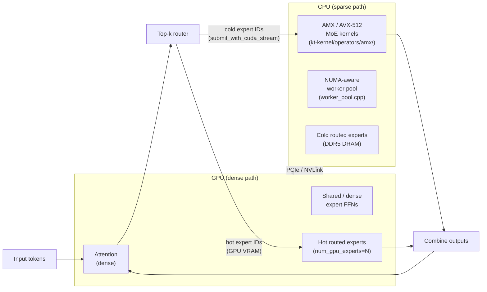

# Notable Inference Projects: ktransformers, lmdeploy, MAX, and the Rest

**After reading this chapter, the reader will be able to:**

- Explain the CPU+GPU heterogeneous MoE serving architecture that makes ktransformers the only viable single-workstation path for 671B-class sparse MoEs, and understand why v0.6 pivoted from a standalone server to a kernel library for SGLang.
- Describe TurboMind's FasterTransformer lineage and the specific kernel choices (FlashMLA, AWQ, DeepGemm) that give lmdeploy its performance edge on InternLM and Qwen models.
- Contrast Modular MAX's kernel-DSL-first architecture with PyTorch-extension engines and assess what would need to be true for it to become a production alternative.
- Trace the historical contributions of TGI, DeepSpeed-MII, and LoRAX — the Rust-router pattern, Dynamic SplitFuse, and SGMV heterogeneous batching — to the features now standard in vLLM and SGLang.

The cluster engines (vLLM, SGLang, TRT-LLM) are optimized for one implicit constraint: the model fits in GPU VRAM, and the serving goal is maximizing throughput across a batch of concurrent requests on a multi-GPU server. Every project in this chapter exists because that constraint does not always hold, or because a narrower constraint produces a meaningfully better engine. **ktransformers** solves the case where the model provably cannot fit in GPU VRAM at any reasonable cluster size, by extending the memory hierarchy down to CPU DRAM and SIMD execution units. **lmdeploy** is what happens when a research lab maintains its own production engine for its own model families: hand-written kernels tuned to a specific architecture beat the generalist. **Modular MAX** takes the opposite approach — define the kernel language first (Mojo/MLIR), then compile any model to it. The historically important projects (TGI, DeepSpeed-MII, LoRAX) contributed architectural ideas — the Rust-router pattern, chunked-prefill scheduling, SGMV batching — that have since been absorbed into every mainstream engine, leaving the originating repositories in maintenance mode or archived.

---

## Part 1: ktransformers — CPU+GPU heterogeneous MoE serving

### 1.1 The problem it solves

DeepSeek-V3 has 671 billion parameters, 256 routed experts, and top-8 active routing per token. In FP16 that is approximately 1.3 TB of weights — well beyond what any single node of H100s can hold without model parallelism at a scale that requires a datacenter allocation. The naive response is to shard the model across many GPUs; ktransformers' response is to observe that sharding is unnecessary given a different memory hierarchy.

The central insight is that sparse MoE activations are dominated by **expert sparsity**. With 256 experts and top-8 routing, each token touches $8/256 \approx 3\%$ of the expert parameter mass in every layer. The remaining 97% of expert weights are loaded but unused. If hot experts — those activated recently and frequently — live on GPU VRAM, and cold experts live on CPU DRAM, then:

- The dense path (attention, shared experts, layer norms, top-$k$ routing) runs at GPU throughput.
- The sparse path (cold expert FFN computations) runs on Intel AMX or AVX-512 on the host CPU.

AMX-INT8 on a Xeon Scalable processor achieves hundreds of GFLOPS per socket, and DDR5 provides 300–500 GB/s of bandwidth. The binding constraint for per-token cold expert inference is memory bandwidth, not compute: each token needs to load the weights for only its activated cold experts, which at top-8 with most experts cold is a small fraction of total expert mass per step. The latency is higher than a GPU doing the same computation, but the GPU was never an option in the first place.

### 1.2 Architecture

The execution flow splits cleanly along the hot/cold boundary:

The source is organized into a single C++ extension, `kt_kernel_ext`, under `kt-kernel/`:

**`kt-kernel/cpu_backend/`** contains the CPU execution substrate. `cpuinfer.h` and `worker_pool.cpp` implement a NUMA-aware thread pool that pins threads to CPU sockets to maximize DRAM locality. `task_queue.cpp` enqueues MoE expert work items. The critical synchronization primitive is `submit_with_cuda_stream`: a CUDA stream callback that fires when the GPU finishes routing, submits the cold-expert tasks to the CPU thread pool, and allows the GPU to proceed to the next layer's prologue while the CPU expert path is in flight. CUDA-event-based synchronization merges the results before the combine step.

**`kt-kernel/operators/amx/`** contains the hand-written AMX MoE kernels: `awq-moe.hpp` (AWQ INT4 weights), `bf16-moe.hpp` (BF16 weights on AVX-512_BF16), `fp4-moe.hpp` (FP4 weight-only MoE), `fp8-moe.hpp` and `fp8-perchannel-moe.hpp` (FP8 per-tensor and per-channel variants), `k2-moe.hpp` (Kimi-K2-specific block-FP8 format), and `sft_moe.hpp` (backward-compatible SFT variants). On machines without AMX, `kt-kernel/operators/llamafile/` provides a fallback path via Mozilla's llamafile SGEMM kernels — the same library used for CPU GEMM in llama.cpp.

**`kt-kernel/python/experts.py`** is the user-facing Python wrapper. `KTMoEWrapper` is a factory that selects among `AMXMoEWrapper`, `NativeMoEWrapper`, `LlamafileMoEWrapper`, and `GeneralMoEWrapper` based on the `method` parameter. Valid methods include `"AMXINT4"`, `"AMXINT8"`, `"FP8"`, `"FP8_PERCHANNEL"`, `"BF16"`, `"MXFP4"`, `"GPTQ_INT4"`, and `"LLAMAFILE"`. The selection is done at load time; the kernel path is fixed per session.

**`_cpu_detect.py`** performs runtime capability detection: AMX, AVX-512_VBMI, VNNI, BF16, and AVX2. Based on the detected ISA, it loads the matching pre-built extension variant. The wheel ships six variants in a single package, so the same pip install works on Skylake-X through Sapphire Rapids without recompilation.

### 1.3 Three levers

Three configuration knobs control the GPU/CPU memory and latency trade-off:

**`num_gpu_experts`**: how many routed experts are pinned to GPU VRAM. More GPU experts means fewer cold-expert round-trips over PCIe, lower per-token latency, and higher VRAM consumption. Setting this to zero makes every routed expert cold; setting it to the full expert count degrades to a standard GPU-only path limited by VRAM. For DeepSeek-V3 on a 24 GB GPU, typical configurations keep 8–32 hot experts on GPU.

**CPU expert format**: the quantization applied to cold experts. AMXINT4 gives the smallest DRAM footprint (critical when fitting 671B worth of experts in 382 GB DRAM). AMXINT8 gives higher quality at full AMX throughput. BF16 gives the highest quality on AVX-512_BF16 hosts at the cost of doubling memory versus INT8. FP8 per-channel (added January 2026) and MXFP4 (DeepSeek-V4-Flash style) fill the space between. The format choice is a Pareto trade-off between memory capacity, model quality, and CPU throughput.

**CPU/GPU expert scheduling policy**: added in January 2026, documented in `doc/en/kt-kernel/experts-sched-Tutorial.md`. The scheduler profiles expert activation frequencies across recent requests and dynamically promotes or demotes experts between GPU and CPU based on recency and frequency. Frequently activated experts are promoted to GPU VRAM; infrequently activated experts are demoted to CPU DRAM. This converts `num_gpu_experts` from a static configuration into a runtime-adaptive policy.

### 1.4 v0.6 pivot: library for SGLang

Version 0.6 (October 2025) made a significant strategic shift. The standalone ktransformers Python server — previously the primary deployment interface — was deprecated. ktransformers pivoted to being a **kernel library that SGLang calls**, documented in the LMSYS blog post "Integrating KTransformers into SGLang" (October 22, 2025).

The motivation is architectural: SGLang provides the request scheduler, KV cache manager, multi-GPU tensor parallelism, and the OpenAI-compatible serving API — all of the components that ktransformers did not need to reinvent and that ktransformers' single-process model was poorly suited to provide at production scale. ktransformers provides what SGLang cannot: the AMX-accelerated CPU MoE expert path that makes trillion-parameter sparse models run on hardware that has no other viable option.

This is the production deployment pattern as of May 2026: `python -m sglang.launch_server` with ktransformers CPU expert offloading enabled. The standalone ktransformers server (the `ktransformers.server` module) still exists but is not the recommended path.

### 1.5 Performance claims

The reported numbers from the ktransformers team:

- **8×L20 + Xeon Gold 6454S**: DeepSeek-R1-0528 (FP8) at 8-way concurrency — 227.85 tok/s total throughput, 87.58 tok/s output throughput.
- **Single 24 GB GPU + 382 GB DRAM**: DeepSeek-V3/R1 at 13–16 tok/s, with up to 28× speedup versus naive CPU offload (demonstrated in early 2025).

Day-0 support was shipped for: Kimi-K2 (July 2025), MiniMax-M2.1 (December 2025), GLM-5 (February 2026), and DeepSeek-V4-Flash (May 2026). The day-0 support pattern requires implementing the model-specific expert format (e.g. `k2-moe.hpp` for Kimi-K2's block-FP8 layout) and adding the architecture to the KTMoEWrapper dispatch table.

### 1.6 Trade-offs

ktransformers is unambiguously slower than vLLM for models that fit in GPU VRAM. The cold-expert path is bottlenecked by DDR5 bandwidth — hundreds of GB/s, but still an order of magnitude below HBM3's roughly 3–4 TB/s. Single-stream latency on a CPU-bound token can be 50–200 ms depending on expert format and concurrency. At high request concurrency, the NUMA-aware thread pool amortizes bandwidth across multiple in-flight expert evaluations, which partially closes the gap.

The win is categorical, not marginal: without ktransformers (or a comparable CPU offload strategy), running DeepSeek-V3 or Kimi-K2 on a single workstation is not a latency question, it is an impossibility. ktransformers makes it possible at a latency that is workable for interactive use. It is a single-workstation tool — not a fleet engine, not a multi-node scale-out system — and the v0.6 SGLang integration acknowledges this by delegating everything outside the CPU MoE kernel path to SGLang.

---

## Part 2: lmdeploy — TurboMind and the FasterTransformer lineage

### 2.1 Background and positioning

lmdeploy (`InternLM/lmdeploy`, v0.12.3, April 2026) is the production inference engine maintained by Shanghai AI Lab for the **InternLM** and **Qwen** model families. It provides two execution paths:

- **`pytorch` engine**: a Python-first path built on PyTorch, covering breadth — broad architecture support, rapid prototyping, and hardware targets where the CUDA engine is not available.
- **TurboMind**: a custom CUDA engine descended from NVIDIA's FasterTransformer, carrying hand-written CUDA kernels for the attention, GEMM, and MoE paths.

TurboMind is the performance path. For its target models — InternLM2.5, Qwen2.5, Qwen3 — it claims up to 1.8× the throughput of vLLM, and 2.4× quality-preserving speedup for 4-bit weights versus FP16. These claims are meaningful because InternLM and Qwen are among the most widely deployed open-weight model families as of May 2026.

### 2.2 TurboMind

TurboMind descends from NVIDIA's FasterTransformer, which was NVIDIA's own high-performance inference engine before vLLM displaced it as the community reference. The FasterTransformer lineage means TurboMind started with production-quality CUDA kernel primitives (fused multi-head attention, batched GEMM, tensor parallel collectives) and has been maintained against each new model architecture rather than rewritten.

Key kernel components in the current version:

**FlashMLA**: a custom MLA (Multi-head Latent Attention) decode kernel tuned for DeepSeek-V2/V3/R1's low-rank KV compression architecture [see §10/01](../10-engine-core/01-attention-kernels.md). MLA absorbs the KV projection into a low-rank matrix and caches only the latent representation, reducing KV cache memory by 5–13× versus standard MHA. FlashMLA in TurboMind is a hand-written implementation analogous to FlashInfer's MLA kernel but integrated directly into the TurboMind runtime.

**DeepGemm-based GEMM**: lmdeploy integrates DeepGemm — DeepSeek's open-source FP8 GEMM library — as the matmul backbone for FP8 models on Hopper and Blackwell. This is a targeted choice: DeepGemm's FP8 throughput on H100/H800 is competitive with cuBLAS on the specific shapes (large batch, square-ish) that arise in dense attention and FFN layers.

**FP8 MoE kernels**: for DeepSeek-V2/V3 MoE FFN layers, TurboMind ships fused FP8 MoE kernels that combine expert selection, dequantization, and computation.

**AWQ as the canonical quantization**: lmdeploy treats Activation-aware Weight Quantization (AWQ) as its primary compression path. AWQ finds per-channel scaling factors that minimize quantization error given the activation distribution, then applies 4-bit weight quantization. The claimed 2.4× throughput improvement versus FP16 at equivalent quality reflects that 4-bit weights increase arithmetic intensity (fewer bytes loaded per FLOP) and reduce KV cache pressure when combined with KV-cache quantization.

**Dynamic split-and-fuse scheduler**: lmdeploy implements a batching strategy it calls "dynamic split-and-fuse" — equivalent to the chunked-prefill idea from Sarathi-Serve [§10/03](../10-engine-core/03-batching-scheduling.md). Long prefill requests are split across multiple forward passes; short decode iterations from different requests are fused into a single batch. The effect is smoothing the latency spike caused by long-prompt requests that would otherwise serialize the scheduler's decode queue.

### 2.3 Hardware breadth

lmdeploy targets: NVIDIA CUDA (Ampere through Blackwell, including RTX 50 series added in 2026), AMD ROCm, Huawei Ascend (CANN), Cambricon, Intel Maca, and Apple Metal (via the `pytorch` engine path). TurboMind itself is CUDA-primary; the `pytorch` engine handles Ascend and other non-CUDA targets.

Supported architectures: 80+ LLM families and 30+ vision-language models, with particular depth on InternLM2/2.5, Qwen2/2.5/3, DeepSeek-V2/V3/R1, and their VLM variants (InternVL, Qwen-VL).

### 2.4 Recent features

**MXFP4** (2026): lmdeploy added MXFP4 (OCP MX FP4) quantization and claims 1.5× throughput versus vLLM on matching hardware. MXFP4 requires Blackwell (B200/B100) for native hardware support.

**vLLM `llm-compressor` integration** (2026): lmdeploy gained compatibility with vLLM's `llm-compressor` calibration pipeline for generating quantized checkpoints. This means users can calibrate once with `llm-compressor` and serve with either vLLM or lmdeploy, reducing the ecosystem fragmentation.

**RTX 50 series and Qwen3.5**: day-0 support for both, reflecting lmdeploy's role as the reference engine for Qwen-family models.

---

## Part 3: Modular MAX — the Mojo-kernel graph compiler

### 3.1 Architecture

Modular MAX is the only project in this survey that is not a Python+CUDA extension framework. Its architecture is kernel-language-first: everything from operator kernels to model definitions is expressed in **Mojo**, and the **MAX engine** is a graph compiler that lowers from a model description through the Modular IR and MLIR to per-device native code.

**Mojo** is a language designed by Modular as a systems-programming superset of Python. It has Python-compatible syntax but adds hardware intrinsics, compile-time metaprogramming, SIMD types, and an MLIR backend. MAX kernels (attention, GEMM, normalization, quantized ops) are written in Mojo and are part of the open-source MAX repository. The company's positioning is that Mojo lets a single author write a kernel that is portable across NVIDIA and AMD, rather than maintaining separate CUDA and HIP/Triton implementations.

**MAX engine** consumes a model definition expressed through the MAX Python API — a surface that resembles PyTorch's `nn.Module` but is not PyTorch-compatible. At `model.compile()` time, the engine lowers through Modular IR to MLIR passes and then to device-specific kernels. The result is a compiled artifact that runs without Python in the inference hot path.

**`max serve`** is the OpenAI-compatible serving CLI built on top of the MAX engine. The company also offers managed cloud and bring-your-own-VPC deployment options, but the OSS `max serve` path is fully self-hostable.

### 3.2 Distinctive features

**Kernel DSL-first**: the MAX kernel repository is the primary intended artifact, not a byproduct. Every attention, GEMM, quantized-matmul, and normalization kernel is written in Mojo and is open-source under Apache 2.0 (with a Modular Community License governing the brand). The company describes this as "the world's largest open-source repository of CPU+GPU kernels." Whether that claim holds on a per-function basis against the combined FlashInfer + CUTLASS + Triton ecosystem is debatable, but the intent is clear: MAX kernels are meant to be readable and reusable references.

**API openness**: release 25.7 (November 2025) fully opened the MAX Python API. Before this, the model definition surface was proprietary. The `model.compile()` and eager-mode execution path were added in release 26.1 (January 2026), providing a PyTorch-like development loop.

**Hardware focus**: NVIDIA B200/H200/H100 and AMD MI355X/MI325X/MI300X. The NVIDIA and AMD paths are both first-class targets with separate kernel implementations. Consumer GPU and CPU paths exist but are secondary. Release 26.2 (March 2026) added a claimed 4× speedup on image generation (FLUX.2), demonstrating the engine outside LLM inference.

**Licensing nuance**: the Apache 2.0 license covers the OSS portions of the MAX kernel repository and the Mojo standard library. The "Modular Community License" applies to use of the Modular/MAX/Mojo brand. Production use of `max serve` for commercial inference is covered by Apache 2.0 for the engine itself; the practical boundary is clearly delineated in the license text but warrants attention for enterprise legal review.

### 3.3 Position

MAX occupies a position that no other project in this section holds: it is a kernel compiler with a Python-compatible model definition API, not a Python framework with CUDA extensions. If Mojo MAX kernels can be extracted and used outside the Modular runtime — a question that the licensing and the MLIR-based build system leave partially open — MAX would function as a high-quality reference implementation for the kernel author, analogous to what FlashInfer provides for attention and what CUTLASS provides for GEMM. As of mid-2026, production adoption is small relative to vLLM and SGLang, and the ecosystem of community-contributed model support is correspondingly narrower. The interesting question is not whether MAX is a production alternative today — it is not — but whether the Mojo kernel repository becomes a standard reference in the way FlashInfer has.

---

## Part 4: Historically notable projects

### 4.1 TGI (Hugging Face) — archived

**Status: archived March 21, 2026. Final release v3.3.7, December 2025. Hugging Face recommends vLLM and SGLang as replacements.**

TGI was the first production-grade open-source inference server with native Hugging Face model support. At its peak (2023–2024) it was the most widely deployed OSS inference server, particularly for enterprise production use where observability and API stability were required. Understanding what it contributed — and why it fell behind — clarifies the feature landscape of the engines that replaced it.

**The Rust router + Python workers pattern**: TGI's architecture separates the front-end from the compute path. The inference workers are standard Python torch processes. The front-end router/launcher is a Rust binary that handles request multiplexing, gRPC, backpressure signaling, and process lifecycle. This pattern provides crash isolation (a worker dying does not kill the router), language-appropriate tools for IO-heavy networking (Rust) and tensor computation (Python), and faster cold-path request handling without the Python GIL. The pattern survives directly in LoRAX (a TGI fork) and was architecturally influential on mistral.rs.

**Production-grade observability**: TGI shipped OpenTelemetry tracing and Prometheus metrics out of the box before any other OSS inference engine had robust observability. For production engineering at organizations that required trace-per-request debugging and time-series performance monitoring, TGI's observability story was a differentiator for several years.

**Hardware breadth**: NVIDIA, AMD MI210/MI250, AWS Inferentia, Intel GPU, Habana Gaudi, TPU.

**Why it fell behind**: two developments closed TGI's advantages. First, vLLM's V1 scheduler (2025) with prefix caching, token-budget scheduling, and improved continuous batching pulled ahead on throughput metrics. Second, the `transformers`-as-source-of-truth integration landed in both vLLM and SGLang through 2025, meaning both engines now consume Hugging Face model definitions directly — removing TGI's unique advantage of being the only engine with native HF model support at the time of its founding.

### 4.2 DeepSpeed-MII / FastGen

`microsoft/DeepSpeed-MII`. Latest release v0.3.3, March 2025. Effectively in maintenance mode as of May 2026; Microsoft's inference energy has shifted to contributing DeepSpeed-Inference kernels into other engines rather than maintaining MII as a standalone serving stack.

The lasting contribution is **Dynamic SplitFuse**, the scheduling algorithm described in the FastGen paper (Holmes et al., *DeepSpeed-FastGen: High-throughput Text Generation for LLMs via MII and DeepSpeed-Inference*, arXiv:2401.08671, 2024). Dynamic SplitFuse addresses a fundamental batch heterogeneity problem: in a continuous batching system, a request with a 4096-token prompt dominates one forward pass, starving decode-phase requests that could otherwise make progress. SplitFuse splits long prompts across multiple forward passes (splitting) and fuses short-sequence decode iterations from different requests into a single batch step (fusing). The combined effect smooths both latency distribution and hardware utilization.

This idea anticipates Sarathi-Serve's chunked prefill [§10/03](../10-engine-core/03-batching-scheduling.md) and is now standard in vLLM (chunked prefill, enabled by default in V1), SGLang (chunk prefill), and TRT-LLM. The intellectual lineage goes: Dynamic SplitFuse (FastGen, January 2024) → Sarathi-Serve (formalization with analysis, 2024) → vLLM V1 default (2025). DeepSpeed-MII is now primarily of citation interest; SplitFuse is the originating design that informs current chunked-prefill implementations.

### 4.3 LoRAX (Predibase)

`predibase/lorax`. Latest release lorax-0.4.0, January 2025. OSS development pace has slowed as Predibase shifted focus to its managed offering.

LoRAX is a TGI fork specialized entirely for **multi-LoRA serving**: serving many concurrent requests that each target a different LoRA adapter, loaded dynamically at request time. The multi-LoRA serving problem is architecturally distinct from single-adapter serving: naive batching collapses because different requests need different weight deltas applied to the same base model, and naive sequential execution throws away all batching efficiency. LoRAX solves this with two mechanisms:

**SGMV (Segmented Gather Matrix-Vector) kernels**: SGMV kernels batch the LoRA delta application across requests with heterogeneous adapters in a single kernel launch. For a batch of $B$ requests each targeting a different rank-$r$ adapter with weight delta $\Delta W_b$, a naive approach would issue $B$ separate matrix-vector products. SGMV packs them: the segment structure encodes which adapter's $\Delta W_b$ applies to which request's activations, and the kernel performs the full batch with a single launch, preserving the efficiency of batched GEMM. The SGMV design descends from Punica (Chen et al., "Punica: Multi-Tenant LoRA Serving," 2023), and the kernel is the technical core of LoRAX's contribution.

**Dynamic adapter loading**: LoRAX loads adapter weights at request time from Hugging Face Hub, Predibase, or the local filesystem, using a JIT cache with an LRU eviction policy. This enables serving potentially thousands of adapters without pre-loading all of them into VRAM.

The SGMV kernels — and the heterogeneous-batching design concept — have since been adopted into vLLM's multi-LoRA path, SGLang's adapter serving, and TRT-LLM [§40/01](../40-multi-tenant/01-lora-serving.md). Every production multi-LoRA serving system today descends architecturally from the Punica/LoRAX design. The LoRAX repository is no longer load-bearing for production engineering; SGMV remains a prerequisite concept for the multi-LoRA serving chapter.

---

## Current production state

**ktransformers** is the dominant solution for the "model does not fit in GPU VRAM" MoE deployment scenario. The v0.6 SGLang integration is the production path: SGLang handles the serving API, request scheduling, KV cache, and tensor parallelism; ktransformers provides the CPU AMX/AVX-512 MoE expert kernels that make trillion-parameter sparse models viable on a single workstation. The standalone ktransformers Python server (pre-v0.6) is deprecated in favor of this integrated architecture. For DeepSeek-V3, DeepSeek-R1, Kimi-K2, and the growing family of 256-expert MoE models, ktransformers + SGLang is the only open-source single-workstation option with documented throughput numbers.

**lmdeploy** is the best-supported engine for InternLM and Qwen models. TurboMind's FP8 + AWQ + MLA combination is the performance choice for 7B–72B Qwen models on NVIDIA hardware: hand-written FlashMLA decode kernels, DeepGemm GEMM, and the dynamic split-and-fuse scheduler together produce a throughput advantage over vLLM that the team reports at up to 1.8× on these architectures. For other model families, vLLM and SGLang have broader compatibility and a larger community; lmdeploy's strength is its depth on its target architectures, not its breadth across the full open-weight model landscape. The vLLM `llm-compressor` integration (2026) partially bridges the toolchain gap for users who calibrate quantized models with vLLM tooling and want to serve with lmdeploy.

**MAX** is early-stage: the kernel repository and Mojo DSL are the technically interesting artifacts, not yet a production alternative to vLLM or SGLang for general LLM serving. The Apache 2.0 opening in release 25.7 and the eager-mode API in 26.1 are the right moves for building community adoption, but the ecosystem gap — model coverage, documentation depth, community-contributed integrations — remains large. The scenario where MAX becomes production-relevant is if the Mojo kernel repository becomes a standard reference implementation source, analogous to FlashInfer for attention kernels, such that other engines pull MAX kernels rather than compete with the MAX serving stack.

**TGI, DeepSpeed-MII, and LoRAX**: these projects' operational contributions — Rust-router pattern, production observability, Dynamic SplitFuse scheduling, SGMV heterogeneous batching — are now absorbed into vLLM, SGLang, and TRT-LLM. The original repositories are no longer load-bearing for production inference engineering. Understanding their contributions is necessary for understanding why the mainstream engines have the features they do: every production engine doing chunked prefill is implementing DeepSpeed-MII's SplitFuse insight; every multi-LoRA serving system is using the heterogeneous-batching architecture that Punica and LoRAX demonstrated.
