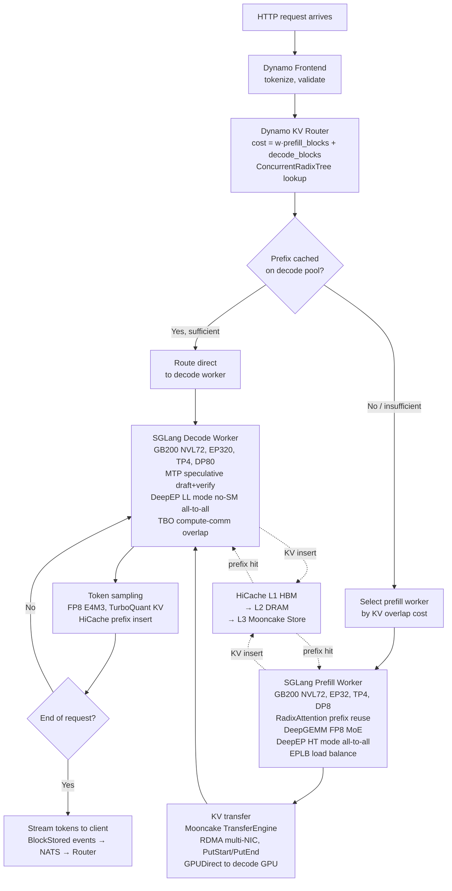
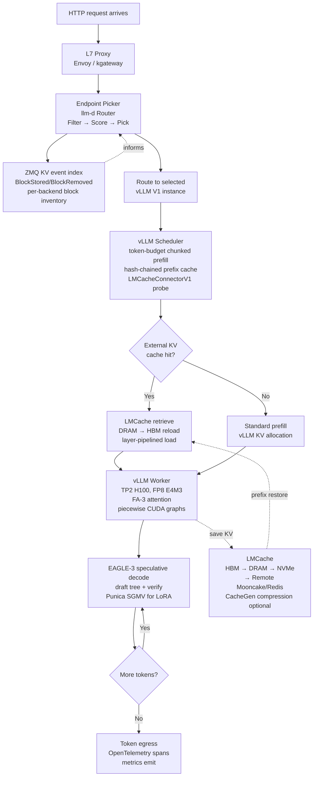
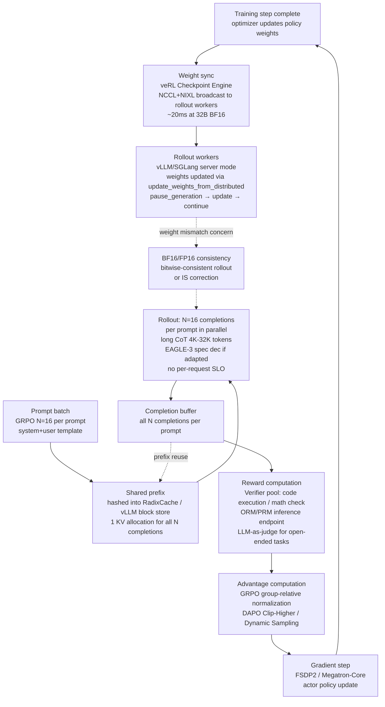
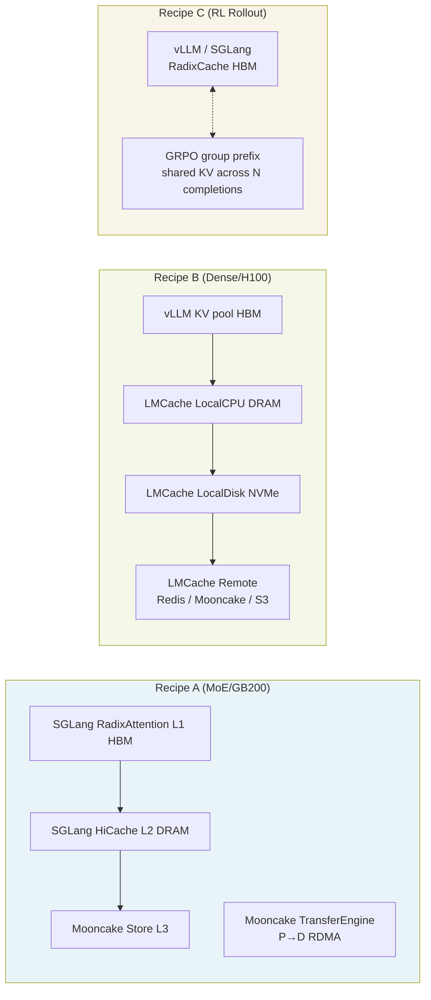

# Production Stack Recipes

**After reading this chapter, the reader will be able to:**

- Trace a single request from ingress to token egress through three reference production stacks — a frontier MoE deployment, a cost-optimized dense deployment, and a reasoning-model RL training loop — naming the subsystem responsible for each transformation.
- Identify which design decisions (disaggregation strategy, KV tier layout, parallelism shape, autoscaling signal) are universal across all three recipes and which are workload-specific.
- Evaluate a novel deployment scenario by mapping it onto the closest reference recipe and reasoning about where and why the recipe would need to change.

---

## 1. Introduction

The preceding chapters developed each layer of the inference stack in relative isolation: attention kernels, paged KV memory, batching policies, quantization, speculative decoding, prefill-decode disaggregation, MoE expert parallelism, KV tiering, multi-tenant routing, cluster autoscaling, observability. Each topic has its own invariants, its own trade-off space, and its own body of literature. The synthesis problem is different: a production deployment must assemble all of these layers simultaneously, and the interactions between layers — which ones couple tightly, which remain orthogonal — are not obvious from the individual treatments.

This chapter approaches synthesis through three concrete reference stacks, each representing a real deployment shape in 2026. The recipes are not hypothetical: they correspond to architectures documented in published systems papers, open-source repositories, and engineering blogs. Where specific numbers are cited, they carry their source. Where claims are vendor-supplied or single-paper, they are hedged explicitly.

Each recipe traces a request end-to-end, from the HTTP call that arrives at the cluster edge to the stream of output tokens that leaves it. The cross-references point to the chapters where each mechanism is developed in depth. Following the three recipes, a cross-cutting section identifies what converges across all three, what genuinely diverges, and why.

The three recipes span the major deployment archetypes as of 2026:

| | Recipe A | Recipe B | Recipe C |
|---|---|---|---|
| **Archetype** | Frontier-MoE API | Cost-optimized dense | RL post-training |
| **Model** | DeepSeek-V3-class (671B/37B active) | Llama-3.1-70B | DeepSeek-R1 / Llama-4 class |
| **Hardware** | GB200 NVL72 | H100 SXM5 | H100/H200 cluster |
| **Engine** | SGLang | vLLM V1 | vLLM / SGLang (rollout) |
| **KV fabric** | Mooncake + HiCache | LMCache | vLLM prefix cache |
| **Orchestration** | NVIDIA Dynamo | llm-d / AIBrix | veRL |
| **Primary constraint** | Cost/throughput at frontier scale | Cost efficiency, mixed workload | Rollout throughput, weight sync |
| **Disaggregation** | P/D disaggregated | Optional P/D | Aggregated rollout |

The ordering reflects a progression from the most complex (Recipe A requires understanding everything prior in the book) to the most novel architectural problem (Recipe C introduces training-inference co-design concerns not present in pure serving). Together, the three recipes cover the majority of production GPU-hours consumed by LLM inference in 2026.

---

## Part A: Frontier-MoE Serving at Scale

### A.1 Setting

A frontier lab or large-scale API provider is serving a DeepSeek-V3-class model: 671B total parameters, 37B active per token, 256 routed experts plus one shared expert per Transformer block, MLA (Multi-head Latent Attention) replacing standard multi-head attention. The dominant SLO is cost-efficiency at high throughput, with p95 TTFT < 2 s and ITL < 50 ms sustained at batch sizes of 200 and above. This is the kind of workload where the cost structure is determined by GPU utilization — idle compute under a tight KV memory budget represents direct revenue loss.

The reference hardware is the **GB200 NVL72** rack: 72 B200 GPUs connected by NVLink 5 at 130 TB/s aggregate bisection bandwidth per rack, 3.35 TB/s HBM3e per GPU, 192 GB HBM3e per GPU. The rack is treated as a single 72-way NVLink domain; inter-rack communication goes over InfiniBand or RoCEv2. Cross-ref [§70/01](../70-hardware/01-nvidia-roadmap.md).

The serving stack is **SGLang + Mooncake + NVIDIA Dynamo**. Each component occupies a specific architectural layer: SGLang is the per-GPU inference engine; Mooncake provides the KV transfer plane between disaggregated prefill and decode pools; Dynamo provides global routing, orchestration, and autoscaling. Cross-ref [§80/02](../80-oss-deep-dives/02-sglang.md), [§80/08](../80-oss-deep-dives/08-mooncake.md), [§80/05](../80-oss-deep-dives/05-nvidia-dynamo.md).

### A.2 Model architecture note: MLA

DeepSeek-V3 uses Multi-head Latent Attention (MLA), introduced in DeepSeek-V2 [§30/03](../30-kv-cache/03-attention-variants.md). MLA compresses the KV cache through a low-rank joint projection of keys and values into a latent vector $c_{KV} \in \mathbb{R}^{d_c}$ where $d_c \ll n_{heads} \cdot d_{head}$. At 32K context with DeepSeek-V3's architecture, the MLA KV footprint is approximately 2.30 GB per request, compared to roughly 10.7 GB for a GQA configuration at equivalent scale — a 4.6× reduction that directly translates into higher concurrency per GPU. This is not a free lunch: MLA requires an absorb transformation to recover the per-head query and key representations at attention time, and multiple kernel backends exist (FlashMLA, CutlassMLA, TRT-LLM MLA) with different throughput profiles on different hardware. Cross-ref [§10/01](../10-engine-core/01-attention-kernels.md).

### A.3 Disaggregation layout

The production deployment disaggregates prefill and decode pools. DeepSeek's own technical report (arXiv 2505.09343) documents a reference layout: 4 nodes (32 GPUs) for prefill with TP4, SP (sequence parallelism), and DP8; 40 nodes (320 GPUs) for decode with TP4, SP, DP80, and EP320. The 1:10 prefill-to-decode GPU ratio reflects the arithmetic: prefill is compute-bound and processes many tokens per forward pass, while decode is memory-bandwidth-bound at large batch and requires wide expert parallelism to push the per-token active-expert arithmetic intensity above the HBM bandwidth ceiling.

The resource-ratio derivation (following DistServe, OSDI '24) makes the imbalance precise. Let $g_P$ be the per-replica prefill goodput (requests/s satisfying the TTFT SLO) and $g_D$ the per-replica decode goodput (requests/s satisfying the ITL SLO). The required replica counts are:

$$n_P = \left\lceil \frac{R}{g_P} \right\rceil, \qquad n_D = \left\lceil \frac{R}{g_D} \right\rceil$$

For a workload with long output (chat or reasoning), $g_D \ll g_P$ because decode is bandwidth-bound while prefill saturates compute. The DeepSeek production 1:10 ratio corresponds to $g_P / g_D \approx 10$ at the reference workload — long generative outputs with large EP. Cross-ref [§20/02](../20-distributed-inference/02-prefill-decode-disagg.md), [§20/03](../20-distributed-inference/03-moe-inference.md).

The KV transfer at the phase boundary is handled by **Mooncake TransferEngine**. The Transfer Engine is a C++ data plane that pools RDMA queue pairs across multiple NICs (CX-7 cards in typical H200 / B200 rack configurations), performs topology-aware NIC selection, and issues GPUDirect RDMA writes directly from the prefill GPU's KV buffer to pre-allocated slots on the decode GPU. The commit protocol follows a two-phase PutStart / PutEnd design: the prefill side calls `PutStart(key, slice_length, config)` to obtain pre-allocated descriptors from the Mooncake Store master, issues RDMA writes per slice, then calls `PutEnd` on completion. The decode side polls `GetReplicaList` until the object is committed. This design ensures the decode worker never begins attention on a partial KV transfer. The FAST '25 paper reports Kimi production deployments processing over 100 billion tokens per day across thousands of nodes with this architecture (Qin et al., 2024). Cross-ref [§20/02](../20-distributed-inference/02-prefill-decode-disagg.md), [§80/08](../80-oss-deep-dives/08-mooncake.md).

The Mooncake FAST '25 paper reports aggregate transfer bandwidth of 87 GB/s on a 4×200Gbps RoCE NIC configuration using topology-aware multi-NIC aggregation. For MLA KV at 32K context (2.30 GB per request), the minimum transfer time is $2.30 / 87 \approx 26$ ms. At GQA KV (10.7 GB), the same transfer would take $10.7 / 87 \approx 123$ ms, making P/D disaggregation with GQA models costly enough to affect TTFT SLOs. This arithmetic is a key reason why MLA adoption lowers the effective barrier to disaggregation: the 4.6× KV compression translates directly into 4.6× lower P→D transfer latency, enabling disaggregation even under 200 ms TTFT SLOs that would be infeasible with GQA KV. Cross-ref [§20/02](../20-distributed-inference/02-prefill-decode-disagg.md), [§30/03](../30-kv-cache/03-attention-variants.md).

### A.4 Expert parallelism: DeepEP and EPLB

Within the decode pool, EP320 means each of 320 GPUs holds a disjoint subset of the 256 routed experts. The all-to-all dispatch and combine operations that route tokens to their assigned experts — and aggregate the results — are handled by **DeepEP** (DeepSeek's expert-parallel communication library). DeepEP exposes two kernel modes: a high-throughput (HT) mode for prefill and training, where RDMA transfers are issued before MoE GEMMs can begin (fire-and-forget IB pattern) to maximize overlap; and a low-latency (LL) mode for decode, where the RDMA operation does not occupy SMs and the NIC processes the scatter-gather asynchronously. The LL mode is critical for the decode SLO: at small per-step batch sizes, the all-to-all latency dominates iteration time if it consumes SM resources. Cross-ref [§20/03](../20-distributed-inference/03-moe-inference.md).

Expert load is inherently unbalanced because token routing is data-dependent. **EPLB (Expert Parallelism Load Balancer)** mitigates this by replicating hot experts across multiple physical GPUs: if expert $e$ is activated disproportionately, EPLB creates additional physical copies and distributes incoming tokens across them, reducing the maximum queue depth per physical GPU. EPLB maintains a moving-average token-count per expert and re-runs the placement algorithm periodically without restarting the server. The SGLang implementation uses the `EPLBManager.rebalance` method with a configurable `eplb_rebalance_num_iterations` window. The LMSYS blog (2025-05-05) reports EPLB providing 1.49× prefill and 2.54× decode throughput improvements on 96 H100 serving DeepSeek-V3 (SGLang large-EP deployment). Cross-ref [§20/03](../20-distributed-inference/03-moe-inference.md), [§80/02](../80-oss-deep-dives/02-sglang.md).

**Two-Batch Overlap (TBO)** in SGLang pipelines the all-to-all of one micro-batch with the MLP compute of another, exploiting DeepEP's fire-and-forget NIC model. The LMSYS report cites 27–35% throughput improvement from TBO at this scale. There is a documented corner case where TBO underperforms TP8 in some decode latency-sensitive configurations (SGLang issue #7255), so the production choice between TBO and Single-Batch Overlap (SBO) is workload-conditional.

**ElasticEP** handles GPU failures at the EP boundary: if an EP rank fails, the remaining ranks pick up the failed GPU's expert assignments from pre-staged GPU-to-GPU P2P backups maintained by `ElasticEPState`. This reduces mean time to recovery compared to cold restart. Cross-ref [§80/02](../80-oss-deep-dives/02-sglang.md).

### A.5 Prefix caching: RadixAttention and HiCache

Within each SGLang instance (prefill or decode), the **RadixAttention** radix-tree prefix cache maps token-sequence keys to physical KV blocks. On the prefill side, requests sharing a common system prompt or a cached document prefix hit the tree on `match_prefix`, recover the corresponding physical KV indices, and skip recomputation of those tokens. The cache is organized as a radix tree with LRU eviction; nodes are reference-counted so in-flight requests pin their ancestors against eviction. The cache key per node is a SHA-256 chained hash computed over the token IDs in each page, enabling deduplication across independent requests without full-string comparison. Cross-ref [§10/07](../10-engine-core/07-prompt-prefix-caching.md).

The memory layout for the SGLang RadixAttention tier hierarchy is:

```
Per GB200 NVL72 rack (72 GPUs × 192 GB HBM3e)
┌─────────────────────────────────────────────────────┐
│  L1: GPU HBM   72 × 192 GB = 13,824 GB (13.5 TB)   │
│  model weights (FP8): ~335 GB across 72 GPUs        │
│  KV pool: ~13,489 GB for request state              │
│  MLA KV ≈ 2.30 GB/req → ~5,864 concurrent requests │
└─────────────────────────────────────────────────────┘
             ↕ PCIe / NVLink host
┌─────────────────────────────────────────────────────┐
│  L2: Host DRAM  72 × ~512 GB = ~36 TB               │
│  HiCache pinned CPU tier                            │
│  Prefix cache overflow, warm starts                 │
└─────────────────────────────────────────────────────┘
             ↕ Mooncake TransferEngine (RDMA)
┌─────────────────────────────────────────────────────┐
│  L3: Mooncake Store (distributed cluster DRAM/SSD)  │
│  Cross-rack prefix reuse, long-TTL system prompts   │
│  PutStart/PutEnd two-phase commit                   │
└─────────────────────────────────────────────────────┘
```

For longer-lived KV state (cross-request prefix sharing at a time scale longer than a single GPU's HBM capacity can hold), **SGLang HiCache** extends the radix tree into a three-tier hierarchy: L1 is the on-device HBM pool; L2 is pinned CPU DRAM; L3 is a pluggable external storage backend, most commonly the **Mooncake Store** at this scale. HiCache's `HiCacheController` drives L1↔L2 and L2↔L3 traffic on separate CUDA streams, using per-layer `LayerLoadingEvent` objects so the model forward can proceed over prefetched layers as soon as they arrive. This allows the effective prefix cache to span the DRAM and NVMe of the entire GPU cluster rather than just each GPU's 192 GB HBM. Cross-ref [§30/02](../30-kv-cache/02-kv-tiered-offload.md), [§80/02](../80-oss-deep-dives/02-sglang.md).

Dynamo's KVBM (KV Block Manager) provides a parallel tiering path at the cluster level: blocks evicted from G1 (GPU HBM) flow to G2 (host pinned memory), G3 (local NVMe via NIXL), and optionally G4 (remote object storage). The G4 tier enables cross-rack prefix reuse at the cost of remote fetch latency. At GB200 NVL72 scale, G1 alone spans 72 × 192 GB = 13.8 TB of HBM per rack, making intra-rack prefix reuse the dominant pattern. Cross-ref [§80/05](../80-oss-deep-dives/05-nvidia-dynamo.md).

### A.6 Quantization

B200 GPUs have native FP8 E4M3 tensor core support. DeepSeek-V3 was trained in FP8 mixed precision (H800 cluster), and production serving uses FP8 E4M3 for both weights and activations, with per-tensor or per-channel scaling metadata stored alongside the weight matrices. The FP8 compute path through **DeepGEMM** (DeepSeek's grouped FP8 GEMM library, JIT-compiled for SM90/SM100) is the performance-critical path for MoE: grouped GEMMs with M-axis grouping allow simultaneous execution across experts on a single CUDA launch. The DeepGEMM repository reports approximately 1550 TFLOPS on H800 for grouped FP8 GEMM. Cross-ref [§10/04](../10-engine-core/04-quantization.md).

The **FP8 absorb path for MLA** requires special treatment. Standard multi-head attention projects queries and keys into $d_{head}$-dimensional spaces before computing $QK^T$. MLA instead stores a low-rank latent $c_{KV}$ and recovers the per-head representation by multiplying through the up-projection $W_{UK}$ at attention time. In FP8, this matrix multiply must be scheduled such that the scaling metadata for $c_{KV}$ is compatible with the $W_{UK}$ weight scaling. SGLang's FlashMLA backend handles this by pre-absorbing $W_{UK}$ into the decode query projection during model loading, eliminating the separate expand pass from the decode hot path: `fused_a_b = absorb_weight(W_UK, W_Q_pe)` in `modeling_deepseek.py`. This fusion means that at decode time, the full MLA KV computation reduces to a single matrix-vector multiply against the latent $c_{KV}$ per head per layer, matching the FP8 throughput of a standard GQA model despite the more complex theoretical formulation. Cross-ref [§10/01](../10-engine-core/01-attention-kernels.md), [§30/03](../30-kv-cache/03-attention-variants.md).

KV cache quantization uses **TurboQuant** (ICLR 2026), an information-theoretically near-optimal per-channel KV quantization method achieving 2.5–3.5 bits per channel with controlled accuracy degradation. At this compression ratio, the MLA KV footprint of ~2.30 GB per request at 32K context compresses to approximately 0.7–0.9 GB, roughly doubling the number of concurrently resident requests. This is reported as an unpublished result from the ICLR 2026 submission; the per-workload accuracy impact should be validated before deployment. Cross-ref [§30/01](../30-kv-cache/01-kv-compression.md).

### A.7 Speculative decoding: MTP heads

DeepSeek-V3 trains **Multi-Token Prediction (MTP)** auxiliary heads jointly with the main model: each MTP head predicts the token at position $t + k$ given hidden states from position $t$. At inference time, the main model generates one draft token from each MTP head in parallel, and the verifier accepts the longest prefix of the draft sequence that matches the greedy distribution. DeepSeek reports over 80% acceptance on internal evaluations, though this is workload-conditional and should not be assumed to generalize across traffic mixes. On reasoning workloads with longer CoT traces, acceptance rates tend to be higher because consecutive tokens in a reasoning chain are more predictable. Cross-ref [§10/06](../10-engine-core/06-multi-token-prediction.md), [§10/05](../10-engine-core/05-speculative-decoding.md).

SGLang's MTP implementation ships as `multi_layer_eagle_worker` variants, with chain-style multi-layer draft heads. The integration with TBO requires care: the verifier forward pass and the draft forward pass share hidden states, which must be synchronized across the TBO split boundary.

### A.8 Cluster orchestration: NVIDIA Dynamo

**NVIDIA Dynamo** sits above the per-engine SGLang instances and provides three services:

1. **KV-aware routing.** Dynamo's Rust-core KV router maintains a global `ConcurrentRadixTree` indexed by block-content hashes. Incoming requests are hashed, and the router scores candidate workers by `cost = w · prefill_blocks + decode_blocks`, where `w` is a tunable weight trading TTFT optimization (high `w` sends requests to the worker with most cached prefill blocks) against ITL smoothing (low `w` balances decode load). Workers publish `BlockStored` / `BlockRemoved` events over NATS to keep the global index current. Cross-ref [§50/01](../50-cluster-systems/01-router-gateway.md), [§80/05](../80-oss-deep-dives/05-nvidia-dynamo.md).

2. **Disaggregated orchestration.** Dynamo's PrefillRouter selects the optimal prefill worker (by KV overlap cost), dispatches the request, captures the `disaggregated_params` encoding the KV transfer metadata, selects a decode worker (by load), and injects the metadata into the decode request. The NIXL library handles the P→D KV transfer; the Mooncake Transfer Engine can serve as the NIXL backend.

3. **Autoscaling.** The Dynamo Planner uses **decode throughput (decode TPS) as its primary autoscaling signal** rather than GPU utilization. This matches the HeteroScale finding (ByteDance, 2025, arXiv 2508.19559): at high KV memory pressure, decode GPUs appear saturated on utilization metrics even at low throughput, making utilization-based signals misleading. Decode TPS is monotonically responsive to real load changes. The planner adjusts the prefill-to-decode replica ratio dynamically, writing to the `DynamoGraphDeploymentScalingAdapter` CRD's `scale` subresource so that standard Kubernetes HPA machinery executes the scaling decision. Cross-ref [§50/02](../50-cluster-systems/02-autoscaling-cost-and-sustainability.md).

### A.9 Request flow



### A.10 Quantitative context

The LMSYS blog (2025-09-25) reports SGLang on GB200 NVL72 achieving 3.8× prefill and 4.8× decode throughput versus the prior H100 baseline for DeepSeek-class workloads. The progression across the LMSYS blog series reflects system maturity:

| Deployment | Date | Hardware | Prefill TPS | Decode TPS | Notes |
|---|---|---|---|---|---|
| SGLang 96×H100 | May 2025 | 12 nodes H100 | 52.3k/node | 22.3k/node | First OSS DeepSeek replication |
| SGLang GB200 NVL72 Part I | Jun 2025 | 1 rack B200 | 2.7× H100 | 2.7× H100 | Single rack, not full EP72 |
| SGLang GB200 NVL72 Part II | Sep 2025 | 1 rack B200 | 3.8× H100 | 4.8× H100 | Full EP72 + TBO tuned |

The 2025-07 Kimi-K2 deployment on 128 H200 GPUs (SGLang + Mooncake) achieved reported throughput of 224k tokens/s prefill and 288k tokens/s decode (per secondary sources; primary paper figures are in arXiv:2507.20534). NVIDIA Dynamo reports up to 30× more requests per GB200 NVL72 versus co-located baselines without disaggregation for DeepSeek-R1 (vendor benchmark; workload and baseline specification should be consulted before comparison). Cross-ref [§80/02](../80-oss-deep-dives/02-sglang.md), [§80/05](../80-oss-deep-dives/05-nvidia-dynamo.md).

All numbers above are workload-specific and reflect DeepSeek-V3-class MoE with MLA at 32K or shorter context. Dense models on the same hardware will show different ratios. MLA's 4.6× KV reduction is a primary contributor to the concurrency advantage at this hardware tier — it allows the 13.5 TB of cluster HBM to hold proportionally more requests in flight than a GQA model of the same parameter count would permit.

---

## Part B: Cost-Optimized Dense Serving

### B.1 Setting

A mid-scale inference provider or enterprise deployment is serving **Llama-3.1-70B** (dense, GQA with $n_{kv\_heads}=8$, ~10.7 GB KV per request at 32K context) on **H100 SXM5** (80 GB HBM3, 3.35 TB/s, NVLink 4). The dominant constraint is cost efficiency across a heterogeneous traffic mix — batch sizes from 1 to 64, prompt lengths from a few hundred to 16K tokens, a mix of chat, RAG, and tool-augmented workloads. SLOs are TTFT < 1 s and ITL < 20 ms, with hard limits on per-request cost. This is the largest-volume deployment shape in 2026 by token count; most production tokens flow through configurations like this.

Cross-ref [§00/02](../00-foundations/02-transformer-arithmetic-roofline.md), [§70/01](../70-hardware/01-nvidia-roadmap.md).

The serving stack is **vLLM V1 + LMCache + llm-d / AIBrix routing**.

### B.2 vLLM V1 architecture

**vLLM V1** separates concerns into four isolated processes: `EngineCore` (model execution), `Scheduler` (request and KV management), `KVCacheManager` (block allocation, prefix hashing), and `Worker` (per-GPU model runner), connected via ZMQ IPC sockets. This process isolation means the Python overhead of scheduling and tokenization never blocks the GPU execution loop. Cross-ref [§80/01](../80-oss-deep-dives/01-vllm.md).

The scheduler uses a **token-budget scheduler with chunked prefill**: each iteration has a configurable token budget $T$, and arriving prefill requests are chunked at $T$ tokens per step rather than being processed all at once. This bounds ITL stalls during prefill at the cost of increasing TTFT for long prompts. The budget $T$ is set at the knee of the iteration-cost curve, as analyzed in Sarathi-Serve (OSDI '24). Cross-ref [§10/03](../10-engine-core/03-batching-scheduling.md).

Prefix caching uses **hash-chained prefix blocks**: each physical KV block is identified by the hash of the token sequence it covers, chained from the block below it in the sequence. This allows exact deduplication of shared prefixes across requests without the overhead of a full tree structure. Hits are reported as `get_num_new_matched_tokens` to the scheduler before block allocation runs, so a request with a large shared prefix only allocates new blocks for the suffix. Cross-ref [§10/07](../10-engine-core/07-prompt-prefix-caching.md).

CUDA graph execution uses **piecewise CUDA graphs** (FULL\_AND\_PIECEWISE default in vLLM V1): different batch sizes and sequence-length buckets use distinct captured graph segments, allowing the eager-mode fallback to be avoided for the most common execution paths while retaining flexibility for unusual shapes. The attention kernel on Hopper (H100/H200) uses **FlashAttention-3**, and on Blackwell uses **FlashAttention-4**, both accessed through vLLM's attention-backend abstraction. Cross-ref [§10/01](../10-engine-core/01-attention-kernels.md), [§10/08](../10-engine-core/08-cuda-graphs-compilation.md).

### B.3 LMCache multi-tier KV offload

The KV memory budget for Llama-3.1-70B on H100 SXM5 (80 GB) under TP2 (two-GPU tensor parallelism) looks as follows. FP8 weights for 70B parameters occupy approximately 70 GB total, split to 35 GB per GPU. The remaining 45 GB per GPU is available for KV cache. At GQA with $n_{kv\_heads} = 8$, $d_{head} = 128$, 80 layers, and BF16 KV precision:

$$S_{\text{KV/token}} = 2 \times 80 \times 8 \times 128 \times 2 \text{ bytes} = 327,680 \text{ bytes} \approx 0.31 \text{ MB/token}$$

At 32K context, one request consumes ~10.24 GB of KV cache. With 45 GB available per GPU and TP2 (each GPU holds half the KV heads), approximately 8–9 concurrent long-context requests can fit per GPU pair. For typical shorter-context workloads (2K–4K tokens), the concurrency is much higher. Cross-ref [§00/02](../00-foundations/02-transformer-arithmetic-roofline.md), [§30/03](../30-kv-cache/03-attention-variants.md).

**LMCache** supplements vLLM's in-engine prefix cache with a multi-tier KV store organized as: HBM → DRAM (`LocalCPUBackend`, pinned memory) → NVMe (`LocalDiskBackend`, async file I/O) → remote backends (Redis, Mooncake Store, S3). The unit of storage is a fixed **256-token chunk**, keyed by a running prefix hash that chains from the root of the sequence. Using the same hash function as vLLM's block manager (`vllm.v1.core.kv_cache_utils.init_none_hash`) ensures cross-process cache coherence.

LMCache integrates into vLLM V1 via the `LMCacheConnectorV1Dynamic` connector, which implements both scheduler-side and worker-side hooks. The scheduler side calls `get_num_new_matched_tokens` to discover how many tokens of the incoming request are cached in the external store before the engine's block allocator runs — this allows vLLM to skip prefill for the externally-cached prefix. The worker side uses `save_kv_layer` / `wait_for_layer_load` hooks that run inside the per-layer attention forward, allowing KV copy-out to the DRAM tier to overlap with subsequent layer computation.

**CacheGen** (Liu et al., SIGCOMM 2024) provides optional arithmetic-coding compression for cross-tier and remote transfers. KV tensors are quantized and arithmetic-coded per layer, with per-model bin count configurations chosen to balance reconstruction fidelity against compression ratio. The compressed format (`MemoryFormat.BINARY`) is decoded on the receive side before insertion into the GPU KV pool. The CacheGen encoder/decoder CUDA kernels live in LMCache's `csrc/` directory.

The full storage backend list exposed by LMCache includes eight types: `LocalCPUBackend`, `LocalDiskBackend`, `GdsBackend`, `P2PBackend`, `PDBackend`, `NixlStorageBackend`, `MaruBackend`, and `RemoteBackend` (covering Redis, Valkey, S3, Mooncake Store, InfiniStore, EIC, HF Bucket, SageMaker HyperPod, LMCache's own server protocol). This breadth allows the same LMCache deployment to span from a single-server NVMe-backed cache to a cluster-scale distributed KV store without changing the vLLM integration layer.

A typical memory hierarchy for this recipe on a 4-GPU H100 SXM5 server looks as follows:

```
4× H100 SXM5 (80 GB HBM3 each = 320 GB total)
┌──────────────────────────────────────────────┐
│ L0: HBM (vLLM KV pool)                      │
│ model FP8: 4×~17.5 GB = 70 GB               │
│ KV pool: ~250 GB → ~24 long-ctx concurrent  │
└──────────────────────────────────────────────┘
         ↕ CUDACopy (pinned DMA)
┌──────────────────────────────────────────────┐
│ L1: LMCache LocalCPUBackend (pinned DRAM)    │
│ Typical: 256–512 GB CPU DRAM                 │
│ Overflow KV for recently evicted prefixes    │
│ 256-token chunks keyed by chained hash       │
└──────────────────────────────────────────────┘
         ↕ async file I/O
┌──────────────────────────────────────────────┐
│ L2: LMCache LocalDiskBackend (NVMe)          │
│ Typical: 2–8 TB NVMe (e.g. 4× Samsung PM9A3)│
│ Long-TTL system prompts, slow-changing RAG   │
│ Optional CacheGen compression                │
└──────────────────────────────────────────────┘
         ↕ NIXL / RDMA / TCP
┌──────────────────────────────────────────────┐
│ L3: Remote (Mooncake Store / Redis / S3)     │
│ Cross-instance prefix sharing, backup        │
└──────────────────────────────────────────────┘
```

Cross-ref [§30/02](../30-kv-cache/02-kv-tiered-offload.md), [§80/04](../80-oss-deep-dives/04-lmcache.md).

### B.4 Quantization

For Llama-3.1-70B on H100, the default production quantization in vLLM V1 is **FP8 E4M3** for both weights and activations, taking advantage of H100's native FP8 tensor core support (added in Hopper with the Transformer Engine). At FP8, the 70B model's weight footprint drops from ~140 GB (BF16) to ~70 GB, fitting comfortably within two H100 SXMs under TP2, or a single H200 SXM under TP1 with room for a meaningful KV cache. For workloads requiring higher compression, **AWQ INT4** is available at the cost of additional calibration and a kernel path through Marlin-style grouped GEMM. Cross-ref [§10/04](../10-engine-core/04-quantization.md).

### B.5 Speculative decoding: EAGLE-3

For models without built-in MTP heads (Llama-3.1 does not have them), **EAGLE-3** serves as an external drafter. EAGLE-3 trains a small auxiliary model that takes the target model's hidden states at layer $\ell$ and predicts future tokens via a tree of draft candidates. The drafter model is small (a few layers deep) and runs very cheaply; the verify step runs the target model over all draft tokens in a single batched forward pass and accepts the longest consistent prefix.

The expected speedup from speculative decoding is determined by the **acceptance rate** $\alpha$ and the draft tree depth $d$. For a chain-style draft of length $d$ with i.i.d. per-token acceptance probability $\alpha$, the expected number of accepted tokens per verify step follows the geometric truncation:

$$E[\text{tokens per step}] = \frac{1 - \alpha^{d+1}}{1 - \alpha}$$

At $\alpha = 0.8$ and $d = 4$, the expectation is approximately 3.36 tokens per verify step, compared to 1 for standard decode. The actual latency improvement is modulated by the ratio of the drafter forward-pass cost to the verify forward-pass cost; for EAGLE-3 (a 2–3-layer drafter) on Llama-3.1-70B (80 layers), the drafter cost is roughly 4–6% of the target model cost, making the amortization favorable above $\alpha \approx 0.5$. Cross-ref [§10/05](../10-engine-core/05-speculative-decoding.md).

In vLLM V1, EAGLE-3 is integrated as a speculative scheduler plugin that maintains a separate draft model in a worker thread, intersperses draft generation with target-model verification, and adjusts the draft tree depth based on observed acceptance rates. Acceptance rate is workload-dependent — coding tasks typically achieve higher rates than open-ended generation — and should be monitored per-deployment. The `speculation_config.num_speculative_tokens` and `speculation_config.draft_tensor_parallel_size` parameters in vLLM V1 control the tree depth and the TP degree of the drafter, respectively. The drafter's TP degree can be less than the target model's, further reducing its cost.

For LoRA-adaptered enterprise deployments, **Punica SGMV** (Segment-GEMV, the batched LoRA inference kernel) allows multiple LoRA adapters to run within the same vLLM instance. Each LoRA has a distinct adapter weight matrix; the SGMV kernel groups requests by adapter and runs a batched low-rank update over the base model's linear layers, avoiding the per-adapter model-load cost. Cross-ref [§40/01](../40-multi-tenant/01-lora-serving.md).

### B.6 Routing and SLO management

Two routing systems represent the production deployment pattern for this stack:

**llm-d** (Red Hat / Google / IBM / NVIDIA / CoreWeave, CNCF Sandbox) implements the Kubernetes Inference Gateway API (GIE) Endpoint Picker Protocol. Its `Filter → Score → Pick` plugin chain runs as an `ext-proc` backend consulted by a conformant L7 proxy (Envoy, kgateway, agentgateway). For this deployment shape, the relevant plugins are: `prefix-cache-affinity-filter` (routes requests to backends that have their prefix cached, subject to a TTFT load gate that breaks stickiness under congestion), `precise-prefix-cache-scorer` (event-driven, reads `BlockStored`/`BlockRemoved` events from vLLM via ZMQ to maintain an exact per-backend block inventory), and `kv-cache-utilization-scorer` (down-weights backends at high KV pressure). The final routing score can be expressed as:

$$\text{score} = w_1 \cdot \text{prefix\_hit\_rate}(b) + w_2 \cdot \text{decode\_capacity}(b)$$

where $b$ is the candidate backend, prefix hit rate is measured against the event-driven block inventory, and decode capacity is derived from KV utilization and queue depth. Cross-ref [§50/01](../50-cluster-systems/01-router-gateway.md), [§80/06](../80-oss-deep-dives/06-llm-d.md).

The llm-d plugin chain executes as follows on each request: **Filter** plugins run first and may remove backends from consideration entirely (e.g., `prefix-cache-affinity-filter` removes backends that are at high KV pressure even if they hold the cached prefix, preventing cache stickiness from causing overload); **Score** plugins assign floating-point scores to the surviving backends (e.g., `precise-prefix-cache-scorer` adds a score proportional to the number of matched prefix blocks, `kv-cache-utilization-scorer` subtracts a penalty proportional to fill fraction); **Pick** selects the highest-scoring backend, with random tie-breaking. The separation of Filter from Score allows load-gate behavior — protecting SLOs — to be cleanly separated from optimization — maximizing cache hit rate. The Filter-before-Score ordering is essential: if scoring ran first, a high-scoring but overloaded backend could be selected before the load gate fires.

**AIBrix** (ByteDance, contributed to vLLM org) provides an alternative control plane with broader CRD coverage for enterprise deployments: the `ModelAdapter` CRD manages LoRA adapter lifecycle (download, load, bind to a pod, expose as a named model endpoint); the `StormService` CRD manages prefill-decode rolesets for disaggregated rollouts; the `PodAutoscaler` with APA (AIBrix's fluctuation-tolerant autoscaler) manages replica counts using a tolerance band around utilization-based signals. For prefix-cache-aware routing, AIBrix implements `prefix_cache.go` with ZMQ-based KV event sync from vLLM (version ≥ 0.7). Cross-ref [§80/07](../80-oss-deep-dives/07-aibrix.md).

Both llm-d and AIBrix implement optional prefill-decode disaggregation at this tier. The llm-d disagg profile handler runs two sub-pipelines (prefix-cache-aware P selection, load-balanced D selection) and injects a `x-prefiller-host-port` header that the in-pod PD sidecar acts on. The NIXL library handles P→D KV transfer.

### B.7 Observability

The deployment exposes **OpenTelemetry GenAI semantic conventions** across all layers: the gateway adds span context, the vLLM engine emits TTFT, ITL, ITL\_p99, KV utilization, queue depth, and prefix-hit-rate metrics to Prometheus, and the router layer correlates routing decisions with per-request latency outcomes. Key metrics to instrument are:

- `gen_ai.server.ttft_bucket` — TTFT histogram with p50/p95/p99 alerting
- `gen_ai.server.itl_bucket` — ITL histogram; p99 spike above 20 ms indicates batch saturation
- `vllm:kv_cache_usage_perc` — KV pool fill fraction; values above 85% predict ITL degradation
- `vllm:gpu_prefix_cache_hit_rate` — cache efficiency; low values indicate poor routing locality
- `llm-d:pending_requests_queue_depth` — routing congestion indicator
- `lmcache:hit_rate_by_tier` — per-tier hit rate across DRAM, NVMe, remote; used to tune tier sizes
- `llm-d:prefix_cache_token_match_rate` — fraction of prompt tokens that matched a cached block

A practical alert chain for this stack: (1) `kv_cache_usage_perc > 0.85` fires → check queue depth; if queue depth is also growing, increase replicas or reduce batch size; (2) `gpu_prefix_cache_hit_rate < 0.30` fires on a request class that should be cached → investigate routing stickiness (prefix-cache-affinity filter may be overridden by load gate); (3) `itl_bucket` p99 > 20 ms → check if chunked-prefill chunk size $T$ needs tuning; large $T$ causes ITL spikes during prefill.

Cross-ref [§50/03](../50-cluster-systems/03-observability-and-resilience.md).

### B.8 Request flow



---

## Part C: Reasoning Model and RL Post-Training

### C.1 Setting

A research lab or model company is running **RLVR** (Reinforcement Learning with Verifiable Rewards) to train a reasoning model — DeepSeek-R1-class or Llama-4-class. The workload is fundamentally an inference workload, not a training workload: the RL rollout phase, where the current policy generates completions for each training prompt, consumes more wall-clock time than the gradient update step in many configurations. DeepSeek's R1 training configuration used 16 rollout completions per prompt at temperature 1, max length 32K tokens, and a batch of 512 prompts, running on 8×H800 GPUs for 10,400 steps. The rollout phase at these settings generates up to 16 × 32K = 512K tokens per batch before training begins. Cross-ref [§60/06](../60-adjacent-workloads/06-rl-post-training-infrastructure.md).

The distinguishing features of rollout-as-inference are: very long generation sequences (4K–32K token chain-of-thought traces), group sampling (GRPO generates $N$ completions per prompt from the same policy), tight coupling between rollout throughput and training step frequency, and frequent weight updates that invalidate CUDA graphs and some KV cache state. The long-tail latency of completions is especially problematic in synchronous rollout: if one of the $N$ completions for a prompt runs to 32K tokens while others run to 8K, the batch must wait for the longest completion before training can resume.

The reference framework is **veRL** (ByteDance, now verl-project), the most widely adopted production RL training framework as of May 2026, using **vLLM** or **SGLang** as the rollout engine. veRL is used by ByteDance (DAPO), ZhipuAI (GLM-4.x series via slime), and Alibaba (ROLL/ROLL-Flash for Qwen-Coder). Cross-ref [§60/06](../60-adjacent-workloads/06-rl-post-training-infrastructure.md).

### C.2 The rollout engine as a specialized inference server

The rollout engine in RL post-training is an inference engine with altered invariants:

1. **No per-request SLO.** Rollout throughput (total tokens generated per training step) is what matters; per-completion TTFT is irrelevant.
2. **Very long generations.** Where production serving targets ITL < 20–50 ms, rollout completions routinely run for minutes per sequence (reasoning traces with 32K tokens at ~10 ms ITL = ~320 s/completion; at batch=16, the limiting completion dominates the step time).
3. **Frequent weight churn.** After each training step, updated weights must be broadcast to all rollout workers. This invalidates CUDA graph captures and partially invalidates the prefix cache (the policy has changed, so cached logits are stale).
4. **GRPO group sampling creates massive prefix reuse.** GRPO (DeepSeekMath / arXiv:2402.03300) samples $N$ completions per prompt: the prompt prefix is identical for all $N$, so the KV cache for the prompt portion is reused across all $N$ generations. At $N=16$ and a prompt length of 4K tokens, approximately 80–90% of the KV allocation for the group is reused prefix.

Cross-ref [§10/07](../10-engine-core/07-prompt-prefix-caching.md), [§10/03](../10-engine-core/03-batching-scheduling.md).

### C.3 Framework choice: veRL HybridEngine and disaggregated async

**veRL's HybridEngine** colocates actor (training) and rollout (inference) on the same GPUs by time-multiplexing: when the actor trains, the rollout engine is paused; when rollout runs, the optimizer state is not resident. The 3D-HybridEngine reshards actor weights between training-layout (3D: TP × PP × DP) and inference-layout (TP-only) by directly reading from the distributed training tensor without an intermediate host-memory copy. This avoids the cost of a separate weight broadcast, at the price of roughly doubling peak memory usage relative to a disaggregated design (both training state and rollout KV cache must fit in HBM simultaneously).

The three deployment modes available in veRL 0.7+ correspond to different points in a throughput-staleness-memory space:

```
Deployment mode comparison (veRL 0.7+):

                    On-policy     One-step-off    Fully-async
                    (HybridEng)   (veRL 0.7)      (AReaL/ROLL)
────────────────────────────────────────────────────────────────
Throughput          1×            ~1.3×            ~2.77× (max)
Memory (peak)       2× (colocate) 1.5×             1× (disagg)
Off-policy samples  None          1 step           k steps
Correctness         Exact         IS correction    IS + depth bound
Weight sync latency 0 (colocate)  ~20 ms (NCCL)   async streaming
Complexity          Low           Medium           High
────────────────────────────────────────────────────────────────
Recommended for:    ≤7B, quick   Medium scale     >32B, long CoT
                    iteration    general use      frontier training
```

For larger models or longer completions, the **fully asynchronous disaggregated rollout** design (veRL 0.7 fully-async mode, AReaL boba²) runs the rollout engine as a persistent server (vLLM or SGLang in server mode), and the training process streams weight updates via the Checkpoint Engine (NCCL + NIXL transport). This decoupling allows rollout to run continuously without blocking on training steps. AReaL (Ant Group / Tsinghua, arXiv:2505.24298) reports 2.77× throughput versus synchronous baselines at matched accuracy using Decoupled-PPO. OpenRLHF uses a simpler disaggregated design with synchronous NCCL broadcast; it remains the most widely adopted choice for ease of deployment. Cross-ref [§60/06](../60-adjacent-workloads/06-rl-post-training-infrastructure.md).

The synchronous-vs-asynchronous choice is regime-dependent: synchronous is preferred at smaller scales (≤7B, short CoT) where weight sync overhead is tolerable relative to rollout time; fully asynchronous is preferred at ≥32B and long CoT, where rollout time dominates. One-step-off-policy (generate one batch before syncing weights) captures most of the throughput benefit with simpler importance-sampling correction requirements — the policy version lag is bounded at 1, and per-sample IS weights are well-behaved.

### C.4 Prefix cache exploitation in GRPO

The GRPO group-sampling pattern creates an extreme case for prefix caching. Given a group size $N$ and a shared prompt prefix of length $P$, the fraction of total token budget consumed by the shared prefix across the group is:

$$f_{\text{prefix}} = \frac{P}{P + L_{\text{out}}}$$

where $L_{\text{out}}$ is the mean completion length. At $P = 4096$ tokens and $L_{\text{out}} = 8192$ tokens, $f_{\text{prefix}} \approx 33\%$. For the $N - 1$ completions beyond the first, this prefix KV is already cached, so the effective KV allocation savings across the group is:

$$\text{KV savings} = \frac{(N-1) \cdot P}{N \cdot (P + L_{\text{out}})}$$

At $N = 16$, this is approximately 31% of the total KV allocation. In practice, both vLLM's hash-chained prefix cache and SGLang's RadixAttention tree hit the cached prefix for completions 2 through $N$ within the same batch, and the prefix KV is not recomputed. The effective batch seen by the prefill phase is $B = N$, while only $1/N$ of the prefix compute is charged: a direct reduction in TTFT for subsequent completions in the group and a meaningful reduction in HBM pressure.

The memory pressure pattern for a GRPO group can be visualized as:

```
Group of N=16 completions, shared prefix P=4K tokens, output L_out=8K tokens each

Token allocation (H100 80 GB, Llama-3.1-70B FP8, TP1):
┌────────────────────────────────────────────────────────────────────┐
│ Shared prefix KV:  1 × 4K tokens × 0.31 MB/tok =  1.24 GB        │
│   (reused by all 16 completions after first prefill)              │
├────────────────────────────────────────────────────────────────────┤
│ Per-completion decode KV (incremental):                           │
│   16 × 8K tokens × 0.31 MB/tok = 39.6 GB  (peak at step 8K)     │
│ → Total at peak: ~40.8 GB KV + ~35 GB weights = ~76 GB           │
│ → Tight fit; reduce batch or use shorter completions for margin   │
└────────────────────────────────────────────────────────────────────┘
```

The **Infinite Sampling** technique (arXiv:2506.22950) reduces peak memory pressure further by interleaving micro-groups: instead of instantiating all $N$ completions simultaneously, it interleaves groups of size $k < N$ with shared prefix cache across micro-groups. This reduces peak KV allocation by over 50% on long-completion GRPO, at the cost of increased wall-clock time per step. Cross-ref [§10/07](../10-engine-core/07-prompt-prefix-caching.md).

### C.5 Speculative decoding during rollout

The historical recommendation was to avoid speculative decoding during RL rollout: draft models trained on an earlier policy version would have degraded acceptance rates on the current policy, and frequent weight updates would require expensive draft model refitting. This recommendation was revised in 2026.

**NeMo-RL v0.6** (NVIDIA, May 2026) ships speculative decoding inside the RL training loop with online draft adaptation: after each policy update, the EAGLE-3 draft head is refit from the policy's current hidden states (without a full training pass, using a lightweight projection). This adaptation is fast enough that acceptance rates remain stable across training steps. NeMo-RL reports 1.8× rollout speedup at 8B scale, with projected 2.5× end-to-end speedup at 235B (vendor claim; cross-workload generalization should be verified). **SPEC-RL** (arXiv:2509.23232) takes a complementary approach: rather than adapting the drafter, it reuses trajectory prefixes from the *previous* epoch as speculative drafts, exploiting the fact that on-policy RL training produces slow policy drift. SPEC-RL reports 2–3× rollout speedup on PPO/GRPO/DAPO. Cross-ref [§10/05](../10-engine-core/05-speculative-decoding.md), [§60/01](../60-adjacent-workloads/01-test-time-compute.md).

### C.6 Weight synchronization

After each training step, updated weights must reach all rollout workers. The available transport mechanisms and their approximate costs at 32B scale are:

| Mechanism | Approximate cost (32B, BF16) | Notes |
|---|---|---|
| NCCL broadcast (naive) | ~2–5 s | Bounded by NVLink / IB bandwidth |
| NCCL with bucketing (veRL) | ~20 ms (per veRL docs) | Overlap with next batch |
| RDMA P2P (Awex / Mooncake checkpoint-engine) | ~1–2 s at 1T params | Trillion-param scale; see arXiv:2604.09107 |
| Filesystem + ZMQ (PRIME-RL, AReaL) | Varies by NFS/SSD speed | Async; suits fully-disaggregated designs |

The veRL Checkpoint Engine supports both NCCL and NIXL transports. With NCCL bucketing (20 ms overhead for 32B), weight sync cost is negligible relative to rollout time for long-CoT workloads, making the overhead argument for fully-async designs weaker at this scale.

The weight sync budget matters for the overall training step cadence. In a synchronous rollout setup, the step timeline is:

```
Step time = rollout time + weight sync time + gradient step time
          ≈ (N × L_out / decode_TPS) + sync + backward_pass

At N=16, L_out=8K, decode_TPS=10K tok/s:
  rollout   = 16 × 8192 / 10,000  ≈ 13.1 s  (dominant)
  NCCL sync = 20 ms (32B, bucketed veRL)     (negligible)
  grad step ≈ 2–4 s on 8×H800             (secondary)
```

This arithmetic shows why rollout throughput — not weight sync — is the primary optimization target at 32B scale. At 1T parameters, the sync cost grows: a naive NCCL broadcast over 10 Gbps/device links takes approximately $(1\text{T} \times 2\text{ bytes}) / (10\times 10^9) \approx 200$ s, making async RDMA streaming (Awex, Mooncake checkpoint-engine) mandatory at that scale even if rollout is also slow.

A significant 2025–2026 concern is **numerical mismatch** between rollout and training: vLLM uses BF16 activations internally while Megatron-class trainers can use FP32 or FP16 accumulators. The resulting token-probability discrepancy causes importance sampling corrections to be unreliable. Two fixes are in production use: switching BF16 to FP16 for the RL fine-tuning run (arXiv:2510.26788), and using bitwise-consistent rollout where vLLM is run in a mode that matches TorchTitan's accumulation precision exactly (vLLM blog, 2025-11-10). Cross-ref [§00/04](../00-foundations/04-collectives-and-comm-primer.md), [§60/06](../60-adjacent-workloads/06-rl-post-training-infrastructure.md).

### C.7 Reward model serving

The reward signal in RLVR comes from one of three sources: a rule-based verifier (for math and code, no serving overhead), an Outcome Reward Model (ORM) serving as a standard inference endpoint over the completed rollout, or a Process Reward Model (PRM) serving at each reasoning step boundary.

ORM and PRM serving are standard inference workloads but with latency coupling to rollout throughput: if the reward endpoint is a bottleneck, it gates training step frequency. The practical deployment pattern is to run a smaller reward model (Qwen-7B or Llama-8B class, often quantized to INT4 or FP8) on a separate GPU pool, with the batch size matched to the rollout group size $N$. Because reward computation has no autoregressive dependency (the full completion is available before scoring), it is fully parallelizable and benefits from large batch sizes.

The three reward source options differ significantly in infrastructure cost:

| Reward type | Infrastructure overhead | When to use |
|---|---|---|
| Rule-based verifier (code exec, math check) | Separate sandbox pool; K8s pods; CPU-bound | Math, code, structured reasoning |
| ORM (separate RM model) | GPU pool, ~7B–70B, vLLM endpoint | General chat, open-ended tasks |
| PRM (step-level scoring) | Higher latency coupling; token-by-token boundary detection | Multi-step reasoning, formal proof |
| LLM-as-judge | Heaviest (frontier-class LLM); but no training required | Rubric-graded tasks, self-critique |

LLM-as-judge variants (J1-Qwen-32B is reported to outperform o1-mini on judge benchmarks per arXiv:2505.10320) introduce a heavier serving load but replace the need for a separately trained reward model. Kimi K2's RL training used a combined RLVR + self-critique rubric reward scheme, running a dedicated reward model as a standard inference endpoint.

Cross-ref [§60/06](../60-adjacent-workloads/06-rl-post-training-infrastructure.md).

### C.8 Agentic rollouts and tool use

For agentic reasoning tasks (SWE-Bench, WebArena, tool-augmented math), the rollout generates multi-turn traces interleaved with tool calls: the model emits a tool invocation token sequence, the verifier pool executes the tool (code interpreter, browser, API call), and the result is fed back as the next observation. This requires the rollout engine to support **structured output** (XGrammar or llguidance to force tool-call JSON schemas) and a **sandbox pool** for tool execution.

The data flow for a single agentic rollout turn is:

```
turn t:
  1. Policy forward → token stream (decode, no SLO)
  2. XGrammar/llguidance constrained decode detects </tool_call> boundary
  3. Tool call JSON extracted; dispatched to sandbox pool (Kubernetes Job or
     persistent pod with fast exec sandbox, e.g., Firecracker MicroVM)
  4. Sandbox executes tool, returns observation (string)
  5. Observation appended to context; go to turn t+1
  6. KV cache for turns 0..t-1 is preserved on GPU (prefix reuse across turns)
```

The KV prefix-reuse benefit compounds across turns: by turn $t$, the KV for turns $0 \ldots t-1$ is shared across all $N$ completions in the group that are executing turn $t$. Because the system prompt and all prior observations are identical for all completions that have taken the same tool-execution path, the radix cache hit fraction grows with rollout depth.

The sandbox pool is a separate Kubernetes-backed service that executes tool calls concurrently. Kimi K2's RL training ran over 10,000 concurrent sandbox instances for software-engineering tasks. The key systems concern is latency tail: tool execution can be highly variable (a code interpreter running a complex program may take seconds), and this tail drives the async rollout design — a synchronous rollout would serialize on the slowest tool call in each batch.

A secondary concern is **dead-end branching**: if a completion hits a fatal tool error (sandbox timeout, invalid JSON output), the rollout for that completion must be terminated cleanly without blocking the rest of the group. vLLM's `abort_request` API and SGLang's `flush_cache` API allow per-completion abortion without disrupting the rest of the batch. The RL training loop must account for group members that terminated early (typically by masking their advantage computation or treating the reward as zero). Cross-ref [§60/02](../60-adjacent-workloads/02-structured-output-and-tools.md), [§60/06](../60-adjacent-workloads/06-rl-post-training-infrastructure.md).

### C.9 Request flow



---

## 4. Cross-Cutting Observations

### 4.1 What converges across all three recipes

**Prefix caching is universal.** All three stacks rely on prefix caching as a primary cost-reduction mechanism: SGLang's RadixAttention tree, vLLM's hash-chained block store, and the GRPO group-sampling prefix reuse pattern in RL rollout. The underlying mechanism is the same — deduplicate KV computation for repeated token prefixes — but the trigger differs: in Recipes A and B it is shared system prompts and document context; in Recipe C it is the GRPO group-sampling structure. The implementation details also differ: SGLang's tree supports partial-page splits and hierarchical HiCache; vLLM's chain-hash approach is simpler but requires PYTHONHASHSEED determinism for cross-process coherence. Cross-ref [§10/07](../10-engine-core/07-prompt-prefix-caching.md).

**FP8 quantization is the dominant weight format for production inference.** Recipe A uses FP8 E4M3 with DeepGEMM; Recipe B uses FP8 E4M3 via vLLM's Transformer Engine path; Recipe C uses BF16 or FP16 during rollout (for training-inference numerical consistency) but FP8 for production inference. The B200's native FP8 tensor core support (SM100 arch) and H100's FP8 via Transformer Engine v1 make FP8 the default quantization level for any new deployment as of 2026. The next step under active adoption is 4-bit formats (NVFP4 on Blackwell, MXFP4 in GPT-OSS), but these require hardware support not yet present on H100. Cross-ref [§10/04](../10-engine-core/04-quantization.md).

**CUDA graph execution is universal.** All three stacks capture execution graphs for common decode batch sizes to eliminate Python dispatch overhead and kernel launch latency. The implementation varies (vLLM's piecewise CUDA graphs, SGLang's breakable piecewise graphs, TBO-aware graph capture for MoE all-to-all), but the principle is the same. The exception is the weight-update phase in Recipe C, which requires graph invalidation and re-warm after each policy update — an overhead that motivates the sleep-mode API (`vllm.sleep(level=2)` / `vllm.wake_up()`) to separate weight-holding and KV-holding GPU memory reservations. Cross-ref [§10/08](../10-engine-core/08-cuda-graphs-compilation.md).

**KV-aware routing is universal at the cluster layer.** Dynamo, llm-d, and AIBrix all route based on prefix-cache state, differing only in the implementation of the block inventory (global ConcurrentRadixTree in Dynamo, event-driven precise scorer in llm-d, ZMQ-event-sync in AIBrix). The routing score formula `w · prefix_hit_rate + decode_capacity` appears in each, with different parameterizations. The convergence on this formula reflects a shared insight: routing to a backend with cached prefix saves both recompute cost and TTFT latency, while the capacity term prevents overloading the best-cached backend. Cross-ref [§50/01](../50-cluster-systems/01-router-gateway.md).

**Decode TPS as the autoscaling signal.** HeteroScale (ByteDance, arXiv:2508.19559) establishes decode TPS as the most reliable autoscaling signal across disaggregated deployments, and both the Dynamo Planner and AIBrix's APA-with-KV-utilization move in this direction. GPU utilization is unreliable because KV memory pressure keeps GPU utilization reported-high even under low throughput load: a memory-bound decode phase pegs HBM bandwidth and thus GPU activity counters even when generating few tokens per second relative to the hardware ceiling. Cross-ref [§50/02](../50-cluster-systems/02-autoscaling-cost-and-sustainability.md).

**The Kubernetes Inference Gateway API (GIE) is the emerging cluster-layer standard.** llm-d is the reference implementation; Dynamo's EPP plugin and AIBrix's ext-proc gateway both target the same ext-proc / `InferencePool` protocol. While Recipe C (RL rollout) does not use GIE — it is not a multi-tenant serving deployment — Recipes A and B both benefit from the standardized endpoint-picker protocol that allows swapping routing backends without changing the data plane. Cross-ref [§50/01](../50-cluster-systems/01-router-gateway.md).

**Observability tooling is converging on OpenTelemetry GenAI semantic conventions.** All three recipes emit TTFT, ITL, KV utilization, queue depth, and prefix-hit-rate metrics in a format that maps to the OTEL GenAI semconv (`gen_ai.server.*`). The specific instrumentation points differ: Recipe A instruments at the Dynamo frontend (request-level spans), at the SGLang engine (per-step latency), and at the Mooncake TransferEngine (P→D transfer duration); Recipe B instruments at the vLLM scheduler (block allocation, chunked-prefill iteration count) and the LMCache tier (per-tier hit rate, compression ratio); Recipe C adds training-loop instrumentation (step time, rollout throughput, policy entropy, reward statistics). The common per-request span structure across all three contains: `request_id`, `model_id`, `prompt_token_count`, `completion_token_count`, `ttft_ms`, `mean_itl_ms`, `p99_itl_ms`, `kv_cache_hit_rate`. This shared schema allows a unified SLO dashboard across recipe types, provided the instrumentation is emitted consistently. Cross-ref [§50/03](../50-cluster-systems/03-observability-and-resilience.md).

### 4.2 What diverges

**MoE vs. dense changes everything downstream of the model.** Recipe A requires expert parallelism (EP320 at decode), all-to-all communication (DeepEP), load balancing (EPLB), and attention-FFN co-design (DeepEP LL mode for SM-light decode all-to-all). None of these appear in Recipe B (dense model, standard tensor parallelism). The KV compression from MLA also fundamentally changes the KV memory budget: 2.30 GB vs. 10.7 GB per request at 32K context, enabling roughly 4.6× higher concurrency per GPU for the same KV pool. Cross-ref [§20/03](../20-distributed-inference/03-moe-inference.md), [§30/03](../30-kv-cache/03-attention-variants.md).

**Disaggregation is workload-conditional, not universal.** Recipe A uses P/D disaggregation because the prefill-to-decode cost ratio is extreme (1:10 GPU ratio in DeepSeek's production deployment); the disaggregation overhead is justified. Recipe B uses optional disaggregation at the cluster routing layer but the engine itself is typically co-located at this model scale (70B on H100s, where prefill at typical prompt lengths does not overwhelm the ITL budget). Recipe C does not disaggregate prefill and decode — the rollout engine is running as a monolithic server because there is no per-request SLO, and the GRPO prefix cache reuse pattern benefits from the prefill state being immediately available for the decode phase. This confirms the TaiChi finding (arXiv:2508.01989): disaggregation is optimal when TPOT SLOs are tight and TTFT SLOs are loose; aggregation is better when TTFT matters more. Cross-ref [§20/02](../20-distributed-inference/02-prefill-decode-disagg.md).

**Speculative decoding is model-architecture dependent.** MTP heads (Recipe A) are trained into the model and provide architectural spec-dec without an external drafter; EAGLE-3 (Recipe B) requires a separately trained drafter and achieves lower acceptance rates; SPEC-RL's trajectory-prefix reuse (Recipe C) works only in the on-policy RL setting. The acceptance rate benefit of MTP is conditioned on the model being DeepSeek-V3-class; externally-drafted models require more careful engineering and validation. Cross-ref [§10/05](../10-engine-core/05-speculative-decoding.md), [§10/06](../10-engine-core/06-multi-token-prediction.md).

**RL rollout introduces training-inference co-design concerns absent from production serving.** Weight synchronization, numerical consistency (BF16/FP16 mismatch), CUDA graph invalidation after weight update, and the importance-sampling stability problem are unique to Recipe C. Production serving systems (Recipes A and B) have static weights and these concerns disappear. The MoE training-inference routing mismatch problem (vLLM and Megatron producing different expert routing at the same checkpoint) is an active research problem as of May 2026 with no complete solution in any framework. Cross-ref [§60/06](../60-adjacent-workloads/06-rl-post-training-infrastructure.md).

**KV compression is model-architecture specific.** MLA's 4.6× KV reduction (Recipe A) is a trained property of the model; dense GQA with LMCache+CacheGen compression (Recipe B) achieves perhaps 3–5× compression but through lossy quantization with potential accuracy impact; RL rollout KV (Recipe C) is typically not compressed because the policy weights change every step and there is less incentive to invest in complex caching infrastructure.

### 4.3 The converging abstraction: the KV fabric

Across all three recipes, there is a converging abstraction: the **KV fabric**, the distributed system responsible for moving KV tensors between compute nodes, caching them in tiered storage, and routing requests to nodes with cached state. In Recipe A, the KV fabric is Mooncake Store + TransferEngine + SGLang HiCache + Dynamo KVBM. In Recipe B, it is LMCache + vLLM's prefix cache + llm-d's KV event indexer. In Recipe C, it is vLLM's RadixCache serving GRPO prefix reuse.

The 2024-era mental model was "the engine holds the KV cache." The 2026 model is "the KV fabric spans the cluster, and the engine's on-device cache is the hot tier of a hierarchy that extends to remote DRAM, NVMe, and networked storage." LMCache, Mooncake, and Dynamo KVBM are three implementations of this fabric abstraction, differing in programming model, transport, and the extent of cluster-spanning. Cross-ref [§30/02](../30-kv-cache/02-kv-tiered-offload.md).



The KV transfer protocol is also converging. Mooncake's TransferEngine, NIXL (NVIDIA's abstraction), and LMCache's NIXL channel all use GPUDirect RDMA over IB/RoCE as the primary transport, with fallback to PCIe-pinned-memory bounce buffers when RDMA is unavailable. Multi-NIC bandwidth aggregation (Mooncake's topology-aware NIC selection, NIXL's UCX multi-transport) is a shared design pattern. The remaining differentiation is at the *object store* layer: Mooncake's immutable-object two-phase commit versus LMCache's prefix-hash chunk store versus Dynamo KVBM's dedup-by-sequence-hash block store. Each is optimized for a different workload pattern (object immutability for correctness guarantees, chunk hashing for cross-engine sharing, block dedup for large contiguous KV segments).

### 4.4 The disaggregation regime map

The decision to disaggregate prefill and decode is a function of four parameters: (1) the ratio of prefill compute cost to decode compute cost, (2) the TTFT SLO relative to ITL SLO, (3) the model architecture (MoE vs. dense), and (4) the hardware scale. A simple characterization:

```
Disaggregation benefit map
(↑ = high, ↓ = low)

                        TTFT SLO tight   TTFT SLO loose
                        ─────────────────────────────────
Prefill cost ↑         │ Disaggregate    │ Strongly      │
(long prompts,         │ (prefill pool   │ disaggregate  │
 MoE, >100K ctx)       │ can be larger)  │ (max decode   │
                       │                 │  throughput)  │
─────────────────────────────────────────────────────────
Prefill cost ↓         │ Aggregated      │ Aggregated    │
(short prompts,        │ (co-locate;     │ (co-locate;   │
 dense 7B–70B,         │ prefill cheap)  │ no disagg     │
 chat workloads)       │                 │  overhead)    │
```

The DeepSeek production EP32/EP320 layout (1:10 GPU ratio) sits in the top-right cell: long outputs (32K chain-of-thought), MoE architecture, throughput-maximizing SLO. A typical chat-serving dense deployment (Recipe B, 2K tokens average, Llama-3.1-70B, TTFT < 1 s required) sits in the bottom-left cell and is better served by co-located P+D.

The TaiChi (SOSP '25) analysis formalizes this intuition with a queuing-theoretic model: disaggregation is optimal when $\rho_P$ (prefill utilization) and $\rho_D$ (decode utilization) both approach 1 simultaneously. At typical chat batch sizes, $\rho_P \ll 1$ because prefill finishes quickly for short prompts, and co-location leaves capacity on the table for the decode phase. The crossover point scales with prefill-prompt length: disaggregation becomes worthwhile above roughly 4K tokens prompt length at this model scale, based on the DistServe (OSDI '24) profiling of similar configurations. Cross-ref [§20/02](../20-distributed-inference/02-prefill-decode-disagg.md).

The disaggregation overhead is non-trivial: the Mooncake TransferEngine KV transfer at the P→D boundary adds latency proportional to the KV size. At MLA KV of 2.30 GB/request over a 4×200 Gbps RoCE network (87 GB/s aggregate per the Mooncake FAST '25 paper), a full 32K-context transfer takes approximately 2.30 / 87 ≈ 26 ms. For a TTFT SLO of 2 s, this is acceptable. For a TTFT SLO of 200 ms (sub-second interactive applications), disaggregation would need to be gated by prompt length or skipped entirely.

### 4.5 Decision tree for recipe selection

Given a new deployment scenario, the following questions guide recipe selection:

1. **Is the model MoE with >64B total parameters?** If yes, Recipe A's expert parallelism stack (DeepEP, EPLB, wide-EP) is likely required. If the EP degree exceeds what fits on a single NVLink domain, cross-rack EP over IB is mandatory.

2. **Is the primary SLO cost-per-token rather than a strict TTFT bound?** If yes, Recipe A's disaggregated P/D with large batch decode (EP320 for maximum throughput) is the right shape. If TTFT < 500 ms is non-negotiable, aggregated serving (Recipe B) or a disaggregation threshold that only fires for very long prompts may be preferable.

3. **Is the deployment a training loop that generates completions?** If yes, Recipe C applies — the RL rollout concerns (weight sync, numerical consistency, GRPO prefix reuse) are present and the per-request SLO is absent.

4. **What is the dominant hardware?** H100/H200 clusters push toward Recipe B's vLLM + LMCache + llm-d stack. GB200 NVL72 clusters unlock the full Recipe A stack. Mixed clusters should use llm-d's Workload Variant Autoscaler or AIBrix's GPU Optimizer to distribute across tiers.

5. **Are per-customer LoRA adapters required?** This tips toward Recipe B with AIBrix's ModelAdapter CRD (lifecycle management, per-adapter service routing) or vLLM's S-LoRA multi-LoRA batching. Recipe A assumes a shared model; LoRA at EP320 scale is an unsolved production problem. Cross-ref [§40/01](../40-multi-tenant/01-lora-serving.md).

---

## Current Production State

As of May 2026, the frontier-MoE serving pattern described in Recipe A is in production at Moonshot AI (Kimi, via the Mooncake + SGLang + large-EP stack documented in FAST '25 and the LMSYS benchmark series), at the DeepSeek production cluster (the EP32/EP320 PD-disaggregated layout documented in arXiv:2505.09343), and at multiple hyperscaler deployments using NVIDIA Dynamo on GB200 NVL72 hardware. The throughput numbers are large by historical standards: the LMSYS blog reports SGLang on GB200 NVL72 achieving 3.8× prefill and 4.8× decode throughput versus the H100 baseline for DeepSeek-class models (September 2025 benchmark). NVIDIA claims 25× inference performance gains on GB300 NVL72 versus Hopper for DeepSeek (vendor benchmark; primary methodology and baseline specification should be consulted before comparison). The Kimi-K2 deployment on 128×H200 GPUs achieved reported throughput of 224k tokens/s prefill and 288k tokens/s decode (per secondary sources; see arXiv:2507.20534 for primary figures). All of these figures are specific to the DeepSeek-V3 or Kimi-K2 workload on the stated hardware and should not be extrapolated to other models or traffic distributions without re-benchmarking.

The cost-optimized dense serving pattern described in Recipe B represents the dominant deployment shape by aggregate token volume in 2026. H100 and H200 SXM hardware remains the backbone of most commercial and enterprise serving infrastructure. Llama-3.x-70B and Qwen3-72B-class dense models are the workhorses. vLLM V1 with LMCache is the most commonly deployed open-source stack at this tier. The production routing landscape is converging on the Kubernetes Inference Gateway API (GIE) Endpoint Picker Protocol: llm-d is the CNCF Sandbox reference implementation (accepted March 2026, sponsored by Red Hat, Google Cloud, IBM Research, CoreWeave, and NVIDIA), Dynamo's Go EPP plugin provides the NVIDIA-ecosystem alternative with CGO-accelerated Rust routing, and AIBrix's ext-proc gateway remains the ByteDance/vLLM-org offering with the broadest CRD surface and APA autoscaler. The llm-d v0.5 benchmark (February 2026) reports approximately 3.1k tokens/s per B200 for wide-EP decode and 50k output tokens/s on a 16×16 B200 P/D topology, with an order-of-magnitude TTFT reduction versus round-robin routing. These represent the ceiling of what the GIE abstraction currently supports; production deployments at smaller scale see proportionally smaller routing benefit. Cross-ref [§50/01](../50-cluster-systems/01-router-gateway.md), [§80/06](../80-oss-deep-dives/06-llm-d.md), [§80/07](../80-oss-deep-dives/07-aibrix.md).

The RL post-training recipe described in Recipe C has matured from a research pattern into an industrial production pattern in 2025–2026. veRL is the dominant framework for at-scale RLVR training; AReaL, slime, NeMo-RL, and OpenRLHF are production-grade alternatives with distinct architectural trade-offs. The fully asynchronous disaggregated rollout design (AReaL boba² / veRL 0.7 fully-async mode) has displaced synchronous rollout at scales above 32B parameters and long chain-of-thought, with throughput improvements of 1.4× to 2.77× versus synchronous baselines reported across independent implementations. Speculative decoding during rollout, historically avoided due to drafter-policy divergence under weight churn, is now viable with online draft adaptation: NeMo-RL v0.6 (May 2026) reports 1.8× rollout speedup at 8B scale with projected gains at 235B. The two open engineering problems as of mid-2026 are: (1) MoE training-inference routing inconsistency — when training a DeepSeek-V3-class model with Megatron-Core and generating rollouts with vLLM or SGLang, the expert routing for the same token can differ at identical checkpoint weights, producing off-policy samples that importance sampling cannot fully correct; (2) weight-sync cost at trillion-parameter scale — NCCL broadcast at 1T parameters requires tens of seconds even over fast IB, pushing deployments toward RDMA P2P streaming (Awex, Mooncake checkpoint-engine) or per-forward-pass weight swap (PipelineRL) as alternatives. Cross-ref [§60/06](../60-adjacent-workloads/06-rl-post-training-infrastructure.md).
