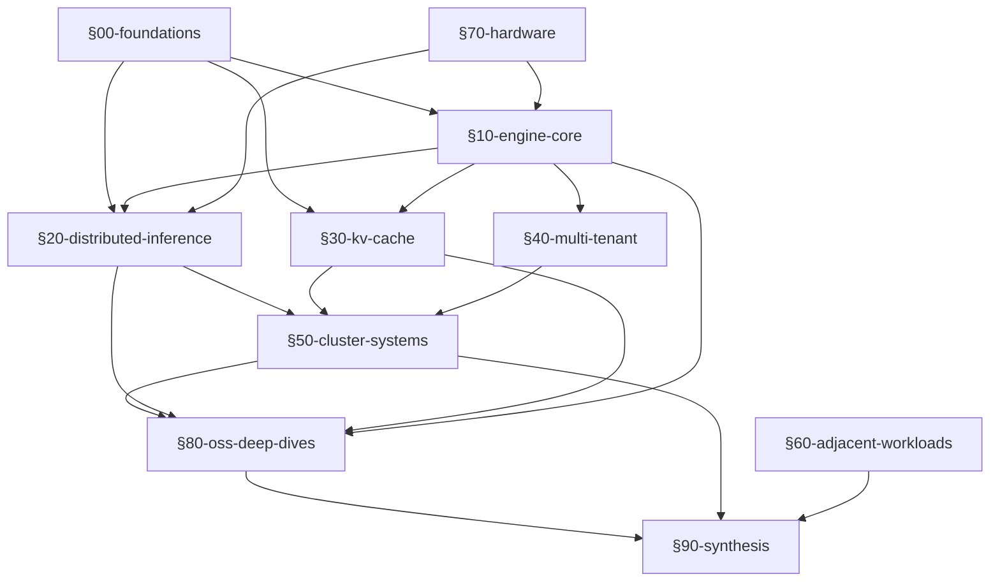

# LLM Inference Systems

A textbook-style survey of production LLM inference systems, compiled with Claude Code as a self-study project. GPU-centric. Inference-focused.

*Information current as of mid-2026. Technical errors and stale content are possible — verify critical claims against the cited primary sources. Issues and corrections welcome.*

Coverage spans the techniques, systems, and open-source engines that constitute production LLM inference as of mid-2026: from roofline models and attention kernels through disaggregated serving, KV offload, multi-tenant scheduling, and cluster-level routing. Hardware chapters cover the NVIDIA roadmap through Rubin, AMD CDNA 4, and major ASICs. OSS engine chapters go deep on vLLM V1, SGLang, TensorRT-LLM, Dynamo, and eight others.

**Prerequisites.** The reader is assumed to be fluent in transformers and attention, familiar with basic CUDA concepts (kernels, memory hierarchy, streaming multiprocessors), and aware of standard distributed-training parallelism (TP/PP/DP). The book does not introduce these topics — it builds on them.

---

## Quick-start

| Goal | Where to begin |
|---|---|
| Comprehensive read | Follow the table of contents below |
| Catch up on developments in 2025–2026 | See the [refresher path](#refresher-path) below; start with [TIMELINE.md](TIMELINE.md) |
| Look up a term | [glossary.md](glossary.md) — ~310 entries |
| Find a paper | [papers.md](papers.md) — ~800 entries organized topically |

---

## Table of contents

The book is organized in nine architectural sections plus a synthesis chapter, numbered in dependency order. Within each section, chapters are numbered in reading order. The [section dependency map](#section-dependency-map) below shows which sections depend on which.

### §00-foundations/

Required baseline. Every later chapter assumes this vocabulary.

- [§00/01 — The Inference Landscape](00-foundations/01-inference-landscape.md): TTFT, ITL, TPOT, goodput, workload taxonomy, MLPerf/HELM, hardware deployment landscape
- [§00/02 — Transformer Arithmetic and Roofline](00-foundations/02-transformer-arithmetic-roofline.md): FLOPs/bytes, KV memory math, arithmetic intensity, prefill vs. decode roofline
- [§00/03 — GPU Hardware Primer](00-foundations/03-gpu-hardware-primer.md): SM structure, memory hierarchy, NVLink (primer; full hardware coverage in [§70](#70-hardware))
- [§00/04 — Collectives and Comm Primer](00-foundations/04-collectives-and-comm-primer.md): NCCL all-reduce/all-gather/reduce-scatter/all-to-all; ring vs. tree; hierarchical (NVLink+IB); bandwidth/latency analysis

### §10-engine-core/

The priority section. Eight chapters on the techniques that constitute a modern inference engine. Skim [§70/01](70-hardware/01-nvidia-roadmap.md) and [§70/05](70-hardware/05-networking-fabric.md) first if hardware context is needed before the kernel and parallelism discussions.

- [§10/01 — Attention Kernels](10-engine-core/01-attention-kernels.md): FlashAttention 1→4 algorithm; Hopper/Blackwell hardware machinery; paged/sparse/quantized variants; Triton, CuTe-DSL, ThunderKittens, TileLang, AITER
- [§10/02 — Paged KV Memory](10-engine-core/02-paged-kv-memory.md): PagedAttention; vAttention; block manager design; fragmentation analysis
- [§10/03 — Batching and Scheduling](10-engine-core/03-batching-scheduling.md): Continuous batching (ORCA); chunked prefill (Sarathi/Sarathi-Serve); token-budget scheduling; TTFT/ITL trade-offs
- [§10/04 — Quantization](10-engine-core/04-quantization.md): 3-axis framework (what × format × calibration); INT4/8, FP8, FP4, MXFP4/NVFP4, NF4; GPTQ, AWQ, SmoothQuant, QuaRot, TurboQuant
- [§10/05 — Speculative Decoding](10-engine-core/05-speculative-decoding.md): Modified rejection sampling; tree verification (SpecInfer/Sequoia); self-spec (Medusa/EAGLE 1/2/3); training-free drafters; production paths
- [§10/06 — Multi-Token Prediction](10-engine-core/06-multi-token-prediction.md): MTP as auxiliary loss; DeepSeek-V3 sequential causal-chain form; MTP-as-drafter relationship to speculative decoding
- [§10/07 — Prompt Prefix Caching](10-engine-core/07-prompt-prefix-caching.md): Three reuse modes; RadixAttention; vLLM V1 hash-chained prefix caching; Hydragen; CacheBlend
- [§10/08 — CUDA Graphs and Compilation](10-engine-core/08-cuda-graphs-compilation.md): CUDA graph capture/replay; torch.compile+Inductor; vLLM piecewise CUDA graphs; cross-vendor compiler stack (MLIR, Triton, IREE, TVM, Mojo)

### §20-distributed-inference/

Five chapters on scaling beyond a single GPU. Read after §10-engine-core.

- [§20/01 — Parallelism Strategies](20-distributed-inference/01-parallelism-strategies.md): TP/PP/SP/EP/DP; DualPipe; NanoFlow
- [§20/02 — Prefill-Decode Disaggregation](20-distributed-inference/02-prefill-decode-disagg.md): Splitwise → DistServe → Mooncake → Dynamo; disaggregation taxonomy (PD/EPD/AFD); KV transport (NIXL, Mooncake TE); M/D/1 latency model
- [§20/03 — MoE Inference](20-distributed-inference/03-moe-inference.md): MoE basics; arch evolution; EP at scale; all-to-all (DeepEP); comp-comm overlap (DualPipe/FlashDMoE); EPLB; AFD
- [§20/04 — Long-Context Inference](20-distributed-inference/04-long-context-inference.md): RoPE variants; sequence parallelism (Ring/Ulysses/USP); sparse attention (NSA/DSA); long-ctx KV (Quest/MInference); hybrid Mamba-Transformer
- [§20/05 — Heterogeneous Inference](20-distributed-inference/05-heterogeneous-inference.md): FlexGen → PowerInfer → KTransformers lineage; mixed-GPU pipelining (Helix, HexGen-2, Tessera); cost-aware allocation (Mélange, Cauchy); decentralized (Petals)

### §30-kv-cache/

Three chapters on KV cache as a first-class system. Builds on §10/02 (PagedAttention) and §10/07 (prefix caching).

- [§30/01 — KV Compression](30-kv-cache/01-kv-compression.md): Eviction lineage (StreamingLLM → H2O → SnapKV → PyramidKV → learned eviction); KV quantization (KIVI/KVQuant/TurboQuant); low-rank (Eigen Attention, Loki, MiniCache)
- [§30/02 — KV Tiered Offload](30-kv-cache/02-kv-tiered-offload.md): 4-tier pyramid (HBM/DRAM/SSD/remote); NIXL/Mooncake TE/UCX/GDS; LMCache/Mooncake/AIBrix/SGLang HiCache/Dynamo KVBM; CacheGen/CacheBlend
- [§30/03 — Attention Variants](30-kv-cache/03-attention-variants.md): MQA/GQA/MLA taxonomy (with KV-size math); MLA absorption; sliding-window; hybrid Mamba-Transformer cache shapes; Mamba-3; YOCO; diffusion LM serving

### §40-multi-tenant/

Four chapters on serving many tenants on shared hardware. Can be read in parallel with §20.

- [§40/01 — LoRA Serving](40-multi-tenant/01-lora-serving.md): LoRA/DoRA/VeRA shapes; BGMV/SGMV/S-LoRA/Unified Paging; tiered adapter cache; heterogeneous-rank batching; LoRA+spec-dec
- [§40/02 — Multi-Model and GPU Sharing](40-multi-tenant/02-multi-model-and-gpu-sharing.md): AlpaServe; Llumnix live migration; ServerlessLLM; MIG/MPS/time-slicing; KAI Scheduler; fractional-GPU schedulers
- [§40/03 — Fairness, SLO, and Routing](40-multi-tenant/03-fairness-slo-routing.md): VTC (Virtual Token Counter); DLPM/D²LPM; SLO-aware routing (SOLA, JITServe); predictive scheduling (Andes, LTR)
- [§40/04 — Trust Boundaries and Isolation](40-multi-tenant/04-trust-boundaries-and-isolation.md): Confidential computing; GPU TEEs (H100/H200 CC mode, Blackwell, Phala, OpenRouter); KV-cache sanitization

### §50-cluster-systems/

Three chapters on operating an inference cluster. Best read after §20 and §40.

- [§50/01 — Router and Gateway](50-cluster-systems/01-router-gateway.md): Inference Gateway API (GIE); EPP (Endpoint Picker Protocol); KV-aware routing scoring; DualMap; Envoy AI Gateway; LiteLLM/Portkey
- [§50/02 — Autoscaling, Cost, and Sustainability](50-cluster-systems/02-autoscaling-cost-and-sustainability.md): KV-utilization/TTFT-prediction autoscaling signals; scale-to-zero (Fluid); cost/per-tenant accounting; energy-per-token; carbon-aware routing
- [§50/03 — Observability and Resilience](50-cluster-systems/03-observability-and-resilience.md): OpenTelemetry GenAI semconv; canonical metric set; fault tolerance; KV replication; chaos engineering

### §60-adjacent-workloads/

Seven chapters on workloads that compose with or extend LLM serving. Read selectively. §60/06 (RL infrastructure) benefits from reading §10/07 and §60/01 first.

- [§60/01 — Test-Time Compute](60-adjacent-workloads/01-test-time-compute.md): Reasoning-model serving; long-decode regime; branching (best-of-N/ToT/GoT); prefix-cache reuse for CoT; thinking-budget control
- [§60/02 — Structured Output and Tools](60-adjacent-workloads/02-structured-output-and-tools.md): 99%/1% mask split; Outlines → XGrammar lineage; jump-forward/coalescence; tool calling as schema-constrained JSON; structured-output × spec-dec
- [§60/03 — Multimodal Serving](60-adjacent-workloads/03-multimodal-serving.md): EPD workload model; image encoder caching; disagg MM (HydraInfer/ModServe); FastVLM; audio (Qwen-Omni); video (streaming); real-time voice pipelines
- [§60/04 — RAG Infrastructure](60-adjacent-workloads/04-rag-infrastructure.md): Ingest → embed → index → retrieve → rerank → generate; ANN families (HNSW/IVF-PQ/ScaNN/DiskANN); hybrid retrieval; late interaction (ColBERTv2); agentic RAG
- [§60/05 — Embedding and Reranker Serving](60-adjacent-workloads/05-embedding-reranker-serving.md): Token vs. request batching; TEI/Infinity/TRT-LLM; multi-vector (ColBERT/ColPali); Matryoshka+binary+4-bit; MMTEB/MTEB v2
- [§60/06 — RL Post-Training Infrastructure](60-adjacent-workloads/06-rl-post-training-infrastructure.md): Rollout engine as special-case inference; veRL/OpenRLHF/AReaL; GRPO+prefix-cache; reward model serving; long agentic rollouts; BF16 mismatch
- [§60/07 — Safety and Guard Serving](60-adjacent-workloads/07-safety-and-guard-serving.md): Safety classifiers (Constitutional Classifiers, Llama Guard 3); watermarking as logits-processor (SynthID-Text); prompt injection at infra layer (OWASP LLM01:2025)

### §70-hardware/

Five chapters on the silicon and fabric that hosts inference. §70/01 and §70/05 are referenced from §10 and §20 and are commonly skimmed early; the remaining chapters can be read as hardware context becomes relevant.

- [§70/01 — NVIDIA Roadmap](70-hardware/01-nvidia-roadmap.md): Hopper → Blackwell → Rubin; NVFP4/MXFP4; GW-scale economics
- [§70/02 — AMD and Non-NVIDIA GPU](70-hardware/02-amd-and-non-nvidia-gpu.md): MI300X/MI355X/MI400; ROCm+vLLM gap; Intel Gaudi
- [§70/03 — ASICs: Hyperscaler](70-hardware/03-asics-hyperscaler.md): Google TPU v5/v6/v7; AWS Trainium2/3; Meta MTIA; Microsoft Maia
- [§70/04 — ASICs: Startup](70-hardware/04-asics-startup.md): Groq LPU/LPX; Cerebras WSE-3; SambaNova SN40L/SN50; Tenstorrent; Furiosa; Etched Sohu
- [§70/05 — Networking Fabric](70-hardware/05-networking-fabric.md): NVLink+NVSwitch generations; IB NDR/XDR; Spectrum-X; Ultra Ethernet; UALink; GPUDirect RDMA/Storage; CPO photonics

### §80-oss-deep-dives/

Eleven chapters on the open-source engines and orchestrators that ship LLM inference. Start with the overview and decision guide; read individual engine chapters as needed.

- [§80/00 — Overview and Comparison](80-oss-deep-dives/00-overview-comparison.md): Feature matrix across all engines; selection decision guide
- [§80/01 — vLLM](80-oss-deep-dives/01-vllm.md): V1 architecture (EngineCore/Scheduler/KVCacheManager/Worker/ModelRunner); FA3→FA4; LoRA (Punica/Triton SGMV); spec-dec; piecewise CUDA graphs; V0→V1 sidebar
- [§80/02 — SGLang](80-oss-deep-dives/02-sglang.md): RadixAttention/HiCache; large-EP (DeepEP/EPLB/ElasticEP); MLA; zero-overhead overlap scheduler; EAGLE3+TBO; Rust gateway
- [§80/03 — TensorRT-LLM](80-oss-deep-dives/03-tensorrt-llm.md): Dual frontends; in-flight batching; FMHA/MMHA/XQA/MLA kernels; ConfigurableMoE; DWDP; spec-dec roster; three disagg paths; AutoDeploy
- [§80/04 — LMCache](80-oss-deep-dives/04-lmcache.md): 8-tier storage stack; CacheEngineKey; CacheGen arithmetic coding; vLLM V1 KVConnector integration
- [§80/05 — NVIDIA Dynamo](80-oss-deep-dives/05-nvidia-dynamo.md): Three planes (request/control/storage); KV router; KVBM G1–G4; GAIE; Grove gang scheduler; five CRDs
- [§80/06 — llm-d](80-oss-deep-dives/06-llm-d.md): EPP plugin chain (Filter→Score→Pick); three pickers; GIE reference impl; CNCF Sandbox (March 2026)
- [§80/07 — AIBrix](80-oss-deep-dives/07-aibrix.md): 8 CRDs; L1+L2 KV offloading; APA autoscaler; StormService; VTC fairness; ModelAdapter LoRA registry
- [§80/08 — Mooncake](80-oss-deep-dives/08-mooncake.md): TransferEngine multi-NIC RDMA; MasterService; PutStart/PutEnd; HA via etcd; Mooncake-EP (IBGDA); Mooncake-PG; FAST '25
- [§80/09 — llama.cpp and Edge](80-oss-deep-dives/09-llama-cpp-and-edge.md): GGUF V3; ggml backend registry; K-quants/IQ-quants; MLX (lazy graph, unified memory); mistral.rs
- [§80/10 — Others](80-oss-deep-dives/10-others.md): ktransformers (SGLang kernel library since Oct 2025); lmdeploy; Modular MAX; TGI; DeepSpeed-MII; LoRAX

### §90-synthesis/

- [§90/01 — Production Stack Recipes](90-synthesis/01-production-stack-recipes.md): Capstone. Three reference stacks from ingress to token egress — frontier-MoE on GB200, cost-optimized dense on H100, reasoning + RL post-training.

---

## Refresher path

For readers already familiar with the foundations who want to orient on what changed in 2025–2026:

1. [TIMELINE.md](TIMELINE.md) — 60-second anchor for when each major technique or release landed.
2. Each chapter's `## Current production state` callout — the per-chapter executive summary.
3. `## Past 12 months SOTA` sections in individual chapters for depth on specific advances.

---

## Section dependency map

---

## Reference documents

| Document | Contents |
|---|---|
| [papers.md](papers.md) | Master bibliography of roughly 800 entries, organized topically; cited throughout the text by citation key. |
| [glossary.md](glossary.md) | ~310 terminology entries. Look here first when a term is unfamiliar. |
| [TIMELINE.md](TIMELINE.md) | 2024–2026 milestone sidebar. Anchors when key papers landed and techniques became production-grade. |
